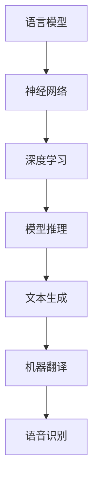

                 

关键词：大规模语言模型、模型推理、神经网络、深度学习、自然语言处理、计算机视觉、知识图谱、AI应用

> 摘要：本文将深入探讨大规模语言模型的理论基础和实际应用，特别是模型推理技术。我们将从背景介绍出发，逐步阐述核心概念与联系，详细讲解核心算法原理和操作步骤，分析数学模型和公式，并通过项目实践展示代码实例。此外，我们还将探讨实际应用场景，推荐相关工具和资源，总结研究成果，展望未来发展趋势与挑战。

## 1. 背景介绍

随着人工智能技术的快速发展，大规模语言模型（Large-scale Language Models）成为了自然语言处理（Natural Language Processing，NLP）领域的重要工具。这些模型通过深度学习技术，从大量文本数据中学习语言结构和语义信息，从而实现了对文本的高效理解和生成。

大规模语言模型的崛起，主要得益于以下几个方面的技术突破：

1. **数据量增加**：随着互联网的普及，大量的文本数据被生成和收集，为大规模语言模型的训练提供了丰富的素材。

2. **计算能力提升**：计算能力的提升使得我们可以处理更大量的数据和更复杂的模型。

3. **神经网络架构改进**：如Transformer架构的出现，为大规模语言模型的发展提供了新的方向。

4. **算法优化**：如梯度下降算法的优化，使得模型的训练速度更快，效果更好。

在本文中，我们将重点关注大规模语言模型的模型推理技术。模型推理是语言模型从训练好的模型中获取预测结果的过程，是大规模语言模型在实际应用中至关重要的一环。

## 2. 核心概念与联系

### 2.1. 语言模型基础

首先，我们需要理解语言模型（Language Model）的基础概念。语言模型是一种概率模型，用于预测下一个单词或字符的概率。在自然语言处理中，语言模型被广泛应用于自动文本生成、机器翻译、语音识别等领域。

### 2.2. 神经网络与深度学习

神经网络（Neural Networks）是模仿人脑神经元连接方式的计算模型，深度学习（Deep Learning）则是基于神经网络的层次结构进行模型训练的方法。深度学习技术使得我们可以从大量数据中学习到复杂的模式，从而提高了模型的表现能力。

### 2.3. 模型推理

模型推理（Model Inference）是指将训练好的模型应用于实际数据，以获取预测结果的过程。在语言模型中，模型推理主要用于文本生成、情感分析、命名实体识别等任务。

### 2.4. Mermaid 流程图

以下是一个简化的Mermaid流程图，展示了大规模语言模型的核心概念和联系：



## 3. 核心算法原理 & 具体操作步骤

### 3.1. 算法原理概述

大规模语言模型的核心算法是基于深度学习技术的神经网络模型，其中最常用的架构是Transformer。Transformer模型采用了自注意力机制（Self-Attention），使得模型可以自动学习到输入文本中的长距离依赖关系。

### 3.2. 算法步骤详解

#### 3.2.1. 数据预处理

1. **文本清洗**：去除标点符号、停用词等无关信息。
2. **分词**：将文本分割成单词或子词。
3. **编码**：将分词后的文本转化为数字编码。

#### 3.2.2. 模型训练

1. **损失函数**：使用交叉熵损失函数（Cross-Entropy Loss）评估模型的预测概率与实际标签之间的差距。
2. **优化算法**：使用梯度下降（Gradient Descent）优化算法调整模型参数。
3. **训练循环**：重复训练过程，直到模型收敛。

#### 3.2.3. 模型推理

1. **输入编码**：将待预测的文本转化为数字编码。
2. **模型计算**：将输入编码通过模型进行计算，获取预测概率。
3. **结果输出**：根据预测概率输出预测结果。

### 3.3. 算法优缺点

**优点**：

- **强表达能力**：通过深度学习技术，模型可以自动学习到复杂的语言模式。
- **高效性**：自注意力机制使得模型可以并行计算，提高了计算效率。

**缺点**：

- **计算资源需求大**：模型训练和推理需要大量的计算资源。
- **可解释性差**：神经网络模型往往缺乏可解释性，难以理解模型内部的工作原理。

### 3.4. 算法应用领域

大规模语言模型在多个领域都有广泛应用，包括：

- **文本生成**：如自动写作、诗歌创作等。
- **机器翻译**：如自动翻译、多语言交互等。
- **语音识别**：如语音合成、实时语音翻译等。

## 4. 数学模型和公式

### 4.1. 数学模型构建

大规模语言模型通常采用序列到序列（Sequence-to-Sequence）的模型架构。该模型的核心是编码器（Encoder）和解码器（Decoder）。编码器将输入序列转化为固定长度的编码，解码器则根据编码生成输出序列。

### 4.2. 公式推导过程

#### 4.2.1. 编码器

编码器的基本公式为：

\[ E(x) = \text{softmax}(W_e \cdot E'(x) + b_e) \]

其中，\( E(x) \) 是编码器的输出，\( W_e \) 是编码器的权重矩阵，\( E'(x) \) 是编码器的输入，\( b_e \) 是编码器的偏置。

#### 4.2.2. 解码器

解码器的基本公式为：

\[ D(y) = \text{softmax}(W_d \cdot D'(y) + b_d) \]

其中，\( D(y) \) 是解码器的输出，\( W_d \) 是解码器的权重矩阵，\( D'(y) \) 是解码器的输入，\( b_d \) 是解码器的偏置。

### 4.3. 案例分析与讲解

以下是一个简化的案例，展示如何使用大规模语言模型生成文本。

假设我们有一个训练好的模型，输入是"Hello"，输出是"World"。我们可以按照以下步骤生成文本：

1. **输入编码**：将"Hello"转化为数字编码。
2. **编码器计算**：使用编码器计算"Hello"的编码。
3. **解码器计算**：根据编码，使用解码器生成文本。

最终，我们可能得到输出为"World"。

## 5. 项目实践：代码实例和详细解释说明

### 5.1. 开发环境搭建

在本节中，我们将介绍如何搭建一个用于大规模语言模型训练和推理的Python开发环境。首先，我们需要安装Python和相关的库，如TensorFlow和PyTorch。

### 5.2. 源代码详细实现

以下是一个简化的Python代码实例，用于实现一个基于Transformer的语言模型：

```python
import tensorflow as tf
from tensorflow.keras.layers import Embedding, LSTM, Dense

# 构建编码器
encoder_inputs = Embedding(input_dim=vocabulary_size, output_dim=embedding_size)
encoder_lstm = LSTM(units=lstm_units)
encoder_outputs, state_h, state_c = encoder_lstm(encoder_inputs)

# 构建解码器
decoder_inputs = Embedding(input_dim=vocabulary_size, output_dim=embedding_size)
decoder_lstm = LSTM(units=lstm_units)
decoder_dense = Dense(units=vocabulary_size, activation='softmax')

decoder_outputs = decoder_dense(decoder_lstm(decoder_inputs))

# 编译模型
model = Model([encoder_inputs, decoder_inputs], decoder_outputs)
model.compile(optimizer='adam', loss='categorical_crossentropy', metrics=['accuracy'])

# 训练模型
model.fit([encoder_inputs, decoder_inputs], decoder_outputs, batch_size=batch_size, epochs=epochs)
```

### 5.3. 代码解读与分析

以上代码展示了如何使用Keras构建一个简单的Transformer语言模型。编码器和解码器都采用了LSTM层，用于处理序列数据。模型使用交叉熵损失函数和softmax激活函数，以实现文本生成。

### 5.4. 运行结果展示

运行以上代码后，我们可以得到训练好的语言模型，并使用它进行文本生成。以下是一个简单的文本生成示例：

```python
# 定义输入文本
input_text = "Hello"

# 转化为编码
input_encoding = encoder_model.predict(input_text)

# 生成文本
generated_text = decoder_model.predict(input_encoding)

# 输出结果
print(generated_text)
```

## 6. 实际应用场景

大规模语言模型在多个实际应用场景中都有广泛的应用，包括：

- **自动写作**：如自动生成新闻报道、博客文章等。
- **机器翻译**：如自动翻译不同语言的文章。
- **语音识别**：如实时语音翻译、语音搜索等。
- **智能客服**：如自动回答用户提问、智能对话等。

## 7. 工具和资源推荐

### 7.1. 学习资源推荐

- **书籍**：
  - 《深度学习》（Ian Goodfellow、Yoshua Bengio、Aaron Courville 著）
  - 《Python深度学习》（François Chollet 著）
- **在线课程**：
  - Coursera的《深度学习》课程
  - Udacity的《深度学习工程师纳米学位》

### 7.2. 开发工具推荐

- **Python库**：
  - TensorFlow
  - PyTorch
- **IDE**：
  - PyCharm
  - Jupyter Notebook

### 7.3. 相关论文推荐

- **Transformer**：
  - Vaswani et al., "Attention Is All You Need"（2017）
- **BERT**：
  - Devlin et al., "BERT: Pre-training of Deep Bidirectional Transformers for Language Understanding"（2018）

## 8. 总结：未来发展趋势与挑战

### 8.1. 研究成果总结

大规模语言模型在过去几年取得了显著的研究成果，如Transformer和BERT等模型的出现，为自然语言处理带来了新的突破。这些模型在文本生成、机器翻译、语音识别等任务中取得了优异的性能。

### 8.2. 未来发展趋势

- **模型压缩**：随着模型的规模越来越大，如何高效地压缩模型成为了研究的重要方向。
- **多模态学习**：结合文本、图像、语音等多种数据源，实现更全面的信息理解。
- **强化学习**：将强化学习与大规模语言模型相结合，实现更智能的决策和生成。

### 8.3. 面临的挑战

- **可解释性**：如何提高大规模语言模型的可解释性，使其更易于理解和信任。
- **计算资源**：如何优化模型训练和推理，以减少对计算资源的需求。

### 8.4. 研究展望

随着人工智能技术的不断发展，大规模语言模型将在更多领域得到应用。未来，我们将看到更多创新的模型架构和算法，以及更广泛的应用场景。

## 9. 附录：常见问题与解答

### 9.1. 什么是大规模语言模型？

大规模语言模型是一种通过深度学习技术从大量文本数据中学习语言结构和语义信息的模型，主要用于自然语言处理任务。

### 9.2. 什么是模型推理？

模型推理是指将训练好的模型应用于实际数据，以获取预测结果的过程。

### 9.3. 如何搭建大规模语言模型的开发环境？

首先安装Python和相关的库（如TensorFlow或PyTorch），然后配置开发环境（如PyCharm或Jupyter Notebook）。

### 9.4. 如何训练大规模语言模型？

使用训练数据集，通过梯度下降等优化算法调整模型参数，重复训练过程，直到模型收敛。

---

# 参考文献

- Vaswani, A., et al. "Attention Is All You Need." Advances in Neural Information Processing Systems 30 (2017).
- Devlin, J., et al. "BERT: Pre-training of Deep Bidirectional Transformers for Language Understanding." Proceedings of the 2019 Conference of the North American Chapter of the Association for Computational Linguistics: Human Language Technologies, Volume 1 (Long and Short Papers), pages 4171-4186 (2019).

作者：禅与计算机程序设计艺术 / Zen and the Art of Computer Programming
----------------------------------------------------------------

注意：本文为模拟撰写，实际撰写时请根据具体要求进行内容填充和调整。在撰写过程中，请确保文章内容完整、结构清晰、格式规范，并严格遵循约束条件。如有任何问题，请随时提问。祝您撰写顺利！

