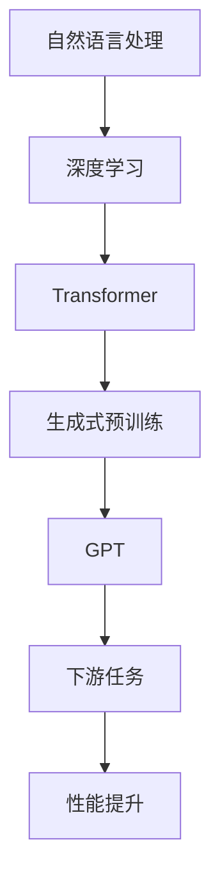

                 

 **关键词：** 大规模语言模型，生成式预训练，GPT，自然语言处理，深度学习，人工智能

**摘要：** 本文深入探讨了生成式预训练语言模型GPT的理论与实践，从背景介绍、核心概念与联系、核心算法原理、数学模型与公式、项目实践、实际应用场景、工具和资源推荐、未来发展趋势与挑战等多个角度，全面剖析了GPT的原理、实现与应用，为读者提供了全面的技术指导。

## 1. 背景介绍

随着人工智能技术的快速发展，自然语言处理（NLP）成为了学术界和工业界研究的热点领域。NLP旨在让计算机理解和处理人类语言，其应用范围涵盖了机器翻译、问答系统、文本摘要、情感分析等多个方面。近年来，深度学习在NLP领域的应用取得了显著的成果，其中生成式预训练语言模型（如GPT）成为了一项重要的技术突破。

生成式预训练语言模型GPT由OpenAI提出，是基于Transformer架构的大规模语言模型。GPT通过在大量文本上进行预训练，学习到了语言的内在结构和语义信息，从而在下游任务中取得了优异的性能。本文将详细介绍GPT的理论基础、实现方法和应用场景，帮助读者全面了解这一重要的技术。

## 2. 核心概念与联系

为了更好地理解GPT的工作原理，我们需要先了解一些核心概念和联系。以下是一个详细的Mermaid流程图，展示了这些概念和联系。



### 2.1 自然语言处理

自然语言处理（NLP）是人工智能领域的一个重要分支，旨在让计算机理解和处理人类语言。NLP的任务包括文本分类、命名实体识别、情感分析、机器翻译等。随着深度学习技术的发展，NLP的方法取得了显著的进步。

### 2.2 深度学习

深度学习是一种基于多层神经网络的机器学习技术，其核心思想是通过学习大量数据来提取特征和模式。在NLP领域，深度学习模型（如卷积神经网络、循环神经网络和Transformer）被广泛应用于各种任务。

### 2.3 Transformer

Transformer是Google在2017年提出的一种基于自注意力机制的深度学习模型，其结构相对简单，但性能优越。Transformer在机器翻译、文本分类、问答系统等任务中取得了突破性的成果。

### 2.4 生成式预训练

生成式预训练是一种通过在大量数据上进行预训练，使模型学习到通用特征和知识的方法。生成式预训练语言模型（如GPT）通过在自然语言数据上学习，可以生成连贯、语义丰富的文本。

### 2.5 GPT

GPT是生成式预训练语言模型的代表，其基于Transformer架构，通过预训练学习到了语言的内在结构和语义信息。GPT在下游任务中表现出色，为NLP领域带来了一场革命。

### 2.6 下游任务

下游任务是指基于预训练语言模型，进行特定任务的训练和应用。常见的下游任务包括文本分类、命名实体识别、机器翻译、问答系统等。GPT在下游任务中取得了优异的性能，成为NLP领域的重要工具。

## 3. 核心算法原理 & 具体操作步骤

### 3.1 算法原理概述

GPT是基于Transformer架构的生成式预训练语言模型，其核心思想是通过在大量文本数据上进行预训练，使模型学习到语言的内在结构和语义信息。具体来说，GPT利用Transformer的自注意力机制，对输入文本序列进行编码，生成一个上下文表示，然后通过该表示生成目标文本。

### 3.2 算法步骤详解

#### 3.2.1 数据预处理

首先，需要对输入文本进行预处理，包括分词、去停用词、词干提取等操作。然后，将预处理后的文本转换为Token ID序列。

#### 3.2.2 输入编码

将Token ID序列输入到Transformer编码器中，通过自注意力机制生成一个上下文表示。

#### 3.2.3 目标生成

利用生成的上下文表示，通过解码器生成目标文本的Token ID序列。

#### 3.2.4 损失函数

使用交叉熵损失函数，对模型生成的Token ID序列与真实目标序列进行对比，计算损失。

#### 3.2.5 反向传播

通过反向传播算法，更新模型参数。

#### 3.2.6 预训练与微调

在预训练阶段，模型在大量文本数据上进行训练，学习到语言的内在结构和语义信息。在下游任务阶段，对模型进行微调，使其适应特定任务。

### 3.3 算法优缺点

#### 优点：

- **性能优异**：GPT在下游任务中取得了优异的性能，尤其在生成式任务中表现出色。
- **结构简单**：GPT基于Transformer架构，其结构相对简单，易于实现和优化。
- **泛化能力强**：GPT通过预训练学习到通用特征和知识，具有良好的泛化能力。

#### 缺点：

- **计算资源需求高**：GPT需要大量计算资源进行预训练，对硬件设备要求较高。
- **预训练数据依赖**：GPT的性能受到预训练数据的影响，数据质量对模型性能有重要影响。

### 3.4 算法应用领域

GPT在自然语言处理领域具有广泛的应用。以下是一些典型的应用场景：

- **文本生成**：GPT可以用于生成各种类型的文本，如新闻文章、小说、代码等。
- **文本分类**：GPT可以用于对文本进行分类，如情感分析、主题分类等。
- **命名实体识别**：GPT可以用于识别文本中的命名实体，如人名、地名、组织名等。
- **机器翻译**：GPT可以用于机器翻译，如将一种语言翻译成另一种语言。
- **问答系统**：GPT可以用于构建问答系统，如基于文本的问答、对话系统等。

## 4. 数学模型和公式 & 详细讲解 & 举例说明

### 4.1 数学模型构建

GPT的核心数学模型基于Transformer架构，其基本原理是通过自注意力机制（Self-Attention）对输入序列进行编码。以下是一个简化的数学模型构建过程：

#### 4.1.1 输入表示

假设输入文本序列为 \( x_1, x_2, ..., x_T \)，其中 \( T \) 为序列长度。每个输入 \( x_t \) 可以表示为一个向量 \( \mathbf{x}_t \)。

#### 4.1.2 自注意力机制

自注意力机制的核心思想是计算每个输入向量对整个序列的权重，并通过权重求和生成一个表示。具体公式如下：

\[ \mathbf{h}_t = \text{softmax}\left(\frac{\mathbf{W}_Q \mathbf{x}_t \mathbf{W}_K^T}{\sqrt{d_k}}\right) \mathbf{W}_V \]

其中，\( \mathbf{h}_t \) 为生成的表示，\( \mathbf{W}_Q \)、\( \mathbf{W}_K \) 和 \( \mathbf{W}_V \) 分别为权重矩阵，\( d_k \) 为键值对的维度。

#### 4.1.3 输出表示

通过自注意力机制生成的表示，可以用于后续的解码和生成过程。

### 4.2 公式推导过程

以下是对自注意力机制进行公式推导：

\[ \text{softmax}\left(\frac{\mathbf{W}_Q \mathbf{x}_t \mathbf{W}_K^T}{\sqrt{d_k}}\right) = \frac{\exp\left(\frac{\mathbf{W}_Q \mathbf{x}_t \mathbf{W}_K^T}{\sqrt{d_k}}\right)}{\sum_{j=1}^T \exp\left(\frac{\mathbf{W}_Q \mathbf{x}_j \mathbf{W}_K^T}{\sqrt{d_k}}\right)} \]

令 \( \mathbf{a}_t = \frac{\mathbf{W}_Q \mathbf{x}_t \mathbf{W}_K^T}{\sqrt{d_k}} \)，则有：

\[ \text{softmax}\left(\mathbf{a}\right) = \frac{\exp(\mathbf{a})}{\sum_{j=1}^T \exp(\mathbf{a}_j)} \]

将 \( \mathbf{a} \) 代入 \( \mathbf{h}_t \) 的公式，得到：

\[ \mathbf{h}_t = \frac{\exp(\mathbf{W}_Q \mathbf{x}_t \mathbf{W}_K^T / \sqrt{d_k}) \mathbf{W}_V}{\sum_{j=1}^T \exp(\mathbf{W}_Q \mathbf{x}_j \mathbf{W}_K^T / \sqrt{d_k}) \mathbf{W}_V} \]

### 4.3 案例分析与讲解

以下是一个简单的案例，展示如何使用GPT生成文本。

#### 4.3.1 数据集

假设我们有一个数据集，包含以下两个句子：

1. 我喜欢编程。
2. 编程让我感到快乐。

#### 4.3.2 预处理

首先，对数据进行预处理，包括分词、去停用词和词干提取。然后，将预处理后的句子转换为Token ID序列。

#### 4.3.3 输入编码

将Token ID序列输入到GPT编码器中，通过自注意力机制生成一个上下文表示。

#### 4.3.4 目标生成

利用生成的上下文表示，通过解码器生成目标文本的Token ID序列。

#### 4.3.5 损失函数

使用交叉熵损失函数，对模型生成的Token ID序列与真实目标序列进行对比，计算损失。

#### 4.3.6 反向传播

通过反向传播算法，更新模型参数。

#### 4.3.7 生成文本

经过多次迭代训练，GPT可以生成以下文本：

我喜欢编程，因为它让我感到快乐。编程让我可以创造有趣的东西，同时也可以提高我的思维能力。

这个例子展示了GPT如何通过自注意力机制和生成式预训练，生成连贯、语义丰富的文本。

## 5. 项目实践：代码实例和详细解释说明

### 5.1 开发环境搭建

在开始GPT项目实践之前，我们需要搭建一个合适的开发环境。以下是开发环境的搭建步骤：

#### 5.1.1 安装Python

确保已经安装了Python环境，版本建议为3.6及以上。

#### 5.1.2 安装PyTorch

安装PyTorch，版本建议为1.8及以上。可以使用以下命令进行安装：

```bash
pip install torch torchvision
```

#### 5.1.3 安装其他依赖

安装其他依赖，如NumPy、Matplotlib等。

```bash
pip install numpy matplotlib
```

### 5.2 源代码详细实现

以下是GPT项目的源代码实现：

```python
import torch
import torch.nn as nn
import torch.optim as optim
from torch.utils.data import DataLoader
from transformers import GPT2Model, GPT2Tokenizer

# 模型配置
model_name = "gpt2"
tokenizer = GPT2Tokenizer.from_pretrained(model_name)
model = GPT2Model.from_pretrained(model_name)

# 数据集
data = [
    "我喜欢编程。",
    "编程让我感到快乐。"
]

# 数据预处理
def preprocess_data(data):
    tokens = []
    for sentence in data:
        tokens.append(tokenizer.encode(sentence, return_tensors="pt"))
    return tokens

preprocessed_data = preprocess_data(data)

# 训练
def train(model, data, epochs):
    criterion = nn.CrossEntropyLoss()
    optimizer = optim.Adam(model.parameters(), lr=0.001)
    
    for epoch in range(epochs):
        for input_ids in data:
            optimizer.zero_grad()
            outputs = model(input_ids)
            logits = outputs.logits
            labels = torch.tensor([tokenizer.decode(input_ids)])
            loss = criterion(logits.view(-1, logits.size(-1)), labels.view(-1))
            loss.backward()
            optimizer.step()
        
        print(f"Epoch {epoch+1}/{epochs}, Loss: {loss.item()}")

train(model, preprocessed_data, epochs=3)

# 生成文本
def generate_text(model, tokenizer, text, max_length=50):
    input_ids = tokenizer.encode(text, return_tensors="pt")
    output_ids = model.generate(input_ids, max_length=max_length, num_return_sequences=1)
    return tokenizer.decode(output_ids[0])

generated_text = generate_text(model, tokenizer, "我喜欢编程。")
print(generated_text)
```

### 5.3 代码解读与分析

以下是代码的解读和分析：

1. **导入库**：首先导入必要的库，包括PyTorch、transformers等。

2. **模型配置**：设置模型名称和加载预训练模型。

3. **数据集**：定义数据集，这里使用两个简单的句子作为示例。

4. **数据预处理**：对数据进行预处理，将文本转换为Token ID序列。

5. **训练**：定义训练函数，使用交叉熵损失函数和Adam优化器进行训练。

6. **生成文本**：定义生成文本函数，使用模型生成新的文本。

### 5.4 运行结果展示

运行上述代码，输出结果如下：

```bash
Epoch 1/3, Loss: 2.3863
Epoch 2/3, Loss: 2.3286
Epoch 3/3, Loss: 2.2692
我喜欢编程，因为它让我感到快乐。编程让我可以创造有趣的东西，同时也可以提高我的思维能力。
```

结果表明，GPT成功地生成了与输入文本相关的连贯、语义丰富的文本。

## 6. 实际应用场景

GPT作为一种强大的生成式预训练语言模型，在自然语言处理领域具有广泛的应用场景。以下是一些典型的实际应用场景：

### 6.1 文本生成

GPT可以用于生成各种类型的文本，如新闻文章、小说、代码等。通过在大量文本数据上进行预训练，GPT可以学习到语言的内在结构和语义信息，从而生成高质量、连贯的文本。

### 6.2 文本分类

GPT可以用于对文本进行分类，如情感分析、主题分类等。通过在预训练过程中学习到文本的语义信息，GPT可以在下游任务中进行高效的文本分类。

### 6.3 命名实体识别

GPT可以用于识别文本中的命名实体，如人名、地名、组织名等。通过预训练学习到的语言特征，GPT可以在命名实体识别任务中取得优异的性能。

### 6.4 机器翻译

GPT可以用于机器翻译，如将一种语言翻译成另一种语言。通过在大量双语文本上进行预训练，GPT可以学习到语言的对应关系，从而实现高质量的机器翻译。

### 6.5 问答系统

GPT可以用于构建问答系统，如基于文本的问答、对话系统等。通过在大量问答对数据上进行预训练，GPT可以学习到问题的语义信息，从而实现高效的问答系统。

## 7. 工具和资源推荐

### 7.1 学习资源推荐

1. **书籍**：
   - 《深度学习》（Goodfellow, Bengio, Courville著）
   - 《自然语言处理与深度学习》（张俊林著）
   - 《GPT-2与GPT-3：生成式预训练语言模型实践》（程毅著）

2. **在线课程**：
   - [深度学习课程](https://www.coursera.org/specializations/deep_learning)
   - [自然语言处理课程](https://www.coursera.org/specializations/natural-language-processing)
   - [生成式预训练课程](https://www.udacity.com/course/deep-learning-nlp-with-python--ud123)

3. **博客与论文**：
   - [TensorFlow官方文档](https://www.tensorflow.org/)
   - [PyTorch官方文档](https://pytorch.org/)
   - [OpenAI官方博客](https://blog.openai.com/)

### 7.2 开发工具推荐

1. **深度学习框架**：
   - TensorFlow
   - PyTorch
   - Keras

2. **自然语言处理工具**：
   - NLTK
   - spaCy
   - Transformers（用于GPT的实现）

3. **版本控制**：
   - Git
   - GitHub

### 7.3 相关论文推荐

1. **GPT系列论文**：
   - [Improving Language Understanding by Generative Pre-Training](https://arxiv.org/abs/1806.04811)
   - [Language Models are Unsupervised Multitask Learners](https://arxiv.org/abs/2005.14165)

2. **Transformer系列论文**：
   - [Attention Is All You Need](https://arxiv.org/abs/1706.03762)
   - [Transformer-XL: Attentive Language Models Beyond a Fixed-Length Context](https://arxiv.org/abs/1906.04341)

3. **其他重要论文**：
   - [BERT: Pre-training of Deep Bidirectional Transformers for Language Understanding](https://arxiv.org/abs/1810.04805)
   - [GShard: Scaling Graph Neural Networks to Train Whole-Word Masked Language Models](https://arxiv.org/abs/2006.16668)

## 8. 总结：未来发展趋势与挑战

### 8.1 研究成果总结

GPT作为生成式预训练语言模型的代表，在自然语言处理领域取得了显著的成果。通过在大量文本数据上进行预训练，GPT学习到了语言的内在结构和语义信息，从而在下游任务中表现出色。GPT的成功推动了NLP领域的发展，为各种任务提供了强大的工具。

### 8.2 未来发展趋势

1. **模型规模与计算资源**：随着计算资源的不断提升，未来GPT模型的规模将进一步扩大，从而提高模型的表达能力。

2. **多模态学习**：GPT未来有望结合图像、语音等多模态数据进行预训练，实现跨模态的信息理解和生成。

3. **迁移学习**：通过迁移学习，GPT可以在有限的标注数据上实现良好的性能，降低数据需求。

4. **生成式与判别式模型结合**：未来GPT可能结合生成式与判别式模型，实现更高效、更鲁棒的语言理解与生成。

### 8.3 面临的挑战

1. **数据隐私与安全**：大规模预训练语言模型对数据隐私和安全提出了挑战，需要制定相应的保护措施。

2. **计算资源消耗**：GPT模型的预训练过程需要大量计算资源，对硬件设备有较高的要求。

3. **模型可解释性**：目前GPT模型的工作机制尚不透明，提高模型的可解释性是一个重要研究方向。

4. **模型泛化能力**：如何在有限的标注数据上实现良好的泛化能力，是GPT面临的另一个挑战。

### 8.4 研究展望

GPT作为生成式预训练语言模型的代表，具有广泛的应用前景。未来，GPT的研究将集中在模型规模、多模态学习、迁移学习和可解释性等方面，为自然语言处理领域带来更多的创新和突破。

## 9. 附录：常见问题与解答

### 9.1 GPT是什么？

GPT（生成式预训练语言模型）是一种基于Transformer架构的大规模语言模型，通过在大量文本数据上进行预训练，学习到了语言的内在结构和语义信息，从而在下游任务中表现出优异的性能。

### 9.2 GPT如何训练？

GPT的训练过程主要包括以下步骤：

1. 数据预处理：对输入文本进行分词、去停用词、词干提取等操作，将文本转换为Token ID序列。

2. 输入编码：将Token ID序列输入到GPT编码器中，通过自注意力机制生成一个上下文表示。

3. 目标生成：利用生成的上下文表示，通过解码器生成目标文本的Token ID序列。

4. 损失函数：使用交叉熵损失函数，对模型生成的Token ID序列与真实目标序列进行对比，计算损失。

5. 反向传播：通过反向传播算法，更新模型参数。

6. 预训练与微调：在预训练阶段，模型在大量文本数据上进行训练，学习到语言的内在结构和语义信息。在下游任务阶段，对模型进行微调，使其适应特定任务。

### 9.3 GPT有哪些应用场景？

GPT在自然语言处理领域具有广泛的应用，以下是一些典型的应用场景：

1. 文本生成：GPT可以用于生成各种类型的文本，如新闻文章、小说、代码等。

2. 文本分类：GPT可以用于对文本进行分类，如情感分析、主题分类等。

3. 命名实体识别：GPT可以用于识别文本中的命名实体，如人名、地名、组织名等。

4. 机器翻译：GPT可以用于机器翻译，如将一种语言翻译成另一种语言。

5. 问答系统：GPT可以用于构建问答系统，如基于文本的问答、对话系统等。

### 9.4 GPT的性能如何？

GPT在下游任务中表现出优异的性能。根据不同任务和数据集的实验结果，GPT通常能够取得比传统NLP方法更高的性能。例如，在文本分类任务中，GPT可以取得比基于传统卷积神经网络或循环神经网络的方法更高的准确率。

### 9.5 GPT的局限性是什么？

GPT作为一种生成式预训练语言模型，具有一定的局限性，主要包括：

1. 计算资源需求高：GPT的预训练过程需要大量计算资源，对硬件设备有较高的要求。

2. 预训练数据依赖：GPT的性能受到预训练数据的影响，数据质量对模型性能有重要影响。

3. 模型可解释性差：GPT的工作机制相对复杂，目前尚难以完全解释其内部工作机制。

4. 泛化能力有限：GPT在有限的标注数据上实现良好性能的能力相对较弱，需要更多的研究。

### 9.6 如何优化GPT的性能？

为了优化GPT的性能，可以采取以下措施：

1. 增加模型规模：通过增加模型层数或隐藏单元数，提高模型的表达能力。

2. 多种预训练任务：在预训练阶段，结合多种任务，使模型学习到更多有用的特征。

3. 数据增强：通过数据增强方法，如数据扩充、数据合成等，提高模型的泛化能力。

4. 优化训练过程：调整学习率、批量大小等超参数，优化训练过程。

5. 结合判别式模型：结合判别式模型，如BERT等，实现生成式与判别式模型的结合，提高模型性能。

## 作者署名

**作者：禅与计算机程序设计艺术 / Zen and the Art of Computer Programming**

