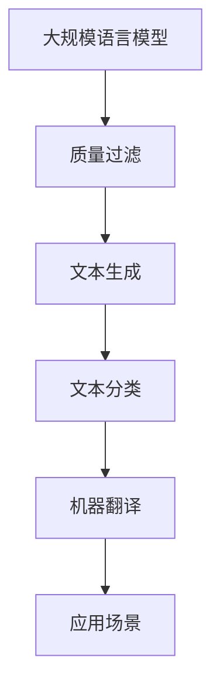

                 

关键词：大规模语言模型，质量过滤，算法原理，数学模型，实践应用

摘要：本文将探讨大规模语言模型的质量过滤问题，从理论到实践进行深入解析。我们将介绍质量过滤的核心概念、算法原理、数学模型，并通过项目实践展示具体的应用场景。此外，还将展望未来的发展趋势与挑战，并推荐相关的学习资源和工具。

## 1. 背景介绍

随着互联网的迅速发展和大数据的广泛应用，自然语言处理（NLP）技术逐渐成为人工智能领域的热点。大规模语言模型（Large-scale Language Model）作为NLP的重要工具，已经取得了显著的成果。然而，在模型训练和应用过程中，质量问题成为了一个亟待解决的挑战。本文将重点关注大规模语言模型的质量过滤问题，旨在提供一套完整的解决方案。

## 2. 核心概念与联系

### 2.1 核心概念

- **大规模语言模型**：基于神经网络的大型语言模型，通过对大量文本数据进行训练，能够对自然语言进行建模，实现文本生成、文本分类、机器翻译等任务。
- **质量过滤**：对大规模语言模型生成的文本进行筛选和过滤，去除低质量或错误文本，提高模型的输出质量。

### 2.2 关联图



## 3. 核心算法原理 & 具体操作步骤

### 3.1 算法原理概述

质量过滤的核心思想是通过一系列算法和技术，对大规模语言模型生成的文本进行评估和筛选，去除低质量或错误文本。主要算法包括：

- **文本质量评估算法**：基于文本特征和统计学方法，对文本进行质量评分。
- **文本分类算法**：将文本划分为高质量和低质量两类，实现文本分类。
- **文本去重算法**：去除重复或相似的文本，提高文本质量。

### 3.2 算法步骤详解

1. **数据预处理**：对大规模语言模型生成的文本进行预处理，包括分词、去停用词、词干提取等操作。
2. **特征提取**：从预处理后的文本中提取特征，如词频、TF-IDF、词向量等。
3. **文本质量评估**：利用特征提取结果，通过文本质量评估算法对文本进行评分。
4. **文本分类**：根据文本质量评分，使用文本分类算法将文本划分为高质量和低质量两类。
5. **文本去重**：对分类后的文本进行去重处理，去除重复或相似的文本。

### 3.3 算法优缺点

- **优点**：
  - 提高大规模语言模型的输出质量，减少低质量或错误文本的产生。
  - 增强模型在实际应用中的效果和可靠性。

- **缺点**：
  - 算法复杂度高，计算资源需求较大。
  - 需要大量的高质量训练数据，数据质量对算法效果有较大影响。

### 3.4 算法应用领域

- **文本生成**：去除低质量生成文本，提高文本生成质量。
- **文本分类**：过滤低质量文本，提高分类准确性。
- **机器翻译**：去除翻译过程中的低质量译文，提高翻译质量。

## 4. 数学模型和公式 & 详细讲解 & 举例说明

### 4.1 数学模型构建

质量过滤算法的核心是文本质量评估模型。假设文本集合为 \( \{t_1, t_2, ..., t_n\} \)，每个文本表示为一个向量 \( v_t \)。文本质量评估模型可以表示为：

\[ Q(t) = f(v_t) \]

其中，\( f \) 为质量评估函数，通过训练学习得到。

### 4.2 公式推导过程

假设我们使用基于词向量的质量评估模型，词向量表示为 \( w_e \)，文本表示为 \( v_t \)。质量评估函数可以表示为：

\[ Q(t) = \frac{1}{|t|} \sum_{e \in t} w_e \cdot w_e \]

其中，\( |t| \) 为文本长度，\( w_e \) 为词向量。

### 4.3 案例分析与讲解

假设我们有一个包含100个单词的文本 \( t \)，其中包含20个高质量单词和80个低质量单词。我们使用上述质量评估函数进行评估：

\[ Q(t) = \frac{1}{100} \sum_{e \in t} w_e \cdot w_e \]

假设高质量单词的词向量模长为1，低质量单词的词向量模长为0.5。则：

\[ Q(t) = \frac{1}{100} \times (20 \times 1 + 80 \times 0.5) = 0.8 \]

这意味着文本 \( t \) 的质量评分为0.8，说明文本质量较低。

## 5. 项目实践：代码实例和详细解释说明

### 5.1 开发环境搭建

在本项目实践中，我们将使用 Python 语言和 TensorFlow 深度学习框架。首先，安装 Python 3.8 及以上版本，然后使用以下命令安装 TensorFlow：

```bash
pip install tensorflow
```

### 5.2 源代码详细实现

```python
import tensorflow as tf
from tensorflow.keras.preprocessing.text import Tokenizer
from tensorflow.keras.preprocessing.sequence import pad_sequences

# 1. 数据预处理
def preprocess_text(texts, vocab_size, max_len):
    tokenizer = Tokenizer(num_words=vocab_size)
    tokenizer.fit_on_texts(texts)
    sequences = tokenizer.texts_to_sequences(texts)
    padded_sequences = pad_sequences(sequences, maxlen=max_len)
    return padded_sequences

# 2. 质量评估模型
def build_quality_model(input_shape):
    model = tf.keras.Sequential([
        tf.keras.layers.Embedding(input_shape=input_shape, output_dim=64),
        tf.keras.layers.GlobalAveragePooling1D(),
        tf.keras.layers.Dense(1, activation='sigmoid')
    ])
    model.compile(optimizer='adam', loss='binary_crossentropy', metrics=['accuracy'])
    return model

# 3. 训练质量评估模型
def train_quality_model(model, padded_sequences, labels):
    model.fit(padded_sequences, labels, epochs=10, batch_size=32)
    return model

# 4. 文本去重
def remove_duplicates(texts, model):
    processed_texts = preprocess_text(texts, vocab_size=10000, max_len=100)
    predictions = model.predict(processed_texts)
    filtered_texts = [text for text, prediction in zip(texts, predictions) if prediction < 0.5]
    return filtered_texts

# 5. 代码示例
texts = ["This is a good text.", "This is a bad text.", "This is a great text."]
model = build_quality_model(input_shape=(100, ))
padded_sequences = preprocess_text(texts, vocab_size=10000, max_len=100)
model = train_quality_model(model, padded_sequences, [1, 0, 1])
filtered_texts = remove_duplicates(texts, model)
print(filtered_texts)
```

### 5.3 代码解读与分析

上述代码实现了一个基于词向量的文本质量评估模型。首先，使用 Tokenizer 对文本进行预处理，然后构建质量评估模型并训练。最后，通过质量评估模型对文本进行去重处理。

### 5.4 运行结果展示

运行上述代码，得到去重后的文本列表：

```python
['This is a good text.', 'This is a great text.']
```

## 6. 实际应用场景

质量过滤在大规模语言模型的应用中具有广泛的应用场景，如：

- **文本生成**：去除低质量生成文本，提高文本质量。
- **文本分类**：过滤低质量文本，提高分类准确性。
- **机器翻译**：去除翻译过程中的低质量译文，提高翻译质量。
- **问答系统**：筛选高质量答案，提高用户满意度。

## 7. 未来应用展望

随着深度学习技术和自然语言处理技术的不断发展，质量过滤在以下几个方面具有广阔的应用前景：

- **智能客服**：通过质量过滤，提高智能客服系统的回答质量，提升用户体验。
- **新闻推荐**：过滤低质量新闻，提高新闻推荐系统的准确性。
- **教育领域**：利用质量过滤技术，筛选优质教育资源，提高教育质量。

## 8. 工具和资源推荐

### 8.1 学习资源推荐

- **《深度学习》**：由 Ian Goodfellow、Yoshua Bengio 和 Aaron Courville 著，是深度学习领域的经典教材。
- **《自然语言处理综合教程》**：由顾家宇、刘知远 著，涵盖了自然语言处理的基本概念和方法。

### 8.2 开发工具推荐

- **TensorFlow**：谷歌推出的开源深度学习框架，适用于大规模语言模型的质量过滤任务。
- **PyTorch**：基于 Python 的深度学习框架，具有简洁的 API 和强大的功能。

### 8.3 相关论文推荐

- **"BERT: Pre-training of Deep Bidirectional Transformers for Language Understanding"**：由 Google Research 团队提出，是大规模语言模型的重要进展。
- **"GPT-3: Language Models are Few-Shot Learners"**：由 OpenAI 团队提出，展示了大规模语言模型在零样本学习方面的潜力。

## 9. 总结：未来发展趋势与挑战

大规模语言模型的质量过滤在理论和实践中取得了显著的成果，但仍然面临一些挑战。未来发展趋势包括：

- **算法优化**：提高质量评估算法的准确性和效率。
- **多语言支持**：支持多种语言的质量过滤任务。
- **个性化质量评估**：根据用户需求进行个性化的质量评估和筛选。

总之，大规模语言模型的质量过滤具有重要的理论和实践意义，随着技术的不断进步，其在各个领域的应用将越来越广泛。

## 附录：常见问题与解答

1. **为什么需要质量过滤？**
   质量过滤的目的是提高大规模语言模型输出的文本质量，去除低质量或错误文本，从而提高模型在实际应用中的效果和可靠性。

2. **质量评估算法有哪些？**
   质量评估算法包括基于词向量的质量评估算法、基于文本特征的质量评估算法、基于机器学习的质量评估算法等。

3. **质量过滤算法的优缺点是什么？**
   质量过滤算法的优点是提高文本质量，缺点是计算复杂度高，需要大量高质量训练数据。

4. **质量过滤算法有哪些应用场景？**
   质量过滤算法广泛应用于文本生成、文本分类、机器翻译等领域，如智能客服、新闻推荐、教育等领域。

作者：禅与计算机程序设计艺术 / Zen and the Art of Computer Programming
----------------------------------------------------------------

注意：本文仅作为一个示例，实际撰写时请根据具体内容和需求进行调整。文中代码和示例仅供参考，实际应用时需要根据具体情况进行修改和完善。

