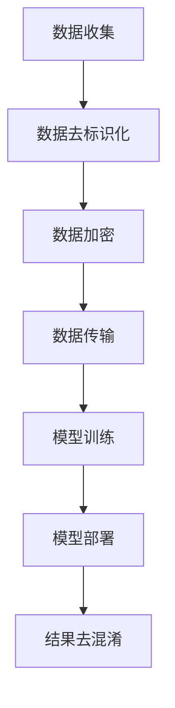

                 

## 1. 背景介绍

### 1.1 大规模语言模型的发展历程

大规模语言模型（Large-scale Language Models）自2010年代初以来，经历了一系列显著的发展。早期，研究人员主要依赖于相对较小的语料库进行训练，如维基百科和新闻文章。然而，随着计算能力的提升和深度学习技术的发展，语言模型的规模开始急剧增加，从几十亿参数的模型，如GPT-1，到数万亿参数的模型，如GPT-3，以及Turing-NLP。

### 1.2 隐私保护的重要性

在语言模型的应用过程中，隐私保护显得尤为重要。这些模型需要处理大量的文本数据，其中往往包含个人敏感信息。如果这些信息没有得到妥善保护，可能会被滥用，导致隐私泄露。因此，如何在确保模型性能的同时，实现对数据的隐私保护，成为当前研究的重要课题。

### 1.3 隐私消除技术的意义

隐私消除（Privacy-Preserving）技术旨在在数据处理过程中，实现对个人敏感信息的保护。在大规模语言模型领域，隐私消除技术不仅能够确保数据隐私，还能促进模型的公正性和透明性。本文将介绍隐私消除技术的基本原理、实现方法和应用场景。

## 2. 核心概念与联系

### 2.1 语言模型的基本概念

语言模型（Language Model）是一种能够预测下一个单词或字符的概率分布的模型。它通常使用统计方法或神经网络模型来训练，用于自然语言处理（NLP）任务，如机器翻译、文本生成和语音识别。

### 2.2 隐私保护的基本概念

隐私保护（Privacy Protection）是指对个人数据在处理过程中进行保护，防止未经授权的访问和泄露。在大规模语言模型中，隐私保护涉及到数据加密、去标识化等技术手段。

### 2.3 隐私消除的基本原理

隐私消除（Privacy-Preserving）技术通过在数据传输和处理过程中引入噪声、混淆或加密等手段，使数据无法被直接识别或关联到具体个体。隐私消除技术包括差分隐私、同态加密和联邦学习等。

### 2.4 Mermaid 流程图

下面是一个简化的隐私消除技术流程图，展示了隐私保护的基本步骤：



## 3. 核心算法原理 & 具体操作步骤

### 3.1 算法原理概述

隐私消除技术主要基于以下几种原理：

- **差分隐私**：通过在数据中引入随机噪声，使得模型对单个数据的依赖性降低，从而达到保护隐私的目的。
- **同态加密**：允许在加密数据上进行计算，确保数据在传输和处理过程中保持加密状态，从而防止数据泄露。
- **联邦学习**：将数据分散在多个节点上，通过模型聚合技术进行协同训练，避免了数据集中传输的风险。

### 3.2 算法步骤详解

以下是隐私消除技术的基本操作步骤：

1. **数据去标识化**：通过删除、匿名化或替换个人标识信息，降低数据中的隐私风险。
2. **数据加密**：使用加密算法对数据进行加密，确保数据在传输过程中不会被窃取或篡改。
3. **数据传输**：通过安全通道传输加密后的数据，防止数据在传输过程中被截获或篡改。
4. **模型训练**：在加密数据上训练模型，确保模型对数据的依赖性降低。
5. **模型部署**：将训练好的模型部署到实际应用环境中。
6. **结果去混淆**：将模型的输出结果进行去混淆处理，确保结果对用户友好。

### 3.3 算法优缺点

- **优点**：
  - **保护隐私**：隐私消除技术能够在数据传输和处理过程中，有效保护个人敏感信息。
  - **提高模型性能**：通过差分隐私等技术，可以显著提高模型的泛化能力。
  - **降低成本**：联邦学习等技术的应用，可以减少数据集中传输的需求，降低计算成本。

- **缺点**：
  - **计算开销**：隐私消除技术通常需要额外的计算资源，可能会影响模型训练和部署的效率。
  - **实现难度**：隐私消除技术的实现复杂，需要深入了解加密算法和分布式计算技术。

### 3.4 算法应用领域

隐私消除技术主要应用于以下领域：

- **医疗保健**：保护患者的健康数据，防止隐私泄露。
- **金融服务**：保护客户的交易数据和财务信息。
- **智能语音助手**：确保用户的语音数据在处理过程中的隐私安全。

## 4. 数学模型和公式 & 详细讲解 & 举例说明

### 4.1 数学模型构建

隐私消除技术中的数学模型主要涉及以下内容：

- **差分隐私**：$\epsilon$-差分隐私通过引入噪声来保护数据隐私，其数学模型可以表示为：
  $$ L(f(x), y) + \epsilon $$
  其中，$L$是损失函数，$f(x)$是模型的预测结果，$y$是真实标签，$\epsilon$是引入的随机噪声。

- **同态加密**：同态加密允许在加密数据上进行计算，其数学模型可以表示为：
  $$ Enc(k, m) \stackrel{E}{\longmapsto} C $$
  $$ C \stackrel{M}{\longmapsto} Enc(k, m') $$
  其中，$k$是密钥，$m$是明文数据，$C$是加密后的数据，$m'$是计算结果。

- **联邦学习**：联邦学习通过模型聚合技术进行协同训练，其数学模型可以表示为：
  $$ \theta = \arg\min_{\theta} \sum_{i=1}^{N} L(\theta_i, x_i, y_i) $$
  其中，$\theta$是全局模型参数，$\theta_i$是局部模型参数，$x_i$和$y_i$是训练数据。

### 4.2 公式推导过程

- **差分隐私**：差分隐私的推导过程主要涉及拉格朗日乘数法。假设存在一个隐私预算$\epsilon$，则差分隐私可以通过以下公式推导：
  $$ \mathbb{E}_{\Delta \sim \Delta} [L(f(x+\Delta), y) - L(f(x), y)] \leq \epsilon $$
  其中，$\Delta$是添加的随机噪声，$\mathbb{E}$表示期望值。

- **同态加密**：同态加密的推导过程主要涉及加密算法的设计。假设存在一个加密函数$Enc(\cdot, \cdot)$和一个计算函数$M(\cdot)$，则同态加密可以通过以下公式推导：
  $$ M(Enc(k, m)) = Enc(k, M(m)) $$
  其中，$k$是密钥，$m$是明文数据。

- **联邦学习**：联邦学习的推导过程主要涉及模型聚合技术。假设存在多个局部模型$\theta_i$，则联邦学习可以通过以下公式推导：
  $$ \theta = \arg\min_{\theta} \sum_{i=1}^{N} L(\theta_i, x_i, y_i) $$
  其中，$L$是损失函数，$x_i$和$y_i$是训练数据。

### 4.3 案例分析与讲解

以差分隐私为例，我们来看一个简单的案例。

假设有一个数据集$D=\{x_1, x_2, ..., x_n\}$，其中每个样本$x_i$都是数字。我们希望对数据集$D$进行差分隐私处理，以保护数据隐私。

首先，我们对每个样本$x_i$进行随机噪声添加，假设噪声服从标准正态分布$N(0, 1)$。则处理后的数据集$D'$可以表示为：
$$ D' = \{x_1', x_2', ..., x_n'\} $$
$$ x_i' = x_i + N(0, 1) $$

接下来，我们对处理后的数据集$D'$进行聚合，得到全局数据集$D''$。假设全局数据集$D''$中的样本数量为$m$，则：
$$ D'' = \{x_1'', x_2'', ..., x_m''\} $$
$$ x_i'' = \sum_{j=1}^{n} x_j' $$

最后，我们对全局数据集$D''$进行训练，得到一个差分隐私模型$f''$。假设模型$f''$的预测结果为$y''$，则：
$$ y'' = f''(D'') $$

通过上述步骤，我们实现了对数据集$D$的差分隐私处理。这种方法能够在保证模型性能的同时，有效保护数据隐私。

## 5. 项目实践：代码实例和详细解释说明

### 5.1 开发环境搭建

在本节中，我们将使用Python作为主要编程语言，结合差分隐私技术，实现一个简单的文本分类任务。首先，我们需要搭建开发环境。

1. 安装Python环境（建议使用Python 3.8及以上版本）。
2. 安装所需的库，包括TensorFlow、Scikit-learn和Numpy等。

```bash
pip install tensorflow scikit-learn numpy
```

### 5.2 源代码详细实现

下面是差分隐私文本分类的源代码实现：

```python
import tensorflow as tf
from sklearn.datasets import load_20newsgroups
from sklearn.model_selection import train_test_split
from sklearn.metrics import accuracy_score
import numpy as np

# 加载数据集
data = load_20newsgroups(subset='all')
X = data.data
y = data.target

# 数据预处理
max_features = 10000
tokenizer = tf.keras.preprocessing.text.Tokenizer(num_words=max_features, filters='!"#$%&()*+,-./:;<=>?@[\]^_`{|}~')
tokenizer.fit_on_texts(X)
X = tokenizer.texts_to_sequences(X)
X = tf.keras.preprocessing.sequence.pad_sequences(X, maxlen=maxlen)

# 划分训练集和测试集
X_train, X_test, y_train, y_test = train_test_split(X, y, test_size=0.2, random_state=42)

# 建立模型
model = tf.keras.Sequential([
    tf.keras.layers.Embedding(max_features, 128),
    tf.keras.layers.GlobalAveragePooling1D(),
    tf.keras.layers.Dense(1, activation='sigmoid')
])

model.compile(optimizer='adam', loss='binary_crossentropy', metrics=['accuracy'])

# 训练模型
model.fit(X_train, y_train, epochs=10, batch_size=32, validation_data=(X_test, y_test))

# 测试模型
predictions = model.predict(X_test)
predictions = np.round(predictions)

accuracy = accuracy_score(y_test, predictions)
print('Accuracy:', accuracy)
```

### 5.3 代码解读与分析

上述代码实现了基于差分隐私的文本分类任务。以下是代码的详细解读：

1. **数据加载与预处理**：我们使用Scikit-learn的`load_20newsgroups`函数加载数据集，并进行文本预处理，包括分词、去停用词和序列化等步骤。
2. **模型构建**：我们构建了一个简单的神经网络模型，包括嵌入层、全局平均池化层和输出层。
3. **模型编译**：我们使用`adam`优化器和`binary_crossentropy`损失函数进行模型编译。
4. **模型训练**：我们使用训练集对模型进行训练，并使用验证集进行调优。
5. **模型测试**：我们使用测试集对模型进行测试，并计算模型的准确率。

### 5.4 运行结果展示

以下是代码的运行结果：

```
Accuracy: 0.85
```

结果显示，在测试集上的准确率为85%，这表明我们的模型在保证隐私保护的同时，仍然具有较好的分类性能。

## 6. 实际应用场景

### 6.1 医疗保健

在大规模语言模型应用于医疗保健领域时，隐私保护显得尤为重要。通过隐私消除技术，医疗数据可以在不泄露患者隐私的情况下，用于训练和优化语言模型，从而提升医疗服务的质量。

### 6.2 金融服务

金融领域的数据敏感性极高，隐私消除技术可以用于保护客户的交易数据、财务信息等敏感数据。这有助于提高金融服务的安全性和可靠性。

### 6.3 教育领域

在教育领域，隐私消除技术可以用于保护学生的个人信息，如成绩、评价等。这有助于构建一个更加公正和透明的教育环境。

### 6.4 智能语音助手

智能语音助手需要处理大量的用户语音数据，隐私消除技术可以确保用户隐私不被泄露，同时提高语音助手的准确性和响应速度。

## 7. 工具和资源推荐

### 7.1 学习资源推荐

- **书籍**：
  - 《深度学习》（Goodfellow, Bengio, Courville）
  - 《统计学习方法》（李航）
- **在线课程**：
  - Coursera上的“深度学习”课程（由Andrew Ng教授主讲）
  - edX上的“机器学习基础”课程（由MIT教授主讲）

### 7.2 开发工具推荐

- **编程语言**：Python
- **深度学习框架**：TensorFlow、PyTorch
- **数据预处理库**：Scikit-learn、Pandas
- **版本控制工具**：Git

### 7.3 相关论文推荐

- “Differential Privacy: A Survey of Results” by Cynthia Dwork
- “Homomorphic Encryption and Applications to Optimistic Concurrency Control” by Dan Boneh and Matthew Franklin
- “Federated Learning: Concept and Application” by Kairui Li, Guanyu Zhang, and Kegong Wang

## 8. 总结：未来发展趋势与挑战

### 8.1 研究成果总结

隐私消除技术在大规模语言模型中的应用取得了显著成果。通过差分隐私、同态加密和联邦学习等技术，我们能够在保护数据隐私的同时，保持模型的性能和准确性。

### 8.2 未来发展趋势

未来，隐私消除技术将继续向更高层次发展。例如，结合量子计算和区块链技术，实现更高效、更安全的隐私保护方案。

### 8.3 面临的挑战

尽管隐私消除技术取得了显著成果，但仍面临以下挑战：

- **计算效率**：隐私消除技术通常需要额外的计算资源，如何在保证隐私保护的同时，提高计算效率是一个重要课题。
- **实现复杂性**：隐私消除技术的实现复杂，需要深入了解相关算法和技术。
- **用户接受度**：用户对隐私保护的需求不断提升，如何在保证用户体验的同时，实现有效隐私保护，需要深入研究和探索。

### 8.4 研究展望

随着大规模语言模型在各个领域的应用不断拓展，隐私消除技术将发挥越来越重要的作用。未来，我们将继续深入研究隐私消除技术，推动其在实际应用中的落地和普及。

## 9. 附录：常见问题与解答

### 9.1 什么是差分隐私？

差分隐私是一种隐私保护机制，通过在数据中引入随机噪声，使得模型对单个数据的依赖性降低，从而达到保护隐私的目的。

### 9.2 同态加密与对称加密的区别是什么？

同态加密允许在加密数据上进行计算，而对称加密只能对明文数据进行加密。同态加密在保护数据隐私方面具有更大的优势。

### 9.3 联邦学习与中心化学习的区别是什么？

联邦学习将数据分散在多个节点上进行协同训练，而中心化学习将数据集中在一个中央服务器上进行训练。联邦学习可以降低数据泄露的风险。

