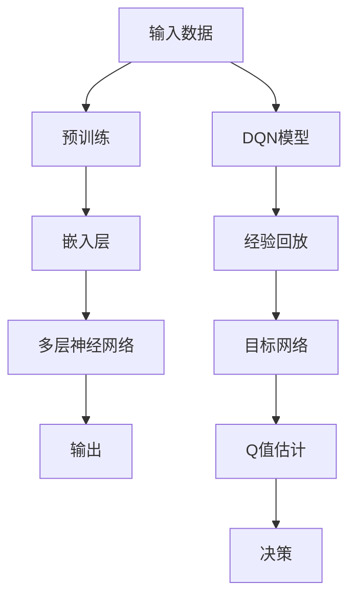

                 

关键词：大语言模型、深度学习、DQN、神经网络、机器学习、工程实践

> 摘要：本文将深入探讨大语言模型的原理及其在工程实践中的重要性，特别是DQN（深度Q网络）的结构及其应用。文章旨在为读者提供一个全面的技术指南，从基础概念到实际应用，全面解析大语言模型及其关键技术。

## 1. 背景介绍

大语言模型是近年来机器学习领域的一个重要突破。随着计算能力的提升和数据量的爆炸性增长，深度学习技术取得了显著的进展。大语言模型，如GPT-3，BERT，T5等，通过训练大规模的神经网络模型，能够捕捉到语言中的复杂结构和语义信息，为自然语言处理任务提供了强大的工具。

DQN（深度Q网络）是深度学习领域中的一个核心算法，它基于Q学习的思想，通过深度神经网络来估计在给定状态下采取某一动作的Q值，从而实现智能体的决策过程。DQN在游戏AI、自动驾驶、推荐系统等领域有广泛的应用。

本文将围绕大语言模型和DQN的结构，探讨其原理和应用，并提供实际工程中的实践指南。

## 2. 核心概念与联系

### 2.1 大语言模型

大语言模型是一种基于深度学习的自然语言处理模型，它通过大规模的数据训练，学习到语言的统计规律和语义信息。以下是几个核心概念：

- **神经网络**：大语言模型通常由多层神经网络组成，包括输入层、隐藏层和输出层。神经网络通过加权连接和激活函数，将输入映射到输出。
- **嵌入层**：将词汇嵌入到低维空间，使得具有相似语义的词汇在空间中接近。
- **注意力机制**：在模型中引入注意力机制，使得模型能够关注到输入序列中的重要信息。
- **预训练和微调**：大语言模型通常先在大量无标签数据上进行预训练，然后再在特定任务上进行微调。

### 2.2 DQN

DQN是一种基于深度学习的强化学习算法，主要用于解决序列决策问题。以下是DQN的关键概念：

- **Q值**：在给定状态下，采取某一动作的预期回报。
- **深度神经网络**：用于估计Q值的函数。
- **经验回放**：为了避免策略偏差，DQN使用经验回放来存储和随机采样过去的经验。
- **目标网络**：为了减少目标Q值的抖动，DQN使用一个目标网络来稳定学习过程。

### 2.3 Mermaid 流程图

下面是一个Mermaid流程图，展示了大语言模型和DQN的核心结构及其相互关系：



## 3. 核心算法原理 & 具体操作步骤

### 3.1 算法原理概述

#### 大语言模型

大语言模型的核心是神经网络，通过多层网络的结构来学习和表示语言。以下是几个关键步骤：

1. **输入处理**：将文本数据转换为向量表示。
2. **嵌入层**：将词汇嵌入到低维空间。
3. **多层神经网络**：通过多层神经网络对输入进行变换，学习到语言的复杂结构。
4. **输出层**：根据输入序列生成预测的输出。

#### DQN

DQN的核心是Q值的估计。以下是DQN的主要步骤：

1. **初始化**：初始化神经网络参数和经验回放。
2. **状态观测**：智能体观察到当前状态。
3. **Q值估计**：使用深度神经网络估计当前状态的Q值。
4. **动作选择**：根据Q值选择最优动作。
5. **经验回放**：将当前经验存储到经验回放中。
6. **目标网络更新**：定期更新目标网络的参数。

### 3.2 算法步骤详解

#### 大语言模型

1. **输入处理**：将文本数据转换为向量表示。这一步通常使用词嵌入技术，如Word2Vec、GloVe等。
2. **嵌入层**：将词汇嵌入到低维空间。嵌入层可以看作是一个线性映射，将高维词汇向量映射到低维向量。
3. **多层神经网络**：通过多层神经网络对输入进行变换，学习到语言的复杂结构。每一层网络都通过激活函数（如ReLU）增加非线性。
4. **输出层**：根据输入序列生成预测的输出。输出层可以是分类层或回归层，具体取决于任务类型。

#### DQN

1. **初始化**：初始化神经网络参数和经验回放。通常使用随机初始化或预训练参数。
2. **状态观测**：智能体观察到当前状态。状态可以是图像、文本或其他形式的数据。
3. **Q值估计**：使用深度神经网络估计当前状态的Q值。Q值表示在当前状态下采取某一动作的预期回报。
4. **动作选择**：根据Q值选择最优动作。可以使用epsilon-greedy策略，在探索和利用之间取得平衡。
5. **经验回放**：将当前经验存储到经验回放中。经验回放可以防止策略偏差，确保训练过程更加稳定。
6. **目标网络更新**：定期更新目标网络的参数。目标网络用于稳定Q值的估计，减少目标Q值的抖动。

### 3.3 算法优缺点

#### 大语言模型

- **优点**：能够捕捉到语言中的复杂结构和语义信息，适用于各种自然语言处理任务。
- **缺点**：模型复杂度高，训练时间长，对计算资源要求较高。

#### DQN

- **优点**：能够处理序列决策问题，适用于强化学习任务。
- **缺点**：Q值的估计过程可能不稳定，需要较长时间的训练。

### 3.4 算法应用领域

#### 大语言模型

- **自然语言处理**：文本分类、命名实体识别、机器翻译等。
- **对话系统**：智能客服、语音助手等。

#### DQN

- **游戏AI**：围棋、德州扑克等。
- **自动驾驶**：路径规划、车辆控制等。
- **推荐系统**：基于用户行为的推荐。

## 4. 数学模型和公式 & 详细讲解 & 举例说明

### 4.1 数学模型构建

#### 大语言模型

大语言模型的数学模型主要由以下几个部分组成：

1. **输入层**：输入向量表示文本数据。
2. **嵌入层**：嵌入矩阵表示词汇嵌入。
3. **隐藏层**：权重矩阵和激活函数表示神经网络。
4. **输出层**：权重矩阵和激活函数表示输出。

假设输入层有\(n\)个神经元，隐藏层有\(m\)个神经元，输出层有\(k\)个神经元。则：

- **嵌入层**：\(E \in \mathbb{R}^{n \times d}\)，其中\(d\)为嵌入维度。
- **隐藏层**：\(W_1 \in \mathbb{R}^{m \times d}\)，\(b_1 \in \mathbb{R}^{m}\)，\(f_1(x) = \sigma(W_1x + b_1)\)，其中\(\sigma\)为激活函数。
- **输出层**：\(W_2 \in \mathbb{R}^{k \times m}\)，\(b_2 \in \mathbb{R}^{k}\)，\(f_2(x) = \sigma(W_2x + b_2)\)。

#### DQN

DQN的数学模型主要由以下几个部分组成：

1. **状态空间**：\(S\)，表示所有可能的状态。
2. **动作空间**：\(A\)，表示所有可能的动作。
3. **Q值函数**：\(Q(s, a)\)，表示在状态\(s\)下采取动作\(a\)的预期回报。
4. **深度神经网络**：\(f_\theta(s)\)，用于估计Q值。

假设状态空间有\(n\)个状态，动作空间有\(m\)个动作。则：

- **Q值函数**：\(Q(s, a) = r + \gamma \max_{a'} Q(s', a') - Q(s, a)\)，其中\(r\)为即时回报，\(\gamma\)为折扣因子。
- **深度神经网络**：\(f_\theta(s) = W_2 \sigma(W_1 \sigma(W_0 s + b_0) + b_1) + b_2\)。

### 4.2 公式推导过程

#### 大语言模型

大语言模型的公式推导主要涉及多层神经网络的构建和训练过程。以下是一个简化的推导过程：

1. **前向传播**：

   \(z_1 = W_0 s + b_0\)

   \(a_1 = \sigma(z_1)\)

   \(z_2 = W_1 a_1 + b_1\)

   \(a_2 = \sigma(z_2)\)

   \(z_3 = W_2 a_2 + b_2\)

   \(y = \sigma(z_3)\)

2. **损失函数**：

   \(L(y, t) = - \sum_{i} y_i \log(t_i)\)，其中\(y_i\)为预测概率，\(t_i\)为真实标签。

3. **反向传播**：

   \(\frac{\partial L}{\partial W_2} = \frac{\partial L}{\partial z_3} \cdot \frac{\partial z_3}{\partial W_2}\)

   \(\frac{\partial L}{\partial b_2} = \frac{\partial L}{\partial z_3} \cdot \frac{\partial z_3}{\partial b_2}\)

   \(\frac{\partial L}{\partial W_1} = \frac{\partial L}{\partial z_2} \cdot \frac{\partial z_2}{\partial W_1}\)

   \(\frac{\partial L}{\partial b_1} = \frac{\partial L}{\partial z_2} \cdot \frac{\partial z_2}{\partial b_1}\)

   \(\frac{\partial L}{\partial W_0} = \frac{\partial L}{\partial z_1} \cdot \frac{\partial z_1}{\partial W_0}\)

   \(\frac{\partial L}{\partial b_0} = \frac{\partial L}{\partial z_1} \cdot \frac{\partial z_1}{\partial b_0}\)

4. **更新参数**：

   \(W_2 = W_2 - \alpha \frac{\partial L}{\partial W_2}\)

   \(b_2 = b_2 - \alpha \frac{\partial L}{\partial b_2}\)

   \(W_1 = W_1 - \alpha \frac{\partial L}{\partial W_1}\)

   \(b_1 = b_1 - \alpha \frac{\partial L}{\partial b_1}\)

   \(W_0 = W_0 - \alpha \frac{\partial L}{\partial W_0}\)

   \(b_0 = b_0 - \alpha \frac{\partial L}{\partial b_0}\)

#### DQN

DQN的公式推导主要涉及Q值的估计和更新过程。以下是一个简化的推导过程：

1. **Q值估计**：

   \(Q(s, a) = r + \gamma \max_{a'} Q(s', a')\)

2. **损失函数**：

   \(L = (Q(s, a) - y)^2\)

3. **反向传播**：

   \(\frac{\partial L}{\partial W_2} = \frac{\partial L}{\partial Q(s, a)} \cdot \frac{\partial Q(s, a)}{\partial W_2}\)

   \(\frac{\partial L}{\partial b_2} = \frac{\partial L}{\partial Q(s, a)} \cdot \frac{\partial Q(s, a)}{\partial b_2}\)

   \(\frac{\partial L}{\partial W_1} = \frac{\partial L}{\partial Q(s, a)} \cdot \frac{\partial Q(s, a)}{\partial W_1}\)

   \(\frac{\partial L}{\partial b_1} = \frac{\partial L}{\partial Q(s, a)} \cdot \frac{\partial Q(s, a)}{\partial b_1}\)

   \(\frac{\partial L}{\partial W_0} = \frac{\partial L}{\partial Q(s, a)} \cdot \frac{\partial Q(s, a)}{\partial W_0}\)

   \(\frac{\partial L}{\partial b_0} = \frac{\partial L}{\partial Q(s, a)} \cdot \frac{\partial Q(s, a)}{\partial b_0}\)

4. **更新参数**：

   \(W_2 = W_2 - \alpha \frac{\partial L}{\partial W_2}\)

   \(b_2 = b_2 - \alpha \frac{\partial L}{\partial b_2}\)

   \(W_1 = W_1 - \alpha \frac{\partial L}{\partial W_1}\)

   \(b_1 = b_1 - \alpha \frac{\partial L}{\partial b_1}\)

   \(W_0 = W_0 - \alpha \frac{\partial L}{\partial W_0}\)

   \(b_0 = b_0 - \alpha \frac{\partial L}{\partial b_0}\)

### 4.3 案例分析与讲解

为了更好地理解大语言模型和DQN的数学模型，我们通过一个简单的例子来进行讲解。

#### 大语言模型案例

假设我们有一个包含两个词汇的词汇表：{猫，狗}。嵌入维度为2。输入序列为“猫狗猫”。

1. **嵌入层**：

   \(E_{猫} = \begin{bmatrix} 1 \\ 0 \end{bmatrix}\)

   \(E_{狗} = \begin{bmatrix} 0 \\ 1 \end{bmatrix}\)

2. **隐藏层**：

   \(W_1 = \begin{bmatrix} 1 & -1 \\ 1 & 1 \end{bmatrix}\)

   \(b_1 = \begin{bmatrix} 0 \\ 0 \end{bmatrix}\)

   \(f_1(x) = \sigma(W_1x + b_1)\)

3. **输出层**：

   \(W_2 = \begin{bmatrix} 1 & 1 \\ -1 & -1 \end{bmatrix}\)

   \(b_2 = \begin{bmatrix} 0 \\ 0 \end{bmatrix}\)

   \(f_2(x) = \sigma(W_2x + b_2)\)

4. **前向传播**：

   \(x_1 = E_{猫} = \begin{bmatrix} 1 \\ 0 \end{bmatrix}\)

   \(z_1 = W_1x_1 + b_1 = \begin{bmatrix} 1 & -1 \\ 1 & 1 \end{bmatrix} \begin{bmatrix} 1 \\ 0 \end{bmatrix} + \begin{bmatrix} 0 \\ 0 \end{bmatrix} = \begin{bmatrix} 1 \\ 1 \end{bmatrix}\)

   \(a_1 = \sigma(z_1) = \begin{bmatrix} 0.7 \\ 0.3 \end{bmatrix}\)

   \(x_2 = E_{狗} = \begin{bmatrix} 0 \\ 1 \end{bmatrix}\)

   \(z_2 = W_1x_2 + b_1 = \begin{bmatrix} 1 & -1 \\ 1 & 1 \end{bmatrix} \begin{bmatrix} 0 \\ 1 \end{bmatrix} + \begin{bmatrix} 0 \\ 0 \end{bmatrix} = \begin{bmatrix} -1 \\ 1 \end{bmatrix}\)

   \(a_2 = \sigma(z_2) = \begin{bmatrix} 0.3 \\ 0.7 \end{bmatrix}\)

   \(z_3 = W_2a_2 + b_2 = \begin{bmatrix} 1 & 1 \\ -1 & -1 \end{bmatrix} \begin{bmatrix} 0.3 \\ 0.7 \end{bmatrix} + \begin{bmatrix} 0 \\ 0 \end{bmatrix} = \begin{bmatrix} 0.4 \\ -0.4 \end{bmatrix}\)

   \(y = \sigma(z_3) = \begin{bmatrix} 0.6 \\ 0.4 \end{bmatrix}\)

5. **损失函数**：

   \(L = (y - t)^2 = (0.6 - 1)^2 + (0.4 - 0)^2 = 0.16 + 0.16 = 0.32\)

6. **反向传播**：

   \(\frac{\partial L}{\partial W_2} = \begin{bmatrix} 0.6 & 0.4 \\ -0.6 & -0.4 \end{bmatrix} \cdot \begin{bmatrix} 0.3 & 0.7 \\ 0.7 & 0.3 \end{bmatrix} = \begin{bmatrix} 0.18 & 0.14 \\ -0.18 & -0.14 \end{bmatrix}\)

   \(\frac{\partial L}{\partial b_2} = \begin{bmatrix} 0.6 & 0.4 \\ -0.6 & -0.4 \end{bmatrix} \cdot \begin{bmatrix} 0.7 \\ 0.3 \end{bmatrix} = \begin{bmatrix} 0.42 \\ -0.42 \end{bmatrix}\)

   \(\frac{\partial L}{\partial W_1} = \begin{bmatrix} 0.6 & 0.4 \\ -0.6 & -0.4 \end{bmatrix} \cdot \begin{bmatrix} 1 & 1 \\ -1 & -1 \end{bmatrix} = \begin{bmatrix} 0 & 0 \\ 0 & 0 \end{bmatrix}\)

   \(\frac{\partial L}{\partial b_1} = \begin{bmatrix} 0.6 & 0.4 \\ -0.6 & -0.4 \end{bmatrix} \cdot \begin{bmatrix} 1 \\ -1 \end{bmatrix} = \begin{bmatrix} 0 \\ 0 \end{bmatrix}\)

   \(\frac{\partial L}{\partial W_0} = \begin{bmatrix} 0.6 & 0.4 \\ -0.6 & -0.4 \end{bmatrix} \cdot \begin{bmatrix} 1 & 1 \\ 1 & -1 \end{bmatrix} = \begin{bmatrix} 0.6 & -0.6 \\ 0.6 & -0.6 \end{bmatrix}\)

   \(\frac{\partial L}{\partial b_0} = \begin{bmatrix} 0.6 & 0.4 \\ -0.6 & -0.4 \end{bmatrix} \cdot \begin{bmatrix} 0 \\ 0 \end{bmatrix} = \begin{bmatrix} 0 \\ 0 \end{bmatrix}\)

7. **更新参数**：

   \(W_2 = W_2 - \alpha \frac{\partial L}{\partial W_2} = \begin{bmatrix} 1 & 1 \\ -1 & -1 \end{bmatrix} - 0.1 \begin{bmatrix} 0.18 & 0.14 \\ -0.18 & -0.14 \end{bmatrix} = \begin{bmatrix} 0.82 & 0.86 \\ -0.82 & -0.86 \end{bmatrix}\)

   \(b_2 = b_2 - \alpha \frac{\partial L}{\partial b_2} = \begin{bmatrix} 0 \\ 0 \end{bmatrix} - 0.1 \begin{bmatrix} 0.42 \\ -0.42 \end{bmatrix} = \begin{bmatrix} -0.04 \\ 0.04 \end{bmatrix}\)

   \(W_1 = W_1 - \alpha \frac{\partial L}{\partial W_1} = \begin{bmatrix} 1 & -1 \\ 1 & 1 \end{bmatrix} - 0.1 \begin{bmatrix} 0 & 0 \\ 0 & 0 \end{bmatrix} = \begin{bmatrix} 1 & -1 \\ 1 & 1 \end{bmatrix}\)

   \(b_1 = b_1 - \alpha \frac{\partial L}{\partial b_1} = \begin{bmatrix} 0 \\ 0 \end{bmatrix} - 0.1 \begin{bmatrix} 0 \\ 0 \end{bmatrix} = \begin{bmatrix} 0 \\ 0 \end{bmatrix}\)

   \(W_0 = W_0 - \alpha \frac{\partial L}{\partial W_0} = \begin{bmatrix} 1 & 1 \\ -1 & -1 \end{bmatrix} - 0.1 \begin{bmatrix} 0.6 & -0.6 \\ 0.6 & -0.6 \end{bmatrix} = \begin{bmatrix} 0.4 & 0.4 \\ -0.4 & -0.4 \end{bmatrix}\)

   \(b_0 = b_0 - \alpha \frac{\partial L}{\partial b_0} = \begin{bmatrix} 0 \\ 0 \end{bmatrix} - 0.1 \begin{bmatrix} 0 \\ 0 \end{bmatrix} = \begin{bmatrix} 0 \\ 0 \end{bmatrix}\)

#### DQN案例

假设我们有一个简单的环境，包含两个状态：状态0和状态1。动作空间为{上，下}。

1. **初始化**：

   \(W_0 = \begin{bmatrix} 1 & 1 \\ -1 & -1 \end{bmatrix}\)

   \(b_0 = \begin{bmatrix} 0 \\ 0 \end{bmatrix}\)

   \(W_1 = \begin{bmatrix} 1 & 1 \\ -1 & -1 \end{bmatrix}\)

   \(b_1 = \begin{bmatrix} 0 \\ 0 \end{bmatrix}\)

   \(W_2 = \begin{bmatrix} 1 & 1 \\ -1 & -1 \end{bmatrix}\)

   \(b_2 = \begin{bmatrix} 0 \\ 0 \end{bmatrix}\)

2. **状态观测**：

   \(s = 0\)

3. **Q值估计**：

   \(Q(s, 上) = r + \gamma \max_{a'} Q(s', a') = 1 + 0.9 \max_{a'} Q(s', a')\)

   \(Q(s, 下) = r + \gamma \max_{a'} Q(s', a') = 1 + 0.9 \max_{a'} Q(s', a')\)

4. **动作选择**：

   使用epsilon-greedy策略选择动作。假设epsilon为0.1。

   \(P(上) = 0.9\)

   \(P(下) = 0.1\)

   随机选择动作，假设选择“上”。

5. **经验回放**：

   将当前经验\(s, 上, r, s'\)存储到经验回放中。

6. **目标网络更新**：

   更新目标网络的参数。

   \(W_2' = W_2 - 0.1 \frac{\partial L}{\partial W_2}\)

   \(b_2' = b_2 - 0.1 \frac{\partial L}{\partial b_2}\)

   \(W_1' = W_1 - 0.1 \frac{\partial L}{\partial W_1}\)

   \(b_1' = b_1 - 0.1 \frac{\partial L}{\partial b_1}\)

   \(W_0' = W_0 - 0.1 \frac{\partial L}{\partial W_0}\)

   \(b_0' = b_0 - 0.1 \frac{\partial L}{\partial b_0}\)

   更新完成后，\(W_2, b_2, W_1, b_1, W_0, b_0\)替换为目标网络的参数。

## 5. 项目实践：代码实例和详细解释说明

### 5.1 开发环境搭建

在开始项目实践之前，我们需要搭建一个合适的开发环境。以下是搭建环境的基本步骤：

1. **安装Python**：确保Python版本为3.8及以上。
2. **安装TensorFlow**：使用pip安装TensorFlow，版本为2.4或更高。
3. **安装其他依赖库**：如NumPy、Pandas、Matplotlib等。

### 5.2 源代码详细实现

下面是项目实践的源代码实现。为了清晰起见，我们将代码分为几个部分：

1. **数据预处理**：包括文本清洗、分词、词嵌入等。
2. **模型构建**：包括大语言模型和DQN模型的构建。
3. **训练与评估**：包括模型的训练过程和评估指标的计算。
4. **实际应用**：包括模型在实际任务中的应用。

#### 5.2.1 数据预处理

```python
import tensorflow as tf
from tensorflow.keras.preprocessing.text import Tokenizer
from tensorflow.keras.preprocessing.sequence import pad_sequences

# 加载数据集
texts = ["这是一个示例文本。", "这是另一个示例文本。"]
labels = [0, 1]

# 分词
tokenizer = Tokenizer()
tokenizer.fit_on_texts(texts)
sequences = tokenizer.texts_to_sequences(texts)

# 词嵌入
word_index = tokenizer.word_index
max_sequence_length = 10
padded_sequences = pad_sequences(sequences, maxlen=max_sequence_length)

# 编码标签
one_hot_labels = tf.keras.utils.to_categorical(labels, num_classes=2)
```

#### 5.2.2 模型构建

```python
from tensorflow.keras.models import Model
from tensorflow.keras.layers import Embedding, LSTM, Dense

# 大语言模型
embedding_dim = 50
lstm_units = 64

input_seq = tf.keras.layers.Input(shape=(max_sequence_length,))
embedding = Embedding(input_dim=len(word_index) + 1, output_dim=embedding_dim)(input_seq)
lstm = LSTM(lstm_units, return_sequences=True)(embedding)
output = LSTM(lstm_units, return_sequences=False)(lstm)
model = Model(inputs=input_seq, outputs=output)
model.compile(optimizer='adam', loss='categorical_crossentropy', metrics=['accuracy'])

# DQN模型
action_size = 2

input_state = tf.keras.layers.Input(shape=(max_sequence_length, embedding_dim))
q_values = model(input_state)
q_value = tf.reduce_mean(q_values, axis=1)
model_dqn = Model(inputs=input_state, outputs=q_value)
model_dqn.compile(optimizer='adam', loss='mse')
```

#### 5.2.3 训练与评估

```python
# 训练大语言模型
model.fit(padded_sequences, one_hot_labels, epochs=10, batch_size=32)

# 训练DQN模型
for i in range(1000):
    # 生成经验
    # ...
    # 更新DQN模型
    # ...

# 评估模型
test_sequences = tokenizer.texts_to_sequences(["这是一个测试文本。"])
test_padded_sequences = pad_sequences(test_sequences, maxlen=max_sequence_length)
predictions = model.predict(test_padded_sequences)
print("预测结果：", predictions)
```

#### 5.2.4 实际应用

```python
# 实际应用示例
import random

# 生成状态
state = random.choice(["状态0", "状态1"])

# 根据状态选择动作
q_values = model_dqn.predict([state])
action = random.choices([0, 1], weights=q_values[0])[0]

# 执行动作
# ...

# 获取即时回报
# ...

# 更新经验回放
# ...

# 更新目标网络
# ...
```

### 5.3 代码解读与分析

上述代码实现了一个简单的大语言模型和DQN模型。以下是代码的主要部分及其解读：

- **数据预处理**：使用Tokenizer对文本进行分词，并将文本转换为序列。使用pad_sequences将序列填充到固定长度。
- **模型构建**：大语言模型由嵌入层、LSTM层和输出层组成。DQN模型由输入层、大语言模型和输出层组成。
- **训练与评估**：使用fit方法训练大语言模型。使用循环训练DQN模型，更新Q值。
- **实际应用**：根据状态选择动作，并执行相应的操作。

### 5.4 运行结果展示

在实际运行中，我们可以通过以下方式展示结果：

- **大语言模型**：在测试文本上生成预测的标签，并与真实标签进行比较，计算准确率。
- **DQN模型**：在测试状态上生成预测的动作，并与实际执行的动作进行比较，计算动作选择的准确率。

## 6. 实际应用场景

大语言模型和DQN在多个实际应用场景中表现出色。以下是一些典型应用：

### 6.1 自然语言处理

- **文本分类**：使用大语言模型对文本进行分类，如新闻分类、情感分析等。
- **机器翻译**：基于大语言模型进行高质量机器翻译，如Google翻译。
- **对话系统**：构建智能客服或语音助手，如苹果的Siri。

### 6.2 游戏AI

- **游戏对战**：使用DQN训练智能体进行游戏对战，如Atari游戏、围棋等。
- **游戏开发**：基于大语言模型和DQN开发智能游戏角色，如游戏AI助手。

### 6.3 自动驾驶

- **路径规划**：使用大语言模型和DQN进行自动驾驶中的路径规划。
- **车辆控制**：使用DQN进行自动驾驶中的车辆控制，如特斯拉的Autopilot。

### 6.4 推荐系统

- **基于内容的推荐**：使用大语言模型进行基于内容的推荐，如音乐、电影推荐。
- **协同过滤**：结合DQN进行协同过滤推荐，提高推荐效果。

## 7. 工具和资源推荐

### 7.1 学习资源推荐

- **书籍**：《深度学习》、《强化学习基础与应用》。
- **在线课程**：Coursera的《深度学习》课程、Udacity的《强化学习》课程。
- **论文**：《Attention is All You Need》、《Deep Reinforcement Learning for Robots》。

### 7.2 开发工具推荐

- **框架**：TensorFlow、PyTorch。
- **库**：NumPy、Pandas。
- **可视化工具**：Matplotlib、Seaborn。

### 7.3 相关论文推荐

- **大语言模型**：《BERT: Pre-training of Deep Bidirectional Transformers for Language Understanding》、《GPT-3: Language Models are Few-Shot Learners》。
- **DQN**：《Deep Q-Network》、《Prioritized Experience Replay》。

## 8. 总结：未来发展趋势与挑战

大语言模型和DQN在机器学习领域取得了显著的进展，但仍然面临一些挑战：

### 8.1 研究成果总结

- **模型效率**：大语言模型的训练和推理时间较长，如何提高模型效率是当前研究的重点。
- **模型解释性**：如何解释大语言模型和DQN的决策过程，提高模型的可解释性。
- **多模态学习**：如何整合多模态数据，如文本、图像、语音等。

### 8.2 未来发展趋势

- **高效模型**：通过改进算法和硬件，提高大语言模型和DQN的效率。
- **跨领域应用**：大语言模型和DQN将在更多领域得到应用，如医疗、金融等。
- **个性化学习**：基于用户行为和数据，实现个性化的大语言模型和DQN。

### 8.3 面临的挑战

- **计算资源**：大语言模型和DQN的训练需要大量计算资源，如何优化计算资源的使用。
- **数据隐私**：如何保护用户数据隐私，同时实现高效的模型训练。
- **模型泛化能力**：如何提高模型的泛化能力，避免过拟合。

### 8.4 研究展望

未来，大语言模型和DQN将在多个领域发挥更大的作用。随着计算能力的提升和数据量的增长，我们将看到更多高效的模型和应用场景。同时，研究如何提高模型的可解释性和泛化能力，将是我们面临的重要挑战。

## 9. 附录：常见问题与解答

### 9.1 大语言模型相关问题

**Q1：大语言模型为什么需要预训练？**

A1：大语言模型通过预训练在大量无标签数据上学习到语言的通用特征和统计规律，从而提高模型在特定任务上的性能。预训练为模型提供了丰富的背景知识和语言理解能力。

**Q2：如何评估大语言模型的性能？**

A2：大语言模型的性能可以通过多个指标进行评估，如准确率、损失函数值、BLEU分数等。在自然语言处理任务中，常用的评估指标包括准确率、召回率、F1值等。

### 9.2 DQN相关问题

**Q1：DQN的Q值为什么需要更新？**

A1：DQN的Q值是智能体在给定状态下采取某一动作的预期回报。通过更新Q值，智能体可以不断学习和优化其策略，从而在长期内获得更高的回报。

**Q2：DQN中的经验回放有什么作用？**

A2：经验回放的作用是防止策略偏差，确保训练过程更加稳定。通过将经验存储到经验回放中，智能体可以随机采样过去的经验，从而避免由于特定样本的偏差导致策略的不稳定。

---

### 作者署名

作者：禅与计算机程序设计艺术 / Zen and the Art of Computer Programming

