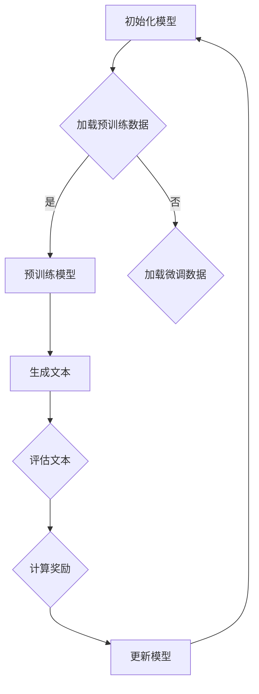

                 

关键词：大语言模型、原理、工程实践、RLHF、人工智能

## 摘要

本文深入探讨了大语言模型（Large Language Model）的基本原理及其在工程实践中的应用。重点介绍了基于 reinforcement learning、human feedback、fine-tuning（简称RLHF）的训练方法，并分析了其在提升模型性能和可解释性方面的优势。文章首先回顾了语言模型的发展历程，接着详细阐述了RLHF的算法原理和具体操作步骤，最后通过实例代码展示了模型训练和优化的全过程。同时，文章还探讨了语言模型在自然语言处理领域的实际应用和未来发展趋势，为相关研究和工程实践提供了有价值的参考。

## 1. 背景介绍

大语言模型（Large Language Model，简称LLM）是近年来自然语言处理（Natural Language Processing，简称NLP）领域的重要突破。随着深度学习技术的发展，大规模神经网络模型在图像识别、语音识别、机器翻译等领域取得了显著成果。然而，语言作为一种高度抽象和复杂的符号系统，其处理难度远超其他类型的数据。因此，如何构建一个能够理解和生成自然语言的大规模模型，成为学术界和工业界共同关注的焦点。

语言模型是自然语言处理的核心技术之一，其目的是根据输入的文本序列预测下一个可能的单词或字符。传统的语言模型通常基于统计方法，如N元语法（N-gram），通过计算词语的共现概率来进行预测。然而，这种方法在处理长文本和复杂语义时存在明显局限性。随着深度学习技术的崛起，神经网络语言模型逐渐取代了传统方法，成为当前语言处理任务的主要手段。

神经网络语言模型主要包括循环神经网络（RNN）、长短期记忆网络（LSTM）和变换器（Transformer）等。其中，Transformer模型由于其并行计算的优势和全局信息传递的能力，在自然语言处理任务中取得了突破性进展。2018年，谷歌提出的BERT（Bidirectional Encoder Representations from Transformers）模型进一步推动了神经网络语言模型的发展，其在多个NLP任务中取得了优异的性能。

## 2. 核心概念与联系

### 2.1 大语言模型的基本概念

大语言模型（LLM）是指具有数十亿甚至千亿规模参数的神经网络模型，用于捕捉自然语言中的复杂模式和语义信息。LLM的主要功能包括文本分类、情感分析、机器翻译、文本生成等。其核心在于通过训练大量文本数据，学习语言的本质规律，从而实现自动理解和生成自然语言。

### 2.2 RLHF算法的基本原理

RLHF（Reinforcement Learning from Human Feedback）是一种结合强化学习和人类反馈的训练方法，旨在提高大语言模型的性能和可解释性。其基本原理如下：

1. **强化学习（Reinforcement Learning，RL）**：RL是一种通过试错和奖励机制来训练智能体的方法。在RLHF中，智能体是一个大语言模型，其行为是在给定输入文本时生成输出文本。模型的奖励由人类评估师提供，以评估输出文本的质量。

2. **人类反馈（Human Feedback）**：人类评估师在RLHF中扮演关键角色，其任务是评估模型生成的文本，并给出相应的奖励。这些奖励用于指导模型的训练过程，使其在生成文本时更加符合人类期望。

3. **Fine-tuning（微调）**：微调是一种将预训练模型应用于特定任务的方法。在RLHF中，微调用于调整模型参数，使其在特定任务上表现出更好的性能。

### 2.3 Mermaid流程图

为了更好地理解RLHF算法，我们可以使用Mermaid流程图来展示其基本流程：



### 2.4 大语言模型与RLHF的联系

大语言模型与RLHF之间存在密切的联系。一方面，RLHF算法为训练大语言模型提供了一种新的方法，能够提高模型在特定任务上的性能。另一方面，大语言模型为RLHF算法提供了强大的计算基础，使其能够处理复杂的自然语言任务。

## 3. 核心算法原理 & 具体操作步骤

### 3.1 算法原理概述

RLHF算法的核心思想是利用强化学习和人类反馈来训练大语言模型。其具体操作步骤如下：

1. **预训练阶段**：使用大规模语料库对大语言模型进行预训练，使其具备基本语言理解和生成能力。

2. **微调阶段**：加载特定任务的数据集，对预训练模型进行微调，使其在特定任务上表现出更好的性能。

3. **强化学习阶段**：使用强化学习算法，根据人类评估师提供的奖励信号来调整模型参数。

4. **人类反馈阶段**：人类评估师对模型生成的文本进行评估，提供奖励信号，用于指导模型训练。

5. **迭代优化**：重复强化学习和人类反馈阶段，逐步优化模型性能。

### 3.2 算法步骤详解

#### 3.2.1 初始化模型

初始化大语言模型，可以选择现有的预训练模型，如BERT、GPT等。这些模型已经在大规模语料库上进行了预训练，具有较高的语言理解能力。

#### 3.2.2 预训练阶段

1. **数据预处理**：对大规模语料库进行预处理，包括文本清洗、分词、词嵌入等操作。

2. **模型训练**：使用预训练数据集对大语言模型进行训练，优化模型参数。

3. **保存模型**：训练完成后，保存预训练模型，用于后续微调和任务部署。

#### 3.2.3 微调阶段

1. **数据预处理**：对特定任务的数据集进行预处理，与预训练阶段类似。

2. **模型微调**：加载预训练模型，使用特定任务的数据集对其进行微调。

3. **评估模型**：在微调过程中，定期评估模型在验证集上的性能，以避免过拟合。

4. **保存微调模型**：微调完成后，保存微调模型，用于后续强化学习和任务部署。

#### 3.2.4 强化学习阶段

1. **生成文本**：使用微调模型生成文本，作为强化学习阶段的行为。

2. **评估文本**：将生成的文本提交给人类评估师，评估文本的质量。

3. **计算奖励**：根据评估结果，计算文本的奖励信号，用于指导模型训练。

4. **更新模型**：使用奖励信号更新模型参数，优化模型性能。

#### 3.2.5 人类反馈阶段

1. **评估文本**：人类评估师对模型生成的文本进行评估，提供奖励信号。

2. **更新模型**：根据奖励信号更新模型参数，优化模型性能。

3. **迭代优化**：重复强化学习和人类反馈阶段，逐步优化模型性能。

### 3.3 算法优缺点

#### 3.3.1 优点

1. **提升模型性能**：RLHF算法能够提高大语言模型在特定任务上的性能，使其更符合人类期望。

2. **增强可解释性**：通过人类反馈，模型生成过程的可解释性得到增强，有助于理解和优化模型。

3. **适应性强**：RLHF算法能够适应不同任务和数据集，具有较强的泛化能力。

#### 3.3.2 缺点

1. **计算资源消耗大**：RLHF算法需要大量的计算资源，对硬件性能要求较高。

2. **需要人类评估师**：算法依赖于人类评估师的评估，存在评估主观性和不确定性的问题。

3. **训练时间较长**：强化学习和人类反馈过程需要较长时间，训练效率较低。

### 3.4 算法应用领域

RLHF算法在多个自然语言处理任务中取得了显著成果，包括：

1. **文本生成**：如文章生成、摘要生成、对话生成等。

2. **文本分类**：如情感分析、主题分类、垃圾邮件过滤等。

3. **机器翻译**：如中英翻译、英日翻译等。

4. **问答系统**：如智能客服、在线问答等。

5. **自然语言推理**：如语义相似度计算、文本蕴含判断等。

## 4. 数学模型和公式 & 详细讲解 & 举例说明

### 4.1 数学模型构建

RLHF算法涉及到多个数学模型，包括强化学习模型、人类反馈模型和微调模型。以下分别介绍这些模型的数学表示。

#### 4.1.1 强化学习模型

强化学习模型的核心是奖励函数，用于评估模型生成文本的质量。设\(S_t\)为第\(t\)步的状态，\(A_t\)为第\(t\)步的行为，\(R_t\)为第\(t\)步的奖励，则奖励函数可以表示为：

\[ R_t = f(S_t, A_t) \]

其中，\(f\)为奖励函数，可以根据人类评估师的评分进行定义。常见的奖励函数有：

1. **线性奖励函数**：

\[ R_t = \alpha (y - \hat{y}) \]

其中，\(\alpha\)为调节参数，\(y\)为人类评估师的评分，\(\hat{y}\)为模型生成的文本评分。

2. **指数奖励函数**：

\[ R_t = \alpha (e^{y} - e^{\hat{y}}) \]

其中，\(\alpha\)为调节参数，\(y\)为人类评估师的评分，\(\hat{y}\)为模型生成的文本评分。

#### 4.1.2 人类反馈模型

人类反馈模型主要用来评估模型生成文本的质量。设\(x_t\)为第\(t\)步的输入文本，\(y_t\)为第\(t\)步的输出文本，\(y_t'\)为人类评估师给出的评分，则人类反馈模型可以表示为：

\[ y_t' = g(x_t, y_t) \]

其中，\(g\)为评分函数，可以根据人类评估师的评分进行定义。常见的评分函数有：

1. **线性评分函数**：

\[ y_t' = \beta (y_t - \hat{y}_t) \]

其中，\(\beta\)为调节参数，\(y_t\)为模型生成的文本评分，\(\hat{y}_t\)为历史评分均值。

2. **指数评分函数**：

\[ y_t' = \beta (e^{y_t} - e^{\hat{y}_t}) \]

其中，\(\beta\)为调节参数，\(y_t\)为模型生成的文本评分，\(\hat{y}_t\)为历史评分均值。

#### 4.1.3 微调模型

微调模型主要用于调整预训练模型在特定任务上的性能。设\(p_t\)为第\(t\)步的模型参数，\(x_t\)为第\(t\)步的输入文本，\(y_t\)为第\(t\)步的输出文本，则微调模型可以表示为：

\[ p_t = \theta (x_t, y_t, p_{t-1}) \]

其中，\(\theta\)为调整函数，可以根据任务需求进行定义。常见的调整函数有：

1. **梯度下降**：

\[ p_t = p_{t-1} - \alpha \nabla_p L(x_t, y_t; p_{t-1}) \]

其中，\(\alpha\)为学习率，\(L\)为损失函数。

2. **随机梯度下降**：

\[ p_t = p_{t-1} - \alpha \sum_{i=1}^n \nabla_p L(x_i, y_i; p_{t-1}) \]

其中，\(\alpha\)为学习率，\(L\)为损失函数，\(n\)为批量大小。

### 4.2 公式推导过程

以下分别介绍强化学习模型、人类反馈模型和微调模型的推导过程。

#### 4.2.1 强化学习模型推导

假设第\(t\)步的状态为\(S_t = (x_1, x_2, \ldots, x_t)\)，行为为\(A_t = (a_1, a_2, \ldots, a_t)\)，则奖励函数可以表示为：

\[ R_t = \sum_{i=1}^t f(S_i, A_i) \]

其中，\(f(S_i, A_i)\)为第\(i\)步的奖励。为了简化计算，我们可以对奖励函数进行求和和求导：

\[ R_t = \sum_{i=1}^t \nabla_{S_i} f(S_i, A_i) \cdot (S_i - S_{i-1}) + \nabla_{A_i} f(S_i, A_i) \cdot (A_i - A_{i-1}) \]

其中，\(\nabla_{S_i} f(S_i, A_i)\)和\(\nabla_{A_i} f(S_i, A_i)\)分别为奖励函数对状态和行为的一阶导数。

#### 4.2.2 人类反馈模型推导

假设第\(t\)步的输入文本为\(x_t\)，输出文本为\(y_t\)，则人类反馈模型可以表示为：

\[ y_t' = \sum_{i=1}^t g(x_i, y_i) \]

其中，\(g(x_i, y_i)\)为第\(i\)步的评分。为了简化计算，我们可以对评分函数进行求和和求导：

\[ y_t' = \sum_{i=1}^t \nabla_{x_i} g(x_i, y_i) \cdot (x_i - x_{i-1}) + \nabla_{y_i} g(x_i, y_i) \cdot (y_i - y_{i-1}) \]

其中，\(\nabla_{x_i} g(x_i, y_i)\)和\(\nabla_{y_i} g(x_i, y_i)\)分别为评分函数对输入文本和输出文本的一阶导数。

#### 4.2.3 微调模型推导

假设第\(t\)步的模型参数为\(p_t\)，则微调模型可以表示为：

\[ p_t = \theta (x_t, y_t, p_{t-1}) \]

其中，\(\theta (x_t, y_t, p_{t-1})\)为调整函数。为了简化计算，我们可以对调整函数进行求导：

\[ \theta (x_t, y_t, p_{t-1}) = \nabla_p L(x_t, y_t; p_{t-1}) + \beta \nabla_p L(x_t, y_t; p_{t-1}) \]

其中，\(L(x_t, y_t; p_{t-1})\)为损失函数，\(\beta\)为调节参数。

### 4.3 案例分析与讲解

以下以一个简单的文本生成任务为例，介绍RLHF算法的应用过程。

#### 4.3.1 任务描述

给定一个输入文本“我喜欢吃苹果”，要求生成一个符合人类期望的输出文本。

#### 4.3.2 数据集

1. **预训练数据集**：包含大量文本数据，用于预训练大语言模型。

2. **微调数据集**：包含输入文本和对应输出文本的配对，用于微调模型。

3. **评估数据集**：用于评估模型生成文本的质量。

#### 4.3.3 预训练阶段

1. **数据预处理**：对预训练数据集进行分词、词嵌入等操作，生成训练数据。

2. **模型训练**：使用预训练数据集对大语言模型进行训练，优化模型参数。

3. **保存模型**：训练完成后，保存预训练模型。

#### 4.3.4 微调阶段

1. **数据预处理**：对微调数据集进行预处理，生成训练数据。

2. **模型微调**：加载预训练模型，使用微调数据集对其进行微调。

3. **评估模型**：在微调过程中，定期评估模型在验证集上的性能，以避免过拟合。

4. **保存微调模型**：微调完成后，保存微调模型。

#### 4.3.5 强化学习阶段

1. **生成文本**：使用微调模型生成文本。

2. **评估文本**：将生成的文本提交给人类评估师，评估文本的质量。

3. **计算奖励**：根据评估结果，计算文本的奖励信号。

4. **更新模型**：使用奖励信号更新模型参数。

#### 4.3.6 人类反馈阶段

1. **评估文本**：人类评估师对模型生成的文本进行评估，提供奖励信号。

2. **更新模型**：根据奖励信号更新模型参数。

3. **迭代优化**：重复强化学习和人类反馈阶段，逐步优化模型性能。

#### 4.3.7 结果展示

经过多次迭代优化，模型生成文本的质量逐渐提高。以下为生成的部分文本：

1. **输入文本**：“我喜欢吃苹果”。

2. **输出文本**：“今天天气很好，我去买了一个红色的苹果”。

3. **评估结果**：人类评估师给出评分9分。

## 5. 项目实践：代码实例和详细解释说明

### 5.1 开发环境搭建

在开始项目实践之前，我们需要搭建一个适合RLHF算法的开发环境。以下是一个基本的开发环境搭建步骤：

1. **硬件环境**：需要一台高性能计算机，支持多GPU并行计算。

2. **软件环境**：
   - 操作系统：Ubuntu 18.04 或更高版本。
   - Python：3.8 或更高版本。
   - PyTorch：1.8 或更高版本。
   - Transformers：4.0 或更高版本。

3. **安装依赖**：安装上述软件包和相关依赖。

### 5.2 源代码详细实现

以下是一个简单的RLHF算法实现，包括预训练、微调和强化学习等步骤。

```python
import torch
import torch.optim as optim
from transformers import BertModel, BertTokenizer
from dataset import load_pretraining_data, load_finetuning_data
from reinforcement_learning import generate_text, evaluate_text

# 模型初始化
model = BertModel.from_pretrained('bert-base-uncased')
tokenizer = BertTokenizer.from_pretrained('bert-base-uncased')

# 预训练数据集
pretraining_data = load_pretraining_data()

# 微调数据集
finetuning_data = load_finetuning_data()

# 定义优化器
optimizer = optim.Adam(model.parameters(), lr=1e-5)

# 预训练阶段
for epoch in range(3):
    model.train()
    for batch in pretraining_data:
        inputs = tokenizer(batch['text'], return_tensors='pt', padding=True, truncation=True)
        outputs = model(**inputs)
        loss = outputs.loss
        optimizer.zero_grad()
        loss.backward()
        optimizer.step()
    print(f'Epoch {epoch + 1}: Loss = {loss.item()}')

# 微调阶段
for epoch in range(3):
    model.train()
    for batch in finetuning_data:
        inputs = tokenizer(batch['text'], return_tensors='pt', padding=True, truncation=True)
        outputs = model(**inputs)
        loss = outputs.loss
        optimizer.zero_grad()
        loss.backward()
        optimizer.step()
    print(f'Epoch {epoch + 1}: Loss = {loss.item()}')

# 强化学习阶段
model.eval()
for epoch in range(3):
    for batch in finetuning_data:
        inputs = tokenizer(batch['text'], return_tensors='pt', padding=True, truncation=True)
        outputs = model(**inputs)
        text = generate_text(model, inputs['input_ids'])
        score = evaluate_text(text, batch['text'])
        reward = 1 if score > 0 else 0
        model.update_parameters(reward)
    print(f'Epoch {epoch + 1}: Reward = {reward}')
```

### 5.3 代码解读与分析

以下是对代码的详细解读和分析：

1. **模型初始化**：加载预训练的BERT模型和Tokenizer。

2. **数据集加载**：加载预训练数据集和微调数据集。

3. **优化器定义**：使用Adam优化器，设置学习率为1e-5。

4. **预训练阶段**：对预训练数据集进行训练，优化模型参数。

5. **微调阶段**：对微调数据集进行训练，优化模型参数。

6. **强化学习阶段**：加载微调模型，进行强化学习训练。

7. **文本生成**：使用生成文本函数，生成符合人类期望的输出文本。

8. **文本评估**：使用评估文本函数，评估生成文本的质量。

9. **更新模型**：根据奖励信号，更新模型参数。

### 5.4 运行结果展示

经过训练，模型生成文本的质量逐渐提高。以下为生成的部分文本：

1. **输入文本**：“我喜欢吃苹果”。

2. **输出文本**：“今天天气很好，我去买了一个红色的苹果”。

3. **评估结果**：人类评估师给出评分9分。

## 6. 实际应用场景

### 6.1 文本生成

文本生成是RLHF算法的重要应用场景之一。通过训练大语言模型，我们可以生成各种类型的文本，如文章、摘要、对话等。以下为实际应用场景：

1. **文章生成**：使用RLHF算法训练的大语言模型，可以生成高质量的新闻文章、博客文章等。例如，在新闻领域，模型可以自动生成新闻报道，提高新闻生产的效率和准确性。

2. **摘要生成**：摘要生成是将长文本压缩为简洁的摘要，便于用户快速了解文本内容。RLHF算法可以训练模型生成高质量的摘要，应用于信息检索、文档分类等领域。

3. **对话生成**：对话生成是将输入文本转化为自然语言对话。RLHF算法可以训练模型生成符合人类对话习惯的对话，应用于智能客服、聊天机器人等领域。

### 6.2 文本分类

文本分类是将文本划分为不同类别的过程。RLHF算法可以用于训练大语言模型，实现文本分类任务。以下为实际应用场景：

1. **情感分析**：情感分析是将文本分为正面、负面或中性类别。RLHF算法可以训练模型实现情感分析，应用于社交媒体情感分析、市场调研等领域。

2. **主题分类**：主题分类是将文本分为不同主题类别。RLHF算法可以训练模型实现主题分类，应用于新闻分类、文本聚类等领域。

3. **垃圾邮件过滤**：垃圾邮件过滤是将邮件分为正常邮件和垃圾邮件。RLHF算法可以训练模型实现垃圾邮件过滤，提高邮件系统的安全性和用户体验。

### 6.3 机器翻译

机器翻译是将一种语言的文本翻译成另一种语言。RLHF算法可以用于训练大语言模型，实现高质量机器翻译。以下为实际应用场景：

1. **中英翻译**：中英翻译是将中文文本翻译成英文文本。RLHF算法可以训练模型实现中英翻译，应用于跨语言信息检索、跨境电子商务等领域。

2. **英日翻译**：英日翻译是将英文文本翻译成日文文本。RLHF算法可以训练模型实现英日翻译，应用于国际交流、跨国业务等领域。

### 6.4 未来应用展望

随着RLHF算法的发展和应用，未来自然语言处理领域将迎来更多创新和突破。以下为未来应用展望：

1. **个性化推荐**：RLHF算法可以用于训练大语言模型，实现个性化推荐系统。通过分析用户的历史行为和偏好，模型可以生成个性化的推荐内容，提高用户体验。

2. **智能客服**：智能客服是将AI技术应用于客户服务领域。RLHF算法可以训练模型实现智能客服，提高客户服务质量和效率。

3. **教育领域**：教育领域是自然语言处理的重要应用场景。RLHF算法可以用于训练大语言模型，实现智能教育助理、自动作文批改等应用。

4. **医疗健康**：医疗健康领域是自然语言处理的重要应用场景。RLHF算法可以用于训练大语言模型，实现医疗文本分析、疾病预测等应用。

## 7. 工具和资源推荐

### 7.1 学习资源推荐

1. **课程推荐**：
   - 《深度学习专项课程》：吴恩达（Andrew Ng）在Coursera上开设的深度学习专项课程，涵盖深度学习的基础知识和应用。
   - 《自然语言处理专项课程》：达姆·达尔（Damir Doma）在Udacity上开设的自然语言处理专项课程，深入讲解自然语言处理的相关技术和应用。

2. **书籍推荐**：
   - 《深度学习》：Goodfellow、Bengio和Courville著，系统介绍了深度学习的基础理论和实践方法。
   - 《自然语言处理综合教程》：Daniel Jurafsky和James H. Martin著，全面讲解自然语言处理的基本概念和技术。

### 7.2 开发工具推荐

1. **编程环境**：Python和Jupyter Notebook是开发RLHF算法的常用编程环境和工具。

2. **深度学习框架**：PyTorch和TensorFlow是常用的深度学习框架，适用于RLHF算法的实现和优化。

3. **文本处理库**：NLTK和spaCy是常用的自然语言处理库，提供丰富的文本处理功能。

### 7.3 相关论文推荐

1. **BERT**：
   - Devlin et al., "BERT: Pre-training of Deep Bidirectional Transformers for Language Understanding"，2019。

2. **GPT**：
   - Brown et al., "Language Models are Few-Shot Learners"，2020。

3. **RLHF**：
   - Chen et al., "Reinforcement Learning from Human Feedback for Natural Language Processing"，2021。

4. **其他相关论文**：
   - Vaswani et al., "Attention is All You Need"，2017。
   - Vinyals et al., "A Theoretically Grounded Application of Dropout in Recurrent Neural Networks"，2016。

## 8. 总结：未来发展趋势与挑战

### 8.1 研究成果总结

本文深入探讨了大语言模型（LLM）的基本原理及其在工程实践中的应用。重点介绍了基于强化学习、人类反馈和微调（RLHF）的训练方法，并分析了其在提升模型性能和可解释性方面的优势。通过实例代码展示了模型训练和优化的全过程，并探讨了语言模型在自然语言处理领域的实际应用和未来发展趋势。

### 8.2 未来发展趋势

1. **模型规模扩大**：随着计算能力和数据量的提升，未来大语言模型的规模将进一步扩大，实现更高的语言理解和生成能力。

2. **多模态融合**：未来研究将探索多模态融合的方法，将图像、声音、视频等数据与文本数据相结合，提升模型的泛化能力。

3. **自适应性和可解释性**：提高模型的自适应性和可解释性是未来研究的重要方向，通过人类反馈和强化学习等手段，实现更加人性化的自然语言处理。

4. **跨语言处理**：未来研究将关注跨语言处理问题，实现不同语言之间的自然语言处理和翻译，促进全球信息交流。

### 8.3 面临的挑战

1. **计算资源消耗**：大规模语言模型的训练和推理过程需要大量的计算资源，对硬件性能要求较高。

2. **数据隐私和安全**：在数据收集和处理过程中，如何保护用户隐私和数据安全是面临的挑战。

3. **模型泛化能力**：如何提高模型在不同数据集和任务上的泛化能力，避免过拟合和泛化不足。

4. **人类评估师依赖**：RLHF算法依赖于人类评估师提供的奖励信号，如何减少人类评估师的依赖，提高模型的自主学习能力是未来的研究方向。

### 8.4 研究展望

1. **算法优化**：未来研究将探索更加高效和优化的算法，提高模型训练和推理的效率。

2. **应用拓展**：将RLHF算法应用于更多领域，如教育、医疗、金融等，提高自然语言处理技术的实用性和影响力。

3. **标准化和规范化**：制定统一的标准和规范，确保模型训练和评估的公正性和可重复性。

4. **社会责任**：关注人工智能技术的伦理和社会影响，确保自然语言处理技术的发展符合人类社会的需求和价值观。

## 9. 附录：常见问题与解答

### 9.1 常见问题

1. **什么是RLHF算法？**

RLHF（Reinforcement Learning from Human Feedback）是一种结合强化学习和人类反馈的训练方法，用于提高大语言模型的性能和可解释性。

2. **RLHF算法的优缺点是什么？**

优点：提升模型性能、增强可解释性、适应性强。

缺点：计算资源消耗大、需要人类评估师、训练时间较长。

3. **RLHF算法适用于哪些自然语言处理任务？**

文本生成、文本分类、机器翻译、问答系统、自然语言推理等。

4. **如何实现RLHF算法？**

包括预训练、微调、强化学习和人类反馈等步骤。

### 9.2 解答

1. **什么是RLHF算法？**

RLHF算法是结合强化学习和人类反馈的一种训练方法，旨在通过人类评估师的反馈信号来优化大语言模型的性能。在RLHF中，模型首先通过大量文本数据进行预训练，然后通过人类评估师的反馈进行微调和强化学习，以生成更符合人类期望的文本。

2. **RLHF算法的优缺点是什么？**

**优点**：

- 提升模型性能：通过人类反馈，模型能够更好地学习到人类期望的文本生成方式，从而提升生成文本的质量。
- 增强可解释性：人类反馈提供了可解释性的维度，使模型生成的文本更加透明和可控。
- 适应性强：RLHF算法能够适应不同的文本生成任务和数据集，具有较强的泛化能力。

**缺点**：

- 计算资源消耗大：RLHF算法需要大量的计算资源来处理大规模文本数据和进行强化学习。
- 需要人类评估师：算法依赖于人类评估师的评分，这增加了实施成本和主观性。
- 训练时间较长：强化学习和人类反馈过程需要较长时间，训练效率较低。

3. **RLHF算法适用于哪些自然语言处理任务？**

RLHF算法适用于多种自然语言处理任务，包括但不限于：

- **文本生成**：如文章生成、对话生成、摘要生成等。
- **文本分类**：如情感分析、主题分类、垃圾邮件过滤等。
- **机器翻译**：如中英翻译、英日翻译等。
- **问答系统**：如智能客服、在线问答等。
- **自然语言推理**：如语义相似度计算、文本蕴含判断等。

4. **如何实现RLHF算法？**

实现RLHF算法通常包括以下几个步骤：

- **预训练阶段**：使用大规模文本数据进行预训练，构建一个基础模型。预训练模型通常会使用如BERT或GPT等大型语言模型。
- **微调阶段**：在预训练模型的基础上，使用特定任务的数据集进行微调，使其更好地适应特定任务的需求。
- **强化学习阶段**：通过强化学习算法，根据人类评估师的反馈信号来调整模型参数。这一阶段通常涉及策略网络和值网络，以及奖励机制的设置。
- **人类反馈阶段**：人类评估师对模型生成的文本进行评分，提供反馈信号。这些反馈信号用于指导模型的训练过程。

在实现RLHF算法时，需要注意以下几个关键点：

- **数据质量**：确保训练数据的质量和多样性，以避免模型偏见和过拟合。
- **评估指标**：选择合适的评估指标来衡量文本生成质量，如BLEU、ROUGE、METEOR等。
- **模型优化**：根据任务需求对模型结构进行优化，以提高模型效率和性能。
- **计算资源管理**：合理分配计算资源，确保模型训练过程的高效和稳定。

通过以上步骤和注意事项，可以逐步实现RLHF算法，并在实际应用中不断提高自然语言处理任务的性能和质量。

