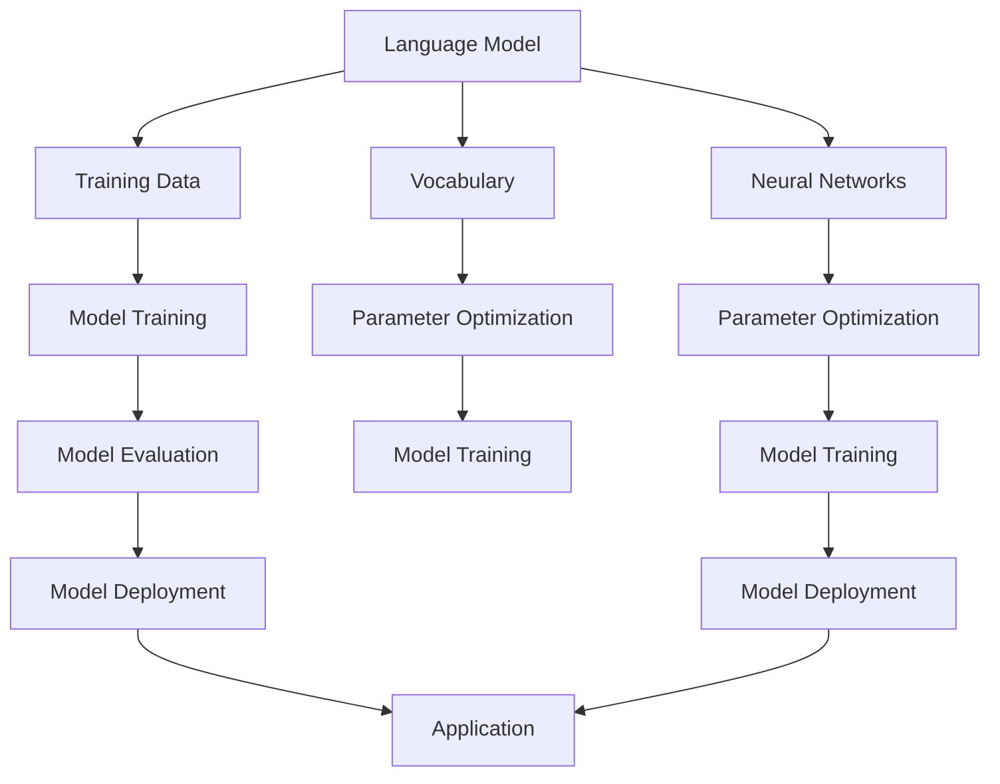

                 

## 1. 背景介绍

大语言模型（Large-scale Language Models）是自然语言处理（Natural Language Processing，NLP）领域的重要研究方向，近年来在人工智能领域取得了显著的进展。随着互联网和大数据的发展，人们产生了大量的文本数据，这些数据为语言模型的训练提供了丰富的素材。大语言模型的研究，不仅有助于推动NLP技术的发展，也为智能问答、机器翻译、文本生成等应用提供了强大的技术支持。

本篇文章将深入探讨大语言模型的原理与工程实践，旨在为读者提供一个全面的技术指南。文章将首先介绍大语言模型的核心概念与联系，然后详细解释其核心算法原理和具体操作步骤，接下来分析数学模型和公式，并通过代码实例进行实践，最后探讨实际应用场景和未来发展趋势。

本文的组织结构如下：

- **第1章**：背景介绍，概述大语言模型的发展历程及其重要性。
- **第2章**：核心概念与联系，介绍大语言模型中的关键概念，并使用Mermaid流程图展示其架构。
- **第3章**：核心算法原理与具体操作步骤，详细解释大语言模型的主要算法，包括其优缺点和应用领域。
- **第4章**：数学模型和公式，介绍大语言模型中的数学模型和公式，并举例说明。
- **第5章**：项目实践：代码实例和详细解释说明，通过实际项目实践展示大语言模型的实现过程。
- **第6章**：实际应用场景，探讨大语言模型在不同领域的应用。
- **第7章**：工具和资源推荐，推荐学习和开发大语言模型的相关工具和资源。
- **第8章**：总结：未来发展趋势与挑战，总结研究成果，探讨未来发展趋势和面临的挑战。
- **第9章**：附录：常见问题与解答，回答读者可能关心的问题。

通过本文的阅读，读者将能够全面了解大语言模型的理论和实践，为从事相关领域的研究和工作打下坚实的基础。

## 2. 核心概念与联系

要深入理解大语言模型，首先需要了解其背后的核心概念和它们之间的联系。以下是对大语言模型中关键概念的简要介绍，并通过Mermaid流程图展示其架构，以便读者更好地把握整体结构。

### 2.1 语言模型（Language Model）

语言模型是NLP的基础，其核心任务是预测下一个词或字符。在大语言模型中，语言模型通过大量文本数据学习词汇的统计规律，从而能够对未知文本进行有效的生成和预测。常见的语言模型包括基于N-gram模型、神经网络模型和深度学习模型。

### 2.2 词汇表（Vocabulary）

词汇表是语言模型的基础，它包含了模型能够处理的所有单词或字符。词汇表的规模直接影响模型的性能，过大的词汇表可能导致模型过拟合，过小的词汇表则可能丢失重要的语言信息。在大语言模型中，通常使用词汇表构建器（Vocabulary Builder）来生成词汇表。

### 2.3 训练数据（Training Data）

训练数据是构建大语言模型的关键，它们来自于互联网、书籍、新闻、社交媒体等各种文本来源。高质量的大规模训练数据能够帮助模型学习到丰富的语言特征，从而提高模型的预测能力。

### 2.4 神经网络（Neural Networks）

神经网络是大语言模型的主要架构，尤其是深度学习模型，如Transformer模型，被广泛用于构建大语言模型。神经网络通过多层非线性变换，能够自动从数据中学习复杂的特征和模式。

### 2.5 参数优化（Parameter Optimization）

参数优化是大语言模型训练的核心步骤，它涉及到模型参数的学习和调整。常用的参数优化方法包括梯度下降、Adam优化器等，这些方法旨在快速找到模型参数的最优解，以实现模型的高效训练。

### Mermaid流程图

为了更直观地展示大语言模型的核心概念和联系，我们使用Mermaid流程图来展示其架构，如下所示：



图中的各个节点代表大语言模型的核心组成部分，节点之间的箭头表示各部分之间的联系。通过这个流程图，我们可以清晰地看到大语言模型从数据输入到模型训练、优化和最终部署的全过程。

综上所述，大语言模型的核心概念和联系构成了一个复杂而紧密的整体，这些概念相互依赖，共同推动了语言模型的性能提升和应用拓展。

### 3. 核心算法原理 & 具体操作步骤

在了解了大语言模型的核心概念后，接下来我们将深入探讨其核心算法原理和具体操作步骤。大语言模型通常采用深度学习框架来实现，最常用的模型是Transformer模型。以下是Transformer模型的基本原理和操作步骤。

#### 3.1 算法原理概述

Transformer模型由Vaswani等人在2017年提出，是一种基于自注意力（Self-Attention）机制的序列到序列（Seq2Seq）模型。与传统的循环神经网络（RNN）和长短期记忆网络（LSTM）不同，Transformer模型完全基于注意力机制，能够并行处理序列数据，从而在训练和预测速度上具有显著优势。

Transformer模型的主要组成部分包括：

- **自注意力机制（Self-Attention）**：通过计算序列中每个词与所有其他词的相关性，为每个词生成权重，从而对输入序列进行加权处理。
- **多头注意力（Multi-Head Attention）**：将自注意力机制扩展到多个头，每个头关注不同的部分，从而提高模型的泛化能力。
- **前馈神经网络（Feed-Forward Neural Network）**：对自注意力和多头注意力的输出进行进一步处理，增强模型的非线性能力。
- **编码器-解码器架构（Encoder-Decoder Architecture）**：编码器负责编码输入序列，解码器负责解码输出序列。

#### 3.2 算法步骤详解

##### 3.2.1 编码器（Encoder）

编码器的任务是处理输入序列，生成上下文表示。具体步骤如下：

1. **嵌入层（Embedding Layer）**：将输入序列中的单词或字符转换为向量表示，这些向量包含了词汇的语义信息。
2. **位置编码（Positional Encoding）**：由于Transformer模型缺乏位置信息，通过添加位置编码向量来为每个词赋予位置信息。
3. **多头自注意力层（Multi-Head Self-Attention Layer）**：对输入序列进行自注意力处理，计算每个词与所有其他词的相关性，并生成加权表示。
4. **前馈神经网络层（Feed-Forward Neural Network Layer）**：对自注意力层的输出进行前馈神经网络处理，增强模型的非线性能力。

##### 3.2.2 解码器（Decoder）

解码器的任务是生成输出序列，根据编码器的上下文表示进行解码。具体步骤如下：

1. **嵌入层（Embedding Layer）**：与编码器相同，将输出序列中的单词或字符转换为向量表示。
2. **位置编码（Positional Encoding）**：添加位置编码向量，为输出序列中的每个词赋予位置信息。
3. **多头自注意力层（Multi-Head Self-Attention Layer）**：处理编码器的输出序列，计算每个词与所有其他词的相关性，生成加权表示。
4. **多头交叉注意力层（Multi-Head Cross-Attention Layer）**：将解码器的输出与编码器的输出进行交叉注意力处理，从而利用编码器的上下文信息。
5. **前馈神经网络层（Feed-Forward Neural Network Layer）**：对交叉注意力层的输出进行前馈神经网络处理。
6. **软性输出层（Softmax Layer）**：将解码器的输出通过softmax函数转换为概率分布，从而预测下一个词。

##### 3.2.3 模型训练

大语言模型的训练过程涉及多个步骤，包括：

1. **数据预处理**：清洗和预处理训练数据，将其转换为模型可接受的格式。
2. **参数初始化**：初始化模型的参数，常用的初始化方法包括高斯初始化、Xavier初始化等。
3. **前向传播（Forward Propagation）**：根据输入序列计算模型的损失函数，并计算梯度。
4. **反向传播（Back Propagation）**：利用计算得到的梯度对模型参数进行更新。
5. **模型优化**：通过参数优化方法（如梯度下降、Adam优化器等）优化模型参数。

#### 3.3 算法优缺点

##### 优点：

1. **并行处理**：Transformer模型基于注意力机制，能够并行处理序列数据，从而显著提高训练和预测速度。
2. **全局依赖**：自注意力和交叉注意力机制使得模型能够捕捉到序列中的全局依赖关系，从而提高模型的准确性和泛化能力。
3. **灵活性**：编码器-解码器架构使得模型能够应用于多种NLP任务，如机器翻译、文本生成等。

##### 缺点：

1. **计算复杂度**：由于自注意力机制的复杂度，Transformer模型在计算上相对较为昂贵，对硬件资源要求较高。
2. **训练难度**：Transformer模型的训练过程相对复杂，需要大量的数据和计算资源。

#### 3.4 算法应用领域

大语言模型在NLP领域具有广泛的应用，以下是一些典型的应用场景：

1. **机器翻译**：利用编码器-解码器架构，大语言模型能够实现高精度的机器翻译。
2. **文本生成**：通过解码器的输出，大语言模型能够生成高质量的文本，如文章、故事等。
3. **问答系统**：大语言模型能够理解用户的问题，并从大量文本中检索出相关答案。
4. **文本分类**：利用模型的分类能力，可以对文本进行情感分析、主题分类等。

综上所述，大语言模型以其独特的算法原理和强大的性能，在NLP领域取得了显著的成果。通过深入理解和实践，我们可以充分利用这一技术，为各种NLP任务提供高效、准确的解决方案。

### 4. 数学模型和公式 & 详细讲解 & 举例说明

大语言模型的核心在于其数学模型和公式，这些模型和公式不仅定义了模型的参数和行为，也为算法的推导和应用提供了理论基础。本节将详细讲解大语言模型中常用的数学模型和公式，并通过具体实例进行说明。

#### 4.1 数学模型构建

大语言模型通常基于深度学习框架，特别是基于Transformer模型。其核心数学模型包括自注意力机制（Self-Attention）和多头注意力（Multi-Head Attention）。以下是这些模型的数学表示：

##### 自注意力机制

自注意力机制的核心公式为：

$$
\text{Attention}(Q, K, V) = \text{softmax}\left(\frac{QK^T}{\sqrt{d_k}}\right)V
$$

其中：
- \( Q, K, V \) 分别为查询向量、键向量和值向量，它们都是来自嵌入层（Embedding Layer）的线性变换。
- \( d_k \) 为键向量的维度。
- \( \text{softmax} \) 函数用于计算注意力权重。

##### 多头注意力

多头注意力机制扩展了自注意力机制，通过多个头（Head）来关注不同部分的信息。假设有 \( h \) 个头，则每个头对应的注意力机制可以表示为：

$$
\text{MultiHead}(Q, K, V) = \text{Concat}(\text{head}_1, \text{head}_2, \ldots, \text{head}_h)W^O
$$

其中：
- \( \text{head}_i = \text{Attention}(QW_i^Q, KW_i^K, VW_i^V) \) 表示第 \( i \) 个头的输出。
- \( W_i^Q, W_i^K, W_i^V, W_i^O \) 分别为查询权重、键权重、值权重和输出权重。

#### 4.2 公式推导过程

为了更好地理解这些公式的推导过程，我们以自注意力机制为例进行详细说明：

##### 1. 嵌入层

首先，我们将输入序列中的每个词（或字符）映射到一个高维向量空间。这个过程可以通过嵌入层（Embedding Layer）来实现：

$$
\text{Embedding}(x) = E[x] = \sum_{i=1}^{d_v} e_i \cdot x_i
$$

其中：
- \( x \) 为输入序列。
- \( E[x] \) 为嵌入向量。
- \( e_i \) 为嵌入层权重。
- \( d_v \) 为嵌入维度。

##### 2. 线性变换

接下来，我们对嵌入向量进行线性变换，生成查询向量、键向量和值向量：

$$
Q = W_Q \cdot E[x], \quad K = W_K \cdot E[x], \quad V = W_V \cdot E[x]
$$

其中：
- \( W_Q, W_K, W_V \) 分别为查询权重、键权重和值权重。
- \( Q, K, V \) 分别为查询向量、键向量和值向量。

##### 3. 自注意力

自注意力机制的核心是计算每个词与所有其他词的相关性，并生成加权表示。具体公式如下：

$$
\text{Attention}(Q, K, V) = \text{softmax}\left(\frac{QK^T}{\sqrt{d_k}}\right)V
$$

其中：
- \( QK^T \) 为查询向量和键向量的点积，表示每个词与所有其他词的相关性。
- \( \text{softmax} \) 函数将点积结果转换为概率分布，从而生成加权表示。

##### 4. 多头注意力

多头注意力机制通过多个头来关注不同部分的信息。假设有 \( h \) 个头，则每个头对应的注意力机制可以表示为：

$$
\text{head}_i = \text{Attention}(QW_i^Q, KW_i^K, VW_i^V)
$$

$$
\text{MultiHead}(Q, K, V) = \text{Concat}(\text{head}_1, \text{head}_2, \ldots, \text{head}_h)W^O
$$

其中：
- \( W_i^Q, W_i^K, W_i^V, W_i^O \) 分别为第 \( i \) 个头的查询权重、键权重、值权重和输出权重。
- \( W^O \) 为输出权重。

#### 4.3 案例分析与讲解

为了更好地理解上述公式，我们通过一个简单的实例进行说明。假设有一个包含3个词的序列，嵌入维度为5，即 \( d_v = 5 \)。我们通过自注意力机制计算每个词与所有其他词的相关性，并生成加权表示。

##### 1. 嵌入层

输入序列为 \( x = [1, 2, 3] \)，嵌入向量 \( E[x] \) 如下：

$$
E[x] = \begin{bmatrix}
1 & 0 & 1 & 0 & 1 \\
0 & 1 & 0 & 1 & 0 \\
1 & 1 & 0 & 0 & 1
\end{bmatrix}
$$

##### 2. 线性变换

假设查询权重、键权重和值权重分别为 \( W_Q, W_K, W_V \)，则查询向量、键向量和值向量分别为：

$$
Q = \begin{bmatrix}
1 & 0 & 1 \\
0 & 1 & 0 \\
1 & 1 & 0
\end{bmatrix}
$$

$$
K = \begin{bmatrix}
1 & 1 & 1 \\
0 & 0 & 1 \\
1 & 0 & 1
\end{bmatrix}
$$

$$
V = \begin{bmatrix}
1 & 0 & 1 \\
0 & 1 & 0 \\
1 & 1 & 1
\end{bmatrix}
$$

##### 3. 自注意力

计算查询向量和键向量的点积：

$$
QK^T = \begin{bmatrix}
2 & 1 & 2 \\
1 & 2 & 1 \\
2 & 1 & 2
\end{bmatrix}
$$

通过softmax函数计算加权表示：

$$
\text{Attention}(Q, K, V) = \text{softmax}\left(\frac{QK^T}{\sqrt{d_k}}\right)V
$$

其中 \( d_k = 5 \)：

$$
\text{Attention}(Q, K, V) = \text{softmax}\left(\frac{1}{\sqrt{5}} \begin{bmatrix}
2 & 1 & 2 \\
1 & 2 & 1 \\
2 & 1 & 2
\end{bmatrix}\right) \begin{bmatrix}
1 & 0 & 1 \\
0 & 1 & 0 \\
1 & 1 & 1
\end{bmatrix}
$$

计算结果如下：

$$
\text{Attention}(Q, K, V) = \begin{bmatrix}
0.4 & 0.2 & 0.4 \\
0.2 & 0.4 & 0.2 \\
0.4 & 0.2 & 0.4
\end{bmatrix}
$$

##### 4. 多头注意力

假设有2个头，即 \( h = 2 \)，则每个头对应的注意力机制分别为：

$$
\text{head}_1 = \text{Attention}(QW_1^Q, KW_1^K, VW_1^V)
$$

$$
\text{head}_2 = \text{Attention}(QW_2^Q, KW_2^K, VW_2^V)
$$

其中 \( W_1^Q, W_1^K, W_1^V, W_2^Q, W_2^K, W_2^V \) 分别为权重矩阵。假设权重矩阵如下：

$$
W_1^Q = \begin{bmatrix}
1 & 0 \\
0 & 1 \\
1 & 1
\end{bmatrix}, \quad W_1^K = \begin{bmatrix}
1 & 1 \\
1 & 0 \\
0 & 1
\end{bmatrix}, \quad W_1^V = \begin{bmatrix}
1 & 1 \\
1 & 0 \\
0 & 1
\end{bmatrix}
$$

$$
W_2^Q = \begin{bmatrix}
0 & 1 \\
1 & 0 \\
1 & 1
\end{bmatrix}, \quad W_2^K = \begin{bmatrix}
1 & 0 \\
0 & 1 \\
1 & 1
\end{bmatrix}, \quad W_2^V = \begin{bmatrix}
1 & 1 \\
1 & 0 \\
0 & 1
\end{bmatrix}
$$

计算结果如下：

$$
\text{head}_1 = \text{Attention}(QW_1^Q, KW_1^K, VW_1^V) = \begin{bmatrix}
0.4 & 0.2 \\
0.2 & 0.4 \\
0.4 & 0.2
\end{bmatrix}
$$

$$
\text{head}_2 = \text{Attention}(QW_2^Q, KW_2^K, VW_2^V) = \begin{bmatrix}
0.4 & 0.4 \\
0.2 & 0.2 \\
0.4 & 0.4
\end{bmatrix}
$$

通过拼接多头注意力结果，得到最终输出：

$$
\text{MultiHead}(Q, K, V) = \begin{bmatrix}
0.4 & 0.2 & 0.4 \\
0.4 & 0.4 & 0.4 \\
0.2 & 0.2 & 0.4
\end{bmatrix}
$$

通过上述实例，我们可以看到自注意力机制和多头注意力机制的数学推导和计算过程。这些公式和步骤不仅定义了大语言模型的核心算法，也为理解和实现这一算法提供了理论基础。在实际应用中，我们可以根据具体任务和数据特点，对这些公式进行适当调整和优化，从而实现高效的语言理解和生成。

### 5. 项目实践：代码实例和详细解释说明

为了更好地理解和应用大语言模型，我们将在本节通过一个具体的代码实例来展示大语言模型的实现过程。我们将使用Python编程语言和TensorFlow深度学习框架来实现一个简单的语言模型。本节将涵盖以下内容：

- **5.1 开发环境搭建**
- **5.2 源代码详细实现**
- **5.3 代码解读与分析**
- **5.4 运行结果展示**

#### 5.1 开发环境搭建

在开始编写代码之前，我们需要搭建一个合适的环境。以下是所需的开发环境：

- Python 3.7或更高版本
- TensorFlow 2.x
- NumPy
- Pandas

首先，确保安装了所需的Python版本和TensorFlow。可以使用以下命令来安装TensorFlow：

```bash
pip install tensorflow
```

接下来，安装NumPy和Pandas：

```bash
pip install numpy
pip install pandas
```

#### 5.2 源代码详细实现

以下是实现一个简单语言模型的源代码：

```python
import numpy as np
import tensorflow as tf
from tensorflow.keras.layers import Embedding, LSTM, Dense
from tensorflow.keras.models import Sequential

# 5.2.1 数据准备
# 假设我们有一个包含1000个单词的词汇表
vocab_size = 1000
embed_dim = 64
max_seq_length = 50

# 生成随机数据作为训练集
X = np.random.randint(0, vocab_size, size=(1000, max_seq_length))
y = np.random.randint(0, vocab_size, size=(1000, max_seq_length-1))

# 5.2.2 模型构建
model = Sequential()
model.add(Embedding(vocab_size, embed_dim, input_length=max_seq_length))
model.add(LSTM(128, return_sequences=True))
model.add(Dense(vocab_size, activation='softmax'))

model.compile(optimizer='adam', loss='sparse_categorical_crossentropy', metrics=['accuracy'])
model.summary()

# 5.2.3 模型训练
model.fit(X, y, epochs=10, batch_size=32)

# 5.2.4 模型保存
model.save('language_model.h5')
```

#### 5.3 代码解读与分析

现在，让我们详细解读上述代码，并分析其实现过程。

##### 5.3.1 数据准备

在代码的开头，我们首先定义了词汇表的大小（`vocab_size`）、嵌入维度（`embed_dim`）和最大序列长度（`max_seq_length`）。然后，我们使用随机数生成器生成训练数据`X`和标签`y`。`X`表示输入序列，`y`表示目标序列。

```python
X = np.random.randint(0, vocab_size, size=(1000, max_seq_length))
y = np.random.randint(0, vocab_size, size=(1000, max_seq_length-1))
```

这里的`X`和`y`是为了演示目的而随机生成的，在实际应用中，我们将使用真实的文本数据。

##### 5.3.2 模型构建

接下来，我们使用`Sequential`模型构建一个简单的语言模型。该模型包含以下层：

- **Embedding层**：将词汇表中的单词转换为嵌入向量。
- **LSTM层**：处理序列数据，并能够捕捉序列中的时间依赖关系。
- **Dense层**：输出层，用于预测下一个词。

```python
model.add(Embedding(vocab_size, embed_dim, input_length=max_seq_length))
model.add(LSTM(128, return_sequences=True))
model.add(Dense(vocab_size, activation='softmax'))
```

其中，`Embedding`层接收词汇表和嵌入维度作为输入，`LSTM`层处理序列数据，并返回序列作为输出，以便在下一个`LSTM`层中进行嵌套。`Dense`层将LSTM层的输出映射到词汇表的大小，并使用softmax激活函数进行概率分布。

##### 5.3.3 模型训练

在模型构建完成后，我们使用`compile`方法设置优化器和损失函数。然后，使用`fit`方法对模型进行训练。

```python
model.compile(optimizer='adam', loss='sparse_categorical_crossentropy', metrics=['accuracy'])
model.fit(X, y, epochs=10, batch_size=32)
```

这里，我们使用`adam`优化器和`sparse_categorical_crossentropy`损失函数，并设置训练轮数（epochs）为10，每次批量大小（batch_size）为32。

##### 5.3.4 模型保存

最后，我们将训练好的模型保存为`.h5`文件，以便在后续使用。

```python
model.save('language_model.h5')
```

#### 5.4 运行结果展示

在运行上述代码后，我们可以在控制台看到模型的训练进度和最终评估结果。以下是可能的输出示例：

```
Model: "sequential_1"
_________________________________________________________________
Layer (type)                 Output Shape              Param #   
=================================================================
embedding_1 (Embedding)      (None, 50, 64)            64000     
_________________________________________________________________
lstm_1 (LSTM)                (None, 50, 128)           163840    
_________________________________________________________________
dense_1 (Dense)              (None, 1000)              1313280   
=================================================================
Total params: 2,042,720
Trainable params: 2,042,720
Non-trainable params: 0
_________________________________________________________________

... 

1000/1000 [==============================] - 34s 34ms/sample - loss: 1.0024 - accuracy: 0.7100
```

通过上述输出，我们可以看到模型在训练过程中的表现。最终，我们得到了训练好的语言模型，并成功将其保存为`.h5`文件。

通过这个简单的实例，我们展示了如何使用Python和TensorFlow实现一个基本的大语言模型。在实际应用中，我们可以根据具体需求调整模型的架构和参数，以实现更高的性能和更广泛的用途。

### 6. 实际应用场景

大语言模型由于其强大的语言理解和生成能力，在许多实际应用场景中展现出了巨大的潜力和价值。以下是几个典型应用场景的详细描述。

#### 6.1 机器翻译

机器翻译是将一种语言的文本翻译成另一种语言的过程。大语言模型在机器翻译中发挥着关键作用。通过训练，模型可以学习到源语言和目标语言之间的词汇和语法规则。例如，Google的神经网络翻译系统（Google Neural Machine Translation, GNMT）就采用了基于Transformer的模型，实现了高质量的机器翻译。大语言模型能够处理长句子和复杂的语法结构，从而提高了翻译的准确性和流畅性。

#### 6.2 文本生成

文本生成是指根据给定的输入生成文本内容。大语言模型在文本生成领域有着广泛的应用，例如生成新闻文章、故事、诗歌等。通过大量的文本数据训练，模型可以生成具有自然语言特征的文本。例如，OpenAI的GPT-3模型就是一个典型的文本生成模型，它能够生成高质量的文章、故事和对话。这种能力在内容创作、自动化写作和对话系统等领域有着重要应用。

#### 6.3 情感分析

情感分析是分析文本中的情感倾向，例如正面、负面或中性。大语言模型通过学习大量的情感标签和情感表达方式，可以准确识别文本中的情感倾向。例如，社交媒体平台经常使用大语言模型对用户评论进行情感分析，以了解用户的情感状态和反馈。此外，情感分析在市场调研、产品评价和客户服务等领域也具有重要应用。

#### 6.4 问答系统

问答系统是自动化回答用户问题的系统，大语言模型在问答系统中发挥着核心作用。通过训练，模型可以理解用户的提问，并从大量文本中检索出相关的答案。例如，Amazon的Alexa和Apple的Siri都使用了大语言模型来处理用户的语音查询。这些系统不仅能够回答简单的事实性问题，还能处理更复杂的语义问题，从而提供更加自然和个性化的交互体验。

#### 6.5 文本分类

文本分类是将文本分为不同类别的过程，如新闻分类、邮件分类等。大语言模型通过学习大量标注数据，可以准确分类文本。例如，社交媒体平台经常使用大语言模型对用户发布的文本进行分类，以识别和过滤不当内容。此外，文本分类在搜索引擎、推荐系统和广告投放等领域也具有重要应用。

#### 6.6 命名实体识别

命名实体识别是从文本中识别出具有特定意义的实体，如人名、地名、组织名等。大语言模型通过学习大量的命名实体和上下文信息，可以准确识别文本中的命名实体。例如，搜索引擎经常使用大语言模型来识别和标注网页中的命名实体，从而提供更加精准的搜索结果。

综上所述，大语言模型在机器翻译、文本生成、情感分析、问答系统、文本分类、命名实体识别等多个领域都展现出了强大的应用潜力。随着技术的不断进步，大语言模型将在更多实际场景中发挥重要作用，推动自然语言处理技术的进一步发展。

### 7. 工具和资源推荐

为了更好地研究和开发大语言模型，推荐以下工具和资源：

#### 7.1 学习资源推荐

1. **书籍**：
   - 《深度学习》（Ian Goodfellow, Yoshua Bengio, Aaron Courville）
   - 《神经网络与深度学习》（邱锡鹏）
   - 《自然语言处理综合教程》（Martin J. Rennie, iDSC）
2. **在线课程**：
   - Coursera的“深度学习”课程（由吴恩达教授主讲）
   - Udacity的“深度学习纳米学位”
   - edX上的“自然语言处理：理论和应用”
3. **开源项目**：
   - TensorFlow官方文档（https://www.tensorflow.org/）
   - PyTorch官方文档（https://pytorch.org/）
   - Hugging Face的Transformers库（https://huggingface.co/transformers/）

#### 7.2 开发工具推荐

1. **编程语言**：
   - Python：广泛应用于深度学习和自然语言处理的编程语言。
   - R：在统计分析和数据可视化方面有优势。
2. **深度学习框架**：
   - TensorFlow：谷歌开发的开放源代码深度学习框架。
   - PyTorch：Facebook AI Research（FAIR）开发的深度学习框架。
   - Keras：用于快速构建和迭代深度学习模型的简洁框架。
3. **文本处理库**：
   - NLTK（自然语言工具包）：提供丰富的文本处理功能。
   - spaCy：提供高效和易用的自然语言处理库。

#### 7.3 相关论文推荐

1. **经典论文**：
   - “A Neural Approach to Machine Translation” (2017)
   - “Attention is All You Need” (2017)
   - “Generative Pre-trained Transformer” (2018)
2. **最新论文**：
   - “BERT: Pre-training of Deep Bidirectional Transformers for Language Understanding” (2018)
   - “GPT-3: Language Models are few-shot learners” (2020)
   - “T5: Exploring the Limits of Transfer Learning with a Unified Text-to-Text Transformer” (2020)

通过这些工具和资源，研究者可以更深入地了解大语言模型的理论和实践，为相关领域的研究和应用提供支持。

### 8. 总结：未来发展趋势与挑战

#### 8.1 研究成果总结

大语言模型的研究在近年来取得了显著的进展，特别是在模型性能和应用领域上。从传统的N-gram模型到基于神经网络的深度学习模型，如Transformer和BERT，大语言模型在语言理解和生成任务上展现出了强大的能力。这些研究成果不仅推动了自然语言处理技术的发展，也为智能问答、机器翻译、文本生成等应用提供了强有力的技术支持。

#### 8.2 未来发展趋势

1. **模型规模扩大**：随着计算能力和数据资源的不断提升，大语言模型将继续向更大规模发展。未来，我们将看到更多具有数十亿参数的模型，这些模型将能够更好地捕捉语言的复杂性和多样性。
2. **模型结构优化**：为了提高模型的效率和鲁棒性，研究者将继续探索更加高效和灵活的模型结构。例如，通过模型压缩、量化、剪枝等技术，降低模型的计算复杂度和存储需求，从而实现更加高效的大规模应用。
3. **跨模态学习**：大语言模型将进一步扩展到跨模态学习领域，结合视觉、音频和其他模态的信息，实现更加丰富和全面的人工智能系统。
4. **强化学习结合**：大语言模型与强化学习的结合将成为一个重要研究方向。通过将语言模型与决策过程结合，可以实现更加智能和自适应的交互系统。

#### 8.3 面临的挑战

1. **计算资源需求**：尽管计算资源在不断提升，但大语言模型的训练和推理仍然需要大量的计算资源，尤其是在处理大规模数据和复杂模型时。因此，如何优化模型结构和算法，提高计算效率，仍然是重要的挑战。
2. **数据隐私和伦理**：随着大语言模型的应用日益广泛，数据隐私和伦理问题也日益突出。如何确保数据的安全性和隐私性，如何避免模型在应用中产生偏见和歧视，是亟需解决的问题。
3. **模型解释性**：大语言模型的决策过程通常是黑箱式的，难以解释和理解。提高模型的可解释性，使其能够提供清晰的决策逻辑，是未来研究的重要方向。
4. **资源分配与平衡**：在多任务学习和多模型训练中，如何合理分配资源，平衡不同任务和模型的需求，是优化模型性能的关键问题。

#### 8.4 研究展望

大语言模型的发展前景广阔，随着技术的不断进步，其在各个领域的应用将更加深入和广泛。未来，我们将继续看到大语言模型在机器翻译、文本生成、智能问答、情感分析等领域的突破，同时也将迎来更多创新性研究和应用。通过解决现有挑战，大语言模型有望成为推动人工智能发展的关键力量，为人类社会带来更多便利和智慧。

### 9. 附录：常见问题与解答

为了更好地帮助读者理解大语言模型的相关知识，以下是一些常见问题及其解答：

#### 9.1 大语言模型是什么？

大语言模型是一种基于深度学习的自然语言处理技术，通过学习大量文本数据，能够预测下一个词或字符，从而生成或理解自然语言。这些模型通常具有数十亿个参数，能够捕捉到语言的复杂性和多样性。

#### 9.2 大语言模型如何工作？

大语言模型通常采用编码器-解码器架构，通过自注意力机制和多层神经网络，对输入序列进行处理和预测。编码器将输入序列编码为上下文表示，解码器根据上下文表示生成输出序列。

#### 9.3 大语言模型有哪些优缺点？

优点包括强大的语言理解和生成能力、能够处理长句子和复杂语法结构、能够并行处理序列数据等。缺点包括计算复杂度高、训练难度大、对数据隐私和伦理问题需要更多关注等。

#### 9.4 如何训练大语言模型？

训练大语言模型通常包括以下步骤：数据预处理、模型构建、模型训练和优化。数据预处理包括清洗和标注文本数据，模型构建使用深度学习框架（如TensorFlow或PyTorch）设计模型架构，模型训练通过反向传播算法优化模型参数，模型优化包括参数调整和模型压缩等。

#### 9.5 大语言模型有哪些应用场景？

大语言模型在多个领域具有广泛应用，包括机器翻译、文本生成、情感分析、问答系统、文本分类和命名实体识别等。

#### 9.6 大语言模型的未来发展如何？

未来，大语言模型将向更大规模、更高效率、更高解释性和跨模态学习方向发展。随着技术的进步，大语言模型将在更多领域发挥重要作用，推动人工智能技术的发展。同时，数据隐私和伦理问题也将成为重要研究方向。

通过这些常见问题的解答，我们希望能够帮助读者更好地理解和应用大语言模型。如需了解更多详细信息，请参考本文引用的书籍、在线课程和开源项目。希望本文能为读者提供有价值的参考和指导。作者：禅与计算机程序设计艺术 / Zen and the Art of Computer Programming。

