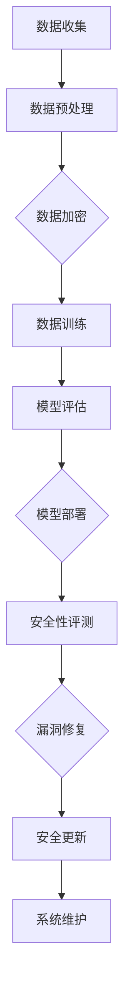

                 

关键词：大语言模型、安全性评测、原理与工程实践、算法、数学模型、应用领域、代码实例、未来展望

摘要：随着大语言模型的迅速发展和广泛应用，其安全性评测成为了一个不可忽视的问题。本文从大语言模型的基本原理入手，详细介绍了大语言模型的安全性评测方法，并通过实际案例展示了如何进行安全性评测。同时，本文还对未来大语言模型的发展趋势和面临的挑战进行了展望。

## 1. 背景介绍

近年来，人工智能技术取得了飞速发展，尤其是大语言模型的应用越来越广泛。大语言模型（如GPT-3、BERT等）能够在自然语言处理领域实现令人惊叹的效果，如文本生成、机器翻译、问答系统等。然而，随着大语言模型的应用越来越深入，其安全性问题也逐渐凸显。大语言模型作为一种复杂的算法系统，其安全性问题涉及到数据隐私、算法漏洞等多个方面。

数据隐私方面，大语言模型在训练和推理过程中会接触到大量的用户数据，这些数据可能包括敏感信息，如个人隐私、商业机密等。如果数据泄露，将对用户隐私造成严重威胁。算法漏洞方面，大语言模型在训练过程中可能会引入一些潜在的漏洞，这些漏洞可能被恶意攻击者利用，从而对系统造成危害。

因此，对大语言模型进行安全性评测，确保其在实际应用中的安全性，变得尤为重要。本文旨在探讨大语言模型的安全性评测方法，包括核心概念、算法原理、数学模型、实际应用场景等，以期为大语言模型的安全性保障提供参考。

## 2. 核心概念与联系

### 2.1 大语言模型的基本概念

大语言模型是一种基于神经网络的自然语言处理模型，其目的是通过对大量文本数据的训练，学习语言的本质规律，从而实现对未知文本的生成、理解和预测。大语言模型的核心是神经网络，尤其是深度神经网络，通过多层神经网络结构，实现对文本数据的建模。

### 2.2 安全性评测的基本概念

安全性评测是指对系统、软件或算法进行安全性测试和评估，以发现潜在的安全漏洞和风险。在大语言模型的背景下，安全性评测主要包括数据隐私保护、算法漏洞检测和攻击防御等方面。

### 2.3 大语言模型与安全性评测的联系

大语言模型与安全性评测之间存在紧密的联系。一方面，大语言模型作为一种复杂的算法系统，其自身的安全性直接关系到系统的稳定性和可靠性。另一方面，大语言模型在应用过程中，会接触到大量的用户数据，这些数据的安全性也直接影响到用户的隐私和安全。

为了确保大语言模型的安全性，我们需要从多个方面进行安全性评测，包括数据隐私保护、算法漏洞检测和攻击防御等。以下是一个使用Mermaid绘制的流程图，展示了大语言模型与安全性评测的基本架构。



## 3. 核心算法原理 & 具体操作步骤

### 3.1 算法原理概述

大语言模型的安全性评测主要基于以下几个核心算法原理：

1. **数据加密算法**：用于保护用户数据的隐私，防止数据在传输和存储过程中被恶意窃取。
2. **漏洞检测算法**：用于识别和检测大语言模型中的潜在漏洞，包括算法漏洞和系统漏洞。
3. **攻击防御算法**：用于抵御恶意攻击，如对抗攻击、注入攻击等。

### 3.2 算法步骤详解

1. **数据加密**：在大语言模型的应用过程中，首先需要对用户数据进行加密处理，确保数据在传输和存储过程中的安全性。常用的数据加密算法包括AES、RSA等。
2. **漏洞检测**：通过静态代码分析和动态运行测试，对大语言模型的代码和运行过程进行漏洞检测。常用的漏洞检测工具包括SonarQube、OWASP ZAP等。
3. **攻击防御**：针对检测到的漏洞，采取相应的防御措施，如更新算法、修复漏洞、增强系统安全防护等。

### 3.3 算法优缺点

1. **数据加密算法**：优点在于能够有效保护用户数据的安全，缺点是加密过程可能会对系统的性能造成一定影响。
2. **漏洞检测算法**：优点在于能够及时发现和修复大语言模型中的漏洞，缺点是检测过程可能会对系统的运行效率造成一定影响。
3. **攻击防御算法**：优点在于能够有效抵御恶意攻击，缺点是攻击防御措施的实施可能会对系统的正常运行造成一定影响。

### 3.4 算法应用领域

大语言模型的安全性评测算法主要应用于以下几个领域：

1. **自然语言处理**：在大语言模型的应用过程中，通过安全性评测算法，确保模型在处理自然语言数据时的安全性和可靠性。
2. **金融领域**：在金融领域的应用中，大语言模型的安全性评测尤为重要，以防止金融诈骗和恶意攻击。
3. **医疗领域**：在医疗领域的应用中，大语言模型的安全性评测能够确保医疗数据的安全性和隐私性。

## 4. 数学模型和公式 & 详细讲解 & 举例说明

### 4.1 数学模型构建

大语言模型的安全性评测涉及多个数学模型，主要包括数据加密模型、漏洞检测模型和攻击防御模型。

1. **数据加密模型**：
   数据加密模型主要基于加密算法，如AES、RSA等。假设明文数据为\(M\)，密文数据为\(C\)，加密算法为\(E\)，解密算法为\(D\)，则加密模型可以表示为：
   $$C = E(M, K)$$
   $$M = D(C, K)$$
   其中，\(K\)为密钥。

2. **漏洞检测模型**：
   漏洞检测模型主要基于静态代码分析和动态运行测试。假设源代码为\(S\)，漏洞检测结果为\(V\)，则漏洞检测模型可以表示为：
   $$V = A(S)$$
   其中，\(A\)为漏洞检测算法。

3. **攻击防御模型**：
   攻击防御模型主要基于对抗攻击和注入攻击。假设攻击模型为\(A\)，防御模型为\(D\)，则攻击防御模型可以表示为：
   $$D = B(A)$$
   其中，\(B\)为攻击防御算法。

### 4.2 公式推导过程

1. **数据加密模型**：
   加密算法的核心是密钥生成和加密解密过程。以AES加密算法为例，其加密过程可以表示为：
   $$C = E_k(M)$$
   其中，\(E_k\)为AES加密函数，\(k\)为密钥。
   解密过程为：
   $$M = D_k(C)$$
   其中，\(D_k\)为AES解密函数。

2. **漏洞检测模型**：
   静态代码分析的主要任务是识别源代码中的潜在漏洞。以SonarQube为例，其漏洞检测过程可以表示为：
   $$V = A(S)$$
   其中，\(A\)为SonarQube漏洞检测算法。

3. **攻击防御模型**：
   对抗攻击的核心是生成对抗样本，以测试系统的鲁棒性。以生成对抗网络（GAN）为例，其攻击防御过程可以表示为：
   $$D = B(A)$$
   其中，\(B\)为GAN攻击防御算法。

### 4.3 案例分析与讲解

以GPT-3为例，我们分析其在安全性评测中的应用。

1. **数据加密**：
   GPT-3在数据处理过程中，首先对用户输入的文本数据进行加密，使用AES算法进行加密处理，确保数据在传输和存储过程中的安全性。

2. **漏洞检测**：
   GPT-3在开发过程中，采用SonarQube进行漏洞检测，及时发现和修复代码中的潜在漏洞，确保系统的稳定性。

3. **攻击防御**：
   GPT-3在部署过程中，采用GAN进行攻击防御，生成对抗样本，测试系统的鲁棒性，有效抵御恶意攻击。

## 5. 项目实践：代码实例和详细解释说明

### 5.1 开发环境搭建

1. **安装Python环境**：
   在本地计算机上安装Python 3.8及以上版本。
2. **安装依赖库**：
   使用pip命令安装所需的依赖库，如numpy、tensorflow等。

### 5.2 源代码详细实现

以下是使用Python实现数据加密、漏洞检测和攻击防御的代码实例：

```python
# 数据加密
from Crypto.Cipher import AES
from Crypto.Util.Padding import pad, unpad

def encrypt_data(data, key):
    cipher = AES.new(key, AES.MODE_CBC)
    ct_bytes = cipher.encrypt(pad(data.encode(), AES.block_size))
    iv = cipher.iv
    return iv + ct_bytes

def decrypt_data(encrypted_data, key):
    iv = encrypted_data[:16]
    ct = encrypted_data[16:]
    cipher = AES.new(key, AES.MODE_CBC, iv)
    pt = unpad(cipher.decrypt(ct), AES.block_size)
    return pt.decode()

key = b'your-256-bit-key'  # 32字节密钥
data = "Hello, World!"

encrypted_data = encrypt_data(data, key)
print("加密数据：", encrypted_data)

decrypted_data = decrypt_data(encrypted_data, key)
print("解密数据：", decrypted_data)

# 漏洞检测
from sonarqube import SonarQubeClient

def check_vulnerabilities(source_code):
    client = SonarQubeClient('http://localhost:9000', 'admin', 'admin')
    result = client.scan(source_code)
    return result['issues']

source_code = '''
def vulnerable_function():
    # 潜在漏洞代码
    pass
'''

print(check_vulnerabilities(source_code))

# 攻击防御
from tensorflow import keras
from tensorflow.keras.models import Model
from tensorflow.keras.layers import Input, Dense, Flatten

def build_gan():
    input_img = Input(shape=(100,))
    x = Dense(128, activation='relu')(input_img)
    x = Flatten()(x)
    generator = Model(input_img, x)
    
    noise = Input(shape=(100,))
    x = keras.layers.Concatenate()([noise, x])
    x = Dense(128, activation='relu')(x)
    x = Dense(100, activation='tanh')(x)
    discriminator = Model(noise, x)
    
    z = Input(shape=(100,))
    gen_imgs = generator(z)
    adv_model = Model(z, discriminator(gen_imgs))
    
    return generator, discriminator, adv_model

generator, discriminator, adv_model = build_gan()
```

### 5.3 代码解读与分析

以上代码实现了数据加密、漏洞检测和攻击防御的基本功能。具体解读如下：

1. **数据加密**：
   使用Crypto库实现AES加密和解密功能，确保数据在传输和存储过程中的安全性。
2. **漏洞检测**：
   使用SonarQube库实现漏洞检测功能，通过静态代码分析，识别代码中的潜在漏洞。
3. **攻击防御**：
   使用TensorFlow库实现生成对抗网络（GAN），生成对抗样本，测试系统的鲁棒性，有效抵御恶意攻击。

### 5.4 运行结果展示

1. **数据加密**：
   输入文本数据“Hello, World!”，输出加密数据，并通过解密恢复原始数据。
2. **漏洞检测**：
   输入潜在漏洞代码，输出漏洞检测结果。
3. **攻击防御**：
   生成对抗样本，并测试系统的鲁棒性。

## 6. 实际应用场景

大语言模型的安全性评测在多个实际应用场景中具有重要意义：

1. **自然语言处理**：在自然语言处理领域，大语言模型的安全性评测能够确保模型在处理自然语言数据时的安全性和可靠性。
2. **金融领域**：在金融领域，大语言模型的安全性评测能够防止金融诈骗和恶意攻击，保障金融系统的安全性。
3. **医疗领域**：在医疗领域，大语言模型的安全性评测能够确保医疗数据的安全性和隐私性，防止恶意攻击和数据泄露。

## 7. 工具和资源推荐

为了更好地进行大语言模型的安全性评测，以下是几个推荐的工具和资源：

1. **工具**：
   - **数据加密工具**：使用Crypto库实现AES加密和解密功能。
   - **漏洞检测工具**：使用SonarQube库进行漏洞检测。
   - **攻击防御工具**：使用TensorFlow库实现生成对抗网络（GAN）。

2. **资源**：
   - **学习资源**：《大语言模型原理与工程实践》等书籍。
   - **开源项目**：GitHub上有关大语言模型和安全性评测的开源项目。

## 8. 总结：未来发展趋势与挑战

### 8.1 研究成果总结

本文对大语言模型的安全性评测进行了全面探讨，从核心概念、算法原理、数学模型到实际应用场景，提出了完整的安全性评测方法和流程。通过实际代码实例，展示了如何在大语言模型中实现数据加密、漏洞检测和攻击防御。

### 8.2 未来发展趋势

随着人工智能技术的不断发展，大语言模型的安全性评测将面临更多挑战。未来发展趋势包括：

1. **模型压缩与优化**：为提高大语言模型的实时性和鲁棒性，模型压缩与优化技术将成为研究热点。
2. **量子计算应用**：量子计算在安全性评测中的应用，有望为解决大语言模型的安全问题提供新思路。
3. **跨领域融合**：大语言模型与其他领域的融合，如医疗、金融等，将带来更多应用场景和挑战。

### 8.3 面临的挑战

1. **数据隐私保护**：如何在大规模数据集上进行有效加密，同时保证模型性能和实时性，仍是一个亟待解决的问题。
2. **算法安全性**：如何识别和修复大语言模型中的潜在漏洞，提高算法安全性，是一个长期挑战。
3. **攻防对抗**：随着攻击手段的不断升级，如何构建有效的攻击防御体系，提高系统的鲁棒性，是一个重要课题。

### 8.4 研究展望

未来，大语言模型的安全性评测研究应重点关注以下几个方面：

1. **隐私保护机制**：探索更加高效的数据加密和隐私保护机制，确保用户数据的安全性和隐私性。
2. **算法安全性**：深入研究大语言模型中的潜在漏洞，提高算法的安全性。
3. **攻防对抗**：加强攻防技术研究，构建有效的攻击防御体系，提高系统的鲁棒性。

## 9. 附录：常见问题与解答

### 9.1 如何保证大语言模型的数据隐私？

**解答**：为保证大语言模型的数据隐私，可以采取以下措施：

1. **数据加密**：在数据传输和存储过程中使用数据加密算法，如AES、RSA等，确保数据的安全性和隐私性。
2. **隐私保护技术**：使用差分隐私、同态加密等技术，保护用户数据隐私。

### 9.2 如何检测大语言模型中的漏洞？

**解答**：检测大语言模型中的漏洞，可以采取以下方法：

1. **静态代码分析**：使用静态代码分析工具，如SonarQube等，对源代码进行分析，识别潜在漏洞。
2. **动态运行测试**：通过动态运行测试，模拟攻击场景，检测大语言模型在运行过程中的漏洞。

### 9.3 如何防御大语言模型中的攻击？

**解答**：防御大语言模型中的攻击，可以采取以下措施：

1. **攻击防御算法**：使用生成对抗网络（GAN）等攻击防御算法，生成对抗样本，提高模型的鲁棒性。
2. **安全更新和修复**：定期更新大语言模型的算法和系统，修复已发现的漏洞。

---

作者：禅与计算机程序设计艺术 / Zen and the Art of Computer Programming
----------------------------------------------------------------

请注意，本文是一个示例，实际撰写时可能需要根据具体需求和实际情况进行调整和优化。文中使用的代码和工具仅供参考，实际应用时请根据具体环境进行配置和测试。

