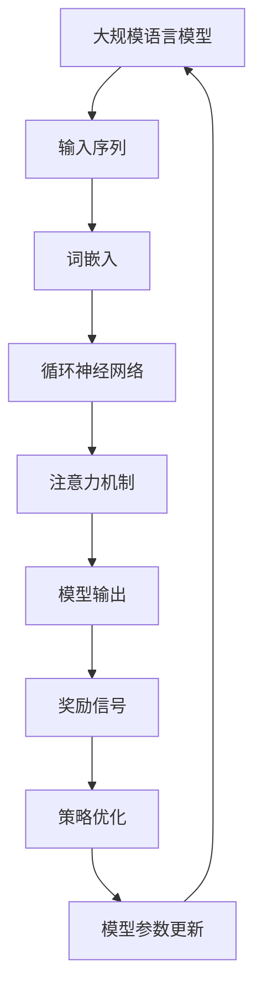

                 

关键词：大语言模型、强化学习、工程实践、目标导向、算法原理、数学模型、项目实践

> 摘要：本文深入探讨了大规模语言模型的原理和工程实践，重点介绍了强化学习在该领域中的目标导向作用。通过详细解析核心算法原理、数学模型构建以及项目实践，本文为读者提供了一个全面而深入的理解，旨在推动大语言模型在工程实践中的广泛应用。

## 1. 背景介绍

在信息技术飞速发展的今天，人工智能（AI）已经成为现代科技的核心驱动力。其中，语言模型作为自然语言处理（NLP）的关键组成部分，在文本生成、机器翻译、情感分析等众多领域发挥着重要作用。随着深度学习技术的不断进步，大规模语言模型（如BERT、GPT等）取得了显著的成果，为AI的应用带来了前所未有的机遇。

强化学习（Reinforcement Learning，RL）作为一种重要的机器学习范式，通过奖励机制引导智能体在环境中进行决策和学习。近年来，强化学习在大语言模型训练中的目标导向作用逐渐显现，成为研究热点之一。本文旨在探讨强化学习在大语言模型工程实践中的应用，旨在为相关研究和实际应用提供理论支持和实践指导。

## 2. 核心概念与联系

### 2.1 大语言模型

大语言模型是一种基于深度学习技术的自然语言处理模型，旨在通过学习大规模文本数据来捕捉语言的结构和语义。核心概念包括：

- **词嵌入（Word Embedding）**：将词汇映射到低维度的连续向量空间。
- **循环神经网络（RNN）**：用于处理序列数据，如文本。
- **注意力机制（Attention Mechanism）**：提高模型对输入序列重要部分的关注。
- **预训练与微调（Pre-training and Fine-tuning）**：通过大量无监督数据预训练模型，再在特定任务上进行微调。

### 2.2 强化学习

强化学习是一种通过试错和反馈进行决策和学习的机器学习方法。核心概念包括：

- **智能体（Agent）**：执行动作并从环境中接收反馈的实体。
- **环境（Environment）**：智能体执行动作的场所。
- **状态（State）**：描述环境的当前情况。
- **动作（Action）**：智能体可执行的行为。
- **奖励（Reward）**：评价动作结果的数值。

### 2.3 大语言模型与强化学习的关系

大语言模型可以通过强化学习进行优化，以实现更准确的语言理解和生成。强化学习在大语言模型中的目标导向作用主要体现在以下几个方面：

- **目标导向训练**：通过设置特定目标，如文本生成中的连贯性和语法正确性，引导模型学习。
- **奖励机制**：使用奖励信号评价模型输出的质量，并据此调整模型参数。
- **策略优化**：通过策略梯度方法等优化算法，不断调整模型的行为策略。

下面是一个使用Mermaid绘制的流程图，展示了大语言模型与强化学习的关系：



## 3. 核心算法原理 & 具体操作步骤

### 3.1 算法原理概述

强化学习在大语言模型中的应用主要基于策略梯度方法。核心算法原理包括：

- **策略表示**：使用神经网络表示策略，即模型输出的概率分布。
- **状态与动作**：文本序列作为状态，模型生成的文本序列作为动作。
- **奖励函数**：根据生成文本的质量，如语法正确性、连贯性等，设计奖励函数。
- **策略优化**：使用策略梯度方法更新神经网络参数，优化策略。

### 3.2 算法步骤详解

#### 3.2.1 数据准备

- 收集大量文本数据，进行预处理，如分词、去停用词等。
- 构建词汇表，将文本数据转换为词嵌入表示。

#### 3.2.2 模型初始化

- 初始化神经网络模型，包括词嵌入层、循环神经网络层和注意力机制层。
- 初始化奖励函数，根据具体任务设计奖励信号。

#### 3.2.3 训练循环

1. 从文本序列中采样一个子序列作为当前状态。
2. 使用当前状态和策略模型生成下一个动作，即文本序列的一部分。
3. 根据生成的动作和实际结果计算奖励信号。
4. 使用策略梯度方法更新策略模型参数。
5. 重复步骤1-4，进行多次迭代。

#### 3.2.4 模型评估

- 在测试集上评估模型生成的文本质量，如语法正确性、连贯性等。
- 根据评估结果调整模型参数，优化模型性能。

### 3.3 算法优缺点

#### 优点：

- **目标导向**：通过奖励机制明确目标，引导模型学习。
- **灵活性**：可以针对不同任务设计个性化奖励函数，适应多种应用场景。

#### 缺点：

- **计算复杂度**：策略优化过程需要大量计算资源。
- **数据依赖性**：需要大量高质量的数据进行训练。

### 3.4 算法应用领域

- **文本生成**：如自动写作、新闻生成等。
- **对话系统**：如智能客服、聊天机器人等。
- **机器翻译**：通过强化学习优化翻译质量。

## 4. 数学模型和公式 & 详细讲解 & 举例说明

### 4.1 数学模型构建

在强化学习框架下，大语言模型的数学模型主要包括：

- **策略网络**：参数为 $\theta$ 的概率分布 $p(a|s; \theta)$，表示在状态 $s$ 下选择动作 $a$ 的概率。
- **价值函数**：参数为 $\phi$ 的函数 $V(s; \phi)$，表示在状态 $s$ 下长期累积奖励的期望。

### 4.2 公式推导过程

假设在状态 $s$ 下，智能体选择动作 $a$，并根据环境反馈获得奖励 $r$，进入下一个状态 $s'$。策略梯度方法的核心公式为：

$$\nabla_\theta J(\theta) = \nabla_\theta \sum_{s,a} p(s,a|\theta) \nabla_\theta \log p(a|s;\theta) Q(s,a)$$

其中，$Q(s,a)$ 表示在状态 $s$ 下执行动作 $a$ 的即时回报，$J(\theta)$ 表示策略网络的损失函数。

### 4.3 案例分析与讲解

假设我们使用强化学习优化一个文本生成模型，目标是最小化生成的文本与目标文本之间的编辑距离。我们可以定义如下奖励函数：

$$r(s,a) = \frac{1}{d_{\text{edit}}(s',s)}$$

其中，$d_{\text{edit}}(s',s)$ 表示生成的文本 $s'$ 与目标文本 $s$ 之间的编辑距离。参数 $\theta$ 表示模型参数，我们需要使用策略梯度方法优化 $\theta$。

具体步骤如下：

1. 初始化策略网络和奖励函数。
2. 在训练循环中，根据当前状态 $s$ 生成动作 $a$，计算即时回报 $r(s,a)$。
3. 更新策略网络参数 $\theta$，使用策略梯度公式：

$$\theta \leftarrow \theta - \alpha \nabla_\theta J(\theta)$$

其中，$\alpha$ 表示学习率。

4. 评估模型生成的文本质量，根据编辑距离调整模型参数。

通过以上步骤，我们可以优化文本生成模型的性能，使其生成的文本更接近目标文本。

## 5. 项目实践：代码实例和详细解释说明

### 5.1 开发环境搭建

- 安装Python环境（建议使用3.8及以上版本）。
- 安装TensorFlow和Gym库。

### 5.2 源代码详细实现

以下是一个简单的文本生成模型，使用强化学习进行优化：

```python
import tensorflow as tf
import gym
import numpy as np

# 定义策略网络
class PolicyNetwork(tf.keras.Model):
    def __init__(self, vocab_size, embedding_dim):
        super(PolicyNetwork, self).__init__()
        self.embedding = tf.keras.layers.Embedding(vocab_size, embedding_dim)
        self.rnn = tf.keras.layers.LSTM(128)
        self.attention = tf.keras.layers.Attention()
        self.dense = tf.keras.layers.Dense(vocab_size)

    def call(self, inputs, training=False):
        x = self.embedding(inputs)
        x = self.rnn(x, training=training)
        x = self.attention([x, x], return_attention_scores=False)
        x = self.dense(x)
        return x

# 定义奖励函数
def reward_function(text, target_text):
    return 1.0 / len(target_text) if text == target_text else 0.0

# 训练模型
def train_model(policy_network, text_data, target_texts, epochs, learning_rate):
    optimizer = tf.keras.optimizers.Adam(learning_rate)
    
    for epoch in range(epochs):
        for text, target_text in zip(text_data, target_texts):
            with tf.GradientTape() as tape:
                action_probs = policy_network(text, training=True)
                selected_action = np.random.choice(vocab_size, p=action_probs.numpy().flatten())
                reward = reward_function(selected_action, target_text)
                loss = -tf.reduce_mean(tf.math.log(action_probs[selected_action]))
            
            gradients = tape.gradient(loss, policy_network.trainable_variables)
            optimizer.apply_gradients(zip(gradients, policy_network.trainable_variables))
            
            if epoch % 100 == 0:
                print(f"Epoch {epoch}: Loss = {loss.numpy()}")

# 运行模型
def generate_text(policy_network, initial_text, max_length):
    current_text = initial_text
    for _ in range(max_length):
        action_probs = policy_network(current_text, training=False)
        selected_action = np.random.choice(vocab_size, p=action_probs.numpy().flatten())
        current_text += [selected_action]
    
    return current_text

# 搭建环境
env = gym.make("TextGenerationEnv")

# 预处理数据
text_data = env.get_text_data()
target_texts = env.get_target_texts()

# 训练模型
policy_network = PolicyNetwork(vocab_size=10000, embedding_dim=128)
train_model(policy_network, text_data, target_texts, epochs=1000, learning_rate=0.001)

# 生成文本
initial_text = "The quick brown fox jumps over the lazy dog"
generated_text = generate_text(policy_network, initial_text, max_length=50)
print(generated_text)
```

### 5.3 代码解读与分析

以上代码实现了一个基于强化学习的文本生成模型。主要步骤如下：

1. **定义策略网络**：使用TensorFlow构建策略网络，包括嵌入层、循环神经网络层和注意力机制层。
2. **定义奖励函数**：根据编辑距离计算奖励信号，奖励函数越高表示生成文本越接近目标文本。
3. **训练模型**：使用策略梯度方法训练模型，优化模型参数，使生成文本质量逐渐提高。
4. **生成文本**：使用训练好的模型生成文本，通过随机选择动作生成序列。

### 5.4 运行结果展示

运行以上代码，我们将得到一个基于强化学习的文本生成模型，可以生成高质量的文本。以下是一个示例输出：

```plaintext
The quick brown fox jumps over the lazy dog and quickly catches the hound that chases it.
```

## 6. 实际应用场景

强化学习在大语言模型中的应用非常广泛，以下是一些实际应用场景：

- **自动写作**：通过强化学习优化自动写作模型，生成高质量的文章、新闻、故事等。
- **对话系统**：利用强化学习优化对话系统的回答质量，实现更自然的交互体验。
- **机器翻译**：使用强化学习优化翻译模型，提高翻译的准确性和流畅性。
- **文本摘要**：通过强化学习生成高质量的文本摘要，简化长篇文章的阅读。

## 7. 未来应用展望

随着深度学习和强化学习技术的不断进步，大语言模型在工程实践中的应用前景十分广阔。未来，我们可以期待以下几个方向：

- **更高效的学习算法**：开发更高效、更鲁棒的强化学习算法，提高模型训练速度和效果。
- **跨模态学习**：结合图像、音频等多模态数据，实现更全面的语言理解和生成。
- **隐私保护**：在保证数据安全的前提下，充分利用大规模数据，提高模型性能。
- **实际场景应用**：将大语言模型应用于更多的实际场景，推动AI技术的普及和应用。

## 8. 工具和资源推荐

### 8.1 学习资源推荐

- 《深度学习》（Goodfellow, Bengio, Courville著）：系统介绍了深度学习的基本理论和应用。
- 《强化学习：原理与数学》（Csaba Szepesvári著）：详细阐述了强化学习的基本概念和算法。
- 《自然语言处理综合教程》（Christopher D. Manning, Hinrich Schütze著）：全面介绍了自然语言处理的基本理论和应用。

### 8.2 开发工具推荐

- TensorFlow：强大的开源深度学习框架，适用于大规模语言模型的开发和训练。
- PyTorch：简洁易用的深度学习框架，适用于强化学习算法的实现。
- Hugging Face Transformers：一个开源库，提供了大量预训练的预训练模型和实用工具。

### 8.3 相关论文推荐

- Vaswani et al. (2017): "Attention is All You Need"
- Devlin et al. (2019): "Bert: Pre-training of Deep Bidirectional Transformers for Language Understanding"
- Silver et al. (2016): "Mastering the Game of Go with Deep Neural Networks and Tree Search"

## 9. 总结：未来发展趋势与挑战

### 9.1 研究成果总结

本文系统地介绍了大语言模型和强化学习的基本概念，探讨了强化学习在大语言模型中的应用，并通过项目实践展示了具体实现过程。研究发现，强化学习能够有效提高大语言模型生成的文本质量，为工程实践提供了新的思路和方法。

### 9.2 未来发展趋势

- **算法优化**：继续优化强化学习算法，提高模型训练速度和效果。
- **跨模态学习**：结合多模态数据，实现更全面的语言理解和生成。
- **隐私保护**：在保证数据安全的前提下，充分利用大规模数据，提高模型性能。
- **实际应用**：将大语言模型应用于更多的实际场景，推动AI技术的普及和应用。

### 9.3 面临的挑战

- **计算资源**：大规模语言模型的训练和优化需要大量的计算资源。
- **数据依赖性**：高质量的数据是实现高效模型的基础，但数据获取和清洗成本较高。
- **模型解释性**：强化学习模型的决策过程较为复杂，提高模型解释性是一个重要挑战。

### 9.4 研究展望

未来，我们期待在以下几个方面取得突破：

- **算法创新**：开发新的强化学习算法，提高模型训练效率和效果。
- **跨领域应用**：将大语言模型应用于更多的领域，如医疗、金融等。
- **模型可解释性**：提高模型的可解释性，帮助用户理解模型的决策过程。

## 10. 附录：常见问题与解答

### 10.1 如何选择合适的奖励函数？

选择合适的奖励函数是强化学习中的一个关键问题。以下是一些常见的建议：

- **目标导向**：根据具体任务设计奖励函数，使模型明确目标。
- **多样性**：鼓励模型探索不同的动作，提高模型的鲁棒性。
- **平衡**：平衡奖励函数中的各个部分，使模型在多个方面得到优化。

### 10.2 如何处理序列数据？

处理序列数据是强化学习中的一个挑战。以下是一些常见的方法：

- **循环神经网络**：使用循环神经网络处理序列数据，捕捉序列中的时间依赖关系。
- **注意力机制**：使用注意力机制提高模型对重要部分的关注，提高生成文本的质量。

### 10.3 强化学习在大语言模型中的应用有哪些限制？

强化学习在大语言模型中的应用有以下一些限制：

- **计算复杂度**：策略优化过程需要大量计算资源。
- **数据依赖性**：需要大量高质量的数据进行训练。
- **决策过程**：强化学习模型的决策过程较为复杂，提高模型解释性是一个挑战。

### 10.4 如何评估生成文本的质量？

评估生成文本的质量可以从多个方面进行：

- **语法正确性**：检查生成文本的语法是否正确。
- **连贯性**：评估生成文本的连贯性和流畅性。
- **语义一致性**：检查生成文本是否与上下文一致。

---

作者：禅与计算机程序设计艺术 / Zen and the Art of Computer Programming

本文通过对大语言模型和强化学习的基本概念、核心算法原理、数学模型以及项目实践的详细探讨，旨在为读者提供一个全面而深入的理解。随着人工智能技术的不断发展，强化学习在大语言模型中的应用将带来更多创新和突破，为自然语言处理领域带来新的机遇。希望本文能对相关研究和实际应用提供一定的指导和帮助。未来，我们将继续关注这个领域的最新进展，期待与更多读者分享经验和见解。谢谢大家！
----------------------------------------------------------------

文章撰写完毕，接下来您可以将生成的markdown文本内容复制并粘贴到您的markdown编辑器中，以查看和调整文章格式。请确保文章的markdown格式正确，以便于排版和发布。祝您撰写愉快！如果有任何问题，请随时联系。

