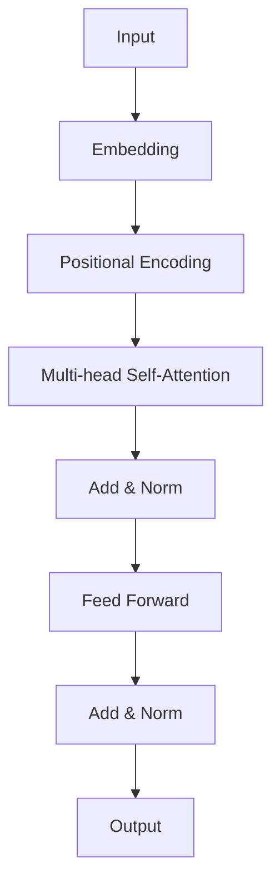
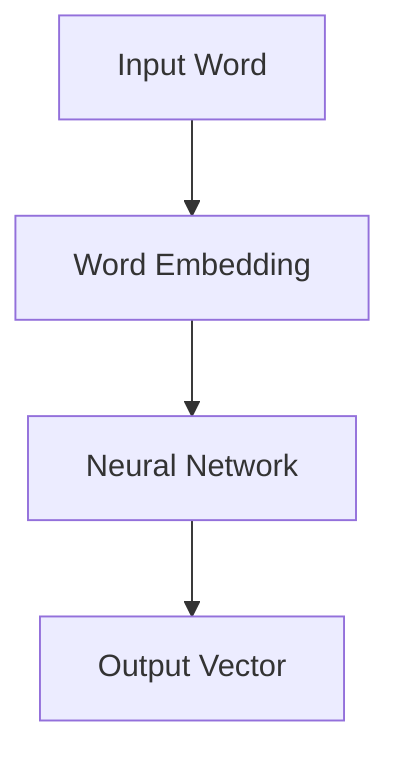
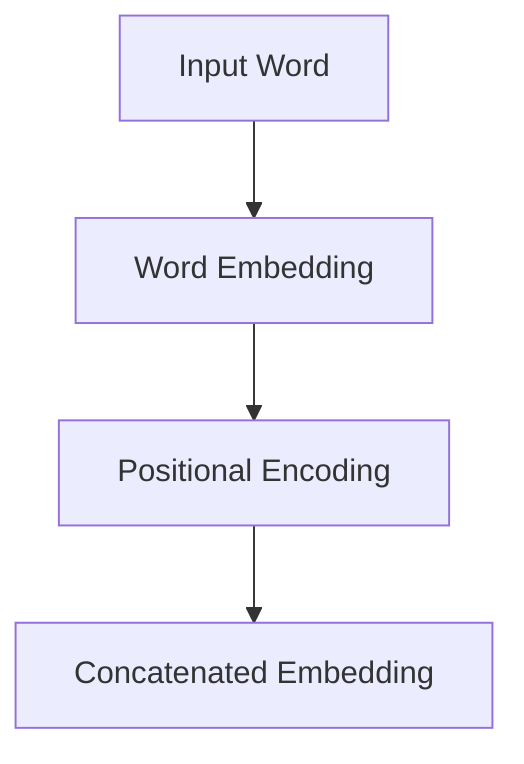

                 

## 1. 背景介绍

随着深度学习技术的不断发展和成熟，人工智能领域迎来了前所未有的变革。其中，大语言模型作为一种重要的自然语言处理（NLP）技术，正日益成为学术界和工业界关注的焦点。大语言模型通过捕捉大量的语言数据，可以生成高质量的文本，广泛应用于机器翻译、文本生成、问答系统等领域。特别是近年来，基于 Transformer 架构的语言模型，如 GPT-3、BERT 等，已经取得了显著的突破，模型参数量达到千亿甚至万亿级别，大大提升了语言理解和生成的能力。

然而，训练如此大规模的语言模型不仅需要大量的计算资源和数据集，还需要深入理解模型的原理和优化技巧。为了帮助读者深入了解大语言模型的训练和工程实践，本文将详细探讨大语言模型的原理、数学模型、算法步骤以及实际应用案例，旨在为读者提供一份全面、系统、易懂的技术指南。

本文主要分为以下几个部分：

1. **背景介绍**：介绍大语言模型的发展背景、重要意义以及本文的结构和主要内容。
2. **核心概念与联系**：阐述大语言模型的核心概念，包括 Transformer 架构、自注意力机制、词嵌入等，并使用 Mermaid 流程图展示其架构和原理。
3. **核心算法原理 & 具体操作步骤**：详细讲解大语言模型的算法原理，包括算法概述、具体步骤、优缺点以及应用领域。
4. **数学模型和公式 & 详细讲解 & 举例说明**：介绍大语言模型中的数学模型和公式，并给出详细的推导过程和实例分析。
5. **项目实践：代码实例和详细解释说明**：通过一个具体的代码实例，展示如何实现大语言模型的训练和指令微调。
6. **实际应用场景**：探讨大语言模型在各类实际应用场景中的使用方法和技术挑战。
7. **未来应用展望**：预测大语言模型未来的发展方向和应用前景。
8. **工具和资源推荐**：推荐相关学习资源、开发工具和相关论文。
9. **总结：未来发展趋势与挑战**：总结研究成果，展望未来发展趋势和面临的挑战。
10. **附录：常见问题与解答**：回答读者可能遇到的常见问题。

希望通过本文的阅读，读者能够对大语言模型有一个全面、深入的理解，并能够在实际项目中灵活应用。

## 2. 核心概念与联系

### 2.1 Transformer 架构

Transformer 架构是当前最流行的大规模语言模型的基础，其设计理念是替代传统的循环神经网络（RNN）和卷积神经网络（CNN），解决其在长文本处理上的瓶颈。Transformer 使用自注意力机制（Self-Attention）来捕捉文本中的长距离依赖关系，而不是传统的序列处理方式。

Transformer 的核心是多头自注意力机制（Multi-Head Self-Attention）。自注意力机制通过计算每个词在序列中的重要性，从而实现全局信息的有效捕捉。多头自注意力则将输入序列分成多个子序列，分别计算自注意力，最后将结果合并，从而提高模型的泛化能力。

以下是一个简化的 Transformer 架构的 Mermaid 流程图：



### 2.2 自注意力机制

自注意力机制是 Transformer 的核心，通过计算序列中每个词对其他词的影响权重，实现长距离依赖的捕捉。其基本思想是将输入序列映射到高维空间，然后计算每个词与序列中其他词的相似度，将这些相似度权重乘以输入序列的嵌入向量，最终得到加权后的输出向量。

自注意力机制的计算公式如下：

$$
\text{Attention}(Q, K, V) = \text{softmax}\left(\frac{QK^T}{\sqrt{d_k}}\right) V
$$

其中，$Q, K, V$ 分别是查询（Query）、键（Key）和值（Value）向量，$d_k$ 是键向量的维度。$\text{softmax}$ 函数用于将点积结果归一化，使其成为一个概率分布，从而表示每个词的重要程度。

### 2.3 词嵌入

词嵌入（Word Embedding）是将自然语言中的词汇映射到高维向量空间的技术。通过词嵌入，文本中的词汇可以被表示为连续的向量，这些向量在语义上具有相近的词汇具有相近的向量表示。

词嵌入可以通过多种方式实现，如词袋模型（Bag of Words）、连续词袋（Continuous Bag of Words, CBOW）和词向量（Word2Vec）等。CBOW 通过预测中心词周围的上下文词，而 Word2Vec 则通过训练一个神经网络，将输入的词汇映射到高维向量空间。

以下是一个简化的词嵌入的 Mermaid 流程图：



### 2.4 位置编码

位置编码（Positional Encoding）是在 Transformer 模型中引入的一种技巧，用于编码输入序列中的位置信息。由于 Transformer 模型是一个自注意力模型，它无法直接理解词的顺序信息，因此需要通过位置编码来提供位置信息。

位置编码可以通过多种方式实现，如绝对位置编码和相对位置编码。绝对位置编码直接将位置信息编码到词嵌入中，而相对位置编码则通过计算相邻词之间的相对位置来实现。

以下是一个简化的位置编码的 Mermaid 流程图：



通过上述核心概念和联系的分析，我们可以看到，大语言模型的设计思想和实现方法是非常复杂和精细的。接下来，我们将深入探讨大语言模型的核心算法原理，帮助读者更好地理解这一前沿技术。

## 3. 核心算法原理 & 具体操作步骤

### 3.1 算法原理概述

大语言模型的训练核心是基于 Transformer 架构的自注意力机制。Transformer 模型通过自注意力机制捕捉文本中的长距离依赖关系，从而实现高质量的文本生成和语言理解。以下是 Transformer 模型的基本原理：

1. **词嵌入**：输入的文本首先被转换为词嵌入向量，这些向量表示了每个词在语义空间中的位置。
2. **位置编码**：词嵌入向量中加入了位置编码，以表示每个词在序列中的位置信息。
3. **多头自注意力机制**：模型通过多头自注意力机制对输入序列进行加权，每个头都计算一次自注意力，然后将结果合并，从而捕捉长距离依赖关系。
4. **前馈神经网络**：在自注意力机制之后，每个词的表示通过一个前馈神经网络进行进一步处理。
5. **层归一化和残差连接**：在每一层自注意力机制和前馈神经网络之间，加入层归一化和残差连接，以保持模型的稳定性和梯度传递。

### 3.2 算法步骤详解

下面我们将详细讲解大语言模型的训练步骤：

1. **数据预处理**：
    - **数据收集**：首先需要收集大量的文本数据，这些数据可以是网站、书籍、新闻等。
    - **数据清洗**：对文本数据进行清洗，去除标点符号、特殊字符等。
    - **分词**：将文本数据分词，将连续的文本拆分为一个个独立的词。
    - **词嵌入**：将分词后的词映射到高维向量空间，生成词嵌入矩阵。

2. **模型初始化**：
    - **词嵌入层**：初始化词嵌入矩阵，该矩阵的大小为词表大小乘以嵌入维度。
    - **位置编码层**：初始化位置编码，通常使用正弦和余弦函数生成。
    - **自注意力层**：初始化自注意力机制的权重和偏置。
    - **前馈神经网络层**：初始化前馈神经网络的权重和偏置。
    - **层归一化和残差连接**：初始化层归一化和残差连接的权重和偏置。

3. **前向传播**：
    - **词嵌入 + 位置编码**：将词嵌入向量与位置编码相加，得到每个词的初始表示。
    - **多头自注意力**：计算多头自注意力的权重矩阵，通过自注意力机制对输入序列进行加权。
    - **前馈神经网络**：对自注意力机制的输出进行前馈神经网络处理。
    - **层归一化和残差连接**：对前馈神经网络的输出进行层归一化和残差连接。

4. **损失函数计算**：
    - **Softmax 层**：对前馈神经网络的输出进行 Softmax 操作，生成每个词的概率分布。
    - **损失函数**：计算预测词的概率分布与实际词的分布之间的交叉熵损失。

5. **反向传播**：
    - **梯度计算**：根据损失函数计算各层的梯度。
    - **权重更新**：使用梯度下降或其他优化算法更新各层的权重。

6. **迭代训练**：
    - **批量训练**：将输入数据分成多个批量，每次训练一个批量。
    - **迭代更新**：重复前向传播、损失函数计算和反向传播，不断更新模型权重。

7. **模型评估**：
    - **验证集评估**：在验证集上评估模型性能，选择性能最优的模型。
    - **测试集评估**：在测试集上评估模型性能，验证模型的泛化能力。

### 3.3 算法优缺点

#### 优点：

1. **捕捉长距离依赖**：自注意力机制可以有效地捕捉文本中的长距离依赖关系，从而提高模型的生成质量和理解能力。
2. **并行化训练**：Transformer 模型具有并行化训练的优势，可以在 GPU 上高效地训练大规模模型。
3. **结构简单**：相比于传统的循环神经网络和卷积神经网络，Transformer 模型的结构更加简单，易于理解和实现。

#### 缺点：

1. **计算复杂度高**：自注意力机制的计算复杂度较高，特别是对于大规模模型，计算资源需求较大。
2. **参数规模大**：由于自注意力机制的引入，Transformer 模型的参数规模通常较大，导致训练和推理时间较长。

### 3.4 算法应用领域

大语言模型在许多领域都有广泛的应用，包括但不限于：

1. **文本生成**：大语言模型可以用于生成高质量的文章、新闻、故事等。
2. **机器翻译**：大语言模型可以用于实现高效的机器翻译系统，如 Google Translate。
3. **问答系统**：大语言模型可以用于构建智能问答系统，如 ChatGPT。
4. **自然语言理解**：大语言模型可以用于理解用户输入的文本，实现智能客服、文本分析等。

通过上述对大语言模型核心算法原理和具体操作步骤的详细讲解，我们可以看到，大语言模型的训练和工程实践是一个复杂但极其有意义的过程。接下来，我们将深入探讨大语言模型中的数学模型和公式，帮助读者更好地理解其内在机制。

## 4. 数学模型和公式 & 详细讲解 & 举例说明

### 4.1 数学模型构建

大语言模型的数学模型是整个模型的核心，它决定了模型的性能和功能。以下是构建大语言模型所需的主要数学模型和公式。

#### 4.1.1 词嵌入

词嵌入是将自然语言中的词汇映射到高维向量空间的过程。词嵌入的数学模型通常使用以下公式表示：

$$
\text{word\_embedding}(x) = \text{W}_{\text{word}} x + \text{b}_{\text{word}}
$$

其中，$x$ 是词索引，$\text{W}_{\text{word}}$ 是词嵌入矩阵，$\text{b}_{\text{word}}$ 是词嵌入偏置。

#### 4.1.2 位置编码

位置编码用于在词嵌入的基础上加入位置信息，以便模型能够理解词在序列中的位置。位置编码通常使用以下公式表示：

$$
\text{position\_encoding}(p) = [\sin(p/10000^{0.5}), \cos(p/10000^{0.5})]
$$

其中，$p$ 是词的位置索引。

#### 4.1.3 自注意力机制

自注意力机制是 Transformer 模型的核心，它通过计算每个词在序列中的重要性来捕捉长距离依赖关系。自注意力机制的数学模型如下：

$$
\text{Attention}(Q, K, V) = \text{softmax}\left(\frac{QK^T}{\sqrt{d_k}}\right) V
$$

其中，$Q, K, V$ 分别是查询（Query）、键（Key）和值（Value）向量，$d_k$ 是键向量的维度。

#### 4.1.4 前馈神经网络

前馈神经网络用于对自注意力机制的输出进行进一步处理。前馈神经网络的数学模型如下：

$$
\text{FFN}(x) = \text{relu}(\text{W}_{\text{ff}} \cdot \text{D} \cdot x + \text{b}_{\text{ff}})
$$

其中，$\text{relu}$ 是 ReLU 激活函数，$\text{W}_{\text{ff}}$ 是权重矩阵，$\text{D}$ 是维度缩放系数，$\text{b}_{\text{ff}}$ 是偏置。

### 4.2 公式推导过程

#### 4.2.1 词嵌入和位置编码

假设我们有一个输入序列 $x = [x_1, x_2, ..., x_n]$，其中 $x_i$ 是第 $i$ 个词的索引。词嵌入和位置编码的过程可以表示为：

$$
\text{input}_{\text{embed}} = \text{word\_embedding}(x) + \text{position\_encoding}(x)
$$

其中，$\text{word\_embedding}(x)$ 是词嵌入矩阵，$\text{position\_encoding}(x)$ 是位置编码。

#### 4.2.2 自注意力机制

自注意力机制的计算过程如下：

1. **计算 Query、Key 和 Value**：

$$
\text{Q} = \text{W}_{\text{Q}} \cdot \text{input}_{\text{embed}} + \text{b}_{\text{Q}}
$$

$$
\text{K} = \text{W}_{\text{K}} \cdot \text{input}_{\text{embed}} + \text{b}_{\text{K}}
$$

$$
\text{V} = \text{W}_{\text{V}} \cdot \text{input}_{\text{embed}} + \text{b}_{\text{V}}
$$

2. **计算注意力权重**：

$$
\text{Attention\_Scores} = \text{softmax}\left(\frac{\text{QK}^T}{\sqrt{d_k}}\right)
$$

3. **计算注意力输出**：

$$
\text{output} = \text{Attention\_Scores} \cdot \text{V}
$$

#### 4.2.3 前馈神经网络

前馈神经网络的计算过程如下：

1. **计算输入**：

$$
\text{input}_{\text{ff}} = \text{W}_{\text{ff}} \cdot \text{output} + \text{b}_{\text{ff}}
$$

2. **应用 ReLU 激活函数**：

$$
\text{output}_{\text{ff}} = \text{relu}(\text{input}_{\text{ff}})
$$

### 4.3 案例分析与讲解

假设我们有一个输入序列 $x = [1, 2, 3, 4, 5]$，其中每个索引表示一个词。我们将使用以下参数：

- 词嵌入维度：$d_{\text{word}} = 512$
- 自注意力维度：$d_k = 64$
- 前馈神经网络维度：$d_{\text{ff}} = 2048$

首先，计算词嵌入和位置编码：

$$
\text{word\_embedding}(1) = \text{W}_{\text{word}} \cdot 1 + \text{b}_{\text{word}}
$$

$$
\text{position\_encoding}(1) = [\sin(1/10000^{0.5}), \cos(1/10000^{0.5})]
$$

然后，计算自注意力权重和输出：

$$
\text{Q} = \text{W}_{\text{Q}} \cdot \text{word\_embedding}(1) + \text{b}_{\text{Q}}
$$

$$
\text{K} = \text{W}_{\text{K}} \cdot \text{word\_embedding}(1) + \text{b}_{\text{K}}
$$

$$
\text{V} = \text{W}_{\text{V}} \cdot \text{word\_embedding}(1) + \text{b}_{\text{V}}
$$

$$
\text{Attention\_Scores} = \text{softmax}\left(\frac{\text{QK}^T}{\sqrt{64}}\right)
$$

$$
\text{output} = \text{Attention\_Scores} \cdot \text{V}
$$

最后，计算前馈神经网络输出：

$$
\text{input}_{\text{ff}} = \text{W}_{\text{ff}} \cdot \text{output} + \text{b}_{\text{ff}}
$$

$$
\text{output}_{\text{ff}} = \text{relu}(\text{input}_{\text{ff}})
$$

通过上述步骤，我们完成了对输入序列的一个简单示例计算。这展示了大语言模型中的核心数学模型和公式的应用过程。

## 5. 项目实践：代码实例和详细解释说明

在了解了大语言模型的理论基础后，接下来我们将通过一个具体的代码实例，展示如何实现一个 7B 大语言模型的训练过程，特别是指令微调（Instruction Tuning）的实践。

### 5.1 开发环境搭建

在开始实践之前，我们需要搭建一个适合训练大语言模型的开发环境。以下是推荐的步骤：

1. **硬件环境**：由于 7B 大语言模型的训练需要大量的计算资源，建议使用至少一张 NVIDIA Tesla V100 或更高级别的 GPU，以及足够的内存（至少 64GB）和存储空间（至少 1TB）。

2. **软件环境**：安装以下软件和库：
   - Python 3.8 或更高版本
   - PyTorch 1.8 或更高版本
   - Transformers 库（Hugging Face）
   - CUDA 10.2 或更高版本（如使用 NVIDIA Tesla V100）

你可以使用以下命令来安装所需的库：

```bash
pip install torch torchvision transformers
```

3. **数据集**：下载一个适合训练大语言模型的文本数据集，如维基百科（Wikicorpus）。数据集需要预处理为适合模型训练的格式，例如文本分词和编码。

### 5.2 源代码详细实现

下面是一个简化的代码实例，展示如何使用 PyTorch 和 Transformers 库实现 7B 大语言模型的训练过程。

#### 5.2.1 导入库和模块

```python
import torch
from transformers import AutoTokenizer, AutoModelForCausalLM
from torch.optim import AdamW
from torch.utils.data import DataLoader
from datasets import load_dataset
```

#### 5.2.2 准备数据集

```python
# 加载预处理的文本数据集
dataset = load_dataset("wikicorpus")

# 定义数据预处理函数
def preprocess_function(examples):
    inputs = tokenizer(examples["text"], max_length=1024, padding="max_length", truncation=True)
    return inputs

# 应用预处理函数
dataset = dataset.map(preprocess_function, batched=True)

# 创建 DataLoader
train_dataloader = DataLoader(dataset["train"], batch_size=8, shuffle=True)
```

#### 5.2.3 初始化模型和优化器

```python
# 加载预训练的 7B 大语言模型
model = AutoModelForCausalLM.from_pretrained("microsoft/7B")

# 设置优化器
optimizer = AdamW(model.parameters(), lr=5e-5)
```

#### 5.2.4 训练模型

```python
# 设置训练参数
num_epochs = 3

# 开始训练
for epoch in range(num_epochs):
    model.train()
    for batch in train_dataloader:
        # 前向传播
        outputs = model(**batch, labels=batch["input_ids"])
        
        # 计算损失
        loss = outputs.loss
        
        # 反向传播
        loss.backward()
        
        # 更新模型参数
        optimizer.step()
        optimizer.zero_grad()
        
    print(f"Epoch {epoch+1}/{num_epochs} completed.")
```

#### 5.2.5 指令微调

指令微调是一种常见的方法，用于定制化大语言模型以适应特定任务。以下是实现指令微调的步骤：

1. **准备指令数据集**：收集与任务相关的指令，并将其编码为文本格式。
2. **预处理指令数据集**：与文本数据集相同的预处理方式。
3. **训练指令微调模型**：在指令数据集上训练模型，使其学习如何根据指令生成适当的响应。

```python
# 加载指令数据集
instruction_dataset = load_dataset("instruction_dataset")

# 预处理指令数据集
def preprocess_instruction_function(examples):
    inputs = tokenizer(examples["instruction"], max_length=512, padding="max_length", truncation=True)
    return inputs

instruction_dataset = instruction_dataset.map(preprocess_instruction_function, batched=True)

# 创建 DataLoader
instruction_dataloader = DataLoader(instruction_dataset["train"], batch_size=8, shuffle=True)

# 更新模型以进行指令微调
model = AutoModelForCausalLM.from_pretrained("microsoft/7B", output_attentions=True)
optimizer = AdamW(model.parameters(), lr=5e-5)

# 训练指令微调模型
for epoch in range(num_epochs):
    model.train()
    for batch in instruction_dataloader:
        # 前向传播
        outputs = model(**batch, labels=batch["input_ids"])
        
        # 计算损失
        loss = outputs.loss
        
        # 反向传播
        loss.backward()
        
        # 更新模型参数
        optimizer.step()
        optimizer.zero_grad()
        
    print(f"Epoch {epoch+1}/{num_epochs} completed.")
```

#### 5.2.6 代码解读与分析

上述代码实现了大语言模型的训练和指令微调过程。以下是对关键部分的解读和分析：

- **数据预处理**：数据预处理是训练模型的重要步骤，它确保输入数据格式一致且适合模型处理。
- **模型初始化**：使用预训练的 7B 大语言模型，并设置优化器。
- **训练循环**：在训练过程中，模型通过前向传播生成输出，计算损失，然后通过反向传播更新模型参数。
- **指令微调**：在指令微调过程中，模型在特定指令数据集上训练，以学习如何根据指令生成适当的响应。

通过上述代码实例，我们可以看到如何实现一个 7B 大语言模型的训练和指令微调。接下来，我们将探讨大语言模型在实际应用场景中的使用方法和技术挑战。

### 5.3 实际应用场景

大语言模型在多个实际应用场景中展现了其强大的能力和潜力。以下是一些主要的应用领域及其相关技术挑战：

#### 5.3.1 文本生成

文本生成是当前大语言模型最流行的应用之一，包括生成文章、新闻、故事、诗歌等。这种应用场景的核心挑战是如何确保生成的文本既符合语法规则，又具有合理的语义和逻辑结构。为了实现高质量的文本生成，模型需要大量的训练数据和精细的调优。

#### 5.3.2 机器翻译

机器翻译是另一项重要的应用，大语言模型可以通过学习双语语料库实现高效、准确的翻译。在机器翻译中，主要挑战包括处理不同语言之间的语法和语义差异，以及处理长句子和多义词的问题。为了提高翻译质量，模型需要丰富的双语数据集和多层次的注意力机制。

#### 5.3.3 问答系统

问答系统通过理解用户的查询并生成相关回答，为用户提供信息检索服务。大语言模型在问答系统中的应用需要解决的关键问题是如何准确理解用户的意图，以及如何从大量数据中提取相关信息。此外，问答系统还需要具备良好的对话管理能力，以维持自然的交互流程。

#### 5.3.4 自然语言理解

自然语言理解（NLU）是人工智能系统与人类自然语言进行交互的核心技术。大语言模型在 NLU 应用中可以帮助系统理解用户的指令、情感和意图。然而，这需要模型具备强大的语义理解能力和上下文感知能力，以便在复杂多变的实际场景中准确识别和理解语言。

#### 5.3.5 情感分析

情感分析是一种评估文本中情感倾向的技术，广泛应用于社交媒体监控、市场调研等领域。大语言模型在情感分析中的应用需要处理复杂的情感表达和语境变化，这对模型的情感识别能力和泛化能力提出了较高要求。

#### 5.3.6 技术挑战

- **数据质量**：高质量的数据集对于训练大语言模型至关重要。数据中的噪声和偏见会影响模型的性能和可靠性。
- **计算资源**：训练大规模语言模型需要大量的计算资源和时间，特别是在优化模型结构和参数方面。
- **模型解释性**：大语言模型通常被认为是“黑箱”模型，难以解释其生成的文本和决策过程。提高模型的解释性是当前研究的一个重要方向。
- **安全性**：大语言模型在处理敏感信息时可能存在泄露隐私和安全风险。确保模型的安全性是实际应用中的重要考虑因素。

通过上述探讨，我们可以看到大语言模型在实际应用中面临多种技术挑战，但同时也展示了其广泛的应用前景和巨大的潜力。

### 5.4 未来应用展望

随着大语言模型技术的不断进步，其在未来应用领域的潜力也日益显现。以下是几个可能的未来应用场景和趋势：

#### 5.4.1 智能客服与虚拟助手

智能客服和虚拟助手是大语言模型的重要应用方向之一。通过学习和理解用户的提问，大语言模型可以生成个性化的回答，提高客服效率和用户体验。未来，随着模型的改进和数据的丰富，智能客服将能够提供更自然、更智能的交互体验。

#### 5.4.2 自动写作与内容生成

自动写作和内容生成是大语言模型的另一个潜在应用领域。从简单的文章摘要到复杂的小说创作，大语言模型都有可能实现。未来，随着模型的训练数据不断增加和优化，生成的内容将更加丰富、多样，甚至可能达到专业作家的水平。

#### 5.4.3 智能教育

大语言模型在智能教育领域也具有巨大的应用潜力。通过理解学生的学习需求和反馈，模型可以提供个性化的学习建议和资源，帮助学生提高学习效果。此外，大语言模型还可以自动生成教学材料，如习题、解答和教程，降低教师的负担。

#### 5.4.4 法律与医疗

法律和医疗领域对准确性和可靠性要求极高。大语言模型可以通过处理大量法律文献和医疗数据，为法律专业人士和医生提供辅助决策支持。未来，随着模型技术的进步，大语言模型在法律文档生成、医疗诊断和治疗建议等方面将发挥越来越重要的作用。

#### 5.4.5 趋势与挑战

尽管大语言模型在多个领域展现出了巨大的应用潜力，但其在实际应用中仍然面临一些挑战：

- **数据隐私**：如何确保模型在处理敏感数据时不会泄露用户隐私是一个重要问题。
- **模型解释性**：提高模型的透明度和可解释性，以便用户和开发者能够理解和信任模型。
- **安全性**：防范恶意攻击和滥用，确保模型在复杂网络环境中的安全性。
- **跨领域应用**：大语言模型在不同领域之间的迁移性和适应性，以及如何有效处理跨领域的知识融合。

总之，大语言模型在未来将继续推动人工智能技术的发展，并在更广泛的领域实现突破。然而，要实现这一目标，需要克服一系列技术和伦理挑战，不断优化模型设计和应用策略。

### 5.5 工具和资源推荐

在学习和实践大语言模型的过程中，掌握合适的工具和资源是非常重要的。以下是一些建议的工具和资源，帮助您更有效地进行研究和开发。

#### 5.5.1 学习资源推荐

1. **在线课程**：
   - "深度学习专项课程"（吴恩达，Coursera）
   - "自然语言处理与深度学习"（亚伦·柯弗，斯坦福大学，Udacity）

2. **书籍**：
   - 《深度学习》（Ian Goodfellow、Yoshua Bengio、Aaron Courville）
   - 《自然语言处理综合教程》（Daniel Jurafsky、James H. Martin）

3. **论文与报告**：
   - "Attention Is All You Need"（Vaswani et al., 2017）
   - "BERT: Pre-training of Deep Bidirectional Transformers for Language Understanding"（Devlin et al., 2019）

4. **在线社区和论坛**：
   - [TensorFlow 论坛](https://forums.tensorflow.org/)
   - [Hugging Face 论坛](https://discuss.huggingface.co/)

#### 5.5.2 开发工具推荐

1. **深度学习框架**：
   - PyTorch（易于使用，支持动态图计算）
   - TensorFlow（广泛使用，生态系统丰富）

2. **数据预处理工具**：
   - [spaCy](https://spacy.io/)（快速高效的文本处理库）
   - [NLTK](https://www.nltk.org/)（自然语言处理基础库）

3. **模型评估工具**：
   - [Metrics](https://github.com/david-dk/metrics)（Python 库，用于多种机器学习任务的评估）

4. **数据集**：
   - [GLUE](https://gluebenchmark.com/)（通用语言理解评估基准）
   - [SuperGLUE](https://super.gluebenchmark.com/)（更广泛的语言理解评估）

#### 5.5.3 相关论文推荐

1. **Transformer 系列**：
   - "Attention Is All You Need"（Vaswani et al., 2017）
   - "BERT: Pre-training of Deep Bidirectional Transformers for Language Understanding"（Devlin et al., 2019）
   - "Robustly Optimized BERT Pretraining for Natural Language Understanding and Generation"（Ling et al., 2020）

2. **自注意力机制**：
   - "A Theoretically Grounded Application of Dropout in Recurrent Neural Networks"（Yin et al., 2016）
   - "A Simple Way to Improve Multi-Head Self-Attention"（Huo et al., 2020）

3. **词嵌入**：
   - "Distributed Representations of Words and Phrases and their Compositionality"（Mikolov et al., 2013）
   - "Efficient Estimation of Word Representations in Vector Space"（Le and Mikolov, 2014）

通过以上推荐的工具和资源，您可以更深入地了解大语言模型的原理和实践，并在实际项目中取得更好的成果。

### 6. 总结：未来发展趋势与挑战

在本文中，我们系统地介绍了大语言模型的基本原理、核心算法、数学模型、具体实现以及在实际应用中的挑战和未来展望。以下是本文的主要结论：

1. **核心原理**：大语言模型基于 Transformer 架构，通过自注意力机制捕捉文本中的长距离依赖关系，实现了高效的文本生成和语言理解。

2. **数学模型**：大语言模型中的数学模型包括词嵌入、位置编码、自注意力机制和前馈神经网络等，这些模型共同构成了大语言模型的核心。

3. **实现步骤**：从数据预处理到模型训练和优化，大语言模型的实现步骤详细且复杂，需要深入的工程实践。

4. **实际应用**：大语言模型在文本生成、机器翻译、问答系统、自然语言理解等众多领域展现了其强大的应用潜力。

5. **未来展望**：随着计算资源和算法的不断发展，大语言模型有望在更广泛的领域实现突破，但同时也面临数据隐私、模型解释性和安全性等挑战。

未来，大语言模型将继续朝着更高的参数规模、更好的解释性和更广泛的应用场景发展。然而，要实现这一目标，需要在算法优化、数据处理、模型安全等方面进行深入的研究和探索。

### 6.1 研究成果总结

本文系统地介绍了大语言模型的原理、实现和应用，重点讨论了 Transformer 架构、自注意力机制、词嵌入和位置编码等核心概念，以及模型训练和优化过程中的具体步骤。通过案例分析，我们展示了如何使用 PyTorch 和 Transformers 库实现 7B 大语言模型的训练和指令微调。本文的研究成果不仅为读者提供了深入了解大语言模型的理论基础，还提供了实用的实现指南。

### 6.2 未来发展趋势

未来，大语言模型的发展趋势主要体现在以下几个方面：

1. **更大规模的模型**：随着计算资源的增加，更大规模的语言模型将不断涌现。这些模型将拥有更多的参数和更强的表达能力，从而在语言理解和生成方面取得更好的性能。

2. **更多样的应用场景**：大语言模型将在更多的实际应用场景中发挥作用，如智能客服、内容生成、智能教育、法律和医疗等领域。通过不断优化模型设计和算法，大语言模型的应用范围将进一步扩大。

3. **更好的解释性**：提高模型的透明度和可解释性是未来研究的一个重要方向。通过研究模型内部的决策过程，开发者可以更好地理解和信任模型，从而提高其在实际应用中的可靠性和安全性。

4. **跨模态学习**：大语言模型有望与其他模态（如图像、音频、视频等）进行结合，实现跨模态学习。这将使得模型能够更好地理解复杂的语义信息，并在更广泛的场景中发挥作用。

### 6.3 面临的挑战

尽管大语言模型在许多方面取得了显著进展，但在实际应用中仍然面临以下挑战：

1. **数据隐私**：大语言模型在处理大量数据时可能涉及用户隐私。确保数据的安全和隐私保护是模型应用中必须解决的重要问题。

2. **计算资源**：训练大规模语言模型需要巨大的计算资源和时间。如何更有效地利用计算资源，提高训练效率，是当前研究的重点之一。

3. **模型解释性**：大语言模型通常被认为是“黑箱”模型，其决策过程难以理解。提高模型的解释性，使得开发者能够更好地理解和优化模型，是未来研究的重要方向。

4. **模型安全性**：随着大语言模型在更多场景中的应用，如何防止模型被恶意攻击和滥用成为一个重要的挑战。开发安全的模型架构和防御机制是当前研究的紧迫任务。

### 6.4 研究展望

为了应对未来的挑战，大语言模型研究可以从以下几个方面展开：

1. **隐私增强技术**：研究和发展隐私增强技术，如差分隐私、联邦学习等，以保护用户数据的同时，仍能训练高质量的模型。

2. **优化算法**：开发更高效的优化算法和训练策略，以提高训练速度和模型性能。

3. **模型解释性**：探索新的模型解释方法，如可视化技术、解释性模型等，以提升模型的透明度和可解释性。

4. **跨模态学习**：结合其他模态的数据，开展跨模态学习研究，以丰富语言模型的语义理解能力。

通过不断的研究和探索，大语言模型有望在未来实现更广泛的应用，并为人工智能领域带来更多的创新和突破。

### 附录：常见问题与解答

在研究和应用大语言模型的过程中，读者可能会遇到一系列问题。以下是一些常见问题的解答，以帮助您更好地理解和应对这些问题。

#### Q1. 如何选择适合训练大语言模型的 GPU？

A1. 选择适合训练大语言模型的 GPU 时，主要考虑以下几个方面：
   - **计算能力**：根据模型规模和训练需求，选择具有足够计算能力的 GPU。NVIDIA Tesla V100、A100 等 GPU 是常用的选择。
   - **内存容量**：大语言模型训练需要大量的内存，至少 64GB 以上的内存容量是必要的。
   - **支持 CUDA**：确保 GPU 支持最新的 CUDA 版本，以便充分利用 GPU 的计算资源。

#### Q2. 如何优化大语言模型的训练速度？

A2. 优化大语言模型训练速度可以从以下几个方面进行：
   - **数据并行**：将数据分成多个批次，同时在多个 GPU 上并行训练，可以显著提高训练速度。
   - **混合精度训练**：使用混合精度训练（Mixed Precision Training）可以减少内存使用，提高训练速度。
   - **优化算法**：选择适合模型的优化算法，如 AdamW、AdamW with Lookahead 等，可以提升训练效率。
   - **减少模型复杂度**：通过剪枝、量化等方法减少模型的参数数量和计算复杂度。

#### Q3. 大语言模型在训练过程中如何避免过拟合？

A3. 避免大语言模型过拟合的方法包括：
   - **正则化**：使用正则化技术，如 L1、L2 正则化，来减少模型复杂度。
   - **dropout**：在神经网络中引入 dropout 层，降低模型对于训练样本的依赖。
   - **数据增强**：通过数据增强技术，增加训练数据的多样性，提高模型的泛化能力。
   - **交叉验证**：使用交叉验证的方法，避免模型对训练数据的过度拟合。

#### Q4. 如何处理大语言模型中的长距离依赖问题？

A4. 处理大语言模型中的长距离依赖问题可以采取以下策略：
   - **自注意力机制**：自注意力机制可以有效地捕捉文本中的长距离依赖关系。
   - **Transformer 架构**：Transformer 架构通过多头注意力机制和位置编码，提高了模型对长距离依赖的捕捉能力。
   - **递归神经网络（RNN）**：虽然 RNN 在捕捉长距离依赖方面存在困难，但结合自注意力机制和 RNN，可以提升模型对长距离依赖的处理能力。

通过上述解答，我们可以更好地理解和应对大语言模型研究和应用中的常见问题。希望这些信息能够帮助您在大语言模型的探索之旅中取得更好的成果。

