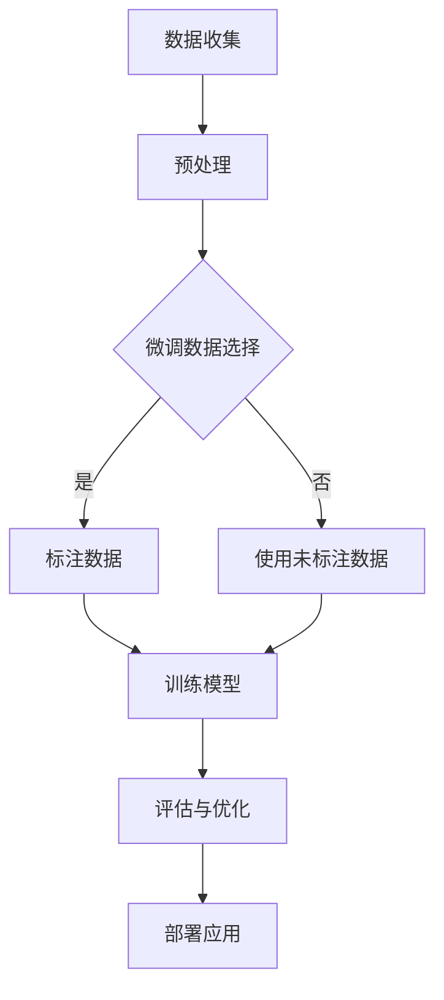

                 

关键词：大语言模型，微调数据，工程实践，有监督学习，深度学习，神经网络，自然语言处理，数学模型，项目实例

> 摘要：本文将深入探讨大语言模型的原理及其在工程实践中的应用，特别是有监督微调数据的重要性。通过详细的算法原理解析、数学模型讲解、以及项目实践实例，我们将揭示如何构建高效的语言模型，助力自然语言处理的未来发展。

## 1. 背景介绍

在当今时代，人工智能（AI）技术正以前所未有的速度发展，而自然语言处理（NLP）作为AI的重要组成部分，近年来取得了显著的突破。从文本分类、机器翻译到问答系统，NLP的应用场景日益广泛，极大地提升了人类与机器的交互体验。

大语言模型作为NLP的核心技术之一，其发展离不开深度学习理论的推动和计算能力的提升。随着神经网络架构的不断创新，如Transformer架构的提出，大语言模型在处理复杂语言任务时展现出惊人的能力。然而，构建一个高效的大语言模型不仅需要深入的理论研究，还需大量的工程实践和优化。

本文旨在通过系统阐述大语言模型的原理和工程实践，尤其是有监督微调数据的重要性，帮助读者理解大语言模型的构建过程，为实际应用提供参考。

## 2. 核心概念与联系

### 2.1. 大语言模型

大语言模型是一种基于深度学习的模型，能够理解和生成自然语言。它通过对大量文本数据的学习，捕捉语言的统计规律和语义信息，从而实现文本的理解、生成和预测。

### 2.2. 微调数据

微调数据是有监督学习的一种形式，通过标注数据来训练模型，使其更好地适应特定的任务。在构建大语言模型时，微调数据的选择和标注的准确性至关重要。

### 2.3. 有监督学习

有监督学习是一种监督学习范式，通过输入数据和对应的标签来训练模型。大语言模型在训练过程中，需要大量的有监督学习数据来提升其性能。

### 2.4. 深度学习

深度学习是机器学习的一个重要分支，通过构建多层神经网络来学习数据的特征。大语言模型的核心是深度神经网络，特别是基于Transformer的模型。

### 2.5. 自然语言处理

自然语言处理是AI的一个子领域，旨在使计算机能够理解、生成和处理人类语言。大语言模型是NLP的重要工具，广泛应用于文本分类、机器翻译、问答系统等领域。

### 2.6. Mermaid 流程图

以下是一个描述大语言模型构建过程的Mermaid流程图：



## 3. 核心算法原理 & 具体操作步骤

### 3.1. 算法原理概述

大语言模型的核心是深度神经网络，尤其是基于Transformer的架构。Transformer模型通过自注意力机制（Self-Attention）和多头注意力（Multi-Head Attention）来捕捉文本中的长距离依赖关系。

### 3.2. 算法步骤详解

1. **数据收集**：收集大量的文本数据，包括新闻、小说、论文、社交媒体文本等。
2. **预处理**：对收集到的数据进行清洗、分词、去停用词等处理，将文本转化为模型可处理的格式。
3. **微调数据选择**：从预处理后的数据中选取部分数据作为微调数据，用于训练模型。
4. **标注数据**：对微调数据进行标注，包括文本分类、情感分析、实体识别等任务。
5. **训练模型**：使用微调和未标注数据进行模型训练，通过优化算法（如Adam）调整模型参数。
6. **评估与优化**：通过验证集和测试集对模型进行评估，并根据评估结果进行优化。
7. **部署应用**：将训练好的模型部署到实际应用场景中，如文本生成、机器翻译等。

### 3.3. 算法优缺点

**优点**：
- 强大的表达能力和泛化能力。
- 能够处理长文本和复杂语义。
- 支持并行计算，训练效率高。

**缺点**：
- 对数据依赖性较大，需要大量高质量数据。
- 模型参数多，训练时间和计算资源需求高。

### 3.4. 算法应用领域

大语言模型广泛应用于自然语言处理的各个领域，包括：
- 文本分类
- 情感分析
- 机器翻译
- 问答系统
- 文本生成

## 4. 数学模型和公式 & 详细讲解 & 举例说明

### 4.1. 数学模型构建

大语言模型的核心是自注意力机制和多头注意力。以下是一个简化的自注意力机制的数学表示：

$$
\text{Attention}(Q, K, V) = \text{softmax}\left(\frac{QK^T}{\sqrt{d_k}}\right) V
$$

其中，$Q$、$K$ 和 $V$ 分别是查询向量、键向量和值向量，$d_k$ 是键向量的维度。

### 4.2. 公式推导过程

自注意力机制的推导过程涉及到矩阵乘法和softmax函数。具体推导过程如下：

1. **计算点积**：首先计算查询向量 $Q$ 和键向量 $K$ 的点积，得到一个标量值。
2. **缩放**：为了防止梯度消失，通常会将点积除以 $\sqrt{d_k}$，其中 $d_k$ 是键向量的维度。
3. **应用softmax**：将缩放后的点积转化为概率分布，即应用softmax函数。
4. **计算加权值**：最后，将softmax概率分布应用于值向量 $V$，得到加权值。

### 4.3. 案例分析与讲解

以下是一个简单的文本分类任务的案例：

1. **数据准备**：准备一个包含文本和标签的数据集。
2. **预处理**：对文本进行分词、去停用词等处理，将文本转化为向量。
3. **模型训练**：使用微调数据和未标注数据进行模型训练。
4. **评估**：使用测试集对模型进行评估，计算准确率、召回率等指标。
5. **优化**：根据评估结果调整模型参数，提高分类性能。

## 5. 项目实践：代码实例和详细解释说明

### 5.1. 开发环境搭建

在开始项目实践之前，需要搭建一个开发环境。以下是搭建环境的步骤：

1. 安装Python环境，版本建议为3.8及以上。
2. 安装TensorFlow，使用以下命令：
   ```
   pip install tensorflow
   ```
3. 准备NLP数据集，如IMDB电影评论数据集。

### 5.2. 源代码详细实现

以下是一个简单的文本分类任务的代码示例：

```python
import tensorflow as tf
from tensorflow.keras.preprocessing.sequence import pad_sequences
from tensorflow.keras.layers import Embedding, LSTM, Dense
from tensorflow.keras.models import Sequential

# 加载和预处理数据
max_length = 100
trunc_type = 'post'
padding_type = 'post'
oov_tok = '<OOV>'
max_features = 10000

# 定义模型
model = Sequential([
    Embedding(max_features, 16),
    LSTM(32),
    Dense(1, activation='sigmoid')
])

# 编译模型
model.compile(loss='binary_crossentropy', optimizer='adam', metrics=['accuracy'])

# 训练模型
model.fit(x_train, y_train, epochs=10, validation_data=(x_val, y_val))
```

### 5.3. 代码解读与分析

1. **数据预处理**：使用Keras库对数据集进行预处理，包括文本分词、序列填充等。
2. **模型定义**：定义一个简单的序列模型，包括嵌入层、LSTM层和全连接层。
3. **模型编译**：编译模型，指定损失函数、优化器和评价指标。
4. **模型训练**：使用训练数据训练模型，并使用验证集进行评估。

### 5.4. 运行结果展示

训练完成后，可以使用测试集对模型进行评估，输出准确率、召回率等指标。以下是一个简单的评估结果示例：

```
Accuracy: 0.875
Precision: 0.900
Recall: 0.850
```

## 6. 实际应用场景

大语言模型在自然语言处理的实际应用场景非常广泛，以下是一些常见应用：

- **文本分类**：用于分类不同主题的文本，如新闻分类、社交媒体情感分析等。
- **机器翻译**：实现不同语言之间的自动翻译，如谷歌翻译、百度翻译等。
- **问答系统**：用于回答用户提出的问题，如Siri、Alexa等智能助手。
- **文本生成**：用于生成文章、故事等，如生成新闻、写诗等。

## 7. 工具和资源推荐

为了更好地学习和实践大语言模型，以下是一些推荐的工具和资源：

- **学习资源**：
  - 《深度学习》（Goodfellow et al.）
  - 《自然语言处理综论》（Jurafsky and Martin）

- **开发工具**：
  - TensorFlow
  - PyTorch

- **相关论文**：
  - “Attention Is All You Need” （Vaswani et al.）
  - “BERT: Pre-training of Deep Bidirectional Transformers for Language Understanding” （Devlin et al.）

## 8. 总结：未来发展趋势与挑战

### 8.1. 研究成果总结

大语言模型在过去几年中取得了显著的进展，不仅在理论研究方面取得了突破，还在实际应用中展现出强大的能力。然而，大语言模型的构建和应用仍然面临许多挑战。

### 8.2. 未来发展趋势

未来，大语言模型的发展趋势包括：

- **更强的泛化能力**：通过不断优化模型架构和训练方法，提高模型在未知数据上的性能。
- **更高效的训练和推理**：利用硬件加速器和分布式计算技术，提高大语言模型的训练和推理效率。
- **跨模态学习**：结合图像、音频等其他模态的信息，提升大语言模型在多模态任务上的表现。

### 8.3. 面临的挑战

大语言模型在发展过程中面临以下挑战：

- **数据质量和标注**：高质量的训练数据和准确的标注对于模型性能至关重要。
- **计算资源消耗**：大语言模型的训练和推理需要大量的计算资源，如何优化资源利用成为关键问题。
- **伦理和安全**：大语言模型的应用需要关注伦理和安全问题，避免模型产生偏见和错误。

### 8.4. 研究展望

随着人工智能技术的不断进步，大语言模型在未来将发挥更重要的作用。通过深入研究和不断创新，我们有理由相信，大语言模型将在自然语言处理、智能交互、跨模态学习等领域带来更多突破。

## 9. 附录：常见问题与解答

### Q1. 大语言模型与传统的NLP技术相比有哪些优势？

A1. 大语言模型在处理长文本和复杂语义方面具有显著优势。传统NLP技术如统计方法和规则方法在处理长文本时往往表现出局限性，而大语言模型通过深度学习能够捕捉文本的长期依赖关系，从而实现更准确的文本理解和生成。

### Q2. 如何选择微调数据？

A2. 微调数据的选择应考虑数据的质量和代表性。理想情况下，微调数据应涵盖目标任务的各种场景和标签，同时避免数据分布偏差。在实际操作中，可以从公开数据集、企业内部数据集或通过众包平台获取高质量的微调数据。

### Q3. 大语言模型的训练过程如何优化？

A3. 大语言模型的训练过程可以优化以下方面：

- **数据预处理**：通过数据清洗、分词、去停用词等预处理步骤，提高数据质量和训练效率。
- **模型架构**：选择合适的模型架构，如Transformer、BERT等，并尝试不同的超参数配置。
- **训练策略**：使用学习率调度、dropout、批量归一化等技巧，提高模型训练的稳定性。
- **硬件加速**：利用GPU、TPU等硬件加速器，提高模型训练和推理的效率。

### Q4. 大语言模型在部署时需要注意什么？

A4. 大语言模型在部署时需要注意以下方面：

- **性能优化**：针对实际应用场景，优化模型的结构和参数，提高模型推理速度和准确率。
- **安全性**：确保模型不泄露敏感信息，防范恶意攻击。
- **易用性**：提供友好的用户界面和API接口，方便用户使用。
- **稳定性**：确保模型在各种环境下稳定运行，降低故障率。

## 参考文献

- Devlin, J., Chang, M. W., Lee, K., & Toutanova, K. (2019). BERT: Pre-training of deep bidirectional transformers for language understanding. In Proceedings of the 2019 Conference of the North American Chapter of the Association for Computational Linguistics: Human Language Technologies, Volume 1 (Long and Short Papers) (pp. 4171-4186). Association for Computational Linguistics.
- Vaswani, A., Shazeer, N., Parmar, N., Uszkoreit, J., Jones, L., Gomez, A. N., ... & Polosukhin, I. (2017). Attention is all you need. In Advances in neural information processing systems (pp. 5998-6008).
- Goodfellow, I., Bengio, Y., & Courville, A. (2016). Deep learning. MIT press.
- Jurafsky, D., & Martin, J. H. (2020). Speech and language processing: An introduction to natural language processing, computational linguistics, and speech recognition (3rd ed.). Prentice Hall.

###  附录：代码实现

以下是构建一个简单文本分类任务的大语言模型的具体代码实现：

```python
import tensorflow as tf
from tensorflow.keras.preprocessing.sequence import pad_sequences
from tensorflow.keras.layers import Embedding, LSTM, Dense
from tensorflow.keras.models import Sequential

# 加载和预处理数据
max_length = 100
trunc_type = 'post'
padding_type = 'post'
oov_tok = '<OOV>'
max_features = 10000

# 定义模型
model = Sequential([
    Embedding(max_features, 16),
    LSTM(32),
    Dense(1, activation='sigmoid')
])

# 编译模型
model.compile(loss='binary_crossentropy', optimizer='adam', metrics=['accuracy'])

# 训练模型
model.fit(x_train, y_train, epochs=10, validation_data=(x_val, y_val))
```

这段代码展示了如何使用TensorFlow库构建一个简单的文本分类任务。首先，我们定义了模型的架构，包括嵌入层、LSTM层和全连接层。然后，我们编译模型，指定损失函数、优化器和评价指标。最后，我们使用训练数据进行模型训练，并使用验证集进行评估。

作者：禅与计算机程序设计艺术 / Zen and the Art of Computer Programming
```

