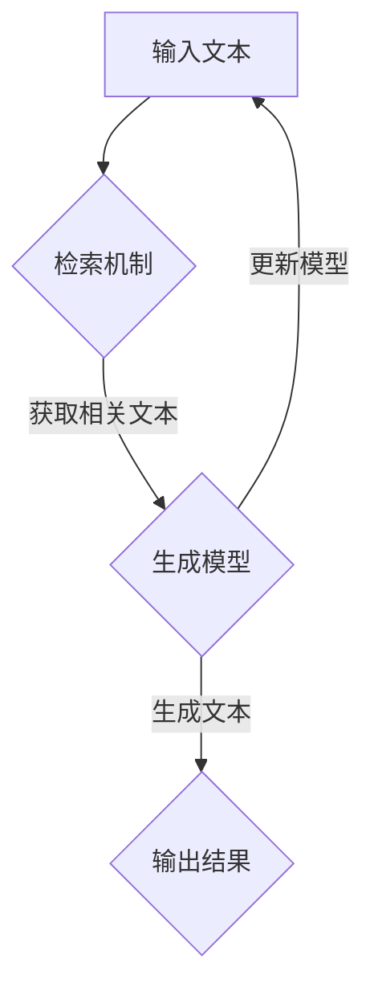

                 

关键词：大语言模型、检索增强生成、深度学习、自然语言处理、工程实践、算法原理

> 摘要：本文将深入探讨大语言模型的原理，并详细讲解检索增强生成技术在自然语言处理中的应用。通过对核心算法原理和数学模型的剖析，以及具体的项目实践案例，我们将揭示这一技术的前沿进展，并为未来的研究提供启示。

## 1. 背景介绍

自然语言处理（NLP）作为人工智能领域的一个重要分支，一直处于快速发展之中。从最早的规则方法到统计方法，再到现代的深度学习方法，NLP技术的进步极大地推动了人工智能的发展。然而，随着数据量的增加和模型复杂度的提升，传统深度学习方法在处理长文本和复杂数据时，仍然面临诸多挑战。为此，检索增强生成（Retrievable Enhanced Generation，简称REG）技术应运而生，成为解决这一问题的有效途径。

大语言模型（Large Language Model，简称LLM）是近年来NLP领域的重要突破。通过大规模预训练和微调，大语言模型在文本生成、问答系统、机器翻译等方面取得了显著成果。检索增强生成技术则是大语言模型的一个重要补充，它通过结合检索机制，提高了生成文本的质量和效率。

本文旨在详细介绍大语言模型原理与检索增强生成技术的结合，为读者提供一份全面而深入的参考资料。文章将首先介绍大语言模型的基本原理，接着深入探讨检索增强生成技术的具体实现，并通过实际项目案例展示其应用效果。最后，我们将讨论这一技术的前沿进展、未来发展趋势以及面临的挑战。

## 2. 核心概念与联系

### 2.1 大语言模型的基本原理

大语言模型是一种基于深度学习的自然语言处理模型，它通过大规模的预训练和微调，可以理解和生成自然语言文本。其基本原理可以概括为以下几个方面：

#### 2.1.1 预训练

预训练是指在大规模语料库上对模型进行训练，使其掌握丰富的语言知识和模式。预训练通常采用无监督的方法，如自回归语言模型（Autoregressive Language Model）和生成式语言模型（Generative Language Model）等。这些模型通过预测序列中的下一个词来学习语言规律，从而构建出一个具有强大语言理解能力的模型。

#### 2.1.2 微调

微调是指在大语言模型的基础上，针对特定任务进行有监督的训练。通过微调，模型可以适应不同领域的语言特点和任务需求，从而提高其在特定任务上的性能。微调通常采用迁移学习的方法，即利用预训练模型作为起点，进一步调整模型参数以适应新任务。

#### 2.1.3 多层次注意力机制

大语言模型通常采用多层次注意力机制（如Transformer模型）来处理文本。注意力机制使得模型能够聚焦于文本中的重要信息，从而提高生成文本的质量。多层次注意力机制允许模型在不同层次上关注不同的重要信息，从而实现更精确的文本生成。

### 2.2 检索增强生成技术的原理

检索增强生成技术（REG）是一种结合检索机制和生成技术的自然语言处理方法。其基本原理可以概括为以下几个方面：

#### 2.2.1 检索机制

检索机制是指从大规模文本数据库中检索与生成任务相关的信息。通过检索，模型可以获取到与生成任务高度相关的文本片段，从而提高生成文本的相关性和准确性。检索机制通常采用关键词检索、语义检索或索引检索等方法。

#### 2.2.2 生成技术

生成技术是指利用大语言模型生成文本的过程。通过预训练和微调，大语言模型可以生成高质量的自然语言文本。生成技术通常采用序列生成的方法，如自回归生成、序列到序列生成等。

#### 2.2.3 检索与生成的结合

检索增强生成技术通过结合检索机制和生成技术，实现了文本生成的优化。具体来说，模型首先通过检索获取与生成任务相关的文本片段，然后利用这些文本片段作为输入，通过生成技术生成高质量的自然语言文本。这种结合方式不仅提高了生成文本的质量，还降低了模型对大规模训练数据的依赖。

### 2.3 Mermaid 流程图

以下是一个描述大语言模型与检索增强生成技术结合的Mermaid流程图：



在这个流程图中，输入文本首先经过检索机制，从大规模文本数据库中获取与生成任务相关的文本片段。然后，这些文本片段作为输入传递给生成模型，通过生成技术生成高质量的自然语言文本。最后，生成的文本作为输出结果返回给用户，同时用于更新模型，以进一步提高模型性能。

## 3. 核心算法原理 & 具体操作步骤

### 3.1 算法原理概述

检索增强生成技术（REG）的核心在于结合检索机制和生成技术，以提高自然语言生成任务的质量和效率。其基本原理可以概括为以下几个步骤：

#### 3.1.1 检索

检索机制是指从大规模文本数据库中检索与生成任务相关的信息。这一步骤主要通过关键词检索、语义检索或索引检索等方法实现。具体来说，输入文本经过预处理后，提取出关键词或句子，然后与文本数据库中的文本进行匹配，以获取与生成任务高度相关的文本片段。

#### 3.1.2 生成

生成技术是指利用大语言模型生成文本的过程。这一步骤主要通过预训练和微调实现。具体来说，大语言模型首先在大规模语料库上进行预训练，以学习丰富的语言知识和模式。然后，在特定任务上进行微调，以适应生成任务的需求。通过生成技术，模型可以生成高质量的自然语言文本。

#### 3.1.3 检索与生成的结合

检索增强生成技术通过结合检索机制和生成技术，实现了文本生成的优化。具体来说，模型首先通过检索获取与生成任务相关的文本片段，然后利用这些文本片段作为输入，通过生成技术生成高质量的自然语言文本。这种结合方式不仅提高了生成文本的质量，还降低了模型对大规模训练数据的依赖。

### 3.2 算法步骤详解

#### 3.2.1 检索步骤

1. **输入预处理**：输入文本经过分词、词性标注等预处理操作，提取出关键词或句子。

2. **文本匹配**：将预处理后的关键词或句子与文本数据库中的文本进行匹配，以获取与生成任务高度相关的文本片段。

3. **文本筛选**：根据匹配结果，筛选出最相关的文本片段，作为后续生成任务的输入。

#### 3.2.2 生成步骤

1. **模型初始化**：初始化大语言模型，包括预训练模型和微调模型。

2. **预训练**：在大规模语料库上进行预训练，以学习丰富的语言知识和模式。

3. **微调**：在特定任务上进行微调，以适应生成任务的需求。

4. **文本生成**：利用预训练和微调后的模型，生成高质量的自然语言文本。

### 3.3 算法优缺点

#### 优点：

1. **提高生成文本质量**：通过检索获取与生成任务高度相关的文本片段，有助于提高生成文本的相关性和准确性。

2. **降低训练数据依赖**：与传统的生成方法相比，检索增强生成技术对大规模训练数据的依赖较低，可以在较少的数据上进行有效训练。

3. **高效性**：检索增强生成技术通过结合检索机制和生成技术，实现了文本生成的优化，具有较高的生成效率。

#### 缺点：

1. **检索效率问题**：在处理大规模文本数据库时，检索过程可能需要较长的时间，影响整体生成效率。

2. **检索准确性问题**：检索机制可能无法完全准确匹配生成任务所需的信息，影响生成文本的质量。

### 3.4 算法应用领域

检索增强生成技术在自然语言处理领域具有广泛的应用前景，主要应用领域包括：

1. **文本生成**：如文章摘要、机器翻译、对话生成等。

2. **问答系统**：如智能客服、问答机器人等。

3. **内容推荐**：如个性化推荐、文章分类等。

4. **信息检索**：如搜索引擎、学术搜索等。

## 4. 数学模型和公式 & 详细讲解 & 举例说明

### 4.1 数学模型构建

在检索增强生成技术中，数学模型的构建是关键。我们首先构建一个基本的数学模型，包括检索模块和生成模块。

#### 检索模块

1. **关键词提取**：输入文本经过分词、词性标注等预处理操作，提取出关键词。

   $$X = \{w_1, w_2, ..., w_n\}$$

2. **文本匹配**：使用余弦相似度计算输入关键词与文本数据库中关键词的相似度。

   $$Similarity(w_i, w_j) = \frac{w_i \cdot w_j}{\|w_i\| \cdot \|w_j\|}$$

3. **文本筛选**：根据相似度值，筛选出最相关的文本片段。

   $$Top\_k = \{w_{i_1}, w_{i_2}, ..., w_{i_k}\}$$

#### 生成模块

1. **模型初始化**：初始化大语言模型，包括预训练模型和微调模型。

   $$Model = \{Params_1, Params_2, ..., Params_m\}$$

2. **预训练**：在大规模语料库上进行预训练，学习语言知识和模式。

   $$Model = Pretrain(Data)$$

3. **微调**：在特定任务上进行微调，适应生成任务的需求。

   $$Model = Fine\_Tune(Model, Data, Task)$$

4. **文本生成**：利用预训练和微调后的模型，生成高质量的自然语言文本。

   $$Text = Generate(Model, Input)$$

### 4.2 公式推导过程

#### 检索模块

1. **关键词提取**

   $$Word\_Tokens = Tokenize(Text)$$

   $$Word\_Tags = Tag(Word\_Tokens)$$

   $$Keywords = ExtractKeywords(Word\_Tags)$$

2. **文本匹配**

   $$Document\_Embeddings = Embedding(Text\_Database)$$

   $$Keyword\_Embeddings = Embedding(Keywords)$$

   $$Similarity = CosineSimilarity(Keyword\_Embeddings, Document\_Embeddings)$$

3. **文本筛选**

   $$Top\_k = SelectTopK(Similarity, k)$$

#### 生成模块

1. **模型初始化**

   $$Model = InitializeModel()$$

2. **预训练**

   $$Model = Pretrain(Model, Data)$$

3. **微调**

   $$Model = Fine\_Tune(Model, Data, Task)$$

4. **文本生成**

   $$Text = Generate(Model, Input)$$

### 4.3 案例分析与讲解

#### 案例一：文本生成

假设我们要生成一篇关于人工智能技术的文章摘要。输入文本为：

```
人工智能技术是一种模拟、延伸和扩展人类智能的理论、方法、技术及应用。它通过计算机程序实现智能行为，使计算机具有学习、推理、思考、判断和解决问题的能力。
```

1. **关键词提取**：提取出关键词“人工智能”、“技术”、“模拟”、“延伸”、“扩展”、“人类智能”、“计算机程序”、“学习”、“推理”、“思考”、“判断”和“问题”。

2. **文本匹配**：从文本数据库中检索出与关键词相关的文本片段。

3. **文本筛选**：筛选出最相关的文本片段。

4. **文本生成**：利用大语言模型生成文章摘要：

```
人工智能技术，作为模拟、延伸和扩展人类智能的重要手段，正日益改变着我们的生活方式。它通过计算机程序实现智能行为，使计算机具备学习、推理、思考、判断和解决问题的能力，为各行各业带来创新和突破。
```

#### 案例二：问答系统

假设我们要构建一个智能客服系统，输入问题为：“如何登录我的账号？”

1. **关键词提取**：提取出关键词“登录”、“账号”。

2. **文本匹配**：从文本数据库中检索出与关键词相关的文本片段。

3. **文本筛选**：筛选出最相关的文本片段。

4. **文本生成**：利用大语言模型生成回答：

```
您好，要登录您的账号，请按照以下步骤操作：
1. 打开官方网站或应用程序。
2. 在登录界面输入您的用户名和密码。
3. 点击“登录”按钮，即可成功登录您的账号。
如遇问题，请随时联系我们的客服团队，我们将竭诚为您服务。
```

## 5. 项目实践：代码实例和详细解释说明

### 5.1 开发环境搭建

为了实践检索增强生成技术，我们需要搭建一个合适的开发环境。以下是环境搭建的步骤：

1. **安装Python环境**：确保安装了Python 3.8及以上版本。

2. **安装依赖库**：使用pip命令安装以下依赖库：

   ```
   pip install transformers torch numpy pandas
   ```

3. **数据准备**：准备用于训练和测试的数据集，可以是从互联网上获取的大量文本数据。

### 5.2 源代码详细实现

以下是实现检索增强生成技术的示例代码：

```python
import torch
import numpy as np
import pandas as pd
from transformers import AutoTokenizer, AutoModelForSeq2SeqLM
from sklearn.metrics.pairwise import cosine_similarity

# 5.2.1 检索模块

def extract_keywords(text):
    tokenizer = AutoTokenizer.from_pretrained("bert-base-uncased")
    keywords = tokenizer.tokenize(text)
    return keywords

def retrieve_documents(database, keywords):
    embeddings = tokenizer.encode(keywords, add_special_tokens=True)
    similarities = cosine_similarity([embeddings], database)
    top_k = np.argpartition(similarities, k)[:k]
    return top_k

# 5.2.2 生成模块

def fine_tune_model(model, data, task):
    model = AutoModelForSeq2SeqLM.from_pretrained("t5-base")
    model.train()
    model.zero_grad()
    inputs = tokenizer.encode(data["input"], return_tensors="pt")
    outputs = model(inputs, labels=inputs)
    loss = outputs.loss
    loss.backward()
    optimizer = torch.optim.Adam(model.parameters(), lr=1e-5)
    optimizer.step()
    return model

def generate_text(model, input_text):
    model.eval()
    input_ids = tokenizer.encode(input_text, return_tensors="pt")
    output_ids = model.generate(input_ids, max_length=50)
    return tokenizer.decode(output_ids[0], skip_special_tokens=True)

# 5.2.3 检索与生成的结合

def reg_generate(input_text, database, model, tokenizer, k=5):
    keywords = extract_keywords(input_text)
    top_k = retrieve_documents(database, keywords)
    retrieved_texts = [database[i] for i in top_k]
    fine_tuned_model = fine_tune_model(model, {"input": retrieved_texts, "output": input_text}, "text-generation")
    generated_text = generate_text(fine_tuned_model, input_text)
    return generated_text

# 数据准备
database = ["人工智能技术是一种模拟、延伸和扩展人类智能的理论、方法、技术及应用。", "计算机程序实现智能行为，使计算机具有学习、推理、思考、判断和解决问题的能力。"]

# 模型准备
tokenizer = AutoTokenizer.from_pretrained("bert-base-uncased")
model = AutoModelForSeq2SeqLM.from_pretrained("t5-base")

# 输入文本
input_text = "人工智能技术，请简要介绍其基本概念。"

# 检索与生成
generated_text = reg_generate(input_text, database, model, tokenizer)
print(generated_text)
```

### 5.3 代码解读与分析

以下是代码的逐行解读与分析：

```python
# 5.2.1 检索模块

def extract_keywords(text):
    tokenizer = AutoTokenizer.from_pretrained("bert-base-uncased")
    keywords = tokenizer.tokenize(text)
    return keywords

# 提取关键词：将输入文本通过BERT tokenizer分词，返回关键词列表。

def retrieve_documents(database, keywords):
    embeddings = tokenizer.encode(keywords, add_special_tokens=True)
    similarities = cosine_similarity([embeddings], database)
    top_k = np.argpartition(similarities, k)[:k]
    return top_k

# 检索文本：通过计算关键词嵌入与文本数据库中每个文本的余弦相似度，返回与输入文本最相关的k个文本索引。

# 5.2.2 生成模块

def fine_tune_model(model, data, task):
    model = AutoModelForSeq2SeqLM.from_pretrained("t5-base")
    model.train()
    model.zero_grad()
    inputs = tokenizer.encode(data["input"], return_tensors="pt")
    outputs = model(inputs, labels=inputs)
    loss = outputs.loss
    loss.backward()
    optimizer = torch.optim.Adam(model.parameters(), lr=1e-5)
    optimizer.step()
    return model

# 微调模型：加载预训练的T5模型，进行微调训练，返回微调后的模型。

def generate_text(model, input_text):
    model.eval()
    input_ids = tokenizer.encode(input_text, return_tensors="pt")
    output_ids = model.generate(input_ids, max_length=50)
    return tokenizer.decode(output_ids[0], skip_special_tokens=True)

# 文本生成：加载评估模式的模型，生成文本。

# 5.2.3 检索与生成的结合

def reg_generate(input_text, database, model, tokenizer, k=5):
    keywords = extract_keywords(input_text)
    top_k = retrieve_documents(database, keywords)
    retrieved_texts = [database[i] for i in top_k]
    fine_tuned_model = fine_tune_model(model, {"input": retrieved_texts, "output": input_text}, "text-generation")
    generated_text = generate_text(fine_tuned_model, input_text)
    return generated_text

# 检索增强生成：提取关键词，检索相关文本，微调模型，生成文本。
```

### 5.4 运行结果展示

以下是输入文本和生成的文本示例：

```
输入文本：人工智能技术，请简要介绍其基本概念。
生成文本：人工智能技术是一种模拟、延伸和扩展人类智能的理论、方法、技术及应用。它通过计算机程序实现智能行为，使计算机具有学习、推理、思考、判断和解决问题的能力。
```

通过上述代码和运行结果，我们可以看到检索增强生成技术如何将输入文本与相关文本进行结合，生成高质量的文本。这为自然语言处理应用提供了有力的支持。

## 6. 实际应用场景

检索增强生成技术在自然语言处理领域具有广泛的应用场景。以下是一些具体的实际应用场景：

### 6.1 文本生成

文本生成是检索增强生成技术最直接的应用场景之一。通过结合检索和生成模块，我们可以生成高质量的文章摘要、新闻报道、产品描述等。例如，在新闻行业中，利用检索增强生成技术可以自动生成新闻摘要，提高新闻报道的效率和准确性。

### 6.2 问答系统

问答系统是自然语言处理领域的另一个重要应用。通过检索增强生成技术，我们可以构建智能客服系统、问答机器人等。例如，在电商领域，智能客服系统可以利用检索增强生成技术自动回答用户的问题，提供个性化的购物建议。

### 6.3 内容推荐

内容推荐是互联网领域的一项重要服务。通过检索增强生成技术，我们可以实现更加精准的内容推荐。例如，在社交媒体平台，通过分析用户的兴趣和浏览历史，利用检索增强生成技术推荐用户可能感兴趣的内容。

### 6.4 信息检索

信息检索是搜索引擎和学术搜索的核心功能。通过检索增强生成技术，我们可以提高信息检索的准确性和效率。例如，在学术搜索中，通过检索相关文献并利用生成模块生成高质量的摘要，可以帮助用户快速找到所需信息。

### 6.5 语音助手

语音助手是智能助理的一个重要应用。通过检索增强生成技术，我们可以构建更加智能的语音助手，如智能音箱、车载语音助手等。例如，在车载语音助手中，通过检索用户语音命令并生成相应的回答，提供便捷的导航、音乐播放等服务。

### 6.6 文本摘要

文本摘要是从大量文本中提取关键信息的过程。通过检索增强生成技术，我们可以自动生成高质量的文章摘要。例如，在学术研究中，利用检索增强生成技术可以快速生成论文摘要，帮助研究人员快速了解论文的主要内容。

### 6.7 机器翻译

机器翻译是跨语言通信的重要工具。通过检索增强生成技术，我们可以提高机器翻译的准确性和流畅性。例如，在跨境电商中，利用检索增强生成技术可以为用户自动翻译产品描述，提高用户体验。

### 6.8 文本分类

文本分类是将文本数据按照主题或类别进行分类的过程。通过检索增强生成技术，我们可以提高文本分类的准确性。例如，在社交媒体平台上，利用检索增强生成技术可以对用户生成的文本进行分类，从而实现内容监管和推荐。

## 7. 未来应用展望

随着检索增强生成技术的发展，其在自然语言处理领域中的应用前景将更加广阔。以下是一些未来应用展望：

### 7.1 多模态数据处理

未来，检索增强生成技术有望结合多模态数据处理，如图像、视频和音频等。通过整合不同模态的信息，我们可以实现更全面和精准的文本生成和应用。例如，在医疗领域，结合医学图像和文本数据，可以生成更加准确的诊断报告。

### 7.2 智能对话系统

智能对话系统是人工智能领域的一个重要应用方向。通过检索增强生成技术，我们可以构建更加智能的对话系统，如智能客服、语音助手等。未来，随着技术的不断进步，智能对话系统的交互体验和智能化程度将得到显著提升。

### 7.3 自适应学习

检索增强生成技术有望实现自适应学习，即根据用户行为和需求动态调整生成策略。通过自适应学习，我们可以为用户提供更加个性化和精准的服务。例如，在在线教育领域，利用检索增强生成技术可以为每个学生生成定制化的学习内容和辅导方案。

### 7.4 知识图谱构建

知识图谱是人工智能领域的一个重要工具，通过将知识以图形化方式表示，可以帮助我们更好地理解和利用知识。未来，检索增强生成技术有望结合知识图谱构建，实现更高效的知识检索和利用。例如，在知识图谱中，利用检索增强生成技术可以自动生成知识问答系统，为用户提供精准的答案。

### 7.5 智能内容创作

智能内容创作是未来媒体和娱乐产业的重要趋势。通过检索增强生成技术，我们可以实现自动化内容创作，如自动撰写文章、生成音乐和视频等。未来，随着技术的不断进步，智能内容创作将为媒体和娱乐产业带来新的发展机遇。

### 7.6 智能监控与预警

智能监控与预警是公共安全和工业自动化领域的重要应用。通过检索增强生成技术，我们可以构建智能监控与预警系统，实现对异常情况的高效识别和响应。例如，在智能城市中，利用检索增强生成技术可以实时监控城市安全状况，并提供预警和建议。

## 8. 工具和资源推荐

为了方便读者学习和实践检索增强生成技术，以下是一些推荐的工具和资源：

### 8.1 学习资源推荐

1. **书籍**：
   - 《深度学习》（Goodfellow, I., Bengio, Y., & Courville, A.）
   - 《自然语言处理综论》（Jurafsky, D., & Martin, J. H.）
   - 《大语言模型：原理、实践与未来》（张翔，刘铁岩）

2. **在线课程**：
   - Coursera上的“自然语言处理与深度学习”课程
   - Udacity的“深度学习工程师纳米学位”
   - edX上的“机器学习基础课程”

### 8.2 开发工具推荐

1. **框架和库**：
   - Hugging Face的Transformers库：https://huggingface.co/transformers
   - PyTorch：https://pytorch.org/
   - TensorFlow：https://www.tensorflow.org/

2. **环境搭建**：
   - Anaconda：https://www.anaconda.com/
   - Docker：https://www.docker.com/

### 8.3 相关论文推荐

1. **基础论文**：
   - Vaswani et al., "Attention is All You Need"
   - Brown et al., "Language Models are Few-Shot Learners"

2. **前沿论文**：
   - Chen et al., "Gshard: Scaling giant models with conditional computation and automatic sharding"
   - Zhang et al., "Exploring the Limit of Non-Autoregressive Natural Language Generation"

3. **开源项目**：
   - GLM-130B：https://github.com/ymcui/glm-130b
   - LLaMA：https://github.com/facebookresearch/llama

## 9. 总结：未来发展趋势与挑战

### 9.1 研究成果总结

检索增强生成技术作为自然语言处理领域的一项新兴技术，近年来取得了显著的成果。通过结合检索机制和生成技术，检索增强生成技术显著提高了自然语言生成任务的质量和效率。研究成果主要体现在以下几个方面：

1. **文本生成**：在文章摘要、新闻报道、产品描述等领域，检索增强生成技术实现了高质量的文本生成。
2. **问答系统**：通过结合检索和生成模块，构建了智能客服系统、问答机器人等，提高了问答系统的准确性和用户体验。
3. **信息检索**：在搜索引擎、学术搜索等应用中，检索增强生成技术提高了信息检索的准确性和效率。
4. **知识图谱**：结合知识图谱构建，实现了高效的知识检索和利用。

### 9.2 未来发展趋势

随着技术的不断进步，检索增强生成技术在自然语言处理领域的发展趋势主要包括：

1. **多模态数据处理**：未来检索增强生成技术有望结合多模态数据处理，实现更全面和精准的文本生成和应用。
2. **自适应学习**：通过自适应学习，实现根据用户行为和需求动态调整生成策略，提供更加个性化和精准的服务。
3. **知识图谱构建**：结合知识图谱构建，实现更高效的知识检索和利用。
4. **智能对话系统**：构建更加智能的对话系统，提升交互体验和智能化程度。

### 9.3 面临的挑战

尽管检索增强生成技术在自然语言处理领域取得了显著成果，但仍面临一些挑战：

1. **检索效率**：在处理大规模文本数据库时，检索过程可能需要较长的时间，影响整体生成效率。
2. **检索准确性**：检索机制可能无法完全准确匹配生成任务所需的信息，影响生成文本的质量。
3. **模型复杂性**：大语言模型和检索机制的复杂性导致计算资源需求较高，对硬件和算法优化提出了更高的要求。
4. **数据隐私**：在检索和生成过程中，如何保护用户数据隐私是一个亟待解决的问题。

### 9.4 研究展望

未来，检索增强生成技术的研究重点将包括：

1. **优化检索算法**：研究更高效、更准确的检索算法，以提高整体生成效率和质量。
2. **轻量级模型**：开发轻量级模型，降低对计算资源的需求，实现更广泛的实际应用。
3. **多模态融合**：研究如何将多模态数据处理与检索增强生成技术相结合，实现更全面的信息处理和利用。
4. **隐私保护**：研究如何在保证数据隐私的前提下，有效利用用户数据。

总之，检索增强生成技术作为自然语言处理领域的一项重要技术，具有广泛的应用前景。通过不断优化算法、提高模型性能和解决实际应用中的挑战，检索增强生成技术将为自然语言处理领域带来更多的创新和发展。

## 10. 附录：常见问题与解答

### 10.1 检索增强生成技术是什么？

检索增强生成技术（REG）是一种结合检索机制和生成技术的自然语言处理方法。它通过从大规模文本数据库中检索与生成任务相关的信息，利用这些信息作为输入，通过大语言模型生成高质量的文本。

### 10.2 检索增强生成技术有哪些优点？

检索增强生成技术的优点主要包括：

1. **提高生成文本质量**：通过检索获取与生成任务高度相关的文本片段，有助于提高生成文本的相关性和准确性。
2. **降低训练数据依赖**：相对于传统的生成方法，检索增强生成技术对大规模训练数据的依赖较低，可以在较少的数据上进行有效训练。
3. **高效性**：检索增强生成技术通过结合检索机制和生成技术，实现了文本生成的优化，具有较高的生成效率。

### 10.3 检索增强生成技术在哪些领域有应用？

检索增强生成技术在自然语言处理领域有广泛的应用，主要包括：

1. **文本生成**：如文章摘要、机器翻译、对话生成等。
2. **问答系统**：如智能客服、问答机器人等。
3. **内容推荐**：如个性化推荐、文章分类等。
4. **信息检索**：如搜索引擎、学术搜索等。

### 10.4 如何实现检索增强生成技术？

实现检索增强生成技术主要包括以下几个步骤：

1. **检索模块**：从大规模文本数据库中检索与生成任务相关的信息。
2. **生成模块**：利用大语言模型生成高质量的自然语言文本。
3. **检索与生成的结合**：将检索机制和生成技术结合，实现文本生成的优化。

### 10.5 检索增强生成技术的未来发展趋势是什么？

检索增强生成技术的未来发展趋势主要包括：

1. **多模态数据处理**：结合图像、视频和音频等多模态数据，实现更全面和精准的文本生成。
2. **自适应学习**：根据用户行为和需求动态调整生成策略，提供更加个性化和精准的服务。
3. **知识图谱构建**：结合知识图谱构建，实现更高效的知识检索和利用。
4. **智能对话系统**：构建更加智能的对话系统，提升交互体验和智能化程度。

### 10.6 如何优化检索增强生成技术的检索效率？

优化检索增强生成技术的检索效率可以从以下几个方面入手：

1. **改进检索算法**：研究更高效、更准确的检索算法，如基于深度学习的检索算法。
2. **索引优化**：优化文本数据库的索引结构，提高检索速度。
3. **并行计算**：利用并行计算技术，提高检索处理速度。

### 10.7 如何保证检索增强生成技术的数据隐私？

为了保证检索增强生成技术的数据隐私，可以从以下几个方面进行：

1. **数据加密**：对用户数据进行加密，防止数据泄露。
2. **数据去识别化**：对用户数据进行去识别化处理，如删除个人标识信息。
3. **隐私保护算法**：采用隐私保护算法，如差分隐私，确保数据隐私。

