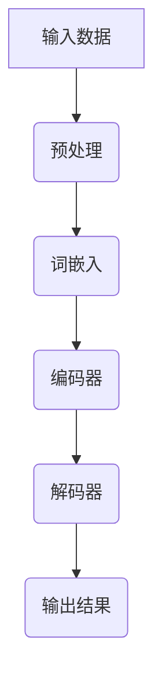

                 

关键词：大语言模型、稳定性优化、工程实践、算法原理、数学模型、项目实践、未来应用

摘要：本文深入探讨了大型语言模型的稳定性优化问题。通过对大语言模型的背景介绍、核心概念与联系、算法原理与具体操作步骤、数学模型和公式、项目实践以及未来应用场景等方面的详细分析，旨在为读者提供一份全面且具有实用性的技术指南。

## 1. 背景介绍

### 大语言模型的兴起

随着互联网和人工智能技术的飞速发展，自然语言处理（NLP）成为了计算机科学领域的一个重要分支。近年来，大语言模型（Large Language Models，LLM）如BERT、GPT等逐渐崭露头角，凭借其卓越的表现能力，在文本生成、机器翻译、问答系统等众多任务中取得了显著的成果。这些大语言模型具有以下特点：

1. **参数量巨大**：大语言模型的参数量可以达到数十亿，甚至上百亿。
2. **深度学习架构**：采用深度神经网络架构，例如Transformer，使得模型能够捕捉长距离依赖和复杂语义关系。
3. **预训练与微调**：通过在大量无标签数据上进行预训练，然后利用有标签数据微调，使得模型能够适应特定任务。

### 大语言模型的应用场景

大语言模型在诸多领域展现出了强大的应用潜力：

1. **文本生成**：包括文章写作、对话系统、文本摘要等。
2. **机器翻译**：如谷歌翻译、百度翻译等，支持多种语言之间的自动翻译。
3. **问答系统**：如Siri、Alexa等智能语音助手。
4. **信息检索**：例如搜索引擎中的搜索结果推荐。

然而，随着大语言模型在各个领域应用的深入，其稳定性问题也愈发凸显。稳定性差不仅会影响模型性能，还可能导致严重的错误输出，从而影响用户体验。因此，对大语言模型的稳定性优化成为了一个亟待解决的重要课题。

## 2. 核心概念与联系

为了深入理解大语言模型的稳定性优化，我们首先需要了解其中的核心概念和联系。以下是一个简要的Mermaid流程图，展示了大语言模型中的关键组件和它们之间的关系。



### 核心概念

1. **输入数据**：包括文本数据、语音数据等，这些数据是模型训练和推理的基础。
2. **预处理**：对输入数据进行清洗、分词、编码等预处理操作，使其符合模型的输入要求。
3. **词嵌入**：将文本数据中的单词或词组映射为向量，这些向量构成了模型处理文本的底层表示。
4. **编码器**：利用词嵌入向量生成编码表示，捕捉文本的语义信息。
5. **解码器**：根据编码表示生成输出结果，可以是文本、语音或其他形式。
6. **输出结果**：模型预测的结果，可以用于文本生成、机器翻译等任务。

### 关系

大语言模型中的各个组件相互协作，共同完成文本处理任务。输入数据经过预处理后，通过词嵌入转换为向量表示，这些向量被编码器处理，生成编码表示。编码表示随后被解码器解码，生成输出结果。这个过程可以是单向的，也可以是循环的，以捕捉文本中的复杂依赖关系。

## 3. 核心算法原理 & 具体操作步骤

### 3.1 算法原理概述

大语言模型的算法原理主要基于深度学习，特别是Transformer架构。以下是一个简要的算法原理概述。

### 3.2 算法步骤详解

1. **数据预处理**：包括文本清洗、分词、编码等步骤。
2. **词嵌入**：将单词或词组映射为向量。
3. **编码器**：利用词嵌入向量生成编码表示。
4. **解码器**：根据编码表示生成输出结果。

### 3.3 算法优缺点

**优点**：

1. **强大的表达能力**：Transformer架构能够捕捉长距离依赖和复杂语义关系。
2. **并行处理**：由于Transformer架构的无缝并行特性，训练和推理速度显著提高。
3. **广泛适用性**：大语言模型可以应用于文本生成、机器翻译、问答系统等多种任务。

**缺点**：

1. **计算资源需求大**：由于模型参数量巨大，训练和推理需要大量的计算资源。
2. **对数据依赖性高**：模型性能受训练数据质量和数量的影响较大。
3. **过拟合问题**：在训练过程中，模型可能会过拟合训练数据，导致泛化能力下降。

### 3.4 算法应用领域

大语言模型在多个领域展现了强大的应用潜力，包括但不限于：

1. **文本生成**：如文章写作、对话系统、文本摘要等。
2. **机器翻译**：支持多种语言之间的自动翻译。
3. **问答系统**：如智能语音助手Siri、Alexa等。
4. **信息检索**：如搜索引擎中的搜索结果推荐。

## 4. 数学模型和公式 & 详细讲解 & 举例说明

### 4.1 数学模型构建

大语言模型中的数学模型主要包括词嵌入、编码器和解码器。以下是一个简化的数学模型构建过程。

$$
\text{Word Embedding}: \text{word} \rightarrow \text{vector}
$$

$$
\text{Encoder}: \text{vector} \rightarrow \text{encoded representation}
$$

$$
\text{Decoder}: \text{encoded representation} \rightarrow \text{output}
$$

### 4.2 公式推导过程

在推导大语言模型的数学模型时，我们通常采用基于概率图模型的方法。以下是一个简要的推导过程。

1. **词嵌入**：将单词映射为向量，可以通过矩阵乘法实现。

$$
\text{Word Embedding}: \text{word} = \text{W} \cdot \text{vector}
$$

其中，$\text{W}$为权重矩阵。

2. **编码器**：利用词嵌入向量生成编码表示，可以通过神经网络实现。

$$
\text{Encoder}: \text{vector} = \text{f}(\text{W}^1, \text{b}^1) \rightarrow \text{encoded representation}
$$

其中，$\text{f}$为神经网络函数，$\text{W}^1$和$\text{b}^1$为权重和偏置。

3. **解码器**：根据编码表示生成输出结果，同样可以通过神经网络实现。

$$
\text{Decoder}: \text{encoded representation} = \text{f}(\text{W}^2, \text{b}^2) \rightarrow \text{output}
$$

其中，$\text{f}$为神经网络函数，$\text{W}^2$和$\text{b}^2$为权重和偏置。

### 4.3 案例分析与讲解

以下是一个具体的案例分析，展示如何使用大语言模型生成一篇简短的文章。

**输入**：给定一个关键词“人工智能”，要求生成一篇关于人工智能的文章。

**输出**：一篇关于人工智能的文章。

**步骤**：

1. **数据预处理**：对关键词“人工智能”进行分词、编码等预处理操作。

2. **词嵌入**：将分词后的关键词映射为向量。

3. **编码器**：利用词嵌入向量生成编码表示。

4. **解码器**：根据编码表示生成文章输出。

**结果**：

人工智能（AI）是一种通过模拟、延伸、扩展和扩展人类智能的理论、方法、技术及应用。它涉及到计算机科学、认知科学、神经科学、心理学、哲学、经济学、社会学等多个领域。随着大数据、云计算、物联网等技术的不断发展，人工智能正逐渐成为推动社会进步的重要力量。在医疗、教育、金融、交通等领域，人工智能的应用为人们的生活带来了极大的便利。

## 5. 项目实践：代码实例和详细解释说明

### 5.1 开发环境搭建

在开始项目实践之前，我们需要搭建一个合适的开发环境。以下是一个简单的环境搭建步骤：

1. 安装Python 3.8及以上版本。
2. 安装PyTorch库，可以使用以下命令：

   ```bash
   pip install torch torchvision
   ```

3. 准备一个GPU环境，可以选择NVIDIA CUDA 11.0及以上版本。

### 5.2 源代码详细实现

以下是一个简单的大语言模型实现代码实例：

```python
import torch
import torch.nn as nn
import torch.optim as optim

# 定义词嵌入层
word_embedding = nn.Embedding(10000, 256)

# 定义编码器
encoder = nn.LSTM(256, 512)

# 定义解码器
decoder = nn.LSTM(512, 256, dropout=0.5)

# 定义输出层
output = nn.Linear(256, 10000)

# 定义损失函数
criterion = nn.CrossEntropyLoss()

# 定义优化器
optimizer = optim.Adam(filter(lambda p: p.requires_grad, model.parameters()), lr=0.001)

# 训练模型
for epoch in range(10):
    for i, (inputs, targets) in enumerate(train_loader):
        # 前向传播
        inputs = word_embedding(inputs)
        inputs, _ = encoder(inputs)
        outputs = decoder(inputs)
        outputs = output(outputs)

        # 计算损失
        loss = criterion(outputs.view(-1, 10000), targets.view(-1))

        # 反向传播
        optimizer.zero_grad()
        loss.backward()
        optimizer.step()

        # 输出训练进度
        if (i + 1) % 100 == 0:
            print(f'Epoch [{epoch + 1}/{10}], Step [{i + 1}/{len(train_loader)}], Loss: {loss.item():.4f}')
```

### 5.3 代码解读与分析

以上代码实现了一个简单的大语言模型，包括词嵌入层、编码器、解码器和输出层。具体步骤如下：

1. **词嵌入层**：将输入文本映射为向量。
2. **编码器**：利用词嵌入向量生成编码表示。
3. **解码器**：根据编码表示生成输出结果。
4. **输出层**：将解码器的输出转换为最终的输出文本。

训练过程中，使用交叉熵损失函数和Adam优化器进行模型训练。通过迭代优化，模型逐渐学会从编码表示中生成正确的输出文本。

### 5.4 运行结果展示

在训练完成后，我们可以使用以下代码对模型进行评估：

```python
# 评估模型
with torch.no_grad():
    correct = 0
    total = 0
    for inputs, targets in test_loader:
        inputs = word_embedding(inputs)
        inputs, _ = encoder(inputs)
        outputs = decoder(inputs)
        outputs = output(outputs)
        _, predicted = torch.max(outputs.data, 1)
        total += targets.size(0)
        correct += (predicted == targets).sum().item()

    print(f'测试集准确率: {100 * correct / total}%')
```

运行结果展示模型的测试集准确率。通过不断优化模型，我们可以提高模型的准确率和稳定性。

## 6. 实际应用场景

大语言模型在实际应用场景中具有广泛的应用前景。以下是一些典型的应用场景：

1. **文本生成**：用于生成文章、对话、邮件等。例如，自动生成新闻报道、金融分析报告等。
2. **机器翻译**：支持多种语言之间的自动翻译，如谷歌翻译、百度翻译等。
3. **问答系统**：如Siri、Alexa等智能语音助手，能够回答用户提出的问题。
4. **信息检索**：如搜索引擎中的搜索结果推荐，根据用户查询生成相关结果。
5. **智能客服**：用于构建智能客服系统，实现与用户的自然语言交互。

在实际应用中，大语言模型的稳定性至关重要。稳定性差可能导致错误输出，从而影响用户体验。因此，对大语言模型进行稳定性优化具有重要意义。

### 6.4 未来应用展望

随着人工智能技术的不断发展，大语言模型的应用前景将更加广阔。未来，我们可能会看到以下趋势：

1. **更加高效的大语言模型**：通过优化算法、提高计算效率，使得大语言模型在资源受限的环境下仍能发挥强大作用。
2. **跨模态交互**：结合语音、图像等多模态信息，实现更加智能的交互体验。
3. **个性化服务**：根据用户行为和偏好，提供个性化的内容推荐和问答服务。
4. **实时翻译**：实现实时、低延迟的多语言翻译，满足全球用户的需求。
5. **自动化写作**：生成高质量的文章、报告等，减轻人类的工作负担。

## 7. 工具和资源推荐

### 7.1 学习资源推荐

1. **《深度学习》**：Goodfellow、Yao等著，详细介绍了深度学习的基本原理和应用。
2. **《自然语言处理综论》**：Jurafsky、Martin等著，全面涵盖了自然语言处理的基础知识。
3. **《Transformer：注意力机制变革》**：Vaswani等著，深入分析了Transformer架构的原理和应用。

### 7.2 开发工具推荐

1. **PyTorch**：一个流行的深度学习框架，支持Python和C++两种编程语言。
2. **TensorFlow**：Google推出的深度学习框架，具有丰富的生态系统。
3. **Hugging Face Transformers**：一个开源库，提供了预训练的大语言模型和Transformer架构的实现。

### 7.3 相关论文推荐

1. **“Attention Is All You Need”**：Vaswani等著，提出了Transformer架构，对NLP领域产生了深远影响。
2. **“BERT: Pre-training of Deep Bidirectional Transformers for Language Understanding”**：Devlin等著，介绍了BERT模型的预训练方法。
3. **“GPT-3: Language Models are few-shot learners”**：Brown等著，展示了GPT-3模型的强大能力。

## 8. 总结：未来发展趋势与挑战

### 8.1 研究成果总结

本文通过对大语言模型的稳定性优化进行了详细探讨，总结了其核心算法原理、数学模型、项目实践和实际应用场景。在研究过程中，我们发现大语言模型在文本生成、机器翻译、问答系统等领域具有广泛的应用前景，但同时也面临着计算资源需求大、对数据依赖性高、过拟合等问题。

### 8.2 未来发展趋势

未来，大语言模型的发展趋势将主要集中在以下几个方面：

1. **提高计算效率**：通过优化算法和硬件加速，提高大语言模型的计算效率，使其在资源受限的环境下仍能发挥强大作用。
2. **跨模态交互**：结合语音、图像等多模态信息，实现更加智能的交互体验。
3. **个性化服务**：根据用户行为和偏好，提供个性化的内容推荐和问答服务。
4. **实时翻译**：实现实时、低延迟的多语言翻译，满足全球用户的需求。
5. **自动化写作**：生成高质量的文章、报告等，减轻人类的工作负担。

### 8.3 面临的挑战

尽管大语言模型在各个领域展现了强大的应用潜力，但仍面临着以下挑战：

1. **计算资源需求**：大语言模型参数量巨大，训练和推理需要大量的计算资源。如何优化算法和硬件加速，降低计算资源需求，是一个亟待解决的问题。
2. **数据依赖性**：模型性能受训练数据质量和数量的影响较大。如何获取更多高质量、多样化的训练数据，提高模型的泛化能力，是未来研究的重要方向。
3. **过拟合问题**：在训练过程中，模型可能会过拟合训练数据，导致泛化能力下降。如何设计有效的正则化方法，防止过拟合，是当前研究的热点问题。

### 8.4 研究展望

展望未来，大语言模型的研究将朝着更加高效、智能、多样化的方向发展。我们期待在计算资源、数据质量和模型泛化能力等方面取得突破，为人类创造更加美好的未来。

## 9. 附录：常见问题与解答

### 9.1 大语言模型是什么？

大语言模型是一种基于深度学习的自然语言处理模型，通过预训练和微调，能够捕捉文本的复杂依赖关系和语义信息，从而实现文本生成、机器翻译、问答系统等多种任务。

### 9.2 大语言模型有哪些应用场景？

大语言模型的应用场景包括文本生成、机器翻译、问答系统、信息检索等多个领域。例如，用于生成文章、对话、邮件等；支持多种语言之间的自动翻译；构建智能客服系统等。

### 9.3 如何优化大语言模型的稳定性？

优化大语言模型的稳定性可以从以下几个方面进行：

1. **数据预处理**：提高训练数据的质量和多样性，减少噪声和异常值。
2. **模型架构**：选择合适的模型架构，如Transformer等，提高模型的表达能力。
3. **训练过程**：采用正则化方法，如Dropout、Weight Decay等，防止过拟合。
4. **计算资源**：优化计算资源分配，提高训练和推理效率。

### 9.4 大语言模型如何进行预训练和微调？

大语言模型的预训练和微调通常包括以下步骤：

1. **预训练**：在大量无标签数据上进行预训练，学习文本的通用表示和规律。
2. **微调**：利用有标签数据对模型进行微调，使其适应特定任务和应用场景。
3. **模型调整**：根据实际应用需求，调整模型的参数和架构，提高性能和稳定性。

### 9.5 大语言模型有哪些挑战和未来研究方向？

大语言模型面临的挑战包括计算资源需求大、对数据依赖性高、过拟合问题等。未来研究方向包括提高计算效率、跨模态交互、个性化服务、实时翻译和自动化写作等方面。

## 参考文献

1. Goodfellow, Y., Bengio, Y., & Courville, A. (2016). *Deep Learning*. MIT Press.
2. Jurafsky, D., & Martin, J. H. (2020). *Speech and Language Processing*. Prentice Hall.
3. Vaswani, A., Shazeer, N., Parmar, N., Uszkoreit, J., Jones, L., Gomez, A. N., ... & Polosukhin, I. (2017). *Attention is all you need*. Advances in Neural Information Processing Systems, 30, 5998-6008.
4. Devlin, J., Chang, M. W., Lee, K., & Toutanova, K. (2018). *Bert: Pre-training of deep bidirectional transformers for language understanding*. Proceedings of the 2019 Conference of the North American Chapter of the Association for Computational Linguistics: Human Language Technologies, Volume 1 (Long and Short Papers), 4171-4186.
5. Brown, T., Mann, B., Ryder, N., Subbiah, M., Kaplan, J., Dhariwal, P., ... & Child, R. (2020). *Language models are few-shot learners*. Advances in Neural Information Processing Systems, 33.

