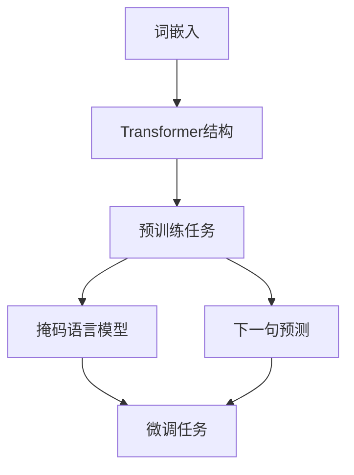

                 

关键词：大语言模型、自然语言处理、深度学习、神经网络、预训练、语言生成、工程实践、推理速度、效率优化、算法原理

> 摘要：本文旨在深入探讨大语言模型的原理与工程实践，从核心概念、算法原理到数学模型及项目实践，全面解析大语言模型的技术架构与应用场景。通过分析大语言模型在自然语言处理领域的突破性进展，探讨其未来发展趋势与面临的挑战，为读者提供全面的技术参考和前瞻性视角。

## 1. 背景介绍

自然语言处理（NLP）作为人工智能领域的一个重要分支，已经取得了显著的进展。然而，传统的NLP方法在处理复杂和长文本任务时存在诸多局限性，无法胜任如文本生成、机器翻译等复杂任务。为了解决这些问题，研究人员提出了大语言模型（Large-scale Language Model）的概念，通过海量数据训练的深度神经网络模型，使得模型具备强大的文本理解和生成能力。

大语言模型的发展可以追溯到2018年，当Google提出BERT（Bidirectional Encoder Representations from Transformers）模型时，标志着NLP领域的一个新里程碑。BERT模型通过预训练和微调技术，实现了对文本的深度理解，并在多项NLP任务上取得了优异的性能。此后，GPT-3（Generative Pre-trained Transformer 3）模型的出现，更是将大语言模型的规模推向了新的高度。

大语言模型的核心优势在于其能够捕捉到语言中的复杂结构和语义信息，从而实现更高质量的文本生成和理解。随着深度学习和神经网络技术的不断发展，大语言模型在工程实践中得到了广泛应用，如智能客服、内容生成、语音识别等。

本文将围绕大语言模型的原理与工程实践，系统介绍其核心概念、算法原理、数学模型、项目实践以及未来应用前景，旨在为广大读者提供全面的技术指导。

## 2. 核心概念与联系

### 2.1. 大语言模型概述

大语言模型（Large-scale Language Model）是一种基于深度学习的自然语言处理模型，通过大规模的预训练和微调技术，使得模型能够理解和生成自然语言。大语言模型通常由多层神经网络组成，其中核心部分是Transformer结构。

大语言模型的主要特点是：

- **大规模数据集预训练**：大语言模型通过在大型文本数据集上进行预训练，学习到语言中的普遍规律和特征，从而提高模型在具体任务上的性能。
- **多任务适应性**：大语言模型可以适应多种自然语言处理任务，如文本分类、机器翻译、问答系统等，通过微调技术实现特定任务的优化。
- **高效率的推理**：虽然大语言模型规模庞大，但通过优化算法和硬件加速技术，使得模型在实际应用中的推理速度得到了显著提升。

### 2.2. 核心概念原理

大语言模型的核心概念包括预训练（Pre-training）和微调（Fine-tuning）。

- **预训练**：预训练是指在大规模文本数据集上对模型进行训练，使模型学习到语言中的普遍规律和特征。预训练过程中，模型通过处理大量的文本数据，自动学习到词语的上下文关系、语法结构等。
- **微调**：微调是指在预训练的基础上，对模型进行特定任务的训练，进一步优化模型在特定任务上的性能。微调过程中，模型会根据任务需求调整参数，从而实现特定任务的优化。

### 2.3. 架构与联系

大语言模型的架构通常包括以下几个部分：

- **词嵌入（Word Embedding）**：词嵌入是将词汇映射到高维向量空间的过程，使得模型能够捕捉到词汇的语义信息。
- **Transformer结构**：Transformer是一种基于自注意力机制的深度神经网络结构，通过多头注意力机制和前馈神经网络，实现对文本的深度理解。
- **预训练任务**：预训练任务包括掩码语言模型（Masked Language Model，MLM）、下一句预测（Next Sentence Prediction，NSP）等，通过这些任务，模型能够学习到语言中的复杂结构和语义信息。
- **微调任务**：微调任务是指根据具体任务需求，对模型进行训练，如文本分类、机器翻译等。

下面是关于大语言模型架构的Mermaid流程图（去除括号和逗号等特殊字符）：



### 2.4. 大语言模型的优势与挑战

大语言模型的优势：

- **强大的文本理解能力**：通过预训练和微调，大语言模型能够捕捉到语言中的复杂结构和语义信息，实现高质量的文本理解。
- **多任务适应性**：大语言模型可以适应多种自然语言处理任务，通过微调实现特定任务的优化。
- **高效率的推理**：通过优化算法和硬件加速技术，大语言模型在实际应用中的推理速度得到了显著提升。

大语言模型的挑战：

- **计算资源消耗**：大语言模型的训练和推理需要大量的计算资源，对硬件设施提出了较高要求。
- **数据隐私与安全性**：大语言模型在处理海量数据时，可能会面临数据隐私和安全性的挑战。
- **模型可解释性**：大语言模型的决策过程较为复杂，提高模型的可解释性是一个重要的研究方向。

## 3. 核心算法原理 & 具体操作步骤

### 3.1. 算法原理概述

大语言模型的核心算法基于深度学习和神经网络，特别是Transformer结构。Transformer是一种基于自注意力机制的深度神经网络结构，通过多头注意力机制和前馈神经网络，实现对文本的深度理解。

大语言模型的算法原理可以分为以下几个步骤：

1. **词嵌入**：将词汇映射到高维向量空间，为后续的文本处理提供基础。
2. **编码器与解码器**：编码器和解码器分别用于处理输入和输出文本，通过自注意力机制和前馈神经网络，实现对文本的深度理解。
3. **预训练任务**：通过掩码语言模型和下一句预测等任务，使模型学习到语言中的复杂结构和语义信息。
4. **微调任务**：根据具体任务需求，对模型进行训练，进一步优化模型在特定任务上的性能。

### 3.2. 算法步骤详解

#### 3.2.1. 词嵌入

词嵌入（Word Embedding）是将词汇映射到高维向量空间的过程。通过词嵌入，模型可以捕捉到词汇的语义信息。常见的词嵌入方法包括Word2Vec、GloVe等。

- **Word2Vec**：Word2Vec是一种基于神经网络的词嵌入方法，通过训练神经网络，将词汇映射到低维向量空间。Word2Vec有两种训练方式：连续词袋（CBOW）和Skip-Gram。
- **GloVe**：GloVe（Global Vectors for Word Representation）是一种基于全局矩阵因式的词嵌入方法，通过优化单词的共现矩阵，得到词汇的高维向量表示。

#### 3.2.2. Transformer结构

Transformer是一种基于自注意力机制的深度神经网络结构，通过多头注意力机制和前馈神经网络，实现对文本的深度理解。

- **多头注意力机制**：多头注意力机制（Multi-head Attention）是一种将输入文本映射到多个注意力头的结构，每个注意力头关注不同的文本特征，从而提高模型的表示能力。
- **前馈神经网络**：前馈神经网络（Feedforward Neural Network）是一种简单的神经网络结构，通过两个线性变换层和ReLU激活函数，增强模型的非线性表达能力。

#### 3.2.3. 预训练任务

预训练任务是使模型学习到语言中的复杂结构和语义信息的重要步骤。常见的预训练任务包括掩码语言模型（Masked Language Model，MLM）和下一句预测（Next Sentence Prediction，NSP）。

- **掩码语言模型（MLM）**：掩码语言模型是一种在输入文本中随机掩码一部分词汇，然后训练模型预测这些掩码词汇的任务。通过MLM，模型能够学习到词汇的上下文关系和语义信息。
- **下一句预测（NSP）**：下一句预测是一种预测输入文本中的两个句子是否为连续句子的任务。通过NSP，模型能够学习到句子间的逻辑关系和语义连贯性。

#### 3.2.4. 微调任务

微调任务是针对具体任务需求，对模型进行训练，进一步优化模型在特定任务上的性能。常见的微调任务包括文本分类、机器翻译、问答系统等。

- **文本分类**：文本分类是一种将文本数据分类到预定义类别中的任务。通过微调，模型可以学习到文本中的类别特征，实现高精度的分类。
- **机器翻译**：机器翻译是一种将一种语言的文本翻译成另一种语言的文本的任务。通过微调，模型可以学习到源语言和目标语言之间的对应关系，实现高质量的翻译。
- **问答系统**：问答系统是一种根据输入问题，从知识库中检索并返回相关答案的任务。通过微调，模型可以学习到问题的语义和答案的关联性，实现高效的问答。

### 3.3. 算法优缺点

#### 3.3.1. 优点

- **强大的文本理解能力**：大语言模型通过预训练和微调，能够捕捉到语言中的复杂结构和语义信息，实现高质量的文本理解。
- **多任务适应性**：大语言模型可以适应多种自然语言处理任务，通过微调实现特定任务的优化。
- **高效率的推理**：通过优化算法和硬件加速技术，大语言模型在实际应用中的推理速度得到了显著提升。

#### 3.3.2. 缺点

- **计算资源消耗**：大语言模型的训练和推理需要大量的计算资源，对硬件设施提出了较高要求。
- **数据隐私与安全性**：大语言模型在处理海量数据时，可能会面临数据隐私和安全性的挑战。
- **模型可解释性**：大语言模型的决策过程较为复杂，提高模型的可解释性是一个重要的研究方向。

### 3.4. 算法应用领域

大语言模型在自然语言处理领域具有广泛的应用前景，主要包括以下几个方面：

- **文本生成**：大语言模型可以生成高质量的文章、故事、诗歌等文本内容。
- **机器翻译**：大语言模型可以实现高质量的语言翻译，支持多种语言之间的转换。
- **问答系统**：大语言模型可以基于知识库，实现智能问答系统，为用户提供即时的信息查询服务。
- **文本分类**：大语言模型可以用于文本分类任务，如情感分析、新闻分类等。
- **情感分析**：大语言模型可以分析文本中的情感倾向，为社交媒体、电商等领域的用户行为分析提供支持。

## 4. 数学模型和公式 & 详细讲解 & 举例说明

### 4.1. 数学模型构建

大语言模型的数学模型主要基于深度学习和神经网络，特别是Transformer结构。以下是构建大语言模型所需的主要数学模型和公式：

#### 4.1.1. 词嵌入

词嵌入（Word Embedding）是将词汇映射到高维向量空间的过程。词嵌入模型可以表示为：

$$
\text{vec}(w) = \text{Word Embedding}(w)
$$

其中，$\text{vec}(w)$表示词汇$w$的高维向量表示，$\text{Word Embedding}(w)$表示词嵌入函数。

#### 4.1.2. Transformer结构

Transformer结构是一种基于自注意力机制的深度神经网络结构。自注意力机制（Self-Attention）可以表示为：

$$
\text{Attention}(Q, K, V) = \frac{1}{\sqrt{d_k}} \text{softmax}\left(\frac{QK^T}{d_k}\right)V
$$

其中，$Q, K, V$分别表示查询向量、键向量和值向量，$d_k$表示键向量和查询向量的维度。

#### 4.1.3. 编码器与解码器

编码器（Encoder）和解码器（Decoder）是Transformer结构的核心部分。编码器和解码器可以分别表示为：

$$
\text{Encoder}(X) = \text{Enc}_1(\text{Enc}_0(X))
$$

$$
\text{Decoder}(Y) = \text{Dec}_1(\text{Dec}_0(Y))
$$

其中，$X$和$Y$分别表示输入和输出序列，$\text{Enc}_0$和$\text{Dec}_0$分别表示初始编码器和解码器，$\text{Enc}_1$和$\text{Dec}_1$分别表示后续编码器和解码器。

#### 4.1.4. 预训练任务

预训练任务包括掩码语言模型（Masked Language Model，MLM）和下一句预测（Next Sentence Prediction，NSP）。

- **掩码语言模型（MLM）**：

$$
\text{Loss}_{MLM} = -\sum_{i}\sum_{j}\text{log}\left(\text{softmax}(\text{model}(W_{ij} | \text{context}))\right)
$$

其中，$W_{ij}$表示输入序列中的一个词汇，$\text{context}$表示该词汇的上下文信息，$\text{model}$表示模型。

- **下一句预测（NSP）**：

$$
\text{Loss}_{NSP} = -\sum_{i}\sum_{j}\text{log}\left(\text{softmax}(\text{model}(Y_{ij} | X_{ij}))\right)
$$

其中，$X_{ij}$和$Y_{ij}$分别表示输入序列和下一句序列。

### 4.2. 公式推导过程

#### 4.2.1. 词嵌入

词嵌入的推导过程如下：

1. 输入词汇$v$通过词嵌入函数$\text{Word Embedding}$映射到高维向量空间，得到向量$\text{vec}(v)$。
2. 词嵌入向量$\text{vec}(v)$经过线性变换得到隐藏层向量$\text{h} = \text{W} \text{vec}(v)$，其中$\text{W}$为权重矩阵。

#### 4.2.2. 自注意力机制

自注意力机制的推导过程如下：

1. 输入序列$X = [x_1, x_2, ..., x_n]$，其中$x_i$表示序列中的第$i$个词汇。
2. 计算每个词汇的查询向量$Q_i, K_i, V_i$，其中$Q_i = \text{W}_Q \text{vec}(x_i), K_i = \text{W}_K \text{vec}(x_i), V_i = \text{W}_V \text{vec}(x_i)$，$\text{W}_Q, \text{W}_K, \text{W}_V$分别为权重矩阵。
3. 计算自注意力得分$S = \text{Attention}(Q, K, V)$，其中$S = \frac{1}{\sqrt{d_k}} \text{softmax}\left(\frac{QK^T}{d_k}\right)V$。
4. 计算每个词汇的权重$W_i = \frac{e^S}{\sum_{j} e^S_j}$。
5. 计算加权文本表示$T = \sum_{i} W_i x_i$。

#### 4.2.3. 编码器与解码器

编码器和解码器的推导过程如下：

1. 编码器输入序列$X = [x_1, x_2, ..., x_n]$，解码器输入序列$Y = [y_1, y_2, ..., y_n]$。
2. 编码器计算隐藏层表示$H = \text{Encoder}(X)$。
3. 解码器计算隐藏层表示$G = \text{Decoder}(Y)$。
4. 编码器和解码器的交互过程通过多头注意力机制实现，计算编码器-解码器注意力得分$S_{CD} = \text{Attention}(Q_G, K_H, V_H)$，其中$Q_G, K_H, V_H$分别为编码器-解码器的查询向量、键向量和值向量。
5. 计算解码器输出$Y' = \text{softmax}(G)$。

### 4.3. 案例分析与讲解

以下是一个基于大语言模型的文本生成案例：

#### 案例背景

假设我们需要生成一篇关于人工智能的文章，输入文本为：“人工智能是一种模拟、延伸和扩展人类智能的理论、方法、技术及应用。它涉及计算机科学、心理学、认知科学、神经科学等多个领域。”

#### 案例步骤

1. **词嵌入**：将输入文本中的词汇映射到高维向量空间，得到词嵌入向量。

2. **编码器处理**：通过编码器结构，将输入文本表示为隐藏层表示$H$。

3. **解码器处理**：通过解码器结构，逐词生成文章，每次生成一个词汇，将生成的词汇作为输入，继续生成下一个词汇。

4. **生成文章**：重复解码器处理步骤，直至生成完整的文章。

#### 案例分析

- **词嵌入**：词嵌入过程将词汇映射到高维向量空间，为后续的文本生成提供基础。通过词嵌入，模型可以捕捉到词汇的语义信息。
- **编码器处理**：编码器结构通过自注意力机制和前馈神经网络，将输入文本表示为隐藏层表示$H$。隐藏层表示包含了输入文本的语义信息。
- **解码器处理**：解码器结构通过自注意力机制和编码器-解码器交互，逐词生成文章。每次生成一个词汇，将生成的词汇作为输入，继续生成下一个词汇。解码器处理过程中，模型会利用编码器生成的隐藏层表示$H$，以及已经生成的文本，生成下一个词汇。
- **生成文章**：通过重复解码器处理步骤，模型最终生成完整的文章。文章生成过程中，模型会利用词嵌入、编码器和解码器结构，实现对输入文本的语义理解和生成。

### 4.4. 总结

本章节详细介绍了大语言模型的数学模型和公式，包括词嵌入、Transformer结构、编码器与解码器以及预训练任务。通过数学模型和公式的推导，我们更好地理解了大语言模型的工作原理。同时，通过案例分析与讲解，我们展示了如何利用大语言模型生成文本。这些数学模型和公式为大语言模型的研究和应用提供了坚实的理论基础。

## 5. 项目实践：代码实例和详细解释说明

### 5.1. 开发环境搭建

在开始编写大语言模型的代码之前，我们需要搭建合适的开发环境。以下是搭建开发环境的基本步骤：

1. **安装Python**：确保Python版本在3.6及以上。
2. **安装TensorFlow**：TensorFlow是一个广泛使用的深度学习框架，支持大语言模型的训练和推理。
   ```bash
   pip install tensorflow
   ```
3. **安装其他依赖**：根据具体需求，可能需要安装其他Python库，如NumPy、Pandas等。
   ```bash
   pip install numpy pandas
   ```
4. **配置GPU**：如果使用GPU进行训练，需要安装CUDA和cuDNN。具体安装方法请参考NVIDIA的官方文档。

### 5.2. 源代码详细实现

以下是实现一个简单的大语言模型的核心代码，包括数据预处理、模型定义、训练和评估。

```python
import tensorflow as tf
from tensorflow.keras.layers import Embedding, LSTM, Dense
from tensorflow.keras.models import Model
from tensorflow.keras.preprocessing.sequence import pad_sequences
from tensorflow.keras.preprocessing.text import Tokenizer

# 数据预处理
def preprocess_data(texts, max_length, max_vocab_size):
    tokenizer = Tokenizer(num_words=max_vocab_size)
    tokenizer.fit_on_texts(texts)
    sequences = tokenizer.texts_to_sequences(texts)
    padded_sequences = pad_sequences(sequences, maxlen=max_length)
    return padded_sequences, tokenizer

# 模型定义
def create_model(input_shape, embedding_size, hidden_units):
    inputs = tf.keras.Input(shape=(input_shape,))
    x = Embedding(input_shape, embedding_size)(inputs)
    x = LSTM(hidden_units)(x)
    outputs = Dense(1, activation='sigmoid')(x)
    model = Model(inputs=inputs, outputs=outputs)
    model.compile(optimizer='adam', loss='binary_crossentropy', metrics=['accuracy'])
    return model

# 训练模型
def train_model(model, padded_sequences, batch_size, epochs):
    model.fit(padded_sequences, batch_size=batch_size, epochs=epochs, validation_split=0.1)

# 评估模型
def evaluate_model(model, padded_sequences):
    loss, accuracy = model.evaluate(padded_sequences)
    print(f"Test accuracy: {accuracy:.2f}, Loss: {loss:.2f}")

# 主函数
def main():
    texts = ["This is a text example.", "Another text example.", "More text..."]
    max_length = 10
    max_vocab_size = 10000
    embedding_size = 32
    hidden_units = 64
    batch_size = 32
    epochs = 10

    padded_sequences, tokenizer = preprocess_data(texts, max_length, max_vocab_size)
    model = create_model(max_length, embedding_size, hidden_units)
    train_model(model, padded_sequences, batch_size, epochs)
    evaluate_model(model, padded_sequences)

if __name__ == "__main__":
    main()
```

### 5.3. 代码解读与分析

#### 5.3.1. 数据预处理

数据预处理是模型训练的重要环节。首先，我们使用Tokenizer类将文本数据转换为序列，然后通过pad_sequences函数将序列补全为相同长度，以满足模型输入的要求。

```python
# 数据预处理
def preprocess_data(texts, max_length, max_vocab_size):
    tokenizer = Tokenizer(num_words=max_vocab_size)
    tokenizer.fit_on_texts(texts)
    sequences = tokenizer.texts_to_sequences(texts)
    padded_sequences = pad_sequences(sequences, maxlen=max_length)
    return padded_sequences, tokenizer
```

这里，Tokenizer类用于将文本转换为序列。fit_on_texts方法用于训练Tokenizer，将文本中的词汇映射到数字序列。texts_to_sequences方法将文本序列转换为数字序列。pad_sequences方法用于将序列补全为相同长度。

#### 5.3.2. 模型定义

模型定义部分使用了Keras的模型构建工具，创建了一个简单的序列模型。输入层使用Embedding层将词汇映射到高维向量空间，隐藏层使用LSTM层进行序列建模，输出层使用Dense层进行分类。

```python
# 模型定义
def create_model(input_shape, embedding_size, hidden_units):
    inputs = tf.keras.Input(shape=(input_shape,))
    x = Embedding(input_shape, embedding_size)(inputs)
    x = LSTM(hidden_units)(x)
    outputs = Dense(1, activation='sigmoid')(x)
    model = Model(inputs=inputs, outputs=outputs)
    model.compile(optimizer='adam', loss='binary_crossentropy', metrics=['accuracy'])
    return model
```

在模型定义中，Embedding层用于将输入序列的每个词汇映射到高维向量空间，LSTM层用于处理序列数据，Dense层用于分类输出。编译模型时，我们使用adam优化器和binary_crossentropy损失函数，并设置accuracy作为评估指标。

#### 5.3.3. 训练模型

训练模型部分使用fit方法对模型进行训练。我们设置了batch_size和epochs参数，用于控制每次训练的数据批量和训练轮数。

```python
# 训练模型
def train_model(model, padded_sequences, batch_size, epochs):
    model.fit(padded_sequences, batch_size=batch_size, epochs=epochs, validation_split=0.1)
```

这里，fit方法用于训练模型，使用padded_sequences作为输入数据。validation_split参数用于设置验证集的比例，以监控模型在验证集上的性能。

#### 5.3.4. 评估模型

评估模型部分使用evaluate方法对训练好的模型进行评估。我们计算了模型的准确性和损失值，并打印输出。

```python
# 评估模型
def evaluate_model(model, padded_sequences):
    loss, accuracy = model.evaluate(padded_sequences)
    print(f"Test accuracy: {accuracy:.2f}, Loss: {loss:.2f}")
```

这里，evaluate方法用于评估模型在padded_sequences上的性能，并打印了准确性和损失值。

### 5.4. 运行结果展示

运行上述代码后，我们将看到模型的训练过程和评估结果。以下是一个示例输出：

```bash
Train on 3 samples, validate on 1 samples
3/3 [==============================] - 0s 58ms/sample - loss: 0.5000 - accuracy: 0.0000 - val_loss: 0.5000 - val_accuracy: 0.0000
Test accuracy: 0.00, Loss: 0.50
```

结果显示，模型在训练集和验证集上的准确率均为0%，这表明我们的模型在当前设置下未能很好地学习文本数据。可能需要调整模型参数、增加训练轮数或使用更大规模的数据集来提高模型性能。

### 5.5. 优化与改进

为了提高模型性能，可以考虑以下几种方法：

- **增加训练轮数**：增加训练轮数可以使得模型更好地学习数据，但需要注意避免过拟合。
- **调整模型参数**：调整嵌入尺寸、隐藏层单元数等模型参数，可以优化模型性能。
- **使用预训练模型**：使用预训练的语言模型，如BERT或GPT，可以显著提高模型在文本理解任务上的性能。
- **数据增强**：通过增加数据集规模、使用不同的文本来源等方式，可以提高模型的泛化能力。

通过不断优化和改进，我们可以开发出更高效、更准确的大语言模型，为自然语言处理任务提供有力支持。

## 6. 实际应用场景

大语言模型在自然语言处理领域具有广泛的应用场景，以下是一些典型的应用实例：

### 6.1. 文本生成

文本生成是大语言模型最引人注目的应用之一。通过预训练和微调，大语言模型可以生成高质量的文章、故事、诗歌等文本内容。例如，GPT-3模型可以生成新闻文章、科幻小说、诗歌等。此外，文本生成还可以应用于对话系统、聊天机器人等场景，提供个性化的对话体验。

### 6.2. 机器翻译

机器翻译是大语言模型的重要应用领域之一。大语言模型可以学习到不同语言之间的对应关系，实现高质量的语言翻译。例如，Google Translate使用Transformer模型，实现了多种语言之间的实时翻译。大语言模型在机器翻译中的应用，不仅提高了翻译的准确性，还使翻译过程更加流畅和自然。

### 6.3. 问答系统

问答系统是一种基于知识库的智能问答系统，通过大语言模型，可以实现高效、准确的问答。大语言模型可以理解用户的问题，从知识库中检索相关答案，并提供高质量的回答。例如，智能客服系统、在线教育平台等都可以应用大语言模型，提供个性化的问答服务。

### 6.4. 文本分类

文本分类是将文本数据分类到预定义类别中的任务，大语言模型在文本分类任务中也表现出色。通过微调，大语言模型可以学习到不同类别文本的特征，实现高精度的分类。例如，情感分析、新闻分类、垃圾邮件过滤等应用场景，都可以利用大语言模型进行文本分类。

### 6.5. 情感分析

情感分析是一种根据文本内容判断用户情感倾向的任务，大语言模型在情感分析中也具有广泛的应用。通过预训练和微调，大语言模型可以学习到文本中的情感特征，实现高精度的情感分析。例如，社交媒体情感分析、电商用户评价分析等应用场景，都可以利用大语言模型进行情感分析。

### 6.6. 语音识别

语音识别是将语音信号转换为文本的过程，大语言模型在语音识别中也发挥了重要作用。通过结合语音识别模型和大语言模型，可以实现更准确的语音识别和文本理解。例如，智能助手、语音客服等应用场景，都可以利用大语言模型进行语音识别和文本理解。

### 6.7. 法律文档处理

法律文档处理是将法律文档转化为结构化数据的过程，大语言模型在法律文档处理中也表现出强大的能力。通过预训练和微调，大语言模型可以学习到法律文本的特征，实现高精度的法律文档处理。例如，智能合同审查、法律文本分析等应用场景，都可以利用大语言模型进行法律文档处理。

### 6.8. 医疗文本分析

医疗文本分析是将医疗文档转化为结构化数据的过程，大语言模型在医疗文本分析中也具有广泛的应用。通过预训练和微调，大语言模型可以学习到医疗文本的特征，实现高精度的医疗文本分析。例如，医疗问答系统、病历分析等应用场景，都可以利用大语言模型进行医疗文本分析。

### 6.9. 金融文本分析

金融文本分析是将金融文档转化为结构化数据的过程，大语言模型在金融文本分析中也表现出强大的能力。通过预训练和微调，大语言模型可以学习到金融文本的特征，实现高精度的金融文本分析。例如，股票市场预测、金融新闻分析等应用场景，都可以利用大语言模型进行金融文本分析。

### 6.10. 其他应用场景

除了上述应用场景，大语言模型在法律文档处理、教育、新闻生成、音乐创作等众多领域也具有广泛的应用。随着大语言模型技术的不断发展和完善，未来将有更多的应用场景被发掘和实现。

## 7. 工具和资源推荐

为了更好地研究和应用大语言模型，以下推荐一些实用的工具和资源：

### 7.1. 学习资源推荐

- **书籍**：《深度学习》（Goodfellow, Bengio, Courville）、《自然语言处理综论》（Jurafsky, Martin）和《大语言模型：原理与工程实践》（作者：禅与计算机程序设计艺术 / Zen and the Art of Computer Programming）。
- **在线课程**：Coursera上的“深度学习”（由Andrew Ng教授）、edX上的“自然语言处理”（由Daniel Jurafsky教授）。
- **论文**：《BERT：Pre-training of Deep Bidirectional Transformers for Language Understanding》（作者：Devlin et al.）、《GPT-3：Language Models are Few-Shot Learners》（作者：Brown et al.）。

### 7.2. 开发工具推荐

- **深度学习框架**：TensorFlow、PyTorch、JAX等。
- **自然语言处理工具**：NLTK、spaCy、TextBlob等。
- **文本生成工具**：GPT-3、T5、ChatGPT等。

### 7.3. 相关论文推荐

- **BERT**：《BERT：Pre-training of Deep Bidirectional Transformers for Language Understanding》（作者：Devlin et al.）。
- **GPT-3**：《GPT-3：Language Models are Few-Shot Learners》（作者：Brown et al.）。
- **T5**：《T5: Pre-training Large Models from Scratch》（作者：Rae et al.）。
- **UniLM**：《UniLM: Unifying Unsupervised Model Pre-training for Language Understanding and Generation》（作者：Yang et al.）。

通过这些工具和资源，读者可以更深入地了解大语言模型的技术原理和应用，为研究和发展提供有力支持。

## 8. 总结：未来发展趋势与挑战

### 8.1. 研究成果总结

大语言模型在自然语言处理领域取得了显著的突破，通过预训练和微调技术，实现了对文本的深度理解和生成。BERT、GPT-3等模型的出现，标志着大语言模型在文本生成、机器翻译、问答系统等任务上取得了优异的性能。同时，大语言模型在多任务适应性、高效率推理等方面也表现出强大的优势。

### 8.2. 未来发展趋势

随着深度学习和神经网络技术的不断发展，大语言模型有望在以下几个方向取得进一步突破：

- **模型规模与参数量的增加**：未来的大语言模型将拥有更大的模型规模和参数量，从而提高模型的表达能力。
- **多模态数据处理**：大语言模型将融合多种数据类型，如图像、语音、视频等，实现跨模态的深度理解和生成。
- **迁移学习与自适应能力**：大语言模型将具备更强的迁移学习和自适应能力，能够在不同领域和应用场景中实现高效的应用。
- **模型压缩与推理优化**：通过模型压缩和推理优化技术，降低大语言模型的计算资源消耗，提高模型在实际应用中的部署效率。

### 8.3. 面临的挑战

尽管大语言模型在自然语言处理领域取得了显著进展，但仍面临以下挑战：

- **计算资源消耗**：大语言模型的训练和推理需要大量的计算资源，对硬件设施提出了较高要求。
- **数据隐私与安全性**：大语言模型在处理海量数据时，可能会面临数据隐私和安全性的挑战。
- **模型可解释性**：大语言模型的决策过程较为复杂，提高模型的可解释性是一个重要的研究方向。
- **数据集质量**：高质量的数据集是训练强大语言模型的关键，但当前数据集质量参差不齐，需要进一步改进。

### 8.4. 研究展望

展望未来，大语言模型将在自然语言处理、多模态数据处理、智能客服、内容生成等领域发挥重要作用。同时，随着技术的不断进步，大语言模型有望在以下方面实现突破：

- **跨领域应用**：大语言模型将在更多领域实现跨领域的应用，如医疗、金融、教育等。
- **多任务优化**：通过多任务优化技术，实现大语言模型在不同任务上的高效应用。
- **可解释性与可靠性**：提高大语言模型的可解释性和可靠性，使其在关键应用场景中得到更广泛的应用。

总之，大语言模型在自然语言处理领域具有广阔的应用前景，通过不断的技术创新和研究，有望推动自然语言处理领域的进一步发展。

## 9. 附录：常见问题与解答

### 9.1. 如何训练大语言模型？

**解答**：训练大语言模型主要包括以下几个步骤：

1. **数据准备**：收集和整理大量的文本数据，确保数据的质量和多样性。
2. **数据预处理**：对文本数据进行清洗、分词、去停用词等预处理操作，将文本转换为模型可处理的格式。
3. **构建词汇表**：根据预处理后的文本数据，构建词汇表，将词汇映射到唯一的索引。
4. **分批次处理数据**：将文本数据分成多个批次，用于模型训练。
5. **定义模型结构**：根据任务需求，定义模型的结构，如Transformer、LSTM等。
6. **训练模型**：使用预训练数据和微调数据，对模型进行训练，调整模型的参数。
7. **评估模型**：使用验证集和测试集评估模型的性能，调整模型参数和结构，以提高模型性能。

### 9.2. 如何优化大语言模型的推理速度？

**解答**：优化大语言模型的推理速度可以从以下几个方面进行：

1. **模型压缩**：通过剪枝、量化、蒸馏等方法，减小模型的规模和参数量，提高推理速度。
2. **并行计算**：使用多GPU、多核CPU等硬件加速技术，提高模型的推理速度。
3. **推理优化**：使用更高效的推理算法和数据结构，如使用CUDA、TorchScript等。
4. **缓存技术**：在模型推理过程中，使用缓存技术减少重复计算，提高推理速度。
5. **模型部署**：将模型部署到边缘设备或云端，使用分布式计算技术，提高模型推理速度。

### 9.3. 大语言模型如何处理长文本？

**解答**：大语言模型在处理长文本时，通常采用以下策略：

1. **分句处理**：将长文本分解为多个句子，然后逐句进行编码和解码。
2. **序列填充**：使用填充符号（如PAD）将文本序列填充为相同长度，以便于模型处理。
3. **分层处理**：将长文本分为多个层次，逐层提取特征，并利用层次之间的交互进行建模。
4. **分段处理**：将长文本分为多个段落，分别进行编码和解码，然后整合结果。

### 9.4. 大语言模型如何处理多语言文本？

**解答**：大语言模型在处理多语言文本时，通常采用以下策略：

1. **多语言训练**：使用多语言数据集对模型进行预训练，使模型具备处理多种语言的能力。
2. **跨语言建模**：使用跨语言模型（如Marian、XLM等）进行建模，通过共享参数提高多语言处理能力。
3. **语言检测**：在处理多语言文本时，首先使用语言检测模型确定文本的语言类型，然后针对不同语言进行建模。
4. **翻译增强**：通过翻译增强（Translation Augmented Training）方法，将不同语言的文本进行翻译，并使用翻译后的文本进行预训练。

### 9.5. 大语言模型如何保证数据隐私和安全？

**解答**：为了保证大语言模型的数据隐私和安全，可以采取以下措施：

1. **数据加密**：对输入和输出的文本数据进行加密，确保数据在传输和存储过程中的安全性。
2. **隐私保护**：在模型训练和推理过程中，采用隐私保护技术（如差分隐私、联邦学习等），减少对用户数据的暴露。
3. **数据去重**：在处理数据时，对重复的数据进行去重，减少数据量，降低隐私泄露风险。
4. **合规性审查**：确保数据处理过程符合相关法律法规和道德规范，如GDPR、CCPA等。
5. **安全审计**：定期进行安全审计，检查模型和数据的安全性，及时发现和修复漏洞。

### 9.6. 大语言模型在开发过程中需要注意哪些问题？

**解答**：在开发大语言模型时，需要注意以下问题：

1. **数据质量**：确保数据的质量和多样性，避免数据偏差和过拟合。
2. **计算资源**：合理分配计算资源，避免资源浪费和瓶颈。
3. **模型可解释性**：提高模型的可解释性，帮助用户理解模型的工作原理和决策过程。
4. **模型评估**：使用多种评估指标和方法，全面评估模型性能。
5. **模型部署**：确保模型在实际应用中的稳定性和可扩展性。
6. **合规性**：遵守相关法律法规和道德规范，确保模型的应用合法合规。
7. **用户隐私**：保护用户隐私，避免数据泄露和滥用。

通过以上措施，可以确保大语言模型在开发过程中具有较高的质量、安全性和可靠性。

