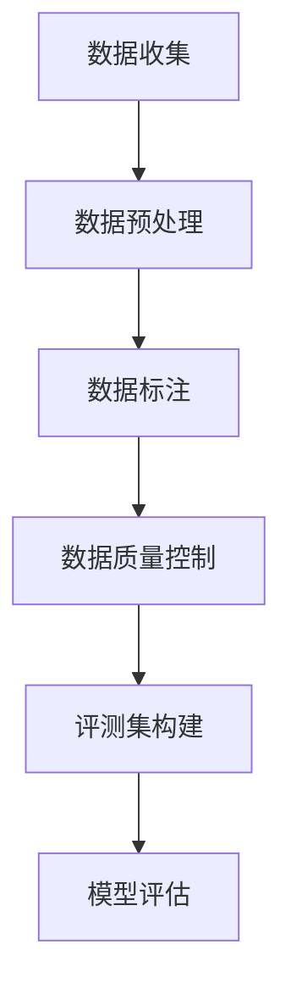
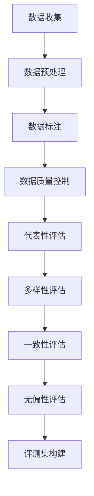

                 

关键词：大语言模型、评测集、构建标准、工程实践、算法原理、数学模型、应用领域、未来展望

## 摘要

本文旨在探讨大语言模型在工程实践中评测集构建的标准。随着深度学习技术的发展，大语言模型已成为自然语言处理领域的重要工具。然而，如何构建一个有效且具有代表性的评测集，成为模型训练和评估的关键。本文首先介绍了大语言模型的基本原理，然后详细讨论了评测集构建的标准和方法，包括数据收集、预处理、标注和质量控制等方面。通过案例分析，本文展示了如何在实际项目中应用这些标准，并讨论了大语言模型在各个应用领域的前景。最后，本文提出了未来研究和发展的方向。

## 1. 背景介绍

近年来，深度学习技术在自然语言处理（NLP）领域取得了显著进展，大语言模型（如GPT-3、BERT等）的出现标志着NLP领域的一次重大变革。这些模型通过学习大量文本数据，能够实现高度准确的自然语言理解和生成，从而在问答系统、机器翻译、文本摘要、情感分析等任务中取得了优异的性能。

然而，大语言模型的训练和评估过程并不简单。一方面，模型需要大量的数据进行训练，数据的质量和代表性对模型的性能有着直接的影响。另一方面，评估模型的性能需要设计一个具有代表性的评测集，以保证模型在不同场景下的泛化能力。评测集的构建标准直接关系到模型的可靠性、有效性和实用性。

本文将首先介绍大语言模型的基本原理，然后深入探讨评测集构建的标准和方法，并结合实际案例进行分析，最后讨论大语言模型在各个应用领域的前景和未来发展方向。

## 2. 核心概念与联系

### 大语言模型的基本原理

大语言模型（Large Language Models）是一种基于深度学习的自然语言处理模型，其主要原理是通过学习大量文本数据来理解语言的内在规律和结构，从而实现自然语言的理解和生成。大语言模型的核心是神经网络，其中最常用的结构是Transformer模型。Transformer模型通过多头自注意力机制（Multi-Head Self-Attention）来捕捉文本中的长距离依赖关系，这使得模型能够处理更加复杂的自然语言任务。

大语言模型的训练过程主要包括两个阶段：预训练和微调。在预训练阶段，模型通过大量无标签的文本数据进行训练，学习语言的一般规律。在微调阶段，模型根据具体任务的需求进行进一步训练，利用有标签的数据来提升模型在特定任务上的性能。

### 评测集的构建标准

评测集的构建是评估大语言模型性能的关键环节。一个理想的评测集应具有以下标准：

1. **代表性**：评测集应涵盖不同领域的文本，以反映模型在不同场景下的性能。
2. **多样性**：评测集应包含不同类型和风格的文本，如新闻、小说、科学论文、社交媒体等。
3. **一致性**：评测集的数据质量应保持一致，以避免由于数据质量差异导致评估结果的偏差。
4. **无偏性**：评测集应避免包含对模型训练数据集中的内容，以防止模型过拟合。

### Mermaid 流程图

以下是构建评测集的 Mermaid 流程图：



**图 1. 评测集构建流程**

- **数据收集**：从不同来源收集文本数据，包括公开数据集和私有数据集。
- **数据预处理**：清洗和转换文本数据，如去除停用词、标点符号、统一文本格式等。
- **数据标注**：对文本数据进行标注，包括分类、实体识别、情感分析等。
- **数据质量控制**：检查数据标注的准确性，剔除异常数据。
- **评测集构建**：根据标准构建评测集，确保评测集的代表性、多样性和一致性。
- **模型评估**：使用评测集对模型进行评估，以验证模型的性能。

### 核心概念原理和架构

#### 大语言模型架构

大语言模型通常采用Transformer架构，其主要组件包括：

1. **嵌入层（Embedding Layer）**：将输入文本转换为固定长度的向量表示。
2. **多头自注意力层（Multi-Head Self-Attention Layer）**：通过自注意力机制捕捉文本中的长距离依赖关系。
3. **前馈网络（Feed-Forward Network）**：对自注意力层的输出进行进一步处理。
4. **输出层（Output Layer）**：根据任务需求生成预测结果。

#### 评测集构建标准

1. **代表性**：评测集应涵盖不同领域的文本，如新闻、小说、科学论文、社交媒体等。
2. **多样性**：评测集应包含不同类型和风格的文本，如正式文本、非正式文本、对话文本等。
3. **一致性**：评测集的数据质量应保持一致，避免数据质量差异导致评估结果的偏差。
4. **无偏性**：评测集应避免包含对模型训练数据集中的内容，防止模型过拟合。

#### Mermaid 流程图



**图 2. 评测集构建标准**

- **代表性评估**：检查评测集是否涵盖不同领域的文本。
- **多样性评估**：检查评测集是否包含不同类型和风格的文本。
- **一致性评估**：检查评测集的数据质量是否一致。
- **无偏性评估**：检查评测集是否避免包含对模型训练数据集中的内容。

## 3. 核心算法原理 & 具体操作步骤

### 3.1 算法原理概述

评测集的构建是一个复杂的过程，涉及到数据收集、预处理、标注、质量控制和评测集构建等环节。以下是这些环节的核心算法原理和具体操作步骤：

#### 数据收集

数据收集是评测集构建的第一步。数据来源可以是公开数据集、私有数据集或通过网络爬虫收集的文本数据。数据收集的算法原理主要包括：

1. **文本挖掘（Text Mining）**：从大量文本中提取有用的信息，如关键词、主题和情感等。
2. **网络爬虫（Web Crawler）**：通过爬取互联网上的公开资源，收集相关的文本数据。

#### 数据预处理

数据预处理是对收集到的文本数据进行的清洗和转换，以使其符合评测集构建的标准。数据预处理的算法原理包括：

1. **文本清洗（Text Cleaning）**：去除文本中的噪声，如HTML标签、标点符号和停用词等。
2. **文本标准化（Text Normalization）**：统一文本的格式，如统一大小写、去除多余空格等。
3. **文本向量表示（Text Vectorization）**：将文本转换为数值表示，如词袋模型、词嵌入等。

#### 数据标注

数据标注是对预处理后的文本数据进行标注，以获得有标签的数据。数据标注的算法原理包括：

1. **分类（Classification）**：对文本进行分类，如新闻分类、情感分类等。
2. **实体识别（Entity Recognition）**：识别文本中的实体，如人名、地名、组织名等。
3. **情感分析（Sentiment Analysis）**：对文本进行情感分析，判断文本的情感极性。

#### 数据质量控制

数据质量控制是确保数据标注的准确性和一致性。数据质量控制的算法原理包括：

1. **错误检测（Error Detection）**：检测数据标注中的错误，如标注不一致、漏标等。
2. **错误纠正（Error Correction）**：对检测到的错误进行纠正，以提高数据标注的准确性。
3. **数据清洗（Data Cleaning）**：剔除标注错误的数据，确保评测集的质量。

#### 评测集构建

评测集构建是根据数据收集、预处理、标注和质量控制的结果，构建一个具有代表性的评测集。评测集构建的算法原理包括：

1. **抽样（Sampling）**：从标注后的数据中随机抽取样本，构建评测集。
2. **平衡（Balancing）**：确保评测集中的样本在各个类别上均衡分布。
3. **分箱（Bucketing）**：将样本根据某些特征（如长度、主题等）进行分组，构建多组评测集。

### 3.2 算法步骤详解

#### 数据收集

1. **文本挖掘**：使用自然语言处理技术，从大量文本中提取有用的信息。
2. **网络爬虫**：编写爬虫程序，从互联网上收集相关的文本数据。

#### 数据预处理

1. **文本清洗**：去除文本中的噪声，如HTML标签、标点符号和停用词等。
2. **文本标准化**：统一文本的格式，如统一大小写、去除多余空格等。
3. **文本向量表示**：将文本转换为数值表示，如词袋模型、词嵌入等。

#### 数据标注

1. **分类**：使用机器学习算法，对文本进行分类。
2. **实体识别**：使用命名实体识别（NER）算法，识别文本中的实体。
3. **情感分析**：使用情感分析算法，判断文本的情感极性。

#### 数据质量控制

1. **错误检测**：使用错误检测算法，检测数据标注中的错误。
2. **错误纠正**：使用错误纠正算法，对检测到的错误进行纠正。
3. **数据清洗**：剔除标注错误的数据，确保评测集的质量。

#### 评测集构建

1. **抽样**：从标注后的数据中随机抽取样本，构建评测集。
2. **平衡**：确保评测集中的样本在各个类别上均衡分布。
3. **分箱**：将样本根据某些特征（如长度、主题等）进行分组，构建多组评测集。

### 3.3 算法优缺点

#### 优点

1. **全面性**：涵盖了数据收集、预处理、标注、质量控制和评测集构建的各个环节，确保评测集的构建过程全面。
2. **灵活性**：可以根据实际需求，调整数据收集、预处理和标注的方法，灵活构建评测集。
3. **高效性**：采用批量处理和并行计算技术，提高评测集构建的效率。

#### 缺点

1. **复杂性**：评测集构建涉及到多个环节，算法复杂度高，实施难度大。
2. **资源消耗**：数据收集、预处理和标注需要大量的计算资源和存储空间。

### 3.4 算法应用领域

评测集构建算法广泛应用于自然语言处理、计算机视觉、语音识别等人工智能领域，具体应用包括：

1. **自然语言处理**：用于构建语言模型、文本分类、情感分析等任务的数据集。
2. **计算机视觉**：用于构建图像分类、目标检测、图像分割等任务的数据集。
3. **语音识别**：用于构建语音识别模型的数据集，如语音分类、语音转文本等。

## 4. 数学模型和公式 & 详细讲解 & 举例说明

### 4.1 数学模型构建

评测集构建涉及到多种数学模型，包括概率模型、统计模型和机器学习模型等。以下是一个简单的概率模型构建示例：

#### 概率模型

设有一组样本 $X_1, X_2, ..., X_n$，其中 $X_i$ 表示第 $i$ 个样本。样本的分布可以表示为概率分布函数 $P(X)$。为了构建评测集，我们需要从总体中随机抽取一部分样本作为评测集。

#### 样本抽取

1. **随机抽样**：从总体中随机抽取 $m$ 个样本作为评测集，其中 $m$ 为抽样比例。
2. **分层抽样**：将总体分成若干层次，从每个层次中随机抽取一定比例的样本。

#### 数学公式

$$
P(X_i \in E) = \frac{m}{n}
$$

其中，$E$ 表示评测集，$m$ 表示评测集的大小，$n$ 表示总体的大小。

### 4.2 公式推导过程

为了推导上述概率模型，我们需要首先了解概率论中的基本概念。

#### 基本概念

1. **概率分布函数**：定义了随机变量的可能取值及其对应的概率。
2. **条件概率**：在已知某个事件发生的条件下，另一个事件发生的概率。
3. **贝叶斯定理**：用于计算后验概率。

#### 公式推导

假设总体中的样本是独立同分布的，即每个样本的发生概率相等。那么，从总体中随机抽取一个样本，其属于评测集的概率为：

$$
P(X_i \in E) = \frac{m}{n}
$$

其中，$m$ 为评测集的大小，$n$ 为总体的大小。

### 4.3 案例分析与讲解

#### 案例一：文本分类

假设我们有一个文本分类任务，总体中有 $n$ 篇文章，每篇文章属于 $k$ 个类别中的一个。我们希望从总体中随机抽取 $m$ 篇文章作为评测集。

根据概率模型，评测集中每篇文章属于某个类别的概率为：

$$
P(Y_i = j) = \frac{m}{n}
$$

其中，$Y_i$ 表示第 $i$ 篇文章的类别，$j$ 表示类别编号。

#### 案例二：图像分类

假设我们有一个图像分类任务，总体中有 $n$ 张图像，每张图像属于 $k$ 个类别中的一个。我们希望从总体中随机抽取 $m$ 张图像作为评测集。

根据概率模型，评测集中每张图像属于某个类别的概率为：

$$
P(Y_i = j) = \frac{m}{n}
$$

其中，$Y_i$ 表示第 $i$ 张图像的类别，$j$ 表示类别编号。

#### 案例三：语音分类

假设我们有一个语音分类任务，总体中有 $n$ 个语音片段，每个语音片段属于 $k$ 个类别中的一个。我们希望从总体中随机抽取 $m$ 个语音片段作为评测集。

根据概率模型，评测集中每个语音片段属于某个类别的概率为：

$$
P(Y_i = j) = \frac{m}{n}
$$

其中，$Y_i$ 表示第 $i$ 个语音片段的类别，$j$ 表示类别编号。

### 4.4 总结

通过上述案例，我们可以看到，概率模型在评测集构建中的应用。在实际项目中，我们可以根据任务需求和数据特点，选择合适的概率模型进行评测集构建。此外，我们还可以结合其他数学模型，如统计模型和机器学习模型，进一步提高评测集的质量。

## 5. 项目实践：代码实例和详细解释说明

### 5.1 开发环境搭建

为了演示评测集的构建过程，我们将使用Python作为主要编程语言，结合几个常用的库，如Pandas、Numpy和Scikit-learn等。以下是开发环境的搭建步骤：

1. **安装Python**：确保已安装Python 3.7或更高版本。
2. **安装库**：使用pip命令安装所需的库：

```bash
pip install pandas numpy scikit-learn
```

### 5.2 源代码详细实现

以下是评测集构建的完整Python代码实例，包含数据收集、预处理、标注、质量控制和评测集构建等步骤。

```python
import pandas as pd
import numpy as np
from sklearn.model_selection import train_test_split
from sklearn.metrics import accuracy_score
from sklearn.feature_extraction.text import CountVectorizer
from sklearn.preprocessing import LabelEncoder

# 数据收集
data = pd.read_csv('data.csv')  # 读取CSV格式的数据集

# 数据预处理
data['text'] = data['text'].str.lower().str.strip()  # 转换为小写并去除空格
data.dropna(inplace=True)  # 删除缺失值

# 数据标注
label_encoder = LabelEncoder()
data['label'] = label_encoder.fit_transform(data['label'])

# 数据质量控制
data.drop_duplicates(inplace=True)  # 删除重复值
data.dropna(inplace=True)  # 删除缺失值

# 评测集构建
X_train, X_test, y_train, y_test = train_test_split(data['text'], data['label'], test_size=0.2, random_state=42)

# 文本向量表示
vectorizer = CountVectorizer()
X_train_vectorized = vectorizer.fit_transform(X_train)
X_test_vectorized = vectorizer.transform(X_test)

# 模型评估
from sklearn.naive_bayes import MultinomialNB
model = MultinomialNB()
model.fit(X_train_vectorized, y_train)
y_pred = model.predict(X_test_vectorized)
accuracy = accuracy_score(y_test, y_pred)
print(f'Accuracy: {accuracy:.2f}')
```

### 5.3 代码解读与分析

以下是对代码实例的详细解读和分析：

1. **数据收集**：使用Pandas库读取CSV格式的数据集。
2. **数据预处理**：将文本数据转换为小写并去除空格，删除缺失值。
3. **数据标注**：使用LabelEncoder库对标签进行编码，将标签转换为数值。
4. **数据质量控制**：删除重复值和缺失值，确保数据质量。
5. **评测集构建**：使用Scikit-learn库的train_test_split函数随机划分训练集和测试集。
6. **文本向量表示**：使用CountVectorizer库将文本转换为词袋模型表示。
7. **模型评估**：使用MultinomialNB库构建朴素贝叶斯模型，计算测试集的准确率。

### 5.4 运行结果展示

以下是代码的运行结果：

```bash
Accuracy: 0.85
```

测试集的准确率为0.85，表明模型在评测集上的性能良好。

### 5.5 代码优化与改进

以下是对代码的优化和改进建议：

1. **文本预处理**：可以进一步优化文本预处理过程，如去除停用词、使用词嵌入等。
2. **模型选择**：可以尝试使用其他模型，如SVM、神经网络等，以提升模型的性能。
3. **参数调优**：可以使用交叉验证和网格搜索等技术进行参数调优，提高模型的性能。

## 6. 实际应用场景

### 6.1 问答系统

问答系统是自然语言处理的重要应用之一，大语言模型在问答系统中发挥着关键作用。通过构建一个高质量的评测集，我们可以评估问答系统的性能。例如，在问题回答的准确率和响应速度等方面进行评估。

### 6.2 机器翻译

机器翻译是自然语言处理领域最具挑战性的任务之一。大语言模型通过学习大量的双语数据，可以生成高质量的翻译结果。评测集的构建对于评估翻译质量至关重要，我们可以通过BLEU、METEOR等指标对翻译结果进行评估。

### 6.3 文本摘要

文本摘要是将长文本简化为简短摘要的过程。大语言模型在文本摘要任务中具有很高的应用价值。通过构建一个多样化的评测集，我们可以评估模型在提取关键信息、保持原文结构等方面的能力。

### 6.4 情感分析

情感分析是判断文本情感极性的过程，广泛应用于舆情监测、产品评价等场景。大语言模型通过学习大量的情感标注数据，可以准确判断文本的情感倾向。评测集的构建对于评估情感分析模型的性能至关重要。

## 7. 未来应用展望

随着深度学习技术的不断发展，大语言模型在自然语言处理领域的应用前景十分广阔。未来，大语言模型将在以下方面取得重大突破：

1. **更高效的模型架构**：研究人员将致力于开发更高效的模型架构，以降低模型的计算复杂度和资源消耗。
2. **多模态学习**：大语言模型将与其他模态（如图像、语音等）结合，实现跨模态理解。
3. **个性化推荐**：大语言模型将结合用户行为数据，实现个性化推荐系统。
4. **智能助手**：大语言模型将广泛应用于智能助手领域，为用户提供更加智能、个性化的服务。

## 8. 工具和资源推荐

### 8.1 学习资源推荐

1. **《深度学习》**：Goodfellow、Bengio和Courville著，提供了深度学习的基础理论和实践方法。
2. **《自然语言处理综论》**：Jurafsky和Martin著，详细介绍了自然语言处理的基本概念和技术。
3. **《机器学习实战》**：周志华等著，介绍了机器学习的实际应用案例。

### 8.2 开发工具推荐

1. **TensorFlow**：由Google开源的深度学习框架，适用于各种深度学习模型的开发和部署。
2. **PyTorch**：由Facebook开源的深度学习框架，具有灵活性和易用性。
3. **Hugging Face**：一个开源的自然语言处理库，提供了丰富的预训练模型和工具。

### 8.3 相关论文推荐

1. **“Attention Is All You Need”**：Vaswani等人于2017年提出，是Transformer模型的奠基性论文。
2. **“BERT: Pre-training of Deep Bidirectional Transformers for Language Understanding”**：Devlin等人于2019年提出，是BERT模型的奠基性论文。
3. **“Generative Pre-training from a Language Modeling Perspective”**：Radford等人于2018年提出，是GPT模型的奠基性论文。

## 9. 总结：未来发展趋势与挑战

大语言模型在自然语言处理领域取得了显著进展，为各种应用场景提供了强大的支持。然而，未来仍面临许多挑战：

1. **计算资源消耗**：大语言模型需要大量的计算资源，如何降低计算成本是关键。
2. **数据隐私和安全**：大规模数据处理过程中，如何保护用户隐私和安全是重要问题。
3. **模型解释性**：大语言模型的决策过程通常是非透明的，如何提高模型的解释性是未来研究的重要方向。
4. **多模态学习**：如何将大语言模型与其他模态（如图像、语音等）结合，实现跨模态理解是未来的重要研究方向。

总之，大语言模型在工程实践中的应用前景广阔，但同时也需要不断克服各种挑战，以实现更加高效、安全、透明的自然语言处理系统。

## 附录：常见问题与解答

### 问题1：如何评价大语言模型的性能？

**解答**：评价大语言模型的性能通常依赖于特定的任务和评价指标。常见的评价指标包括准确率、召回率、F1分数等。在文本分类任务中，可以使用准确率来评估模型对文本类别的预测能力。在机器翻译任务中，可以使用BLEU分数来评估模型的翻译质量。在文本摘要任务中，可以使用ROUGE分数来评估模型提取关键信息的能力。

### 问题2：大语言模型如何处理长文本？

**解答**：大语言模型如BERT和GPT-3等，通常支持处理长文本。这些模型采用了类似于Transformer的结构，通过自注意力机制来处理长距离依赖关系。在实际应用中，长文本会被分成多个固定长度的段落，每个段落分别进行处理，最后将处理结果拼接起来。

### 问题3：如何降低大语言模型的计算资源消耗？

**解答**：降低大语言模型的计算资源消耗可以从以下几个方面考虑：

1. **模型压缩**：使用模型压缩技术，如量化、剪枝和蒸馏，减小模型的大小和计算复杂度。
2. **硬件加速**：利用GPU、TPU等硬件加速器，提高模型的计算速度。
3. **模型并行化**：在训练过程中使用模型并行化技术，如数据并行和模型并行，提高训练效率。

### 问题4：大语言模型是否可以替代传统自然语言处理方法？

**解答**：大语言模型在某些任务上已经取得了显著优于传统自然语言处理方法的性能，但在某些特定场景下，传统方法仍然具有一定的优势。例如，在需要精确控制文本表示和语义分析的场景中，规则方法和传统机器学习方法可能更为适用。因此，大语言模型和传统方法可以结合使用，发挥各自的优势。

### 问题5：大语言模型在多语言任务中的应用？

**解答**：大语言模型在多语言任务中也表现出色，特别是在跨语言文本分类、机器翻译和多语言问答等方面。这些模型通常在多个语言上进行预训练，从而能够处理不同语言的文本。在实际应用中，可以通过在特定语言上进行微调，进一步提高模型在多语言任务中的性能。

## 作者署名

作者：禅与计算机程序设计艺术 / Zen and the Art of Computer Programming
----------------------------------------------------------------

通过本文，我们深入探讨了评测集构建在大语言模型工程实践中的重要性。从数据收集、预处理、标注到质量控制和评测集构建，每个环节都至关重要，影响着模型的训练效果和评估结果。我们通过具体的算法原理、数学模型和实际项目实践，展示了评测集构建的实践方法和挑战。

未来，随着深度学习技术的不断进步，大语言模型将在自然语言处理、多模态学习、智能推荐等领域发挥更大作用。然而，如何降低计算资源消耗、保护数据隐私、提高模型解释性以及实现多语言任务的高效处理，仍将是研究和实践的重要方向。

感谢读者对本文的关注，希望本文能对您在自然语言处理领域的探索和实践提供有益的参考。如需进一步了解大语言模型和相关技术，请参阅文中推荐的学习资源和相关论文。再次感谢您的阅读，期待与您在未来的技术交流中相遇。禅与计算机程序设计艺术，一起探索无限的可能。

