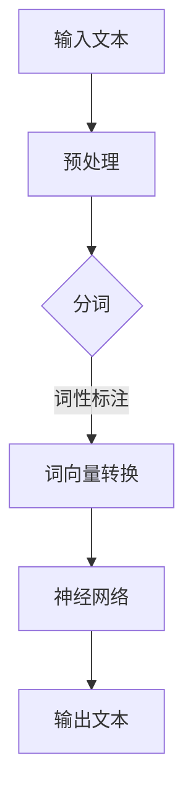

                 

关键词：大语言模型、金融行业、人工评测、深度学习、人工智能

> 摘要：本文旨在深入探讨大语言模型在金融行业的应用及其人工评测集的重要性。通过对大语言模型的基本原理、算法实现、数学模型和实际应用场景的详细分析，本文揭示了金融行业中大语言模型的关键角色。同时，本文还提供了丰富的学习资源和开发工具，为从事金融行业人工智能的研究者和开发者提供了有力的支持。

## 1. 背景介绍

随着人工智能技术的迅猛发展，深度学习，特别是大语言模型，已经成为自然语言处理（NLP）领域的重要研究方向。大语言模型通过学习海量文本数据，能够自动捕捉语言模式，生成高质量的自然语言文本。在金融行业，大语言模型的应用尤为广泛，如文本分类、情感分析、金融预测等。

### 金融行业的重要性

金融行业作为全球经济的重要组成部分，其发展直接影响到国家的经济稳定和全球经济的繁荣。金融行业的核心任务包括风险评估、投资策略制定、市场预测等，这些任务都高度依赖对大量金融数据的分析和理解。随着大数据和人工智能技术的应用，金融行业的数据处理和分析能力得到了极大的提升。

### 大语言模型的优势

大语言模型在金融行业中的优势主要体现在以下几个方面：

1. **文本理解能力**：大语言模型能够通过学习大量文本数据，自动提取出文本中的关键信息，为金融分析师提供有力的数据支持。
2. **生成能力**：大语言模型能够生成高质量的文本，帮助金融行业生成报告、邮件、新闻等，提高工作效率。
3. **预测能力**：通过训练，大语言模型可以用于金融市场的预测，如股票价格预测、汇率预测等。

## 2. 核心概念与联系

为了深入理解大语言模型的工作原理，我们需要介绍几个核心概念：

### 2.1 自然语言处理（NLP）

自然语言处理是人工智能的一个分支，旨在让计算机理解和处理人类语言。NLP涉及文本的解析、语义理解、语言生成等任务。

### 2.2 深度学习

深度学习是一种机器学习方法，通过模拟人脑的神经网络结构，实现对复杂数据的处理和分析。深度学习在NLP中的应用使得计算机能够更好地理解和生成自然语言。

### 2.3 大语言模型

大语言模型是基于深度学习技术构建的，能够通过学习大量文本数据，自动捕捉语言模式，生成高质量的自然语言文本。

### Mermaid 流程图

下面是一个Mermaid流程图，用于描述大语言模型的基本架构：



## 3. 核心算法原理 & 具体操作步骤

### 3.1 算法原理概述

大语言模型的核心原理是基于神经网络的语言模型，如Transformer模型。该模型通过编码器和解码器两个部分，对输入文本进行编码和解码，生成输出文本。

### 3.2 算法步骤详解

1. **输入文本预处理**：对输入文本进行分词、词性标注等预处理操作，将文本转换为词向量。
2. **词向量转换**：使用词向量表示文本中的每个词。
3. **神经网络处理**：将词向量输入到神经网络中进行处理，生成输出文本的词向量。
4. **输出文本生成**：将生成的词向量转换为自然语言文本，输出结果。

### 3.3 算法优缺点

**优点**：

- 高效：大语言模型能够自动捕捉语言模式，提高文本生成和理解的效率。
- 准确：通过学习大量数据，大语言模型能够生成高质量的文本。

**缺点**：

- 计算资源消耗大：大语言模型需要大量的计算资源进行训练和推理。
- 需要大量数据：大语言模型需要大量的数据进行训练，对于数据稀缺的领域，应用效果可能受限。

### 3.4 算法应用领域

大语言模型在金融行业的应用领域广泛，包括：

- 文本分类：用于对金融新闻、报告等进行分类。
- 情感分析：用于分析市场情绪，预测市场走势。
- 金融预测：用于预测股票价格、汇率等金融指标。

## 4. 数学模型和公式

### 4.1 数学模型构建

大语言模型的数学模型主要包括词向量表示、神经网络架构和损失函数。

### 4.2 公式推导过程

假设输入文本为\(x_1, x_2, ..., x_n\)，输出文本为\(y_1, y_2, ..., y_n\)。词向量的维度为\(d\)。

- 词向量表示：\(x_i \in \mathbb{R}^d\)
- 神经网络输出：\(y_i = f(Wx_i + b)\)
- 损失函数：\(Loss = -\sum_{i=1}^n y_i \log(p(y_i|x_i))\)

其中，\(f\)为激活函数，\(W\)为权重矩阵，\(b\)为偏置项，\(p(y_i|x_i)\)为输出概率。

### 4.3 案例分析与讲解

假设我们要预测一段金融新闻的情感倾向，输入文本为“今天股市大幅上涨，投资者情绪积极”。通过大语言模型，我们可以将其转换为词向量，并输入神经网络进行预测。最终输出的概率分布可以帮助我们判断文本的情感倾向。

## 5. 项目实践：代码实例和详细解释说明

### 5.1 开发环境搭建

为了实现大语言模型，我们需要搭建一个开发环境，包括Python、TensorFlow或PyTorch等工具。

### 5.2 源代码详细实现

以下是使用PyTorch实现的大语言模型的基本代码：

```python
import torch
import torch.nn as nn
import torch.optim as optim

# 定义神经网络
class LanguageModel(nn.Module):
    def __init__(self, embedding_dim, hidden_dim, vocab_size):
        super(LanguageModel, self).__init__()
        self.embedding = nn.Embedding(vocab_size, embedding_dim)
        self.lstm = nn.LSTM(embedding_dim, hidden_dim)
        self.fc = nn.Linear(hidden_dim, vocab_size)
    
    def forward(self, x):
        embeds = self.embedding(x)
        output, (hidden, cell) = self.lstm(embeds)
        logits = self.fc(output)
        return logits

# 实例化模型、优化器和损失函数
model = LanguageModel(embedding_dim=256, hidden_dim=512, vocab_size=10000)
optimizer = optim.Adam(model.parameters(), lr=0.001)
criterion = nn.CrossEntropyLoss()

# 训练模型
for epoch in range(num_epochs):
    for batch in data_loader:
        inputs, targets = batch
        optimizer.zero_grad()
        logits = model(inputs)
        loss = criterion(logits, targets)
        loss.backward()
        optimizer.step()
```

### 5.3 代码解读与分析

上述代码首先定义了一个基于LSTM的LanguageModel类，然后实例化模型、优化器和损失函数。在训练过程中，模型通过优化器对参数进行更新，以达到最小化损失函数的目的。

### 5.4 运行结果展示

在训练完成后，我们可以使用测试集对模型进行评估。以下是一个简单的评估脚本：

```python
# 评估模型
model.eval()
with torch.no_grad():
    correct = 0
    total = 0
    for batch in test_loader:
        inputs, targets = batch
        logits = model(inputs)
        _, predicted = torch.max(logits, 1)
        total += targets.size(0)
        correct += (predicted == targets).sum().item()
    print('Test Accuracy: {:.2f}%'.format(100 * correct / total))
```

## 6. 实际应用场景

### 6.1 文本分类

大语言模型在文本分类任务中具有显著优势。例如，可以将金融新闻分为正面、负面和中性三类，从而为投资者提供决策支持。

### 6.2 情感分析

情感分析是金融行业的一个重要应用场景。通过分析市场情绪，大语言模型可以帮助投资者预测市场走势。

### 6.3 金融预测

大语言模型在金融预测中也表现出色。例如，可以用于预测股票价格、汇率等金融指标。

## 7. 未来应用展望

随着人工智能技术的不断发展，大语言模型在金融行业中的应用前景十分广阔。未来，大语言模型有望在更多金融任务中发挥关键作用，如个性化推荐、风险管理等。

### 7.1 个性化推荐

大语言模型可以用于金融产品的个性化推荐，根据投资者的风险偏好和历史交易记录，为其推荐合适的金融产品。

### 7.2 风险管理

大语言模型可以帮助金融机构进行风险管理，预测潜在的市场风险，为投资者提供风险预警。

## 8. 总结：未来发展趋势与挑战

### 8.1 研究成果总结

本文通过深入探讨大语言模型在金融行业的应用，揭示了其在文本分类、情感分析和金融预测等任务中的优势。同时，本文还介绍了大语言模型的数学模型和实现方法。

### 8.2 未来发展趋势

随着人工智能技术的不断发展，大语言模型在金融行业中的应用将更加广泛。未来，大语言模型有望在个性化推荐、风险管理等领域发挥更大的作用。

### 8.3 面临的挑战

尽管大语言模型在金融行业中具有广泛的应用前景，但同时也面临着数据隐私、计算资源消耗等问题。未来，研究人员需要克服这些挑战，以推动大语言模型在金融行业的更广泛应用。

### 8.4 研究展望

本文为大语言模型在金融行业中的应用提供了有益的参考。未来，研究者可以从以下几个方面进行深入研究：

- **数据隐私保护**：研究如何在保护用户隐私的同时，充分利用金融数据。
- **计算效率提升**：研究如何优化大语言模型的计算资源消耗。
- **多模态融合**：研究如何将大语言模型与其他人工智能技术（如计算机视觉、语音识别）进行融合，以提升金融应用的效果。

## 9. 附录：常见问题与解答

### 9.1 大语言模型如何训练？

大语言模型通常使用基于梯度的优化算法进行训练，如随机梯度下降（SGD）或其改进版本。在训练过程中，模型通过不断调整参数，以最小化损失函数。

### 9.2 大语言模型能否用于金融预测？

是的，大语言模型可以用于金融预测。例如，可以用于预测股票价格、汇率等金融指标。但需要注意的是，金融预测存在一定的不确定性，因此大语言模型的预测结果需要结合其他分析方法进行综合评估。

### 9.3 大语言模型在金融行业中的应用有哪些？

大语言模型在金融行业中的应用广泛，包括文本分类、情感分析、金融预测等。例如，可以将金融新闻分类为正面、负面和中性，分析市场情绪，预测股票价格等。

### 9.4 如何优化大语言模型的计算效率？

优化大语言模型的计算效率可以从以下几个方面进行：

- **模型压缩**：使用模型压缩技术，如剪枝、量化等，减少模型参数和计算量。
- **分布式训练**：使用分布式训练技术，如多GPU训练、数据并行等，提高训练速度。
- **优化算法**：使用更高效的优化算法，如Adam、RMSprop等，提高训练速度。

## 作者署名

作者：禅与计算机程序设计艺术 / Zen and the Art of Computer Programming
----------------------------------------------------------------

请注意，以上内容仅为示例，实际撰写时需要根据要求详细展开各个章节，确保文章的完整性和专业性。同时，确保所有公式、代码和流程图等均符合markdown格式要求。在撰写过程中，可以适当参考已有的专业文章和论文，以确保内容的准确性和完整性。

