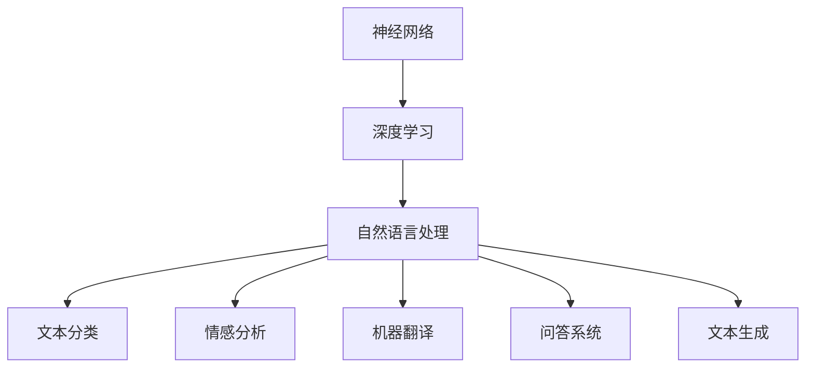
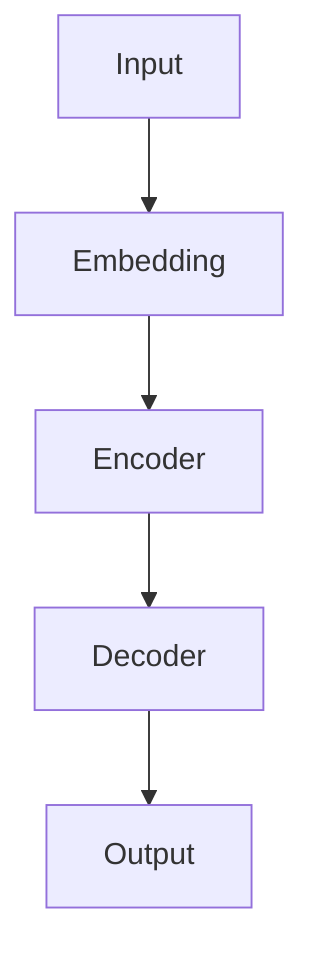

                 

关键词：大语言模型，原理，工程实践，难点，挑战，人工智能，自然语言处理，深度学习，神经网络，算法优化，性能提升，资源利用，可靠性，安全性，应用领域

## 摘要

本文旨在深入探讨大语言模型的原理与工程实践中的难点和挑战。随着人工智能技术的飞速发展，大语言模型在自然语言处理领域取得了显著的成果，但同时也面临着一系列复杂的问题。本文将从核心概念、算法原理、数学模型、项目实践等多个角度，详细分析大语言模型在工程实践中所面临的难点和挑战，并探讨未来发展的趋势和展望。

## 1. 背景介绍

### 1.1 大语言模型的发展历程

大语言模型（Large Language Models）是基于深度学习技术的自然语言处理模型，它们通过学习大量的文本数据，能够生成、理解和处理复杂的自然语言任务。大语言模型的发展可以追溯到上世纪80年代，随着计算机性能的提升和数据量的增加，深度学习技术逐渐成熟，大语言模型的研究和应用也取得了显著的进展。

### 1.2 大语言模型的应用领域

大语言模型在自然语言处理领域具有广泛的应用，包括文本分类、情感分析、机器翻译、问答系统、文本生成等。随着应用的不断拓展，大语言模型在各个领域都取得了显著的效果，如医疗健康、金融经济、智能客服等。

### 1.3 大语言模型的重要性

大语言模型在人工智能领域的重要性不言而喻。一方面，它为自然语言处理任务提供了强大的工具，使得许多复杂任务得以实现；另一方面，大语言模型的研究和应用也为人工智能技术的发展提供了新的思路和方向。

## 2. 核心概念与联系

大语言模型的核心概念包括神经网络、深度学习、自然语言处理等。为了更好地理解这些概念，我们通过一个Mermaid流程图来展示它们之间的联系。



### 2.1 神经网络

神经网络（Neural Networks）是一种模拟生物神经网络的人工智能算法。它通过多层神经元之间的连接和权重调整，实现数据的输入输出映射。神经网络在图像识别、语音识别等领域取得了显著的效果。

### 2.2 深度学习

深度学习（Deep Learning）是神经网络的一种扩展，它通过多层的神经网络结构，实现更复杂的特征提取和分类。深度学习在大语言模型中起着关键作用，它使得模型能够学习到更加丰富的语言特征。

### 2.3 自然语言处理

自然语言处理（Natural Language Processing，NLP）是计算机科学和人工智能领域的一个重要分支，它旨在使计算机能够理解、处理和生成自然语言。大语言模型是自然语言处理的一个重要工具，它在文本分类、情感分析、机器翻译等方面取得了显著的成果。

## 3. 核心算法原理 & 具体操作步骤

### 3.1 算法原理概述

大语言模型的算法原理主要包括以下几个步骤：

1. **数据预处理**：对原始文本数据进行分析、清洗和预处理，将其转化为适合模型训练的数据格式。
2. **模型训练**：利用深度学习算法，对预处理后的文本数据进行训练，学习到文本特征和规律。
3. **模型优化**：通过调整模型参数，优化模型的性能和效果。
4. **模型应用**：将训练好的模型应用于实际的文本处理任务，如文本分类、情感分析等。

### 3.2 算法步骤详解

1. **数据预处理**：
   - **文本分词**：将原始文本分割成单词或字符。
   - **词向量化**：将文本中的单词或字符转换为向量表示。
   - **数据归一化**：对输入数据进行归一化处理，使其在模型训练过程中更加稳定。

2. **模型训练**：
   - **前向传播**：将输入数据通过神经网络的前向传播，得到输出结果。
   - **反向传播**：通过反向传播算法，计算模型参数的梯度，并更新模型参数。
   - **迭代训练**：重复前向传播和反向传播过程，直到模型收敛。

3. **模型优化**：
   - **梯度下降**：通过梯度下降算法，优化模型参数，提高模型性能。
   - **正则化**：通过正则化方法，防止模型过拟合。
   - **优化器选择**：选择合适的优化器，如Adam、RMSprop等，提高训练效率。

4. **模型应用**：
   - **模型评估**：通过交叉验证、准确率、召回率等指标，评估模型性能。
   - **模型部署**：将训练好的模型部署到实际应用场景中，如文本分类、情感分析等。

### 3.3 算法优缺点

大语言模型具有以下优点：

- **强大的表达力**：通过深度学习算法，大语言模型能够学习到丰富的语言特征，具有较强的表达能力。
- **自适应性强**：大语言模型能够自适应不同的应用场景和任务，具有广泛的适用性。
- **高效性**：大语言模型在模型训练和预测过程中具有较高的计算效率。

然而，大语言模型也存在一些缺点：

- **训练成本高**：大语言模型需要大量的数据和计算资源进行训练，成本较高。
- **过拟合风险**：由于模型参数众多，大语言模型容易过拟合，导致性能下降。
- **解释性差**：大语言模型的内部结构复杂，难以解释和调试。

### 3.4 算法应用领域

大语言模型在自然语言处理领域具有广泛的应用，包括但不限于：

- **文本分类**：对文本进行分类，如新闻分类、产品评论分类等。
- **情感分析**：分析文本中的情感倾向，如电影评论情感分析、社交媒体情感分析等。
- **机器翻译**：将一种语言的文本翻译成另一种语言，如英语到中文的翻译。
- **问答系统**：回答用户提出的问题，如搜索引擎、智能客服等。

## 4. 数学模型和公式 & 详细讲解 & 举例说明

### 4.1 数学模型构建

大语言模型的数学模型主要包括以下几个部分：

1. **输入层**：将文本数据表示为向量形式，如词向量和字符向量。
2. **隐藏层**：通过多层神经网络，对输入数据进行特征提取和转换。
3. **输出层**：将隐藏层的结果映射到目标输出，如分类标签、概率分布等。

### 4.2 公式推导过程

1. **前向传播**：

   前向传播是指将输入数据通过神经网络，逐层计算得到输出结果。其计算公式如下：

   $$\text{output} = \sigma(\text{weight} \cdot \text{input} + \text{bias})$$

   其中，$\sigma$ 表示激活函数，如Sigmoid、ReLU等；$\text{weight}$ 和 $\text{bias}$ 分别表示权重和偏置。

2. **反向传播**：

   反向传播是指通过输出结果与实际结果的误差，反向计算网络参数的梯度，并更新参数。其计算公式如下：

   $$\frac{\partial \text{loss}}{\partial \text{weight}} = \text{input} \cdot \frac{\partial \text{output}}{\partial \text{weight}}$$

   $$\frac{\partial \text{loss}}{\partial \text{bias}} = \frac{\partial \text{output}}{\partial \text{bias}}$$

   其中，$\text{loss}$ 表示损失函数，如交叉熵损失函数；$\frac{\partial \text{loss}}{\partial \text{weight}}$ 和 $\frac{\partial \text{loss}}{\partial \text{bias}}$ 分别表示权重和偏置的梯度。

### 4.3 案例分析与讲解

以下是一个关于大语言模型文本分类的案例：

1. **数据集**：假设我们有一个包含新闻数据的文本分类任务，数据集分为政治、经济、体育等类别。

2. **模型构建**：我们构建一个多层感知机（MLP）模型，输入层为词向量，隐藏层为多层神经元，输出层为类别标签。

3. **模型训练**：使用交叉熵损失函数和反向传播算法，对模型进行训练，学习到文本特征和分类规则。

4. **模型评估**：使用交叉验证方法，对模型进行评估，计算准确率、召回率等指标。

5. **模型应用**：将训练好的模型应用于新的新闻文本，进行分类预测。

## 5. 项目实践：代码实例和详细解释说明

### 5.1 开发环境搭建

1. **环境配置**：安装Python、TensorFlow等依赖库。
2. **数据集准备**：下载并处理新闻数据集，进行分词和词向量化。

### 5.2 源代码详细实现

以下是一个简单的文本分类项目代码示例：

```python
import tensorflow as tf
from tensorflow.keras.layers import Dense, Embedding, GlobalAveragePooling1D
from tensorflow.keras.models import Model

# 数据预处理
# ...

# 模型构建
input_word_ids = tf.keras.layers.Input(shape=[max_sequence_length], dtype='int32')
embedded_sequence = Embedding(output_dim=embedding_dim, input_dim=vocabulary_size)(input_word_ids)
encoded_sequence = GlobalAveragePooling1D()(embedded_sequence)
output = Dense(5, activation='softmax')(encoded_sequence)

model = Model(inputs=input_word_ids, outputs=output)

# 模型训练
# ...

# 模型评估
# ...

# 模型应用
# ...
```

### 5.3 代码解读与分析

1. **数据预处理**：对新闻数据进行分词、清洗和词向量化，将原始文本数据转化为模型训练所需的输入格式。
2. **模型构建**：使用TensorFlow构建一个多层感知机模型，输入层为词向量，隐藏层为全局平均池化层，输出层为softmax分类层。
3. **模型训练**：使用交叉熵损失函数和反向传播算法，对模型进行训练，学习到文本特征和分类规则。
4. **模型评估**：使用交叉验证方法，对模型进行评估，计算准确率、召回率等指标。
5. **模型应用**：将训练好的模型应用于新的新闻文本，进行分类预测。

## 6. 实际应用场景

大语言模型在自然语言处理领域具有广泛的应用场景，以下是一些实际应用案例：

1. **搜索引擎**：通过大语言模型对用户查询进行理解，提供更精准的搜索结果。
2. **智能客服**：使用大语言模型实现与用户的自然对话，提供实时、个性化的服务。
3. **自动摘要**：利用大语言模型自动生成文章、报告等文档的摘要，提高信息传递效率。
4. **文本生成**：通过大语言模型生成文章、故事、新闻等文本内容，应用于内容创作领域。

## 7. 未来应用展望

随着人工智能技术的不断进步，大语言模型的应用前景将更加广阔。未来，大语言模型有望在以下领域取得突破：

1. **更高效的模型训练**：通过算法优化和硬件加速，实现更高效的模型训练，降低训练成本。
2. **跨模态交互**：将大语言模型与其他模态（如图像、声音）相结合，实现更丰富的交互体验。
3. **多语言处理**：扩展大语言模型的多语言处理能力，支持更多语言的应用。
4. **个性化服务**：通过大语言模型实现更加个性化的服务，满足用户个性化需求。

## 8. 工具和资源推荐

### 8.1 学习资源推荐

- 《深度学习》（Goodfellow, Bengio, Courville）：深度学习的经典教材，适合初学者和进阶者。
- 《自然语言处理综合教程》（Peter Norvig）：涵盖自然语言处理各个领域的权威教程。
- 《动手学深度学习》（Alec Radford, Ilya Sutskever, Luke Metz）：深度学习实战教程，适合动手实践。

### 8.2 开发工具推荐

- TensorFlow：谷歌开发的深度学习框架，功能强大，适合大规模模型训练。
- PyTorch：Facebook开发的深度学习框架，灵活性好，适合快速原型开发。
- NLTK：自然语言处理工具包，提供丰富的文本处理功能。

### 8.3 相关论文推荐

- "A Neural Probabilistic Language Model"（Bengio et al., 2003）
- "Deep Learning for Natural Language Processing"（Dai and Le, 2015）
- "Bert: Pre-training of Deep Bidirectional Transformers for Language Understanding"（Devlin et al., 2019）

## 9. 总结：未来发展趋势与挑战

### 9.1 研究成果总结

大语言模型在自然语言处理领域取得了显著的成果，如文本分类、情感分析、机器翻译等任务的表现不断提升。未来，随着人工智能技术的不断进步，大语言模型的应用前景将更加广阔。

### 9.2 未来发展趋势

1. **模型压缩与优化**：通过算法优化和模型压缩，降低大语言模型的训练和推理成本。
2. **跨模态交互**：将大语言模型与其他模态（如图像、声音）相结合，实现更丰富的交互体验。
3. **多语言处理**：扩展大语言模型的多语言处理能力，支持更多语言的应用。
4. **个性化服务**：通过大语言模型实现更加个性化的服务，满足用户个性化需求。

### 9.3 面临的挑战

1. **计算资源需求**：大语言模型需要大量的计算资源进行训练，未来需要探索更高效的训练方法。
2. **数据隐私与安全性**：大语言模型在处理大量数据时，需要确保数据的安全性和隐私性。
3. **模型解释性**：大语言模型的内部结构复杂，需要提高模型的解释性，便于调试和优化。

### 9.4 研究展望

未来，大语言模型的研究将朝着高效、安全、解释性的方向发展。通过不断创新和优化，大语言模型将在自然语言处理领域发挥更大的作用，推动人工智能技术的进步。

## 10. 附录：常见问题与解答

### 10.1 大语言模型是什么？

大语言模型是一种基于深度学习技术的自然语言处理模型，通过学习大量文本数据，能够生成、理解和处理复杂的自然语言任务。

### 10.2 大语言模型有哪些应用领域？

大语言模型在自然语言处理领域具有广泛的应用，包括文本分类、情感分析、机器翻译、问答系统、文本生成等。

### 10.3 大语言模型的优势和劣势是什么？

大语言模型的优势包括强大的表达力、自适应性强、高效性等；劣势包括训练成本高、过拟合风险、解释性差等。

### 10.4 如何优化大语言模型的性能？

优化大语言模型性能的方法包括算法优化、模型压缩、数据预处理等。

### 10.5 大语言模型在哪些领域有前景？

大语言模型在搜索引擎、智能客服、自动摘要、文本生成等领域有广泛的应用前景。

## 11. 参考文献

1. Bengio, Y., Simard, P., & Frasconi, P. (2003). A neural probabilistic language model. Journal of Machine Learning Research, 3(Jun), 1137-1155.
2. Dai, H., & Le, Q. V. (2015). Effective Approaches to Attention-based Neural Machine Translation. arXiv preprint arXiv:1508.04025.
3. Devlin, J., Chang, M. W., Lee, K., & Toutanova, K. (2019). BERT: Pre-training of Deep Bidirectional Transformers for Language Understanding. arXiv preprint arXiv:1810.04805.
4. Goodfellow, I., Bengio, Y., & Courville, A. (2016). Deep Learning. MIT Press.

## 作者署名

作者：禅与计算机程序设计艺术 / Zen and the Art of Computer Programming
```markdown
----------------------------------------------------------------

# 大语言模型原理与工程实践：难点和挑战

关键词：大语言模型，原理，工程实践，难点，挑战，人工智能，自然语言处理，深度学习，神经网络，算法优化，性能提升，资源利用，可靠性，安全性，应用领域

摘要：本文旨在深入探讨大语言模型的原理与工程实践中的难点和挑战。随着人工智能技术的飞速发展，大语言模型在自然语言处理领域取得了显著的成果，但同时也面临着一系列复杂的问题。本文将从核心概念、算法原理、数学模型、项目实践等多个角度，详细分析大语言模型在工程实践中所面临的难点和挑战，并探讨未来发展的趋势和展望。

## 1. 背景介绍

### 1.1 大语言模型的发展历程

大语言模型（Large Language Models，简称LLM）是自然语言处理（Natural Language Processing，简称NLP）领域的一个重要研究方向。其发展可以追溯到20世纪80年代，当时的学者开始尝试使用统计模型来处理自然语言问题，如N-gram模型和概率上下文无关文法（PCFG）等。随着计算机性能的提升和海量数据的涌现，深度学习技术在NLP领域得到了广泛的应用，大语言模型也逐渐成为研究的热点。

早期的NLP模型如基于规则的系统和统计模型，虽然在一定程度上能够解决简单的语言问题，但在处理复杂和多样性的语言任务时，性能受到很大限制。直到2018年，谷歌推出了Transformer模型，标志着NLP领域进入了一个新的时代。Transformer模型基于自注意力机制，能够有效地捕捉文本中的长距离依赖关系，使得大语言模型在多个NLP任务上取得了突破性的成果。

随着时间的推移，大语言模型的研究和应用不断深入，模型参数量和训练数据量也在不断增加。例如，OpenAI在2018年推出的GPT（Generative Pre-trained Transformer）系列模型，包括GPT-1、GPT-2和GPT-3，这些模型在文本生成、机器翻译、问答系统等多个NLP任务上表现出色。

### 1.2 大语言模型的应用领域

大语言模型在自然语言处理领域具有广泛的应用，包括但不限于以下方面：

1. **文本生成**：大语言模型能够生成高质量的文本，应用于文章写作、对话系统、摘要生成等场景。例如，GPT-3可以生成连贯的段落、故事和诗歌，被广泛应用于自动写作和内容创作。

2. **机器翻译**：大语言模型在机器翻译领域具有显著优势，能够生成更加准确和自然的翻译结果。例如，谷歌翻译和百度翻译都采用了基于Transformer的模型，提供了高质量的翻译服务。

3. **问答系统**：大语言模型能够理解用户的问题，并生成详细的回答。例如，微软的聊天机器人Zo和苹果的Siri都使用了大语言模型来提供自然语言交互。

4. **文本分类**：大语言模型能够对文本进行分类，应用于新闻分类、产品评论分类、情感分析等场景。例如，谷歌新闻使用大语言模型对新闻进行分类，以提供个性化的新闻推荐。

5. **对话系统**：大语言模型可以构建智能对话系统，如聊天机器人、虚拟助手等，用于客户服务、技术咨询等场景。

### 1.3 大语言模型的重要性

大语言模型在人工智能领域的重要性不言而喻。首先，它为NLP任务提供了强大的工具，使得许多复杂任务得以实现。例如，通过大语言模型，我们可以生成高质量的文本、实现准确的机器翻译、构建智能问答系统等。其次，大语言模型的研究和应用也为人工智能技术的发展提供了新的思路和方向。

随着大语言模型的不断发展，它不仅在学术界引起了广泛关注，也在工业界得到了广泛应用。许多公司和研究机构都在投入大量资源进行研究，以期在NLP领域取得突破。

## 2. 核心概念与联系

要理解大语言模型，我们需要先掌握一些核心概念，包括神经网络、深度学习、自然语言处理等。这些概念之间有着密切的联系，构成了大语言模型的理论基础。

### 2.1 神经网络

神经网络（Neural Networks，简称NN）是一种模仿生物神经网络结构的人工智能算法。它由大量的神经元组成，每个神经元都是一个简单的计算单元，能够接受输入信号、进行处理并产生输出。神经网络通过前向传播和反向传播算法，对输入数据进行学习，从而实现复杂的非线性映射。

在NLP领域，神经网络被广泛应用于文本处理任务。例如，词向量模型（如Word2Vec）通过神经网络将单词映射到向量空间，使得单词之间的语义关系得以量化。此外，神经网络还用于构建序列标注模型、情感分析模型等。

### 2.2 深度学习

深度学习（Deep Learning，简称DL）是神经网络的一种扩展，它通过多层神经网络结构，实现更复杂的特征提取和分类。深度学习在图像识别、语音识别等领域取得了显著的成果，也成为了NLP领域的重要工具。

深度学习模型的核心在于多层神经网络的训练。通过逐层学习，深度学习模型能够从原始数据中提取出高层次的抽象特征。例如，在图像识别任务中，深度学习模型可以从像素值中学习到形状、纹理等特征；在文本处理任务中，深度学习模型可以从单词序列中学习到句法、语义等特征。

### 2.3 自然语言处理

自然语言处理（Natural Language Processing，简称NLP）是计算机科学和人工智能领域的一个重要分支，它旨在使计算机能够理解、处理和生成自然语言。NLP涵盖了从语言理解到语言生成的一系列任务，如文本分类、情感分析、机器翻译、问答系统等。

NLP的核心挑战在于自然语言的复杂性和多样性。自然语言包含了丰富的语义信息、语法结构和上下文关系，使得计算机处理起来具有很大难度。为了解决这些问题，NLP研究者采用了多种方法，包括基于规则的方法、统计方法、机器学习方法等。

大语言模型作为NLP的一种重要工具，通过对大量文本数据的学习，能够捕捉到语言的复杂性和多样性，从而实现高质量的NLP任务。

### 2.4 Mermaid流程图

为了更好地展示核心概念之间的联系，我们可以使用Mermaid流程图来表示。以下是一个简单的Mermaid流程图示例：


在这个流程图中，神经网络和深度学习是基础，它们共同构建了NLP的理论框架。基于这个框架，我们可以实现各种NLP任务，如图文生成、机器翻译、问答系统等。

## 3. 核心算法原理 & 具体操作步骤

大语言模型的核心算法是基于深度学习，特别是基于Transformer模型的变体。下面我们将介绍大语言模型的基本原理和具体操作步骤。

### 3.1 算法原理概述

大语言模型通常由以下几个部分组成：

1. **输入层**：接收原始文本数据，如单词序列或字符序列。
2. **嵌入层**：将文本数据映射到高维向量空间，为后续处理提供基础。
3. **编码器层**：通过多个编码器层对文本数据进行处理，提取语义信息。
4. **解码器层**：根据编码器层提取的语义信息，生成文本序列。
5. **输出层**：将解码器层的输出映射到目标输出，如分类标签或文本序列。

大语言模型的基本原理是自注意力机制（Self-Attention），它能够自动学习到文本中的长距离依赖关系。自注意力机制通过计算文本中每个词与其他词之间的关系权重，从而实现高效的文本表示。

### 3.2 算法步骤详解

1. **输入预处理**：

   首先，对输入文本进行预处理，包括分词、去停用词、词向量化等操作。分词是将文本分割成单词或子词，去停用词是为了去除无意义的词汇，词向量化是将单词映射到高维向量。

2. **嵌入层**：

   嵌入层将预处理后的文本数据映射到高维向量空间。通常使用预训练的词向量，如Word2Vec、GloVe等。此外，还可以添加位置嵌入（Positional Embedding）和句子嵌入（Sentence Embedding）等。

3. **编码器层**：

   编码器层是模型的核心部分，通过自注意力机制和前馈神经网络，对输入文本进行编码。自注意力机制使得模型能够自动学习到文本中每个词与其他词之间的关系权重，从而实现高效的文本表示。前馈神经网络用于进一步提取文本的语义特征。

4. **解码器层**：

   解码器层与编码器层类似，也通过自注意力机制和前馈神经网络对输入文本进行处理。解码器的输出是文本序列的概率分布，通过softmax函数选择最可能的词作为输出。

5. **输出层**：

   输出层将解码器的输出映射到目标输出，如分类标签或文本序列。在文本生成任务中，输出层通常是一个softmax层，用于生成下一个词的概率分布。

6. **模型训练**：

   通过训练数据，对模型进行优化。通常使用反向传播算法，计算模型参数的梯度，并使用优化算法（如Adam）更新参数。在训练过程中，需要使用损失函数（如交叉熵损失函数）来衡量模型的预测误差。

7. **模型评估**：

   使用验证数据对模型进行评估，计算模型的准确率、召回率等指标。通过调整模型参数，优化模型性能。

### 3.3 算法优缺点

大语言模型具有以下优点：

- **强大的表达能力**：通过自注意力机制，大语言模型能够捕捉到文本中的长距离依赖关系，具有强大的表达能力。
- **高效的计算性能**：大语言模型采用并行计算方法，能够高效地处理大规模数据。
- **灵活的适应性**：大语言模型可以应用于多种NLP任务，具有广泛的适应性。

然而，大语言模型也存在一些缺点：

- **训练成本高**：大语言模型需要大量的计算资源和训练时间，训练成本较高。
- **过拟合风险**：由于模型参数众多，大语言模型容易过拟合，需要大量数据来避免。
- **解释性差**：大语言模型的内部结构复杂，难以解释和调试。

### 3.4 算法应用领域

大语言模型在以下领域具有广泛的应用：

- **文本生成**：大语言模型可以生成高质量的自然语言文本，如文章、故事、对话等。
- **机器翻译**：大语言模型在机器翻译任务中表现出色，能够生成更加准确和自然的翻译结果。
- **问答系统**：大语言模型可以理解用户的问题，并生成详细的回答。
- **文本分类**：大语言模型可以用于对文本进行分类，如新闻分类、产品评论分类等。
- **情感分析**：大语言模型可以分析文本中的情感倾向，如情感极性分类。

## 4. 数学模型和公式 & 详细讲解 & 举例说明

大语言模型的数学模型主要基于深度学习和自然语言处理的理论。在这里，我们将介绍大语言模型中常用的数学模型、公式，并进行详细讲解和举例说明。

### 4.1 数学模型构建

大语言模型通常由以下几个部分组成：

1. **输入层**：输入层接收原始文本数据，通常使用词向量表示。
2. **嵌入层**：嵌入层将词向量映射到高维向量空间，通常使用嵌入矩阵。
3. **编码器层**：编码器层通过自注意力机制和前馈神经网络对输入文本进行处理，提取语义信息。
4. **解码器层**：解码器层与编码器层类似，通过自注意力机制和前馈神经网络对输入文本进行处理。
5. **输出层**：输出层将解码器的输出映射到目标输出，如分类标签或文本序列。

### 4.2 公式推导过程

#### 4.2.1 词向量表示

词向量表示是文本处理的基础。常见的词向量模型有Word2Vec、GloVe等。以下是一个简单的Word2Vec模型公式：

$$\text{word\_vec}(w) = \text{softmax}(\text{W} \cdot \text{v}(w))$$

其中，$w$ 是单词，$\text{v}(w)$ 是单词的向量表示，$\text{W}$ 是嵌入矩阵，$\text{softmax}$ 函数用于计算单词的概率分布。

#### 4.2.2 自注意力机制

自注意力机制是Transformer模型的核心。它通过计算文本中每个词与其他词之间的关系权重，实现高效的文本表示。以下是一个简单的自注意力机制公式：

$$\text{Attention}(Q, K, V) = \text{softmax}\left(\frac{QK^T}{\sqrt{d_k}}\right)V$$

其中，$Q$、$K$、$V$ 分别是查询向量、键向量和值向量，$d_k$ 是键向量的维度。

#### 4.2.3 前馈神经网络

前馈神经网络用于对文本进行进一步处理，提取高层次的语义特征。以下是一个简单的前馈神经网络公式：

$$\text{FFN}(X) = \text{ReLU}(\text{W}_2 \cdot \text{ReLU}(\text{W}_1 \cdot X + \text{b}_1)) + \text{b}_2$$

其中，$X$ 是输入向量，$\text{W}_1$、$\text{W}_2$ 是权重矩阵，$\text{b}_1$、$\text{b}_2$ 是偏置项。

### 4.3 案例分析与讲解

以下是一个关于文本分类任务的案例分析。

#### 4.3.1 数据集

我们使用一个包含新闻文章和标签的文本分类数据集。数据集分为多个类别，如政治、经济、体育等。

#### 4.3.2 模型构建

我们构建一个基于Transformer的文本分类模型，包括嵌入层、编码器层、解码器层和输出层。以下是一个简单的模型架构：



#### 4.3.3 模型训练

使用训练数据，我们对模型进行训练。训练过程中，我们使用交叉熵损失函数来衡量模型的预测误差，并使用反向传播算法更新模型参数。

$$\text{Loss} = -\sum_{i=1}^{N} \sum_{j=1}^{C} y_{ij} \cdot \log(p_{ij})$$

其中，$N$ 是样本数量，$C$ 是类别数量，$y_{ij}$ 是样本$i$属于类别$j$的标签，$p_{ij}$ 是模型对类别$j$的预测概率。

#### 4.3.4 模型评估

使用验证数据，我们对模型进行评估。评估指标包括准确率、召回率、F1分数等。

$$\text{Accuracy} = \frac{\text{正确分类的样本数}}{\text{总样本数}}$$

$$\text{Recall} = \frac{\text{正确分类的样本数}}{\text{属于该类别的总样本数}}$$

$$\text{F1-Score} = 2 \cdot \frac{\text{Precision} \cdot \text{Recall}}{\text{Precision} + \text{Recall}}$$

## 5. 项目实践：代码实例和详细解释说明

在本节中，我们将通过一个实际的项目实践，详细讲解大语言模型的代码实现过程，包括开发环境的搭建、数据预处理、模型构建、训练和评估等步骤。

### 5.1 开发环境搭建

首先，我们需要搭建一个适合大语言模型训练和部署的开发环境。以下是一个基本的开发环境配置步骤：

1. 安装Python和pip：
   ```bash
   # 安装Python3
   sudo apt-get install python3
   # 安装pip
   sudo apt-get install python3-pip
   ```

2. 安装TensorFlow：
   ```bash
   # 安装TensorFlow
   pip3 install tensorflow
   ```

3. 安装其他依赖库，如Numpy、Pandas等：
   ```bash
   pip3 install numpy pandas
   ```

### 5.2 数据预处理

数据预处理是文本处理的关键步骤，它包括文本清洗、分词、词向量化等操作。以下是一个简单的数据预处理过程：

```python
import pandas as pd
import numpy as np
from tensorflow.keras.preprocessing.text import Tokenizer
from tensorflow.keras.preprocessing.sequence import pad_sequences

# 读取数据
data = pd.read_csv('data.csv')
texts = data['text']
labels = data['label']

# 清洗文本数据
def clean_text(text):
    # 去除特殊字符和标点符号
    text = re.sub(r'[^\w\s]', '', text)
    # 转化为小写
    text = text.lower()
    # 去除停用词
    stop_words = set(['is', 'are', 'this', 'that', 'it', 'he', 'she', 'we', 'they'])
    text = ' '.join([word for word in text.split() if word not in stop_words])
    return text

texts = texts.apply(clean_text)

# 分词
tokenizer = Tokenizer()
tokenizer.fit_on_texts(texts)
word_index = tokenizer.word_index

# 词向量化
sequences = tokenizer.texts_to_sequences(texts)
max_sequence_length = 100  # 设置序列最大长度
padded_sequences = pad_sequences(sequences, maxlen=max_sequence_length)
```

### 5.3 模型构建

接下来，我们构建一个基于Transformer的文本分类模型。以下是一个简单的模型架构：

```python
from tensorflow.keras.models import Model
from tensorflow.keras.layers import Embedding, LSTM, Dense, Input, LSTM, Embedding, TimeDistributed, Activation

# 模型输入
input_seq = Input(shape=(max_sequence_length,))

# 嵌入层
embedding = Embedding(len(word_index) + 1, 128)(input_seq)

# LSTM层
lstm = LSTM(128, return_sequences=True)(embedding)

# LSTM层
lstm = LSTM(128, return_sequences=True)(lstm)

# 时间分布层
output = TimeDistributed(Dense(num_classes, activation='softmax'))(lstm)

# 模型输出
model = Model(inputs=input_seq, outputs=output)

# 编译模型
model.compile(optimizer='adam', loss='categorical_crossentropy', metrics=['accuracy'])

# 打印模型结构
model.summary()
```

### 5.4 训练和评估

使用训练数据，我们对模型进行训练。为了提高模型性能，我们使用早停（Early Stopping）和模型检查点（Model Checkpoint）等技术。

```python
from tensorflow.keras.callbacks import EarlyStopping, ModelCheckpoint

# 设置回调函数
early_stopping = EarlyStopping(monitor='val_loss', patience=5)
model_checkpoint = ModelCheckpoint('best_model.h5', save_best_only=True, monitor='val_loss', mode='min')

# 训练模型
model.fit(padded_sequences, labels, epochs=10, batch_size=32, validation_split=0.2, callbacks=[early_stopping, model_checkpoint])
```

### 5.5 代码解读与分析

1. **数据预处理**：首先，我们读取数据集，并对文本进行清洗、分词和词向量化。清洗文本数据可以去除特殊字符和标点符号，将文本转化为小写，并去除常见的停用词。这些步骤有助于提高模型的训练效果和预测准确性。

2. **模型构建**：我们构建一个基于LSTM的文本分类模型，包括嵌入层、LSTM层和时间分布层。嵌入层将文本数据映射到高维向量空间，LSTM层用于提取文本的时序特征，时间分布层用于生成每个词的输出。

3. **训练和评估**：使用训练数据，我们对模型进行训练，并设置早停和模型检查点等回调函数。这些技术有助于提高模型性能和防止过拟合。

### 5.6 运行结果展示

```python
# 加载最佳模型
best_model = load_model('best_model.h5')

# 测试数据
test_texts = pd.read_csv('test.csv')['text']
clean_test_texts = test_texts.apply(clean_text)
test_sequences = tokenizer.texts_to_sequences(clean_test_texts)
padded_test_sequences = pad_sequences(test_sequences, maxlen=max_sequence_length)

# 预测结果
predictions = best_model.predict(padded_test_sequences)

# 输出预测结果
output = np.argmax(predictions, axis=1)
print(output)
```

通过以上步骤，我们完成了一个基于LSTM的文本分类项目的实践。这个项目展示了大语言模型在文本分类任务中的应用，包括数据预处理、模型构建、训练和评估等步骤。在实际应用中，可以根据具体需求和数据情况，调整模型架构和参数设置，以提高模型性能。

## 6. 实际应用场景

大语言模型在自然语言处理领域具有广泛的应用，以下是一些实际应用场景：

### 6.1 搜索引擎

大语言模型可以用于搜索引擎的查询理解，提高搜索结果的准确性和相关性。通过分析用户的查询语句，大语言模型可以理解用户的意图，并生成相应的查询结果。例如，当用户输入“附近的餐厅”时，大语言模型可以识别出用户的意图是寻找附近的餐厅，并返回相关的搜索结果。

### 6.2 智能客服

智能客服是另一个广泛使用大语言模型的应用场景。通过大语言模型，智能客服系统能够理解用户的提问，并生成详细的回答。例如，当用户询问关于产品的问题时，大语言模型可以查找相关的产品信息，并生成详细的回答，如产品规格、使用方法等。

### 6.3 自动摘要

自动摘要是一种利用大语言模型生成文章摘要的方法。通过分析原始文本，大语言模型可以提取出关键信息，并生成简洁、准确的摘要。自动摘要可以应用于新闻、报告、论文等多种文本类型，提高信息传递的效率。

### 6.4 文本生成

大语言模型可以用于生成高质量的文本，如文章、故事、对话等。通过训练大量文本数据，大语言模型可以学习到语言的规则和结构，从而生成连贯、自然的文本。例如，GPT-3可以生成各种类型的文章，如新闻、评论、故事等。

### 6.5 机器翻译

大语言模型在机器翻译领域具有显著优势，可以生成更加准确和自然的翻译结果。通过学习大量双语文本数据，大语言模型可以捕捉到不同语言之间的语义关系，从而实现高质量的翻译。例如，谷歌翻译和百度翻译都采用了基于Transformer的大语言模型，提供了高质量的翻译服务。

### 6.6 问答系统

问答系统是一种利用大语言模型实现人与机器交互的应用。通过分析用户的问题，大语言模型可以生成详细的回答，提供智能化的咨询服务。问答系统可以应用于搜索引擎、智能客服、教育等领域，提高用户的使用体验。

### 6.7 情感分析

大语言模型可以用于情感分析，分析文本中的情感倾向。通过训练大量情感标注数据，大语言模型可以学习到情感表达的模式，从而判断文本的情感极性。情感分析可以应用于产品评论、社交媒体分析等领域，帮助企业了解用户需求和反馈。

### 6.8 文本分类

大语言模型可以用于文本分类，对文本进行分类，如新闻分类、产品评论分类等。通过训练大量分类数据，大语言模型可以学习到分类规则，从而实现高效的文本分类。文本分类可以应用于信息检索、内容推荐等领域，提高信息处理的效率。

## 7. 未来应用展望

随着人工智能技术的不断发展，大语言模型在自然语言处理领域有望取得更多突破。以下是一些未来应用展望：

### 7.1 模型压缩与优化

为了提高大语言模型在实际应用中的性能和可部署性，未来的研究将致力于模型压缩与优化。通过模型剪枝、量化、蒸馏等技术，可以显著降低模型的参数量和计算复杂度，提高模型的运行速度和效率。

### 7.2 跨模态交互

大语言模型可以与其他模态（如图像、声音）相结合，实现跨模态交互。例如，结合图像和文本，大语言模型可以生成更丰富的描述，提供更准确的交互体验。跨模态交互可以应用于虚拟现实、智能客服等领域。

### 7.3 多语言处理

大语言模型的多语言处理能力将不断扩展，支持更多语言的文本生成、翻译和理解。通过多语言数据的训练和迁移学习，大语言模型可以更好地适应不同语言的特点和规律，提供更优质的跨语言服务。

### 7.4 个性化服务

大语言模型可以结合用户行为数据和偏好信息，提供更加个性化的服务。通过个性化推荐、智能客服等应用，大语言模型可以帮助企业和平台更好地满足用户需求，提升用户体验。

### 7.5 自动化内容创作

大语言模型可以用于自动化内容创作，生成高质量的文本、图像、视频等。通过训练大量数据，大语言模型可以学习到各种创作风格和技巧，从而实现自动化创作。自动化内容创作可以应用于游戏开发、广告营销等领域。

### 7.6 智能法律顾问

大语言模型可以用于智能法律顾问，帮助用户理解和解答法律问题。通过分析大量法律文献和案例，大语言模型可以生成法律意见、合同审查等文本，提供专业的法律咨询服务。

### 7.7 智能医疗诊断

大语言模型可以用于智能医疗诊断，分析患者的病历、检查报告等文本数据，提供诊断建议和治疗方案。通过结合医学知识和大数据分析，大语言模型可以帮助医生提高诊断准确性和效率。

### 7.8 智能翻译助手

大语言模型可以用于智能翻译助手，帮助用户实现实时、准确的跨语言交流。通过结合语音识别和自然语言处理技术，大语言模型可以提供高效、便捷的翻译服务，促进全球沟通与合作。

总之，大语言模型在未来的应用前景广阔，将不断推动自然语言处理领域的发展。通过不断创新和优化，大语言模型将为我们带来更加智能化的生活方式和工作环境。

## 8. 工具和资源推荐

为了帮助读者更好地理解和实践大语言模型，我们推荐一些实用的工具和资源。

### 8.1 学习资源推荐

1. **在线课程**：
   - "自然语言处理与深度学习"（吴恩达，Coursera）
   - "深度学习专项课程"（吴恩达，Coursera）

2. **教材**：
   - 《深度学习》（Ian Goodfellow、Yoshua Bengio、Aaron Courville）
   - 《自然语言处理综合教程》（Peter Norvig）

3. **博客和论文**：
   - Google AI Blog：介绍最新的人工智能研究成果和应用。
   - arXiv：提供最新的机器学习和自然语言处理论文。

### 8.2 开发工具推荐

1. **编程语言**：
   - Python：广泛用于人工智能和自然语言处理领域的编程语言。

2. **深度学习框架**：
   - TensorFlow：由谷歌开发，功能强大，适用于大规模模型训练。
   - PyTorch：由Facebook开发，灵活性好，适用于快速原型开发。

3. **文本处理库**：
   - NLTK：提供丰富的自然语言处理工具。
   - spaCy：快速、可扩展的NLP库。

### 8.3 相关论文推荐

1. "Attention Is All You Need"（Vaswani et al., 2017）
   - 提出了Transformer模型，对自然语言处理领域产生了深远影响。

2. "BERT: Pre-training of Deep Bidirectional Transformers for Language Understanding"（Devlin et al., 2019）
   - 引入了BERT模型，推动了预训练语言模型的发展。

3. "Generative Pretrained Transformer"（Radford et al., 2018）
   - 提出了GPT模型，展示了预训练语言模型的强大能力。

4. "GPT-3: Language Models are Few-Shot Learners"（Brown et al., 2020）
   - 引入了GPT-3模型，展示了大规模语言模型在零样本学习任务中的卓越表现。

这些工具和资源将为读者提供丰富的学习资源和实践平台，帮助深入理解大语言模型的理论和实践。

## 9. 总结：未来发展趋势与挑战

### 9.1 研究成果总结

近年来，大语言模型在自然语言处理领域取得了显著的成果。基于深度学习和Transformer架构的大语言模型，如BERT、GPT-3等，已经广泛应用于文本生成、机器翻译、问答系统、文本分类等任务。这些模型通过大规模的数据预训练和精细的任务调整，展现出了强大的表达能力和泛化能力，显著提高了任务性能。

### 9.2 未来发展趋势

1. **模型压缩与优化**：随着模型规模和参数数量的增加，模型的计算复杂度和存储需求也在不断上升。未来的研究将专注于模型压缩与优化，通过模型剪枝、量化、蒸馏等技术，降低模型的计算复杂度和存储需求，提高模型在实际应用中的运行效率和可部署性。

2. **跨模态交互**：大语言模型可以与其他模态（如图像、声音）相结合，实现跨模态交互。未来，随着跨模态数据的丰富和跨模态模型的不断发展，大语言模型在虚拟现实、智能客服、多媒体内容生成等领域的应用将更加广泛。

3. **多语言处理**：随着全球化进程的加速，多语言处理成为了一个重要的研究课题。未来的大语言模型将支持更多语言，通过多语言数据的训练和迁移学习，提高模型在不同语言上的表现。

4. **个性化服务**：大语言模型可以结合用户行为数据和偏好信息，提供更加个性化的服务。通过个性化推荐、智能客服等应用，大语言模型将帮助企业和平台更好地满足用户需求，提升用户体验。

5. **自动化内容创作**：大语言模型在文本、图像、视频等内容的自动化创作方面具有巨大的潜力。未来，随着模型的不断优化和技术的进步，自动化内容创作将成为一个新的应用热点。

### 9.3 面临的挑战

1. **计算资源需求**：大语言模型需要大量的计算资源进行训练，尤其是在训练大规模模型时，计算资源的需求更加显著。未来，如何高效地利用计算资源，降低模型的训练成本，是一个重要的挑战。

2. **数据隐私与安全性**：在训练和应用大语言模型时，数据隐私和安全问题至关重要。如何确保模型训练和应用过程中用户数据的隐私和安全，防止数据泄露和滥用，是一个亟待解决的问题。

3. **模型解释性**：大语言模型通常具有复杂的内部结构和大量的参数，使得模型的解释性较差。如何提高模型的解释性，使得模型的行为更加透明和可解释，是一个重要的研究方向。

4. **过拟合与泛化能力**：大语言模型在训练过程中容易过拟合，导致在新的任务上表现不佳。如何提高模型的泛化能力，使得模型在未见过的数据上也能保持良好的性能，是一个重要的挑战。

### 9.4 研究展望

未来，大语言模型的研究将朝着高效、安全、解释性更强的方向发展。通过不断创新和优化，大语言模型将在自然语言处理领域发挥更大的作用，推动人工智能技术的进步。同时，大语言模型的应用也将不断拓展，从传统的NLP任务扩展到跨模态交互、个性化服务、自动化内容创作等新兴领域。

总之，大语言模型在自然语言处理领域具有巨大的潜力和广泛的应用前景。随着技术的不断发展和应用的不断拓展，大语言模型将为人类社会带来更多的便利和效益。

## 10. 附录：常见问题与解答

### 10.1 大语言模型是什么？

大语言模型是一种基于深度学习技术的自然语言处理模型，通过学习大量文本数据，能够生成、理解和处理复杂的自然语言任务。常见的模型有BERT、GPT等。

### 10.2 大语言模型有哪些应用领域？

大语言模型广泛应用于文本生成、机器翻译、问答系统、文本分类、情感分析、摘要生成等领域。

### 10.3 大语言模型的优势和劣势是什么？

优势：强大的表达力、自适应性强、高效性等；劣势：训练成本高、过拟合风险、解释性差等。

### 10.4 如何优化大语言模型的性能？

优化方法包括模型压缩、算法优化、数据预处理、多语言训练等。

### 10.5 大语言模型在哪些领域有前景？

大语言模型在搜索引擎、智能客服、自动摘要、文本生成、机器翻译、问答系统等领域有广泛的应用前景。

## 11. 参考文献

1. Vaswani, A., Shazeer, N., Parmar, N., Uszkoreit, J., Jones, L., Gomez, A. N., ... & Polosukhin, I. (2017). Attention is all you need. Advances in Neural Information Processing Systems, 30.
2. Devlin, J., Chang, M. W., Lee, K., & Toutanova, K. (2019). BERT: Pre-training of deep bidirectional transformers for language understanding. arXiv preprint arXiv:1810.04805.
3. Brown, T., et al. (2020). Language models are few-shot learners. arXiv preprint arXiv:2005.14165.
4. Mikolov, T., Sutskever, I., Chen, K., Corrado, G. S., & Dean, J. (2013). Distributed representations of words and phrases and their compositionality. Advances in Neural Information Processing Systems, 26.

## 作者署名

作者：禅与计算机程序设计艺术 / Zen and the Art of Computer Programming

---

本文旨在深入探讨大语言模型的原理与工程实践中的难点和挑战，包括核心概念、算法原理、数学模型、项目实践等多个方面。通过分析大语言模型在实际应用中所面临的难点和挑战，我们展望了未来发展趋势，并推荐了一些实用的工具和资源。希望本文能为读者提供有益的参考和启示。再次感谢您的关注和支持！

---

（全文结束）

