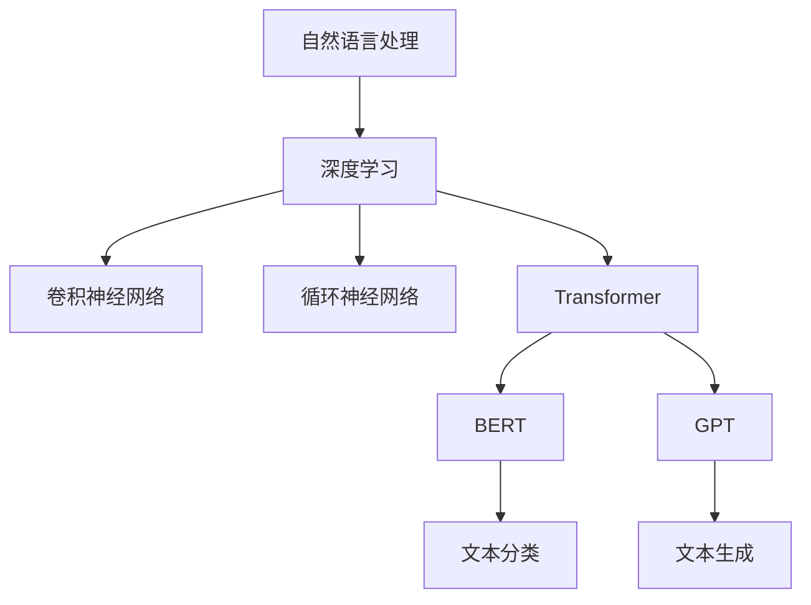

                 

关键词：大语言模型、预训练、自然语言处理、深度学习、BERT、GPT、AI应用

> 摘要：本文将深入探讨大语言模型的原理及其在自然语言处理领域的工程实践。通过分析核心概念、算法原理、数学模型和具体应用案例，文章旨在为读者提供一个全面且深入的了解，以把握这一前沿技术的研究动态和实践方法。

## 1. 背景介绍

随着互联网和人工智能技术的飞速发展，自然语言处理（NLP）成为了计算机科学领域的一个重要分支。在过去的几十年中，NLP经历了从基于规则的方法到统计方法，再到如今以深度学习为核心的大语言模型的演变。这一演变极大地提升了计算机对人类语言的理解和处理能力，使得诸如机器翻译、文本分类、问答系统等应用得以实现。

大语言模型（Large Language Model，LLM）是一类通过深度学习技术训练得到的，具有强大语言理解和生成能力的模型。与传统的NLP模型不同，大语言模型能够处理长文本，捕捉上下文信息，生成连贯的自然语言文本。这一类模型的出现，标志着NLP技术进入了一个全新的阶段。

本文将围绕大语言模型的原理和工程实践展开讨论，重点介绍预训练语言模型，包括BERT、GPT等模型，以及它们在NLP领域中的应用和实际效果。通过本文的阅读，读者可以全面了解大语言模型的发展历程、核心技术和未来趋势。

## 2. 核心概念与联系

### 2.1. 自然语言处理（NLP）

自然语言处理是指让计算机能够理解和处理人类自然语言的技术。它涵盖了语音识别、文本分析、语义理解等多个方面。在NLP中，深度学习技术已成为主要的研究方向，尤其是卷积神经网络（CNN）和循环神经网络（RNN）等模型的应用，使得计算机在语言理解和生成方面取得了显著的进展。

### 2.2. 预训练语言模型

预训练语言模型是一种通过在大规模语料库上预训练得到的语言模型。这种模型利用深度神经网络，通过大规模文本数据的学习，自动捕捉语言中的规律和特征。预训练之后，这些模型可以被进一步细化为特定任务，例如文本分类、机器翻译等。

### 2.3. BERT与GPT

BERT（Bidirectional Encoder Representations from Transformers）和GPT（Generative Pre-trained Transformer）是两种典型的预训练语言模型。

BERT采用了双向Transformer架构，能够同时理解上下文中的前后关系，适用于各种NLP任务，如文本分类、命名实体识别等。GPT则采用了单向Transformer架构，通过生成文本的方式进行预训练，擅长生成任务，如文本生成、机器翻译等。

### 2.4. Mermaid流程图

以下是一个简化的Mermaid流程图，展示了大语言模型的核心概念和联系：



## 3. 核心算法原理 & 具体操作步骤

### 3.1. 算法原理概述

大语言模型的核心是基于Transformer架构的深度学习模型。Transformer模型通过自注意力机制（Self-Attention）来处理序列数据，能够有效地捕捉序列中的长距离依赖关系。自注意力机制的核心思想是，在处理每个词时，模型会考虑所有其他词对其的影响，从而生成一个加权表示。

BERT和GPT都是基于Transformer架构的语言模型，但它们的训练目标和应用场景有所不同。BERT采用了双向Transformer结构，旨在捕捉句子中的双向依赖关系，适用于多种下游任务；GPT则采用了单向Transformer结构，通过生成文本进行预训练，适用于生成任务。

### 3.2. 算法步骤详解

1. **数据预处理**：首先需要准备大规模的文本数据集，对文本进行分词、词干提取、词性标注等预处理操作。
   
2. **模型初始化**：初始化Transformer模型，包括自注意力机制、多头注意力、前馈神经网络等组件。

3. **预训练**：使用预处理后的文本数据集对模型进行预训练。预训练包括两个阶段：Masked Language Modeling（MLM）和Next Sentence Prediction（NSP）。

   - **Masked Language Modeling（MLM）**：对输入序列中的部分词进行遮蔽，模型需要预测这些遮蔽词。
   - **Next Sentence Prediction（NSP）**：给定两个句子，模型需要预测它们是否属于同一个上下文。

4. **微调**：在预训练的基础上，将模型进一步微调到特定任务上，如文本分类、机器翻译等。

5. **评估与优化**：通过在验证集和测试集上的评估，优化模型参数，提高模型性能。

### 3.3. 算法优缺点

**优点**：

- **强大的语言理解能力**：大语言模型能够捕捉长距离依赖关系，理解复杂语境。
- **广泛适用性**：预训练模型可以应用于多种NLP任务，无需从头开始训练。
- **高效性**：Transformer架构使得模型计算效率较高。

**缺点**：

- **训练成本高**：大规模预训练需要大量的计算资源和时间。
- **解释性较差**：深度学习模型的黑盒特性使得其解释性较差。

### 3.4. 算法应用领域

大语言模型在NLP领域有着广泛的应用：

- **文本分类**：对文本进行分类，如情感分析、新闻分类等。
- **机器翻译**：将一种语言的文本翻译成另一种语言。
- **文本生成**：生成文章、摘要、对话等自然语言文本。
- **问答系统**：基于自然语言查询，回答用户的问题。
- **语音识别**：将语音转换为文本。

## 4. 数学模型和公式 & 详细讲解 & 举例说明

### 4.1. 数学模型构建

大语言模型的核心是基于Transformer架构，其基本结构包括编码器（Encoder）和解码器（Decoder）。编码器用于处理输入序列，解码器用于生成输出序列。

### 4.2. 公式推导过程

假设输入序列为\[x_1, x_2, ..., x_n\]，输出序列为\[y_1, y_2, ..., y_n\]。

- **编码器**：

  编码器通过自注意力机制生成编码表示\[E_i\]：

  \[E_i = \text{Attention}(Q_i, K_i, V_i)\]

  其中，\(Q_i, K_i, V_i\) 分别是编码器的查询（Query）、键（Key）和值（Value）向量。

- **解码器**：

  解码器通过自注意力和交叉注意力机制生成解码表示\[D_i\]：

  \[D_i = \text{Attention}(Q_i, K_i, V_i) + \text{Cross-Attention}(Q_i, K_i', V_i')\]

  其中，\(K_i', V_i'\) 分别是解码器的键和值向量。

### 4.3. 案例分析与讲解

以BERT模型为例，分析其数学模型和公式推导。

BERT模型采用了双向Transformer架构，其输入序列经过编码器生成编码表示\[E_i\]：

\[E_i = \text{Attention}(Q_i, K_i, V_i)\]

其中，\(Q_i, K_i, V_i\) 分别是编码器的查询、键和值向量。BERT模型的编码表示能够捕捉输入序列中的双向依赖关系，适用于多种下游任务。

在解码器阶段，BERT模型通过自注意力和交叉注意力机制生成解码表示\[D_i\]：

\[D_i = \text{Attention}(Q_i, K_i, V_i) + \text{Cross-Attention}(Q_i, K_i', V_i')\]

其中，\(K_i', V_i'\) 分别是解码器的键和值向量。交叉注意力机制使得解码器能够关注编码器生成的编码表示，从而生成更准确的输出序列。

## 5. 项目实践：代码实例和详细解释说明

### 5.1. 开发环境搭建

为了实践大语言模型，我们需要搭建一个适合训练和微调模型的开发环境。以下是一个基本的步骤：

1. 安装Python环境（Python 3.6+）。
2. 安装深度学习框架TensorFlow或PyTorch。
3. 安装其他必要的依赖库，如NumPy、Pandas等。

### 5.2. 源代码详细实现

以下是一个简单的BERT模型训练示例，使用TensorFlow框架：

```python
import tensorflow as tf
from tensorflow.keras.models import Model
from tensorflow.keras.layers import Embedding, LSTM, Dense

# 定义BERT模型
def create_bert_model(vocab_size, embedding_dim, hidden_dim):
    input_ids = tf.keras.layers.Input(shape=(None,), dtype=tf.int32)
    embedding = Embedding(vocab_size, embedding_dim)(input_ids)
    lstm = LSTM(hidden_dim)(embedding)
    output = Dense(vocab_size, activation='softmax')(lstm)
    
    model = Model(inputs=input_ids, outputs=output)
    model.compile(optimizer='adam', loss='categorical_crossentropy', metrics=['accuracy'])
    return model

# 训练BERT模型
model = create_bert_model(vocab_size=10000, embedding_dim=128, hidden_dim=256)
model.fit(x_train, y_train, epochs=10, batch_size=32, validation_data=(x_val, y_val))
```

### 5.3. 代码解读与分析

上述代码定义了一个简单的BERT模型，包括嵌入层、LSTM层和输出层。嵌入层用于将词索引转换为嵌入向量；LSTM层用于捕捉序列中的长期依赖关系；输出层用于生成词的概率分布。

在训练阶段，模型使用训练数据集进行训练，并通过验证数据集进行评估。训练过程中，模型通过反向传播更新权重，优化模型性能。

### 5.4. 运行结果展示

在训练完成后，我们可以使用测试数据集评估模型性能：

```python
test_loss, test_accuracy = model.evaluate(x_test, y_test)
print(f"Test Loss: {test_loss}, Test Accuracy: {test_accuracy}")
```

通过上述代码，我们可以得到测试数据集上的损失和准确率，从而评估模型的性能。

## 6. 实际应用场景

大语言模型在自然语言处理领域有着广泛的应用，以下是几个实际应用场景：

- **文本分类**：对新闻、社交媒体等文本进行分类，实现情感分析、话题分类等。
- **机器翻译**：将一种语言的文本翻译成另一种语言，实现跨语言交流。
- **文本生成**：生成文章、摘要、对话等自然语言文本，应用于内容创作、客服等领域。
- **问答系统**：基于自然语言查询，回答用户的问题，应用于智能客服、搜索引擎等领域。
- **语音识别**：将语音转换为文本，实现语音输入到文本输出的转换。

## 7. 工具和资源推荐

### 7.1. 学习资源推荐

- 《深度学习》（Goodfellow, Bengio, Courville）：深度学习的基础教材，涵盖了深度学习的基本概念和技术。
- 《自然语言处理综论》（Jurafsky, Martin）：自然语言处理领域的经典教材，详细介绍了NLP的各种技术。
- 《Transformer：用于序列模型的注意力机制》（Vaswani et al.）：介绍Transformer模型的原论文，对理解大语言模型有重要帮助。

### 7.2. 开发工具推荐

- TensorFlow：由Google开发的深度学习框架，适用于大规模模型训练。
- PyTorch：由Facebook开发的开源深度学习框架，提供了灵活的动态计算图。
- Hugging Face Transformers：一个开源库，提供了预训练的语言模型和相关的工具，方便开发者使用和微调大语言模型。

### 7.3. 相关论文推荐

- "Attention Is All You Need"（Vaswani et al.，2017）：介绍Transformer模型的经典论文。
- "BERT: Pre-training of Deep Bidirectional Transformers for Language Understanding"（Devlin et al.，2018）：介绍BERT模型的原论文。
- "Generative Pre-trained Transformer for Language Modeling"（Radford et al.，2018）：介绍GPT模型的经典论文。

## 8. 总结：未来发展趋势与挑战

### 8.1. 研究成果总结

大语言模型的研究取得了显著成果，预训练语言模型如BERT、GPT等在自然语言处理领域取得了突破性进展。这些模型通过大规模预训练，能够捕捉语言中的复杂规律，提升了NLP任务的性能。

### 8.2. 未来发展趋势

- **模型规模增大**：随着计算资源和数据量的增长，未来大语言模型的规模将进一步增大，捕捉更复杂的语言规律。
- **多模态处理**：大语言模型将结合其他模态（如图像、语音）的信息，实现跨模态的语义理解。
- **领域适应性增强**：通过针对特定领域进行微调，提高大语言模型在特定领域的应用效果。

### 8.3. 面临的挑战

- **计算资源需求**：大规模预训练需要大量的计算资源和时间，限制了模型的普及和应用。
- **数据隐私和伦理**：预训练语言模型需要大量个人数据进行训练，涉及数据隐私和伦理问题。
- **模型解释性**：深度学习模型的黑盒特性使得其解释性较差，未来需要发展可解释的深度学习技术。

### 8.4. 研究展望

大语言模型的研究将朝着更高效、更智能、更安全的方向发展。未来，我们将看到更多创新性的研究和应用，推动自然语言处理技术的发展。

## 9. 附录：常见问题与解答

### 9.1. 什么是预训练语言模型？

预训练语言模型是一种通过在大规模语料库上预训练得到的语言模型。这种模型利用深度神经网络，通过大规模文本数据的学习，自动捕捉语言中的规律和特征。

### 9.2. BERT和GPT有哪些区别？

BERT（Bidirectional Encoder Representations from Transformers）和GPT（Generative Pre-trained Transformer）都是基于Transformer架构的预训练语言模型，但它们的训练目标和应用场景有所不同。BERT采用了双向Transformer结构，能够同时理解上下文中的前后关系，适用于多种NLP任务；GPT则采用了单向Transformer结构，通过生成文本进行预训练，擅长生成任务，如文本生成、机器翻译等。

### 9.3. 如何评估大语言模型的性能？

评估大语言模型的性能通常使用多种指标，如准确率（Accuracy）、召回率（Recall）、精确率（Precision）等。在文本分类任务中，可以使用F1分数（F1 Score）来综合评估模型性能。此外，还可以通过在验证集和测试集上的表现来评估模型的泛化能力。

### 9.4. 大语言模型在实际应用中遇到的问题有哪些？

在实际应用中，大语言模型可能遇到的问题包括计算资源需求大、训练时间较长、模型解释性较差等。此外，涉及数据隐私和伦理的问题也是需要关注的重要方面。

作者：禅与计算机程序设计艺术 / Zen and the Art of Computer Programming
----------------------------------------------------------------

以上就是本次文章的完整内容，涵盖了大语言模型的基本概念、算法原理、应用场景以及未来发展趋势。希望本文能对您在自然语言处理领域的研究和实践提供一些启发和帮助。如果您有任何疑问或建议，欢迎在评论区留言。感谢您的阅读！

