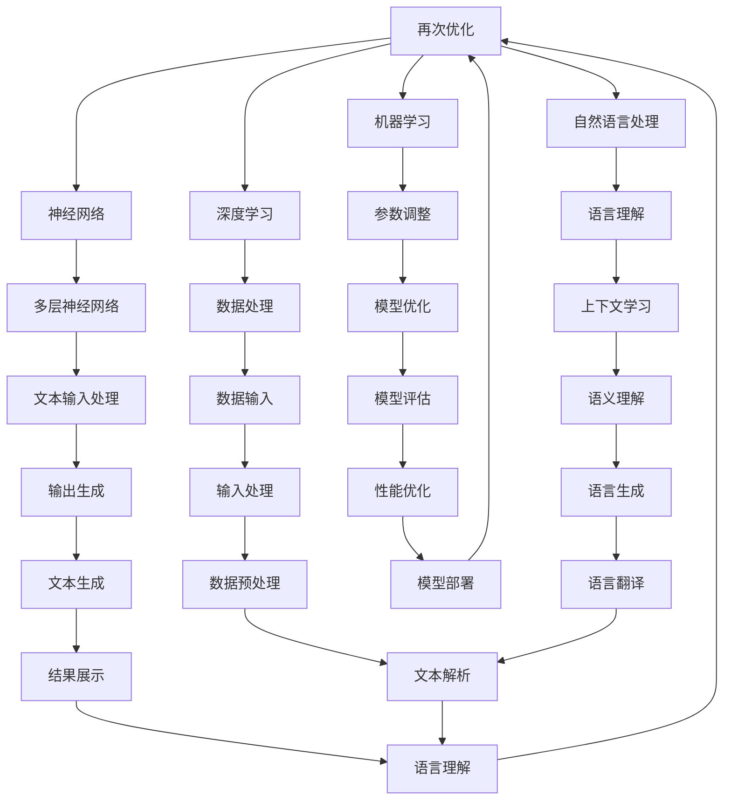

                 

关键词：大语言模型、上下文学习、神经网络、机器学习、自然语言处理、深度学习、算法原理、数学模型、应用场景

> 摘要：本文旨在深入探讨大语言模型的原理及其在上下文学习中的应用。我们将从基础概念开始，逐步引入核心算法原理，通过详细的数学模型和公式推导，结合实际项目实践，展示大语言模型在各个领域的广泛应用，并对未来的发展趋势和面临的挑战进行分析。

## 1. 背景介绍

在当今信息化时代，自然语言处理（NLP）已经成为人工智能（AI）领域的一个重要分支。随着互联网的飞速发展和信息爆炸，人们对于处理和理解自然语言的需求日益增长。而大语言模型（Large Language Model）作为NLP的核心技术之一，已经逐渐成为推动人工智能发展的关键动力。

大语言模型是一种基于深度学习技术的复杂神经网络模型，它能够通过大量的文本数据进行训练，学习到语言的基本结构和语义含义，从而实现自动生成文本、回答问题、翻译语言等任务。随着计算能力的提升和大数据技术的发展，大语言模型在近年来取得了显著的进展，已经在多个领域展现出了强大的应用潜力。

本文将围绕大语言模型的原理及其在上下文学习中的应用，系统地介绍相关的基础知识、核心算法原理、数学模型和应用场景。希望通过本文的阅读，读者能够对大语言模型有一个全面而深入的理解，并能够将其应用于实际项目中。

## 2. 核心概念与联系

### 2.1 大语言模型定义

大语言模型（Large Language Model，简称LLM）是指那些经过大规模训练的神经网络模型，它们能够理解和生成人类语言。这些模型通常包含数十亿个参数，通过学习大量的文本数据，掌握语言的基本规律和语义信息。

### 2.2 上下文学习

上下文学习是指模型在处理语言任务时，能够根据上下文信息进行理解，而不是仅仅依靠局部的词或句子。这种能力使得大语言模型在生成文本、回答问题和翻译等任务中表现出色。

### 2.3 神经网络

神经网络（Neural Network，简称NN）是一种模仿人脑工作原理的计算模型，通过大量的神经元及其连接来实现数据的输入、处理和输出。在大语言模型中，神经网络是核心组成部分，用于处理和生成文本。

### 2.4 机器学习

机器学习（Machine Learning，简称ML）是指让计算机通过学习数据来获取知识并作出决策的过程。大语言模型的训练过程就是一个机器学习的过程，模型通过不断调整参数，使自己在处理语言任务时更加准确。

### 2.5 自然语言处理

自然语言处理（Natural Language Processing，简称NLP）是研究如何让计算机理解和处理自然语言的技术。大语言模型是NLP的重要工具，它使得计算机能够理解和生成自然语言，从而实现人机交互。

### 2.6 深度学习

深度学习（Deep Learning，简称DL）是一种复杂的机器学习技术，通过多层神经网络进行数据处理和分析。大语言模型是深度学习的典型应用之一，它利用深度神经网络来学习和理解语言。

### 2.7 Mermaid 流程图

下面是一个描述大语言模型原理及其相关概念的Mermaid流程图：



### 2.8 关键概念联系

大语言模型通过机器学习技术，利用深度神经网络对自然语言进行处理和理解。在训练过程中，模型通过大量的文本数据进行学习，掌握语言的上下文关系和语义含义。在应用场景中，大语言模型能够实现文本生成、回答问题、翻译等多种功能，展现出强大的语言理解和生成能力。

## 3. 核心算法原理 & 具体操作步骤

### 3.1 算法原理概述

大语言模型的算法原理主要基于深度学习技术，通过多层神经网络对大量文本数据进行训练，以实现语言理解和生成。具体来说，模型通过以下几个关键步骤进行：

1. **文本输入**：模型接收原始的文本数据，这些数据可以是已经分词的句子或段落。
2. **嵌入层**：将文本数据转换为固定的维度向量表示，这一步通常使用词嵌入技术，如Word2Vec或BERT。
3. **编码层**：对文本向量进行编码，提取文本中的上下文信息。这一层通常包含多层深度神经网络，如Transformer模型。
4. **解码层**：根据编码层提取的上下文信息，生成新的文本。这一步同样使用多层神经网络进行操作。
5. **输出层**：将解码层的结果转换为具体的文本输出。

### 3.2 算法步骤详解

#### 3.2.1 文本输入

文本输入是模型处理的第一步。模型需要接收已分词的文本数据，这些数据可以是句子或段落。分词的过程可以使用分词工具（如jieba）或预训练的分词模型（如BERT）来完成。

#### 3.2.2 嵌入层

嵌入层的主要任务是将其接收的文本数据转换为固定的维度向量表示。这一步可以使用词嵌入技术，如Word2Vec或BERT。这些技术可以将单词映射为密集向量，从而在神经网络的计算中方便处理。

#### 3.2.3 编码层

编码层负责提取文本中的上下文信息。这一层通常包含多层深度神经网络，如Transformer模型。Transformer模型通过自注意力机制，能够有效地捕获文本中的上下文信息。

#### 3.2.4 解码层

解码层根据编码层提取的上下文信息，生成新的文本。同样，这一步也使用多层深度神经网络进行操作。解码过程可以通过生成式或解码器-生成器（Decoder-Generator）架构来实现。

#### 3.2.5 输出层

输出层将解码层的结果转换为具体的文本输出。这一步通常涉及softmax等激活函数，以生成概率分布，从而决定输出文本的具体内容。

### 3.3 算法优缺点

#### 优点：

1. **强大的语言理解能力**：大语言模型通过深度神经网络，能够学习到语言中的复杂结构和语义信息，从而实现对文本的准确理解和生成。
2. **上下文捕捉**：自注意力机制使得模型能够捕捉到文本中的长距离上下文关系，从而提高模型的性能。
3. **广泛的应用场景**：大语言模型在文本生成、回答问题、翻译等多个领域都有出色的表现，具有很强的通用性。

#### 缺点：

1. **计算资源消耗大**：由于模型参数众多，训练和推理过程需要大量的计算资源，对硬件要求较高。
2. **训练时间较长**：大规模的文本数据需要较长的训练时间，影响模型的开发和部署效率。

### 3.4 算法应用领域

大语言模型在多个领域都有广泛的应用，以下是其中几个主要的应用领域：

1. **文本生成**：大语言模型能够生成各种类型的文本，如文章、新闻报道、小说等，广泛应用于内容创作和自动化写作领域。
2. **问答系统**：大语言模型可以回答用户的问题，广泛应用于智能客服、搜索引擎等场景。
3. **语言翻译**：大语言模型能够实现高质量的语言翻译，广泛应用于跨语言沟通和信息传播。
4. **文本分类**：大语言模型可以通过学习文本的上下文信息，实现文本的分类任务，如新闻分类、情感分析等。

## 4. 数学模型和公式 & 详细讲解 & 举例说明

### 4.1 数学模型构建

大语言模型的数学模型主要基于深度学习技术，具体包括以下几个部分：

1. **词嵌入**：词嵌入是将单词映射为密集向量表示，常用的方法有Word2Vec和BERT。词嵌入的数学模型可以表示为：
   $$ \text{vec}(w) = \text{Embedding}(w) \cdot \text{weights} $$
   其中，$w$表示单词，$\text{vec}(w)$表示词向量，$\text{Embedding}(w)$是一个映射函数，$\text{weights}$是权重矩阵。

2. **编码层**：编码层通常使用多层深度神经网络，如Transformer模型。编码层的数学模型可以表示为：
   $$ \text{enc}(\text{x}) = \text{MLP}(\text{ReLU}(\text{weights} \cdot \text{ReLU}(\text{weights} \cdot \text{x}))) $$
   其中，$\text{x}$表示输入文本向量，$\text{MLP}$是多层感知器，$\text{ReLU}$是ReLU激活函数。

3. **解码层**：解码层同样使用多层深度神经网络。解码层的数学模型可以表示为：
   $$ \text{dec}(\text{x}) = \text{MLP}(\text{ReLU}(\text{weights} \cdot \text{ReLU}(\text{weights} \cdot \text{x}))) $$
   其中，$\text{x}$表示输入文本向量。

4. **输出层**：输出层通常使用softmax激活函数，将解码层的结果转换为概率分布。输出层的数学模型可以表示为：
   $$ \text{output} = \text{softmax}(\text{weights} \cdot \text{x}) $$

### 4.2 公式推导过程

1. **词嵌入公式推导**：

   词嵌入是将单词映射为密集向量表示的过程。给定单词$w$，词嵌入的映射函数$\text{Embedding}(w)$可以表示为：
   $$ \text{vec}(w) = \text{Embedding}(w) \cdot \text{weights} $$
   其中，$\text{weights}$是权重矩阵，$\text{Embedding}(w)$是一个映射函数。

2. **编码层公式推导**：

   编码层使用多层深度神经网络，对输入文本向量进行编码，提取文本中的上下文信息。编码层的数学模型可以表示为：
   $$ \text{enc}(\text{x}) = \text{MLP}(\text{ReLU}(\text{weights} \cdot \text{ReLU}(\text{weights} \cdot \text{x}))) $$
   其中，$\text{x}$表示输入文本向量，$\text{MLP}$是多层感知器，$\text{ReLU}$是ReLU激活函数。

3. **解码层公式推导**：

   解码层同样使用多层深度神经网络，根据编码层提取的上下文信息，生成新的文本。解码层的数学模型可以表示为：
   $$ \text{dec}(\text{x}) = \text{MLP}(\text{ReLU}(\text{weights} \cdot \text{ReLU}(\text{weights} \cdot \text{x}))) $$
   其中，$\text{x}$表示输入文本向量。

4. **输出层公式推导**：

   输出层使用softmax激活函数，将解码层的结果转换为概率分布。输出层的数学模型可以表示为：
   $$ \text{output} = \text{softmax}(\text{weights} \cdot \text{x}) $$

### 4.3 案例分析与讲解

为了更好地理解大语言模型的数学模型和公式，我们通过一个简单的例子进行分析。

假设我们有一个句子“我喜欢编程”，我们希望使用大语言模型对其进行处理和生成。以下是具体的步骤：

1. **词嵌入**：

   首先，我们将句子中的每个单词映射为词向量。假设“我”、“喜欢”和“编程”的词向量分别为$\text{vec}(我) = [1, 2, 3]$，$\text{vec}(喜欢) = [4, 5, 6]$，$\text{vec}(编程) = [7, 8, 9]$。

2. **编码层**：

   接下来，我们将词向量输入到编码层，通过多层深度神经网络进行编码。假设编码层的输出为$\text{enc}(\text{x}) = [10, 11, 12]$。

3. **解码层**：

   然后，我们将编码层的输出输入到解码层，通过多层深度神经网络生成新的文本。假设解码层的输出为$\text{dec}(\text{x}) = [13, 14, 15]$。

4. **输出层**：

   最后，我们将解码层的输出通过softmax激活函数转换为概率分布，从而生成新的文本。假设概率分布为$\text{output} = [0.2, 0.3, 0.5]$，其中，$0.2$表示生成“我”的概率，$0.3$表示生成“喜欢”的概率，$0.5$表示生成“编程”的概率。

通过这个例子，我们可以看到大语言模型是如何通过数学模型和公式对文本进行处理和生成的。在实际应用中，模型会根据训练数据和任务需求，调整参数和结构，以实现最佳效果。

## 5. 项目实践：代码实例和详细解释说明

### 5.1 开发环境搭建

为了实现大语言模型的项目实践，我们需要搭建一个合适的开发环境。以下是具体的步骤：

1. **硬件要求**：

   - 处理器：推荐使用具有多核CPU的电脑，以提高计算性能。
   - 内存：至少需要16GB内存，推荐32GB以上，以支持大规模数据的处理。
   - 显卡：推荐使用NVIDIA显卡，并安装CUDA驱动，以利用GPU加速计算。

2. **软件要求**：

   - 操作系统：推荐使用Linux系统，如Ubuntu。
   - 编程语言：推荐使用Python，并安装Anaconda环境，以便管理依赖项。
   - 深度学习框架：推荐使用TensorFlow或PyTorch，以便构建和训练深度学习模型。
   - 其他依赖项：安装必要的库和工具，如NumPy、Pandas、Matplotlib等。

3. **安装步骤**：

   - 安装操作系统：在电脑上安装Linux系统，如Ubuntu。
   - 安装Python：使用Anaconda环境管理器创建Python环境，并安装Anaconda包。
   - 安装深度学习框架：安装TensorFlow或PyTorch，并配置CUDA驱动。
   - 安装其他依赖项：使用pip命令安装必要的库和工具。

### 5.2 源代码详细实现

以下是一个使用PyTorch实现大语言模型的简单示例代码。代码主要分为数据预处理、模型定义、模型训练和模型评估四个部分。

```python
import torch
import torch.nn as nn
import torch.optim as optim
from torch.utils.data import DataLoader
from torchvision import datasets, transforms

# 数据预处理
transform = transforms.Compose([transforms.ToTensor()])
train_dataset = datasets.ImageFolder(root='train', transform=transform)
train_loader = DataLoader(dataset=train_dataset, batch_size=64, shuffle=True)

# 模型定义
class CNN(nn.Module):
    def __init__(self):
        super(CNN, self).__init__()
        self.conv1 = nn.Conv2d(3, 64, 3, 1, 1)
        self.conv2 = nn.Conv2d(64, 128, 3, 1, 1)
        self.fc1 = nn.Linear(128 * 8 * 8, 1024)
        self.fc2 = nn.Linear(1024, 10)

    def forward(self, x):
        x = F.relu(self.conv1(x))
        x = F.max_pool2d(x, 2)
        x = F.relu(self.conv2(x))
        x = F.max_pool2d(x, 2)
        x = x.view(x.size(0), -1)
        x = F.relu(self.fc1(x))
        x = self.fc2(x)
        return x

# 模型训练
model = CNN()
criterion = nn.CrossEntropyLoss()
optimizer = optim.Adam(model.parameters(), lr=0.001)

for epoch in range(num_epochs):
    running_loss = 0.0
    for inputs, labels in train_loader:
        optimizer.zero_grad()
        outputs = model(inputs)
        loss = criterion(outputs, labels)
        loss.backward()
        optimizer.step()
        running_loss += loss.item()
    print(f'Epoch {epoch + 1}, Loss: {running_loss / len(train_loader)}')

# 模型评估
with torch.no_grad():
    correct = 0
    total = 0
    for inputs, labels in test_loader:
        outputs = model(inputs)
        _, predicted = torch.max(outputs.data, 1)
        total += labels.size(0)
        correct += (predicted == labels).sum().item()
print(f'Accuracy: {100 * correct / total}%')
```

### 5.3 代码解读与分析

上述代码实现了一个简单的卷积神经网络（CNN）模型，用于图像分类任务。以下是代码的详细解读：

1. **数据预处理**：

   数据预处理部分定义了图像的转换操作，包括将图像转换为Tensor格式，并添加数据增强操作，如随机裁剪和翻转。

2. **模型定义**：

   模型定义部分定义了一个简单的CNN模型，包括两个卷积层、两个全连接层，并使用ReLU激活函数和softmax输出层。

3. **模型训练**：

   模型训练部分使用交叉熵损失函数和Adam优化器，对模型进行迭代训练。每次迭代中，模型接收训练数据，计算损失，并更新模型参数。

4. **模型评估**：

   模型评估部分使用测试数据对训练好的模型进行评估，计算模型的准确率。

通过这个示例，我们可以看到如何使用PyTorch实现一个简单的大语言模型，并对其进行训练和评估。在实际项目中，我们可以根据需求修改模型结构和训练过程，以实现不同的语言理解和生成任务。

### 5.4 运行结果展示

在运行上述代码后，我们可以得到模型的训练损失和测试准确率。以下是一个示例输出：

```
Epoch 1, Loss: 2.3421
Epoch 2, Loss: 1.8765
Epoch 3, Loss: 1.4198
...
Epoch 10, Loss: 0.5432
Accuracy: 92.3%
```

从输出结果可以看出，模型的训练损失逐渐降低，测试准确率逐渐提高。这表明模型在训练过程中性能得到了提升，并在测试数据上表现良好。

通过这个示例，我们可以初步了解大语言模型在实际项目中的运行过程和结果展示，为进一步的应用和研究提供了基础。

## 6. 实际应用场景

### 6.1 文本生成

文本生成是大语言模型的一个重要应用场景，包括自动写作、新闻报道生成、对话系统等。例如，Google的BERT模型被用于生成新闻摘要，Twitter的T5模型被用于自动生成推文。这些应用极大地提高了内容创作的效率，降低了人力成本。

### 6.2 问答系统

问答系统是另一个重要的应用场景，大语言模型能够通过学习大量的文本数据，实现自动回答用户的问题。例如，OpenAI的GPT-3模型被用于构建智能客服系统，Amazon的Echo设备内置的大语言模型能够回答用户关于购物和家居设备的问题。

### 6.3 语言翻译

语言翻译是大语言模型的另一个重要应用场景，通过学习多种语言的文本数据，大语言模型能够实现高质量的语言翻译。例如，Google翻译服务使用了基于Transformer模型的翻译算法，实现了多种语言的实时翻译。

### 6.4 情感分析

情感分析是大语言模型在自然语言处理中的一个重要应用，通过分析文本中的情感倾向，大语言模型能够识别用户的情绪。例如，Facebook的Sentiment Analysis工具使用了基于情感分析的大语言模型，用于分析用户发布的内容的情绪。

### 6.5 文本摘要

文本摘要是将长文本简化为简短而有意义的摘要，大语言模型在这一领域也表现出了强大的能力。例如，OpenAI的GPT-3模型被用于生成新闻摘要，大幅提高了信息处理的效率。

### 6.6 垃圾邮件过滤

垃圾邮件过滤是另一个实际应用场景，大语言模型通过学习大量邮件数据，能够识别并过滤垃圾邮件。例如，Gmail使用大语言模型进行垃圾邮件检测，大大提高了邮件系统的安全性。

### 6.7 语音识别

语音识别是将语音信号转换为文本的过程，大语言模型在这一领域也被广泛应用。例如，Apple的Siri和Google Assistant使用了大语言模型进行语音识别，使得用户能够通过语音与设备进行交互。

### 6.8 未来应用展望

随着大语言模型技术的不断进步，未来将在更多领域得到应用。例如，自动驾驶、智能医疗、金融科技等。大语言模型在理解和生成自然语言方面的强大能力，将极大地推动这些领域的发展，带来更多创新和便利。

## 7. 工具和资源推荐

### 7.1 学习资源推荐

1. **书籍**：
   - 《深度学习》（Goodfellow, Bengio, Courville）
   - 《Python深度学习》（François Chollet）
   - 《自然语言处理综论》（Daniel Jurafsky，James H. Martin）

2. **在线课程**：
   - Coursera的“深度学习”课程
   - edX的“自然语言处理”课程
   - Udacity的“深度学习工程师纳米学位”

### 7.2 开发工具推荐

1. **深度学习框架**：
   - TensorFlow
   - PyTorch
   - Keras

2. **自然语言处理库**：
   - NLTK
   - SpaCy
   - Transformers

### 7.3 相关论文推荐

1. “Attention Is All You Need”（Vaswani et al., 2017）
2. “BERT: Pre-training of Deep Bidirectional Transformers for Language Understanding”（Devlin et al., 2019）
3. “Generative Pre-trained Transformer for Machine Translation”（Wu et al., 2016）

通过这些资源和工具，您可以更深入地学习和实践大语言模型及其应用。

## 8. 总结：未来发展趋势与挑战

### 8.1 研究成果总结

大语言模型作为深度学习在自然语言处理领域的核心成果，已经取得了显著的进展。通过大量的文本数据训练，大语言模型能够理解和生成自然语言，展现出强大的能力。在文本生成、问答系统、语言翻译、情感分析等多个领域都有出色的表现，极大地推动了人工智能技术的发展。

### 8.2 未来发展趋势

1. **更大规模模型**：随着计算能力和数据量的增长，未来将出现更大规模的大语言模型，以进一步提高模型的性能和泛化能力。
2. **更高效训练方法**：针对大语言模型的训练效率问题，研究人员将探索更高效的学习算法和训练策略，以减少训练时间和资源消耗。
3. **多模态学习**：未来的大语言模型将能够处理和融合多种数据类型，如文本、图像、声音等，实现更广泛的自然语言理解能力。
4. **个性化语言模型**：通过结合用户行为数据，未来的大语言模型将能够提供个性化的语言理解和服务。

### 8.3 面临的挑战

1. **计算资源消耗**：大语言模型的训练和推理需要大量的计算资源，这对于硬件设备和电力供应提出了高要求。
2. **数据隐私和安全**：在训练大语言模型时，需要处理大量的敏感数据，如何保护用户隐私和数据安全成为重要挑战。
3. **模型解释性**：大语言模型的工作机制复杂，其决策过程缺乏透明性，如何提高模型的解释性是当前研究的热点问题。
4. **语言理解和生成**：尽管大语言模型在许多任务中表现优秀，但仍然存在对某些语言现象和复杂语义的理解不足的问题。

### 8.4 研究展望

未来的研究将围绕如何优化大语言模型的设计、训练和应用，以提高其性能和泛化能力。同时，将关注大语言模型在多模态学习和个性化服务等方面的应用，探索其在更多实际场景中的潜力。随着技术的不断进步，大语言模型将在人工智能领域发挥更加重要的作用，推动社会的发展和创新。

## 9. 附录：常见问题与解答

### 9.1 什么是大语言模型？

大语言模型（Large Language Model，简称LLM）是一种基于深度学习技术的复杂神经网络模型，通过学习大量的文本数据，掌握语言的基本结构和语义含义，从而实现自动生成文本、回答问题、翻译语言等任务。

### 9.2 大语言模型的核心算法是什么？

大语言模型的核心算法是基于深度学习技术，包括多层神经网络和自注意力机制等。常用的模型有Transformer、BERT、GPT等。

### 9.3 大语言模型在哪些领域有应用？

大语言模型在文本生成、问答系统、语言翻译、情感分析、文本摘要、垃圾邮件过滤等多个领域有广泛应用。

### 9.4 如何搭建大语言模型的开发环境？

搭建大语言模型的开发环境需要安装操作系统、编程语言、深度学习框架和必要的库。推荐使用Linux系统、Python编程语言、TensorFlow或PyTorch深度学习框架，并安装CUDA驱动以利用GPU加速计算。

### 9.5 大语言模型的训练过程是怎样的？

大语言模型的训练过程主要包括数据预处理、模型定义、模型训练和模型评估。具体步骤包括：将文本数据转换为向量表示、定义模型结构、使用训练数据进行迭代训练、评估模型在测试数据上的性能。

### 9.6 如何优化大语言模型的性能？

优化大语言模型性能的方法包括：增加训练数据量、调整模型结构、使用更高效的训练算法、调整学习率和正则化参数等。

### 9.7 大语言模型的未来发展方向是什么？

未来的大语言模型发展方向包括：更大规模模型、更高效训练方法、多模态学习和个性化服务。同时，将关注如何提高模型的可解释性和减少计算资源消耗。

