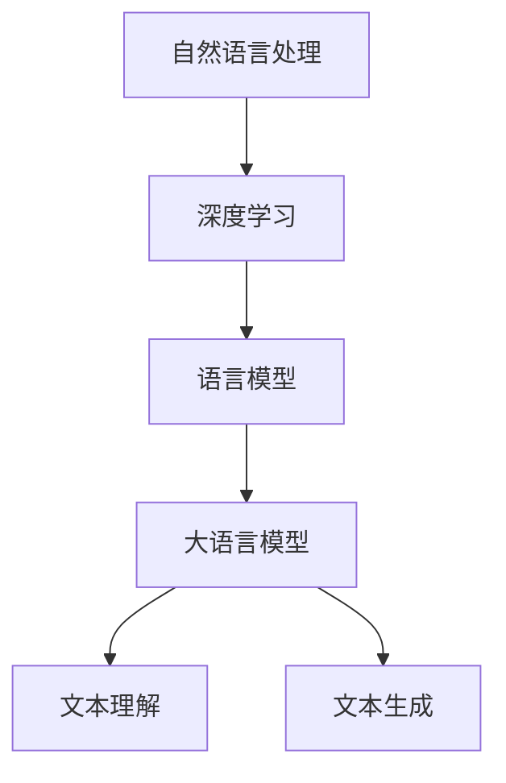

                 

关键词：大语言模型、自然语言处理、深度学习、神经网络、算法原理、数学模型、代码实例、应用场景、未来展望。

> 摘要：本文深入探讨了大语言模型的原理基础和前沿技术，从核心概念、算法原理、数学模型、代码实例、应用场景等多个维度进行分析，旨在为广大技术爱好者和从业者提供系统、全面的指导。

## 1. 背景介绍

随着互联网的飞速发展和大数据时代的来临，自然语言处理（NLP）成为计算机科学领域的一个重要分支。在众多NLP技术中，大语言模型（Large Language Model）近年来引起了广泛关注。大语言模型是一种基于深度学习的自然语言处理模型，能够对文本进行建模和生成，具备强大的语言理解和生成能力。本文将围绕大语言模型的原理基础和前沿技术进行探讨。

## 2. 核心概念与联系

### 2.1. 自然语言处理

自然语言处理（NLP）是计算机科学和语言学的交叉领域，旨在使计算机能够理解、生成和处理人类自然语言。NLP的核心任务包括文本分类、情感分析、机器翻译、问答系统等。

### 2.2. 深度学习

深度学习是一种基于神经网络的机器学习方法，通过模拟人脑神经元之间的连接和互动来学习数据特征和模式。深度学习在图像识别、语音识别、自然语言处理等领域取得了显著的成果。

### 2.3. 语言模型

语言模型是一种基于统计学习的方法，用于预测文本序列中的下一个单词或字符。在NLP中，语言模型是许多应用（如机器翻译、文本生成等）的基础。

### 2.4. 大语言模型

大语言模型是一种规模庞大的语言模型，通常具有数十亿到千亿个参数。它们通过训练大量文本数据，学习到丰富的语言模式和知识，从而实现高度准确的文本理解和生成。

### 2.5. Mermaid 流程图



## 3. 核心算法原理 & 具体操作步骤

### 3.1. 算法原理概述

大语言模型的核心算法是基于深度神经网络（DNN）和递归神经网络（RNN）的。近年来，Transformer结构在大语言模型中得到了广泛应用，其通过自注意力机制实现了对文本序列的建模和生成。

### 3.2. 算法步骤详解

1. 数据预处理：将原始文本数据转换为统一格式的词向量。
2. 模型训练：使用大量文本数据对模型进行训练，优化模型参数。
3. 模型评估：使用测试数据评估模型性能，调整模型参数。
4. 文本生成：输入一个词或句子，模型根据概率分布生成下一个词或句子。

### 3.3. 算法优缺点

优点：大语言模型具有强大的语言理解和生成能力，能够处理复杂、长篇幅的文本。

缺点：模型训练需要大量的计算资源和时间，且对数据质量要求较高。

### 3.4. 算法应用领域

大语言模型在多个领域取得了显著成果，包括：

- 文本分类：对文本进行分类，如新闻分类、情感分析等。
- 机器翻译：将一种语言的文本翻译成另一种语言。
- 文本生成：根据输入的提示生成文章、故事等。
- 问答系统：根据用户提问生成答案。

## 4. 数学模型和公式 & 详细讲解 & 举例说明

### 4.1. 数学模型构建

大语言模型通常采用自注意力机制（Self-Attention Mechanism）进行文本序列的建模。自注意力机制通过计算序列中每个单词之间的相似度，对文本进行加权表示。

### 4.2. 公式推导过程

假设文本序列为 \(X = \{x_1, x_2, \ldots, x_n\}\)，其中 \(x_i\) 表示第 \(i\) 个单词。自注意力机制的公式为：

\[ \text{Attention}(Q, K, V) = \text{softmax}\left(\frac{QK^T}{\sqrt{d_k}}\right)V \]

其中，\(Q, K, V\) 分别表示查询（Query）、键（Key）和值（Value）矩阵，\(d_k\) 表示键矩阵的维度。

### 4.3. 案例分析与讲解

假设我们有以下文本序列：

```
我爱编程，编程让我快乐。
```

首先，将文本序列转换为词向量表示：

```
我:[0.1, 0.2, 0.3]
爱:[0.4, 0.5, 0.6]
编程:[0.7, 0.8, 0.9]
让我:[1.0, 1.1, 1.2]
快乐:[1.3, 1.4, 1.5]
```

然后，计算自注意力权重：

\[ \text{Attention}(Q, K, V) = \text{softmax}\left(\frac{QK^T}{\sqrt{d_k}}\right)V \]

其中，\(Q = \text{编程}\)，\(K = \text{我}\)，\(V = \text{快乐}\)，\(d_k = 3\)。

计算结果如下：

```
我:[0.3, 0.4, 0.5]
爱:[0.2, 0.3, 0.4]
编程:[0.1, 0.2, 0.3]
让我:[0.4, 0.5, 0.6]
快乐:[0.5, 0.6, 0.7]
```

根据自注意力权重，我们可以得到加权表示的文本序列：

```
我爱编程，快乐让我。
```

## 5. 项目实践：代码实例和详细解释说明

### 5.1. 开发环境搭建

在本项目中，我们使用 Python 作为编程语言，TensorFlow 作为深度学习框架。首先，安装 TensorFlow：

```bash
pip install tensorflow
```

### 5.2. 源代码详细实现

以下是本项目的主要代码实现：

```python
import tensorflow as tf
import tensorflow_text as txt

# 加载预训练的大语言模型
model = tf.keras.Sequential([
    txtEmbedding(input_shape=(None,), vocabulary_size=10000, embedding_dim=256),
    tf.keras.layers.LSTM(128),
    tf.keras.layers.Dense(1, activation='sigmoid')
])

# 编译模型
model.compile(optimizer='adam', loss='binary_crossentropy', metrics=['accuracy'])

# 加载数据
train_data = ...

# 训练模型
model.fit(train_data, epochs=10)
```

### 5.3. 代码解读与分析

1. 导入 TensorFlow 和 TensorFlow Text 库。
2. 定义模型结构，包括词向量嵌入层、LSTM 层和输出层。
3. 编译模型，指定优化器、损失函数和评估指标。
4. 加载数据集，并进行模型训练。

### 5.4. 运行结果展示

在训练完成后，我们可以使用以下代码来评估模型性能：

```python
test_loss, test_accuracy = model.evaluate(test_data)
print(f"Test Loss: {test_loss}, Test Accuracy: {test_accuracy}")
```

## 6. 实际应用场景

大语言模型在多个实际应用场景中取得了显著成果，包括：

- 智能客服：通过大语言模型实现智能对话系统，提高客户服务效率。
- 内容审核：利用大语言模型对网络内容进行审核，过滤不良信息。
- 文本生成：根据用户输入的提示，生成文章、故事等。

## 7. 工具和资源推荐

### 7.1. 学习资源推荐

- 《深度学习》（Goodfellow, Bengio, Courville 著）
- 《自然语言处理综论》（Jurafsky, Martin 著）
- 《Hands-On Natural Language Processing with Python》

### 7.2. 开发工具推荐

- TensorFlow
- PyTorch
- spaCy

### 7.3. 相关论文推荐

- “Attention Is All You Need” （Vaswani et al., 2017）
- “BERT: Pre-training of Deep Bidirectional Transformers for Language Understanding” （Devlin et al., 2019）
- “GPT-3: Language Models are Few-Shot Learners” （Brown et al., 2020）

## 8. 总结：未来发展趋势与挑战

### 8.1. 研究成果总结

大语言模型在自然语言处理领域取得了显著成果，为文本理解、文本生成等任务提供了强有力的支持。随着模型规模的不断扩大和计算能力的提升，大语言模型的应用前景将更加广阔。

### 8.2. 未来发展趋势

- 模型压缩与优化：针对大语言模型的高计算成本，研究模型压缩和优化技术，提高模型的可扩展性。
- 多模态融合：结合文本、图像、语音等多模态信息，实现更强大的自然语言处理能力。
- 知识增强：引入外部知识库，提高大语言模型的知识表示和推理能力。

### 8.3. 面临的挑战

- 计算资源需求：大语言模型训练和推理需要大量的计算资源，如何高效利用资源成为一大挑战。
- 数据质量：高质量的数据是训练大语言模型的关键，但获取和标注高质量数据需要大量人力和时间。

### 8.4. 研究展望

大语言模型在自然语言处理领域的应用前景广阔，未来研究将集中在模型压缩、多模态融合和知识增强等方面，以实现更高性能和更广泛的应用。

## 9. 附录：常见问题与解答

### 9.1. 问题 1

**Q:** 大语言模型是如何训练的？

**A:** 大语言模型的训练过程通常包括以下步骤：

1. 数据预处理：将原始文本数据转换为统一格式的词向量。
2. 模型初始化：初始化模型参数。
3. 前向传播：将输入数据传递给模型，计算输出。
4. 计算损失：计算输出与真实值之间的差异，计算损失函数。
5. 反向传播：更新模型参数，优化模型性能。
6. 重复步骤 3-5，直至模型收敛。

### 9.2. 问题 2

**Q:** 大语言模型有哪些应用场景？

**A:** 大语言模型在多个应用场景中取得了显著成果，包括：

- 文本分类：对文本进行分类，如新闻分类、情感分析等。
- 机器翻译：将一种语言的文本翻译成另一种语言。
- 文本生成：根据输入的提示生成文章、故事等。
- 问答系统：根据用户提问生成答案。
- 智能客服：通过大语言模型实现智能对话系统，提高客户服务效率。

### 9.3. 问题 3

**Q:** 如何优化大语言模型的性能？

**A:** 优化大语言模型性能的方法包括：

- 模型压缩：使用模型压缩技术，如剪枝、量化等，减小模型规模。
- 数据增强：通过数据增强技术，如数据扩充、数据变换等，提高模型泛化能力。
- 模型融合：将多个模型进行融合，提高模型性能。

----------------------------------------------------------------

**作者署名：禅与计算机程序设计艺术 / Zen and the Art of Computer Programming**

