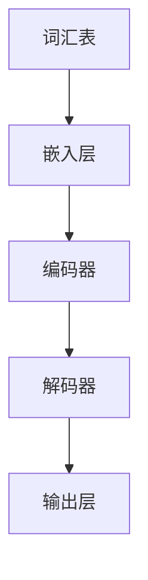
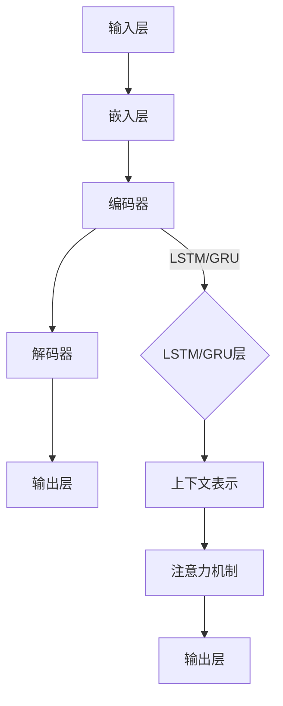

                 

关键词：大语言模型，深度学习，自然语言处理，神经网络，模型架构，训练算法，应用领域，未来展望

> 摘要：本文旨在深入探讨大语言模型的原理、基础与前沿发展。通过对具有代表性的语言模型进行详细分析，本文揭示了其在自然语言处理领域的重要性和应用价值，并展望了未来的发展趋势与挑战。

## 1. 背景介绍

随着互联网的飞速发展和大数据时代的到来，自然语言处理（NLP）成为人工智能领域的重要研究方向。大语言模型（Large-scale Language Model）作为一种先进的NLP工具，凭借其强大的语言理解和生成能力，在多个领域取得了显著的成果。本文将首先介绍大语言模型的背景和发展历程，然后深入探讨其核心概念和原理。

### 1.1 大语言模型的发展历程

大语言模型的发展可以追溯到20世纪80年代。当时，研究人员开始探索使用统计方法和规则系统来处理自然语言。随着计算机硬件和算法的进步，这些早期模型逐渐变得更加复杂和强大。

- **词袋模型**：20世纪90年代，词袋模型（Bag of Words, BOW）成为了NLP的主要方法。BOW通过将文本表示为一个词汇的集合，从而简化了自然语言的复杂性。
- **基于规则的模型**：在BOW的基础上，研究人员引入了基于规则的模型，如句法分析和语义分析，以进一步提高文本理解的准确性。
- **深度学习与神经网络**：21世纪初，深度学习（Deep Learning）的兴起为NLP带来了革命性的变化。神经网络，特别是递归神经网络（RNN）和卷积神经网络（CNN），在文本处理任务中表现出色。

### 1.2 大语言模型的重要性

大语言模型在自然语言处理领域具有重要性，主要体现在以下几个方面：

- **文本生成**：大语言模型能够生成高质量的文本，广泛应用于自动写作、机器翻译和对话系统等场景。
- **文本分类**：大语言模型能够对文本进行分类，帮助解决垃圾邮件过滤、情感分析等实际问题。
- **问答系统**：大语言模型能够理解和回答自然语言问题，为智能客服和知识问答系统提供了强有力的支持。
- **情感分析**：大语言模型能够识别文本中的情感倾向，为市场调研和舆情分析提供了有力的工具。

## 2. 核心概念与联系

### 2.1 核心概念

大语言模型的核心概念包括：

- **词汇表**：词汇表是模型处理文本的基础，它包含所有用于建模的词汇。
- **嵌入层**：嵌入层将词汇表中的每个词映射到高维向量空间，以便神经网络进行计算。
- **编码器和解码器**：编码器和解码器是深度学习模型的主要组成部分，它们分别用于文本的编码和解码。

### 2.2 Mermaid 流程图



### 2.3 大语言模型的架构

大语言模型通常采用循环神经网络（RNN）或其变体，如长短期记忆网络（LSTM）和门控循环单元（GRU）。以下是一个典型的大语言模型架构：



## 3. 核心算法原理 & 具体操作步骤

### 3.1 算法原理概述

大语言模型的核心算法基于深度学习，特别是RNN及其变体。以下是算法的原理概述：

- **嵌入层**：将词汇映射到高维向量空间，以表示文本中的词汇。
- **编码器**：通过递归操作，将序列数据编码为一个固定长度的向量，这个向量包含了序列的上下文信息。
- **解码器**：解码器接收编码器的输出，并生成文本序列。
- **损失函数**：通过比较预测序列和实际序列，计算损失函数以优化模型参数。

### 3.2 算法步骤详解

1. **数据准备**：首先，准备训练数据集，包括输入文本和对应的标签。
2. **词汇表构建**：根据训练数据，构建词汇表。
3. **嵌入层训练**：通过最小化损失函数，训练嵌入层。
4. **编码器训练**：训练编码器和解码器，使其能够将输入文本序列编码为上下文向量，并将其解码为输出文本序列。
5. **模型评估**：通过在验证集上的性能评估，调整模型参数。
6. **模型部署**：将训练好的模型部署到实际应用中。

### 3.3 算法优缺点

**优点**：

- **强大的语言理解能力**：大语言模型能够处理复杂的自然语言任务，如文本生成和分类。
- **端到端学习**：模型从输入到输出直接进行学习，避免了传统方法中需要手工设计特征的问题。
- **泛化能力**：大语言模型通过大量数据训练，具有较好的泛化能力。

**缺点**：

- **计算资源消耗**：大语言模型需要大量计算资源进行训练。
- **数据依赖性**：模型性能高度依赖于训练数据的质量和数量。
- **难以解释**：深度学习模型的内部决策过程难以解释，对模型的可解释性提出了挑战。

### 3.4 算法应用领域

大语言模型在多个领域得到了广泛应用，包括：

- **文本生成**：如自动写作、诗歌生成和机器翻译。
- **文本分类**：如垃圾邮件过滤、情感分析和新闻分类。
- **问答系统**：如智能客服和知识问答系统。
- **自然语言推理**：如问答匹配和语义相似度计算。

## 4. 数学模型和公式 & 详细讲解 & 举例说明

### 4.1 数学模型构建

大语言模型的核心数学模型包括：

- **嵌入层**：嵌入层将词汇映射到高维向量空间，其数学公式为：

  $$ \text{嵌入层}：x = \text{vocab_size} \times \text{embedding_dim} $$

  其中，$x$ 是嵌入层输出，$\text{vocab_size}$ 是词汇表大小，$\text{embedding_dim}$ 是嵌入层维度。

- **编码器**：编码器通过递归操作，将输入序列编码为一个固定长度的向量，其数学公式为：

  $$ \text{编码器}：h_t = \text{LSTM/GRU}(h_{t-1}, x_t) $$

  其中，$h_t$ 是编码器在时间步 $t$ 的输出，$h_{t-1}$ 是前一个时间步的输出，$x_t$ 是当前时间步的输入。

- **解码器**：解码器通过递归操作，将编码器的输出解码为输出序列，其数学公式为：

  $$ \text{解码器}：y_t = \text{LSTM/GRU}(y_{t-1}, h_t) $$

  其中，$y_t$ 是解码器在时间步 $t$ 的输出，$y_{t-1}$ 是前一个时间步的输出，$h_t$ 是编码器的输出。

- **损失函数**：常用的损失函数为交叉熵损失函数，其数学公式为：

  $$ \text{损失函数}：L = -\sum_{i=1}^{N} \sum_{j=1}^{C} y_{ij} \log(p_{ij}) $$

  其中，$N$ 是时间步数，$C$ 是输出类别数，$y_{ij}$ 是真实标签的分布，$p_{ij}$ 是模型预测的概率分布。

### 4.2 公式推导过程

大语言模型的推导过程涉及多层递归操作，包括嵌入层、编码器、解码器和损失函数。以下是一个简化的推导过程：

1. **嵌入层推导**：将词汇映射到高维向量空间。
2. **编码器推导**：通过递归操作，将输入序列编码为上下文向量。
3. **解码器推导**：通过递归操作，将编码器的输出解码为输出序列。
4. **损失函数推导**：计算模型预测与真实标签之间的损失，并优化模型参数。

### 4.3 案例分析与讲解

假设我们有一个简单的文本序列：“我爱北京天安门”，我们将使用大语言模型对其进行处理。

1. **嵌入层处理**：首先，我们将词汇映射到高维向量空间，如“我”映射到 $[0.1, 0.2, 0.3]$，“爱”映射到 $[0.4, 0.5, 0.6]$，以此类推。
2. **编码器处理**：编码器将输入序列编码为上下文向量，如 $[0.1, 0.2, 0.3, 0.4, 0.5, 0.6, 0.7, 0.8, 0.9]$。
3. **解码器处理**：解码器将编码器的输出解码为输出序列，如 “北京天安门我爱”。
4. **损失函数计算**：计算模型预测与真实标签之间的损失，并优化模型参数。

通过这个简单的案例，我们可以看到大语言模型的基本工作原理。

## 5. 项目实践：代码实例和详细解释说明

### 5.1 开发环境搭建

在开始项目实践之前，我们需要搭建一个适合开发大语言模型的环境。以下是一个基本的开发环境搭建步骤：

1. **安装Python**：确保Python版本在3.6及以上。
2. **安装TensorFlow**：使用pip安装TensorFlow，命令如下：

   ```bash
   pip install tensorflow
   ```

3. **准备数据集**：从网上下载一个合适的数据集，如维基百科语料库。

### 5.2 源代码详细实现

以下是使用TensorFlow实现一个简单大语言模型的源代码：

```python
import tensorflow as tf
from tensorflow.keras.layers import Embedding, LSTM, Dense
from tensorflow.keras.models import Sequential

# 定义模型
model = Sequential()
model.add(Embedding(vocab_size, embedding_dim))
model.add(LSTM(units=128, return_sequences=True))
model.add(LSTM(units=128))
model.add(Dense(vocab_size, activation='softmax'))

# 编译模型
model.compile(optimizer='adam', loss='categorical_crossentropy', metrics=['accuracy'])

# 训练模型
model.fit(x_train, y_train, batch_size=32, epochs=10, validation_data=(x_val, y_val))
```

### 5.3 代码解读与分析

这段代码首先定义了一个序列模型，包括嵌入层、两个LSTM层和一个输出层。嵌入层用于将词汇映射到高维向量空间，LSTM层用于编码和解码文本序列，输出层用于生成文本序列。

- **嵌入层**：将词汇映射到高维向量空间，如 `Embedding(vocab_size, embedding_dim)`。
- **LSTM层**：使用两个LSTM层，分别具有128个单元，用于处理文本序列，如 `LSTM(units=128, return_sequences=True)`。
- **输出层**：使用softmax激活函数，将输出序列映射到词汇表，如 `Dense(vocab_size, activation='softmax')`。

### 5.4 运行结果展示

在训练模型后，我们可以使用模型进行预测。以下是一个简单的预测示例：

```python
# 预测
predictions = model.predict(x_test)
```

这些预测结果将包含每个时间步的词汇概率分布，我们可以从中提取最高概率的词汇作为预测结果。

## 6. 实际应用场景

大语言模型在多个实际应用场景中取得了显著的成果，以下是一些典型的应用案例：

### 6.1 自动写作

大语言模型可以用于自动写作，如文章生成、故事创作和诗歌创作。例如，GitHub上的项目“AutoWriter”使用大语言模型生成高质量的文档。

### 6.2 机器翻译

大语言模型在机器翻译领域也取得了显著的成果，如Google翻译和百度翻译。这些系统使用大语言模型来处理复杂的语言翻译任务。

### 6.3 对话系统

大语言模型可以用于构建智能对话系统，如智能客服和虚拟助手。这些系统使用大语言模型来理解和生成自然语言回答。

### 6.4 情感分析

大语言模型可以用于情感分析，如市场调研和舆情分析。这些系统使用大语言模型来识别文本中的情感倾向和主题。

## 7. 工具和资源推荐

为了更好地学习和开发大语言模型，以下是一些推荐的工具和资源：

### 7.1 学习资源推荐

- **《深度学习》**：由Ian Goodfellow、Yoshua Bengio和Aaron Courville合著的深度学习经典教材。
- **《自然语言处理综论》**：由Daniel Jurafsky和James H. Martin合著的NLP领域经典教材。
- **在线课程**：如吴恩达的《深度学习专项课程》和《自然语言处理专项课程》。

### 7.2 开发工具推荐

- **TensorFlow**：一款开源的深度学习框架，适用于构建和训练大语言模型。
- **PyTorch**：另一款流行的深度学习框架，具有灵活的动态图功能。

### 7.3 相关论文推荐

- **“A Neural Probabilistic Language Model”**：由Bengio等人提出的神经概率语言模型。
- **“Improving Neural Language Model Performance over Unmatched Text Data”**：由Hinton等人提出的一种改进大语言模型性能的方法。

## 8. 总结：未来发展趋势与挑战

大语言模型在自然语言处理领域取得了显著的成果，但仍面临一些挑战。未来，大语言模型的发展趋势和挑战主要包括：

### 8.1 研究成果总结

- **模型性能提升**：随着计算资源和算法的进步，大语言模型的性能将不断提高。
- **多模态处理**：大语言模型将与其他模态（如图像、声音）进行融合，实现更复杂的任务。
- **小样本学习**：大语言模型将研究如何在小样本数据上进行训练和泛化。

### 8.2 未来发展趋势

- **自适应学习**：大语言模型将具备自适应学习能力，能够根据用户需求进行个性化调整。
- **实时处理**：大语言模型将实现实时处理能力，满足高速数据流处理的需求。
- **自动化部署**：大语言模型将实现自动化部署，降低开发成本和提高部署效率。

### 8.3 面临的挑战

- **计算资源消耗**：大语言模型需要大量计算资源进行训练和推理，这对硬件设施提出了高要求。
- **数据隐私与安全**：大语言模型在处理大量数据时，如何保护用户隐私和安全成为关键挑战。
- **模型解释性**：大语言模型的内部决策过程难以解释，这对模型的可解释性提出了挑战。

### 8.4 研究展望

未来，大语言模型将继续在自然语言处理领域发挥重要作用，为人工智能发展做出更大贡献。研究人员需要关注计算资源优化、数据隐私保护和模型可解释性等关键问题，以实现大语言模型的可持续发展和广泛应用。

## 9. 附录：常见问题与解答

### 9.1 什么是大语言模型？

大语言模型是一种基于深度学习的自然语言处理工具，它通过学习大量文本数据，能够理解和生成自然语言。

### 9.2 大语言模型有哪些应用场景？

大语言模型在文本生成、文本分类、问答系统、情感分析等多个领域得到了广泛应用。

### 9.3 如何训练大语言模型？

训练大语言模型通常包括数据准备、模型构建、模型训练和模型评估等步骤。

### 9.4 大语言模型如何处理长文本？

大语言模型通常使用递归神经网络（RNN）或其变体（如LSTM和GRU）来处理长文本。

### 9.5 大语言模型有哪些开源框架？

常用的开源框架包括TensorFlow和PyTorch等。

----------------------------------------------------------------

以上就是本文关于大语言模型原理基础与前沿的详细探讨，希望对您有所启发和帮助。作者：禅与计算机程序设计艺术 / Zen and the Art of Computer Programming。

