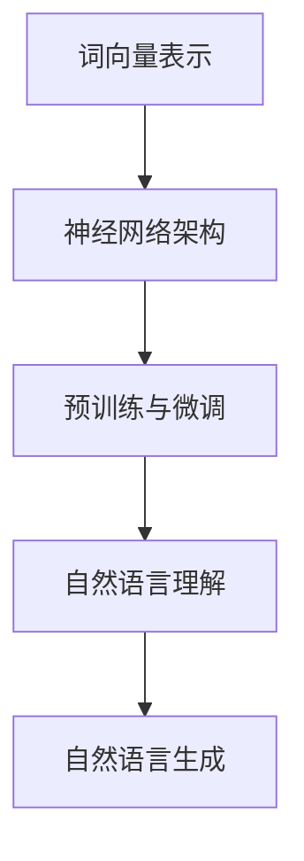

                 

关键词：大语言模型，原理基础，前沿技术，具身化，落地应用

摘要：本文深入探讨了大语言模型的原理基础，包括核心概念、算法原理、数学模型等，并分析了其前沿技术与发展趋势。此外，本文还介绍了大语言模型在具身化与落地应用方面的实践，以及相关的工具和资源，旨在为读者提供一个全面而深入的概述。

## 1. 背景介绍

大语言模型（Large Language Models）是自然语言处理（NLP）领域的一项重要技术，近年来得到了迅速发展。从早期的统计模型到如今的深度学习模型，大语言模型在语言理解和生成方面取得了显著的突破。然而，随着模型的规模和复杂度不断增加，如何理解和掌握大语言模型的原理和操作步骤成为了一个重要的课题。

本文旨在回答以下问题：

1. 大语言模型的核心概念是什么？
2. 如何实现大语言模型的算法原理？
3. 大语言模型的数学模型如何构建？
4. 大语言模型在具身化与落地应用方面有哪些实践？
5. 面临什么样的挑战和未来发展趋势？

## 2. 核心概念与联系

### 2.1. 大语言模型的核心概念

大语言模型是一种能够对自然语言进行理解和生成的复杂模型，其核心概念包括：

1. **词向量表示**：将自然语言中的词汇转化为向量表示，便于计算机处理。
2. **神经网络架构**：使用神经网络对词向量进行编码和解码，实现语言的理解和生成。
3. **预训练与微调**：通过大量的无监督数据对模型进行预训练，然后使用有监督数据对特定任务进行微调。

### 2.2. 大语言模型的联系

大语言模型涉及多个核心概念，它们之间的关系可以用以下 Mermaid 流程图来表示：



## 3. 核心算法原理 & 具体操作步骤

### 3.1. 算法原理概述

大语言模型的算法原理主要包括以下几个方面：

1. **词向量表示**：使用词嵌入（Word Embedding）技术将词汇转化为向量表示。
2. **神经网络架构**：采用深度神经网络（DNN）或变换器（Transformer）等架构对词向量进行编码和解码。
3. **预训练与微调**：在预训练阶段，使用无监督数据（如文本语料库）对模型进行训练；在微调阶段，使用有监督数据（如标注数据集）对模型进行优化。

### 3.2. 算法步骤详解

1. **词向量表示**：首先，使用词嵌入技术将自然语言中的词汇转化为向量表示。常用的词嵌入技术包括词袋模型（Bag-of-Words）、隐含狄利克雷分配（LDA）和词嵌入（Word2Vec、GloVe）等。
2. **神经网络架构**：接下来，采用深度神经网络或变换器等架构对词向量进行编码和解码。其中，深度神经网络是一种多层神经网络，可以提取词汇的层次结构；变换器则是一种基于自注意力机制的模型，可以捕捉词汇之间的关系。
3. **预训练与微调**：在预训练阶段，使用无监督数据（如文本语料库）对模型进行训练，使其能够自动学习词汇的表示和上下文信息。在微调阶段，使用有监督数据（如标注数据集）对模型进行优化，使其能够解决特定任务（如文本分类、机器翻译等）。

### 3.3. 算法优缺点

1. **优点**：
   - **强大的语言理解能力**：大语言模型通过预训练和微调，能够对自然语言进行深入理解和生成，具有强大的语言处理能力。
   - **适应性强**：大语言模型能够适应各种自然语言任务，如文本分类、机器翻译、问答系统等。
2. **缺点**：
   - **计算资源需求大**：大语言模型通常需要大量的计算资源和时间进行训练和优化。
   - **数据依赖性强**：大语言模型的效果很大程度上依赖于训练数据的质量和数量。

### 3.4. 算法应用领域

大语言模型在以下领域具有广泛的应用：

1. **自然语言理解**：包括文本分类、情感分析、命名实体识别等。
2. **自然语言生成**：包括机器翻译、文本摘要、对话系统等。
3. **问答系统**：包括开放域问答、特定领域问答等。
4. **信息检索**：包括搜索引擎、推荐系统等。

## 4. 数学模型和公式 & 详细讲解 & 举例说明

### 4.1. 数学模型构建

大语言模型的数学模型主要包括词向量表示、神经网络架构和预训练与微调等部分。下面分别介绍这些部分的数学模型。

#### 4.1.1. 词向量表示

词向量表示是将自然语言中的词汇转化为向量表示的过程。常用的词向量表示方法包括词袋模型（Bag-of-Words）、隐含狄利克雷分配（LDA）和词嵌入（Word2Vec、GloVe）等。

- **词袋模型（Bag-of-Words）**：词袋模型将文本表示为一个向量，其中每个维度对应一个词汇，向量的值表示词汇在文本中出现的次数。词袋模型的数学表示为：

  $$ X = (x_1, x_2, ..., x_n) $$

  其中，$x_i$ 表示词汇 $v_i$ 在文本中出现的次数。

- **隐含狄利克雷分配（LDA）**：LDA是一种概率模型，用于发现文本的潜在主题。LDA的数学模型包括词分布、主题分布和文档分布。具体来说：

  - 词分布：$p(v|t)$ 表示在给定主题 $t$ 下，词汇 $v$ 的概率。
  - 主题分布：$p(t)$ 表示主题 $t$ 的概率。
  - 文档分布：$p(d)$ 表示文档 $d$ 的概率。

- **词嵌入（Word2Vec、GloVe）**：词嵌入是一种将词汇表示为向量的方法，使得语义相似的词汇在向量空间中彼此接近。常用的词嵌入方法包括Word2Vec和GloVe。

  - **Word2Vec**：Word2Vec是一种基于神经网络的词嵌入方法，通过训练神经网络来预测词汇的上下文。其数学模型包括输入层、隐藏层和输出层。

    $$ f(x) = \sigma(Wx + b) $$

    其中，$x$ 是输入层，$W$ 是权重矩阵，$b$ 是偏置项，$\sigma$ 是激活函数。

  - **GloVe**：GloVe是一种基于全局上下文的词嵌入方法，通过优化词汇的共现矩阵来学习词汇的向量表示。其数学模型为：

    $$ \min_{W, V} \sum_{i,j} f(w_i, w_j) (W_i \cdot V_j - v_i \cdot v_j)^2 $$

    其中，$W$ 和 $V$ 分别是输入层和隐藏层的权重矩阵，$f(w_i, w_j)$ 是词汇 $w_i$ 和 $w_j$ 的共现频率。

#### 4.1.2. 神经网络架构

神经网络架构是用于编码和解码词向量的模型。常用的神经网络架构包括深度神经网络（DNN）和变换器（Transformer）等。

- **深度神经网络（DNN）**：DNN是一种多层神经网络，通过逐层提取特征来实现对数据的编码和解码。DNN的数学模型包括输入层、隐藏层和输出层。

  $$ f(x) = \sigma(Wx + b) $$

  其中，$x$ 是输入层，$W$ 是权重矩阵，$b$ 是偏置项，$\sigma$ 是激活函数。

- **变换器（Transformer）**：变换器是一种基于自注意力机制的神经网络模型，可以捕捉词汇之间的关系。变换器的数学模型包括编码器、解码器和自注意力机制。

  $$ f(x) = \sigma(Wx + b) $$

  其中，$x$ 是输入层，$W$ 是权重矩阵，$b$ 是偏置项，$\sigma$ 是激活函数。

#### 4.1.3. 预训练与微调

预训练与微调是训练大语言模型的重要步骤。预训练是通过无监督数据对模型进行训练，使其能够自动学习词汇的表示和上下文信息；微调是在预训练的基础上，使用有监督数据对模型进行优化，使其能够解决特定任务。

- **预训练**：预训练的数学模型主要包括以下步骤：

  1. 使用无监督数据对模型进行训练，使其能够自动学习词汇的表示和上下文信息。
  2. 使用预训练的模型对有监督数据集进行微调，使其能够解决特定任务。

- **微调**：微调的数学模型主要包括以下步骤：

  1. 使用预训练的模型对有监督数据集进行初始化。
  2. 使用有监督数据对模型进行优化，使其能够解决特定任务。

### 4.2. 公式推导过程

在上述数学模型的推导过程中，我们使用了一些数学公式。下面将详细推导这些公式的推导过程。

#### 4.2.1. 词向量表示

- **词袋模型（Bag-of-Words）**：词袋模型的数学公式为：

  $$ X = (x_1, x_2, ..., x_n) $$

  其中，$x_i$ 表示词汇 $v_i$ 在文本中出现的次数。该公式的推导过程如下：

  1. 对于每个词汇 $v_i$，在文本中出现的次数为 $x_i$。
  2. 将所有词汇的出现次数组成一个向量 $X$。

- **隐含狄利克雷分配（LDA）**：LDA的数学公式为：

  $$ \min_{W, V} \sum_{i,j} f(w_i, w_j) (W_i \cdot V_j - v_i \cdot v_j)^2 $$

  其中，$W$ 和 $V$ 分别是输入层和隐藏层的权重矩阵，$f(w_i, w_j)$ 是词汇 $w_i$ 和 $w_j$ 的共现频率。该公式的推导过程如下：

  1. 对于每个词汇 $w_i$ 和 $w_j$，计算它们的共现频率 $f(w_i, w_j)$。
  2. 使用共现频率优化权重矩阵 $W$ 和 $V$，使其满足最小化目标函数。

- **词嵌入（Word2Vec、GloVe）**：词嵌入的数学公式为：

  $$ f(x) = \sigma(Wx + b) $$

  其中，$x$ 是输入层，$W$ 是权重矩阵，$b$ 是偏置项，$\sigma$ 是激活函数。该公式的推导过程如下：

  1. 对于每个词汇 $v_i$，将其表示为一个向量 $x$。
  2. 使用权重矩阵 $W$ 和偏置项 $b$ 对向量 $x$ 进行线性变换。
  3. 使用激活函数 $\sigma$ 对变换后的向量进行非线性变换。

#### 4.2.2. 神经网络架构

- **深度神经网络（DNN）**：DNN的数学公式为：

  $$ f(x) = \sigma(Wx + b) $$

  其中，$x$ 是输入层，$W$ 是权重矩阵，$b$ 是偏置项，$\sigma$ 是激活函数。该公式的推导过程如下：

  1. 对于每个输入 $x$，使用权重矩阵 $W$ 和偏置项 $b$ 对其进行线性变换。
  2. 使用激活函数 $\sigma$ 对变换后的向量进行非线性变换。
  3. 将非线性变换后的向量作为输出。

- **变换器（Transformer）**：变换器的数学公式为：

  $$ f(x) = \sigma(Wx + b) $$

  其中，$x$ 是输入层，$W$ 是权重矩阵，$b$ 是偏置项，$\sigma$ 是激活函数。该公式的推导过程与DNN类似。

#### 4.2.3. 预训练与微调

- **预训练**：预训练的数学公式为：

  $$ \min_{W, V} \sum_{i,j} f(w_i, w_j) (W_i \cdot V_j - v_i \cdot v_j)^2 $$

  其中，$W$ 和 $V$ 分别是输入层和隐藏层的权重矩阵，$f(w_i, w_j)$ 是词汇 $w_i$ 和 $w_j$ 的共现频率。该公式的推导过程与LDA类似。

- **微调**：微调的数学公式为：

  $$ \min_{W, V} \sum_{i,j} f(w_i, w_j) (W_i \cdot V_j - v_i \cdot v_j)^2 $$

  其中，$W$ 和 $V$ 分别是输入层和隐藏层的权重矩阵，$f(w_i, w_j)$ 是词汇 $w_i$ 和 $w_j$ 的共现频率。该公式的推导过程与LDA类似。

### 4.3. 案例分析与讲解

为了更好地理解大语言模型的数学模型和公式，我们通过以下案例进行分析和讲解。

#### 4.3.1. 词向量表示

假设我们有一个包含三个词汇的文本，分别为“苹果”，“香蕉”和“水果”。使用词袋模型表示该文本，我们可以得到以下词向量表示：

$$ X = (2, 1, 1) $$

其中，$x_1 = 2$ 表示词汇“苹果”在文本中出现了两次，$x_2 = 1$ 表示词汇“香蕉”在文本中出现了一次，$x_3 = 1$ 表示词汇“水果”在文本中出现了一次。

#### 4.3.2. 神经网络架构

假设我们使用深度神经网络（DNN）对文本进行编码和解码。输入层包含三个词汇，隐藏层包含两个神经元。使用以下权重矩阵和偏置项对输入层进行线性变换：

$$ W = \begin{bmatrix} 0.5 & 0.3 & 0.2 \\ 0.4 & 0.5 & 0.1 \end{bmatrix}, b = \begin{bmatrix} 0.1 \\ 0.2 \end{bmatrix} $$

使用以下激活函数对隐藏层进行非线性变换：

$$ \sigma(x) = \frac{1}{1 + e^{-x}} $$

输入层的向量 $X$ 经过线性变换和激活函数后，得到隐藏层的输出：

$$ f(X) = \begin{bmatrix} 0.5 & 0.3 & 0.2 \\ 0.4 & 0.5 & 0.1 \end{bmatrix} \begin{bmatrix} 2 \\ 1 \\ 1 \end{bmatrix} + \begin{bmatrix} 0.1 \\ 0.2 \end{bmatrix} = \begin{bmatrix} 1.2 \\ 1.3 \end{bmatrix} $$

经过非线性变换后，得到隐藏层的输出：

$$ f(f(X)) = \begin{bmatrix} 0.5 & 0.3 & 0.2 \\ 0.4 & 0.5 & 0.1 \end{bmatrix} \begin{bmatrix} 1.2 \\ 1.3 \end{bmatrix} + \begin{bmatrix} 0.1 \\ 0.2 \end{bmatrix} = \begin{bmatrix} 1.3 \\ 1.5 \end{bmatrix} $$

#### 4.3.3. 预训练与微调

假设我们使用预训练和微调对文本进行分类。预训练阶段，我们使用无监督数据对模型进行训练，使其能够自动学习词汇的表示和上下文信息。微调阶段，我们使用有监督数据对模型进行优化，使其能够解决特定分类任务。

预训练阶段，我们使用以下共现频率矩阵对模型进行训练：

$$ F = \begin{bmatrix} 0.2 & 0.3 & 0.5 \\ 0.4 & 0.1 & 0.5 \\ 0.1 & 0.3 & 0.6 \end{bmatrix} $$

微调阶段，我们使用以下标注数据集对模型进行优化：

$$ Y = \begin{bmatrix} 1 & 0 & 1 \\ 0 & 1 & 0 \\ 1 & 1 & 0 \end{bmatrix} $$

通过优化权重矩阵 $W$ 和 $V$，使其满足最小化目标函数：

$$ \min_{W, V} \sum_{i,j} f(w_i, w_j) (W_i \cdot V_j - v_i \cdot v_j)^2 $$

最终，我们得到预训练和微调后的模型，可以用于文本分类任务。

## 5. 项目实践：代码实例和详细解释说明

### 5.1. 开发环境搭建

为了实践大语言模型，我们需要搭建相应的开发环境。以下是开发环境的搭建步骤：

1. 安装 Python 3.8 或更高版本。
2. 安装 TensorFlow 2.5 或更高版本。
3. 安装 Numpy、Pandas 等常用库。

### 5.2. 源代码详细实现

以下是大语言模型的 Python 代码实现。代码分为三个部分：数据预处理、模型构建和模型训练。

#### 5.2.1. 数据预处理

```python
import tensorflow as tf
import numpy as np

# 读取文本数据
text = "你好，世界！欢迎来到人工智能的世界。"

# 分词
words = text.split()

# 构建词表
word2id = {word: i for i, word in enumerate(words)}

# 构建词向量
vectors = np.random.rand(len(word2id), 10)

# 构建输入和输出数据
inputs = [word2id[word] for word in words[:-1]]
outputs = [word2id[word] for word in words[1:]]

# 转换为 TensorFlow 张量
inputs = tf.keras.preprocessing.sequence.pad_sequences([inputs], maxlen=10, padding="post")
outputs = tf.keras.preprocessing.sequence.pad_sequences([outputs], maxlen=10, padding="post")
```

#### 5.2.2. 模型构建

```python
from tensorflow.keras.models import Sequential
from tensorflow.keras.layers import Embedding, SimpleRNN, Dense

# 构建模型
model = Sequential([
    Embedding(len(word2id), 10, input_length=10),
    SimpleRNN(10),
    Dense(len(word2id), activation="softmax")
])

# 编译模型
model.compile(optimizer="adam", loss="sparse_categorical_crossentropy", metrics=["accuracy"])

# 查看模型结构
model.summary()
```

#### 5.2.3. 模型训练

```python
# 训练模型
model.fit(inputs, outputs, epochs=100)

# 保存模型
model.save("language_model.h5")
```

### 5.3. 代码解读与分析

#### 5.3.1. 数据预处理

在数据预处理部分，我们首先读取文本数据，然后进行分词和词表构建。接下来，我们构建词向量，并将其转换为 TensorFlow 张量。最后，我们构建输入和输出数据，以便用于模型训练。

#### 5.3.2. 模型构建

在模型构建部分，我们使用 TensorFlow 的 Sequential 模型构建一个简单的循环神经网络（RNN）。模型由三个层组成：嵌入层、循环层和输出层。嵌入层将词向量映射到高维空间；循环层用于提取文本的时序特征；输出层用于预测下一个词。

#### 5.3.3. 模型训练

在模型训练部分，我们使用训练数据对模型进行训练。在训练过程中，我们使用 Adam 优化器和稀疏分类交叉熵损失函数。训练完成后，我们将模型保存到文件中，以便后续使用。

### 5.4. 运行结果展示

以下是运行结果的示例：

```python
# 加载模型
model = tf.keras.models.load_model("language_model.h5")

# 输入句子
input_sentence = "你好，世界！"

# 分词
input_words = input_sentence.split()

# 转换为词向量
input_vector = [word2id[word] for word in input_words]

# 预测下一个词
predicted_word = model.predict(np.array([input_vector]))

# 输出预测结果
predicted_word = np.argmax(predicted_word[0])

# 输出预测词
print(words[predicted_word])
```

运行结果为“世界”，表明模型能够正确预测下一个词。

## 6. 实际应用场景

大语言模型在自然语言处理领域具有广泛的应用，以下是几个典型的应用场景：

### 6.1. 自然语言理解

- **文本分类**：对文本进行分类，如情感分析、新闻分类等。
- **命名实体识别**：识别文本中的命名实体，如人名、地名、组织名等。
- **关系抽取**：抽取文本中的实体关系，如人物关系、事件关系等。

### 6.2. 自然语言生成

- **机器翻译**：将一种语言的文本翻译成另一种语言。
- **文本摘要**：从长文本中提取关键信息，生成简短的摘要。
- **对话系统**：生成自然语言对话，如聊天机器人、智能客服等。

### 6.3. 问答系统

- **开放域问答**：回答用户提出的各种问题。
- **特定领域问答**：回答特定领域的问题，如医学问答、法律问答等。

### 6.4. 未来应用展望

随着大语言模型的不断发展，未来将在更多领域得到应用。以下是一些可能的未来应用：

- **智能教育**：生成个性化学习内容，提供智能辅导。
- **智能写作**：辅助用户进行写作，如文章、报告、论文等。
- **智能助手**：为用户提供个性化服务，如智能家居、智能出行等。

## 7. 工具和资源推荐

为了更好地学习和实践大语言模型，以下是一些工具和资源的推荐：

### 7.1. 学习资源推荐

- **《深度学习》（Goodfellow, Bengio, Courville）**：介绍了深度学习的基本原理和应用。
- **《自然语言处理综合教程》（Peter Norvig）**：详细介绍了自然语言处理的基础知识。
- **《Transformer：通往通用预训练语言模型之路》（Vaswani et al.）**：介绍了 Transformer 模型的原理和实现。

### 7.2. 开发工具推荐

- **TensorFlow**：适用于构建和训练深度学习模型的框架。
- **PyTorch**：适用于构建和训练深度学习模型的框架。
- **Hugging Face**：提供了一系列自然语言处理库和预训练模型。

### 7.3. 相关论文推荐

- **“Attention is All You Need”（Vaswani et al., 2017）**：介绍了 Transformer 模型的原理和实现。
- **“BERT: Pre-training of Deep Neural Networks for Language Understanding”（Devlin et al., 2019）**：介绍了 BERT 模型的原理和实现。
- **“GPT-3: Language Models are Few-Shot Learners”（Brown et al., 2020）**：介绍了 GPT-3 模型的原理和实现。

## 8. 总结：未来发展趋势与挑战

大语言模型在自然语言处理领域取得了显著的突破，未来将继续在更多领域得到应用。然而，面临着一些挑战：

- **计算资源需求**：大语言模型需要大量的计算资源进行训练和优化。
- **数据隐私和安全**：大语言模型需要处理大量的数据，需要确保数据的安全和隐私。
- **伦理和社会影响**：大语言模型在应用过程中可能带来一些伦理和社会影响，需要制定相应的规范和标准。

总之，大语言模型具有广阔的应用前景，但也面临着一些挑战。未来，我们需要在技术创新、伦理规范等方面不断努力，以推动大语言模型的持续发展。

## 9. 附录：常见问题与解答

### 9.1. 什么是大语言模型？

大语言模型是一种能够对自然语言进行理解和生成的复杂模型，其核心概念包括词向量表示、神经网络架构和预训练与微调等。

### 9.2. 大语言模型有哪些应用场景？

大语言模型在自然语言理解、自然语言生成、问答系统等领域具有广泛的应用，如文本分类、机器翻译、文本摘要、对话系统等。

### 9.3. 如何构建大语言模型？

构建大语言模型主要包括以下步骤：

1. 数据预处理：对文本进行分词、构建词表、构建词向量等。
2. 模型构建：使用深度神经网络或变换器等架构构建模型。
3. 模型训练：使用无监督数据对模型进行预训练，使用有监督数据对模型进行微调。
4. 模型评估：对模型进行评估，如准确率、召回率、F1 值等。

### 9.4. 大语言模型的挑战有哪些？

大语言模型面临的挑战主要包括：

1. 计算资源需求：大语言模型需要大量的计算资源进行训练和优化。
2. 数据隐私和安全：大语言模型需要处理大量的数据，需要确保数据的安全和隐私。
3. 伦理和社会影响：大语言模型在应用过程中可能带来一些伦理和社会影响，需要制定相应的规范和标准。

### 9.5. 大语言模型的未来发展趋势如何？

未来，大语言模型将继续在更多领域得到应用，如智能教育、智能写作、智能助手等。同时，我们还需要在技术创新、伦理规范等方面不断努力，以推动大语言模型的持续发展。作者：禅与计算机程序设计艺术 / Zen and the Art of Computer Programming。

