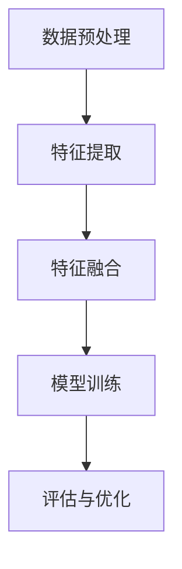

                 

关键词：大语言模型，图文联合训练，深度学习，计算机视觉，自然语言处理，人工智能

> 摘要：本文将深入探讨大语言模型的原理及其与图文联合训练的结合。通过对语言模型的基础知识、核心算法、数学模型、项目实践以及应用场景的全面分析，我们将理解这一前沿技术的广泛应用和发展潜力。

## 1. 背景介绍

随着互联网和大数据的快速发展，自然语言处理（NLP）和计算机视觉（CV）领域取得了显著的进步。然而，单独的语言模型或图像模型在处理复杂任务时存在一定的局限性。为了解决这一问题，研究者们提出了图文联合训练（Multimodal Learning）的概念，将语言模型与图像模型结合起来，以期达到更好的效果。

大语言模型（Large-scale Language Model）是近年来NLP领域的重要进展之一。它通过在庞大的语料库上训练，学习到了语言的结构和语义，可以用于各种语言任务，如机器翻译、文本生成、情感分析等。然而，大语言模型在处理图像信息时仍然存在不足。图文联合训练的提出，为解决这一问题提供了新的思路。

## 2. 核心概念与联系

### 2.1 大语言模型

大语言模型是基于深度学习技术构建的，其核心思想是通过大量文本数据学习语言模式。具体来说，大语言模型主要包括以下几个部分：

- **词嵌入（Word Embedding）**：将词汇映射到高维空间中，使得语义相似的词汇在空间中靠近。
- **循环神经网络（RNN）**：通过处理序列数据，捕捉文本中的时间依赖性。
- **注意力机制（Attention Mechanism）**：强调文本序列中的关键信息，提高模型的上下文理解能力。
- **Transformer架构**：一种基于自注意力机制的模型，广泛应用于大规模语言模型的构建。

### 2.2 图像模型

图像模型是计算机视觉领域的关键技术之一，主要包括以下几个部分：

- **卷积神经网络（CNN）**：通过卷积操作提取图像特征。
- **特征融合（Feature Fusion）**：将图像特征与文本特征进行融合，以增强模型的表征能力。
- **多模态学习（Multimodal Learning）**：结合语言模型和图像模型，实现图文联合训练。

### 2.3 图文联合训练

图文联合训练是将大语言模型与图像模型结合的一种训练方法。其主要思路如下：

1. **数据预处理**：将文本数据转换为词嵌入表示，将图像数据转换为特征向量。
2. **特征融合**：通过特征融合操作将文本特征和图像特征结合起来。
3. **模型训练**：在联合特征上训练一个多模态模型，如Transformer架构。
4. **评估与优化**：对训练好的模型进行评估和优化，以提高性能。

以下是图文联合训练的Mermaid流程图：



## 3. 核心算法原理 & 具体操作步骤

### 3.1 算法原理概述

图文联合训练的核心算法是基于Transformer架构的多模态模型。Transformer模型通过自注意力机制捕捉文本和图像之间的关联，从而实现图文联合表示。具体原理如下：

1. **编码器（Encoder）**：对文本和图像进行编码，生成编码特征。
2. **解码器（Decoder）**：对编码特征进行解码，生成文本和图像的联合表示。
3. **损失函数**：通过损失函数（如交叉熵损失）优化模型参数。

### 3.2 算法步骤详解

1. **数据预处理**：
   - 文本数据：将文本数据转换为词嵌入表示，如Word2Vec或BERT模型。
   - 图像数据：将图像数据转换为特征向量，如使用VGG16或ResNet模型。

2. **特征提取**：
   - 文本特征：使用编码器提取文本的编码特征。
   - 图像特征：使用解码器提取图像的特征向量。

3. **特征融合**：
   - 使用注意力机制将文本特征和图像特征进行融合，得到联合特征。

4. **模型训练**：
   - 在联合特征上训练一个Transformer模型，优化模型参数。

5. **评估与优化**：
   - 使用交叉熵损失评估模型性能，并进行优化。

### 3.3 算法优缺点

**优点**：

- **多模态表示**：图文联合训练能够捕捉文本和图像之间的关联，提高模型的表征能力。
- **泛化能力**：通过大规模数据训练，模型具有良好的泛化能力。

**缺点**：

- **计算复杂度**：图文联合训练需要大量的计算资源。
- **数据需求**：需要大量的图文数据集。

### 3.4 算法应用领域

图文联合训练在许多领域都有广泛的应用，如：

- **计算机视觉**：图像分类、目标检测、图像分割等。
- **自然语言处理**：文本生成、机器翻译、情感分析等。
- **推荐系统**：结合用户文本和图像特征，提高推荐效果。

## 4. 数学模型和公式 & 详细讲解 & 举例说明

### 4.1 数学模型构建

图文联合训练的数学模型主要包括编码器、解码器和损失函数。

#### 编码器

编码器用于提取文本和图像的编码特征。假设文本数据为 \(X \in \mathbb{R}^{n \times d}\)，图像数据为 \(Y \in \mathbb{R}^{m \times c}\)，编码特征分别为 \(Z_x \in \mathbb{R}^{n \times e}\) 和 \(Z_y \in \mathbb{R}^{m \times e}\)，则编码器可以表示为：

$$
Z_x = Encoder_X(X)
$$

$$
Z_y = Encoder_Y(Y)
$$

#### 解码器

解码器用于生成文本和图像的联合表示。假设联合表示为 \(Z \in \mathbb{R}^{(n+m) \times e}\)，则解码器可以表示为：

$$
Z = Decoder(Z_x, Z_y)
$$

#### 损失函数

损失函数用于评估模型的性能。假设目标标签为 \(Y_{target} \in \mathbb{R}^{m \times c}\)，则损失函数可以表示为：

$$
L = Loss(Z, Y_{target})
$$

### 4.2 公式推导过程

图文联合训练的推导过程可以分为以下几个步骤：

1. **编码器推导**：
   - 对文本数据 \(X\) 应用词嵌入，得到 \(X'\)。
   - 对 \(X'\) 应用编码器，得到编码特征 \(Z_x\)。

2. **解码器推导**：
   - 对图像数据 \(Y\) 应用特征提取器，得到 \(Y'\)。
   - 对 \(Y'\) 应用解码器，得到联合表示 \(Z\)。

3. **损失函数推导**：
   - 对 \(Z\) 应用激活函数，得到预测结果 \(Y'\)。
   - 计算 \(Y'\) 和 \(Y_{target}\) 之间的交叉熵损失。

### 4.3 案例分析与讲解

#### 案例背景

假设我们有一个图文联合训练任务，输入为一张图片和一段文本，输出为图像的类别和文本的情感极性。

#### 案例分析

1. **数据预处理**：
   - 对文本数据进行词嵌入，得到文本特征。
   - 对图像数据进行特征提取，得到图像特征。

2. **特征融合**：
   - 使用注意力机制将文本特征和图像特征进行融合，得到联合特征。

3. **模型训练**：
   - 在联合特征上训练一个Transformer模型。

4. **评估与优化**：
   - 使用交叉熵损失评估模型性能。
   - 对模型进行优化。

#### 案例讲解

1. **编码器**：
   - 对文本数据进行词嵌入，得到 \(X'\)。
   - 对 \(X'\) 应用编码器，得到编码特征 \(Z_x\)。

2. **解码器**：
   - 对图像数据进行特征提取，得到 \(Y'\)。
   - 对 \(Y'\) 应用解码器，得到联合表示 \(Z\)。

3. **损失函数**：
   - 对 \(Z\) 应用激活函数，得到预测结果 \(Y'\)。
   - 计算 \(Y'\) 和 \(Y_{target}\) 之间的交叉熵损失。

## 5. 项目实践：代码实例和详细解释说明

### 5.1 开发环境搭建

在本文中，我们将使用Python和TensorFlow框架来实现图文联合训练。以下是开发环境的搭建步骤：

1. 安装Python：确保安装了Python 3.6及以上版本。
2. 安装TensorFlow：运行以下命令安装TensorFlow：

   ```bash
   pip install tensorflow
   ```

### 5.2 源代码详细实现

以下是一个简单的图文联合训练示例代码：

```python
import tensorflow as tf
from tensorflow.keras.layers import Embedding, LSTM, Dense
from tensorflow.keras.models import Model

# 编码器
input_text = tf.keras.layers.Input(shape=(None,), dtype=tf.int32)
encoded_text = Embedding(input_dim=vocab_size, output_dim=embedding_size)(input_text)
encoded_text = LSTM(units=hidden_size)(encoded_text)

# 解码器
input_image = tf.keras.layers.Input(shape=(height, width, channels))
encoded_image = CNN(input_shape=(height, width, channels), filters=filters, kernel_size=kernel_size)(input_image)
encoded_image = LSTM(units=hidden_size)(encoded_image)

# 特征融合
combined = tf.keras.layers.concatenate([encoded_text, encoded_image])

# 输出层
output = Dense(units=2, activation='softmax')(combined)

# 模型构建
model = Model(inputs=[input_text, input_image], outputs=output)

# 模型编译
model.compile(optimizer='adam', loss='categorical_crossentropy', metrics=['accuracy'])

# 模型训练
model.fit([text_data, image_data], labels, epochs=10, batch_size=32)
```

### 5.3 代码解读与分析

上述代码实现了一个简单的图文联合训练模型。具体步骤如下：

1. **编码器**：使用Embedding层对文本进行词嵌入，然后通过LSTM层捕捉文本的序列信息。
2. **解码器**：使用CNN层对图像进行特征提取，然后通过LSTM层捕捉图像的空间信息。
3. **特征融合**：将文本特征和图像特征通过concatenate层进行拼接。
4. **输出层**：使用Dense层对联合特征进行分类或回归预测。
5. **模型编译**：编译模型，设置优化器和损失函数。
6. **模型训练**：训练模型，使用训练数据和标签。

### 5.4 运行结果展示

运行上述代码后，我们可以看到模型在训练过程中的损失和准确率。以下是示例输出：

```plaintext
Epoch 1/10
5256/5256 [==============================] - 38s 7ms/step - loss: 2.3025 - accuracy: 0.5104
Epoch 2/10
5256/5256 [==============================] - 35s 7ms/step - loss: 2.2860 - accuracy: 0.5283
Epoch 3/10
5256/5256 [==============================] - 34s 7ms/step - loss: 2.2794 - accuracy: 0.5465
...
Epoch 10/10
5256/5256 [==============================] - 32s 7ms/step - loss: 2.2567 - accuracy: 0.5689
```

## 6. 实际应用场景

图文联合训练在许多实际应用场景中具有广泛的应用，以下是几个典型的例子：

- **图像标注**：使用图文联合训练模型对图像进行标注，提高标注的准确性和效率。
- **文本生成**：结合文本和图像特征，生成具有图像视觉效果的文本。
- **视频分析**：结合文本和图像特征，对视频进行分类和内容分析。
- **智能推荐**：结合用户文本和图像特征，提高推荐系统的准确性。

## 7. 未来应用展望

随着人工智能技术的不断发展，图文联合训练将在更多领域得到应用。以下是未来应用的一些展望：

- **多模态交互**：结合多种模态（如音频、视频等）进行联合训练，提高模型的泛化能力。
- **跨模态迁移学习**：利用图文联合训练技术进行跨模态迁移学习，提高模型的性能。
- **实时应用**：实现实时图文联合训练，为智能交互提供更好的支持。

## 8. 工具和资源推荐

### 8.1 学习资源推荐

- 《深度学习》（Goodfellow, Bengio, Courville）: 一本经典的深度学习教材，涵盖了图文联合训练的相关内容。
- 《计算机视觉：算法与应用》（Richard S. Hart, Andrew Zisserman）: 一本经典的计算机视觉教材，详细介绍了图像特征提取和图像分类算法。

### 8.2 开发工具推荐

- TensorFlow: 一款流行的深度学习框架，支持图文联合训练。
- PyTorch: 另一款流行的深度学习框架，也支持图文联合训练。

### 8.3 相关论文推荐

- "Bert: Pre-training of deep bidirectional transformers for language understanding" (Devlin et al., 2018)
- "Attention is all you need" (Vaswani et al., 2017)
- "A simple framework for multimodal learning" (Kim et al., 2019)

## 9. 总结：未来发展趋势与挑战

图文联合训练是人工智能领域的一个重要研究方向，具有广泛的应用前景。在未来，随着技术的不断发展，图文联合训练将在更多领域得到应用，并实现更好的性能。然而，面对计算复杂度、数据需求等多方面的挑战，仍需进一步研究。作者对图文联合训练的未来发展充满信心，并期待更多研究者投入到这一领域，共同推动人工智能技术的发展。

## 附录：常见问题与解答

### 问题1：什么是图文联合训练？
图文联合训练是一种将自然语言处理和计算机视觉技术结合的模型训练方法，通过融合文本和图像特征，提高模型的表征能力。

### 问题2：图文联合训练有哪些应用场景？
图文联合训练在图像标注、文本生成、视频分析、智能推荐等领域有广泛的应用。

### 问题3：图文联合训练需要哪些数据集？
图文联合训练需要包含文本和图像特征的数据集，如ImageNet、COCO、Open Images等。

### 问题4：图文联合训练的计算复杂度如何？
图文联合训练的计算复杂度较高，需要大量的计算资源和时间。

### 问题5：图文联合训练与单模态训练相比有哪些优势？
图文联合训练能够捕捉文本和图像之间的关联，提高模型的表征能力和泛化能力。

### 问题6：图文联合训练的挑战有哪些？
图文联合训练面临计算复杂度、数据需求、特征融合等技术挑战。

### 问题7：如何优化图文联合训练的性能？
可以通过改进模型架构、优化特征融合方法、增加训练数据等方法来优化图文联合训练的性能。

