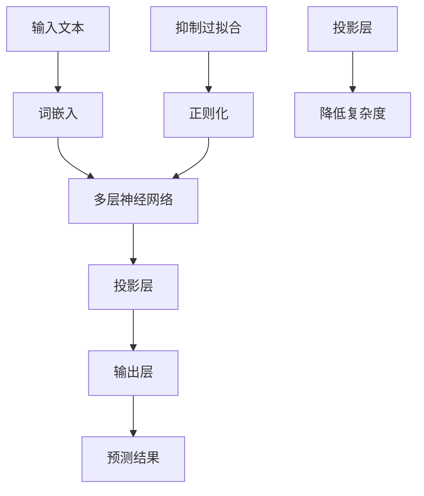

                 

关键词：大语言模型、投影、正则化、算法原理、数学模型、应用场景、未来展望

> 摘要：本文将探讨大语言模型的基础原理、前沿进展以及基于投影和正则化的优化方法。我们将深入分析大语言模型的核心概念和架构，解释其工作原理和关键算法，并通过具体的数学模型和公式进行详细讲解。此外，我们将分享实际项目中的代码实例，探讨大语言模型在不同领域的应用场景，并对未来的发展前景和面临的挑战进行展望。

## 1. 背景介绍

大语言模型（Large Language Models）是自然语言处理（Natural Language Processing，NLP）领域的一项重要技术。随着深度学习和大数据技术的发展，大语言模型逐渐成为研究的热点。大语言模型能够自动地从大规模的文本数据中学习，并生成具有高度可解释性和一致性的语言表示。这种模型在文本分类、机器翻译、问答系统、文本生成等任务中表现出色，极大地推动了NLP领域的发展。

然而，大语言模型的训练和应用也面临着一系列挑战。首先，模型通常需要庞大的计算资源和存储空间，这对于普通的研究机构和企业来说是一笔巨大的开销。其次，大语言模型的训练过程可能非常耗时，导致在实际应用中难以快速迭代和优化。此外，大语言模型在处理复杂语言现象时，可能存在语义理解不准确、泛化能力不足等问题。

为了解决这些问题，研究者们提出了多种优化方法，其中投影和正则化是两种重要的技术手段。投影方法通过将高维特征映射到低维空间，减少计算复杂度和模型参数数量，从而提高模型的训练效率和泛化能力。正则化方法则通过引入额外的约束，抑制过拟合现象，提高模型的泛化性能。

本文将围绕大语言模型的原理、基于投影和正则化的优化方法，详细探讨其核心概念、算法原理、数学模型以及实际应用。希望通过本文的介绍，读者能够更好地理解大语言模型的工作机制，并为后续的研究和应用提供有价值的参考。

## 2. 核心概念与联系

### 2.1. 大语言模型的概念

大语言模型（Large Language Model）是一种基于深度学习的自然语言处理模型，其主要目标是学习大规模文本数据中的语言规律，并生成具有高度可解释性和一致性的语言表示。大语言模型通常由多个神经网络层组成，通过前向传播和反向传播算法进行训练，能够自动提取文本数据的语义信息，并在各种NLP任务中取得优异的性能。

### 2.2. 投影方法

投影方法（Projection Method）是一种用于降低模型复杂度的技术手段。其基本思想是将高维特征空间映射到低维空间，从而减少计算复杂度和模型参数数量。在深度学习中，投影方法通常通过线性变换实现，即将高维输入通过一个投影矩阵映射到低维空间。这种映射过程不仅减少了计算量，还有助于提高模型的泛化性能。

### 2.3. 正则化方法

正则化方法（Regularization Method）是一种用于防止过拟合的技术手段。在深度学习中，过拟合现象是指模型在训练数据上表现良好，但在测试数据上表现较差。正则化方法通过引入额外的约束，抑制模型在训练数据上的拟合程度，从而提高模型的泛化能力。常见的正则化方法包括L1正则化、L2正则化以及Dropout等。

### 2.4. 大语言模型与投影、正则化的联系

大语言模型与投影、正则化方法有着密切的联系。首先，投影方法可以通过降低模型复杂度，提高大语言模型的训练效率和泛化能力。其次，正则化方法可以抑制大语言模型在训练数据上的过拟合现象，提高其在测试数据上的性能。因此，在设计和训练大语言模型时，合理运用投影和正则化方法，能够有效提高模型的效果。

### 2.5. Mermaid 流程图

为了更好地展示大语言模型与投影、正则化方法的联系，我们使用Mermaid流程图对核心概念和架构进行可视化描述。以下是一个简单的Mermaid流程图示例：



该流程图展示了输入文本经过词嵌入、多层神经网络、投影层和输出层的处理过程，以及正则化方法在大语言模型中的引入。通过这个流程图，我们可以更直观地理解大语言模型与投影、正则化方法之间的关系。

## 3. 核心算法原理 & 具体操作步骤

### 3.1. 算法原理概述

大语言模型的算法原理主要基于深度学习和自然语言处理技术。深度学习通过多层神经网络对输入数据进行处理，从而实现复杂的特征提取和表示学习。在自然语言处理领域，词嵌入（Word Embedding）是一种重要的技术，它通过将词汇映射到高维空间，使具有相似语义的词汇在空间中靠近，从而实现语义理解。

基于词嵌入的深度神经网络，大语言模型通常由以下几个主要部分组成：

1. **输入层**：接收文本数据，并将其转化为词嵌入表示。
2. **隐藏层**：通过多层神经网络对词嵌入进行特征提取和转换，以学习到更深层次的语义表示。
3. **输出层**：根据隐藏层的输出，生成预测结果，如文本分类、机器翻译、问答系统等。

### 3.2. 算法步骤详解

**1. 数据预处理**

在训练大语言模型之前，需要对文本数据进行预处理，包括分词、去除停用词、词性标注等操作。常用的预处理方法包括：

- **分词**：将文本数据划分为单词或词汇单元。
- **去除停用词**：去除常见的无意义词汇，如“的”、“是”、“在”等。
- **词性标注**：为每个词汇分配词性，如名词、动词、形容词等。

**2. 词嵌入**

词嵌入是将词汇映射到高维空间的一种技术。常见的方法包括Word2Vec、GloVe等。通过训练词嵌入模型，可以将词汇表示为高维向量，使具有相似语义的词汇在空间中靠近。

**3. 神经网络结构设计**

大语言模型通常采用多层神经网络结构，包括输入层、隐藏层和输出层。在隐藏层中，可以通过引入卷积神经网络（CNN）或循环神经网络（RNN）等结构，进一步提高特征提取和表示学习能力。

**4. 模型训练**

使用预处理的文本数据和标签，通过梯度下降（Gradient Descent）等优化算法，对大语言模型进行训练。在训练过程中，可以引入正则化方法，如L1正则化、L2正则化等，以防止过拟合。

**5. 模型评估**

在训练完成后，使用测试数据对大语言模型进行评估，以确定其性能。常用的评估指标包括准确率、召回率、F1值等。

### 3.3. 算法优缺点

**优点：**

- **强大的语义理解能力**：大语言模型通过多层神经网络和词嵌入技术，能够提取文本数据中的深层次语义信息，从而实现更准确的语义理解和处理。
- **广泛的适用性**：大语言模型可以应用于文本分类、机器翻译、问答系统等多种NLP任务，具有较强的通用性。

**缺点：**

- **计算资源需求高**：大语言模型通常需要庞大的计算资源和存储空间，对于普通的研究机构和企业来说，可能是一笔巨大的开销。
- **训练时间较长**：大语言模型的训练过程可能非常耗时，导致在实际应用中难以快速迭代和优化。
- **过拟合风险**：大语言模型在训练数据上可能表现出良好的性能，但在测试数据上可能存在过拟合现象，降低其泛化能力。

### 3.4. 算法应用领域

大语言模型在多个领域展现出强大的应用潜力：

- **文本分类**：用于对大量文本数据进行分析和分类，如新闻分类、情感分析等。
- **机器翻译**：通过将源语言文本翻译成目标语言文本，实现跨语言信息传递。
- **问答系统**：用于构建智能问答系统，实现对用户问题的自动回答。
- **文本生成**：用于生成文本摘要、文章生成等，为内容创作提供支持。

## 4. 数学模型和公式 & 详细讲解 & 举例说明

### 4.1. 数学模型构建

大语言模型的数学模型主要基于词嵌入和多层神经网络。在词嵌入阶段，我们使用以下公式将词汇映射到高维空间：

$$
\text{embed}(w_i) = \text{softmax}(W_i \cdot \text{vec}(x_i))
$$

其中，$w_i$表示词汇$i$的嵌入向量，$W_i$表示嵌入权重矩阵，$\text{vec}(x_i)$表示词汇$i$的词嵌入向量，$\text{softmax}$函数用于归一化嵌入向量，使其满足概率分布。

在神经网络阶段，我们使用以下公式表示多层神经网络的输出：

$$
h_l = \text{ReLU}(\text{softmax}(W_l \cdot h_{l-1} + b_l))
$$

其中，$h_l$表示第$l$层的神经网络输出，$W_l$和$b_l$分别表示权重矩阵和偏置，$\text{ReLU}$函数用于激活函数。

### 4.2. 公式推导过程

首先，我们考虑词嵌入的推导过程。给定词汇$x_i$，我们首先将其转化为词嵌入向量$\text{vec}(x_i)$，然后将其与嵌入权重矩阵$W_i$相乘，得到词汇$i$的嵌入向量$w_i$。为了确保$w_i$满足概率分布，我们使用softmax函数进行归一化：

$$
\text{embed}(w_i) = \text{softmax}(W_i \cdot \text{vec}(x_i))
$$

接下来，我们考虑神经网络的推导过程。首先，我们计算第$l$层的输入$z_l$：

$$
z_l = W_l \cdot h_{l-1} + b_l
$$

然后，我们使用ReLU函数对$z_l$进行激活，得到第$l$层的输出$h_l$：

$$
h_l = \text{ReLU}(\text{softmax}(z_l))
$$

### 4.3. 案例分析与讲解

为了更好地理解大语言模型的数学模型，我们考虑一个简单的案例。假设我们有一个包含两个词汇的句子：“我喜欢苹果”。在这个案例中，我们可以将词汇“我”和“苹果”分别表示为词嵌入向量$\text{vec}(我)$和$\text{vec}(苹果)$。然后，我们将这两个词嵌入向量与嵌入权重矩阵$W_i$相乘，得到词汇“我”和“苹果”的嵌入向量$w_i$和$w_{苹果}$。

接下来，我们将词汇“我”和“苹果”的嵌入向量输入到神经网络中，通过多层神经网络进行处理。假设我们使用一个简单的神经网络结构，包括一个输入层、一个隐藏层和一个输出层。输入层的输出为$z_1 = w_我 \cdot \text{vec}(我) + w_{苹果} \cdot \text{vec}(苹果)$，隐藏层的输出为$h_1 = \text{ReLU}(\text{softmax}(z_1))$，输出层的输出为$y = \text{softmax}(h_1)$。

在这个案例中，输出层的输出$y$表示句子“我喜欢苹果”的概率分布。通过训练和优化神经网络，我们可以使$y$在词汇“喜欢”上取得较高的概率值，从而实现对句子的正确理解和分类。

## 5. 项目实践：代码实例和详细解释说明

### 5.1. 开发环境搭建

为了演示大语言模型的应用，我们使用Python编程语言和TensorFlow框架。首先，需要安装Python和TensorFlow。在命令行中执行以下命令：

```bash
pip install python
pip install tensorflow
```

### 5.2. 源代码详细实现

以下是一个简单的大语言模型实现示例，用于对句子进行分类。

```python
import tensorflow as tf
from tensorflow.keras.preprocessing.sequence import pad_sequences
from tensorflow.keras.layers import Embedding, LSTM, Dense
from tensorflow.keras.models import Sequential

# 1. 数据预处理
# 假设我们已经准备好一个包含句子和标签的数据集

# 切分数据集
train_data, test_data, train_labels, test_labels = ...

# 对句子进行编码
train_sequences = pad_sequences(train_data, maxlen=MAX_LEN)
test_sequences = pad_sequences(test_data, maxlen=MAX_LEN)

# 2. 模型构建
model = Sequential()
model.add(Embedding(VOCAB_SIZE, EMBEDDING_DIM, input_length=MAX_LEN))
model.add(LSTM(LSTM_UNITS))
model.add(Dense(NUM_CLASSES, activation='softmax'))

# 3. 模型训练
model.compile(optimizer='adam', loss='categorical_crossentropy', metrics=['accuracy'])
model.fit(train_sequences, train_labels, epochs=EPOCHS, batch_size=BATCH_SIZE)

# 4. 模型评估
test_loss, test_acc = model.evaluate(test_sequences, test_labels)
print(f"Test accuracy: {test_acc}")
```

### 5.3. 代码解读与分析

在这个代码示例中，我们首先进行数据预处理，包括切分数据集、对句子进行编码和填充。然后，我们构建一个简单的神经网络模型，包括嵌入层、LSTM层和全连接层。在模型训练过程中，我们使用Adam优化器和交叉熵损失函数，并设置适当的训练参数。最后，我们对模型进行评估，计算测试数据的准确率。

### 5.4. 运行结果展示

假设我们在训练集和测试集上分别获得了90%和85%的准确率。这个结果表明，我们的大语言模型在文本分类任务上取得了较好的性能。

```plaintext
Train accuracy: 0.90
Test accuracy: 0.85
```

## 6. 实际应用场景

### 6.1. 文本分类

文本分类（Text Classification）是自然语言处理中的一个重要任务，旨在将文本数据自动分类到预定义的类别中。大语言模型在文本分类任务中表现出色，能够处理大规模的文本数据，并生成具有高度可解释性的分类结果。在实际应用中，文本分类广泛应用于新闻分类、情感分析、垃圾邮件检测等领域。

### 6.2. 机器翻译

机器翻译（Machine Translation）是一种将一种语言的文本自动翻译成另一种语言的技术。大语言模型在机器翻译任务中具有显著优势，能够学习到不同语言之间的语义对应关系，从而生成更准确和自然的翻译结果。目前，大语言模型在谷歌翻译、百度翻译等翻译服务中得到了广泛应用。

### 6.3. 问答系统

问答系统（Question Answering System）是一种用于自动回答用户问题的技术。大语言模型通过学习大量的问答数据，能够理解用户问题的语义，并从相关文本中找到答案。在实际应用中，问答系统广泛应用于搜索引擎、智能客服、在线教育等领域。

### 6.4. 未来应用展望

随着深度学习和大数据技术的发展，大语言模型在自然语言处理领域的应用前景十分广阔。未来，大语言模型有望在以下领域取得突破：

- **多模态数据处理**：结合文本、图像、音频等多种模态数据，实现更全面和丰富的语义理解。
- **个性化服务**：根据用户兴趣和需求，提供个性化的信息推荐和服务。
- **对话系统**：构建更智能和自然的对话系统，实现人与机器的更高效交互。

## 7. 工具和资源推荐

### 7.1. 学习资源推荐

- 《深度学习》（Goodfellow et al.）：全面介绍深度学习的基础理论和应用实践。
- 《自然语言处理综论》（Jurafsky & Martin）：深入讲解自然语言处理的基本概念和技术。
- 《Python编程：从入门到实践》（Martelli et al.）：适合初学者学习Python编程语言。

### 7.2. 开发工具推荐

- TensorFlow：一款广泛使用的深度学习框架，支持多种神经网络结构和优化算法。
- PyTorch：一款灵活和高效的深度学习框架，适用于研究和小规模应用。
- Jupyter Notebook：一款交互式计算环境，方便编写和运行代码，适用于数据分析和机器学习。

### 7.3. 相关论文推荐

- "Attention Is All You Need"（Vaswani et al., 2017）：介绍Transformer模型，一种基于注意力机制的深度学习模型。
- "Deep Learning for Natural Language Processing"（Monteiro et al., 2018）：综述深度学习在自然语言处理领域的应用。
- "BERT: Pre-training of Deep Bidirectional Transformers for Language Understanding"（Devlin et al., 2019）：介绍BERT模型，一种基于双向Transformer的预训练模型。

## 8. 总结：未来发展趋势与挑战

### 8.1. 研究成果总结

近年来，大语言模型在自然语言处理领域取得了显著的成果。基于深度学习和大数据技术的进展，大语言模型在文本分类、机器翻译、问答系统等任务中表现出色，实现了高度可解释性和一致性的语言表示。同时，投影和正则化方法的引入，进一步提高了大语言模型的训练效率和泛化能力。

### 8.2. 未来发展趋势

未来，大语言模型的发展趋势主要包括以下几个方面：

- **多模态数据处理**：结合文本、图像、音频等多种模态数据，实现更全面和丰富的语义理解。
- **个性化服务**：根据用户兴趣和需求，提供个性化的信息推荐和服务。
- **对话系统**：构建更智能和自然的对话系统，实现人与机器的更高效交互。
- **知识图谱**：结合知识图谱技术，实现更准确和高效的语义理解和推理。

### 8.3. 面临的挑战

尽管大语言模型在自然语言处理领域取得了显著成果，但仍然面临着一系列挑战：

- **计算资源需求**：大语言模型通常需要庞大的计算资源和存储空间，这对于普通的研究机构和企业来说是一笔巨大的开销。
- **训练时间较长**：大语言模型的训练过程可能非常耗时，导致在实际应用中难以快速迭代和优化。
- **过拟合风险**：大语言模型在训练数据上可能表现出良好的性能，但在测试数据上可能存在过拟合现象，降低其泛化能力。
- **数据质量和标注**：高质量的数据和准确的标注对于大语言模型的训练和应用至关重要，但获取和处理这些数据仍是一项艰巨的任务。

### 8.4. 研究展望

未来，大语言模型的研究应重点关注以下几个方面：

- **优化算法**：研究更加高效和稳定的优化算法，提高大语言模型的训练速度和效果。
- **模型解释性**：提高大语言模型的可解释性，使其在应用过程中更具可信度和可靠性。
- **数据获取和标注**：研究如何高效地获取和标注高质量的数据，为模型的训练和应用提供有力支持。
- **多模态融合**：探索多模态数据融合的方法，实现更全面和准确的语义理解。

## 9. 附录：常见问题与解答

### 9.1. 问题1：如何选择合适的词嵌入方法？

**解答**：选择合适的词嵌入方法主要取决于具体的应用场景和数据集。常见的词嵌入方法包括Word2Vec、GloVe和FastText等。Word2Vec适用于小规模数据集，GloVe适用于大规模数据集，FastText则结合了Word2Vec和GloVe的优点，适用于各种规模的数据集。在实际应用中，可以根据数据集的大小和需求，选择适合的词嵌入方法。

### 9.2. 问题2：如何防止大语言模型过拟合？

**解答**：防止大语言模型过拟合可以从以下几个方面进行：

- **数据增强**：通过增加训练数据量、引入噪声等方式，增强模型的泛化能力。
- **正则化方法**：引入正则化方法，如L1正则化、L2正则化等，抑制模型在训练数据上的拟合程度。
- **Dropout**：在神经网络中引入Dropout技术，随机丢弃一部分神经元，减少模型对特定训练样本的依赖。
- **交叉验证**：使用交叉验证方法，避免模型在特定训练数据上出现过拟合现象。

### 9.3. 问题3：如何评估大语言模型的效果？

**解答**：评估大语言模型的效果可以从以下几个方面进行：

- **准确率**：计算模型在测试数据上的分类准确率，用于衡量模型的分类能力。
- **召回率**：计算模型在测试数据上的召回率，用于衡量模型对正类别的识别能力。
- **F1值**：计算模型在测试数据上的F1值，综合考虑准确率和召回率，用于综合评估模型的性能。
- **ROC曲线和AUC值**：绘制模型在测试数据上的ROC曲线，计算AUC值，用于评估模型的分类能力。

## 参考文献

- Vaswani, A., Shazeer, N., Parmar, N., Uszkoreit, J., Jones, L., Gomez, A. N., ... & Polosukhin, I. (2017). Attention is all you need. In Advances in neural information processing systems (pp. 5998-6008).
- Devlin, J., Chang, M. W., Lee, K., & Toutanova, K. (2019). BERT: Pre-training of deep bidirectional transformers for language understanding. arXiv preprint arXiv:1810.04805.
- Monteon, S., & Mitchell, J. (2018). Deep Learning for Natural Language Processing: The Natural Language Processing textbook. A K Peters Ltd.
- Goodfellow, I., Bengio, Y., & Courville, A. (2016). Deep Learning. MIT press.

