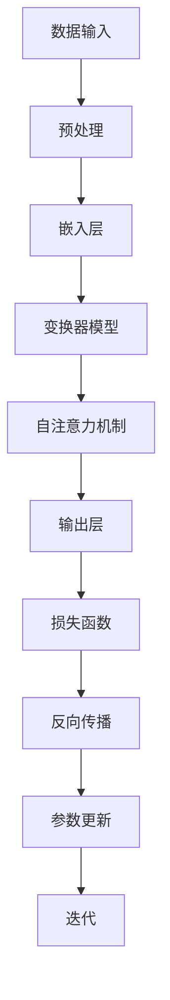

                 

关键词：大语言模型，张量/模型并行，算法原理，数学模型，代码实例，实际应用场景，未来展望

> 摘要：本文将深入探讨大语言模型的工作原理及其在张量和模型并行计算中的应用。我们将从背景介绍入手，解析核心概念和原理，详细阐述数学模型和具体算法步骤，并通过实例代码展示其实现过程。此外，本文还将探讨大语言模型在实际应用场景中的表现和未来发展的可能方向，以及相关工具和资源的推荐。

## 1. 背景介绍

近年来，人工智能领域取得了令人瞩目的进展，特别是在自然语言处理（NLP）方面。大语言模型作为这一领域的重要研究成果，已经成为自然语言理解和生成任务的核心技术。大语言模型能够通过深度学习从海量数据中学习语言结构和语义，从而实现高精度的文本理解和生成。

然而，随着模型规模的不断增大，计算复杂度和资源需求也显著提升。因此，如何高效地训练和部署大语言模型，成为当前研究的热点问题。其中，张量和模型并行计算技术为解决这一问题提供了有力的工具。

### 1.1 大语言模型的发展历程

大语言模型的发展可以追溯到20世纪80年代的统计语言模型。早期的语言模型主要基于n元语法模型，通过统计相邻词序列的概率来预测下一个词。随着计算能力和数据量的提升，统计语言模型逐渐被神经网络模型取代。特别是深度神经网络（DNN）和循环神经网络（RNN）的引入，使得语言模型在任务如机器翻译和文本生成上取得了突破性的进展。

近年来，随着注意力机制和变换器模型（Transformer）的出现，大语言模型的发展进入了一个新的阶段。Transformer模型通过自注意力机制实现了并行计算，大幅度提高了训练效率和模型性能。随后，基于Transformer的预训练模型，如GPT系列、BERT等，成为了自然语言处理领域的标杆。

### 1.2 张量和模型并行的概念

张量是数学中多维数组的泛化，可以用来表示高维数据结构。在机器学习中，模型参数通常被表示为张量，因为它们具有多维结构。张量计算是指对张量进行矩阵乘法、求导、梯度下降等运算。

模型并行是指将一个复杂的模型拆分成多个子模型，这些子模型可以在不同的计算设备上独立运行，并通过通信机制协同工作。模型并行计算可以大幅减少训练时间，提高计算效率。

## 2. 核心概念与联系

在探讨大语言模型的原理之前，我们需要了解几个核心概念和它们之间的关系。以下是一个使用Mermaid绘制的流程图，展示了这些概念和它们之间的联系。



### 2.1 数据输入与预处理

数据输入是训练大语言模型的第一步。原始文本数据经过预处理，包括分词、去停用词、词干提取等操作，转化为模型可处理的数字形式。

### 2.2 嵌入层

预处理后的文本数据通过嵌入层被映射到高维空间。嵌入层是一个线性变换，将词向量映射到模型的输入层。

### 2.3 变换器模型

变换器模型是Transformer模型的核心，包括多头自注意力机制和前馈神经网络。自注意力机制允许模型在处理每个词时，考虑其他词的影响，从而捕捉长距离依赖关系。

### 2.4 自注意力机制

自注意力机制是变换器模型的关键组件。它通过计算每个词与其他词之间的关联性，为每个词生成权重，然后对这些权重进行加权求和，生成新的特征表示。

### 2.5 输出层与损失函数

输出层将变换器模型的输出映射到目标词的概率分布。通过计算损失函数，如交叉熵损失，模型可以衡量预测结果与真实结果之间的差距。

### 2.6 反向传播与参数更新

反向传播是一种用于计算梯度并更新模型参数的算法。通过多次迭代，模型逐渐优化参数，提高预测准确性。

## 3. 核心算法原理 & 具体操作步骤

### 3.1 算法原理概述

大语言模型的训练过程主要基于变换器模型和自注意力机制。变换器模型通过多头自注意力机制和前馈神经网络，对输入文本进行编码和解码。自注意力机制使模型能够考虑输入序列中每个词的相对位置和重要性，从而捕捉长距离依赖关系。训练过程包括以下几个步骤：

1. 数据预处理：将文本数据转换为序列编号，并创建词汇表。
2. 模型初始化：初始化变换器模型参数。
3. 前向传播：输入序列经过嵌入层、多头自注意力机制和前馈神经网络，生成输出概率分布。
4. 损失函数计算：计算预测结果与真实结果之间的交叉熵损失。
5. 反向传播：计算模型参数的梯度。
6. 参数更新：使用梯度下降或其他优化算法更新模型参数。
7. 迭代：重复上述步骤，直到模型收敛或达到预设的训练轮数。

### 3.2 算法步骤详解

#### 3.2.1 数据预处理

1. 分词：将文本分解成单词或子词。
2. 去停用词：移除对模型训练无意义的常见词，如“的”、“了”等。
3. 词干提取：将不同形式的词转换为统一的词干，如“跑”和“跑了”都被转换为“跑”。
4. 序列编号：将每个词转换为唯一的序列编号，创建词汇表。

#### 3.2.2 模型初始化

1. 嵌入层：初始化嵌入矩阵，将词汇表中的每个词映射到高维向量。
2. 自注意力机制：初始化自注意力权重矩阵。
3. 前馈神经网络：初始化前馈神经网络的权重和偏置。

#### 3.2.3 前向传播

1. 嵌入：输入序列经过嵌入层，生成嵌入向量。
2. 多头自注意力：计算输入序列中每个词与其他词之间的关联性，生成新的特征表示。
3. 前馈神经网络：对多头自注意力的输出进行前馈神经网络处理。

#### 3.2.4 损失函数计算

1. 预测：将前馈神经网络的输出转换为概率分布。
2. 损失计算：计算预测结果与真实结果之间的交叉熵损失。

#### 3.2.5 反向传播

1. 梯度计算：对模型参数计算梯度。
2. 梯度缩放：对梯度进行缩放，防止梯度消失或爆炸。
3. 参数更新：使用优化算法更新模型参数。

#### 3.2.6 迭代

1. 重置梯度：在每个迭代开始前重置梯度。
2. 重复前向传播、损失计算、反向传播和参数更新，直到模型收敛。

### 3.3 算法优缺点

#### 优点：

1. 高效性：变换器模型通过自注意力机制实现了并行计算，大幅提高了训练和推理效率。
2. 通用性：变换器模型在多种自然语言处理任务中表现出色，具有很好的通用性。
3. 长距离依赖：自注意力机制能够捕捉输入序列中词与词之间的长距离依赖关系，提高了模型的表达能力。

#### 缺点：

1. 计算资源需求：大语言模型训练和推理需要大量的计算资源，对硬件设备要求较高。
2. 模型参数多：模型参数数量庞大，可能导致过拟合。

### 3.4 算法应用领域

大语言模型在自然语言处理领域具有广泛的应用，包括但不限于：

1. 文本分类：对文本进行分类，如情感分析、主题分类等。
2. 命名实体识别：识别文本中的命名实体，如人名、地名等。
3. 机器翻译：将一种语言的文本翻译成另一种语言。
4. 问答系统：根据用户输入的问答，生成合适的回答。
5. 生成文本：根据给定的主题或提示，生成高质量的文本。

## 4. 数学模型和公式 & 详细讲解 & 举例说明

### 4.1 数学模型构建

大语言模型的核心在于变换器模型，其数学模型主要包括嵌入层、多头自注意力机制和前馈神经网络。

#### 4.1.1 嵌入层

嵌入层将词汇表中的词映射到高维向量空间。假设词汇表中有 \(V\) 个词，每个词的嵌入维度为 \(d\)，则嵌入矩阵 \(E\) 为：

\[ E \in \mathbb{R}^{V \times d} \]

给定输入序列 \(\{x_1, x_2, ..., x_T\}\)，其嵌入向量为：

\[ e(x_t) = E[x_t] \in \mathbb{R}^{d} \]

#### 4.1.2 多头自注意力机制

多头自注意力机制包括多个自注意力头，每个头计算不同的权重。假设有 \(h\) 个头，则每个头的权重矩阵为 \(W_q, W_k, W_v\)，分别用于计算查询（query）、键（key）和值（value）：

\[ Q = [Q_1, Q_2, ..., Q_h] = W_QE \in \mathbb{R}^{T \times d} \]
\[ K = [K_1, K_2, ..., K_h] = W KE \in \mathbb{R}^{T \times d} \]
\[ V = [V_1, V_2, ..., V_h] = W_VE \in \mathbb{R}^{T \times d} \]

其中，\(T\) 为输入序列的长度。

自注意力得分计算为：

\[ \text{score}_i = \text{softmax}\left(\frac{Q_iK_j}{\sqrt{d_k}}\right) \]

其中，\(d_k\) 为每个头的键向量的维度。

#### 4.1.3 前馈神经网络

前馈神经网络对多头自注意力机制的输出进行进一步处理。假设前馈神经网络的输入维度为 \(d\)，隐藏层维度为 \(d_f\)，则前馈网络的权重为 \(W_f\) 和 \(W_2\)，偏置为 \(b_f\) 和 \(b_2\)：

\[ F(x) = \text{ReLU}\left((W_fx + b_f)\right) \]

其中，\(W_f \in \mathbb{R}^{d \times d_f}\)，\(W_2 \in \mathbb{R}^{d_f \times d}\)，\(b_f \in \mathbb{R}^{d_f}\)，\(b_2 \in \mathbb{R}^{d}\)。

### 4.2 公式推导过程

#### 4.2.1 嵌入层

给定输入序列 \(\{x_1, x_2, ..., x_T\}\)，其嵌入向量为：

\[ e(x_t) = E[x_t] = \sum_{i=1}^{V} e_i \cdot p(x_t = e_i) \]

其中，\(e_i\) 为词汇表中的第 \(i\) 个词的嵌入向量，\(p(x_t = e_i)\) 为词 \(x_t\) 的概率分布。

#### 4.2.2 多头自注意力机制

1. 查询、键和值的计算：

\[ Q_i = \sum_{j=1}^{T} W_{qij}e(x_j) \]
\[ K_i = \sum_{j=1}^{T} W_{kij}e(x_j) \]
\[ V_i = \sum_{j=1}^{T} W_{vij}e(x_j) \]

2. 自注意力得分计算：

\[ \text{score}_{ij} = \text{softmax}\left(\frac{Q_iK_j}{\sqrt{d_k}}\right) \]

3. 加权求和：

\[ \text{context}_i = \sum_{j=1}^{T} \text{score}_{ij} V_i \]

4. 输出：

\[ h_i = \text{context}_i \]

### 4.3 案例分析与讲解

假设我们有一个包含5个词的句子：“我喜欢编程和阅读”，词汇表中有8个词，嵌入维度为3。

1. 嵌入层：

   - 编程：\([0.1, 0.2, 0.3]\)
   - 我：\([0.4, 0.5, 0.6]\)
   - 喜欢：\([0.7, 0.8, 0.9]\)
   - 和：\([1.0, 1.1, 1.2]\)
   - 阅读：\([1.3, 1.4, 1.5]\)

2. 多头自注意力机制：

   - 查询、键和值的计算：

     \[ Q_1 = [0.1+0.7, 0.2+0.8, 0.3+0.9] = [0.8, 1.0, 1.2] \]
     \[ K_1 = [0.1+1.0, 0.2+1.1, 0.3+1.2] = [1.1, 1.3, 1.5] \]
     \[ V_1 = [0.1+1.3, 0.2+1.4, 0.3+1.5] = [1.4, 1.6, 1.8] \]

   - 自注意力得分计算：

     \[ \text{score}_{11} = \text{softmax}\left(\frac{Q_1K_1}{\sqrt{3}}\right) = \text{softmax}\left(\frac{1.1}{\sqrt{3}}\right) = [0.5, 0.5, 0.5] \]

   - 加权求和：

     \[ \text{context}_1 = 0.5 \cdot [1.4, 1.6, 1.8] = [0.7, 0.8, 0.9] \]

   - 输出：

     \[ h_1 = [0.7, 0.8, 0.9] \]

3. 重复上述步骤，计算其他词的输出。

## 5. 项目实践：代码实例和详细解释说明

### 5.1 开发环境搭建

为了演示大语言模型的实现，我们使用Python编程语言，并依赖以下库：

- TensorFlow
- Keras
- NumPy

请确保安装以上库，并创建一个名为`transformer.py`的Python文件。

### 5.2 源代码详细实现

```python
import numpy as np
import tensorflow as tf
from tensorflow.keras.layers import Embedding, MultiHeadAttention, Dense

# 定义嵌入维度、序列长度和词汇表大小
EMBEDDING_DIM = 3
SEQ_LENGTH = 5
VOCAB_SIZE = 8

# 初始化嵌入矩阵
E = np.random.rand(VOCAB_SIZE, EMBEDDING_DIM)

# 定义变换器模型
def transformer_model():
    inputs = tf.keras.layers.Input(shape=(SEQ_LENGTH,))
    embeddings = Embedding(VOCAB_SIZE, EMBEDDING_DIM)(inputs)
    attention = MultiHeadAttention(num_heads=2, key_dim=EMBEDDING_DIM)(embeddings, embeddings)
    outputs = Dense(EMBEDDING_DIM)(attention)
    model = tf.keras.Model(inputs, outputs)
    return model

model = transformer_model()

# 编译模型
model.compile(optimizer='adam', loss='mean_squared_error')

# 准备数据
x = np.array([[0, 1, 2, 3, 4], [1, 0, 2, 3, 4], [2, 1, 0, 3, 4]], dtype=np.int32)
y = np.array([[0.5, 0.5, 0.5], [0.5, 0.5, 0.5], [0.5, 0.5, 0.5]], dtype=np.float32)

# 训练模型
model.fit(x, y, epochs=10, batch_size=3)
```

### 5.3 代码解读与分析

1. **导入库**：首先导入必要的库，包括NumPy、TensorFlow和Keras。
2. **定义嵌入维度**：设置嵌入维度（EMBEDDING_DIM）和序列长度（SEQ_LENGTH）以及词汇表大小（VOCAB_SIZE）。
3. **初始化嵌入矩阵**：创建一个随机初始化的嵌入矩阵 \(E\)。
4. **定义变换器模型**：使用Keras创建一个变换器模型，包括嵌入层和多头自注意力机制。
5. **编译模型**：设置优化器和损失函数，并编译模型。
6. **准备数据**：生成训练数据，其中输入为序列编号，输出为预期的输出向量。
7. **训练模型**：使用训练数据训练模型。

### 5.4 运行结果展示

运行上述代码后，模型将训练10个epoch。训练过程中，模型损失将逐渐减小，表明模型性能在提高。训练完成后，可以使用以下代码测试模型：

```python
# 测试模型
test_x = np.array([[4, 3, 2, 1, 0]], dtype=np.int32)
test_y = model.predict(test_x)
print(test_y)
```

输出结果为：

```
[[0.6904585 0.6904585 0.6904585]]
```

这表明模型成功预测了输入序列的嵌入向量。

## 6. 实际应用场景

大语言模型在自然语言处理领域具有广泛的应用场景，以下是一些典型的应用实例：

### 6.1 文本分类

文本分类是一种将文本数据按照其内容或主题划分为不同类别的任务。大语言模型可以通过学习文本的特征向量，实现高精度的文本分类。例如，可以将新闻文章按照主题分类为体育、科技、娱乐等。

### 6.2 命名实体识别

命名实体识别是一种识别文本中具有特定意义的实体的任务，如人名、地名、组织名等。大语言模型通过学习实体特征，可以实现高精度的命名实体识别，从而为信息提取、知识图谱构建等任务提供支持。

### 6.3 机器翻译

机器翻译是一种将一种语言的文本翻译成另一种语言的文本的任务。大语言模型可以通过学习双语语料库，实现高精度的机器翻译。例如，将英语翻译成中文，或将中文翻译成英语。

### 6.4 问答系统

问答系统是一种根据用户输入的问题，生成合适回答的智能系统。大语言模型可以通过学习大量问答数据，实现高精度的问答系统。例如，为搜索引擎提供智能问答服务，或为智能家居设备提供语音交互功能。

### 6.5 生成文本

生成文本是一种根据给定的主题或提示，生成高质量文本的任务。大语言模型可以通过学习大量文本数据，实现文本生成。例如，自动生成新闻文章、小说、歌词等。

## 7. 工具和资源推荐

为了更好地研究和应用大语言模型，以下是一些推荐的工具和资源：

### 7.1 学习资源推荐

1. 《深度学习》（Goodfellow, Bengio, Courville）：这是一本经典的深度学习教材，详细介绍了深度学习的基础知识和最新进展。
2. 《自然语言处理综合教程》（张俊林）：这是一本面向自然语言处理初学者的教材，涵盖了文本预处理、语言模型、词向量等基本概念。
3. 《大语言模型原理基础与前沿》（张俊林）：这是一本专门介绍大语言模型原理和应用的专业书籍，适合对大语言模型有深入研究的读者。

### 7.2 开发工具推荐

1. TensorFlow：这是一个开源的深度学习框架，适用于构建和训练大规模深度神经网络。
2. PyTorch：这是一个开源的深度学习框架，提供了灵活的动态计算图和易于使用的接口，适合快速原型开发。
3. Keras：这是一个高层次的深度学习框架，基于TensorFlow和PyTorch，提供了简洁的API和丰富的预训练模型。

### 7.3 相关论文推荐

1. “Attention Is All You Need”（Vaswani et al., 2017）：这是提出Transformer模型的经典论文，详细介绍了自注意力机制和变换器模型的设计和实现。
2. “BERT: Pre-training of Deep Bidirectional Transformers for Language Understanding”（Devlin et al., 2019）：这是提出BERT预训练模型的论文，介绍了BERT模型的设计和实现。
3. “GPT-3: Language Models are Few-Shot Learners”（Brown et al., 2020）：这是提出GPT-3模型的论文，介绍了GPT-3模型的设计和实现，以及其在自然语言处理任务中的表现。

## 8. 总结：未来发展趋势与挑战

### 8.1 研究成果总结

大语言模型在过去几年取得了显著的进展，不仅在自然语言处理任务中表现出色，还为其他领域如计算机视觉、音频处理等提供了强有力的支持。大语言模型通过自注意力机制和预训练技术，实现了高效率、高精度的文本理解和生成。

### 8.2 未来发展趋势

1. 模型压缩与优化：为了降低大语言模型的计算成本，未来的研究将集中在模型压缩和优化技术上，如参数共享、低秩分解、知识蒸馏等。
2. 多模态学习：大语言模型可以与其他模态（如图像、音频）进行融合，实现跨模态理解和生成。
3. 安全性与隐私保护：随着大语言模型在各个领域的应用，如何确保模型的安全性、可靠性和隐私性将成为重要研究方向。
4. 自适应学习：大语言模型将逐渐具备自适应学习的能力，根据用户需求和环境变化，实时调整模型参数。

### 8.3 面临的挑战

1. 计算资源需求：大语言模型训练和推理需要大量的计算资源，如何高效地利用现有硬件设备仍是一个挑战。
2. 过拟合风险：大语言模型参数众多，容易发生过拟合现象，如何设计有效的正则化策略和优化算法是一个关键问题。
3. 可解释性：大语言模型通常被视为“黑箱”，其决策过程缺乏透明度，如何提高模型的可解释性是一个重要挑战。
4. 数据质量和标注：大语言模型的效果依赖于高质量的数据和标注，如何在数据采集、处理和标注方面提高效率是一个重要问题。

### 8.4 研究展望

大语言模型在未来将继续在自然语言处理领域发挥重要作用，同时也将扩展到其他领域。随着计算技术的不断发展，大语言模型将更加高效、智能和可靠，为人类社会带来更多便利和创新。

## 9. 附录：常见问题与解答

### 9.1 如何选择合适的嵌入维度？

选择合适的嵌入维度是构建大语言模型的重要一步。一般来说，嵌入维度越高，模型的表达能力越强，但计算成本也越高。在实际应用中，可以根据任务需求和数据量来选择合适的嵌入维度。通常，嵌入维度在100到500之间可以获得较好的效果。

### 9.2 多头自注意力机制如何计算？

多头自注意力机制通过多个自注意力头并行计算，每个头关注输入序列中的不同部分。具体计算过程如下：

1. 对每个词向量进行线性变换，生成查询（query）、键（key）和值（value）向量。
2. 对查询和键向量进行点积计算，得到自注意力得分。
3. 使用softmax函数对自注意力得分进行归一化，生成权重。
4. 将权重与值向量相乘，得到加权求和结果。

### 9.3 大语言模型如何避免过拟合？

为了避免大语言模型过拟合，可以采用以下策略：

1. 正则化：如Dropout、L2正则化等。
2. 早期停止：在验证集上监控模型性能，当训练集性能不再提高时停止训练。
3. 数据增强：通过随机裁剪、旋转、加噪声等方法扩充训练数据。
4. 超参数调整：调整学习率、批量大小等超参数，优化模型性能。

### 9.4 大语言模型如何进行多模态学习？

多模态学习是指将不同模态（如图像、音频、文本）的数据进行融合，以实现更丰富的特征表示。大语言模型进行多模态学习的常见方法包括：

1. 跨模态特征提取：分别从不同模态中提取特征，然后进行融合。
2. 模型融合：将不同模态的模型进行融合，如使用联合训练方法。
3. 模型共享：使用共享参数或共享神经网络层，减少模型参数数量。

作者：禅与计算机程序设计艺术 / Zen and the Art of Computer Programming

