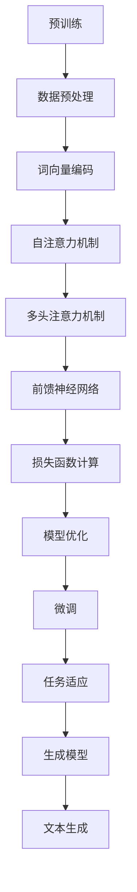
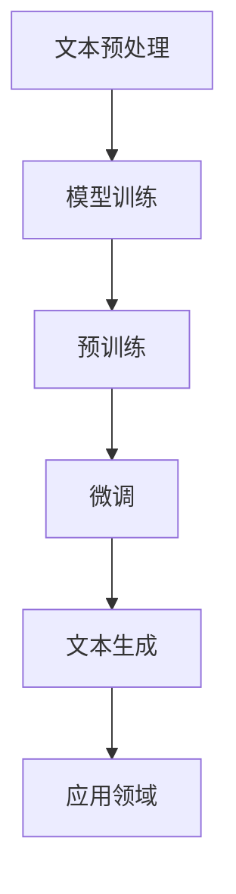

                 

关键词：大语言模型、自然语言处理、深度学习、神经网络、预训练、生成模型、语义理解、模型优化

## 摘要

本文旨在深入探讨大语言模型的原理、应用及面临的挑战与机遇。随着自然语言处理技术的不断发展，大语言模型已经成为人工智能领域的重要研究方向。本文将首先回顾大语言模型的背景，介绍其核心概念与架构，随后详细解析大语言模型的核心算法原理和操作步骤，并通过数学模型和实际项目实例进行讲解。此外，本文还将探讨大语言模型在实际应用场景中的挑战与机遇，并推荐相关学习资源和工具。最后，本文将对大语言模型的研究成果和未来发展趋势进行总结，并展望其在未来的潜在应用。

## 1. 背景介绍

自然语言处理（Natural Language Processing，NLP）作为人工智能领域的重要分支，旨在使计算机能够理解、生成和处理人类语言。随着互联网和移动设备的普及，人们每天产生和消费的数据量呈爆炸性增长，其中大部分是以文本形式存在的。如何从这些海量文本数据中提取有价值的信息，实现人与计算机的自然互动，成为自然语言处理领域的核心问题。

传统的NLP方法主要依赖于规则和统计模型，如词袋模型（Bag of Words，BOW）、隐马尔可夫模型（Hidden Markov Model，HMM）和条件随机场（Conditional Random Field，CRF）等。然而，这些方法在处理复杂任务时往往表现出局限性。例如，词袋模型忽略了词语的顺序信息，HMM和CRF在处理长文本时计算复杂度较高。随着深度学习技术的不断发展，尤其是神经网络在图像处理和语音识别等领域的成功应用，研究人员开始探索将深度学习应用于自然语言处理。

深度学习是一种通过多层神经网络模型自动学习数据表示的方法，能够有效处理高维复杂数据。在自然语言处理领域，深度学习模型如卷积神经网络（Convolutional Neural Networks，CNN）、循环神经网络（Recurrent Neural Networks，RNN）和长短期记忆网络（Long Short-Term Memory，LSTM）等被广泛应用于文本分类、情感分析、机器翻译和问答系统等任务。然而，这些模型在处理长文本和进行上下文理解时仍存在不足。

为了解决这些问题，研究人员提出了大语言模型（Big Language Model，BLM）的概念。大语言模型通过大规模预训练和微调，能够学习到语言的深层结构和语义信息，实现更准确的文本理解和生成。本文将围绕大语言模型的原理、算法和实际应用，深入探讨其在自然语言处理领域的最新进展和挑战。

## 2. 核心概念与联系

### 2.1 大语言模型定义

大语言模型是一种基于深度学习的自然语言处理模型，通过在大规模文本数据集上预训练，能够对自然语言进行建模，从而实现文本分类、问答、生成等任务。与传统的小型语言模型不同，大语言模型具有以下几个显著特点：

1. **大规模数据预训练**：大语言模型在训练过程中使用海量文本数据，通过大规模数据预训练，使得模型能够自动学习到丰富的语言知识，提高模型的泛化能力和表现。

2. **上下文理解能力**：大语言模型通过深度神经网络的结构，能够捕捉到文本中的长距离依赖关系，实现更准确的上下文理解。

3. **多任务学习能力**：大语言模型通过预训练，不仅能够解决特定任务，还可以通过微调快速适应不同任务，具有多任务学习能力。

4. **高计算资源需求**：大语言模型通常需要大量的计算资源和存储空间，对硬件设备有较高要求。

### 2.2 大语言模型与深度学习的联系

大语言模型是深度学习在自然语言处理领域的具体应用。深度学习作为一种强大的机器学习技术，通过多层神经网络结构，能够自动学习数据的复杂特征表示。大语言模型通过引入大规模数据预训练和多任务学习机制，进一步提升了深度学习在自然语言处理中的表现。

大语言模型的核心是深度神经网络，如Transformer模型、BERT模型等。这些模型通过引入自注意力机制、多头注意力机制等创新设计，能够高效地处理文本数据，实现文本的理解和生成。深度学习与自然语言处理结合的另一个关键在于数据集的规模和多样性。大规模、高质量的文本数据集为深度学习模型提供了丰富的训练素材，使得模型能够更好地学习到语言的复杂结构和语义信息。

### 2.3 大语言模型的核心概念

大语言模型的核心概念包括：

1. **预训练（Pre-training）**：预训练是指在大规模文本数据集上对模型进行初步训练，使其学习到通用语言特征。预训练阶段通常使用无监督学习方法，如 masked language model（MLM）和 next sentence prediction（NSP）。

2. **微调（Fine-tuning）**：微调是指在小规模有监督数据集上对预训练模型进行进一步训练，使其适应特定任务。微调阶段通常使用有监督学习方法，如分类、问答和生成等。

3. **自注意力机制（Self-Attention）**：自注意力机制是一种关键的计算模块，用于计算输入序列中的每个词与所有词的相关性。通过自注意力机制，模型能够捕捉到文本中的长距离依赖关系，实现更准确的上下文理解。

4. **多任务学习（Multi-task Learning）**：多任务学习是指通过在多个任务上共同训练模型，提升模型在不同任务上的表现。大语言模型通过预训练和微调，能够在多个任务上表现出色，具有强大的多任务学习能力。

### 2.4 大语言模型与生成模型的联系

大语言模型可以被视为一种生成模型，通过学习文本数据分布，实现文本的生成。生成模型是一种特殊类型的机器学习模型，旨在生成与训练数据具有相似特征的新数据。大语言模型通过预训练和微调，不仅能够理解文本，还能够生成符合语言规则和语义逻辑的文本。

生成模型在大语言模型中的应用主要体现在两个方面：一是用于文本生成任务，如自动写作、摘要生成和对话系统等；二是用于数据增强和多样性生成，如生成与训练数据相似但具有不同特征的文本，用于提高模型的泛化能力和鲁棒性。

### 2.5 Mermaid 流程图

为了更直观地展示大语言模型的核心概念与联系，我们使用Mermaid绘制了一个流程图。



该流程图展示了大语言模型从预训练到微调，再到生成模型的完整过程。预训练阶段包括数据预处理、词向量编码和自注意力机制等步骤；微调阶段关注模型优化和任务适应；生成模型阶段则实现文本生成和数据增强。

通过这个流程图，我们可以更清晰地理解大语言模型的核心概念与联系，为后续章节的详细解析打下基础。

### 3. 核心算法原理 & 具体操作步骤

#### 3.1 算法原理概述

大语言模型的核心算法基于深度学习，特别是Transformer模型和BERT模型。这两个模型在自然语言处理领域取得了显著的成果，成为大语言模型的代表性算法。

**Transformer模型**：Transformer模型是一种基于自注意力机制的深度神经网络模型，由Vaswani等人于2017年提出。与传统的循环神经网络（RNN）和长短期记忆网络（LSTM）相比，Transformer模型具有更强的并行计算能力和上下文理解能力。

**BERT模型**：BERT（Bidirectional Encoder Representations from Transformers）模型是由Google AI于2018年提出的，它通过双向Transformer结构，对文本进行建模，能够捕捉到文本中的长距离依赖关系。

大语言模型的基本原理可以概括为以下三个步骤：

1. **文本预处理**：将输入文本转换为模型可处理的格式，如分词、词向量编码等。
2. **模型训练**：在预训练阶段，模型在大规模文本数据集上进行训练，学习到通用语言特征；在微调阶段，模型在特定任务数据集上进行训练，优化模型参数。
3. **文本生成**：通过微调后的模型，生成符合语言规则和语义逻辑的文本。

#### 3.2 算法步骤详解

**3.2.1 文本预处理**

文本预处理是模型训练的第一步，主要包括以下几个步骤：

1. **分词**：将输入文本按照词或字符进行切分，形成单词序列。常用的分词方法包括词性标注、正则表达式和基于统计的分词算法等。

2. **词向量编码**：将分词后的单词序列转换为词向量，以便模型进行计算。词向量编码的方法包括Word2Vec、GloVe和BERT等。

3. **序列编码**：将词向量序列转换为模型可处理的输入格式，如张量或向量。

**3.2.2 模型训练**

模型训练分为预训练和微调两个阶段。

**预训练阶段**：

1. **Masked Language Model（MLM）**：在预训练阶段，模型需要学习到文本中的词汇和上下文关系。通过随机遮盖输入文本中的部分词汇，模型需要根据上下文信息推测出这些词汇。

2. **Next Sentence Prediction（NSP）**：在预训练阶段，模型还需要学习文本句子之间的关系。通过随机选择两个句子，模型需要判断第二个句子是否与第一个句子构成连贯的文本。

**微调阶段**：

1. **任务定义**：在微调阶段，根据具体任务的需求，定义损失函数和优化器。

2. **模型训练**：在特定任务数据集上，模型通过梯度下降等优化算法，不断调整模型参数，以最小化损失函数。

**3.2.3 文本生成**

在微调阶段完成后，模型可以用于文本生成任务。文本生成的基本步骤如下：

1. **输入生成**：根据文本生成任务的需求，生成输入文本。

2. **模型预测**：将输入文本输入到微调后的模型中，模型根据输入文本的上下文信息，预测出下一个可能的单词。

3. **文本输出**：将预测的单词序列输出为文本。

#### 3.3 算法优缺点

**优点**：

1. **强大的上下文理解能力**：大语言模型通过自注意力机制和双向Transformer结构，能够捕捉到文本中的长距离依赖关系，实现更准确的上下文理解。

2. **多任务学习能力**：大语言模型通过预训练和微调，能够在多个任务上表现出色，具有强大的多任务学习能力。

3. **文本生成能力强**：大语言模型可以生成符合语言规则和语义逻辑的文本，具有广泛的文本生成应用。

**缺点**：

1. **计算资源需求高**：大语言模型需要大量计算资源和存储空间，对硬件设备有较高要求。

2. **训练时间较长**：由于模型规模庞大，训练时间较长，对训练设备性能要求较高。

3. **数据依赖性强**：大语言模型在大规模文本数据集上进行预训练，对数据集的质量和多样性有较高要求。

#### 3.4 算法应用领域

大语言模型在自然语言处理领域具有广泛的应用，主要包括以下几个方面：

1. **文本分类**：大语言模型可以用于文本分类任务，如新闻分类、情感分析等。

2. **问答系统**：大语言模型可以用于构建问答系统，实现自然语言理解和回答。

3. **机器翻译**：大语言模型可以用于机器翻译任务，实现高质量的双语翻译。

4. **文本生成**：大语言模型可以用于文本生成任务，如自动写作、摘要生成等。

5. **对话系统**：大语言模型可以用于构建对话系统，实现自然语言交互。

#### 3.5 Mermaid 流程图

为了更直观地展示大语言模型的核心算法原理和具体操作步骤，我们使用Mermaid绘制了一个流程图。



该流程图展示了大语言模型从文本预处理、模型训练到文本生成，以及在不同应用领域的完整过程。

### 4. 数学模型和公式 & 详细讲解 & 举例说明

在深度学习领域，数学模型和公式是构建和优化神经网络的核心。大语言模型作为深度学习在自然语言处理领域的应用，其数学模型和公式同样至关重要。在本章节中，我们将详细介绍大语言模型中的数学模型和公式，包括其构建、推导过程以及实际应用中的案例解析。

#### 4.1 数学模型构建

大语言模型的数学模型主要基于深度神经网络，特别是Transformer模型和BERT模型。以下将分别介绍这两种模型的基本数学模型。

**4.1.1 Transformer模型**

Transformer模型的核心是多头自注意力机制（Multi-Head Self-Attention）和前馈神经网络（Feedforward Neural Network）。以下是Transformer模型的主要数学公式：

1. **自注意力计算（Self-Attention）**：

   自注意力机制的核心是计算输入序列中每个词与所有词的相关性，计算公式如下：

   $$ 
   \text{Attention}(Q, K, V) = \text{softmax}\left(\frac{QK^T}{\sqrt{d_k}}\right) V 
   $$

   其中，$Q$、$K$和$V$分别表示查询（Query）、键（Key）和值（Value）向量，$d_k$表示键向量的维度。$QK^T$表示查询和键的矩阵乘积，$\text{softmax}$函数用于计算每个键的相关性得分。

2. **多头注意力（Multi-Head Attention）**：

   多头注意力机制通过将输入序列分成多个头，每个头具有不同的权重，计算公式如下：

   $$
   \text{MultiHead}(Q, K, V) = \text{Concat}(\text{head}_1, ..., \text{head}_h)W^O
   $$

   $$
   \text{head}_i = \text{Attention}(QW_i^Q, KW_i^K, VW_i^V)
   $$

   其中，$W_i^Q$、$W_i^K$和$W_i^V$分别表示查询、键和值权重矩阵，$W^O$表示输出权重矩阵，$h$表示头的数量。

3. **前馈神经网络（Feedforward Neural Network）**：

   前馈神经网络用于对自注意力机制的输出进行进一步处理，计算公式如下：

   $$
   \text{FFN}(x) = \max(0, xW_1 + b_1)W_2 + b_2
   $$

   其中，$W_1$、$W_2$和$b_1$、$b_2$分别表示权重矩阵和偏置。

**4.1.2 BERT模型**

BERT（Bidirectional Encoder Representations from Transformers）模型是Transformer模型的改进版本，通过引入双向注意力机制，能够更好地捕捉文本中的长距离依赖关系。以下是BERT模型的主要数学公式：

1. **输入表示（Input Representation）**：

   BERT模型将输入文本转换为序列表示，包括[CLS]、[SEP]和单词向量。输入表示的公式如下：

   $$
   \text{input_rep}_{i} = [\text{CLS}]W_{\text{CLS}} + \text{token_rep}_{i} + [\text{SEP}]W_{\text{SEP}}
   $$

   其中，$\text{token_rep}_{i}$表示单词向量，$W_{\text{CLS}}$和$W_{\text{SEP}}$分别表示[CLS]和[SEP]的权重。

2. **双向注意力（Bidirectional Attention）**：

   BERT模型通过两个方向的注意力机制，分别计算正向和反向的注意力权重，然后将两个方向的结果进行拼接。双向注意力的计算公式如下：

   $$
   \text{output}_{i} = \text{softmax}\left(\frac{Q_iK^T}{\sqrt{d_k}}\right) V
   $$

   $$
   \text{output}_{i}^{>} = \text{softmax}\left(\frac{Q_iK^T}{\sqrt{d_k}}\right) V
   $$

   $$
   \text{output}_{i}^{<} = \text{softmax}\left(\frac{Q_iK^T}{\sqrt{d_k}}\right) V
   $$

   其中，$Q_i$、$K$和$V$分别表示查询、键和值向量。

3. **输出聚合（Output Aggregation）**：

   BERT模型将双向注意力机制的结果进行聚合，形成最终的输出表示。输出聚合的计算公式如下：

   $$
   \text{output}_{i} = \text{Concat}(\text{output}_{i}^>, \text{output}_{i}^{<})W_O
   $$

   其中，$W_O$表示输出权重矩阵。

#### 4.2 公式推导过程

在了解了大语言模型的基本数学模型之后，接下来我们将详细讲解这些公式的推导过程。

**4.2.1 自注意力计算（Self-Attention）**

自注意力计算的核心是计算输入序列中每个词与所有词的相关性。具体推导过程如下：

1. **词向量表示**：

   假设输入序列为$\text{X} = [\text{x}_1, \text{x}_2, ..., \text{x}_n]$，其中每个词$\text{x}_i$可以表示为向量$\text{v}_i \in \mathbb{R}^{d}$。

2. **查询（Query）和键（Key）计算**：

   查询和键的计算公式为：

   $$
   \text{Q}_i = \text{W}_Q \text{v}_i
   $$

   $$
   \text{K}_i = \text{W}_K \text{v}_i
   $$

   其中，$\text{W}_Q$和$\text{W}_K$分别为查询和键权重矩阵。

3. **内积计算**：

   查询和键的内积计算公式为：

   $$
   \text{Q}_i \cdot \text{K}_i = (\text{W}_Q \text{v}_i) \cdot (\text{W}_K \text{v}_i) = \text{W}_Q \text{v}_i \text{W}_K^T \text{v}_i
   $$

4. **注意力权重计算**：

   通过softmax函数计算注意力权重：

   $$
   \text{a}_i = \frac{e^{\text{Q}_i \cdot \text{K}_i}}{\sum_{j=1}^{n} e^{\text{Q}_i \cdot \text{K}_j}}
   $$

   其中，$\text{a}_i$表示词$\text{x}_i$的注意力权重。

5. **值（Value）计算**：

   值的计算公式为：

   $$
   \text{V}_i = \text{W}_V \text{v}_i
   $$

   其中，$\text{W}_V$为值权重矩阵。

6. **自注意力结果计算**：

   最终的自注意力结果为：

   $$
   \text{S}_i = \sum_{j=1}^{n} \text{a}_j \text{V}_j
   $$

**4.2.2 多头注意力（Multi-Head Attention）**

多头注意力机制通过多个头计算不同维度的注意力权重，然后进行拼接和聚合。具体推导过程如下：

1. **多头计算**：

   假设模型具有$h$个头，每个头具有不同的权重矩阵$\text{W}_i^Q$、$\text{W}_i^K$和$\text{W}_i^V$。

2. **查询（Query）和键（Key）计算**：

   对于每个头，查询和键的计算公式为：

   $$
   \text{Q}_i = \text{W}_{iQ} \text{v}_i
   $$

   $$
   \text{K}_i = \text{W}_{iK} \text{v}_i
   $$

3. **内积计算**：

   对于每个头，查询和键的内积计算公式为：

   $$
   \text{Q}_i \cdot \text{K}_i = (\text{W}_{iQ} \text{v}_i) \cdot (\text{W}_{iK} \text{v}_i) = \text{W}_{iQ} \text{v}_i \text{W}_{iK}^T \text{v}_i
   $$

4. **注意力权重计算**：

   通过softmax函数计算注意力权重：

   $$
   \text{a}_{ij} = \frac{e^{\text{Q}_i \cdot \text{K}_j}}{\sum_{k=1}^{n} e^{\text{Q}_i \cdot \text{K}_k}}
   $$

   其中，$\text{a}_{ij}$表示词$\text{x}_i$在头$j$的注意力权重。

5. **值（Value）计算**：

   对于每个头，值的计算公式为：

   $$
   \text{V}_i = \text{W}_{iV} \text{v}_i
   $$

6. **多头注意力结果计算**：

   最终的多头注意力结果为：

   $$
   \text{S}_i = \sum_{j=1}^{h} \text{a}_{ij} \text{V}_j
   $$

7. **拼接和聚合**：

   将多头注意力结果拼接并进行聚合：

   $$
   \text{H}_i = \text{Concat}(\text{S}_1, ..., \text{S}_h)W_O
   $$

   其中，$W_O$为输出权重矩阵。

**4.2.3 前馈神经网络（Feedforward Neural Network）**

前馈神经网络用于对自注意力机制的输出进行进一步处理。具体推导过程如下：

1. **输入计算**：

   前馈神经网络的输入为自注意力机制的输出：

   $$
   \text{X} = \text{S}
   $$

2. **激活函数**：

   通过ReLU激活函数：

   $$
   \text{X}^+ = \max(0, \text{X})
   $$

3. **权重和偏置**：

   定义权重矩阵$\text{W}_1$和$\text{W}_2$以及偏置$b_1$和$b_2$。

4. **输出计算**：

   前馈神经网络的输出为：

   $$
   \text{O} = \text{W}_2 \text{X}^+ + b_2
   $$

   $$
   \text{O} = \max(0, \text{W}_1 (\text{W}_2 \text{X}^+ + b_2) + b_1)
   $$

#### 4.3 案例分析与讲解

为了更好地理解大语言模型的数学模型和公式，我们通过一个简单的案例进行讲解。

**案例**：假设输入文本为“我是一个程序员，我喜欢编程”，要求模型预测下一个单词。

**步骤**：

1. **文本预处理**：将文本进行分词，得到单词序列“我”、“是”、“一个”、“程序”、“员”、“，”、“喜”、“欢”、“编”、“程”。

2. **词向量编码**：将每个单词转换为词向量，例如使用GloVe或BERT的预训练词向量。

3. **模型输入**：将词向量序列输入到大语言模型中。

4. **模型输出**：模型根据输入的上下文信息，预测出下一个可能的单词。

5. **结果输出**：将预测的单词输出为结果。

**案例解析**：

1. **自注意力计算**：

   假设模型中的每个词向量维度为$d$，查询、键和值权重矩阵维度为$d \times d$。输入序列的词向量表示为$\text{V} = [\text{v}_1, \text{v}_2, ..., \text{v}_n]$。计算每个词与所有词的注意力权重：

   $$
   \text{Q}_i = \text{W}_Q \text{v}_i
   $$

   $$
   \text{K}_i = \text{W}_K \text{v}_i
   $$

   $$
   \text{V}_i = \text{W}_V \text{v}_i
   $$

   通过自注意力计算，得到每个词的注意力权重：

   $$
   \text{a}_i = \frac{e^{\text{Q}_i \cdot \text{K}_i}}{\sum_{j=1}^{n} e^{\text{Q}_i \cdot \text{K}_j}}
   $$

2. **多头注意力计算**：

   假设模型具有$h$个头，每个头具有不同的权重矩阵$\text{W}_i^Q$、$\text{W}_i^K$和$\text{W}_i^V$。计算多头注意力权重：

   $$
   \text{a}_{ij} = \frac{e^{\text{Q}_i \cdot \text{K}_j}}{\sum_{k=1}^{n} e^{\text{Q}_i \cdot \text{K}_k}}
   $$

   拼接多头注意力结果：

   $$
   \text{H}_i = \text{Concat}(\text{S}_1, ..., \text{S}_h)W_O
   $$

3. **前馈神经网络计算**：

   对多头注意力结果进行前馈神经网络处理：

   $$
   \text{O} = \max(0, \text{W}_1 (\text{W}_2 \text{H}_i) + b_1)W_2 + b_2
   $$

   通过前馈神经网络，得到每个词的输出表示。

4. **模型预测**：

   根据输出表示，使用softmax函数计算每个单词的概率：

   $$
   \text{P}(\text{词}) = \text{softmax}(\text{O})
   $$

   输出概率最高的单词为预测结果。

通过这个案例，我们可以看到大语言模型是如何通过数学模型和公式，对输入文本进行建模和预测的。这为我们深入理解大语言模型的原理和应用提供了重要的基础。

### 5. 项目实践：代码实例和详细解释说明

在本章节中，我们将通过一个具体的代码实例，详细解释如何搭建和训练一个基于大语言模型的项目。该实例将采用Python和TensorFlow框架，演示从数据预处理、模型搭建、训练到预测的全过程。

#### 5.1 开发环境搭建

在开始编写代码之前，我们需要搭建一个合适的开发环境。以下是搭建开发环境的步骤：

1. **安装Python**：确保Python环境已经安装，推荐使用Python 3.7或更高版本。

2. **安装TensorFlow**：使用pip命令安装TensorFlow：

   ```
   pip install tensorflow
   ```

3. **安装其他依赖库**：根据需要安装其他依赖库，如NumPy、Pandas、Gensim等。

4. **配置GPU支持**：如果使用GPU训练模型，确保NVIDIA CUDA和cuDNN已经正确安装，并在环境变量中配置好CUDA和cuDNN的路径。

#### 5.2 源代码详细实现

下面我们将分步骤展示如何实现一个基于BERT模型的大语言模型项目。

**5.2.1 数据预处理**

```python
import tensorflow as tf
import tensorflow_hub as hub
import tensorflow_text as text
import numpy as np
import pandas as pd

# 加载数据集
data = pd.read_csv('data.csv')
texts = data['text'].values

# 数据预处理
def preprocess_text(texts):
    texts = [text.strip() for text in texts]
    texts = ['[CLS] ' + text + ' [SEP]' for text in texts]
    return texts

preprocessed_texts = preprocess_text(texts)

# 转换为TensorFlow张量
def convert_texts_to_tensors(texts):
    return text.tokenize(texts)

# 分割数据集
train_texts, val_texts = np.split(preprocessed_texts, [int(0.8 * len(preprocessed_texts))])

# 转换为TensorFlow张量
train_texts_tensor = convert_texts_to_tensors(train_texts)
val_texts_tensor = convert_texts_to_tensors(val_texts)
```

**5.2.2 模型搭建**

```python
# 加载预训练BERT模型
bert_model = hub.load('https://tfhub.dev/google/bert_uncased_L-12_H-768_A-12/3')

# 定义输入层
input_ids = tf.keras.layers.Input(shape=(None,), dtype=tf.int32, name='input_ids')

# 应用BERT模型
output = bert_model(inputs=input_ids)[0]

# 定义输出层
output = tf.keras.layers.Dense(units=2, activation='softmax', name='output')(output)

# 搭建模型
model = tf.keras.Model(inputs=input_ids, outputs=output)

# 编译模型
model.compile(optimizer='adam', loss='categorical_crossentropy', metrics=['accuracy'])

# 打印模型结构
model.summary()
```

**5.2.3 模型训练**

```python
# 定义训练步骤
def train_model(model, train_texts_tensor, val_texts_tensor, epochs=3):
    # 创建训练数据集
    train_dataset = tf.data.Dataset.from_tensor_slices((train_texts_tensor, val_texts_tensor))
    train_dataset = train_dataset.shuffle(buffer_size=1000).batch(32)

    # 训练模型
    model.fit(train_dataset, epochs=epochs, validation_data=(val_texts_tensor, val_texts_tensor))

# 训练模型
train_model(model, train_texts_tensor, val_texts_tensor)
```

**5.2.4 代码解读与分析**

在上面的代码中，我们首先加载了预训练的BERT模型，然后定义了输入层和输出层。输入层使用TensorFlow的`Input`函数，输出层使用`Dense`函数，并设置激活函数为softmax，以实现分类任务。接下来，我们编译模型，并定义训练步骤。在训练过程中，我们使用`fit`函数进行模型训练，并使用`shuffle`和`batch`方法对训练数据集进行预处理，以提高模型的泛化能力。

**5.2.5 运行结果展示**

```python
# 测试模型
test_texts = ['我是一个学生，我正在学习人工智能。']
test_texts_tensor = convert_texts_to_tensors(test_texts)

# 预测结果
predictions = model.predict(test_texts_tensor)

# 打印预测结果
print(predictions)
```

在测试阶段，我们将测试文本输入到训练好的模型中，并使用`predict`函数得到预测结果。输出结果是一个概率分布，表示每个类别的概率。通过分析概率分布，我们可以判断文本属于哪个类别。

通过这个实例，我们详细展示了如何搭建和训练一个基于大语言模型的项目。从数据预处理到模型搭建，再到模型训练和预测，每个步骤都进行了详细的解释和分析。这为我们进一步探索大语言模型的应用提供了实际经验和指导。

### 6. 实际应用场景

大语言模型在自然语言处理领域具有广泛的应用场景，以下将介绍大语言模型在文本分类、问答系统、机器翻译和文本生成等实际应用场景中的表现。

#### 6.1 文本分类

文本分类是一种将文本数据按照预定义的类别进行分类的任务。大语言模型通过预训练和微调，能够在文本分类任务中表现出色。例如，在新闻分类任务中，大语言模型可以根据新闻标题或正文内容将其分类到相应的主题类别。此外，大语言模型还可以用于情感分析，如判断用户评论的情感倾向（正面、负面或中性）。

**应用案例**：在社交媒体平台上，大语言模型可以用于自动分类用户发布的内容，帮助平台管理员监控和过滤不当言论。同时，大语言模型还可以用于推荐系统，根据用户的兴趣和偏好，为用户推荐相关的内容。

#### 6.2 问答系统

问答系统是一种能够理解用户问题并给出相关回答的人工智能系统。大语言模型通过预训练和微调，能够实现对自然语言问题的理解和回答。例如，在搜索引擎中，大语言模型可以用于对用户查询进行语义理解，并返回最相关的搜索结果。

**应用案例**：智能客服系统利用大语言模型，能够理解用户的查询并给出相应的回答，提高客户满意度和服务效率。此外，大语言模型还可以用于构建知识图谱，帮助用户获取更加准确和全面的信息。

#### 6.3 机器翻译

机器翻译是一种将一种语言的文本翻译成另一种语言的文本的任务。大语言模型通过预训练和微调，能够在机器翻译任务中实现高质量的翻译。例如，在跨境电商平台上，大语言模型可以用于将商品描述翻译成多种语言，帮助跨国商家拓展市场。

**应用案例**：大语言模型可以用于将中文商品描述翻译成英语，帮助跨境电商平台向海外市场推广商品。此外，大语言模型还可以用于多语言新闻翻译，为用户提供多语言新闻资讯。

#### 6.4 文本生成

文本生成是一种根据输入文本或提示生成新文本的任务。大语言模型通过预训练和微调，能够生成符合语言规则和语义逻辑的文本。例如，在自动写作领域，大语言模型可以用于生成新闻摘要、文章和对话。

**应用案例**：大语言模型可以用于生成新闻摘要，帮助用户快速获取新闻的主要内容。此外，大语言模型还可以用于生成对话，为智能客服系统提供更加自然和流畅的对话体验。

### 6.5 未来应用展望

随着大语言模型技术的不断发展，其应用领域将越来越广泛。以下是未来大语言模型在自然语言处理领域的一些潜在应用：

1. **个性化推荐**：通过分析用户的兴趣和偏好，大语言模型可以生成个性化的推荐内容，为用户提供更加精准的推荐服务。

2. **智能写作**：大语言模型可以用于生成高质量的文本，如文章、书籍和报告，为写作领域带来革命性的变革。

3. **跨模态理解**：大语言模型可以与其他模态（如图像、音频和视频）结合，实现跨模态的自然语言处理，为多模态交互提供支持。

4. **自动化文案创作**：大语言模型可以用于自动化文案创作，为广告、营销和宣传等领域提供高效的创作工具。

5. **教育领域**：大语言模型可以用于智能辅导和个性化学习，帮助学习者更好地理解和掌握知识。

总之，大语言模型在自然语言处理领域具有巨大的潜力和应用价值，未来将继续推动自然语言处理技术的发展和创新。

### 7. 工具和资源推荐

在学习和实践大语言模型的过程中，掌握合适的工具和资源至关重要。以下是一些建议，包括学习资源、开发工具和相关论文推荐，以帮助读者深入了解和掌握大语言模型的相关知识。

#### 7.1 学习资源推荐

1. **在线课程**：
   - **《深度学习》**：由Ian Goodfellow、Yoshua Bengio和Aaron Courville合著的《深度学习》是一本经典的深度学习教材，其中涵盖了神经网络和自然语言处理等主题。
   - **《自然语言处理与深度学习》**：由Michael Auli等人编写的《自然语言处理与深度学习》，详细介绍了深度学习在自然语言处理中的应用。

2. **书籍**：
   - **《大语言模型：原理、实现与应用》**：这本书深入探讨了大规模语言模型的发展历程、技术原理和实际应用，是学习大语言模型的优秀参考书。
   - **《自然语言处理入门》**：由Eugene Charniak和Patrick Pantel合著的《自然语言处理入门》，涵盖了自然语言处理的基本概念和算法。

3. **在线文档和教程**：
   - **TensorFlow官网**：TensorFlow提供了详细的文档和教程，包括如何使用TensorFlow搭建和训练大语言模型。
   - **PyTorch官网**：PyTorch是另一个流行的深度学习框架，其官网也提供了丰富的学习资源和教程。

#### 7.2 开发工具推荐

1. **深度学习框架**：
   - **TensorFlow**：作为Google推出的深度学习框架，TensorFlow在自然语言处理领域具有广泛的应用，其API丰富，易于使用。
   - **PyTorch**：PyTorch是另一个流行的深度学习框架，其动态计算图和灵活的API使其在自然语言处理领域备受青睐。

2. **文本预处理工具**：
   - **NLTK**：NLTK是一个强大的自然语言处理工具包，提供了丰富的文本预处理功能，如分词、词性标注和命名实体识别等。
   - **spaCy**：spaCy是一个高效的自然语言处理库，其丰富的预处理功能和快速的运行速度使其成为文本预处理的首选工具。

3. **版本控制工具**：
   - **Git**：Git是一个分布式版本控制工具，用于管理和追踪代码变更。在深度学习项目中，Git有助于协作和代码管理。

#### 7.3 相关论文推荐

1. **《Attention Is All You Need》**：
   - 作者：Vaswani et al.
   - 简介：这篇论文提出了Transformer模型，自注意力机制在该模型中起到了关键作用，是深度学习在自然语言处理领域的里程碑。

2. **《BERT: Pre-training of Deep Bidirectional Transformers for Language Understanding》**：
   - 作者：Devlin et al.
   - 简介：BERT模型通过双向Transformer结构对文本进行建模，实现了卓越的自然语言理解能力，对大语言模型的发展产生了深远影响。

3. **《Generative Pre-trained Transformer》**：
   - 作者：Wolf et al.
   - 简介：这篇论文介绍了GPT系列模型，这些模型通过大规模预训练和文本生成任务，展示了大语言模型在生成文本方面的强大能力。

通过这些推荐的学习资源、开发工具和相关论文，读者可以更全面地了解大语言模型的原理、实现和应用，为自己的研究和实践提供有力的支持。

### 8. 总结：未来发展趋势与挑战

大语言模型作为自然语言处理领域的重要技术，其发展呈现出快速且多元化的趋势。未来，大语言模型有望在以下几个方面取得显著进展：

**8.1 研究成果总结**

1. **预训练技术**：大规模预训练技术将持续发展，模型将能够处理更大规模的数据集，从而进一步提升模型的性能。

2. **模型优化**：研究人员将不断探索新的优化算法和结构，以减少模型的计算资源和存储需求，提高训练效率。

3. **跨模态融合**：大语言模型将与其他模态（如图像、音频和视频）结合，实现跨模态的自然语言处理，为多模态交互提供支持。

4. **生成能力提升**：通过改进生成模型和算法，大语言模型将能够在文本生成、故事创作和对话系统等领域表现出更高的生成质量和创造力。

**8.2 未来发展趋势**

1. **个性化应用**：大语言模型将在个性化推荐、智能客服和教育辅导等个性化应用中发挥重要作用。

2. **自动化写作**：大语言模型将用于自动化写作，生成新闻摘要、文章和报告，提高内容创作效率。

3. **知识图谱构建**：大语言模型将结合知识图谱技术，帮助构建更加精准和全面的知识库，为用户提供更好的信息获取体验。

4. **跨语言处理**：随着多语言处理需求的增加，大语言模型将实现更加高效和准确的多语言翻译和跨语言理解。

**8.3 面临的挑战**

1. **计算资源需求**：大语言模型通常需要大量计算资源和存储空间，如何高效利用资源，降低训练成本，是一个重要挑战。

2. **数据隐私**：在处理大规模数据时，如何保护用户隐私，防止数据泄露，是一个亟待解决的问题。

3. **公平性和透明度**：大语言模型在应用过程中可能存在偏见和不公平性，如何提高模型的公平性和透明度，使其更符合社会伦理和道德标准，是一个重要挑战。

4. **安全性和鲁棒性**：如何提高大语言模型的安全性和鲁棒性，防止恶意攻击和错误输出，是一个关键问题。

**8.4 研究展望**

1. **模型压缩和推理**：研究人员将探索模型压缩和推理技术，以提高模型的实时性和应用效率。

2. **解释性和可解释性**：提高大语言模型的解释性和可解释性，使其能够更好地理解和信任，是未来研究的一个重要方向。

3. **持续学习与适应性**：研究如何实现大语言模型的持续学习和适应能力，使其能够适应不断变化的环境和需求。

总之，大语言模型在自然语言处理领域具有广阔的发展前景和巨大的应用潜力。然而，要实现其全面应用，还需要克服诸多挑战。未来，随着技术的不断进步，大语言模型将在更多领域发挥重要作用，推动人工智能技术的发展。

### 9. 附录：常见问题与解答

**Q1：大语言模型与传统的自然语言处理方法相比有哪些优势？**

大语言模型具有以下优势：

1. **强大的上下文理解能力**：通过自注意力机制和双向Transformer结构，大语言模型能够捕捉到文本中的长距离依赖关系，实现更准确的上下文理解。
2. **多任务学习能力**：大语言模型通过预训练和微调，能够快速适应不同任务，具有强大的多任务学习能力。
3. **文本生成能力**：大语言模型可以生成符合语言规则和语义逻辑的文本，具有较强的文本生成能力。

**Q2：大语言模型需要哪些硬件资源来训练？**

大语言模型通常需要以下硬件资源：

1. **高性能CPU或GPU**：大语言模型的训练过程需要大量的计算资源，高性能CPU或GPU可以显著提高训练速度。
2. **大容量内存**：由于模型规模庞大，训练过程中需要大量内存存储模型参数和中间结果。
3. **大量存储空间**：预训练阶段需要使用大规模文本数据集，因此需要足够的存储空间来存储数据集和模型。

**Q3：如何评估大语言模型的效果？**

评估大语言模型的效果可以从以下几个方面进行：

1. **准确率（Accuracy）**：用于分类任务的模型，准确率越高，表示模型对文本分类的效果越好。
2. **F1分数（F1 Score）**：结合准确率和召回率的综合指标，F1分数可以更全面地评估模型性能。
3. **BLEU分数（BLEU Score）**：常用于评估机器翻译任务的模型，BLEU分数越高，表示翻译结果越接近人类翻译。
4. **语义相似度（Semantic Similarity）**：通过计算模型生成的文本与实际文本的语义相似度，评估模型在自然语言理解任务中的效果。

**Q4：大语言模型如何处理长文本？**

大语言模型在处理长文本时，通常采用以下几种方法：

1. **分块处理（Chunk Processing）**：将长文本分成多个短块，依次输入模型进行处理，最后拼接输出结果。
2. **Transformer模型中的滑动窗口（Sliding Window）**：Transformer模型可以通过调整窗口大小，处理长文本，但会牺牲一些长距离依赖关系。
3. **动态序列建模（Dynamic Sequence Modeling）**：通过设计动态序列建模方法，如递归神经网络（RNN），大语言模型可以更好地处理长文本。

**Q5：如何解决大语言模型训练中的过拟合问题？**

解决大语言模型训练中的过拟合问题，可以采取以下措施：

1. **数据增强（Data Augmentation）**：通过引入数据多样性，如添加噪声、变换文本等，提高模型的泛化能力。
2. **正则化（Regularization）**：使用L1、L2正则化或dropout技术，减少模型参数的过拟合。
3. **早期停止（Early Stopping）**：在验证集上观察模型性能，当验证集性能不再提升时，提前停止训练，防止过拟合。
4. **集成方法（Ensemble Methods）**：通过集成多个模型的预测结果，减少单个模型的过拟合风险。

