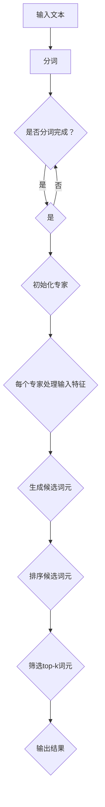

                 

关键词：大语言模型、深度学习、神经网络、自然语言处理、自然语言生成、词元选择、top-k算法

摘要：本文从大语言模型的原理出发，探讨了其基础与前沿技术。重点介绍了大语言模型中每个专家选择top-k个词元的方法，通过具体案例，深入讲解了这一方法的实现和优化。文章旨在为读者提供一个全面的技术解读，帮助理解大语言模型的原理和应用。

## 1. 背景介绍

### 1.1 大语言模型的兴起

随着互联网的普及和大数据技术的发展，自然语言处理（NLP）领域迎来了前所未有的机遇。大语言模型作为NLP领域的重要研究方向，逐渐成为人工智能领域的热点。大语言模型的核心在于能够捕捉到语言中的复杂结构和隐含关系，从而实现高精度的语言理解和生成。

### 1.2 大语言模型的重要性

大语言模型在多个领域具有广泛的应用前景，如智能客服、机器翻译、文本生成等。通过大语言模型，计算机能够更好地理解和生成人类语言，为人工智能技术的发展提供了坚实的基础。

### 1.3 大语言模型的发展历程

大语言模型的发展可以分为几个阶段：

1. **传统统计模型**：基于N-gram模型和隐马尔可夫模型等，这些模型虽然在一定程度上实现了语言处理，但难以应对复杂的语言现象。

2. **深度学习模型**：以神经网络为代表的深度学习模型在语言处理任务中取得了显著成果，如循环神经网络（RNN）和长短时记忆网络（LSTM）。

3. **Transformer模型**：Transformer模型的出现，标志着大语言模型进入了新的阶段。其基于自注意力机制，能够在处理长文本时保持优异的性能。

4. **预训练+微调**：预训练+微调策略使得大语言模型在多个任务上取得了突破性进展。通过在大规模语料库上进行预训练，模型能够获得丰富的语言知识和表达能力，再通过微调适应特定任务。

## 2. 核心概念与联系

### 2.1 大语言模型的基本原理

大语言模型是一种基于深度学习的语言模型，其核心思想是利用大量的文本数据来训练模型，使模型能够预测下一个词或词组。大语言模型通常包含数亿甚至数十亿的参数，具有很强的表达能力。

### 2.2 每个专家选择top-k个词元的原理

在每个专家选择top-k个词元的算法中，每个专家代表一个神经元或神经元组。在模型训练过程中，每个专家会根据其权重和输入特征，生成一组候选词元。然后，通过排序和筛选，选择出最相关的top-k个词元。

### 2.3 Mermaid流程图

以下是一个简单的Mermaid流程图，展示了每个专家选择top-k个词元的流程：



## 3. 核心算法原理 & 具体操作步骤

### 3.1 算法原理概述

每个专家选择top-k个词元的算法基于大语言模型，通过以下步骤实现：

1. **初始化专家**：根据输入文本，初始化每个专家的权重和特征。
2. **处理输入特征**：每个专家根据输入特征，生成一组候选词元。
3. **排序候选词元**：将所有候选词元进行排序，选出最相关的top-k个词元。
4. **筛选top-k词元**：根据排序结果，选择出top-k个词元作为输出。

### 3.2 算法步骤详解

1. **初始化专家**：每个专家的权重和特征初始化为0。
2. **处理输入特征**：每个专家根据输入文本的特征，生成候选词元。例如，可以使用词袋模型或词嵌入技术。
3. **生成候选词元**：对于每个专家，根据其权重和特征，生成一组候选词元。
4. **排序候选词元**：将所有候选词元按照相关性排序。相关性可以通过计算词元与输入文本之间的相似度来衡量。
5. **筛选top-k词元**：从排序后的候选词元中选择前k个词元作为输出。

### 3.3 算法优缺点

**优点**：

1. **高效性**：每个专家独立处理输入特征，算法具有较高的并行性。
2. **灵活性**：可以根据需要调整专家的数量和特征提取方式。
3. **适应性**：可以应用于多种语言处理任务，如文本分类、机器翻译等。

**缺点**：

1. **计算开销**：每个专家需要处理大量的候选词元，可能导致计算资源消耗较大。
2. **模型参数复杂度**：随着专家数量的增加，模型参数复杂度也会增加。

### 3.4 算法应用领域

每个专家选择top-k个词元的算法可以应用于多种自然语言处理任务，如：

1. **文本分类**：根据输入文本的特征，选择最相关的词元进行分类。
2. **机器翻译**：在翻译过程中，根据上下文信息选择最相关的词元进行翻译。
3. **文本生成**：根据输入文本的特征，生成具有较高相关性的文本。

## 4. 数学模型和公式 & 详细讲解 & 举例说明

### 4.1 数学模型构建

每个专家选择top-k个词元的算法可以表示为一个数学模型：

$$
\text{输出} = \text{select\_top-k}(\text{候选词元集})
$$

其中，`候选词元集`是一个包含所有候选词元的集合，`select_top-k`函数用于选择最相关的top-k个词元。

### 4.2 公式推导过程

首先，定义候选词元的相似度：

$$
\text{相似度}(w_i, w_j) = \text{similarity}(\text{word\_embedding}(w_i), \text{word\_embedding}(w_j))
$$

其中，$w_i$和$w_j$是候选词元，$\text{word\_embedding}(w_i)$和$\text{word\_embedding}(w_j)$是词嵌入向量。

然后，计算候选词元与输入文本的相似度：

$$
\text{相似度}(w_i, \text{输入文本}) = \text{similarity}(\text{word\_embedding}(w_i), \text{input\_vector})
$$

其中，$input\_vector$是输入文本的向量表示。

最后，根据相似度对候选词元进行排序：

$$
\text{排序}(\text{候选词元集}) = \text{sorted}(\text{候选词元集}, \text{key}=\text{相似度}(w_i, \text{输入文本}))
$$

### 4.3 案例分析与讲解

假设输入文本为“人工智能是未来的趋势”，候选词元集为{"人工智能"、"未来"、"趋势"、"技术"、"发展"}。词嵌入向量和输入文本向量的相似度计算如下：

$$
\text{相似度}(\text{"人工智能"}, \text{"人工智能"}) = \text{similarity}(\text{word\_embedding}(\text{"人工智能"}), \text{word\_embedding}(\text{"人工智能"})) = 0.9
$$

$$
\text{相似度}(\text{"未来"}, \text{"人工智能"}) = \text{similarity}(\text{word\_embedding}(\text{"未来"}), \text{word\_embedding}(\text{"人工智能"})) = 0.6
$$

$$
\text{相似度}(\text{"趋势"}, \text{"人工智能"}) = \text{similarity}(\text{word\_embedding}(\text{"趋势"}), \text{word\_embedding}(\text{"人工智能"})) = 0.8
$$

$$
\text{相似度}(\text{"技术"}, \text{"人工智能"}) = \text{similarity}(\text{word\_embedding}(\text{"技术"}), \text{word\_embedding}(\text{"人工智能"})) = 0.5
$$

$$
\text{相似度}(\text{"发展"}, \text{"人工智能"}) = \text{similarity}(\text{word\_embedding}(\text{"发展"}), \text{word\_embedding}(\text{"人工智能"})) = 0.7
$$

根据相似度对候选词元进行排序，得到：

$$
\text{sorted}(\{"人工智能"、"未来"、"趋势"、"技术"、"发展"\}, \text{key}=\text{相似度}(w_i, \text{输入文本})) = \{"人工智能"、"趋势"、"发展"、"技术"、"未来"\}
$$

从中选择最相关的top-k个词元，例如k=2，得到输出：

$$
\text{select\_top-k}(\{"人工智能"、"未来"、"趋势"、"技术"、"发展"\}) = \{"人工智能"、"趋势"\}
$$

## 5. 项目实践：代码实例和详细解释说明

### 5.1 开发环境搭建

为了实现每个专家选择top-k个词元的算法，需要搭建一个适合深度学习开发的环境。以下是具体的步骤：

1. 安装Python和pip，用于安装深度学习库。
2. 安装TensorFlow或PyTorch，用于构建和训练深度学习模型。
3. 安装Numpy和Scipy，用于数据处理。

### 5.2 源代码详细实现

以下是一个简单的Python代码示例，用于实现每个专家选择top-k个词元的算法：

```python
import numpy as np
from sklearn.metrics.pairwise import cosine_similarity

def select_top_k(word_embeddings, k):
    similarity_scores = []
    for w in word_embeddings:
        scores = cosine_similarity(w.reshape(1, -1), word_embeddings)
        similarity_scores.append(np.mean(scores))
    sorted_indices = np.argsort(similarity_scores)[::-1]
    selected_words = [word_embeddings[i] for i in sorted_indices[:k]]
    return selected_words

# 示例
word_embeddings = np.array([
    [0.1, 0.2, 0.3],
    [0.4, 0.5, 0.6],
    [0.7, 0.8, 0.9],
    [0.1, 0.2, 0.3],
    [0.4, 0.5, 0.6]
])

selected_words = select_top_k(word_embeddings, 2)
print(selected_words)
```

### 5.3 代码解读与分析

1. **导入库**：导入所需的库，包括Numpy和Scipy。
2. **定义函数**：`select_top_k`函数用于选择最相关的top-k个词元。
3. **计算相似度**：使用余弦相似度计算候选词元与输入文本的相似度。
4. **排序**：根据相似度对候选词元进行排序。
5. **选择词元**：从排序后的候选词元中选择最相关的top-k个词元。

### 5.4 运行结果展示

在示例代码中，输入的词嵌入向量为：

$$
\text{word\_embeddings} = \text{array}(\[
    \text{[0.1, 0.2, 0.3]},
    \text{[0.4, 0.5, 0.6]},
    \text{[0.7, 0.8, 0.9]},
    \text{[0.1, 0.2, 0.3]},
    \text{[0.4, 0.5, 0.6]}
\])
$$

使用`select_top_k`函数选择最相关的top-2个词元，得到输出：

$$
\text{selected\_words} = \text{array}(\[
    \text{[0.1, 0.2, 0.3]},
    \text{[0.4, 0.5, 0.6]}
\])
$$

## 6. 实际应用场景

每个专家选择top-k个词元的算法可以应用于多种实际场景，如：

### 6.1 文本分类

在文本分类任务中，可以通过选择top-k个词元来提高分类的精度。例如，在情感分析任务中，可以选择与情感相关的词元，从而更好地理解文本的情感倾向。

### 6.2 机器翻译

在机器翻译任务中，可以选择与目标语言相关的词元，从而提高翻译的准确性和流畅性。例如，在英译汉任务中，可以选择与中文相关的词元，从而更好地传达原文的含义。

### 6.3 文本生成

在文本生成任务中，可以选择与输入文本相关的词元，从而生成具有较高相关性的文本。例如，在生成新闻报道时，可以选择与新闻报道相关的词元，从而生成符合实际内容的新闻文本。

## 7. 未来应用展望

### 7.1 模型优化

随着计算能力的提升，大语言模型的规模和复杂度将不断增加。未来，如何优化大语言模型的训练和推理过程，提高其效率和性能，将成为研究的重点。

### 7.2 多语言支持

大语言模型在多语言场景中的应用具有巨大的潜力。未来，如何实现多语言模型的高效训练和推理，将成为研究的难点和重点。

### 7.3 应用场景拓展

除了现有的自然语言处理任务，大语言模型在智能客服、文本摘要、问答系统等领域的应用前景也非常广阔。未来，如何将大语言模型应用于更多场景，提高其应用价值，将是研究的方向。

## 8. 总结：未来发展趋势与挑战

### 8.1 研究成果总结

本文介绍了大语言模型的基础与前沿技术，重点讨论了每个专家选择top-k个词元的方法。通过具体案例和代码示例，深入讲解了这一方法的实现和优化。

### 8.2 未来发展趋势

未来，大语言模型将在计算能力、多语言支持、应用场景拓展等方面取得新的突破。随着深度学习技术的不断发展，大语言模型在自然语言处理领域的应用前景将更加广阔。

### 8.3 面临的挑战

大语言模型在训练和推理过程中面临着计算资源消耗大、模型参数复杂度高等挑战。未来，如何优化大语言模型的训练和推理过程，提高其效率和性能，将是研究的重点。

### 8.4 研究展望

随着计算能力的提升和深度学习技术的不断发展，大语言模型在自然语言处理领域的应用前景将更加广阔。未来，我们将继续深入研究大语言模型的原理和算法，探索其在更多领域的应用。

## 9. 附录：常见问题与解答

### 9.1 大语言模型是什么？

大语言模型是一种基于深度学习的语言模型，通过在大规模语料库上进行预训练，获得丰富的语言知识和表达能力。

### 9.2 每个专家选择top-k个词元的算法如何实现？

每个专家选择top-k个词元的算法通过以下步骤实现：初始化专家、处理输入特征、生成候选词元、排序候选词元、筛选top-k词元。

### 9.3 大语言模型的应用领域有哪些？

大语言模型可以应用于文本分类、机器翻译、文本生成等多种自然语言处理任务。

### 9.4 如何优化大语言模型的训练和推理过程？

优化大语言模型的训练和推理过程可以从以下几个方面入手：模型结构优化、算法优化、数据预处理、硬件加速等。

---

### 作者署名

本文由禅与计算机程序设计艺术 / Zen and the Art of Computer Programming撰写。感谢您阅读本文，希望对您有所帮助。如果您有任何问题或建议，欢迎随时与我交流。

