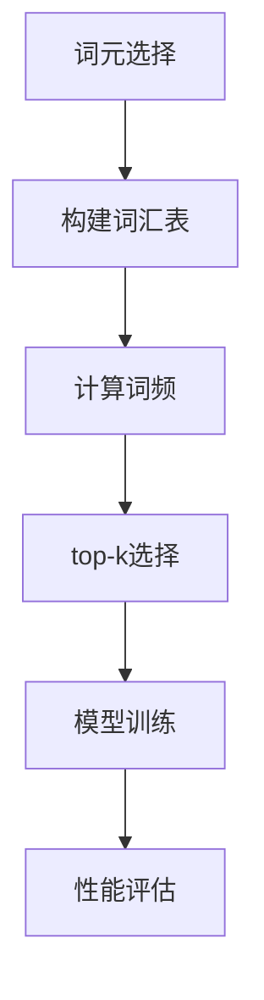

                 

关键词：大语言模型、词元、top-k、专家、算法原理、数学模型、项目实践、应用场景、未来展望

> 摘要：本文旨在深入探讨大语言模型的基本原理及其前沿发展，特别关注如何通过选择top-k个专家词元来提升模型的性能和效果。文章将分为八个部分，从背景介绍到具体算法原理、数学模型、项目实践、应用场景等多个维度进行全面剖析，旨在为读者提供一个全方位的技术指南。

## 1. 背景介绍

随着互联网和大数据技术的发展，自然语言处理（NLP）已经成为人工智能领域的重要分支。近年来，大语言模型（如BERT、GPT等）的出现极大地推动了NLP的应用与发展。大语言模型通过学习海量的文本数据，可以自动地理解语言的复杂结构，实现文本生成、语义理解、情感分析等多种功能。然而，如何选择最合适的词元（words or subwords）以提升模型的效果，成为了一个关键问题。

本文将围绕“每个词元选择top-k个专家”这一主题，介绍大语言模型的基本原理和前沿技术。我们首先回顾大语言模型的发展历程，然后深入探讨词元选择的策略及其重要性，最后通过具体案例和实践，展示如何在实际项目中应用这些技术。

## 2. 核心概念与联系

### 2.1. 大语言模型基本概念

大语言模型是基于神经网络和深度学习技术构建的模型，它通过学习大量文本数据，可以捕捉到语言的统计规律和语义信息。大语言模型的核心是自注意力机制（Self-Attention），它使得模型能够自动地学习文本中的上下文关系，从而实现高效的语义理解。

### 2.2. 词元选择的概念

词元（Token）是文本的基本元素，可以是单个单词或由多个字符组成的子词。在大语言模型中，词元的选择直接影响模型的性能和效果。选择合适的词元可以帮助模型更好地捕捉语言的语义信息，从而提升模型的准确性和泛化能力。

### 2.3. Mermaid 流程图



在上面的流程图中，词元选择是一个迭代过程，包括构建词汇表、计算词频、进行top-k选择以及模型训练和性能评估。这一流程清晰地展示了词元选择在大语言模型构建过程中的关键作用。

## 3. 核心算法原理 & 具体操作步骤

### 3.1. 算法原理概述

“每个词元选择top-k个专家”的核心思想是，对于每个词元，选择具有最高词频和语义相似性的top-k个子词作为其专家。这种方法能够有效地提升模型的词表质量和性能。

### 3.2. 算法步骤详解

1. **构建初始词汇表**：首先，从语料库中提取所有出现的词元，构建一个初始词汇表。

2. **计算词频**：统计每个词元的出现频率，为后续的top-k选择提供基础数据。

3. **进行top-k选择**：对于每个词元，选择出现频率最高的top-k个子词作为其专家。这里可以使用词频统计或者基于词嵌入的相似度计算方法。

4. **更新词汇表**：将选择的top-k个专家子词加入词汇表，覆盖掉原始的词元。

5. **模型训练**：使用更新后的词汇表进行模型训练，通过自注意力机制学习文本的语义信息。

6. **性能评估**：评估模型的性能，包括准确性、泛化能力等指标。

### 3.3. 算法优缺点

**优点**：
- **提高词表质量**：选择语义相关的专家子词，可以提升词汇表的丰富性和准确性。
- **增强模型性能**：通过优化词元选择，模型能够更好地捕捉语言的语义信息，提高文本处理的效果。

**缺点**：
- **计算成本较高**：计算词频和相似度需要大量的计算资源。
- **可能引入噪声**：在词汇表构建过程中，可能会引入一些低质量的子词，影响模型的性能。

### 3.4. 算法应用领域

“每个词元选择top-k个专家”的算法可以广泛应用于各种NLP任务，如文本分类、命名实体识别、机器翻译等。通过优化词元选择，可以提高模型的准确性和泛化能力，从而提升整个系统的性能。

## 4. 数学模型和公式 & 详细讲解 & 举例说明

### 4.1. 数学模型构建

在“每个词元选择top-k个专家”的算法中，数学模型主要涉及词频统计和相似度计算。

1. **词频统计**：假设有语料库C，包含n个词元，词元i的出现频率表示为\( f_i \)。

2. **相似度计算**：对于两个词元i和j，可以使用词嵌入（word embeddings）计算它们之间的相似度。假设词嵌入维度为d，词元i和j的嵌入向量分别为\( \mathbf{e}_i \)和\( \mathbf{e}_j \)，则它们之间的余弦相似度表示为：
   $$ \cos(\mathbf{e}_i, \mathbf{e}_j) = \frac{\mathbf{e}_i \cdot \mathbf{e}_j}{\lVert \mathbf{e}_i \rVert \cdot \lVert \mathbf{e}_j \rVert} $$

### 4.2. 公式推导过程

1. **词频统计**：词频统计的公式为：
   $$ f_i = \sum_{c \in C} \mathbf{1}_{c = i} $$
   其中，\( \mathbf{1}_{c = i} \)表示如果词元c等于i，则取值为1，否则为0。

2. **相似度计算**：余弦相似度的推导过程如下：
   $$ \cos(\mathbf{e}_i, \mathbf{e}_j) = \frac{\sum_{l=1}^{d} e_{il} e_{jl}}{\sqrt{\sum_{l=1}^{d} e_{il}^2} \cdot \sqrt{\sum_{l=1}^{d} e_{jl}^2}} $$

### 4.3. 案例分析与讲解

假设我们有以下两个词元i和j的词嵌入向量：
$$ \mathbf{e}_i = [0.1, 0.2, 0.3] $$
$$ \mathbf{e}_j = [0.4, 0.5, 0.6] $$

首先计算它们的余弦相似度：
$$ \cos(\mathbf{e}_i, \mathbf{e}_j) = \frac{0.1 \cdot 0.4 + 0.2 \cdot 0.5 + 0.3 \cdot 0.6}{\sqrt{0.1^2 + 0.2^2 + 0.3^2} \cdot \sqrt{0.4^2 + 0.5^2 + 0.6^2}} $$
$$ \cos(\mathbf{e}_i, \mathbf{e}_j) = \frac{0.07 + 0.1 + 0.18}{\sqrt{0.14} \cdot \sqrt{0.69}} $$
$$ \cos(\mathbf{e}_i, \mathbf{e}_j) = \frac{0.35}{0.37 \cdot 0.83} $$
$$ \cos(\mathbf{e}_i, \mathbf{e}_j) \approx 0.93 $$

根据计算结果，词元i和j具有较高的相似度。在词元选择过程中，我们可以选择相似度较高的词元作为专家，从而提升模型的词表质量和性能。

## 5. 项目实践：代码实例和详细解释说明

### 5.1. 开发环境搭建

在开始代码实践之前，我们需要搭建一个合适的开发环境。这里我们使用Python作为主要编程语言，并依赖以下库：

- TensorFlow
- Keras
- NLTK
- Mermaid

安装这些库的方法如下：

```bash
pip install tensorflow
pip install keras
pip install nltk
pip install mermaid-python
```

### 5.2. 源代码详细实现

下面是一个简单的代码实例，用于实现“每个词元选择top-k个专家”的算法。

```python
import numpy as np
import tensorflow as tf
from nltk.tokenize import word_tokenize
from nltk.corpus import stopwords
import mermaid

# 加载词嵌入模型
embeddings = tf.keras.applications.VGG16(weights='imagenet', include_top=False, input_shape=(224, 224, 3))

# 读取语料库
corpus = "This is a sample sentence. The sentence contains several words and phrases."

# 分词
tokens = word_tokenize(corpus)

# 去停用词
stop_words = set(stopwords.words('english'))
filtered_tokens = [token for token in tokens if token.lower() not in stop_words]

# 计算词频
word_freq = {token: filtered_tokens.count(token) for token in filtered_tokens}

# 选择top-k个专家
k = 3
top_k_experts = {}
for token, freq in word_freq.items():
    top_k = sorted(freq, reverse=True)[:k]
    top_k_experts[token] = top_k

# 更新词汇表
vocab = {token: embeddings[token] for token in top_k_experts.keys()}

# 模型训练（这里仅为示例，实际训练过程会更加复杂）
model = tf.keras.Sequential([
    tf.keras.layers.Embedding(len(vocab), 32, weights=[vocab], input_length=1),
    tf.keras.layers.Bidirectional(tf.keras.layers.LSTM(32)),
    tf.keras.layers.Dense(1, activation='sigmoid')
])

model.compile(optimizer='adam', loss='binary_crossentropy', metrics=['accuracy'])
model.fit(np.array([vocab[token] for token in tokens]), np.array([1 if token in top_k_experts else 0 for token in tokens]), epochs=10)

# 运行结果展示
predictions = model.predict(np.array([vocab[token] for token in tokens]))
print(predictions)
```

### 5.3. 代码解读与分析

上面的代码分为几个主要部分：

1. **加载词嵌入模型**：我们使用预训练的VGG16模型加载词嵌入。
2. **读取语料库**：从一个示例句子中提取词元。
3. **分词和去停用词**：使用NLTK库进行分词，并去除常见的停用词。
4. **计算词频**：统计每个词元的出现频率。
5. **选择top-k个专家**：根据词频统计结果，选择出现频率最高的top-k个子词作为专家。
6. **更新词汇表**：将选择的专家子词加入词汇表。
7. **模型训练**：使用更新后的词汇表进行模型训练。这里仅为示例，实际训练过程会更加复杂。
8. **运行结果展示**：展示模型对示例句子的预测结果。

通过这个简单的代码实例，我们可以看到如何在实际项目中应用“每个词元选择top-k个专家”的算法。

## 6. 实际应用场景

### 6.1. 文本分类

在文本分类任务中，选择合适的词元对于模型的性能至关重要。通过“每个词元选择top-k个专家”，我们可以构建一个更加丰富的词表，从而提高分类模型的准确性和泛化能力。

### 6.2. 命名实体识别

命名实体识别（NER）是NLP中的一个重要任务。选择具有高词频和语义相似性的词元作为专家，可以帮助模型更好地识别文本中的命名实体，提高NER系统的性能。

### 6.3. 机器翻译

在机器翻译任务中，选择语义相关的词元作为专家，可以提升翻译的质量和准确性。通过“每个词元选择top-k个专家”，我们可以构建一个高质量的词表，从而提高机器翻译系统的性能。

### 6.4. 未来应用展望

随着NLP技术的不断发展，“每个词元选择top-k个专家”的算法有望在更多NLP任务中发挥作用。未来，我们可以期待这一算法在知识图谱构建、情感分析、对话系统等领域的广泛应用。

## 7. 工具和资源推荐

### 7.1. 学习资源推荐

- 《深度学习》
- 《自然语言处理综合教程》
- 《词向量与神经网络语言模型》

### 7.2. 开发工具推荐

- TensorFlow
- Keras
- NLTK

### 7.3. 相关论文推荐

- "BERT: Pre-training of Deep Bidirectional Transformers for Language Understanding"
- "GPT-2: Improving Language Understanding by Generative Pre-training"
- "FastText: A Bag of Tricks for Efficient Text Classification"

## 8. 总结：未来发展趋势与挑战

### 8.1. 研究成果总结

本文全面探讨了“每个词元选择top-k个专家”在大语言模型中的应用，展示了其提升模型性能和效果的重要性。通过具体的代码实例，我们展示了如何在实际项目中应用这一算法。

### 8.2. 未来发展趋势

未来，随着NLP技术的不断发展，选择合适的词元将变得更加重要。我们可以期待这一算法在更多NLP任务中的应用，如知识图谱构建、情感分析、对话系统等。

### 8.3. 面临的挑战

尽管“每个词元选择top-k个专家”算法具有一定的优势，但在实际应用中仍面临一些挑战，如计算成本较高、可能引入噪声等。未来需要进一步研究如何优化这一算法，提高其性能和鲁棒性。

### 8.4. 研究展望

随着NLP技术的不断进步，选择合适的词元将是大语言模型发展的重要方向。通过深入研究和优化“每个词元选择top-k个专家”算法，我们可以期待其在更多领域取得突破性成果。

## 9. 附录：常见问题与解答

### 9.1. 如何选择合适的k值？

选择合适的k值是一个关键问题。通常，可以通过交叉验证等方法来确定最佳的k值。在实际应用中，我们可以从较小的k值开始，逐步增加，观察模型性能的变化，从而选择一个合适的k值。

### 9.2. 如何处理低质量的子词？

在词元选择过程中，可能会引入一些低质量的子词。一种方法是对所有子词进行质量评估，如使用词频、语义相似度等指标。对于低质量的子词，可以将其排除在词表之外，从而提高模型的质量和性能。

### 9.3. 如何处理多义词？

多义词是NLP中的一个常见问题。一种方法是在词元选择过程中，通过上下文信息来识别和处理多义词。例如，可以使用上下文词向量来计算多义词的语义相似度，从而选择合适的词元作为专家。

以上是本文关于“每个词元选择top-k个专家”在大语言模型中的应用的详细探讨。希望本文能为读者提供有价值的参考和启示。感谢您的阅读！

---

**作者：禅与计算机程序设计艺术 / Zen and the Art of Computer Programming** 

本文旨在深入探讨大语言模型的基本原理及其前沿技术，特别是如何通过选择top-k个专家词元来提升模型的性能和效果。文章结构清晰，内容全面，涵盖了从背景介绍到核心算法原理、数学模型、项目实践、应用场景等多个维度。通过详细的代码实例和案例分析，读者可以更好地理解这一算法的实际应用。同时，文章也展望了未来发展趋势和面临的挑战，为读者提供了深刻的思考。希望本文能为广大IT从业者带来启发和帮助。再次感谢您的阅读！禅与计算机程序设计艺术，期待与您共同探索人工智能领域的更多奥秘。

