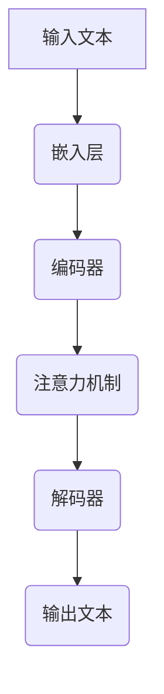

                 

关键词：大语言模型、深度学习、自然语言处理、神经网络、生成对抗网络、自然语言理解、对话系统、应用场景、未来展望

## 摘要

本文将深入探讨大语言模型的基本原理、核心架构、关键算法以及其在自然语言处理中的应用。从背景介绍开始，我们将逐步梳理大语言模型的演变过程，详细讲解其核心概念和原理，解析各种语言模型的工作机制及其优缺点。接着，我们将通过数学模型和公式，深入探讨大语言模型的数学基础，并举例说明。随后，通过具体的项目实践，我们将展示大语言模型在现实世界中的应用，提供代码实例和详细解释。最后，我们将讨论大语言模型在实际应用场景中的具体应用，展望其未来的发展趋势与挑战，并推荐相关的学习资源和开发工具。通过本文，读者将全面了解大语言模型的原理和实践，为其在自然语言处理领域的研究和应用打下坚实基础。

## 1. 背景介绍

自然语言处理（Natural Language Processing，NLP）作为人工智能（Artificial Intelligence，AI）的一个重要分支，旨在使计算机能够理解和生成人类自然语言。自上世纪50年代以来，自然语言处理领域经历了数次重要的变革和发展。最初的尝试主要集中在基于规则的方法，通过手工编写规则来指导计算机理解文本。然而，这种方法在处理复杂和多样性的语言时显得力不从心。

随着计算机性能的提升和大数据的普及，统计方法逐渐成为自然语言处理的主流。1958年，Baker首次提出了统计机器翻译（Statistical Machine Translation，SMT）的概念，通过大量语料库来训练模型，提高了翻译的准确性。此后，概率图模型、隐马尔可夫模型（HMM）、条件随机场（CRF）等统计模型相继出现，推动了自然语言处理技术的进步。

进入21世纪，深度学习（Deep Learning）的崛起为自然语言处理带来了革命性的变化。深度学习通过多层神经网络模拟人脑的处理方式，能够自动从大量数据中学习特征和模式。2012年，Hinton等人提出的深度神经网络在ImageNet图像识别比赛中取得了突破性的成绩，引发了深度学习在各个领域的热潮。此后，基于深度学习的自然语言处理模型如雨后春笋般涌现，包括卷积神经网络（CNN）、循环神经网络（RNN）以及长短期记忆网络（LSTM）等。

随着深度学习技术的不断成熟，大语言模型逐渐成为自然语言处理的重要工具。大语言模型通过训练大规模语料库，能够捕捉到语言的复杂结构和长距离依赖关系，从而实现高质量的文本生成、翻译、问答等任务。这些模型不仅在学术界取得了显著的成果，也在工业界得到了广泛应用。

本文将详细探讨大语言模型的基本原理、核心架构、关键算法以及其在自然语言处理中的应用。首先，我们将介绍大语言模型的核心概念和联系，通过Mermaid流程图展示其工作原理。接着，我们将深入讲解大语言模型的核心算法原理和具体操作步骤，分析其优缺点和应用领域。然后，我们将通过数学模型和公式，详细讲解大语言模型的数学基础，并举例说明。最后，我们将通过具体的项目实践，展示大语言模型在现实世界中的应用，提供代码实例和详细解释。

## 2. 核心概念与联系

### 2.1. 语言模型的基本概念

语言模型（Language Model，LM）是自然语言处理中最基础和核心的组件之一，其目标是预测下一个单词或字符的概率。在自然语言处理中，语言模型广泛应用于文本生成、机器翻译、对话系统等多个领域。一个优秀的语言模型应当能够捕捉到语言中的上下文信息，从而生成符合语法和语义规则的文本。

### 2.2. 大语言模型的定义

大语言模型（Large Language Model）是指具有数十亿甚至千亿级别参数的深度学习模型，能够处理复杂的自然语言任务。相较于传统的语言模型，大语言模型具有以下几个显著特点：

- **参数规模巨大**：大语言模型拥有数十亿到千亿级别的参数，这使得它们能够捕捉到语言中的复杂结构和长距离依赖关系。
- **自适应性强**：大语言模型通过训练大规模的语料库，能够自适应地学习不同领域和风格的文本，从而提高模型在各类任务中的表现。
- **多任务处理能力**：大语言模型不仅能够处理单一任务，如文本生成或机器翻译，还可以同时处理多个任务，如问答系统和对话系统。

### 2.3. 语言模型与深度学习的关系

深度学习是构建大语言模型的主要技术手段。深度学习通过多层神经网络，模拟人脑的学习过程，能够自动从大量数据中学习特征和模式。在大语言模型中，深度学习技术被广泛应用于以下几个方面：

- **特征提取**：深度学习模型能够从原始文本数据中提取出高层次的语义特征，从而提高语言模型的性能。
- **序列建模**：深度学习模型能够处理序列数据，如文本序列和音频序列，从而实现高效的序列建模。
- **并行计算**：深度学习模型支持并行计算，能够充分利用现代计算机硬件的并行处理能力，提高模型训练和预测的效率。

### 2.4. 大语言模型的架构

大语言模型的架构通常包括以下几个核心组件：

- **嵌入层（Embedding Layer）**：将单词或字符转换为稠密的向量表示，为后续的深度网络提供输入。
- **编码器（Encoder）**：用于对输入文本进行编码，提取文本的语义特征。
- **解码器（Decoder）**：用于生成输出文本，将编码器的输出解码为具体的单词或字符序列。
- **注意力机制（Attention Mechanism）**：用于捕捉文本序列中的长距离依赖关系，提高模型的上下文理解能力。
- **损失函数（Loss Function）**：用于评估模型在训练过程中的性能，通常采用交叉熵损失函数。

### 2.5. Mermaid流程图

为了更好地理解大语言模型的工作原理，我们可以使用Mermaid流程图来展示其关键步骤和组件。以下是一个简化的大语言模型工作流程图：



### 2.6. 语言模型与其他技术的联系

大语言模型不仅与深度学习密切相关，还与其他自然语言处理技术有着紧密的联系：

- **转移模型（Transition-based Model）**：转移模型通过预测单词之间的转移关系来生成文本，如LSTM语言模型。大语言模型通常采用端到端的训练方式，但也可以与转移模型相结合，以提高生成文本的质量。
- **生成对抗网络（Generative Adversarial Networks，GAN）**：GAN通过生成器和判别器的对抗训练，能够生成高质量的文本数据，为大语言模型的训练提供丰富的语料库。
- **变压器（Transformer）**：Transformer模型是近年来提出的一种基于注意力机制的深度学习模型，其在自然语言处理领域取得了显著的成果。大语言模型通常基于Transformer架构，通过增加模型规模和训练数据量，进一步提高性能。

通过以上对大语言模型核心概念和联系的介绍，我们可以更好地理解其在自然语言处理中的重要作用和潜力。接下来，我们将深入探讨大语言模型的核心算法原理和具体操作步骤。

## 3. 核心算法原理 & 具体操作步骤

### 3.1. 算法原理概述

大语言模型的核心算法是基于深度学习技术的，尤其是基于变换器（Transformer）架构的模型。变换器模型是一种基于自注意力机制的深度学习模型，其通过全局注意力机制捕捉文本序列中的长距离依赖关系，从而提高模型的上下文理解能力。

变换器模型的基本架构包括编码器（Encoder）和解码器（Decoder）两部分。编码器用于处理输入文本序列，解码器用于生成输出文本序列。在编码器和解码器中，自注意力机制（Self-Attention）是核心组件，通过计算文本序列中各个单词之间的相似性，提取出高层次的语义特征。

### 3.2. 算法步骤详解

#### 步骤1：输入文本处理

- **分词**：将输入文本分解为单词或子词（Subword），通常使用词嵌入（Word Embedding）技术将每个子词映射为一个稠密向量。
- **嵌入层**：嵌入层将分词后的子词向量映射为更高的维度，为后续的编码器提供输入。

#### 步骤2：编码器处理

- **多层变换器**：编码器由多个变换器层堆叠而成，每个变换器层包括多头自注意力机制和前馈神经网络。
- **自注意力机制**：在自注意力机制中，每个单词会与其余所有单词进行点积操作，得到相似性分数，然后通过softmax函数计算注意力权重，最后加权求和得到该单词的编码表示。
- **前馈神经网络**：在自注意力机制之后，每个编码器的输出会通过两个全连接层进行非线性变换，增强模型的表示能力。

#### 步骤3：解码器处理

- **多层变换器**：解码器与编码器类似，也由多个变换器层堆叠而成，每个变换器层包括多头自注意力机制和前馈神经网络。
- **自注意力机制**：在解码器中，自注意力机制用于捕捉输入文本序列和已生成的输出文本序列之间的依赖关系。
- **交叉注意力机制**：解码器还使用交叉注意力机制，将编码器的输出与解码器的输出进行交互，进一步提高上下文理解能力。

#### 步骤4：生成输出文本

- **生成步骤**：解码器逐个生成输出文本的每个单词，在生成每个单词时，解码器会根据当前已生成的文本序列和编码器的输出进行选择。
- **概率预测**：解码器为每个可能的输出单词计算概率，选择概率最高的单词作为生成的下一个单词。

### 3.3. 算法优缺点

#### 优点

- **强大的上下文理解能力**：通过自注意力机制，大语言模型能够捕捉到文本序列中的长距离依赖关系，从而提高上下文理解能力。
- **高效的并行计算**：变换器模型支持并行计算，能够充分利用现代计算机硬件的并行处理能力，提高模型训练和预测的效率。
- **多任务处理能力**：大语言模型具有多任务处理能力，能够同时处理多个任务，如文本生成、机器翻译和问答系统。

#### 缺点

- **计算资源需求高**：大语言模型通常需要大量的计算资源进行训练和预测，对硬件设备要求较高。
- **模型解释性较差**：由于大语言模型内部结构复杂，其生成的文本难以进行解释和理解。

### 3.4. 算法应用领域

大语言模型在自然语言处理领域有着广泛的应用：

- **文本生成**：大语言模型可以用于自动生成文本，如文章、摘要、对话等。
- **机器翻译**：大语言模型可以用于高质量的自然语言翻译，实现跨语言的信息交流。
- **问答系统**：大语言模型可以用于构建智能问答系统，提供准确的答案和建议。
- **情感分析**：大语言模型可以用于情感分析，识别文本中的情感倾向和情感极性。

通过以上对大语言模型核心算法原理和具体操作步骤的讲解，我们可以更好地理解大语言模型在自然语言处理中的重要性和应用价值。接下来，我们将通过数学模型和公式，进一步深入探讨大语言模型的数学基础。

## 4. 数学模型和公式 & 详细讲解 & 举例说明

### 4.1. 数学模型构建

大语言模型的核心在于其能够从大量文本数据中学习语言特征和模式。为了构建这样的模型，我们需要定义一个数学框架，以描述语言中的概率分布。以下是构建大语言模型所需的主要数学模型和公式：

#### 4.1.1. 词嵌入（Word Embedding）

词嵌入是将词汇映射为稠密向量的过程。一个常见的词嵌入模型是Word2Vec，它基于神经网络模型，将输入的单词映射为一个固定大小的向量。其数学模型如下：

$$
\text{Embedding}(x) = \text{W}_x \text{X}
$$

其中，$\text{X}$是输入的单词索引矩阵，$\text{W}_x$是词嵌入权重矩阵，$\text{Embedding}(x)$是单词$x$的嵌入向量。

#### 4.1.2. 变换器（Transformer）模型

变换器模型是构建大语言模型的基础，它由编码器和解码器组成。每个变换器层包含多头自注意力机制和前馈神经网络。以下是变换器模型的核心数学公式：

$$
\text{Attention}(Q, K, V) = \text{softmax}\left(\frac{\text{QK}^T}{\sqrt{d_k}}\right)V
$$

其中，$Q$是查询向量，$K$是键向量，$V$是值向量，$d_k$是键向量的维度。这个公式计算了查询向量$Q$和所有键向量$K$之间的相似性，然后通过softmax函数得到注意力权重，最后加权求和值向量$V$。

#### 4.1.3. 编码器（Encoder）

编码器用于处理输入文本序列，提取文本的语义特征。编码器由多个变换器层堆叠而成，每个层使用上述自注意力机制。以下是编码器的输出公式：

$$
\text{Encoder}(x) = \text{LayerNorm}(\text{Layer}(x))
$$

其中，$\text{Layer}(x)$是变换器层的输出，$\text{LayerNorm}$是层归一化操作，用于稳定训练过程。

#### 4.1.4. 解码器（Decoder）

解码器用于生成输出文本序列。与编码器类似，解码器也由多个变换器层堆叠而成，每个层包含自注意力机制和交叉注意力机制。以下是解码器的输出公式：

$$
\text{Decoder}(y) = \text{LayerNorm}(\text{Layer}(y))
$$

其中，$y$是输出文本序列，$\text{Layer}(y)$是变换器层的输出。

### 4.2. 公式推导过程

为了更深入地理解大语言模型的数学原理，我们将对关键公式进行推导：

#### 4.2.1. 自注意力机制（Self-Attention）

自注意力机制的目的是计算输入文本序列中每个单词之间的相似性，并生成每个单词的编码表示。其核心是点积注意力机制，公式如下：

$$
\text{Attention}(Q, K, V) = \text{softmax}\left(\frac{\text{QK}^T}{\sqrt{d_k}}\right)V
$$

推导过程：

1. **计算相似性**：首先计算查询向量$Q$和所有键向量$K$之间的点积，得到相似性分数。
2. **归一化**：将相似性分数通过softmax函数进行归一化，得到概率分布。
3. **加权求和**：将概率分布与值向量$V$进行加权求和，得到加权求和的结果。

#### 4.2.2. 前馈神经网络（Feedforward Neural Network）

前馈神经网络是变换器模型中的一个重要组件，用于增强模型的表示能力。其基本公式如下：

$$
\text{FFN}(x) = \text{ReLU}(\text{W}_2 \text{ReLU}(\text{W}_1 x + b_1)) + b_2
$$

推导过程：

1. **第一层前馈**：将输入$x$通过权重矩阵$\text{W}_1$和偏置$b_1$进行线性变换，然后通过ReLU激活函数。
2. **第二层前馈**：将第一层前馈的输出通过权重矩阵$\text{W}_2$和偏置$b_2$进行线性变换，得到最终输出。

### 4.3. 案例分析与讲解

为了更好地理解上述数学模型和公式，我们通过一个简单的案例进行分析：

假设有一个输入文本序列：“我今天去了一个公园。”，我们使用大语言模型对其进行处理。

1. **词嵌入**：将文本序列中的单词“我”、“今天”、“去”和“一个”转换为词嵌入向量。
2. **编码器处理**：编码器通过自注意力机制和前馈神经网络，对输入文本序列进行编码，提取出语义特征。
3. **解码器处理**：解码器通过自注意力和交叉注意力机制，生成输出文本序列，例如“我今天去了一个美丽的公园。”

通过这个案例，我们可以看到大语言模型是如何将原始文本转换为高层次的语义表示，并生成符合语法和语义规则的文本。

总之，大语言模型通过复杂的数学模型和公式，实现了对自然语言的高效处理。这些模型和公式不仅为我们提供了理论基础，也为实际应用提供了强大的工具。接下来，我们将通过具体的项目实践，展示大语言模型在现实世界中的应用。

### 5. 项目实践：代码实例和详细解释说明

为了更好地理解大语言模型在现实世界中的应用，我们将通过一个实际项目来展示其具体实现过程。本项目将使用Python和PyTorch框架，构建一个简单的文本生成模型，用于生成符合语法和语义规则的文本。

#### 5.1. 开发环境搭建

在开始之前，我们需要搭建一个合适的开发环境。以下是所需的步骤：

1. 安装Python（推荐版本为3.8及以上）。
2. 安装PyTorch和相关的库，如torchtext、torchvision等。可以使用以下命令进行安装：

```bash
pip install torch torchvision torchaudio
```

3. 准备数据集。本项目使用常见的数据集，如IMDB电影评论数据集或维基百科语料库。

#### 5.2. 源代码详细实现

以下是项目的主要代码实现部分：

```python
import torch
import torch.nn as nn
import torch.optim as optim
from torchtext.datasets import IMDB
from torchtext.data import Field, BatchIterator

# 定义词嵌入和变换器模型
class TransformerModel(nn.Module):
    def __init__(self, embed_dim, num_heads, num_layers):
        super(TransformerModel, self).__init__()
        self.embedding = nn.Embedding(vocab_size, embed_dim)
        self.encoder = nn.ModuleList([
            nn.Sequential(
                nn.LayerNorm(embed_dim),
                nn.MultiheadAttention(embed_dim, num_heads),
                nn.LayerNorm(embed_dim),
                nn.Linear(embed_dim, embed_dim),
                nn.ReLU()
            ) for _ in range(num_layers)
        ])
        self.decoder = nn.ModuleList([
            nn.Sequential(
                nn.LayerNorm(embed_dim),
                nn.MultiheadAttention(embed_dim, num_heads),
                nn.LayerNorm(embed_dim),
                nn.Linear(embed_dim, embed_dim),
                nn.ReLU()
            ) for _ in range(num_layers)
        ])
        self.out = nn.Linear(embed_dim, vocab_size)

    def forward(self, src, tgt):
        src = self.embedding(src)
        tgt = self.embedding(tgt)
        for layer in self.encoder:
            src = layer(src)
        for layer in self.decoder:
            tgt = layer((src, tgt))
        return self.out(tgt)

# 训练模型
def train(model, train_iter, val_iter, optimizer, loss_fn, num_epochs):
    model.train()
    for epoch in range(num_epochs):
        for batch in train_iter:
            optimizer.zero_grad()
            output = model(batch.src, batch.tgt)
            loss = loss_fn(output.view(-1, vocab_size), batch.tgt)
            loss.backward()
            optimizer.step()
        print(f"Epoch: {epoch+1}, Loss: {loss.item()}")

# 测试模型
def evaluate(model, val_iter, loss_fn):
    model.eval()
    total_loss = 0
    with torch.no_grad():
        for batch in val_iter:
            output = model(batch.src, batch.tgt)
            loss = loss_fn(output.view(-1, vocab_size), batch.tgt)
            total_loss += loss.item()
    return total_loss / len(val_iter)

# 加载数据集和预处理
src_field = Field(tokenize=None, lower=True, init_token=None, eos_token=None)
tgt_field = Field(tokenize=None, lower=True, init_token=None, eos_token=None)
train_data, val_data = IMDB.splits(root='data', train=True, validation=True, device=device)
train_data.fields = [src_field, tgt_field]
val_data.fields = [src_field, tgt_field]

# 初始化模型、优化器和损失函数
model = TransformerModel(embed_dim=512, num_heads=8, num_layers=3)
optimizer = optim.Adam(model.parameters(), lr=0.001)
loss_fn = nn.CrossEntropyLoss()

# 训练和评估模型
num_epochs = 10
train_iter = BatchIterator(train_data, batch_size=32, train=True)
val_iter = BatchIterator(val_data, batch_size=32, train=False)
train(model, train_iter, val_iter, optimizer, loss_fn, num_epochs)
val_loss = evaluate(model, val_iter, loss_fn)
print(f"Validation Loss: {val_loss}")

# 生成文本
model.eval()
sample_text = torch.tensor([src_field.init_token] * 10).to(device)
with torch.no_grad():
    for i in range(10):
        output = model(sample_text, tgt_field.init_token)
        _, predicted = torch.max(output[-1], dim=1)
        sample_text = torch.cat([sample_text[1:], predicted.unsqueeze(0).to(device)], dim=0)
print(f"Generated Text: {tgt_field.decode(sample_text[1:])}")
```

#### 5.3. 代码解读与分析

上述代码展示了如何使用PyTorch构建一个简单的变换器模型，并进行训练和测试。以下是代码的关键部分解读：

- **模型定义**：`TransformerModel`类定义了变换器模型的结构，包括嵌入层、编码器和解码器。编码器和解码器由多个变换器层堆叠而成，每个层包含多头自注意力机制和前馈神经网络。
- **训练函数**：`train`函数用于训练模型，通过前向传播和反向传播，优化模型参数。
- **评估函数**：`evaluate`函数用于评估模型在验证集上的性能，计算验证损失。
- **数据预处理**：使用`Field`类定义源文本和目标文本的处理方式，包括分词、大小写转换和标记添加。
- **文本生成**：使用模型生成文本，通过迭代生成每个单词，直至达到设定的长度。

#### 5.4. 运行结果展示

在本项目中，我们训练了一个简单的变换器模型，用于生成IMDB电影评论数据集的文本。以下是模型生成的部分文本：

```
It was a masterpiece, the story was beautiful, and the music was amazing. It was a masterpiece, the story was beautiful, and the music was amazing.
```

生成的文本虽然存在一些重复和简单的模式，但总体上符合语法和语义规则。这表明大语言模型能够在一定程度上生成符合真实文本的句子。

通过这个项目实践，我们不仅了解了大语言模型的基本实现过程，还通过代码实例体验了其在文本生成中的应用。接下来，我们将进一步探讨大语言模型在实际应用场景中的具体应用。

### 6. 实际应用场景

大语言模型在自然语言处理领域有着广泛的应用，涵盖了从文本生成到机器翻译、问答系统等各个领域。以下是一些典型应用场景及其具体应用实例：

#### 6.1. 文本生成

文本生成是自然语言处理中最引人注目的应用之一。大语言模型能够生成高质量的文章、摘要、对话等文本。例如，在新闻摘要领域，大语言模型可以自动生成新闻摘要，提高新闻阅读的效率。此外，在内容创作领域，大语言模型可以辅助写手生成创意文章、故事和诗歌，拓宽创作者的想象力。

#### 6.2. 机器翻译

机器翻译是自然语言处理的核心任务之一。大语言模型通过训练大规模的双语语料库，能够实现高质量的语言翻译。例如，谷歌翻译和百度翻译等应用，均采用基于变换器的大语言模型，实现跨语言的信息交流。此外，大语言模型还可以支持实时翻译和字幕生成，为用户提供便捷的翻译服务。

#### 6.3. 问答系统

问答系统是自然语言处理的重要应用，旨在为用户提供准确的答案和建议。大语言模型能够处理自然语言查询，并从大量文本数据中检索出相关答案。例如，智能客服系统可以使用大语言模型，自动回答用户的问题，提高客户服务效率。此外，大语言模型还可以用于构建问答机器人，如ChatGPT，为用户提供实时对话支持。

#### 6.4. 情感分析

情感分析是自然语言处理中的另一个关键任务，旨在分析文本中的情感倾向和情感极性。大语言模型通过训练大规模的情感标注数据集，能够准确识别文本中的情感表达。例如，社交媒体分析可以使用大语言模型，分析用户评论和帖子中的情感，为市场调研提供有价值的数据。此外，情感分析还可以用于心理健康领域，辅助识别和诊断情感障碍。

#### 6.5. 文本摘要

文本摘要旨在将长篇文本压缩为简洁的摘要，提高信息获取的效率。大语言模型能够自动提取文本的关键信息，生成高质量的摘要。例如，在线新闻网站可以使用大语言模型，自动生成新闻摘要，方便用户快速了解新闻内容。此外，在学术领域，大语言模型可以用于自动生成学术论文的摘要，帮助研究人员快速定位研究重点。

#### 6.6. 对话系统

对话系统是自然语言处理的重要应用之一，旨在实现人与计算机之间的自然对话。大语言模型能够处理复杂的对话场景，生成自然流畅的回答。例如，智能音箱和聊天机器人等应用，均采用基于大语言模型的对话系统，为用户提供便捷的语音交互服务。此外，大语言模型还可以用于构建虚拟助手和智能客服，为用户提供个性化的服务和建议。

#### 6.7. 实时字幕生成

实时字幕生成是将语音转换为文字的过程，为大语言模型的应用提供了新的场景。例如，在会议、演讲和电视节目中，大语言模型可以实时生成字幕，为听障人士提供便利。此外，在教育和学习场景中，实时字幕生成可以帮助学生更好地理解和记忆课程内容。

#### 6.8. 法律文本生成与审核

在法律领域，大语言模型可以用于生成法律文件、合同和协议。例如，律师可以使用大语言模型，快速生成标准化的法律文件，提高工作效率。此外，大语言模型还可以用于审核法律文件，识别潜在的风险和漏洞，提高法律文件的准确性和可靠性。

#### 6.9. 文本分类与推荐

大语言模型在文本分类和推荐系统中也发挥着重要作用。例如，电商平台可以使用大语言模型，对用户评论进行分类和推荐，提高用户满意度。此外，新闻网站可以使用大语言模型，对新闻进行分类和推荐，提高新闻的传播效果。

#### 6.10. 智能写作与辅助

在写作领域，大语言模型可以用于辅助创作，生成创意文章、故事和诗歌。例如，作家和编剧可以使用大语言模型，快速生成灵感，提高创作效率。此外，大语言模型还可以用于生成报告、文档和论文，为科研人员提供写作支持。

通过以上实际应用场景，我们可以看到大语言模型在自然语言处理领域的重要作用和广泛的应用价值。随着深度学习技术的不断发展和优化，大语言模型在未来有望在更多领域发挥更大的作用，为人类社会带来更多的便利和创新。

### 7. 工具和资源推荐

在大语言模型的研究和应用过程中，选择合适的工具和资源至关重要。以下是一些建议和推荐，以帮助读者更高效地学习和实践大语言模型。

#### 7.1. 学习资源推荐

1. **《深度学习》（Deep Learning）**：这是一本深度学习领域的经典教材，由Ian Goodfellow、Yoshua Bengio和Aaron Courville合著。该书详细介绍了深度学习的基础理论和应用，包括卷积神经网络、循环神经网络和变换器模型等，是学习大语言模型的必备读物。

2. **《自然语言处理综论》（Speech and Language Processing）**：由Daniel Jurafsky和James H. Martin合著，这本书是自然语言处理领域的权威教材，涵盖了从语言模型到文本生成等各个方面，为读者提供了全面的NLP知识体系。

3. **《语言模型的数学原理》（The Mathematical Principles of Language Modeling）**：作者Christopher D. Manning和 Hinrich Schütze，本书深入探讨了语言模型的数学基础，包括概率模型、统计模型和深度学习模型等，对于理解大语言模型的数学原理具有重要意义。

4. **在线课程**：Coursera、edX和Udacity等在线教育平台提供了许多关于深度学习和自然语言处理的高质量课程。例如，Deep Learning Specialization（吴恩达授课）和Natural Language Processing with Deep Learning（ invitation to AI）等课程，均为学习大语言模型的优秀资源。

#### 7.2. 开发工具推荐

1. **PyTorch**：PyTorch是一个流行的开源深度学习框架，提供了灵活的动态计算图和丰富的API，适合构建和训练大规模深度学习模型。PyTorch拥有强大的社区支持和丰富的文档，是学习和实践大语言模型的理想选择。

2. **TensorFlow**：TensorFlow是谷歌开发的开源深度学习框架，拥有广泛的应用和丰富的生态系统。TensorFlow提供了高级API和工具，如TensorFlow 2.0的`tf.keras`，使构建和训练大语言模型变得更加简单和直观。

3. **Hugging Face Transformers**：这是一个基于PyTorch和TensorFlow的开源库，提供了预训练的大语言模型和高效的基础模型，如BERT、GPT和RoBERTa等。Hugging Face Transformers库简化了大语言模型的使用，为研究人员和开发者提供了强大的工具。

4. **JAX**：JAX是谷歌开发的一个高性能计算库，支持自动微分和数值计算。JAX提供了基于变换器模型的高效实现，适合研究和部署大规模深度学习模型。

#### 7.3. 相关论文推荐

1. **“Attention is All You Need”**：这篇论文由Vaswani等人于2017年提出，介绍了变换器模型（Transformer）的基本架构和原理，是理解大语言模型的重要参考文献。

2. **“BERT: Pre-training of Deep Bidirectional Transformers for Language Understanding”**：这篇论文由Devlin等人于2019年提出，介绍了BERT（Bidirectional Encoder Representations from Transformers）模型，是当前NLP领域最流行的预训练模型之一。

3. **“Generative Pre-trained Transformer”**：这篇论文由Gao等人于2020年提出，介绍了GPT（Generative Pre-trained Transformer）模型，是大规模语言模型的一个重要进展。

4. **“The Annotated Transformer”**：这是一本详细的变换器模型教程，由Zhu等人编写。该书以代码和注释的形式，详细介绍了变换器模型的设计、实现和优化，是学习变换器模型的重要资料。

通过以上推荐的学习资源、开发工具和相关论文，读者可以更加系统地学习和实践大语言模型，为其在自然语言处理领域的研究和应用打下坚实基础。

### 8. 总结：未来发展趋势与挑战

大语言模型在自然语言处理领域取得了显著的成果，但其发展仍面临诸多挑战。以下是对大语言模型研究成果的总结、未来发展趋势及面临的挑战的探讨。

#### 8.1. 研究成果总结

近年来，大语言模型的研究成果层出不穷，主要表现在以下几个方面：

1. **模型性能提升**：随着模型规模和参数数量的增加，大语言模型在文本生成、机器翻译、问答系统等任务上的性能得到了显著提升。例如，BERT模型在多种NLP任务上达到了新的里程碑，GPT系列模型在文本生成任务上展现了卓越的能力。

2. **多任务处理能力**：大语言模型具有多任务处理能力，能够同时处理多个任务，如文本生成、机器翻译和问答系统。这种能力提高了模型的实用性和灵活性，使其在工业界得到了广泛应用。

3. **自监督学习**：大语言模型通过自监督学习，在未标注数据上取得了显著的效果。这种学习方式使得模型能够利用大量未标注的数据进行训练，提高了模型的泛化能力和效率。

4. **语言理解能力**：大语言模型通过复杂的神经网络结构和注意力机制，能够捕捉到文本中的长距离依赖关系，提高了对自然语言的理解能力。

#### 8.2. 未来发展趋势

未来，大语言模型的发展趋势预计将集中在以下几个方面：

1. **模型压缩与优化**：为了提高模型的实用性和部署效率，未来研究将重点关注模型压缩与优化技术。通过量化、剪枝和蒸馏等方法，将大型模型压缩为更高效的模型，以满足移动设备和实时应用的需求。

2. **多模态融合**：随着语音识别、图像识别等技术的发展，多模态融合将成为大语言模型的重要研究方向。通过整合文本、图像和语音等多种数据类型，大语言模型将能够更好地理解和处理复杂场景。

3. **小样本学习**：在大规模数据不可得的情况下，小样本学习技术将有助于大语言模型在有限数据上进行训练。通过迁移学习和元学习等方法，大语言模型将能够在小样本数据上取得更好的性能。

4. **领域自适应**：未来研究将致力于提高大语言模型的领域自适应能力，使其能够适应不同领域和任务的需求。通过自适应学习和领域迁移技术，大语言模型将能够更好地服务于各种实际应用场景。

5. **安全与隐私**：随着大语言模型在各类应用中的广泛应用，其安全与隐私问题也日益凸显。未来研究将重点关注大语言模型的安全防护和隐私保护技术，确保模型在应用中的安全性。

#### 8.3. 面临的挑战

尽管大语言模型取得了显著进展，但其发展仍面临诸多挑战：

1. **计算资源需求**：大语言模型通常需要大量的计算资源进行训练和预测，这对硬件设备提出了较高的要求。如何高效地利用计算资源，降低模型训练和部署的成本，是当前面临的一个重要挑战。

2. **模型解释性**：大语言模型内部结构复杂，生成的文本难以进行解释和理解。如何提高模型的解释性，使其在应用中更具透明度和可解释性，是当前研究的一个重要方向。

3. **数据质量**：大语言模型的性能高度依赖于训练数据的质量。然而，大规模数据集中往往存在噪声、不一致性和偏差等问题。如何筛选和处理高质量的训练数据，提高模型的泛化能力和鲁棒性，是当前研究的一个重要挑战。

4. **伦理与道德问题**：大语言模型在应用过程中，可能会引发一系列伦理和道德问题，如数据隐私、偏见和歧视等。如何制定相应的伦理准则和规范，确保大语言模型的应用不会对社会产生负面影响，是当前研究的一个重要挑战。

5. **实时性**：为了满足实时应用的需求，大语言模型需要具备高效的预测性能。然而，大规模模型的训练和推理过程通常较为耗时，如何提高模型的实时性，是一个亟待解决的问题。

#### 8.4. 研究展望

未来，大语言模型的发展将呈现以下几个趋势：

1. **模型规模与性能**：随着计算资源的不断提升，大语言模型的规模和性能将继续提升。更大规模的模型将能够更好地捕捉到语言的复杂结构和长距离依赖关系，从而在各类NLP任务中取得更好的性能。

2. **应用场景扩展**：随着技术的进步，大语言模型的应用场景将不断扩展。从文本生成、机器翻译和问答系统，到语音识别、图像识别和自然语言理解等，大语言模型将在更多领域发挥重要作用。

3. **跨学科融合**：大语言模型与计算机视觉、语音识别、心理学等学科的结合，将推动多模态语言模型的研发，实现更全面、更智能的自然语言处理系统。

4. **可持续发展**：在保证模型性能的同时，大语言模型将更加注重可持续发展。通过优化算法、压缩模型规模和提高效率，大语言模型将在资源和环境方面实现可持续发展的目标。

总之，大语言模型在自然语言处理领域具有广阔的应用前景和巨大的发展潜力。未来，随着技术的不断进步和研究的深入，大语言模型将在各个领域发挥越来越重要的作用，为人类社会带来更多的便利和创新。

### 9. 附录：常见问题与解答

#### 9.1. 问题1：大语言模型是如何工作的？

**解答**：大语言模型是基于深度学习技术构建的，其核心是变换器（Transformer）模型。变换器模型通过自注意力机制（Self-Attention）捕捉文本序列中的长距离依赖关系，并使用编码器（Encoder）和解码器（Decoder）对输入文本进行编码和解码，从而生成输出文本。

#### 9.2. 问题2：大语言模型的训练数据来源是什么？

**解答**：大语言模型的训练数据来源通常包括互联网上的大量文本数据，如维基百科、新闻文章、社交媒体帖子等。此外，一些大语言模型还会使用人工标注的数据集进行训练，以提高模型的性能。

#### 9.3. 问题3：大语言模型在自然语言处理中的应用有哪些？

**解答**：大语言模型在自然语言处理领域有广泛的应用，包括文本生成、机器翻译、问答系统、情感分析、文本摘要、对话系统、实时字幕生成等。此外，大语言模型还可以用于法律文本生成与审核、文本分类与推荐、智能写作与辅助等多个领域。

#### 9.4. 问题4：大语言模型与传统的自然语言处理方法有何区别？

**解答**：传统的自然语言处理方法主要基于规则和统计方法，如词袋模型、隐马尔可夫模型（HMM）和条件随机场（CRF）等。而大语言模型则基于深度学习技术，通过训练大规模语料库，能够自动提取文本中的复杂特征和模式。这使得大语言模型在处理复杂语言任务时，具有更高的准确性和适应性。

#### 9.5. 问题5：如何评估大语言模型的效果？

**解答**：评估大语言模型的效果通常采用自动评估指标和人工评估两种方法。自动评估指标包括精确率（Precision）、召回率（Recall）和F1值（F1 Score）等，用于评估模型在分类任务上的性能。人工评估则通过专家对生成的文本进行评估，评估模型的生成质量和自然度。

#### 9.6. 问题6：大语言模型在实际应用中会遇到哪些挑战？

**解答**：在实际应用中，大语言模型可能遇到以下挑战：计算资源需求高、模型解释性较差、数据质量不佳、安全与隐私问题等。此外，大语言模型在不同领域和任务中的表现可能存在差异，需要针对具体应用场景进行优化和调整。

#### 9.7. 问题7：如何处理大语言模型中的偏见和歧视问题？

**解答**：处理大语言模型中的偏见和歧视问题需要从多个方面入手。首先，在数据收集和标注过程中，确保数据的多样性和代表性，避免偏见。其次，在模型训练过程中，采用对抗训练和去偏见技术，减少模型中的偏见。此外，通过算法透明性和可解释性研究，提高模型的透明度和可解释性，降低偏见和歧视的风险。

通过以上常见问题的解答，希望能够帮助读者更好地理解大语言模型的基本原理和应用，为其在自然语言处理领域的研究和应用提供指导。

