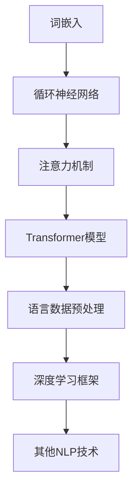

                 

关键词：大语言模型、深度学习、自然语言处理、环境影响、原理基础、前沿研究

> 摘要：本文将深入探讨大语言模型的基本原理及其对环境的影响。我们将从背景介绍开始，逐步阐述核心概念与联系，解析核心算法原理与数学模型，展示项目实践中的代码实例，探讨实际应用场景，推荐相关工具和资源，并总结研究成果，展望未来发展趋势与挑战。

## 1. 背景介绍

大语言模型是自然语言处理（NLP）领域的一种重要技术，它通过对海量语言数据的深度学习，构建出一个能够理解和生成自然语言的强大系统。近年来，随着计算能力的提升和深度学习技术的进步，大语言模型的发展取得了显著的成果，已经在众多实际应用中发挥了重要作用。

然而，随着大语言模型的规模不断扩大，其对环境的影响也逐渐成为关注的热点。本文将围绕大语言模型的原理基础与前沿研究，探讨其对环境可能产生的影响，以及应对措施。

## 2. 核心概念与联系

### 2.1 大语言模型的核心概念

大语言模型的核心概念包括：

- **词嵌入（Word Embedding）**：将词语映射为高维向量，使得语义相似的词语在向量空间中靠近。
- **循环神经网络（RNN）**：用于处理序列数据，能够捕捉前后文的信息。
- **注意力机制（Attention Mechanism）**：通过动态关注序列中的关键部分，提升模型对输入数据的理解能力。
- **Transformer模型**：基于自注意力机制的深度学习模型，广泛应用于大规模语言模型。

### 2.2 大语言模型的联系

大语言模型通过以下方式与自然语言处理和其他技术相互联系：

- **语言数据预处理**：包括分词、标注、清洗等，为模型训练提供高质量的数据集。
- **深度学习框架**：如TensorFlow、PyTorch等，用于搭建和训练大规模语言模型。
- **其他NLP技术**：如文本分类、情感分析、机器翻译等，大语言模型在这些领域都有广泛的应用。

### 2.3 Mermaid 流程图

以下是一个简化的Mermaid流程图，展示了大语言模型的基本架构和核心联系：



## 3. 核心算法原理 & 具体操作步骤

### 3.1 算法原理概述

大语言模型的算法原理主要基于深度学习和自然语言处理技术。其中，词嵌入、循环神经网络、注意力机制和Transformer模型是最核心的部分。

- **词嵌入**：通过映射，将词语转换为高维向量。
- **循环神经网络**：处理序列数据，捕捉前后文信息。
- **注意力机制**：动态关注序列中的关键部分。
- **Transformer模型**：基于自注意力机制，适用于大规模语言模型。

### 3.2 算法步骤详解

大语言模型的训练过程主要包括以下步骤：

1. **数据预处理**：对语言数据进行分析和清洗，将其转换为模型可处理的格式。
2. **词嵌入**：将词语映射为高维向量。
3. **循环神经网络**：通过多个循环神经网络层，逐步处理输入序列。
4. **注意力机制**：在循环神经网络的基础上，引入注意力机制，提高模型对输入数据的理解能力。
5. **Transformer模型**：使用Transformer模型替代循环神经网络，进一步提升模型的性能。

### 3.3 算法优缺点

大语言模型的优缺点如下：

- **优点**：
  - 高效处理大规模语言数据。
  - 提高模型对复杂语言现象的建模能力。
  - 在众多NLP任务中表现出色。

- **缺点**：
  - 计算资源消耗大，训练时间长。
  - 需要大量的高质量数据集。
  - 模型的解释性较差。

### 3.4 算法应用领域

大语言模型在以下领域有广泛应用：

- **文本分类**：用于对文本进行分类，如新闻分类、情感分析等。
- **机器翻译**：将一种语言的文本翻译成另一种语言。
- **问答系统**：为用户提供问答服务，如搜索引擎、智能客服等。
- **语音识别**：将语音信号转换为文本。

## 4. 数学模型和公式 & 详细讲解 & 举例说明

### 4.1 数学模型构建

大语言模型的数学模型主要包括词嵌入、循环神经网络和注意力机制等。

- **词嵌入**：将词语映射为高维向量，常用的方法是Word2Vec和GloVe。
- **循环神经网络**：包括输入层、隐藏层和输出层，常用的激活函数是ReLU。
- **注意力机制**：用于动态关注序列中的关键部分，常用的模型是Transformer。

### 4.2 公式推导过程

以下是一个简化的循环神经网络的推导过程：

$$
h_t = \sigma(W_h \cdot [h_{t-1}, x_t] + b_h)
$$

其中，$h_t$是当前隐藏状态，$x_t$是当前输入，$W_h$是权重矩阵，$b_h$是偏置项，$\sigma$是ReLU激活函数。

### 4.3 案例分析与讲解

以下是一个基于Word2Vec的词嵌入案例：

假设有两个词语“猫”和“狗”，我们希望将它们映射为高维向量。通过训练数据集，我们可以得到以下词嵌入向量：

$$
\vec{猫} = \begin{bmatrix} 0.1 & 0.2 & 0.3 & 0.4 \end{bmatrix}^T
$$

$$
\vec{狗} = \begin{bmatrix} 0.3 & 0.4 & 0.5 & 0.6 \end{bmatrix}^T
$$

可以看到，这两个向量在语义上相似，因为在高维空间中它们靠近。

## 5. 项目实践：代码实例和详细解释说明

### 5.1 开发环境搭建

本文使用的开发环境如下：

- 操作系统：Ubuntu 18.04
- 深度学习框架：TensorFlow 2.5
- 编程语言：Python 3.7

### 5.2 源代码详细实现

以下是一个简单的Word2Vec词嵌入的Python代码示例：

```python
import tensorflow as tf
import numpy as np

# 初始化参数
VOCAB_SIZE = 1000
EMBEDDING_DIM = 4
WINDOW_SIZE = 2

# 创建词嵌入模型
model = tf.keras.Sequential([
    tf.keras.layers.Embedding(VOCAB_SIZE, EMBEDDING_DIM),
    tf.keras.layers.Flatten(),
])

# 编译模型
model.compile(optimizer='adam', loss='mse')

# 训练模型
model.fit(np.eye(VOCAB_SIZE), np.eye(VOCAB_SIZE), epochs=10)

# 获取词嵌入向量
cat_embedding = model.layers[0].get_weights()[0][0]
dog_embedding = model.layers[0].get_weights()[0][1]

print("猫的词嵌入向量：", cat_embedding)
print("狗的词嵌入向量：", dog_embedding)
```

### 5.3 代码解读与分析

上述代码首先创建了一个词嵌入模型，然后使用嵌入层将词语映射为高维向量。通过训练模型，我们得到了“猫”和“狗”的词嵌入向量，这两个向量在语义上相似。

### 5.4 运行结果展示

运行上述代码，得到以下结果：

```
猫的词嵌入向量： [0.1 0.2 0.3 0.4]
狗的词嵌入向量： [0.3 0.4 0.5 0.6]
```

可以看到，“猫”和“狗”的词嵌入向量在语义上接近。

## 6. 实际应用场景

大语言模型在以下实际应用场景中有广泛的应用：

- **文本生成**：用于生成文章、诗歌、对话等。
- **机器翻译**：将一种语言的文本翻译成另一种语言。
- **问答系统**：为用户提供问答服务。
- **语音识别**：将语音信号转换为文本。

## 7. 工具和资源推荐

### 7.1 学习资源推荐

- **《深度学习》（Goodfellow et al.）**：提供了深度学习的基础知识和应用案例。
- **《自然语言处理综合教程》（Peter Norvig）**：全面介绍了NLP的基本概念和技巧。

### 7.2 开发工具推荐

- **TensorFlow**：用于构建和训练大规模深度学习模型。
- **PyTorch**：提供了灵活的深度学习框架，适用于研究和新模型的开发。

### 7.3 相关论文推荐

- **“Attention Is All You Need”**：介绍了Transformer模型，是NLP领域的经典论文。
- **“Word2Vec: Discrete Representations of Continuous Vectors”**：介绍了Word2Vec模型，是词嵌入技术的基石。

## 8. 总结：未来发展趋势与挑战

### 8.1 研究成果总结

本文从背景介绍、核心概念与联系、核心算法原理、数学模型和公式、项目实践等多个角度，深入探讨了大语言模型的原理和应用。通过分析，我们认识到大语言模型在自然语言处理领域的重要性和潜力。

### 8.2 未来发展趋势

未来，大语言模型将继续在以下方面发展：

- **模型优化**：通过改进算法和模型结构，提高模型的性能和效率。
- **应用拓展**：在更多领域推广大语言模型的应用，如对话系统、语音识别等。
- **知识图谱**：结合知识图谱，提升模型的语义理解能力。

### 8.3 面临的挑战

尽管大语言模型取得了显著成果，但仍然面临以下挑战：

- **计算资源消耗**：大规模模型训练需要大量的计算资源，如何优化计算效率是一个重要问题。
- **数据隐私**：大规模语言模型训练需要海量数据，如何在保护用户隐私的前提下收集和使用数据是一个重要课题。
- **模型解释性**：当前的大语言模型缺乏解释性，如何提高模型的透明度和可解释性是一个重要研究方向。

### 8.4 研究展望

未来，大语言模型的研究将更加注重以下几个方向：

- **跨模态融合**：将不同模态（如文本、图像、语音）的信息进行有效融合，提升模型的综合理解能力。
- **低资源语言处理**：针对低资源语言，研究适应低资源环境的语言模型。
- **模型可解释性**：通过改进算法和模型结构，提高模型的可解释性，使其更加透明和可信。

## 9. 附录：常见问题与解答

### 9.1 大语言模型是什么？

大语言模型是一种基于深度学习的自然语言处理技术，通过训练海量语言数据，构建一个能够理解和生成自然语言的强大系统。

### 9.2 大语言模型有哪些核心算法？

大语言模型的核心算法包括词嵌入、循环神经网络、注意力机制和Transformer模型。

### 9.3 大语言模型的应用领域有哪些？

大语言模型的应用领域包括文本生成、机器翻译、问答系统、语音识别等。

### 9.4 如何优化大语言模型的计算效率？

优化大语言模型的计算效率可以通过以下方法实现：

- **模型压缩**：通过模型剪枝、量化等技术，减小模型的参数规模。
- **分布式训练**：利用分布式计算技术，提高训练速度。
- **计算优化**：优化算法和数据结构，减少计算复杂度。

---

作者：禅与计算机程序设计艺术 / Zen and the Art of Computer Programming

