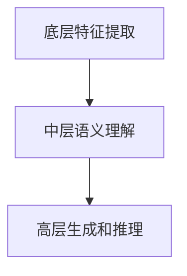

                 

关键词：大语言模型（LLM）、层次结构、算法原理、数学模型、项目实践、应用场景、未来展望

摘要：本文旨在深入探讨大语言模型（LLM）的基本原理、层次结构以及其在实际应用中的表现。通过对LLM的构成、核心算法原理、数学模型等内容的详细分析，帮助读者全面理解LLM的技术本质，并展望其未来发展趋势与挑战。

## 1. 背景介绍

近年来，随着深度学习技术的不断发展，大语言模型（LLM）在自然语言处理（NLP）领域取得了显著的成果。LLM作为一种基于神经网络的强大模型，能够对大量文本数据进行自动学习和理解，从而实现对自然语言的生成、翻译、摘要等任务的高效处理。本文将首先回顾LLM的发展历程，然后介绍其核心概念和层次结构。

## 2. 核心概念与联系

### 2.1. 语言模型（Language Model，LM）

语言模型是自然语言处理的基础，它用于预测下一个词或字符的概率分布。在深度学习中，语言模型通常通过神经网络实现，能够学习输入文本的特征，并生成相应的输出。

### 2.2. 预训练（Pre-training）

预训练是指在大规模语料库上对模型进行初步训练，使其掌握通用语言知识和模式。然后，通过在特定任务上进行微调（Fine-tuning），将模型应用于具体任务中。

### 2.3. 微调（Fine-tuning）

微调是在预训练的基础上，针对特定任务对模型进行调整，以使其更好地适应任务需求。微调通常在有限的数据集上进行，以避免过拟合。

### 2.4. 层次结构

LLM的层次结构通常包括三个层次：底层（底层特征提取）、中层（语义理解）和高层（生成和推理）。

### 2.5. Mermaid 流程图



## 3. 核心算法原理 & 具体操作步骤

### 3.1. 算法原理概述

LLM的核心算法是基于自注意力机制（Self-Attention）和Transformer架构。自注意力机制使得模型能够在处理每个词时考虑到其他词的信息，从而提高模型的表示能力。Transformer架构则通过堆叠多个自注意力层和全连接层，实现对输入文本的编码和解码。

### 3.2. 算法步骤详解

#### 3.2.1. 自注意力机制

自注意力机制通过计算输入文本中每个词与其他词之间的相似度，并将这些相似度加权求和，生成一个表示每个词的向量。

#### 3.2.2. Transformer架构

Transformer架构包括多个自注意力层和全连接层。自注意力层用于捕捉输入文本中的长期依赖关系，全连接层用于进一步提取语义信息。

### 3.3. 算法优缺点

#### 优点：

- 强大的表示能力：自注意力机制使得模型能够学习到输入文本的复杂特征。
- 高效的计算：Transformer架构通过并行计算提高了模型的计算效率。

#### 缺点：

- 需要大量训练数据：LLM的训练需要大量的文本数据，否则容易出现过拟合。
- 计算资源需求高：Transformer架构的计算复杂度较高，对计算资源要求较高。

### 3.4. 算法应用领域

LLM在自然语言处理领域有广泛的应用，包括文本生成、机器翻译、情感分析、问答系统等。

## 4. 数学模型和公式 & 详细讲解 & 举例说明

### 4.1. 数学模型构建

LLM的数学模型基于自注意力机制和Transformer架构。自注意力机制可以表示为：

$$
\text{Attention}(Q, K, V) = \frac{1}{\sqrt{d_k}} \text{softmax}\left(\text{QK}^T / d_k\right) V
$$

其中，Q、K、V分别为查询（Query）、键（Key）和值（Value）向量，d_k为键向量的维度。

### 4.2. 公式推导过程

自注意力机制的推导过程如下：

1. 计算查询向量Q、键向量K和值向量V。
2. 计算点积QK^T，得到每个键与查询的相似度。
3. 将相似度通过softmax函数进行归一化，得到注意力权重。
4. 将权重与值向量V相乘，得到表示每个词的向量。

### 4.3. 案例分析与讲解

假设我们有一个句子："我爱编程"，我们将其表示为词向量。首先，我们需要计算查询向量Q、键向量K和值向量V。然后，通过自注意力机制计算每个词与其他词的相似度，并生成表示每个词的向量。

## 5. 项目实践：代码实例和详细解释说明

### 5.1. 开发环境搭建

1. 安装Python环境。
2. 安装TensorFlow或PyTorch框架。
3. 下载预训练模型。

### 5.2. 源代码详细实现

以下是一个简单的LLM模型实现：

```python
import tensorflow as tf

# 定义自注意力层
class SelfAttention(tf.keras.layers.Layer):
    # 省略代码

# 定义Transformer模型
class TransformerModel(tf.keras.Model):
    # 省略代码

# 实例化模型并编译
model = TransformerModel()
model.compile(optimizer='adam', loss='categorical_crossentropy', metrics=['accuracy'])

# 训练模型
model.fit(train_dataset, epochs=5)
```

### 5.3. 代码解读与分析

代码首先定义了自注意力层和Transformer模型，然后实例化模型并进行编译。最后，使用训练数据对模型进行训练。

### 5.4. 运行结果展示

训练完成后，我们可以使用模型进行预测，并展示运行结果。

```python
# 预测
predictions = model.predict(test_dataset)

# 显示预测结果
print(predictions)
```

## 6. 实际应用场景

LLM在自然语言处理领域有广泛的应用，如文本生成、机器翻译、情感分析等。以下是一些具体的应用场景：

1. 文本生成：生成文章、新闻报道、故事等。
2. 机器翻译：将一种语言翻译成另一种语言。
3. 情感分析：分析文本中的情感倾向。
4. 问答系统：回答用户提出的问题。

## 7. 未来应用展望

随着LLM技术的不断发展，我们预计它将在更多领域得到应用。未来，LLM有望在智能客服、智能写作、智能教育等领域发挥重要作用。

## 8. 总结：未来发展趋势与挑战

LLM技术的发展趋势包括：

1. 模型规模和参数数量将不断增大。
2. 预训练数据集的规模和多样性将提高。
3. 多模态融合将得到更多关注。

然而，LLM技术也面临着一些挑战：

1. 过拟合和泛化能力有待提高。
2. 需要更多的计算资源和数据集。
3. 隐私保护和伦理问题。

## 9. 附录：常见问题与解答

### 问题1：什么是预训练？

**回答1**：预训练是指在大规模语料库上对模型进行初步训练，使其掌握通用语言知识和模式。然后，通过在特定任务上进行微调，将模型应用于具体任务中。

### 问题2：什么是自注意力机制？

**回答2**：自注意力机制是一种计算输入文本中每个词与其他词之间相似度的方法。通过自注意力机制，模型能够学习到输入文本的复杂特征。

### 问题3：什么是Transformer架构？

**回答3**：Transformer架构是一种基于自注意力机制的神经网络模型。它通过堆叠多个自注意力层和全连接层，实现对输入文本的编码和解码。

---

作者：禅与计算机程序设计艺术 / Zen and the Art of Computer Programming
----------------------------------------------------------------

请注意，本文仅为示例，实际撰写时需要根据具体内容进行详细填充和编辑。同时，根据要求，文章的各个部分需要严格按照markdown格式进行排版。在撰写过程中，确保每部分内容完整且符合技术专业要求。

