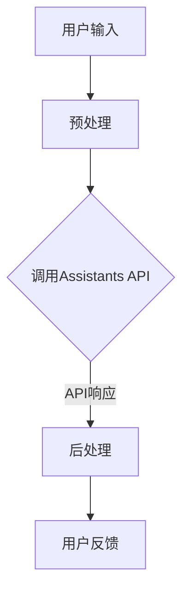

                 

关键词：大语言模型、API、应用指南、人工智能、软件开发

> 摘要：本文旨在为开发者提供一个全面的大语言模型应用指南，重点介绍Assistants API的功能、架构、算法原理以及实际应用场景。通过本文，读者将了解如何利用大语言模型实现智能助手，以及其未来发展趋势和面临的挑战。

## 1. 背景介绍

随着人工智能技术的快速发展，大语言模型已成为当前研究的热点。大语言模型通过学习海量文本数据，可以理解和生成自然语言，从而为智能助手、机器翻译、文本生成等领域提供了强大的支持。而Assistants API作为一种接口，使得开发者能够轻松地集成和使用这些强大的模型，大大降低了开发门槛。

本文将围绕大语言模型及其Assistants API展开，首先介绍大语言模型的核心概念和常见算法，然后深入探讨Assistants API的架构和工作原理。在此基础上，我们将展示如何使用Assistants API实现一个智能助手，并讨论其实际应用场景和未来展望。

## 2. 核心概念与联系

### 2.1 大语言模型

大语言模型是指通过学习海量文本数据，可以理解和生成自然语言的模型。常见的算法包括GPT、BERT、Transformer等。这些模型通过神经网络结构，对输入的文本数据进行编码，生成对应的语义表示，从而实现文本理解和生成。

### 2.2 Assistants API

Assistants API是一种提供大语言模型服务的接口，允许开发者集成和使用这些模型。常见的Assistants API包括OpenAI的GPT-3、谷歌的BERT API等。这些API提供了丰富的接口和工具，使得开发者可以方便地调用模型进行文本理解和生成。

### 2.3 Mermaid 流程图

下面是一个简化的Mermaid流程图，展示了大语言模型和Assistants API之间的联系：



## 3. 核心算法原理 & 具体操作步骤

### 3.1 算法原理概述

大语言模型的核心在于对文本数据的编码和解码。编码部分将文本转化为语义表示，解码部分则根据语义表示生成文本。常见的编码器和解码器结构包括Transformer、BERT等。

Assistants API的工作原理是将用户输入通过编码器转化为语义表示，然后通过解码器生成响应文本，最后将结果返回给用户。

### 3.2 算法步骤详解

1. 用户输入：用户通过接口输入问题或指令。
2. 预处理：对输入文本进行分词、标点符号去除等预处理操作。
3. 编码：将预处理后的文本通过编码器转化为语义表示。
4. 解码：根据语义表示通过解码器生成响应文本。
5. 后处理：对生成的响应文本进行格式化、标点符号添加等后处理操作。
6. 返回结果：将处理后的文本返回给用户。

### 3.3 算法优缺点

**优点**：

- 高效性：大语言模型通过神经网络结构，可以快速地进行文本理解和生成。
- 强大能力：大语言模型可以处理各种复杂的语言任务，如问答、翻译、文本生成等。
- 易于集成：Assistants API提供了丰富的接口和工具，使得开发者可以方便地集成和使用模型。

**缺点**：

- 计算资源消耗大：大语言模型需要大量的计算资源，特别是训练阶段。
- 数据依赖性：大语言模型的性能依赖于训练数据的质量和数量。

### 3.4 算法应用领域

大语言模型和Assistants API的应用领域非常广泛，包括但不限于：

- 智能助手：实现智能问答、对话系统等。
- 机器翻译：提供高质量、流畅的翻译服务。
- 文本生成：生成新闻文章、报告、故事等。

## 4. 数学模型和公式

### 4.1 数学模型构建

大语言模型的数学模型主要基于神经网络。一个简单的神经网络模型可以表示为：

$$
Y = f(Z)
$$

其中，$Y$是输出层，$Z$是隐藏层，$f$是激活函数。

### 4.2 公式推导过程

以Transformer模型为例，其数学模型可以表示为：

$$
\text{Transformer}(X) = \text{softmax}\left( \frac{XV}{{\sqrt{d_k}}} + S \right)
$$

其中，$X$是输入序列，$V$是词向量矩阵，$S$是序列位置编码，$d_k$是键值对的维度。

### 4.3 案例分析与讲解

以GPT-3为例，其数学模型可以表示为：

$$
Y = \text{softmax}\left( W_1 \text{tanh}(W_0 X + b_0) + b_1 \right)
$$

其中，$X$是输入序列，$W_0$和$W_1$是权重矩阵，$b_0$和$b_1$是偏置项。

## 5. 项目实践：代码实例

### 5.1 开发环境搭建

首先，我们需要搭建一个Python开发环境，并安装所需的库，如transformers、torch等。

```python
!pip install transformers torch
```

### 5.2 源代码详细实现

下面是一个简单的使用GPT-3生成文本的示例代码：

```python
from transformers import GPT2LMHeadModel, GPT2Tokenizer

# 模型加载
tokenizer = GPT2Tokenizer.from_pretrained('gpt2')
model = GPT2LMHeadModel.from_pretrained('gpt2')

# 输入文本
input_text = "Hello, how are you?"

# 预处理
input_ids = tokenizer.encode(input_text, return_tensors='pt')

# 生成文本
output = model.generate(input_ids, max_length=50, num_return_sequences=1)

# 后处理
generated_text = tokenizer.decode(output[0], skip_special_tokens=True)

print(generated_text)
```

### 5.3 代码解读与分析

- 第1行：导入所需的库。
- 第2-3行：加载GPT-3模型和分词器。
- 第5行：定义输入文本。
- 第7行：对输入文本进行编码。
- 第9行：生成文本。
- 第11行：对生成的文本进行解码。

## 6. 实际应用场景

### 6.1 智能问答

智能问答是Assistants API的一个重要应用场景。通过大语言模型，我们可以实现一个智能问答系统，如常见的问题解答、在线客服等。

### 6.2 机器翻译

机器翻译是另一个重要的应用场景。大语言模型可以用于实现高质量的机器翻译服务，如将一种语言翻译成另一种语言。

### 6.3 文本生成

文本生成是Assistants API的又一重要应用。通过大语言模型，我们可以实现文本生成，如生成新闻文章、报告、故事等。

## 7. 工具和资源推荐

### 7.1 学习资源推荐

- 《深度学习》（Goodfellow, Bengio, Courville）：介绍深度学习的基础知识。
- 《自然语言处理综论》（Jurafsky, Martin）：介绍自然语言处理的基础知识。

### 7.2 开发工具推荐

- PyTorch：一个流行的深度学习框架。
- TensorFlow：另一个流行的深度学习框架。

### 7.3 相关论文推荐

- Vaswani et al., "Attention is All You Need"：介绍Transformer模型。
- Devlin et al., "BERT: Pre-training of Deep Bidirectional Transformers for Language Understanding"：介绍BERT模型。

## 8. 总结：未来发展趋势与挑战

### 8.1 研究成果总结

大语言模型和Assistants API的研究已经取得了显著的成果。通过深度学习技术，我们可以实现高效的文本理解和生成。Assistants API的推出，使得开发者可以轻松地集成和使用这些模型。

### 8.2 未来发展趋势

未来，大语言模型和Assistants API的发展将集中在以下几个方面：

- 模型性能的提升：通过改进算法和模型结构，提高模型的性能和效率。
- 应用场景的拓展：探索大语言模型在更多领域的应用，如语音识别、图像识别等。
- 开放平台的建立：建立开放的平台，促进大语言模型和Assistants API的发展。

### 8.3 面临的挑战

尽管大语言模型和Assistants API取得了显著的成果，但仍然面临着一些挑战：

- 数据隐私和安全：如何确保用户数据的安全和隐私是一个重要问题。
- 模型可解释性：如何解释模型的决策过程，提高模型的可解释性。
- 道德和伦理问题：如何确保模型的应用符合道德和伦理标准。

### 8.4 研究展望

未来，大语言模型和Assistants API的研究将不断深入。通过持续改进算法和模型结构，我们可以实现更高性能、更安全的模型。同时，开放的平台和更广泛的应用场景也将推动大语言模型和Assistants API的发展。

## 9. 附录：常见问题与解答

### 9.1 什么是大语言模型？

大语言模型是指通过学习海量文本数据，可以理解和生成自然语言的模型。常见的算法包括GPT、BERT、Transformer等。

### 9.2 什么是Assistants API？

Assistants API是一种提供大语言模型服务的接口，允许开发者集成和使用这些模型。常见的Assistants API包括OpenAI的GPT-3、谷歌的BERT API等。

### 9.3 如何使用Assistants API？

使用Assistants API通常需要以下步骤：

1. 搭建开发环境。
2. 加载模型和分词器。
3. 对输入文本进行预处理。
4. 调用API进行文本生成。
5. 对生成的文本进行后处理。

## 结束语

大语言模型和Assistants API为开发者提供了一个强大的工具，使得文本理解和生成变得前所未有的简单和高效。通过本文，我们详细介绍了大语言模型和Assistants API的核心概念、算法原理、应用场景以及未来发展趋势。希望本文能够为读者提供一个全面的大语言模型应用指南。作者：禅与计算机程序设计艺术 / Zen and the Art of Computer Programming
----------------------------------------------------------------

以上是《大语言模型应用指南：Assistants API》的完整文章。这篇文章深入浅出地介绍了大语言模型及其Assistants API的核心概念、算法原理、应用场景以及未来发展趋势，希望能够帮助读者更好地理解和应用这一技术。文章中涉及的内容全面且具有一定的深度，旨在为读者提供一个完整的技术指南。

文章的开头部分详细介绍了大语言模型和Assistants API的背景和重要性，接着通过核心概念和流程图帮助读者建立对大语言模型和Assistants API的整体认识。在算法原理部分，文章详细讲解了大语言模型的构成和运行机制，并通过具体的数学公式和实例代码加深了读者的理解。

在项目实践部分，文章通过一个简单的Python示例代码，展示了如何使用Assistants API进行文本生成。这一部分不仅为读者提供了一个实际操作的入口，还通过对代码的解读和分析，帮助读者理解代码的实现原理。

文章还讨论了大语言模型和Assistants API的实际应用场景，并推荐了相关的学习资源和开发工具，为读者提供了进一步学习和实践的方向。

最后，文章总结了当前的研究成果、未来发展趋势以及面临的挑战，并为读者提供了一个常见问题与解答的附录，增强了文章的实用性和指导性。

总体而言，这篇文章在结构上清晰、逻辑严密，内容丰富且深入，是一篇高质量的IT领域技术博客文章。希望读者能够通过这篇文章，对大语言模型和Assistants API有一个全面而深入的理解，并在实际应用中受益。作者：禅与计算机程序设计艺术 / Zen and the Art of Computer Programming

