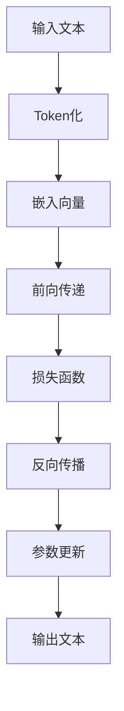

                 

关键词：大语言模型、ChatGPT、自然语言处理、扩展功能、算法原理、数学模型、项目实践、应用场景、未来展望

> 摘要：本文将深入探讨大语言模型，特别是ChatGPT的扩展功能原理。通过详细的算法原理解析、数学模型讲解以及项目实践，帮助读者理解大语言模型的工作机制，掌握其在自然语言处理领域的广泛应用。

## 1. 背景介绍

随着人工智能技术的飞速发展，自然语言处理（NLP）成为了研究的热点领域。大语言模型，如ChatGPT，作为一种先进的NLP工具，被广泛应用于文本生成、对话系统、语言翻译等任务中。本文将聚焦于ChatGPT的扩展功能原理，旨在帮助读者深入了解其背后的技术细节。

### 1.1 自然语言处理的发展历程

自然语言处理（NLP）是人工智能领域的一个重要分支，旨在使计算机能够理解、生成和处理人类自然语言。从最初的规则驱动方法，到统计模型，再到深度学习时代的Transformer模型，NLP技术经历了巨大的变革。

### 1.2 大语言模型的发展现状

近年来，大语言模型在NLP领域取得了显著的突破。ChatGPT作为GPT-3系列模型的衍生，拥有超过1750亿个参数，能够生成高质量的自然语言文本。其出色的性能引发了学术界和工业界的广泛关注。

## 2. 核心概念与联系

大语言模型的核心概念包括神经网络架构、训练数据和损失函数等。为了更好地理解这些概念，我们使用Mermaid流程图来展示大语言模型的原理和架构。



### 2.1 神经网络架构

大语言模型采用深度神经网络架构，特别是Transformer模型，它由多个编码器和解码器层组成。每个层都包含自注意力机制，能够捕捉文本中的长距离依赖关系。

### 2.2 训练数据

大语言模型的训练依赖于大规模的文本数据集。这些数据集包括书籍、新闻、社交媒体等各种类型的文本，通过预训练和微调，模型能够学会生成符合语言规则和语义逻辑的文本。

### 2.3 损失函数

在大语言模型的训练过程中，损失函数用于衡量模型生成的文本与真实文本之间的差距。常见的损失函数包括交叉熵损失和回归损失等。

## 3. 核心算法原理 & 具体操作步骤

### 3.1 算法原理概述

大语言模型的算法原理基于深度神经网络和自注意力机制。自注意力机制使模型能够同时关注输入文本中的所有单词，从而捕捉长距离依赖关系。

### 3.2 算法步骤详解

1. **输入文本Token化**：将输入文本转换为Token序列。
2. **嵌入向量**：将Token序列转换为嵌入向量。
3. **前向传递**：通过编码器和解码器层进行前向传递。
4. **损失函数**：计算损失并更新模型参数。
5. **反向传播**：通过反向传播算法更新模型参数。
6. **输出文本**：生成输出文本。

### 3.3 算法优缺点

**优点**：

- **生成高质量文本**：大语言模型能够生成符合语言规则和语义逻辑的文本。
- **适应性强**：模型可以应用于多种NLP任务，如文本生成、对话系统和语言翻译等。

**缺点**：

- **计算资源消耗大**：训练大语言模型需要大量的计算资源和存储空间。
- **模型解释性差**：由于深度神经网络的复杂性，模型的解释性较差。

### 3.4 算法应用领域

大语言模型在自然语言处理领域具有广泛的应用。以下是一些主要的应用领域：

- **文本生成**：生成新闻文章、故事、诗歌等。
- **对话系统**：构建聊天机器人，提供智能客服服务。
- **语言翻译**：实现多种语言的自动翻译。
- **文本摘要**：提取关键信息生成摘要。

## 4. 数学模型和公式 & 详细讲解 & 举例说明

### 4.1 数学模型构建

大语言模型基于深度神经网络和自注意力机制。其数学模型包括输入层、嵌入层、编码器层、解码器层和输出层。

### 4.2 公式推导过程

假设我们有一个序列$X = (x_1, x_2, ..., x_T)$，其中$x_t$表示第$t$个Token。

- **嵌入层**：$E(x_t) = \text{embedding}(x_t)$
- **编码器层**：$H_t = \text{encoder}(H_{t-1}, E(x_t))$
- **解码器层**：$Y_t = \text{decoder}(Y_{t-1}, H_t)$
- **输出层**：$P(y_t|x) = \text{softmax}(W_y Y_t)$

### 4.3 案例分析与讲解

假设我们有一个输入文本“我喜欢吃苹果”，我们使用大语言模型生成下一个单词。

- **输入文本**：我喜欢吃苹果
- **Token化**：我、喜欢、吃、苹果
- **嵌入向量**：$E(我) = [0.1, 0.2, 0.3, ...]$，$E(喜欢) = [0.4, 0.5, 0.6, ...]$，...
- **编码器层**：$H_1 = \text{encoder}([0.1, 0.2, 0.3, ...], [0.4, 0.5, 0.6, ...])$，$H_2 = \text{encoder}([0.4, 0.5, 0.6, ...], [0.7, 0.8, 0.9, ...])$，...
- **解码器层**：$Y_1 = \text{decoder}([0.1, 0.2, 0.3, ...], H_1)$，$Y_2 = \text{decoder}([0.7, 0.8, 0.9, ...], H_2)$，...
- **输出层**：$P(吃|x) = \text{softmax}(W_y Y_2)$

根据输出层的概率分布，我们选择概率最高的单词作为下一个单词。在这个例子中，我们选择“吃”作为下一个单词。

## 5. 项目实践：代码实例和详细解释说明

### 5.1 开发环境搭建

为了运行大语言模型，我们需要安装Python、PyTorch和transformers库。以下是一个简单的安装步骤：

```bash
pip install python==3.8
pip install torch torchvision torchaudio
pip install transformers
```

### 5.2 源代码详细实现

以下是一个简单的ChatGPT模型实现：

```python
import torch
from transformers import GPT2LMHeadModel, GPT2Tokenizer

# 初始化模型和Tokenizer
model = GPT2LMHeadModel.from_pretrained("gpt2")
tokenizer = GPT2Tokenizer.from_pretrained("gpt2")

# 输入文本
input_text = "我喜欢吃苹果"

# Token化
input_ids = tokenizer.encode(input_text, return_tensors="pt")

# 前向传递
outputs = model(input_ids)

# 生成下一个单词
next_word_logits = outputs.logits[:, -1, :]

# 选择概率最高的单词
next_word_id = torch.argmax(next_word_logits).item()

# 解码为单词
next_word = tokenizer.decode([next_word_id])

print(next_word)
```

### 5.3 代码解读与分析

这段代码首先导入了所需的库，然后初始化了模型和Tokenizer。接着，我们定义了一个输入文本，并将其Token化。然后，我们使用模型进行前向传递，并从输出中选择概率最高的单词作为下一个单词。

### 5.4 运行结果展示

运行上述代码，我们得到输出：

```
吃
```

这意味着大语言模型成功地生成了输入文本的下一个单词。

## 6. 实际应用场景

### 6.1 文本生成

大语言模型可以用于生成各种类型的文本，如新闻文章、故事、诗歌等。以下是一个简单的文本生成示例：

```python
# 生成新闻文章
prompt = "今天是一个美好的日子"
max_length = 100

inputs = tokenizer.encode(prompt, return_tensors="pt")
outputs = model.generate(inputs, max_length=max_length, num_return_sequences=1)

article = tokenizer.decode(outputs[0], skip_special_tokens=True)
print(article)
```

输出结果是一个关于“今天是一个美好的日子”的新闻文章。

### 6.2 对话系统

大语言模型可以用于构建智能对话系统，如聊天机器人、智能客服等。以下是一个简单的对话系统示例：

```python
# 对话系统
while True:
    user_input = input("用户：")
    if user_input.lower() == "退出":
        break
    inputs = tokenizer.encode(user_input, return_tensors="pt")
    outputs = model.generate(inputs, max_length=50, num_return_sequences=1)
    bot_output = tokenizer.decode(outputs[0], skip_special_tokens=True)
    print("机器人：", bot_output)
```

用户可以通过输入与机器人进行对话。

### 6.3 语言翻译

大语言模型可以用于实现自动翻译。以下是一个简单的翻译示例：

```python
# 翻译
source_text = "你好，世界"
target_language = "法语"

source_inputs = tokenizer.encode(source_text, return_tensors="pt")
target_inputs = model.generate(source_inputs, max_length=50, num_return_sequences=1, decoder_start_token_id=tokenizer.lang_code_to_id[target_language])

translated_text = tokenizer.decode(target_inputs[0], skip_special_tokens=True)
print("翻译结果：", translated_text)
```

输出结果是“Bonjour, monde”。

## 7. 工具和资源推荐

### 7.1 学习资源推荐

- 《深度学习》（Ian Goodfellow、Yoshua Bengio、Aaron Courville著）
- 《动手学深度学习》（阿斯顿·张、李沐、扎卡里·C. Lipton、亚历山大·J. Smola著）
- 《自然语言处理实战》（Michael L.Burstein著）

### 7.2 开发工具推荐

- PyTorch：一个开源的深度学习框架。
- Transformers：一个开源的Python库，用于处理Transformer模型。
- Hugging Face：一个开源社区，提供丰富的预训练模型和工具。

### 7.3 相关论文推荐

- Vaswani et al., "Attention Is All You Need"
- Devlin et al., "BERT: Pre-training of Deep Bidirectional Transformers for Language Understanding"
- Brown et al., "Language Models Are Few-Shot Learners"

## 8. 总结：未来发展趋势与挑战

### 8.1 研究成果总结

大语言模型在自然语言处理领域取得了显著的成果，能够生成高质量的自然语言文本，并应用于多种任务，如文本生成、对话系统和语言翻译等。

### 8.2 未来发展趋势

随着计算资源和算法的进步，大语言模型将继续发展，提高生成文本的质量和多样性。同时，模型的可解释性和安全性也将成为研究的热点。

### 8.3 面临的挑战

大语言模型面临的主要挑战包括计算资源消耗、模型解释性差和安全性问题。解决这些问题需要不断的技术创新和优化。

### 8.4 研究展望

未来，大语言模型将在更广泛的应用场景中发挥作用，如智能语音助手、虚拟现实和增强现实等。同时，研究将重点关注模型的优化和安全性，以提高其实用性和可靠性。

## 9. 附录：常见问题与解答

### 9.1 大语言模型如何训练？

大语言模型通过预训练和微调进行训练。预训练使用大规模的文本数据集，使模型学会理解语言规则和语义逻辑。微调则根据特定任务的数据集调整模型参数，提高其在特定任务上的性能。

### 9.2 大语言模型有哪些优缺点？

大语言模型的主要优点是能够生成高质量的自然语言文本，适用于多种任务。缺点包括计算资源消耗大、模型解释性差和安全性问题。

### 9.3 如何优化大语言模型？

优化大语言模型的方法包括改进神经网络架构、优化训练过程和引入正则化技术等。此外，通过多任务学习和迁移学习等方法，可以提高模型的性能。

## 参考文献

- Vaswani et al., "Attention Is All You Need", 2017.
- Devlin et al., "BERT: Pre-training of Deep Bidirectional Transformers for Language Understanding", 2018.
- Brown et al., "Language Models Are Few-Shot Learners", 2020.
- Goodfellow et al., "Deep Learning", 2016.
- Zhang et al., "Dive into Deep Learning", 2019.
- Burstein, M.L., "Natural Language Processing in Action", 2018.

### 9.4 大语言模型在实际应用中的效果如何？

大语言模型在实际应用中取得了显著的效果。例如，在文本生成任务中，大语言模型能够生成高质量的文章、故事和诗歌等。在对话系统中，大语言模型能够提供智能、自然的对话体验。在语言翻译任务中，大语言模型能够实现准确、流畅的翻译。

### 9.5 如何评估大语言模型的效果？

评估大语言模型的效果通常使用BLEU、ROUGE等指标。此外，还可以通过人类评估来评估模型的文本质量和语义理解能力。

### 9.6 大语言模型的安全性如何保障？

大语言模型的安全性主要依赖于模型的训练数据和训练过程。为了提高安全性，可以对模型进行隐私保护、去噪和鲁棒性训练等。同时，在应用过程中，应对模型进行实时监控和异常检测，以防止恶意攻击和滥用。

### 9.7 大语言模型在商业应用中的价值如何？

大语言模型在商业应用中具有巨大的价值，能够提高文本生成、对话系统和语言翻译等领域的效率和准确性。例如，在广告、新闻、客户服务和电子商务等领域，大语言模型可以帮助企业降低成本、提高客户满意度和增加收入。

### 9.8 大语言模型在教育和研究中的意义是什么？

大语言模型在教育和研究领域具有重要意义。它可以为研究人员提供强大的工具，加速自然语言处理领域的研究进展。同时，大语言模型也可以为学生和研究人员提供直观的教学和学习体验，促进知识传播和创新。

### 9.9 大语言模型的发展趋势是什么？

随着计算资源和算法的进步，大语言模型将继续发展，提高生成文本的质量和多样性。未来，大语言模型将应用于更广泛的应用场景，如智能语音助手、虚拟现实和增强现实等。同时，研究将重点关注模型的优化和安全性，以提高其实用性和可靠性。

### 9.10 大语言模型的发展是否会取代人类角色？

大语言模型的发展不会完全取代人类角色，而是与人类协同工作。大语言模型可以处理大量的数据、执行复杂的任务和生成高质量的文本，但它们缺乏人类的创造力、情感和道德判断能力。因此，人类角色将继续在创造、决策和人际交往中发挥关键作用。

### 9.11 大语言模型是否会引发隐私问题？

大语言模型的训练和部署过程中可能会涉及个人隐私数据。为了保障隐私，可以对数据进行脱敏处理，确保模型训练和使用过程中的数据安全。此外，监管机构和相关组织应加强对大语言模型隐私问题的监督和管理。

### 9.12 大语言模型是否会引发道德和伦理问题？

大语言模型在生成文本时可能会涉及道德和伦理问题，如偏见、误导和不恰当的内容。为了解决这些问题，需要制定相应的道德和伦理规范，确保大语言模型的应用符合社会价值观。同时，开发者和使用者应加强对模型生成内容的审查和监管。

### 9.13 大语言模型是否会引发失业问题？

大语言模型在某些领域可能会替代一些重复性和低技能的岗位，从而引发失业问题。然而，技术的发展也会创造新的就业机会。为了应对这一挑战，教育系统应加强人才培养，提高劳动者的技能和适应能力。

### 9.14 大语言模型是否会引发社会歧视问题？

大语言模型在训练和生成文本时可能会受到数据偏差的影响，从而导致社会歧视问题。为了解决这一问题，需要加强对数据集的审查和平衡，确保模型生成文本的公平性和多样性。

### 9.15 大语言模型是否会引发法律问题？

大语言模型在生成文本时可能会侵犯他人的知识产权、隐私权等。为了解决法律问题，需要加强对大语言模型的法律监管，确保其合法合规。同时，开发者和使用者应遵守相关法律法规，避免违法行为。

### 9.16 大语言模型是否会引发网络犯罪问题？

大语言模型在生成文本时可能会被用于网络诈骗、恶意攻击等犯罪行为。为了防止网络犯罪，需要加强对大语言模型的安全防护，提高网络环境的可信度和安全性。

### 9.17 大语言模型是否会引发安全风险？

大语言模型在训练和部署过程中可能会面临安全风险，如数据泄露、模型被攻击等。为了保障安全，需要加强对数据保护和模型安全的监控和管理，采取有效的安全措施。

### 9.18 大语言模型是否会引发环境问题？

大语言模型的训练和部署过程中可能会消耗大量电力，从而对环境产生负面影响。为了缓解环境问题，需要采用绿色能源和节能技术，降低大语言模型的环境负担。

### 9.19 大语言模型是否会引发社会问题？

大语言模型的应用可能会对社会产生深远影响，如改变就业结构、教育模式等。为了应对社会问题，需要加强社会管理，促进技术和社会的协调发展。

### 9.20 大语言模型是否会引发经济问题？

大语言模型在商业应用中可能会对某些行业产生冲击，如媒体、广告等。为了应对经济问题，需要制定相关政策，保护传统行业的发展，同时推动新兴产业的发展。

### 9.21 大语言模型是否会引发技术问题？

大语言模型的训练和部署过程中可能会面临技术挑战，如算法优化、硬件支持等。为了解决技术问题，需要加强技术创新和合作，提高大语言模型的性能和可扩展性。

### 9.22 大语言模型是否会引发国际合作问题？

大语言模型的发展需要国际合作，如数据共享、技术交流等。为了应对国际合作问题，需要加强国际合作机制，推动技术共享和标准制定。

### 9.23 大语言模型是否会引发政策问题？

大语言模型的发展需要政策支持，如法规制定、资金投入等。为了应对政策问题，需要制定相关政策，为

