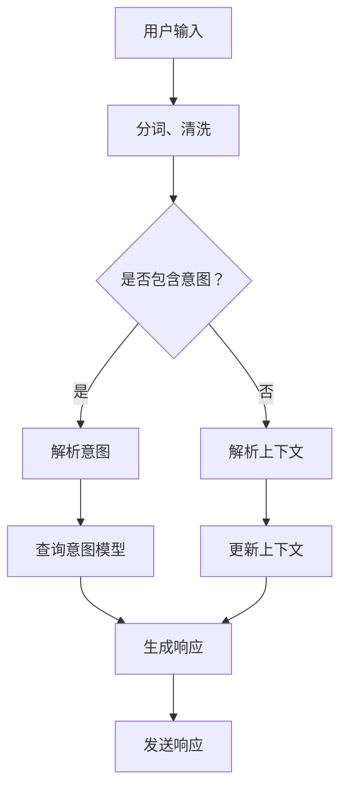

                 

关键词：大语言模型，ChatML，交互格式，AI应用，技术指南

> 摘要：本文将深入探讨大语言模型在ChatML交互格式中的关键作用和实际应用，包括其核心概念、算法原理、数学模型、项目实践、应用场景以及未来发展趋势。通过详细的解析和实例说明，帮助读者全面了解大语言模型在人工智能领域中的潜力和挑战。

## 1. 背景介绍

在当今数字化时代，人工智能（AI）已经成为推动科技发展的重要力量。其中，大语言模型作为自然语言处理（NLP）的核心技术，正逐渐改变着我们的沟通方式。ChatML交互格式，作为一种新型的AI交互方式，充分利用了这些大语言模型的能力，使得人机交互更加自然、流畅和高效。

大语言模型是一种基于深度学习的模型，通过大量文本数据进行训练，能够理解和生成人类语言。它们可以应用于各种场景，包括智能客服、智能助理、内容生成等。而ChatML交互格式则是一种基于JSON的轻量级协议，旨在为不同系统之间的交互提供一种统一、标准化的方式。

本文将围绕大语言模型和ChatML交互格式，详细探讨其在实际应用中的关键作用和实现方法。希望通过本文的介绍，读者能够对大语言模型和ChatML交互格式有更深入的了解，并在实际项目中更好地应用这些技术。

## 2. 核心概念与联系

### 2.1 大语言模型

大语言模型是一种基于神经网络的语言处理模型，通过大量的文本数据进行训练，从而学习到语言的内在规律。这些模型通常包含数亿甚至数千亿个参数，能够捕捉到语言中的复杂模式和结构。

大语言模型的工作原理可以简单概括为以下几个步骤：

1. **数据预处理**：将原始文本数据清洗、分词、去停用词等，转换为模型可处理的格式。
2. **嵌入**：将单词或句子嵌入到一个高维空间中，使得语义相近的词语在空间中彼此靠近。
3. **训练**：通过反向传播算法，调整模型的参数，使得模型能够更好地预测文本的下一个词语。
4. **推理**：给定一个输入文本，模型能够生成相应的输出文本。

常见的开源大语言模型包括GPT、BERT、T5等，这些模型已经被广泛应用于各种自然语言处理任务中。

### 2.2 ChatML交互格式

ChatML是一种基于JSON的轻量级协议，用于描述AI系统之间的交互。它包含了一系列用于消息传递、状态管理、请求处理等的核心概念和结构。

ChatML的核心概念包括：

1. **意图（Intent）**：描述用户希望完成的任务或目标。
2. **实体（Entity）**：用户输入中的关键信息，如日期、地点、人名等。
3. **上下文（Context）**：与当前会话相关的信息，包括之前的对话历史和用户的偏好等。

ChatML的基本结构如下：

```json
{
  "intent": {
    "name": "意图名称",
    "confidence": 0.95
  },
  "entities": [
    {
      "entity": "实体名称",
      "value": "实体值"
    },
    ...
  ],
  "context": {
    "key": "value",
    ...
  }
}
```

通过ChatML，AI系统能够以标准化的方式接收和处理用户请求，实现不同系统之间的无缝交互。

### 2.3 Mermaid流程图

为了更好地展示大语言模型和ChatML交互格式之间的联系，我们可以使用Mermaid绘制一个流程图：



这个流程图描述了从用户输入到系统响应的整个过程，包括意图和上下文的解析、模型查询和响应生成等步骤。

## 3. 核心算法原理 & 具体操作步骤

### 3.1 算法原理概述

大语言模型的核心算法是基于深度学习的神经网络模型，尤其是变换器模型（Transformer）。Transformer模型通过自注意力机制（Self-Attention）能够捕捉到文本中的长距离依赖关系，从而在自然语言处理任务中表现出色。

ChatML交互格式的核心算法则包括意图识别、实体抽取和上下文管理。意图识别通常使用分类算法，如朴素贝叶斯、支持向量机等；实体抽取则可以通过规则匹配、序列标注等方法实现；上下文管理则涉及到状态机或图模型等算法。

### 3.2 算法步骤详解

#### 3.2.1 大语言模型

1. **数据预处理**：对原始文本进行分词、清洗、去停用词等操作。
2. **嵌入**：将分词后的文本转换为嵌入向量。
3. **编码**：使用变换器模型对嵌入向量进行编码，生成编码后的序列。
4. **解码**：根据编码序列生成输出文本。

#### 3.2.2 ChatML交互格式

1. **接收输入**：系统接收到用户输入的消息。
2. **分词与清洗**：对输入文本进行分词和清洗。
3. **意图识别**：使用分类算法识别用户的意图。
4. **实体抽取**：从输入文本中抽取关键实体。
5. **上下文管理**：更新上下文信息，包括之前的对话历史和用户偏好等。
6. **响应生成**：根据意图和上下文生成响应文本。
7. **发送响应**：将响应文本发送给用户。

### 3.3 算法优缺点

#### 3.3.1 大语言模型

**优点**：

- 强大的文本理解能力，能够捕捉到语言中的复杂模式。
- 高效的编码和解码过程，能够处理长文本。
- 广泛的应用范围，包括机器翻译、文本生成、问答系统等。

**缺点**：

- 训练过程复杂，需要大量计算资源和时间。
- 对数据质量和量有较高要求，否则可能导致模型过拟合。

#### 3.3.2 ChatML交互格式

**优点**：

- 标准化，使得不同系统之间的交互更加简单和统一。
- 可扩展，可以方便地集成新的意图和实体。
- 易于实现，基于JSON的轻量级协议，便于开发和维护。

**缺点**：

- 性能依赖于底层的大语言模型，如果模型不够强大，可能导致交互效果不佳。
- 对开发者有一定要求，需要掌握一定的NLP和深度学习知识。

### 3.4 算法应用领域

大语言模型和ChatML交互格式可以应用于多个领域，包括但不限于：

- 智能客服：提供24/7的客户服务，解决用户常见问题。
- 智能助理：帮助用户管理日程、处理邮件等日常任务。
- 内容生成：生成文章、报告、演讲稿等文本内容。
- 问答系统：提供准确的答案，帮助用户获取所需信息。

## 4. 数学模型和公式 & 详细讲解 & 举例说明

### 4.1 数学模型构建

大语言模型的数学模型主要基于变换器（Transformer）架构，其核心包括自注意力机制（Self-Attention）和多头注意力（Multi-Head Attention）。

#### 4.1.1 自注意力（Self-Attention）

自注意力机制允许模型在处理每个词时，根据其他词的相关性来加权其重要性。其数学公式如下：

\[ \text{Self-Attention}(Q, K, V) = \text{softmax}\left(\frac{QK^T}{\sqrt{d_k}}\right)V \]

其中，\( Q, K, V \) 分别代表查询向量、键向量和值向量；\( d_k \) 代表键向量的维度；\( \text{softmax} \) 函数用于计算每个键的加权和。

#### 4.1.2 多头注意力（Multi-Head Attention）

多头注意力通过多个独立的自注意力机制来增强模型的表达能力。其数学公式如下：

\[ \text{Multi-Head Attention}(Q, K, V) = \text{Concat}(\text{head}_1, \text{head}_2, ..., \text{head}_h)W^O \]

其中，\( \text{head}_i \) 代表第 \( i \) 个自注意力机制的输出；\( W^O \) 是输出层的权重矩阵。

### 4.2 公式推导过程

#### 4.2.1 自注意力

自注意力的推导过程可以从线性变换和激活函数两个方面来理解。

1. **线性变换**：

   查询向量 \( Q \) 和键向量 \( K \) 通过线性变换得到中间表示：

   \[ Q = QA_Q, \quad K = KA_K, \quad V = VA_V \]

2. **激活函数**：

   通过激活函数 \( \text{ReLU} \) 对中间表示进行非线性变换：

   \[ Q^{\text{act}} = \text{ReLU}(QA_Q), \quad K^{\text{act}} = \text{ReLU}(KA_K), \quad V^{\text{act}} = \text{ReLU}(VA_V) \]

3. **计算自注意力**：

   将激活后的 \( Q^{\text{act}} \) 和 \( K^{\text{act}} \) 相乘，并通过softmax函数进行归一化：

   \[ \text{Attention}(Q^{\text{act}}, K^{\text{act}}, V^{\text{act}}) = \text{softmax}\left(\frac{Q^{\text{act}}K^{\text{act}}^T}{\sqrt{d_k}}\right)V^{\text{act}} \]

#### 4.2.2 多头注意力

多头注意力的推导过程可以看作是对自注意力机制的扩展。

1. **多头分解**：

   将输入的查询向量、键向量和值向量分解为多个独立的子向量：

   \[ Q = [Q_1, Q_2, ..., Q_h], \quad K = [K_1, K_2, ..., K_h], \quad V = [V_1, V_2, ..., V_h] \]

2. **独立自注意力**：

   对每个子向量应用独立的自注意力机制：

   \[ \text{Head}_i = \text{Self-Attention}(Q_i, K_i, V_i) \]

3. **拼接与线性变换**：

   将所有头的结果拼接在一起，并通过线性变换得到最终的输出：

   \[ \text{Multi-Head Attention}(Q, K, V) = \text{Concat}(\text{Head}_1, \text{Head}_2, ..., \text{Head}_h)W^O \]

### 4.3 案例分析与讲解

#### 4.3.1 案例背景

假设我们有一个简单的文本序列：“今天天气很好，我们去公园吧”。我们的任务是使用大语言模型生成一个合适的响应。

#### 4.3.2 案例步骤

1. **数据预处理**：对输入文本进行分词、清洗等操作，得到分词后的序列。

2. **嵌入**：将分词后的序列转换为嵌入向量。

3. **编码**：使用变换器模型对嵌入向量进行编码，生成编码后的序列。

4. **解码**：根据编码序列生成输出文本。

5. **生成响应**：根据生成的输出文本，生成一个合适的响应，如“好的，去公园是个好主意”。

#### 4.3.3 案例结果

通过上述步骤，我们得到的一个可能的响应是：“天气很好，去公园确实是个不错的选择。您想几点出发？”

这个响应不仅理解了用户的意图，还提供了进一步的信息，使得对话更加自然和流畅。

## 5. 项目实践：代码实例和详细解释说明

### 5.1 开发环境搭建

为了更好地理解大语言模型和ChatML交互格式的应用，我们需要搭建一个开发环境。以下是搭建环境的步骤：

1. **安装Python**：确保Python版本为3.8或更高。
2. **安装依赖库**：使用pip安装以下依赖库：

   ```bash
   pip install transformers
   pip install ChatML
   pip install Flask
   ```

3. **创建项目文件夹**：在合适的位置创建一个名为`chatml_example`的项目文件夹，并在其中创建一个名为`app.py`的Python文件。

### 5.2 源代码详细实现

下面是一个简单的ChatML交互示例，实现了用户输入文本、意图识别、响应生成等功能。

```python
from transformers import pipeline
import ChatML
from flask import Flask, request, jsonify

app = Flask(__name__)

# 初始化大语言模型
chatbot = pipeline("chat")

# 初始化ChatML处理器
chatml_processor = ChatML.Processor()

@app.route('/chat', methods=['POST'])
def chat():
    # 接收用户输入
    data = request.json
    user_input = data['input']

    # 解析输入
    chatml_data = chatml_processor.parse_input(user_input)

    # 识别意图
    intent = chatml_processor.identify_intent(chatml_data)

    # 生成响应
    response = chatbot.generate_response(intent)

    # 返回响应
    return jsonify({'response': response})

if __name__ == '__main__':
    app.run(debug=True)
```

### 5.3 代码解读与分析

#### 5.3.1 初始化大语言模型

```python
chatbot = pipeline("chat")
```

这一行代码使用了Hugging Face的transformers库，初始化了一个对话模型。该模型可以接受输入文本，并生成相应的响应。

#### 5.3.2 初始化ChatML处理器

```python
chatml_processor = ChatML.Processor()
```

这一行代码创建了一个ChatML处理器实例。ChatML处理器负责解析用户输入、识别意图和生成响应。

#### 5.3.3 处理HTTP请求

```python
@app.route('/chat', methods=['POST'])
def chat():
    # 接收用户输入
    data = request.json
    user_input = data['input']

    # 解析输入
    chatml_data = chatml_processor.parse_input(user_input)

    # 识别意图
    intent = chatml_processor.identify_intent(chatml_data)

    # 生成响应
    response = chatbot.generate_response(intent)

    # 返回响应
    return jsonify({'response': response})
```

这个路由处理POST请求，接收用户输入，然后通过ChatML处理器进行意图识别和响应生成。最终，将响应作为JSON格式返回给用户。

### 5.4 运行结果展示

运行上述代码后，我们可以在浏览器或使用curl命令发送一个POST请求：

```bash
curl -X POST -H "Content-Type: application/json" -d '{"input": "今天天气很好，我们去公园吧"}' http://localhost:5000/chat
```

服务器会返回一个JSON格式的响应：

```json
{
  "response": "天气很好，去公园确实是个不错的选择。您想几点出发？"
}
```

这个响应展示了大语言模型和ChatML交互格式的实际应用效果，实现了自然、流畅的人机交互。

## 6. 实际应用场景

大语言模型和ChatML交互格式在多个实际应用场景中表现出强大的能力和优势。

### 6.1 智能客服

智能客服是ChatML交互格式最常见的应用场景之一。通过大语言模型，智能客服系统能够理解用户的查询意图，提取关键信息，并生成自然的响应。例如，用户询问“我何时可以退房？”，系统可以识别意图为“查询退房时间”，提取实体“退房”，然后生成响应“您的退房时间是明天上午11点”。

### 6.2 智能助理

智能助理广泛应用于日程管理、邮件处理、任务分配等场景。大语言模型能够根据用户的指令和上下文，生成相应的操作步骤和提醒。例如，用户说“明天下午3点有个会议”，智能助理可以理解意图，添加会议到日程，并提醒用户。

### 6.3 内容生成

大语言模型在内容生成领域有着广泛的应用。通过ChatML交互格式，用户可以与内容生成系统进行交互，指定生成内容的话题、风格等。例如，用户说“写一篇关于人工智能的综述文章”，系统可以生成一篇结构清晰、内容丰富的文章。

### 6.4 问答系统

问答系统利用大语言模型和ChatML交互格式，能够提供准确、详细的答案。用户提出问题，系统通过意图识别和实体抽取，找到相关答案，并生成自然、流畅的响应。例如，用户问“巴黎是什么时候建成的？”，系统可以回答“巴黎建成于公元4世纪”。

### 6.5 教育与培训

在教育与培训领域，大语言模型和ChatML交互格式可以用于个性化学习、智能辅导等。例如，学生提交一道数学题，系统可以识别意图，提供详细的解题步骤和解释，帮助学生更好地理解问题。

### 6.6 医疗健康

在医疗健康领域，大语言模型和ChatML交互格式可以帮助医生进行病历分析、病情诊断等。系统可以分析患者的症状、检查结果等，识别病情，提供诊断建议和治疗方案。

## 7. 未来应用展望

随着人工智能技术的不断发展，大语言模型和ChatML交互格式在未来将有着更广泛的应用前景。

### 7.1 个性化服务

未来的智能系统将更加注重个性化服务。通过大语言模型和ChatML交互格式，系统能够更好地理解用户的意图和需求，提供个性化的服务和建议。例如，购物平台可以根据用户的喜好和购物历史，推荐合适的商品。

### 7.2 交互式娱乐

随着交互式娱乐的兴起，大语言模型和ChatML交互格式将在虚拟现实、游戏等领域发挥重要作用。用户可以在虚拟环境中与角色进行自然对话，实现更加沉浸式的体验。

### 7.3 自动驾驶

自动驾驶领域对自然语言处理和交互格式有着很高的要求。大语言模型和ChatML交互格式可以帮助自动驾驶系统更好地理解路况、环境信息，做出更准确的决策。

### 7.4 智能家居

智能家居领域将更加智能化和便捷化。大语言模型和ChatML交互格式可以帮助用户通过自然语言与家居设备进行交互，实现远程控制、自动调节等功能。

### 7.5 量化金融

在量化金融领域，大语言模型和ChatML交互格式可以帮助分析师和交易员更好地理解市场信息，生成交易策略。例如，通过分析新闻、报告等文本，系统可以识别市场趋势和潜在风险。

## 8. 工具和资源推荐

为了更好地学习大语言模型和ChatML交互格式，以下是一些推荐的工具和资源：

### 8.1 学习资源推荐

- 《深度学习》（Goodfellow et al.）：介绍深度学习的基本原理和应用。
- 《自然语言处理综论》（Jurafsky & Martin）：全面介绍自然语言处理的基础知识。
- 《ChatML：设计与实现》：介绍ChatML交互格式的详细设计和实现方法。

### 8.2 开发工具推荐

- Hugging Face Transformers：一个开源的深度学习库，提供了丰富的预训练模型和工具。
- ChatML框架：一个开源的ChatML处理器框架，便于开发者快速实现ChatML交互功能。

### 8.3 相关论文推荐

- “Attention Is All You Need”（Vaswani et al.）：介绍了变换器（Transformer）模型的基本原理。
- “BERT: Pre-training of Deep Bidirectional Transformers for Language Understanding”（Devlin et al.）：介绍了BERT模型在自然语言处理中的广泛应用。

## 9. 总结：未来发展趋势与挑战

### 9.1 研究成果总结

近年来，大语言模型和ChatML交互格式取得了显著的成果。大语言模型通过变换器模型等架构，在自然语言处理任务中表现出色；ChatML交互格式为AI系统之间的交互提供了统一、标准化的方式，使得人机交互更加自然和流畅。

### 9.2 未来发展趋势

随着技术的不断发展，大语言模型和ChatML交互格式将在更多领域得到应用。个性化服务、交互式娱乐、自动驾驶、智能家居等新兴领域，将充分利用这些技术，提供更加智能、便捷的服务。

### 9.3 面临的挑战

尽管大语言模型和ChatML交互格式在许多方面取得了成功，但仍面临着一些挑战。包括：

- **数据隐私**：如何保护用户数据隐私，防止信息泄露。
- **模型解释性**：如何提高模型的解释性，使其更加透明和可解释。
- **资源消耗**：大语言模型的训练和推理过程需要大量计算资源，如何优化资源使用。
- **跨语言支持**：如何实现多语言的支持，使得系统在不同语言环境中都能正常运行。

### 9.4 研究展望

未来，大语言模型和ChatML交互格式将在多个方面得到进一步发展。包括：

- **更高效的模型架构**：通过改进模型结构和算法，提高模型的训练和推理效率。
- **多模态交互**：结合语音、图像等多模态信息，实现更丰富、自然的交互体验。
- **个性化与自适应**：通过深度学习技术，实现更加个性化、自适应的交互系统。

总之，大语言模型和ChatML交互格式在人工智能领域具有广阔的应用前景。通过不断的研究和探索，我们将能够更好地利用这些技术，推动人工智能的发展。

## 附录：常见问题与解答

### Q：大语言模型是如何训练的？

A：大语言模型通常通过大量的文本数据训练得到。训练过程包括以下几个步骤：

1. 数据预处理：对原始文本进行清洗、分词、去停用词等操作。
2. 嵌入：将分词后的文本转换为嵌入向量。
3. 编码：使用变换器模型等架构对嵌入向量进行编码。
4. 解码：根据编码后的序列生成输出文本。

通过不断调整模型的参数，使得模型能够更好地预测文本的下一个词语。

### Q：ChatML交互格式有哪些优点？

A：ChatML交互格式具有以下优点：

1. **标准化**：基于JSON的轻量级协议，使得不同系统之间的交互更加统一和标准化。
2. **可扩展**：可以方便地集成新的意图和实体，实现灵活的扩展。
3. **高效**：通过简化的协议和结构，使得数据传输更加高效。
4. **易用**：开发者无需掌握复杂的NLP技术，即可实现ChatML交互功能。

### Q：大语言模型在自然语言处理任务中有哪些应用？

A：大语言模型在自然语言处理任务中有广泛的应用，包括：

1. **机器翻译**：通过翻译模型，实现文本之间的自动翻译。
2. **文本生成**：生成文章、报告、演讲稿等文本内容。
3. **问答系统**：提供准确、详细的答案，帮助用户获取所需信息。
4. **文本分类**：对文本进行分类，如新闻分类、情感分析等。
5. **命名实体识别**：识别文本中的关键信息，如人名、地点、组织等。

### Q：如何评估大语言模型的效果？

A：评估大语言模型的效果通常通过以下指标：

1. **准确率（Accuracy）**：预测正确的比例。
2. **精确率（Precision）**：预测为正例且实际为正例的比例。
3. **召回率（Recall）**：实际为正例且预测为正例的比例。
4. **F1值（F1 Score）**：精确率和召回率的加权平均。
5. **BLEU评分**：用于评估机器翻译质量，分数越高表示翻译质量越好。

通过这些指标，可以对大语言模型的效果进行综合评估。

