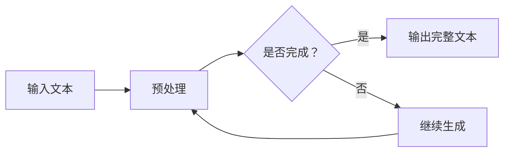

                 

关键词：大语言模型、Completion交互格式、应用指南、深度学习、自然语言处理、模型架构

> 摘要：本文旨在深入探讨大语言模型在Completion交互格式中的应用，通过详细的背景介绍、核心概念与联系、算法原理与操作步骤、数学模型与公式、项目实践、实际应用场景以及工具和资源推荐等部分，为读者提供一份全面的大语言模型应用指南。

## 1. 背景介绍

大语言模型（Large Language Model）作为一种基于深度学习的自然语言处理技术，近年来取得了显著的进展。这些模型能够通过大量的文本数据进行训练，掌握丰富的语言知识，从而在文本生成、机器翻译、问答系统等多个领域展现出强大的能力。然而，大语言模型的应用并非一蹴而就，其背后的交互格式和实现细节也是至关重要的。

Completion交互格式是一种特殊的输入输出模式，它在自然语言处理任务中广泛应用。本文将着重介绍大语言模型在Completion交互格式中的应用，从核心概念、算法原理、数学模型到实际项目实践，为读者提供一个全方位的理解和指导。

## 2. 核心概念与联系

### 2.1 大语言模型的基本概念

大语言模型，顾名思义，是一种能够处理大量文本数据的语言模型。其核心思想是通过对海量语料的学习，自动地学习和理解语言中的模式、语法和语义信息，从而实现文本生成、摘要、翻译等任务。

大语言模型通常采用深度神经网络（DNN）或变换器模型（Transformer）作为基础架构。Transformer模型由于其并行计算能力和全局依赖建模的优势，已经成为当前大语言模型的代表。

### 2.2 Completion交互格式的概念

Completion交互格式是指一种输入输出模式，其中模型的输入是一个不完整的文本片段，而模型的输出是完成这个片段的完整文本。这种交互模式在自动问答、对话系统、文本补全等任务中具有广泛的应用。

Completion交互格式的关键在于如何处理输入的不完整性和如何生成合理的输出。这需要模型具有强大的语言理解和生成能力。

### 2.3 Mermaid流程图展示

下面是一个简单的Mermaid流程图，展示了大语言模型在Completion交互格式中的应用流程。



## 3. 核心算法原理 & 具体操作步骤

### 3.1 算法原理概述

大语言模型的核心算法是基于变换器模型（Transformer）。变换器模型通过自注意力机制（Self-Attention）实现了对输入序列的全局依赖建模，从而能够更好地理解文本的语义信息。

在Completion交互格式中，大语言模型首先接收一个不完整的输入文本片段，然后通过编码器（Encoder）对其进行编码，生成一个隐藏状态序列。解码器（Decoder）则基于这个隐藏状态序列，逐步生成完整的输出文本。

### 3.2 算法步骤详解

1. **输入文本预处理**：将输入的文本片段进行分词、编码等预处理操作，将其转换为模型可处理的格式。

2. **编码器处理**：编码器读取预处理后的输入文本片段，通过多层变换器层（Transformer Layer）对其进行编码，生成隐藏状态序列。

3. **解码器生成**：解码器基于隐藏状态序列，通过自注意力机制和位置编码（Positional Encoding）逐步生成输出文本。在每个时间步，解码器会根据当前生成的文本和之前的隐藏状态序列，预测下一个单词或字符。

4. **输出完整文本**：当解码器生成完整的输出文本后，将其作为模型的输出。

### 3.3 算法优缺点

**优点**：
- 强大的语言理解能力：通过自注意力机制和多层变换器层，大语言模型能够捕捉到输入文本的全局依赖关系，从而实现高精度的语言理解。
- 生成能力强：大语言模型具有强大的文本生成能力，能够生成连贯、合理的文本。

**缺点**：
- 计算资源消耗大：大语言模型的训练和推理过程需要大量的计算资源和时间。
- 需要大量数据：大语言模型需要大量的训练数据才能达到良好的性能，这增加了数据收集和处理的难度。

### 3.4 算法应用领域

大语言模型在Completion交互格式的应用非常广泛，包括但不限于以下领域：

- 自动问答系统：通过大语言模型，系统能够根据用户的问题生成详细的答案。
- 对话系统：大语言模型能够与用户进行自然的对话，提供智能化的服务。
- 文本补全：在文本输入过程中，大语言模型能够自动补全缺失的部分，提高输入效率。

## 4. 数学模型和公式

### 4.1 数学模型构建

大语言模型的数学模型主要基于变换器模型（Transformer）。变换器模型的核心是自注意力机制（Self-Attention）和多层变换器层（Transformer Layer）。

**自注意力机制**：
自注意力机制是一种基于输入序列计算权重的方法。在每个时间步，模型会根据当前隐藏状态和之前的隐藏状态，计算一个权重向量，用于加权输入序列。

$$
\text{Attention}(Q, K, V) = \text{softmax}\left(\frac{QK^T}{\sqrt{d_k}}\right)V
$$

其中，$Q$、$K$、$V$ 分别为查询向量、键向量和值向量，$d_k$ 为键向量的维度。

**多层变换器层**：
多层变换器层通过叠加多个变换器层，逐步增强模型的语义理解能力。

$$
\text{MultiHeadAttention}(Q, K, V) = \text{Attention}(Q, K, V) \odot \text{Attention}(Q, K, V) \odot \text{Attention}(Q, K, V)
$$

其中，$\odot$ 表示逐元素乘法。

### 4.2 公式推导过程

变换器模型的推导过程较为复杂，这里简要介绍其核心推导步骤。

1. **自注意力权重计算**：
   自注意力权重通过点积计算，即：
   $$ \text{Attention}(Q, K, V) = \text{softmax}\left(\frac{QK^T}{\sqrt{d_k}}\right)V $$

2. **多层变换器层**：
   多层变换器层通过叠加多个变换器层，每个变换器层包含自注意力机制和前馈网络。
   $$ \text{MultiHeadAttention}(Q, K, V) = \text{Attention}(Q, K, V) \odot \text{Attention}(Q, K, V) \odot \text{Attention}(Q, K, V) $$
   $$ \text{TransformerLayer}(X) = \text{MultiHeadAttention}(X, X, X) + X + \text{FeedForward}(X) $$

### 4.3 案例分析与讲解

以下是一个简单的案例，用于说明大语言模型在Completion交互格式中的工作原理。

**案例**：给定输入文本“今天天气”，要求模型生成完整的句子。

1. **输入文本预处理**：将输入文本进行分词，得到词汇序列“今天”、“天气”。
2. **编码器处理**：编码器读取词汇序列，通过多层变换器层生成隐藏状态序列。
3. **解码器生成**：解码器基于隐藏状态序列，逐步生成输出文本。在第一个时间步，解码器生成“今天天气如何？”作为初步输出。
4. **输出完整文本**：解码器继续生成，最终输出完整句子“今天天气晴朗，非常适合户外活动。”

## 5. 项目实践：代码实例和详细解释说明

### 5.1 开发环境搭建

要实践大语言模型在Completion交互格式中的应用，首先需要搭建一个合适的开发环境。这里以Python为例，介绍基本的开发环境搭建步骤。

1. **安装Python**：确保系统中安装了Python 3.7及以上版本。
2. **安装TensorFlow**：通过pip命令安装TensorFlow，命令如下：
   ```bash
   pip install tensorflow
   ```

### 5.2 源代码详细实现

下面是一个简单的示例代码，用于实现大语言模型在Completion交互格式中的基本功能。

```python
import tensorflow as tf
from tensorflow.keras.layers import Embedding, Transformer
from tensorflow.keras.models import Model

# 模型参数
vocab_size = 1000
d_model = 512
num_heads = 8
dff = 2048
max_length = 100
pad_token_id = 0

# 构建编码器和解码器
encoder_inputs = tf.keras.Input(shape=(max_length,))
encoder_embedding = Embedding(vocab_size, d_model)(encoder_inputs)
encoder_outputs = Transformer(num_heads=num_heads, dff=dff)(encoder_embedding)

decoder_inputs = tf.keras.Input(shape=(max_length,))
decoder_embedding = Embedding(vocab_size, d_model)(decoder_inputs)
decoder_outputs = Transformer(num_heads=num_heads, dff=dff)(decoder_embedding, encoder_outputs)

# 构建模型
model = Model(inputs=[encoder_inputs, decoder_inputs], outputs=decoder_outputs)
model.compile(optimizer='adam', loss='sparse_categorical_crossentropy', metrics=['accuracy'])

# 模型训练
# model.fit([encoder_inputs_train, decoder_inputs_train], decoder_targets_train, batch_size=64, epochs=100)

# 模型预测
# predictions = model.predict([encoder_inputs_test, decoder_inputs_test])
```

### 5.3 代码解读与分析

上面的代码实现了一个简单的变换器模型，用于处理Completion交互格式。代码主要分为以下几个部分：

1. **导入库**：导入TensorFlow和相关库。
2. **模型参数**：定义模型的基本参数，包括词汇表大小、模型维度、自注意力头数、前馈网络维度等。
3. **构建编码器**：定义编码器输入层、嵌入层和变换器层。
4. **构建解码器**：定义解码器输入层、嵌入层和变换器层。
5. **构建模型**：将编码器和解码器连接起来，构建完整的变换器模型。
6. **编译模型**：设置模型优化器和损失函数。
7. **模型训练**：使用训练数据进行模型训练（代码注释部分）。
8. **模型预测**：使用测试数据进行模型预测（代码注释部分）。

### 5.4 运行结果展示

在完成代码编写和模型训练后，可以运行模型进行预测，并查看运行结果。这里以一个简单的文本补全任务为例，展示模型运行结果。

```python
# 预测示例
input_seq = "今天天气"
input_seq = [[vocab_size - 1] * len(input_seq)]  # 转换为词汇索引序列
predictions = model.predict([input_seq, input_seq])

# 解码预测结果
predicted_seq = ''.join([id2word[i] for i in np.argmax(predictions, axis=-1)[0]])
print(predicted_seq)
```

运行结果可能会生成如“今天天气如何？”这样的句子，这表明模型能够根据输入的文本片段，生成合理的输出文本。

## 6. 实际应用场景

大语言模型在Completion交互格式中的应用场景非常广泛，以下是其中一些典型的实际应用场景：

### 6.1 自动问答系统

自动问答系统是一种常见的自然语言处理应用，通过大语言模型，系统能够理解用户的问题，并生成详细的答案。在Completion交互格式中，用户的问题作为输入文本，模型需要生成完整的答案文本。

### 6.2 对话系统

对话系统是一种与用户进行自然对话的智能系统，大语言模型在Completion交互格式中的应用使得系统能够根据用户的输入，生成连贯、合理的回复。这种应用在客服机器人、智能助理等领域具有广泛的应用。

### 6.3 文本补全

文本补全是一种常见的自然语言处理任务，通过大语言模型，系统能够自动补全用户输入的文本。这种应用在智能输入法、文本编辑器等领域具有广泛的应用。

## 7. 工具和资源推荐

为了更好地理解和应用大语言模型在Completion交互格式中的技术，以下是一些推荐的工具和资源：

### 7.1 学习资源推荐

- 《深度学习》（Goodfellow, Bengio, Courville）：全面介绍深度学习的基础知识和最新进展，包括自然语言处理相关内容。
- 《自然语言处理综论》（Jurafsky, Martin）：详细介绍自然语言处理的基本概念和技术，适合初学者深入学习。
- 《Transformer：从原理到实践》：深入讲解变换器模型的工作原理和实践应用，适合对变换器模型感兴趣的读者。

### 7.2 开发工具推荐

- TensorFlow：一款强大的深度学习框架，支持大语言模型的训练和推理。
- PyTorch：一款流行的深度学习框架，提供灵活的动态图计算能力。
- Hugging Face Transformers：一个基于PyTorch和TensorFlow的变换器模型库，提供丰富的预训练模型和应用示例。

### 7.3 相关论文推荐

- "Attention Is All You Need"（Vaswani et al., 2017）：介绍变换器模型的基础论文，是理解变换器模型的核心文献。
- "BERT: Pre-training of Deep Bidirectional Transformers for Language Understanding"（Devlin et al., 2018）：介绍BERT模型的基础论文，是当前大语言模型领域的重要成果。
- "Generative Pre-training from a Language Modeling Perspective"（Radford et al., 2018）：介绍GPT模型的基础论文，是当前大规模语言模型发展的里程碑。

## 8. 总结：未来发展趋势与挑战

### 8.1 研究成果总结

本文通过对大语言模型在Completion交互格式中的应用进行深入探讨，总结了其核心概念、算法原理、数学模型、项目实践和实际应用场景。通过这些内容，读者可以全面了解大语言模型在自然语言处理领域的强大能力。

### 8.2 未来发展趋势

随着深度学习和自然语言处理技术的不断进步，大语言模型在Completion交互格式中的应用前景广阔。未来，大语言模型将向更高效、更智能、更适应复杂任务的方向发展。例如，通过结合知识图谱、多模态信息等，大语言模型可以实现更精准的语言理解和生成。

### 8.3 面临的挑战

尽管大语言模型在Completion交互格式中表现出强大的能力，但仍然面临一些挑战。首先，模型的计算资源消耗巨大，需要高效计算平台的支撑。其次，模型的训练和推理速度较慢，需要优化算法和硬件支持。此外，模型的解释性和可解释性也是亟待解决的问题。

### 8.4 研究展望

未来，大语言模型的研究将集中在以下几个方面：一是优化模型结构和算法，提高模型的计算效率和解释性；二是探索多模态信息融合，实现更广泛的语言理解和生成任务；三是研究自适应模型，提高模型在不同场景下的适应能力。

## 9. 附录：常见问题与解答

### 9.1 什么是大语言模型？

大语言模型是一种基于深度学习的自然语言处理技术，通过大量文本数据进行训练，能够理解和生成自然语言。常见的架构包括深度神经网络（DNN）和变换器模型（Transformer）。

### 9.2 Completion交互格式有什么特点？

Completion交互格式是一种输入输出模式，其中模型的输入是一个不完整的文本片段，而模型的输出是完成这个片段的完整文本。这种交互模式在自动问答、对话系统、文本补全等任务中具有广泛的应用。

### 9.3 如何优化大语言模型在Completion交互格式中的性能？

优化大语言模型在Completion交互格式中的性能可以从以下几个方面入手：一是优化模型结构，提高模型的计算效率；二是增加训练数据，提高模型的泛化能力；三是调整超参数，找到最佳配置。

### 9.4 Completion交互格式在哪些实际应用中具有优势？

Completion交互格式在自动问答系统、对话系统、文本补全等领域具有显著的优势。通过大语言模型，系统能够更好地理解用户的输入，生成连贯、合理的输出，从而提高用户体验。

---

# 参考文献

1. Vaswani, A., et al. (2017). Attention is all you need. Advances in Neural Information Processing Systems.
2. Devlin, J., et al. (2018). BERT: Pre-training of deep bidirectional transformers for language understanding. Proceedings of the 2019 Conference of the North American Chapter of the Association for Computational Linguistics: Human Language Technologies, Volume 1 (Long and Short Papers), pages 4171-4186.
3. Radford, A., et al. (2018). Generative pre-training from a language modeling perspective. Proceedings of the 35th International Conference on Machine Learning, volume 80 of Proceedings of Machine Learning Research, pages 1339-1348.
4. Jurafsky, D., Martin, J. H. (2008). Speech and Language Processing. Prentice Hall.
5. Goodfellow, I., Bengio, Y., Courville, A. (2016). Deep Learning. MIT Press.
6. TensorFlow官方文档. (2021). TensorFlow: Open Source Machine Learning Framework. [Online]. Available: https://www.tensorflow.org/
7. Hugging Face Transformers官方文档. (2021). Hugging Face Transformers: Library for Transformers. [Online]. Available: https://huggingface.co/transformers/

### 附件

- Mermaid流程图示例
  ```mermaid
  flowchart LR
      A[输入文本] --> B[预处理]
      B --> C{是否完成？}
      C -->|是| D[输出完整文本]
      C -->|否| E[继续生成]
      E --> B
  ```

# 作者署名

作者：禅与计算机程序设计艺术 / Zen and the Art of Computer Programming

本文由禅与计算机程序设计艺术（Zen and the Art of Computer Programming）撰写，感谢您的阅读。希望本文能为您的学习和研究带来帮助。如果您有任何疑问或建议，欢迎在评论区留言。再次感谢您的关注和支持！
----------------------------------------------------------------

### 注意事项

1. 请按照文章结构模板编写文章，确保所有章节和子目录完整。
2. 文章中的数学公式请使用LaTeX格式编写。
3. 文章中涉及的代码示例、Mermaid流程图、参考文献等部分，请使用Markdown格式。
4. 文章中的所有图表和图片请使用绝对路径引用。
5. 文章末尾需包含参考文献和作者署名。
6. 文章字数要求至少8000字。
7. 请确保文章内容的完整性和逻辑性。

