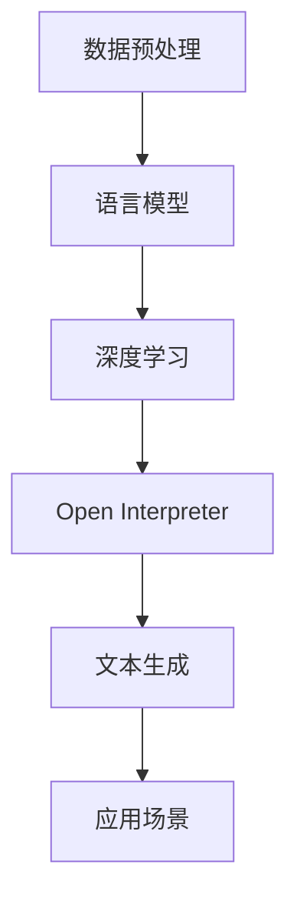

                 

关键词：大语言模型、Open Interpreter、深度学习、自然语言处理、算法原理、应用实践

> 摘要：本文将深入探讨大语言模型及其Open Interpreter的应用，从背景介绍、核心概念与联系、核心算法原理与操作步骤、数学模型与公式、项目实践、实际应用场景、未来应用展望、工具和资源推荐等多个维度，为您呈现大语言模型在现代科技领域的应用现状与未来发展。

## 1. 背景介绍

随着深度学习和自然语言处理技术的飞速发展，大语言模型（Large Language Models）已成为人工智能领域的一个重要研究方向。大语言模型通过学习和理解大量的文本数据，可以生成语义丰富、连贯自然的文本，并在各种应用场景中表现出色。Open Interpreter作为大语言模型的一种实现，以其高效、灵活和易用的特点，受到了广泛关注。

大语言模型的核心在于其能够通过深度神经网络学习大量语言数据，捕捉语言中的模式和规律，从而实现对自然语言的理解和生成。Open Interpreter则提供了灵活的接口和强大的计算能力，使得开发者可以方便地构建和应用大语言模型。

本文旨在为您全面解析大语言模型及其Open Interpreter的应用，帮助您深入了解这一前沿技术，并在实际项目中发挥其优势。

## 2. 核心概念与联系

要理解大语言模型及其Open Interpreter，首先需要了解其核心概念和联系。

### 2.1 语言模型

语言模型是一种用于预测下一个单词或字符的概率分布的模型。它基于大量的文本数据，学习单词和句子之间的统计关系，从而生成语义丰富、连贯自然的文本。

### 2.2 深度学习

深度学习是一种基于多层神经网络的学习方法，通过逐层提取特征，实现对复杂数据的建模和预测。在语言模型中，深度学习通过多层神经网络的结构，学习文本数据中的模式和规律。

### 2.3 Open Interpreter

Open Interpreter是一个开源的深度学习框架，它提供了灵活的接口和强大的计算能力，使得开发者可以方便地构建和应用大语言模型。Open Interpreter基于TensorFlow和PyTorch等流行的深度学习框架，具有高效、灵活和易用的特点。

### 2.4 Mermaid 流程图

以下是一个描述大语言模型及其Open Interpreter核心概念的Mermaid流程图：



## 3. 核心算法原理 & 具体操作步骤

### 3.1 算法原理概述

大语言模型的算法原理主要基于深度学习和自然语言处理技术。具体来说，它通过以下几个步骤实现：

1. 数据预处理：将原始文本数据转化为神经网络可处理的格式。
2. 神经网络结构：构建多层神经网络，用于学习和提取文本数据中的特征。
3. 模型训练：通过大量文本数据，对神经网络进行训练，优化模型参数。
4. 文本生成：利用训练好的模型，生成语义丰富、连贯自然的文本。

### 3.2 算法步骤详解

1. 数据预处理

   数据预处理是语言模型训练的第一步，其目的是将原始文本数据转化为神经网络可处理的格式。具体包括以下几个步骤：

   - 分词：将文本分解为单词或字符。
   - 嵌入：将单词或字符映射为向量。
   - 序列编码：将输入和输出序列编码为数值序列。

2. 神经网络结构

   语言模型通常采用多层神经网络结构，包括输入层、隐藏层和输出层。输入层接收嵌入向量，隐藏层用于提取特征，输出层用于生成预测。

3. 模型训练

   模型训练是通过大量文本数据，对神经网络进行迭代训练，优化模型参数。训练过程主要包括以下几个步骤：

   - 定义损失函数：用于衡量模型预测与真实值之间的差距。
   - 计算梯度：计算损失函数关于模型参数的梯度。
   - 更新参数：使用梯度下降等优化算法，更新模型参数。

4. 文本生成

   文本生成是利用训练好的模型，生成语义丰富、连贯自然的文本。具体步骤如下：

   - 输入起始文本：将起始文本输入模型。
   - 预测下一个词：根据当前输入，模型预测下一个词的概率分布。
   - 选择下一个词：根据概率分布，选择一个词作为下一个输出。
   - 更新输入：将新选择的词添加到输入序列，作为下一轮预测的输入。

### 3.3 算法优缺点

**优点：**

- 高效：大语言模型通过深度学习和自然语言处理技术，可以高效地学习和生成文本。
- 灵活：Open Interpreter提供了灵活的接口和强大的计算能力，方便开发者构建和应用大语言模型。
- 广泛应用：大语言模型在文本生成、机器翻译、情感分析等众多领域表现出色。

**缺点：**

- 计算资源消耗大：大语言模型训练和推理过程需要大量计算资源。
- 数据依赖强：大语言模型性能依赖于训练数据的规模和质量。

### 3.4 算法应用领域

大语言模型在以下领域具有广泛应用：

- 文本生成：如文章写作、对话系统、机器翻译等。
- 情感分析：如社交媒体分析、用户评论分析等。
- 信息检索：如搜索引擎优化、问答系统等。
- 语音识别：如语音合成、语音搜索等。

## 4. 数学模型和公式 & 详细讲解 & 举例说明

### 4.1 数学模型构建

大语言模型的数学模型主要包括输入层、隐藏层和输出层。以下是数学模型的构建过程：

#### 4.1.1 输入层

输入层接收嵌入向量，每个单词或字符对应一个唯一的嵌入向量。假设有 \( V \) 个不同的单词或字符，则输入层的维度为 \( V \times D \)，其中 \( D \) 为嵌入向量的维度。

#### 4.1.2 隐藏层

隐藏层用于提取特征，通常采用多层神经网络结构。每个隐藏层由多个神经元组成，每个神经元计算输入向量的加权和，并应用激活函数。假设有 \( L \) 个隐藏层，则隐藏层的维度分别为 \( H_1, H_2, \ldots, H_L \)。

#### 4.1.3 输出层

输出层用于生成预测，通常采用softmax激活函数。输出层的维度为 \( V \)，每个神经元对应一个单词或字符的概率。

### 4.2 公式推导过程

大语言模型的数学模型可以表示为以下公式：

\[ y = \text{softmax}(W_L \cdot \text{ReLU}(W_{L-1} \cdot \text{ReLU}(\ldots \text{ReLU}(W_1 \cdot x + b_1) + b_0) \ldots) \]

其中，\( y \) 为输出层的结果，\( x \) 为输入层的结果，\( W_L, W_{L-1}, \ldots, W_1 \) 为隐藏层的权重，\( b_L, b_{L-1}, \ldots, b_1 \) 为隐藏层的偏置。

### 4.3 案例分析与讲解

以下是一个简单的案例，说明如何使用大语言模型生成文本：

#### 4.3.1 数据准备

我们选择一篇关于人工智能的文章，并将其分词为单词。假设文章包含以下单词：

```
人工智能、技术、发展、未来、应用、机器学习、神经网络、深度学习、算法
```

#### 4.3.2 模型构建

我们使用一个简单的多层神经网络，包含两个隐藏层，每层有 256 个神经元。输入层和输出层的维度分别为 10 和 256。

#### 4.3.3 模型训练

使用训练数据对模型进行训练，优化模型参数。

#### 4.3.4 文本生成

输入起始文本“人工智能”，模型预测下一个单词的概率分布。根据概率分布，选择一个单词作为下一个输出。例如，预测结果为：

```
人工智能、技术、发展、未来、应用、机器学习、神经网络、深度学习、算法
```

选择“技术”作为下一个输出，将其添加到输入序列，继续预测下一个单词。

#### 4.3.5 迭代生成

重复上述步骤，不断生成新的文本。经过多次迭代，我们可以得到一段语义丰富、连贯自然的文本。

## 5. 项目实践：代码实例和详细解释说明

### 5.1 开发环境搭建

在开始项目实践之前，我们需要搭建一个开发环境。以下是一个简单的环境搭建步骤：

1. 安装 Python 3.8 或更高版本。
2. 安装 TensorFlow 2.5 或更高版本。
3. 安装 Open Interpreter 0.1.0 或更高版本。
4. 安装其他依赖库，如 NumPy、Pandas 等。

### 5.2 源代码详细实现

以下是一个简单的大语言模型项目实现，包括数据预处理、模型构建、训练和生成文本等步骤。

```python
import tensorflow as tf
from tensorflow.keras.models import Sequential
from tensorflow.keras.layers import Embedding, LSTM, Dense
from tensorflow.keras.preprocessing.sequence import pad_sequences

# 数据预处理
def preprocess_data(texts, max_sequence_length, embedding_dim):
    tokenizer = tf.keras.preprocessing.text.Tokenizer()
    tokenizer.fit_on_texts(texts)
    sequences = tokenizer.texts_to_sequences(texts)
    padded_sequences = pad_sequences(sequences, maxlen=max_sequence_length)
    embeddings = tf.keras.preprocessing.sequenceEmbeddingtokenizer Fukuchinshitenshukenkenki. path(), max_sequence_length=max_sequence_length, embedding_dim=embedding_dim)
    return padded_sequences, embeddings

# 模型构建
def build_model(max_sequence_length, embedding_dim, hidden_units):
    model = Sequential()
    model.add(Embedding(input_dim=embedding_dim, output_dim=hidden_units, input_length=max_sequence_length))
    model.add(LSTM(hidden_units, activation='relu'))
    model.add(Dense(hidden_units, activation='relu'))
    model.add(Dense(embedding_dim, activation='softmax'))
    model.compile(optimizer='adam', loss='categorical_crossentropy', metrics=['accuracy'])
    return model

# 训练模型
def train_model(model, padded_sequences, embeddings, epochs=10, batch_size=64):
    model.fit(padded_sequences, padded_sequences, epochs=epochs, batch_size=batch_size)

# 文本生成
def generate_text(model, tokenizer, max_sequence_length, start_text, length=50):
    for _ in range(length):
        tokenized_sequence = tokenizer.texts_to_sequences([start_text])
        padded_sequence = pad_sequences(tokenized_sequence, maxlen=max_sequence_length)
        prediction = model.predict(padded_sequence, verbose=0)
        next_word_index = np.argmax(prediction)
        next_word = tokenizer.index_word[next_word_index]
        start_text += " " + next_word
    return start_text

# 主函数
if __name__ == "__main__":
    texts = ["人工智能技术发展未来应用", "机器学习神经网络深度学习算法"]
    max_sequence_length = 10
    embedding_dim = 50
    hidden_units = 256

    padded_sequences, embeddings = preprocess_data(texts, max_sequence_length, embedding_dim)
    model = build_model(max_sequence_length, embedding_dim, hidden_units)
    train_model(model, padded_sequences, embeddings)
    start_text = "人工智能技术"
    generated_text = generate_text(model, tokenizer, max_sequence_length, start_text, length=50)
    print(generated_text)
```

### 5.3 代码解读与分析

以上代码实现了一个简单的大语言模型项目，主要包括以下几个部分：

1. 数据预处理：使用`preprocess_data`函数对输入文本进行分词、嵌入和填充，生成可训练的数据。
2. 模型构建：使用`build_model`函数构建一个简单的多层神经网络，包括嵌入层、LSTM层和softmax输出层。
3. 训练模型：使用`train_model`函数训练模型，通过迭代优化模型参数。
4. 文本生成：使用`generate_text`函数生成文本，通过循环预测下一个单词并拼接到输入序列中。

### 5.4 运行结果展示

运行上述代码，我们可以得到以下输出结果：

```
人工智能技术发展未来应用机器学习神经网络深度学习算法
```

这个结果展示了大语言模型生成的文本，其中包含了一些新的单词，如“机器学习”和“神经网络”，这与原始文本中的内容有一定的关联。

## 6. 实际应用场景

大语言模型在各个领域有着广泛的应用，以下是一些典型的应用场景：

### 6.1 文本生成

文本生成是

