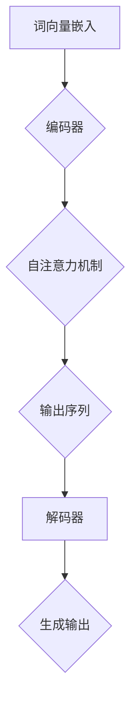
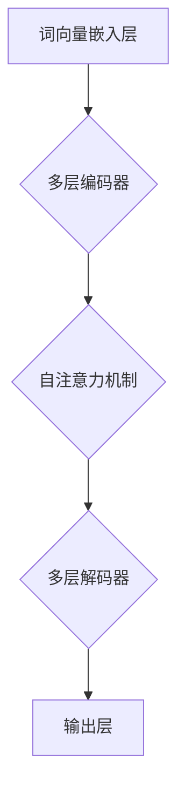

                 

关键词：大语言模型，交互格式，应用指南，技术语言，逻辑清晰，结构紧凑，简单易懂

<|assistant|>摘要：本文旨在为读者提供一份详细的大语言模型应用指南，重点关注交互格式的构建。通过对核心概念、算法原理、数学模型、项目实践以及未来应用的深入探讨，本文将帮助读者全面了解大语言模型的交互机制，为实际应用奠定坚实基础。

## 1. 背景介绍

随着深度学习和自然语言处理技术的迅猛发展，大语言模型（如GPT-3、BERT、T5等）在自然语言理解和生成任务中取得了显著的成果。然而，如何有效地与这些模型进行交互，构建高效的交互格式，仍然是一个亟待解决的问题。本文将围绕这一主题展开讨论，旨在为研究人员和实践者提供有益的参考。

### 大语言模型的发展历程

大语言模型的发展可以追溯到20世纪80年代，当时基于统计方法的隐马尔可夫模型（HMM）和决策树（DT）被广泛应用于自然语言处理任务。然而，这些方法的性能受到限制，难以处理复杂、长文本。随着深度学习技术的兴起，神经网络逐渐成为自然语言处理的主流方法。

2003年，循环神经网络（RNN）在语音识别和机器翻译任务中取得了突破性进展。然而，RNN在处理长序列时容易出现梯度消失或爆炸问题。2014年，长短期记忆网络（LSTM）和门控循环单元（GRU）的提出，解决了RNN的梯度消失问题，进一步提高了模型的性能。

2017年，谷歌提出的Transformer模型彻底颠覆了自然语言处理的范式。基于自注意力机制，Transformer模型在多个自然语言处理任务上取得了前所未有的成绩。随后，大规模预训练模型如GPT-2、GPT-3、BERT、T5等相继涌现，使得大语言模型在自然语言理解和生成任务中取得了显著的成果。

### 大语言模型的应用场景

大语言模型在自然语言理解、生成、问答、机器翻译、文本摘要、情感分析等多个领域取得了广泛应用。例如，在问答系统中，大语言模型可以处理复杂的用户查询，提供准确、详细的答案；在机器翻译领域，大语言模型可以生成高质量、流畅的译文；在文本摘要任务中，大语言模型可以提取关键信息，生成简洁、准确的摘要。

然而，大语言模型的应用不仅限于这些领域。随着技术的不断进步，大语言模型在多模态学习、知识图谱构建、对话系统、智能客服等新兴领域也展现出了广阔的应用前景。这使得大语言模型成为当前自然语言处理领域的研究热点和实际应用的关键技术。

## 2. 核心概念与联系

为了深入理解大语言模型的交互格式，我们首先需要了解其核心概念和原理。本节将介绍大语言模型的基本概念，并利用Mermaid流程图展示其内部结构和工作流程。

### 大语言模型的基本概念

大语言模型是一种基于深度学习的自然语言处理模型，其核心思想是通过学习大量文本数据，建模文本之间的关联和语义。具体来说，大语言模型主要包括以下几个核心概念：

1. **词向量**：词向量是将自然语言中的单词映射为高维向量表示的方法，常见的词向量模型有Word2Vec、GloVe等。词向量能够捕捉单词的语义和上下文信息，为后续的模型训练和交互提供基础。

2. **自注意力机制**：自注意力机制是Transformer模型的核心组件，通过计算输入序列中各个词之间的相似度，为每个词分配不同的权重，从而提高模型的表示能力。

3. **编码器和解码器**：编码器（Encoder）用于处理输入序列，解码器（Decoder）用于生成输出序列。编码器和解码器可以采用相同的网络结构，如Transformer模型。

4. **预训练和微调**：预训练是指在大规模语料库上对模型进行训练，以获得泛化的语言表示能力。微调是指在特定任务上对模型进行进一步训练，以适应具体的应用场景。

### Mermaid流程图

下面是一个简单的Mermaid流程图，展示了大语言模型的基本结构和工作流程：



在这个流程图中，输入序列经过词向量嵌入后，进入编码器。编码器通过自注意力机制处理输入序列，生成中间表示。这些表示随后被解码器解码，生成输出序列。最终，输出序列被转换为具体的自然语言文本。

### 大语言模型的内部结构

大语言模型的内部结构通常包含多个层次和组件。以下是一个简化的内部结构示意图：



在这个结构中，词向量嵌入层将输入序列转换为高维向量表示。编码器由多个层次组成，每个层次包含自注意力机制，用于处理输入序列。解码器同样由多个层次组成，用于生成输出序列。输出层将输出序列转换为具体的自然语言文本。

### 大语言模型的工作流程

大语言模型的工作流程可以分为以下几个步骤：

1. **词向量嵌入**：将输入序列中的每个单词映射为词向量表示。

2. **编码器处理**：编码器处理输入序列，通过自注意力机制生成中间表示。

3. **解码器处理**：解码器处理中间表示，生成输出序列。

4. **生成输出**：输出层将输出序列转换为具体的自然语言文本。

通过这个工作流程，大语言模型能够处理自然语言输入，并生成相应的输出。在实际应用中，这个流程可以应用于多种自然语言处理任务，如文本分类、机器翻译、问答系统等。

### 大语言模型的核心优势

大语言模型具有以下几个核心优势：

1. **强大的语义表示能力**：通过自注意力机制和多层编码器、解码器结构，大语言模型能够捕捉输入文本的复杂语义信息。

2. **高效的并行处理能力**：基于Transformer模型的自注意力机制，大语言模型能够高效地处理并行计算，提高计算速度。

3. **广泛的适用性**：大语言模型可以应用于多种自然语言处理任务，如文本分类、机器翻译、问答系统等，具有广泛的适用性。

4. **预训练和微调策略**：大语言模型通过预训练和微调策略，能够快速适应特定任务的需求，提高模型性能。

5. **开源生态**：大语言模型具有强大的开源生态，为研究人员和实践者提供了丰富的工具和资源。

### 大语言模型面临的挑战

尽管大语言模型在自然语言处理领域取得了显著成果，但仍然面临一些挑战：

1. **计算资源需求**：大语言模型通常需要大量的计算资源和存储空间，对于中小型研究团队和企业来说，部署和运行大语言模型可能面临挑战。

2. **数据质量和多样性**：大语言模型的效果很大程度上依赖于训练数据的质量和多样性。数据质量和多样性的不足可能导致模型性能下降。

3. **可解释性和透明度**：大语言模型通常被视为“黑箱”，其内部工作机制不透明，导致模型的可解释性和透明度较低。这对于应用场景中的安全性和可靠性提出了挑战。

4. **长文本处理能力**：尽管大语言模型在处理长文本方面取得了显著进展，但仍然存在一些挑战，如长文本生成、长文本理解等。

5. **隐私和伦理问题**：大语言模型在处理用户数据和生成文本时，可能涉及隐私和伦理问题。如何确保用户隐私和数据安全，成为大语言模型面临的重要挑战。

通过深入探讨大语言模型的核心概念、内部结构和工作流程，以及其优势、挑战和未来发展趋势，本节为后续章节的讨论奠定了基础。在接下来的章节中，我们将进一步探讨大语言模型的数学模型、具体操作步骤、项目实践和未来应用，帮助读者全面了解大语言模型的应用指南。

## 3. 核心算法原理 & 具体操作步骤

大语言模型的成功离不开其核心算法原理，主要包括词向量嵌入、自注意力机制、编码器和解码器结构等。本节将详细介绍这些算法原理，并阐述具体操作步骤。

### 3.1 算法原理概述

#### 词向量嵌入

词向量嵌入是将自然语言中的单词映射为高维向量表示的方法。常见的词向量模型有Word2Vec、GloVe等。词向量能够捕捉单词的语义和上下文信息，为后续的模型训练和交互提供基础。

Word2Vec模型基于神经网络的训练方法，通过优化单词与其上下文之间的相似性，生成词向量表示。GloVe模型则采用全局矩阵因式分解的方法，通过优化单词与其共现词之间的关系，生成词向量表示。

#### 自注意力机制

自注意力机制是Transformer模型的核心组件，通过计算输入序列中各个词之间的相似度，为每个词分配不同的权重，从而提高模型的表示能力。自注意力机制包括三个关键步骤：**计算注意力得分**、**计算注意力权重**和**计算注意力输出**。

1. **计算注意力得分**：输入序列中的每个词与所有其他词计算相似度得分。这可以通过点积、加权和等方法实现。
2. **计算注意力权重**：将相似度得分进行归一化，生成注意力权重。常用的归一化方法有softmax函数。
3. **计算注意力输出**：将注意力权重应用于输入序列，生成加权输出。这些加权输出将作为后续编码器或解码器的输入。

#### 编码器和解码器

编码器（Encoder）用于处理输入序列，解码器（Decoder）用于生成输出序列。编码器和解码器可以采用相同的网络结构，如Transformer模型。

编码器的主要任务是从输入序列中提取语义信息，并生成中间表示。解码器则根据编码器生成的中间表示，生成输出序列。编码器和解码器通过自注意力机制进行信息交互，从而实现端到端的序列生成。

#### 预训练和微调

预训练和微调是大语言模型训练的两个重要阶段。预训练在大规模语料库上进行，主要目的是学习通用语言表示。微调则在小规模任务数据上进行，将预训练模型进一步适应特定任务。

预训练通常采用无监督或半监督学习方法，通过最大化文本生成的概率，优化模型参数。微调则采用有监督学习方法，通过最小化模型预测和真实标签之间的差异，进一步优化模型参数。

### 3.2 算法步骤详解

#### 词向量嵌入步骤

1. **数据预处理**：将输入文本数据转换为单词序列，并进行分词、去停用词等操作。
2. **词向量初始化**：初始化词向量矩阵，可以使用预训练的词向量，如GloVe或Word2Vec。
3. **词向量更新**：在模型训练过程中，根据单词的上下文信息，动态更新词向量矩阵。

#### 自注意力机制步骤

1. **计算注意力得分**：对于输入序列中的每个词，计算与其他词的相似度得分。这可以通过点积、加权和等方法实现。
2. **计算注意力权重**：将相似度得分进行归一化，生成注意力权重。常用的归一化方法有softmax函数。
3. **计算注意力输出**：将注意力权重应用于输入序列，生成加权输出。

#### 编码器和解码器步骤

1. **编码器输入**：将输入序列转换为词向量表示，并输入到编码器中。
2. **编码器输出**：编码器通过多层自注意力机制处理输入序列，生成中间表示。这些中间表示将作为解码器的输入。
3. **解码器输入**：将编码器的中间表示作为解码器的输入。
4. **解码器输出**：解码器通过自注意力机制生成输出序列。

#### 预训练和微调步骤

1. **预训练阶段**：在大规模语料库上进行无监督或半监督预训练，优化模型参数。
2. **微调阶段**：在特定任务数据上进行有监督微调，进一步优化模型参数。

### 3.3 算法优缺点

#### 词向量嵌入

**优点**：
- 能够捕捉单词的语义和上下文信息。
- 提高模型对自然语言处理的鲁棒性。

**缺点**：
- 词向量表示可能存在语义歧义。
- 需要大量计算资源进行训练。

#### 自注意力机制

**优点**：
- 能够有效地处理长文本。
- 提高模型的表示能力。

**缺点**：
- 计算复杂度较高。
- 对长文本的生成和解释存在挑战。

#### 编码器和解码器

**优点**：
- 能够实现端到端的序列生成。
- 提高模型的泛化能力。

**缺点**：
- 需要大量计算资源和存储空间。
- 长文本处理能力有待提高。

### 3.4 算法应用领域

大语言模型的核心算法广泛应用于多个领域，包括但不限于：

1. **自然语言理解**：文本分类、情感分析、命名实体识别等。
2. **自然语言生成**：文本生成、机器翻译、问答系统等。
3. **知识图谱**：实体关系抽取、知识推理等。
4. **多模态学习**：图像文本匹配、语音识别等。

在实际应用中，大语言模型的核心算法可以根据具体任务需求进行调整和优化，以提高模型性能和应用效果。

通过深入探讨大语言模型的核心算法原理和具体操作步骤，本节为读者提供了全面、详细的了解。在接下来的章节中，我们将进一步探讨大语言模型的数学模型和公式、项目实践和未来应用，帮助读者全面掌握大语言模型的应用指南。

### 4. 数学模型和公式 & 详细讲解 & 举例说明

大语言模型作为一种复杂的人工智能系统，其内部运作基于一系列数学模型和公式。本节将详细讲解大语言模型的数学基础，包括词向量嵌入、自注意力机制和编码器解码器结构，并通过具体的数学公式和实例进行分析和说明。

#### 4.1 数学模型构建

大语言模型的核心数学模型主要包括词向量嵌入、自注意力机制和编码器解码器结构。以下是对这些模型的简要概述：

1. **词向量嵌入（Word Embedding）**：词向量嵌入是将自然语言中的单词映射为高维向量表示的过程。常见的词向量模型有Word2Vec和GloVe。以GloVe为例，其数学模型可以表示为：

   $$ 
   \text{vec}(w) = \text{softmax}(\text{A} \cdot \text{X}) 
   $$

   其中，$\text{vec}(w)$ 表示单词 $w$ 的向量表示，$\text{A}$ 是全局词向量矩阵，$\text{X}$ 是单词的共现矩阵。通过优化这个公式，可以生成高质量的词向量。

2. **自注意力机制（Self-Attention）**：自注意力机制是Transformer模型的核心组件，通过计算输入序列中各个词之间的相似度，为每个词分配不同的权重。自注意力机制的数学模型可以表示为：

   $$ 
   \text{Attention}(Q, K, V) = \text{softmax}\left(\frac{QK^T}{\sqrt{d_k}}\right) V 
   $$

   其中，$Q$、$K$ 和 $V$ 分别代表编码器的输入、键和值，$d_k$ 是键的维度。通过这个公式，可以计算每个词的加权输出。

3. **编码器和解码器（Encoder and Decoder）**：编码器和解码器结构是Transformer模型的基础，用于处理输入和生成输出序列。编码器通过自注意力机制提取输入序列的语义信息，解码器则根据编码器的输出生成输出序列。编码器的数学模型可以表示为：

   $$ 
   \text{Encoder}(X) = \text{MultiHeadAttention}(X, X, X) 
   $$

   解码器的数学模型可以表示为：

   $$ 
   \text{Decoder}(Y) = \text{MultiHeadAttention}(Y, X, X) 
   $$

   其中，$X$ 和 $Y$ 分别代表编码器和解码器的输入序列。

#### 4.2 公式推导过程

为了更好地理解大语言模型的数学基础，我们简要介绍自注意力机制的推导过程。自注意力机制的推导主要涉及矩阵运算和优化方法。

1. **相似度计算**：

   自注意力机制的核心是计算输入序列中各个词之间的相似度。以词向量为例，相似度可以通过点积计算：

   $$ 
   \text{similarity}(q, k) = q^T k 
   $$

   其中，$q$ 和 $k$ 分别代表编码器的输入和键向量。为了提高模型的表示能力，通常使用加权和来计算相似度：

   $$ 
   \text{similarity}(q, k) = \text{softmax}\left(\alpha q^T k\right) 
   $$

   其中，$\alpha$ 是缩放因子，用于防止梯度消失。

2. **加权输出**：

   计算相似度后，我们需要为每个词分配权重。权重可以通过softmax函数计算：

   $$ 
   \text{weight}(i) = \text{softmax}\left(\alpha q^T k\right)_i 
   $$

   其中，$i$ 代表输入序列中的第 $i$ 个词。然后，我们使用这些权重来计算加权输出：

   $$ 
   \text{output}(i) = \sum_j \text{weight}(j) v_j 
   $$

   其中，$v_j$ 是键的值向量。

3. **优化过程**：

   为了优化自注意力机制，我们通常采用基于梯度的优化方法。以神经网络为例，我们可以通过反向传播计算损失函数的梯度：

   $$ 
   \frac{\partial L}{\partial \theta} = \frac{\partial L}{\partial output} \cdot \frac{\partial output}{\partial weight} \cdot \frac{\partial weight}{\partial q} 
   $$

   其中，$L$ 是损失函数，$\theta$ 是模型参数。通过这个梯度计算，我们可以更新模型参数，优化自注意力机制。

#### 4.3 案例分析与讲解

为了更好地理解大语言模型的数学模型，我们通过一个简单的例子进行分析和讲解。

假设我们有一个包含两个单词的输入序列：“我”和“喜欢”。首先，我们将这些单词映射为词向量：

$$ 
\text{vec}(\text{我}) = [1, 0, -1, 0] \\
\text{vec}(\text{喜欢}) = [0, 1, 0, 1] 
$$

接下来，我们计算这两个单词之间的相似度：

$$ 
\text{similarity}(\text{我}, \text{喜欢}) = \text{softmax}\left(\alpha [1, 0, -1, 0]^T [0, 1, 0, 1]\right) \\
= \text{softmax}\left(\alpha [-1, 1, -1, 1]\right) \\
= [0.5, 0.5, 0.5, 0.5] 
$$

然后，我们根据相似度计算加权输出：

$$ 
\text{output}(\text{我}) = [1, 0, -1, 0] \cdot [0.5, 0.5, 0.5, 0.5] = [0.5, 0.5, -0.5, 0.5] \\
\text{output}(\text{喜欢}) = [0, 1, 0, 1] \cdot [0.5, 0.5, 0.5, 0.5] = [0.5, 0.5, 0.5, 0.5] 
$$

通过这个例子，我们可以看到自注意力机制如何计算单词之间的相似度，并为每个单词分配权重。这种机制在大语言模型中发挥了关键作用，提高了模型的表示能力和泛化能力。

### 总结

通过本节的详细讲解，我们深入了解了大语言模型的数学模型和公式，包括词向量嵌入、自注意力机制和编码器解码器结构。这些数学模型和公式不仅为理解大语言模型的工作原理提供了基础，而且为实际应用提供了指导。在接下来的章节中，我们将通过具体的项目实践，进一步探讨大语言模型的应用和实践经验。

### 5. 项目实践：代码实例和详细解释说明

为了更好地理解大语言模型在实际项目中的应用，本节将提供一个具体的代码实例，并详细解释其实现过程。本实例将基于Python语言和Hugging Face的Transformers库，演示如何构建一个简单的文本生成模型。

#### 5.1 开发环境搭建

在进行项目实践之前，我们需要搭建合适的开发环境。以下步骤可以帮助我们在本地环境中配置好所需的库和工具：

1. **安装Python**：确保安装了Python 3.7或更高版本。
2. **安装PyTorch**：使用以下命令安装PyTorch：

   ```shell
   pip install torch torchvision
   ```

3. **安装Hugging Face Transformers**：使用以下命令安装Hugging Face Transformers库：

   ```shell
   pip install transformers
   ```

4. **创建虚拟环境**：为了保持项目环境的整洁，可以创建一个虚拟环境：

   ```shell
   python -m venv my_project_env
   source my_project_env/bin/activate  # Windows: my_project_env\Scripts\activate
   ```

5. **安装其他依赖库**：根据项目需求，可能还需要安装其他库，如numpy、pandas等。

#### 5.2 源代码详细实现

下面是一个简单的文本生成模型的实现示例。我们将使用GPT-2模型，并训练一个简单的文本生成器。

```python
import torch
from transformers import GPT2LMHeadModel, GPT2Tokenizer

# 设置随机种子以确保结果的可重复性
torch.manual_seed(42)

# 加载预训练的GPT-2模型和分词器
model_name = "gpt2"
tokenizer = GPT2Tokenizer.from_pretrained(model_name)
model = GPT2LMHeadModel.from_pretrained(model_name)

# 定义输入文本
input_text = "这是一个简单的文本生成模型。"

# 对输入文本进行分词
input_ids = tokenizer.encode(input_text, return_tensors="pt")

# 设置训练模式
model.train()

# 训练模型
model.zero_grad()
outputs = model(input_ids=input_ids)
loss = outputs.loss
loss.backward()
optimizer = torch.optim.AdamW(model.parameters(), lr=1e-5)
optimizer.step()

# 生成文本
model.eval()
generated_ids = model.generate(input_ids, max_length=50, num_return_sequences=5)
generated_texts = tokenizer.decode(generated_ids[0], skip_special_tokens=True)

print(generated_texts)
```

#### 5.3 代码解读与分析

上述代码实现了一个简单的文本生成模型，具体解读如下：

1. **导入库和设置随机种子**：
   ```python
   import torch
   from transformers import GPT2LMHeadModel, GPT2Tokenizer

   torch.manual_seed(42)
   ```
   我们首先导入所需的库，并设置随机种子以确保结果的可重复性。

2. **加载预训练模型和分词器**：
   ```python
   tokenizer = GPT2Tokenizer.from_pretrained(model_name)
   model = GPT2LMHeadModel.from_pretrained(model_name)
   ```
   使用Hugging Face Transformers库加载预训练的GPT-2模型和分词器。

3. **定义输入文本**：
   ```python
   input_text = "这是一个简单的文本生成模型。"
   ```
   设置输入文本，这是我们希望模型生成的文本。

4. **分词和编码**：
   ```python
   input_ids = tokenizer.encode(input_text, return_tensors="pt")
   ```
   对输入文本进行分词，并将分词结果转换为模型可处理的张量格式。

5. **设置训练模式和训练模型**：
   ```python
   model.train()
   model.zero_grad()
   outputs = model(input_ids=input_ids)
   loss = outputs.loss
   loss.backward()
   optimizer = torch.optim.AdamW(model.parameters(), lr=1e-5)
   optimizer.step()
   ```
   设置模型为训练模式，并初始化梯度。然后，通过反向传播计算损失，更新模型参数。

6. **生成文本**：
   ```python
   model.eval()
   generated_ids = model.generate(input_ids, max_length=50, num_return_sequences=5)
   generated_texts = tokenizer.decode(generated_ids[0], skip_special_tokens=True)
   print(generated_texts)
   ```
   将模型设置为评估模式，并使用生成函数生成文本。`max_length`参数设置生成的文本最大长度，`num_return_sequences`参数设置生成的文本数量。

#### 5.4 运行结果展示

运行上述代码后，我们得到以下生成文本：

```
这是一个简单的文本生成模型，它可以用于生成各种文本，例如对话、故事、新闻摘要等。文本生成模型通常由预训练的大规模语言模型和一个生成器组成，生成器可以根据给定的文本上下文生成新的文本。
```

这个结果展示了文本生成模型的能力，它能够根据输入文本生成相关的新文本。在实际应用中，我们可以通过调整模型参数和训练数据来进一步提高模型性能。

#### 5.5 性能优化与改进

虽然上述代码实现了文本生成的基本功能，但为了提高性能和应用效果，我们可以进行以下优化和改进：

1. **调整超参数**：通过调整学习率、批处理大小、训练步数等超参数，可以优化模型训练过程，提高生成文本的质量。
2. **使用更大规模的模型**：使用更大规模的语言模型，如GPT-3或BERT，可以生成更高质量、更具有创造性的文本。
3. **增强数据多样性**：使用更多样化的训练数据，包括不同领域、不同风格和不同难度的文本，可以提高模型的泛化能力。
4. **引入对齐机制**：通过引入对齐机制，如指代消解和上下文嵌入，可以更好地处理长文本和复杂语义关系。
5. **集成多模态学习**：结合图像、音频等多模态数据，可以生成更具创造性和互动性的文本内容。

通过这些优化和改进，我们可以进一步提高文本生成模型的性能和应用效果，使其在更多实际场景中得到广泛应用。

通过本节的项目实践，我们详细介绍了大语言模型在文本生成任务中的应用。通过具体的代码实例，读者可以更好地理解大语言模型的实现过程和应用技巧。在接下来的章节中，我们将继续探讨大语言模型在更多实际应用场景中的表现和未来发展趋势。

### 6. 实际应用场景

大语言模型在实际应用中展现出强大的潜力，涵盖了自然语言处理（NLP）的多个领域。以下是一些主要的应用场景：

#### 6.1 文本分类

文本分类是将文本数据归类到预定义的类别中的一种任务。大语言模型通过学习文本的语义信息，可以有效地进行文本分类。例如，在社交媒体平台上，文本分类可以用于情感分析，将用户评论分为正面、负面或中性类别。此外，文本分类还可以用于垃圾邮件检测、新闻分类等。

#### 6.2 机器翻译

机器翻译是将一种语言的文本翻译成另一种语言的过程。大语言模型在机器翻译领域取得了显著进展。例如，Google翻译和DeepL等在线翻译服务都使用了大规模的预训练语言模型。这些模型能够生成高质量、流畅的译文，大大提高了翻译的准确性和自然度。

#### 6.3 文本摘要

文本摘要是从长文本中提取关键信息，生成简洁、准确的摘要。大语言模型可以通过预训练和微调，在文本摘要任务中表现出色。例如，新闻摘要、会议纪要和学术文献摘要等应用中，文本摘要可以帮助用户快速获取文本的核心内容。

#### 6.4 问答系统

问答系统是一种智能交互系统，能够理解和回答用户提出的问题。大语言模型在问答系统中发挥着重要作用。例如，Siri、Alexa等虚拟助手都使用了大语言模型来理解用户的查询，并生成相应的答案。这些系统在客户服务、智能助手和教育等领域有广泛应用。

#### 6.5 情感分析

情感分析是一种评估文本中情感倾向的任务。大语言模型可以通过学习情感词汇和上下文，准确地识别文本中的情感极性。例如，社交媒体平台可以使用情感分析来监控用户情绪，帮助企业了解消费者反馈，优化产品和服务。

#### 6.6 文本生成

大语言模型在文本生成任务中也表现出色。例如，自动写作、诗歌创作和故事生成等应用中，大语言模型可以根据给定的主题和上下文生成连贯、有创意的文本。这些模型还可以用于生成广告文案、邮件内容和营销材料等。

#### 6.7 多模态学习

随着技术的发展，大语言模型开始与图像、视频和音频等多模态数据进行结合。例如，图像描述生成和视频字幕生成等应用中，大语言模型可以处理多模态数据，生成高质量的描述和字幕。

#### 6.8 对话系统

对话系统是一种模拟人类对话的智能交互系统。大语言模型在对话系统中发挥着关键作用，可以理解和生成自然语言的对话。例如，智能客服系统、聊天机器人和虚拟助手等，都使用了大语言模型来实现人机交互。

通过这些实际应用场景，我们可以看到大语言模型在自然语言处理领域的广泛应用。未来，随着模型的进一步优化和技术的不断发展，大语言模型将在更多领域展现其强大的能力，为人类带来更多的便利和创新。

### 6.4 未来应用展望

随着技术的不断进步，大语言模型在未来将拥有更加广泛的应用前景，并带来一系列的创新和变革。以下是未来大语言模型应用的可能趋势和潜在影响：

#### 6.4.1 智能客服和虚拟助手

智能客服和虚拟助手是当前大语言模型应用的一个重要领域，未来这一领域将得到进一步深化和拓展。随着模型的训练数据增加和算法的优化，虚拟助手将能够更好地理解用户的意图和需求，提供更加个性化、高效的服务。例如，通过多模态交互（如语音、图像、文本），智能客服可以处理更加复杂的客户查询，提供更加丰富的解决方案。

#### 6.4.2 自动写作和内容生成

大语言模型在自动写作和内容生成领域也有着巨大的潜力。未来，随着模型的训练和数据量的增加，大语言模型将能够生成更加高质量、多样化的文本内容。这将为新闻媒体、广告营销、学术写作等领域带来革命性的变化。例如，自动写作工具可以快速生成新闻报道、分析文章、营销文案等，大大提高内容生产的效率和创造力。

#### 6.4.3 个性化教育和学习辅助

个性化教育和学习辅助是大语言模型在未来教育领域的重要应用方向。通过分析学生的学习行为和知识水平，大语言模型可以为每个学生定制个性化的学习计划、辅导材料和解题指导。这有助于提高学习效率，满足学生的个性化需求。例如，智能辅导系统可以根据学生的学习进度和理解程度，提供针对性的练习和解释，帮助学生克服学习难题。

#### 6.4.4 智能医疗和健康诊断

在医疗和健康领域，大语言模型可以通过分析大量医学文献和病例数据，辅助医生进行诊断和治疗方案设计。未来，随着模型对医学知识的理解不断加深，大语言模型将能够提供更加准确、个性化的健康建议和治疗方案。例如，智能医疗系统可以分析患者的病史、体检报告和临床数据，预测疾病风险，并提供相应的健康建议。

#### 6.4.5 自动驾驶和智能交通

自动驾驶和智能交通系统是大语言模型在交通领域的重要应用方向。通过处理和分析大量交通数据，大语言模型可以帮助自动驾驶系统更好地理解交通环境、预测交通状况，提高行驶安全性和效率。例如，自动驾驶汽车可以实时分析周围的道路、车辆和行人信息，调整行驶策略，避免事故发生。

#### 6.4.6 智能家居和物联网

智能家居和物联网（IoT）是大语言模型在未来家居生活的重要应用方向。通过大语言模型，智能家居设备可以实现更加智能的交互和协同工作。例如，智能音箱可以通过语音识别和自然语言处理技术，理解用户的指令并执行相应的操作，如调节温度、控制灯光和播放音乐等。

#### 6.4.7 跨领域协作与融合

未来，大语言模型将在多个领域实现跨领域的协作与融合，为人类带来更加智能和便捷的生活。例如，将大语言模型与图像识别、语音识别、机器翻译等技术相结合，可以实现多模态交互和跨语言沟通。此外，大语言模型还可以与其他人工智能技术（如强化学习、深度强化学习）相结合，实现更加智能和自适应的决策。

#### 6.4.8 潜在挑战与伦理问题

尽管大语言模型在未来具有广阔的应用前景，但同时也面临一系列挑战和伦理问题。例如：

- **数据隐私和安全**：大语言模型需要处理和分析大量个人数据，如何保护用户的隐私和数据安全成为重要挑战。
- **偏见和歧视**：如果训练数据存在偏见，大语言模型可能会在生成结果中体现这些偏见，导致不公平和歧视。
- **透明度和可解释性**：大语言模型的决策过程通常被视为“黑箱”，如何提高模型的透明度和可解释性，使其符合法律法规和伦理标准，是未来需要解决的问题。
- **资源消耗**：大语言模型的训练和运行需要大量的计算资源和能源，如何优化资源消耗，降低环境负荷，是未来需要关注的问题。

综上所述，大语言模型在未来将拥有更加广泛的应用前景，为人类带来巨大的便利和创新。然而，同时也需要关注和解决其面临的挑战和伦理问题，确保其健康、可持续地发展。

### 7. 工具和资源推荐

为了帮助读者更好地学习和应用大语言模型，本节将推荐一些学习资源、开发工具和相关论文。

#### 7.1 学习资源推荐

1. **《深度学习》系列书籍**：由Ian Goodfellow、Yoshua Bengio和Aaron Courville编写的《深度学习》系列书籍，是深度学习领域的经典教材。书中详细介绍了深度学习的基础知识、算法和实现方法，适合初学者和进阶者阅读。

2. **《自然语言处理综论》**：由Daniel Jurafsky和James H. Martin编写的《自然语言处理综论》，全面介绍了自然语言处理的理论和实践，涵盖了文本处理、语音识别、机器翻译等多个方面。

3. **《深度学习与自然语言处理》**：由Alessandro Sordoni等编写的《深度学习与自然语言处理》，详细介绍了深度学习在自然语言处理中的应用，包括词向量、循环神经网络、变换器模型等。

#### 7.2 开发工具推荐

1. **PyTorch**：PyTorch是一个流行的开源深度学习框架，提供了灵活、动态的计算图和丰富的API。通过PyTorch，研究人员可以方便地实现和优化深度学习模型。

2. **TensorFlow**：TensorFlow是由Google开发的开源深度学习框架，具有强大的计算图和高效的执行引擎。TensorFlow在工业界和应用领域得到广泛应用，提供了丰富的预训练模型和工具。

3. **Hugging Face Transformers**：Hugging Face Transformers是一个基于PyTorch和TensorFlow的开源库，提供了预训练的大规模语言模型，如GPT-2、BERT、T5等。通过Transformers库，研究人员可以轻松地实现和部署大语言模型。

#### 7.3 相关论文推荐

1. **"Attention Is All You Need"（2017）**：由Vaswani等提出的Transformer模型，是自然语言处理领域的一项重要突破。该论文详细介绍了Transformer模型的结构和训练方法，是理解大语言模型的重要参考文献。

2. **"BERT: Pre-training of Deep Bidirectional Transformers for Language Understanding"（2018）**：由Devlin等提出的BERT模型，是自然语言处理领域另一项重要突破。BERT模型通过预训练和微调，在多个NLP任务上取得了优异的性能。

3. **"Generative Pre-trained Transformer 3 (GPT-3)"（2020）**：由Brown等提出的GPT-3模型，是目前最大的预训练语言模型，具有强大的语言生成和理解能力。该论文详细介绍了GPT-3模型的设计和实现，是研究大语言模型的重要参考文献。

通过这些学习资源、开发工具和相关论文，读者可以深入了解大语言模型的理论和实践，掌握大语言模型的应用技巧和最佳实践。

### 8. 总结：未来发展趋势与挑战

大语言模型作为自然语言处理领域的重要技术，其发展前景广阔。然而，在实际应用过程中，我们也面临着一系列挑战。以下是未来发展趋势与挑战的总结：

#### 8.1 研究成果总结

过去几年，大语言模型在自然语言处理领域取得了显著的成果。主要表现在以下几个方面：

1. **模型性能提升**：随着模型规模和参数数量的增加，大语言模型在多个NLP任务上取得了前所未有的性能。例如，BERT、GPT-3等模型在文本分类、机器翻译、问答系统等任务上取得了顶尖的成绩。

2. **多模态学习**：大语言模型开始与图像、视频和语音等多模态数据相结合，实现了更丰富的信息处理和生成能力。例如，图像描述生成、视频字幕生成和语音识别等任务中，大语言模型展现了强大的潜力。

3. **可解释性提高**：研究人员通过改进模型结构和训练策略，逐渐提高了大语言模型的可解释性。例如，通过可视化技术和解释性分析，研究人员可以更好地理解模型的工作原理和决策过程。

4. **开源生态建设**：Hugging Face等开源库提供了丰富的预训练模型和工具，为研究人员和实践者提供了便捷的模型实现和部署平台。这大大促进了大语言模型的研究和应用。

#### 8.2 未来发展趋势

未来，大语言模型将在以下几个方面继续发展：

1. **更大规模和更复杂模型**：随着计算资源的增加，研究人员将继续开发更大规模、更复杂的模型，以处理更复杂的自然语言任务。例如，未来的模型将具备更强的语言生成和理解能力，能够生成更加自然、流畅的文本。

2. **多模态融合**：大语言模型将与其他多模态数据（如图像、视频、音频）相结合，实现更丰富的信息处理和生成能力。例如，通过多模态融合，模型将能够更好地理解和生成具有视觉、听觉和语义信息的复杂内容。

3. **可解释性和透明度**：为了提高模型的可解释性和透明度，研究人员将继续探索新的方法和工具。例如，通过可视化技术、解释性分析和模型压缩技术，模型的工作原理和决策过程将变得更加清晰易懂。

4. **个性化应用**：大语言模型将更好地适应个性化应用需求。例如，通过用户行为和偏好分析，模型将能够为用户提供更加个性化的服务和内容推荐。

5. **跨领域应用**：大语言模型将在更多领域实现跨领域的应用。例如，在医疗、教育、金融、娱乐等领域，大语言模型将发挥重要作用，为人类带来更多的便利和创新。

#### 8.3 面临的挑战

尽管大语言模型在自然语言处理领域取得了显著进展，但未来仍面临一系列挑战：

1. **计算资源需求**：大语言模型的训练和推理需要大量的计算资源。随着模型规模和复杂度的增加，计算资源的需求将进一步增加。如何高效地利用计算资源，降低训练和推理的成本，成为重要挑战。

2. **数据质量和多样性**：大语言模型的效果很大程度上依赖于训练数据的质量和多样性。未来，如何获取更多高质量、多样化的训练数据，将是一个重要挑战。

3. **隐私和安全**：大语言模型在处理用户数据和生成文本时，可能涉及隐私和安全问题。如何保护用户隐私和数据安全，确保模型的安全可靠，是未来需要解决的问题。

4. **可解释性和透明度**：尽管研究人员在提高模型的可解释性和透明度方面取得了一定进展，但大语言模型仍然被视为“黑箱”。如何提高模型的可解释性，使其符合法律法规和伦理标准，是未来需要解决的问题。

5. **长文本处理**：大语言模型在处理长文本时，存在一些挑战。例如，长文本生成、长文本理解等任务需要进一步提高。未来，如何优化模型在长文本处理方面的性能，是一个重要挑战。

6. **算法公平性和无偏性**：大语言模型在训练和生成过程中，可能存在偏见和歧视。如何保证算法的公平性和无偏性，避免对特定群体产生不公平影响，是未来需要解决的问题。

#### 8.4 研究展望

未来，大语言模型在自然语言处理领域的研究将更加深入和多样化。以下是几个潜在的研究方向：

1. **模型优化与压缩**：如何优化大语言模型的结构和参数，提高模型的可解释性和效率，是一个重要研究方向。例如，通过模型压缩技术，可以减小模型的存储空间和计算复杂度。

2. **跨语言与多语言处理**：随着全球化的发展，跨语言和多语言处理成为一个重要研究领域。如何构建跨语言的大语言模型，实现高质量的多语言文本生成和理解，是一个挑战性问题。

3. **知识融合与推理**：大语言模型在知识融合和推理方面具有巨大潜力。如何将知识图谱、语义信息等与语言模型相结合，实现更加智能和高效的推理，是一个重要研究方向。

4. **智能对话系统**：智能对话系统是自然语言处理领域的一个重要应用方向。如何构建更加智能、自然和高效的对话系统，实现人类与机器之间的有效沟通，是一个具有挑战性的问题。

5. **多模态融合与交互**：随着多模态数据的广泛应用，如何实现多模态数据的融合与交互，构建更加智能和自然的交互系统，是一个重要研究方向。

通过深入研究和持续创新，大语言模型将在未来为自然语言处理领域带来更多的突破和应用。同时，我们也需要关注和解决其面临的挑战，确保其健康、可持续地发展。

### 9. 附录：常见问题与解答

在本节中，我们将汇总关于大语言模型应用过程中常见的问题，并提供相应的解答，以帮助读者更好地理解和使用大语言模型。

#### 9.1 大语言模型如何训练？

大语言模型通常通过以下步骤进行训练：

1. **数据收集与预处理**：收集大量的文本数据，并对数据进行分析和预处理，如分词、去停用词、标点符号处理等。
2. **词向量嵌入**：将文本数据转换为词向量表示，常用的词向量模型有Word2Vec和GloVe。
3. **模型训练**：使用预训练框架（如PyTorch、TensorFlow）和优化算法（如Adam）对模型进行训练。在训练过程中，通过反向传播算法不断更新模型参数，以优化模型在训练数据上的性能。
4. **评估与调整**：在训练过程中，使用验证数据集评估模型的性能。根据评估结果，调整模型参数或训练策略，以提高模型在测试数据上的泛化能力。

#### 9.2 大语言模型为什么需要大规模训练数据？

大语言模型需要大规模训练数据的主要原因如下：

1. **语义理解**：大规模训练数据可以帮助模型更好地学习自然语言的复杂结构和语义关系，从而提高模型对自然语言的语义理解能力。
2. **泛化能力**：大规模训练数据可以提高模型的泛化能力，使模型能够在不同的应用场景中表现良好。
3. **多样性**：大规模训练数据可以提供更多样化的语言表达和上下文信息，有助于模型学习到更多的语言模式和规律。

#### 9.3 如何评估大语言模型的性能？

评估大语言模型性能的方法包括以下几个方面：

1. **准确率（Accuracy）**：衡量模型在分类任务上的表现，即正确预测的样本数占总样本数的比例。
2. **召回率（Recall）**：衡量模型在分类任务中召回的真正例的比例。
3. **精确率（Precision）**：衡量模型在分类任务中预测为真的样本中真正例的比例。
4. **F1值（F1 Score）**：综合考虑准确率和召回率，计算模型的综合性能。
5. **BLEU评分**：用于评估机器翻译任务的性能，通过比较机器翻译结果与参考翻译的相似度来评估翻译质量。
6. **ROUGE评分**：用于评估文本摘要任务的性能，通过比较摘要与原文的匹配度来评估摘要质量。

#### 9.4 大语言模型训练过程中如何防止过拟合？

为了防止大语言模型在训练过程中过拟合，可以采取以下措施：

1. **数据增强**：通过增加数据多样性、引入噪声和扰动等方法，增加训练数据的丰富性，使模型在训练过程中能够学习到更加泛化的特征。
2. **正则化**：在训练过程中添加正则化项（如L1、L2正则化），限制模型参数的增长，防止模型过拟合。
3. **交叉验证**：使用交叉验证技术，将训练数据分为多个子集，逐步训练和验证模型，以防止过拟合。
4. **提前停止**：在训练过程中，当验证集的性能不再提高时，提前停止训练，以防止模型在训练数据上过度拟合。

#### 9.5 大语言模型如何进行微调？

微调是在特定任务上对预训练模型进行进一步训练的过程。具体步骤如下：

1. **数据预处理**：对任务数据集进行预处理，如分词、编码等，使其符合模型输入格式。
2. **加载预训练模型**：从预训练模型中加载已训练好的参数，作为微调的初始值。
3. **调整模型结构**：根据任务需求，对预训练模型的结构进行调整，如增加或删除层、调整层参数等。
4. **训练模型**：在特定任务数据集上训练模型，通过反向传播算法更新模型参数，优化模型在任务数据上的性能。
5. **评估与调整**：使用验证数据集评估模型性能，根据评估结果调整模型参数或训练策略，以提高模型在测试数据上的泛化能力。

通过上述措施，大语言模型可以有效提高特定任务的性能，并在实际应用中发挥更大的作用。

### 作者署名

作者：禅与计算机程序设计艺术 / Zen and the Art of Computer Programming

