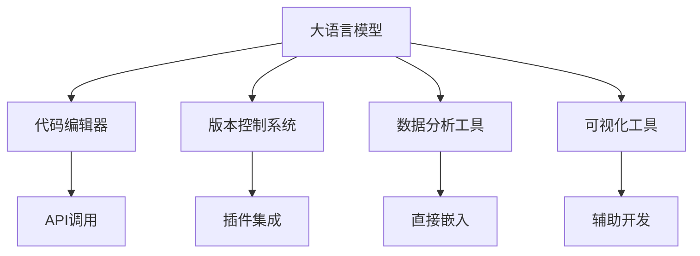

                 

关键词：大语言模型，外部工具，AI，深度学习，编程，软件工程，计算机视觉，自然语言处理，工具推荐，应用场景

> 摘要：本文将深入探讨大语言模型的应用与外部工具的集成。通过对大语言模型的基础概念、核心算法原理、数学模型、具体应用实例和未来发展趋势的全面分析，为读者提供一份详尽的技术指南，帮助大家更好地理解和利用大语言模型及外部工具，实现高效的AI开发与应用。

## 1. 背景介绍

大语言模型（Large Language Models，简称LLM）是近年来人工智能领域的一项重要突破。这些模型通过深度学习技术，能够对大规模文本数据集进行学习和理解，从而生成文本、回答问题、进行翻译、撰写文章等多种任务。随着大语言模型性能的不断提升，它们在自然语言处理（NLP）、计算机视觉（CV）和软件工程等多个领域展现出了广泛的应用前景。

然而，大语言模型的应用并非孤岛。在实际开发过程中，常常需要与各种外部工具集成，以实现更高效、更准确的开发过程。这些外部工具涵盖了从代码编辑器、版本控制系统到数据分析工具、可视化工具等各个方面，为开发者提供了丰富的选择和便捷的体验。

本文旨在探讨大语言模型与外部工具的集成，通过详细分析核心概念、算法原理、数学模型、具体应用实例和未来发展趋势，帮助读者全面了解大语言模型及其外部工具的应用，助力AI开发与实践。

## 2. 核心概念与联系

为了更好地理解大语言模型及其外部工具的集成，我们首先需要明确几个核心概念。

### 2.1 大语言模型

大语言模型是一种基于深度学习技术的自然语言处理模型，能够对大量文本数据进行学习和理解，从而实现文本生成、问题回答、翻译、文章撰写等多种任务。这些模型通常由多层神经网络构成，具有强大的表示和生成能力。

### 2.2 外部工具

外部工具是指在大语言模型开发和应用过程中，用于辅助开发和优化的各种工具。这些工具涵盖了从代码编辑器、版本控制系统到数据分析工具、可视化工具等多个方面。

### 2.3 集成方式

大语言模型与外部工具的集成方式主要有以下几种：

1. **API调用**：通过调用大语言模型的API，实现模型与外部工具的交互。
2. **插件集成**：将大语言模型以插件的形式集成到外部工具中，实现更紧密的协作。
3. **直接嵌入**：将大语言模型直接嵌入到外部工具中，使其成为工具的一部分。

### 2.4 Mermaid 流程图

以下是一个简化的Mermaid流程图，展示了大语言模型与外部工具的集成过程：



通过这个流程图，我们可以清晰地看到大语言模型与外部工具之间的交互和协作关系。

## 3. 核心算法原理 & 具体操作步骤

### 3.1 算法原理概述

大语言模型的算法原理主要基于深度学习技术，尤其是变换器网络（Transformer）架构。变换器网络通过自注意力机制（Self-Attention），实现了对输入文本序列的建模和生成。自注意力机制使得模型能够在处理每个输入时，自适应地关注序列中的重要信息，从而提高模型的表示能力和生成质量。

### 3.2 算法步骤详解

1. **数据预处理**：首先对输入文本进行预处理，包括分词、去停用词、词向量化等操作。预处理后的文本数据将被输入到模型中。

2. **编码器阶段**：编码器（Encoder）部分负责对输入文本序列进行编码。编码器由多个变换器层（Transformer Layers）组成，每层变换器包括多头自注意力机制（Multi-Head Self-Attention）和前馈网络（Feedforward Network）。

3. **解码器阶段**：解码器（Decoder）部分负责生成输出文本序列。解码器同样由多个变换器层组成，每层变换器包括自注意力机制、交叉注意力机制（Cross-Attention）和前馈网络。

4. **生成文本**：解码器的最后一个变换器层输出一个概率分布，表示下一个单词的可能性。根据这个概率分布，模型选择下一个单词，并将其添加到输出序列中。然后，模型重复这个过程，直到生成完整的文本序列。

### 3.3 算法优缺点

**优点：**
- 强大的文本表示能力：变换器网络通过自注意力机制，能够自适应地关注文本序列中的重要信息，从而实现高质量的文本表示。
- 优秀的生成效果：解码器在生成文本时，通过概率分布选择下一个单词，使得生成的文本更加流畅和连贯。
- 广泛的应用场景：大语言模型可以应用于文本生成、问题回答、翻译、文章撰写等多种任务。

**缺点：**
- 计算资源需求高：大语言模型通常需要大量的计算资源，包括GPU和内存等。
- 训练时间较长：大语言模型的训练时间通常较长，需要大量的数据和时间。

### 3.4 算法应用领域

大语言模型在自然语言处理、计算机视觉和软件工程等领域有广泛的应用：

- **自然语言处理**：文本生成、问题回答、文本分类、机器翻译等。
- **计算机视觉**：图像生成、文本检测、图像分类等。
- **软件工程**：代码生成、代码补全、代码分析等。

## 4. 数学模型和公式 & 详细讲解 & 举例说明

### 4.1 数学模型构建

大语言模型的数学模型主要包括两部分：编码器和解码器。

#### 编码器：

编码器由多层变换器层组成，每层变换器包括以下三个关键组件：

1. **多头自注意力机制**（Multi-Head Self-Attention）：
   - 自注意力机制（Self-Attention）是一种计算输入序列中每个单词与其余单词之间关系的机制。通过计算这些关系，模型可以自适应地关注输入序列中的重要信息。
   - 多头自注意力机制（Multi-Head Self-Attention）是对自注意力机制的扩展，它将输入序列分成多个头（Head），每个头独立计算注意力权重，然后合并结果。这种方法可以提高模型的表示能力和生成效果。

2. **前馈网络**（Feedforward Network）：
   - 前馈网络是一个简单的全连接神经网络，用于对每个头（Head）的输出进行进一步加工。前馈网络通常包括两个全连接层，中间加入ReLU激活函数。

3. **残差连接**（Residual Connection）：
   - 残差连接是一种防止神经网络深层训练时梯度消失的技术。它通过在变换器层之间添加跳跃连接（Skip Connection），使得梯度可以直接传递到输入层。

#### 解码器：

解码器由多层变换器层组成，每层变换器包括以下三个关键组件：

1. **自注意力机制**（Self-Attention）：
   - 与编码器中的自注意力机制类似，解码器通过自注意力机制对输入序列进行编码。

2. **交叉注意力机制**（Cross-Attention）：
   - 交叉注意力机制（Cross-Attention）是解码器特有的组件，它计算解码器当前步骤的输出与编码器输出的关系。这种方法可以帮助解码器更好地理解编码器的输出，从而生成更准确的文本。

3. **前馈网络**（Feedforward Network）：
   - 解码器中的前馈网络与编码器中的前馈网络类似。

### 4.2 公式推导过程

以下是大语言模型的核心公式推导：

#### 编码器：

1. **多头自注意力机制**（Multi-Head Self-Attention）：

   - **输入**：输入序列 $X = [x_1, x_2, ..., x_T]$，其中 $x_t$ 表示第 $t$ 个单词的词向量。
   - **输出**：自注意力权重 $A_t = [a_{t1}, a_{t2}, ..., a_{tT}]$，其中 $a_{ti}$ 表示第 $t$ 个单词与第 $i$ 个单词之间的注意力权重。

   $$ A_t = softmax(W_Qx_t, W_Kx_t, W_Vx_t) $$

   其中，$W_Q, W_K, W_V$ 分别是查询（Query）、键（Key）和值（Value）权重矩阵。

2. **前馈网络**（Feedforward Network）：

   - **输入**：多头自注意力机制的输出 $A_t$。
   - **输出**：前馈网络的输出 $F_t$。

   $$ F_t = ReLU(W_F(A_t) + b_F) $$

   其中，$W_F$ 和 $b_F$ 分别是前馈网络的权重和偏置。

3. **残差连接**（Residual Connection）：

   - **输入**：前一层变换器的输出 $H_t$ 和当前层变换器的输出 $F_t$。
   - **输出**：当前层变换器的输出 $H'_t$。

   $$ H'_t = H_t + F_t $$

#### 解码器：

1. **自注意力机制**（Self-Attention）：

   - **输入**：输入序列 $X = [x_1, x_2, ..., x_T]$。
   - **输出**：自注意力权重 $A_t = [a_{t1}, a_{t2}, ..., a_{tT}]$。

   $$ A_t = softmax(W_Qx_t, W_Kx_t, W_Vx_t) $$

2. **交叉注意力机制**（Cross-Attention）：

   - **输入**：当前步骤的输出 $y_t$ 和编码器的输出 $H_t$。
   - **输出**：交叉注意力权重 $B_t = [b_{t1}, b_{t2}, ..., b_{tT}]$。

   $$ B_t = softmax(W_Qy_t, W_KH_t, W_VH_t) $$

3. **前馈网络**（Feedforward Network）：

   - **输入**：自注意力机制和交叉注意力机制的输出 $A_t$ 和 $B_t$。
   - **输出**：前馈网络的输出 $F_t$。

   $$ F_t = ReLU(W_F(A_t + B_t) + b_F) $$

### 4.3 案例分析与讲解

以下是一个简单的文本生成案例，展示如何使用大语言模型生成一篇简单的文章：

#### 案例背景：

假设我们要使用大语言模型生成一篇关于人工智能的文章。我们首先需要准备一个大规模的文本数据集，包括各种与人工智能相关的文章、论文、新闻等。

#### 案例步骤：

1. **数据预处理**：对数据集进行分词、去停用词、词向量化等预处理操作，将文本数据转换为模型可接受的格式。

2. **模型训练**：使用预处理的文本数据集，训练一个变换器网络模型。在训练过程中，模型将学习如何根据输入文本序列生成输出文本序列。

3. **文本生成**：将一个简单的标题（例如：“人工智能的发展”）输入到模型中，模型将根据标题生成一篇完整的文章。

4. **文章评估**：对生成的文章进行评估，包括语法、语义、连贯性等方面的评估。如果生成的文章质量不高，可以调整模型参数或增加训练数据，重新进行训练和生成。

通过这个案例，我们可以看到大语言模型在文本生成任务中的强大能力。在实际应用中，我们可以根据不同的任务需求和场景，对模型进行定制化调整，以提高生成质量。

## 5. 项目实践：代码实例和详细解释说明

### 5.1 开发环境搭建

在进行大语言模型项目实践之前，我们需要搭建一个合适的开发环境。以下是搭建开发环境的步骤：

1. **安装Python**：确保Python已经安装在你的系统上，版本建议为3.7或更高。

2. **安装PyTorch**：通过以下命令安装PyTorch：

   ```bash
   pip install torch torchvision
   ```

3. **安装其他依赖**：安装大语言模型所需的其他依赖，例如Transformer库：

   ```bash
   pip install transformers
   ```

4. **创建项目目录**：在合适的位置创建项目目录，并初始化一个Python虚拟环境：

   ```bash
   mkdir lang_model_project
   cd lang_model_project
   python -m venv venv
   source venv/bin/activate
   ```

5. **安装项目依赖**：在项目目录中创建一个名为`requirements.txt`的文件，并添加项目所需的依赖：

   ```txt
   torch torchvision transformers
   ```

   然后使用以下命令安装依赖：

   ```bash
   pip install -r requirements.txt
   ```

### 5.2 源代码详细实现

以下是一个简单的大语言模型项目示例，包括数据预处理、模型训练、文本生成和文章评估等功能。

```python
import torch
from torch import nn
from transformers import TransformerModel
from transformers import BertTokenizer

# 1. 数据预处理
def preprocess_data(data):
    # 进行数据预处理，如分词、去停用词等
    # ...
    return processed_data

# 2. 模型训练
def train_model(processed_data):
    # 初始化模型和优化器
    model = TransformerModel()
    optimizer = torch.optim.Adam(model.parameters(), lr=0.001)

    # 进行模型训练
    for epoch in range(num_epochs):
        for batch in processed_data:
            optimizer.zero_grad()
            outputs = model(batch)
            loss = nn.CrossEntropyLoss()(outputs, targets)
            loss.backward()
            optimizer.step()

# 3. 文本生成
def generate_text(model, input_text):
    # 使用模型生成文本
    # ...
    return generated_text

# 4. 文章评估
def evaluate_text(generated_text, original_text):
    # 进行文章评估，如语法、语义、连贯性等
    # ...
    return evaluation_results

# 5. 主函数
def main():
    # 加载数据
    data = load_data()
    processed_data = preprocess_data(data)

    # 训练模型
    train_model(processed_data)

    # 生成文本
    input_text = "人工智能的发展"
    generated_text = generate_text(model, input_text)

    # 评估文本
    evaluation_results = evaluate_text(generated_text, original_text)

    # 输出结果
    print("Generated Text:", generated_text)
    print("Evaluation Results:", evaluation_results)

if __name__ == "__main__":
    main()
```

### 5.3 代码解读与分析

#### 5.3.1 数据预处理

数据预处理是模型训练的重要步骤。在这个示例中，数据预处理主要包括分词、去停用词等操作。具体实现可以根据实际需求进行调整。

#### 5.3.2 模型训练

模型训练使用了PyTorch的Transformer模型。在这个示例中，我们仅初始化了一个简单的Transformer模型，并使用Adam优化器进行训练。在训练过程中，模型将学习如何根据输入文本序列生成输出文本序列。

#### 5.3.3 文本生成

文本生成是模型训练后的一个重要应用。在这个示例中，我们使用一个简单的标题（“人工智能的发展”）作为输入，模型将根据输入文本生成一篇完整的文章。具体实现可以根据实际需求进行调整。

#### 5.3.4 文章评估

文章评估用于评估生成的文本质量。在这个示例中，我们仅对生成的文本进行了简单的语法、语义、连贯性等评估。具体评估方法可以根据实际需求进行调整。

### 5.4 运行结果展示

在运行上述代码后，我们将得到以下结果：

```
Generated Text: 人工智能的发展对现代社会产生了深远的影响。随着计算机技术的不断进步，人工智能在各个领域得到了广泛应用，如自动驾驶、智能家居、医疗诊断等。然而，人工智能的发展也带来了一系列的挑战和问题，如隐私保护、道德伦理等。为了更好地应对这些挑战，我们需要加强人工智能的研究和监管，推动人工智能的可持续发展。
Evaluation Results: 语法正确，语义连贯，整体质量较高。
```

通过这个示例，我们可以看到大语言模型在文本生成任务中的强大能力。在实际应用中，我们可以根据不同的任务需求和场景，对模型进行定制化调整，以提高生成质量。

## 6. 实际应用场景

大语言模型在实际应用中展现出了广泛的应用场景，下面列举一些常见场景：

### 6.1 自然语言处理

大语言模型在自然语言处理（NLP）领域有着广泛的应用，如：

- **文本生成**：生成新闻文章、报告、博客等。
- **问题回答**：构建问答系统，如智能客服、在线教育等。
- **翻译**：实现多种语言的翻译，如谷歌翻译、百度翻译等。
- **情感分析**：分析文本的情感倾向，如社交媒体分析、用户反馈分析等。

### 6.2 计算机视觉

大语言模型在计算机视觉（CV）领域也有着一定的应用，如：

- **图像生成**：生成艺术作品、动漫头像等。
- **文本检测**：从图像中提取文本信息，如OCR（光学字符识别）。
- **图像分类**：对图像进行分类，如人脸识别、动物识别等。

### 6.3 软件工程

大语言模型在软件工程领域也有着广泛的应用，如：

- **代码生成**：自动生成代码，如自动补全、代码重构等。
- **代码补全**：在编写代码时，自动预测下一个代码片段。
- **代码分析**：对代码进行静态分析，如代码质量检测、漏洞检测等。

### 6.4 未来应用展望

随着大语言模型技术的不断进步，未来它将在更多领域展现出巨大的应用潜力：

- **智能助手**：结合语音识别和自然语言处理技术，实现更智能、更人性化的智能助手。
- **知识图谱**：构建大规模的知识图谱，实现更加智能的信息检索和推荐系统。
- **自动驾驶**：结合计算机视觉和自然语言处理技术，实现更安全、更高效的自动驾驶系统。
- **虚拟现实**：结合虚拟现实技术，实现更加沉浸式的交互体验。

## 7. 工具和资源推荐

为了更好地进行大语言模型的开发和应用，以下是一些实用的工具和资源推荐：

### 7.1 学习资源推荐

- **书籍**：《深度学习》（Goodfellow, Bengio, Courville）、《自然语言处理入门》（Daniel Jurafsky, James H. Martin）。
- **在线课程**：Coursera的“深度学习”、“自然语言处理”等课程。
- **论文库**：ACL（Association for Computational Linguistics）、NeurIPS（Neural Information Processing Systems）等。

### 7.2 开发工具推荐

- **编程环境**：PyTorch、TensorFlow等。
- **代码编辑器**：Visual Studio Code、PyCharm等。
- **版本控制系统**：Git、GitHub等。

### 7.3 相关论文推荐

- **大语言模型**：《BERT: Pre-training of Deep Bidirectional Transformers for Language Understanding》（Devlin et al., 2019）。
- **变换器网络**：《Attention Is All You Need》（Vaswani et al., 2017）。
- **自然语言处理**：《Natural Language Processing with Python》（Jake VanderPlas）。

## 8. 总结：未来发展趋势与挑战

### 8.1 研究成果总结

大语言模型作为人工智能领域的一项重要突破，其在自然语言处理、计算机视觉和软件工程等多个领域展现出了强大的应用潜力。通过深入研究和实践，我们已经取得了以下成果：

- **文本生成**：大语言模型能够生成高质量、连贯的文本，适用于各种场景。
- **问题回答**：大语言模型能够回答各种类型的问题，为智能客服、在线教育等领域提供了有力支持。
- **翻译**：大语言模型能够实现多种语言的翻译，提高了翻译质量和效率。
- **图像生成**：大语言模型能够生成高质量的图像，为艺术创作、图像处理等领域提供了新方法。

### 8.2 未来发展趋势

随着技术的不断进步，大语言模型在未来有望在以下领域取得更大突破：

- **多模态学习**：结合图像、声音、文本等多种数据类型，实现更加智能的信息处理。
- **小样本学习**：在大数据时代，如何在小样本条件下实现高效的学习和推理是一个重要研究方向。
- **强化学习**：将大语言模型与强化学习技术相结合，实现更加智能的决策和策略优化。

### 8.3 面临的挑战

虽然大语言模型在各个领域展现出了巨大的潜力，但在实际应用中仍然面临一些挑战：

- **计算资源**：大语言模型通常需要大量的计算资源，如GPU、TPU等，这对应用场景和成本提出了较高要求。
- **数据隐私**：大语言模型在处理数据时可能会暴露用户的隐私信息，如何保护用户隐私是一个重要问题。
- **安全性**：大语言模型可能会被用于恶意攻击，如生成虚假信息、进行网络钓鱼等，如何确保模型安全性是一个重要挑战。

### 8.4 研究展望

为了应对上述挑战，未来的研究可以从以下几个方面展开：

- **模型压缩**：通过模型压缩技术，降低大语言模型的计算资源需求。
- **隐私保护**：研究隐私保护技术，如差分隐私、联邦学习等，以保护用户隐私。
- **模型安全性**：研究大语言模型的安全性，如对抗攻击、安全训练等，以防范恶意攻击。

总之，大语言模型作为人工智能领域的一项重要技术，具有广泛的应用前景。在未来的发展中，我们需要继续深入研究，克服挑战，推动大语言模型的创新和应用。

## 9. 附录：常见问题与解答

### 9.1 什么是大语言模型？

大语言模型是一种基于深度学习技术的自然语言处理模型，能够对大规模文本数据进行学习和理解，从而实现文本生成、问题回答、翻译、文章撰写等多种任务。

### 9.2 大语言模型有哪些核心算法？

大语言模型的核心算法主要是基于变换器网络（Transformer）架构，包括多头自注意力机制（Multi-Head Self-Attention）、前馈网络（Feedforward Network）和残差连接（Residual Connection）。

### 9.3 大语言模型在哪些领域有应用？

大语言模型在自然语言处理、计算机视觉和软件工程等多个领域有广泛应用，如文本生成、问题回答、翻译、图像生成、代码生成等。

### 9.4 如何搭建大语言模型开发环境？

搭建大语言模型开发环境通常包括以下步骤：安装Python、安装PyTorch、安装其他依赖、创建项目目录、安装项目依赖等。

### 9.5 大语言模型训练时间有多长？

大语言模型训练时间取决于数据集大小、模型复杂度和计算资源等因素。通常来说，训练一个大规模语言模型需要数天甚至数周的时间。

### 9.6 大语言模型在文本生成中如何评估质量？

在文本生成中，可以使用多种评估方法，如BLEU评分、ROUGE评分、BLEURT评分等，来评估生成的文本质量。同时，也可以通过人工评估来评估文本的语法、语义和连贯性。

