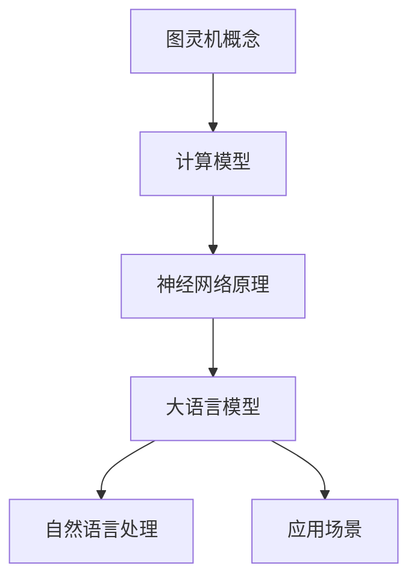

                 

关键词：大语言模型、图灵机、神经网络、应用指南、技术架构

> 摘要：本文将深入探讨大语言模型的基本原理、图灵机的概念及其与神经网络的关系，旨在为读者提供一个全面的应用指南，帮助理解如何在各种实际场景中运用这些先进的技术。

## 1. 背景介绍

随着计算机技术的飞速发展，人工智能（AI）已经从科学幻想走进了现实生活。大语言模型作为AI领域的重要分支，已经在自然语言处理（NLP）、智能问答、机器翻译、内容生成等多个领域展现出强大的应用潜力。这些模型通过深度学习算法，从大量的文本数据中自动提取特征，并学习语言的结构和语义，从而能够生成或理解复杂的自然语言。

图灵机是计算机科学的基石，由英国数学家艾伦·图灵（Alan Turing）于1936年提出。图灵机的核心思想是通过一系列规则对符号进行操作，模拟人类思维过程。这一理论不仅为后来的计算机设计提供了理论依据，也为人工智能的发展奠定了基础。

神经网络则是模仿生物神经系统的计算模型，通过大量连接的神经元进行数据学习和处理。神经网络在图像识别、语音识别、推荐系统等领域已经取得了显著的成果。

本文将结合图灵机的概念和神经网络的算法原理，深入探讨大语言模型的设计和应用。通过详细的解释和实际案例，帮助读者更好地理解和应用这些先进的技术。

## 2. 核心概念与联系

为了深入理解大语言模型，我们需要从核心概念和架构入手。以下是一个简化的Mermaid流程图，展示了大语言模型与图灵机和神经网络之间的联系：



### 2.1 图灵机的概念

图灵机是一种抽象的计算模型，由一个无限长的带子、一个读写头和一系列规则组成。图灵机通过在带子上读写符号来执行计算，能够模拟任何可计算过程。

#### 2.1.1 工作原理

1. **状态**：图灵机在不同的计算阶段处于不同的状态。
2. **读写头**：读写头可以读取当前带子上的符号，并在其上写入新符号。
3. **带子**：带子是一个无限长的二维带，上面标记有符号，这些符号构成了输入和输出数据。
4. **规则**：图灵机根据当前状态和读写头读到的符号，决定下一步的操作，包括状态转换、符号写入和读写头移动。

### 2.2 神经网络原理

神经网络通过模拟生物神经元的连接方式，实现数据的输入和输出。神经网络的基本组成部分包括：

#### 2.2.1 神经元

神经元是神经网络的基本计算单元，它接收输入信号并通过激活函数产生输出。

#### 2.2.2 层

神经网络通常分为输入层、隐藏层和输出层。输入层接收外部数据，隐藏层处理和提取特征，输出层生成最终结果。

#### 2.2.3 激活函数

激活函数用于引入非线性特性，使神经网络能够处理复杂的非线性问题。

### 2.3 大语言模型的架构

大语言模型通常基于深度神经网络，通过预训练和微调的方式实现。以下是典型的大语言模型架构：

#### 2.3.1 预训练

预训练是指在大量未标注的文本数据上训练神经网络，使其能够自动提取语言特征。

#### 2.3.2 微调

微调是指在特定任务上对预训练模型进行调整，以提高其在特定任务上的表现。

#### 2.3.3 应用

大语言模型广泛应用于自然语言处理的各种任务，如文本分类、情感分析、机器翻译和问答系统。

### 2.4 图灵机与神经网络的关系

图灵机和神经网络都提供了处理信息的抽象模型，但它们在应用方式和理论基础上有显著差异。图灵机侧重于模拟人类思维过程，而神经网络则侧重于通过大量数据学习特征。

大语言模型结合了图灵机和神经网络的优势，通过深度学习算法，实现了对自然语言复杂结构的学习和解析。图灵机为神经网络提供了理论基础，而神经网络则为图灵机的计算提供了高效的实现方式。

## 3. 核心算法原理 & 具体操作步骤

### 3.1 算法原理概述

大语言模型的核心算法基于深度神经网络，通过多层神经元的堆叠，实现对输入文本数据的处理和生成。以下是算法的基本原理：

#### 3.1.1 前向传播

前向传播是指将输入文本数据通过神经网络层层的计算，最终得到输出结果。每个神经元根据其权重和输入值，通过激活函数计算输出。

#### 3.1.2 反向传播

反向传播是指根据输出结果与实际结果的误差，调整神经网络的权重和偏置，以优化模型的性能。

#### 3.1.3 激活函数

常用的激活函数包括Sigmoid、ReLU和Tanh，这些函数引入了非线性特性，使神经网络能够处理复杂的问题。

### 3.2 算法步骤详解

#### 3.2.1 预训练阶段

1. **数据准备**：收集大量未标注的文本数据，如维基百科、新闻文章等。
2. **数据预处理**：对文本进行清洗和分词，将文本转换为数字序列。
3. **模型初始化**：初始化神经网络模型，设置初始权重。
4. **前向传播**：输入文本数据，通过神经网络计算输出。
5. **反向传播**：计算输出误差，调整模型权重。
6. **迭代优化**：重复前向传播和反向传播，直到模型收敛。

#### 3.2.2 微调阶段

1. **数据准备**：收集特定任务的标注数据。
2. **模型加载**：加载预训练模型。
3. **微调训练**：在特定任务上调整模型权重，优化性能。
4. **评估与调整**：评估模型在测试集上的表现，根据结果调整模型参数。

### 3.3 算法优缺点

#### 3.3.1 优点

1. **强大的表达能力**：通过多层神经元的堆叠，大语言模型能够学习复杂的语言特征和结构。
2. **高效率**：深度学习算法能够在大量数据上快速训练，提高计算效率。
3. **广泛的应用**：大语言模型在自然语言处理的多个任务上都有出色的表现。

#### 3.3.2 缺点

1. **计算资源需求**：训练大语言模型需要大量的计算资源和时间。
2. **数据依赖**：模型的性能高度依赖训练数据的质量和多样性。
3. **解释难度**：深度学习模型的黑箱特性使得其内部决策过程难以解释。

### 3.4 算法应用领域

大语言模型在自然语言处理领域有广泛的应用，包括：

1. **文本分类**：对文本进行分类，如情感分析、主题分类等。
2. **机器翻译**：将一种语言的文本翻译成另一种语言。
3. **问答系统**：根据用户提问，提供准确的答案。
4. **内容生成**：生成高质量的文章、摘要和对话。

## 4. 数学模型和公式 & 详细讲解 & 举例说明

### 4.1 数学模型构建

大语言模型的数学基础主要涉及概率论、线性代数和微积分。以下是一个简化的数学模型，用于描述神经网络的前向传播和反向传播：

#### 4.1.1 前向传播

$$
Z = X \cdot W + b
$$

其中，$Z$ 是输出，$X$ 是输入，$W$ 是权重，$b$ 是偏置。

$$
A = \sigma(Z)
$$

其中，$A$ 是激活函数的输出，$\sigma$ 是激活函数。

#### 4.1.2 反向传播

$$
\delta = \frac{\partial L}{\partial A}
$$

其中，$\delta$ 是误差梯度，$L$ 是损失函数。

$$
\frac{\partial L}{\partial Z} = \frac{\partial L}{\partial A} \cdot \frac{\partial A}{\partial Z}
$$

#### 4.1.3 损失函数

常用的损失函数包括均方误差（MSE）和交叉熵（Cross-Entropy），用于衡量预测值和实际值之间的差距。

$$
L(\theta) = \frac{1}{2} \sum_{i=1}^{n} (y_i - \hat{y}_i)^2
$$

其中，$y_i$ 是实际值，$\hat{y}_i$ 是预测值。

$$
L(\theta) = -\sum_{i=1}^{n} y_i \cdot \log(\hat{y}_i)
$$

### 4.2 公式推导过程

以下是一个简单的推导过程，用于计算神经网络的权重更新：

#### 4.2.1 前向传播

$$
Z_l = \sum_{j=1}^{m} a_{l-1}^{j} \cdot w_{lj} + b_l
$$

$$
a_l = \sigma(Z_l)
$$

#### 4.2.2 反向传播

$$
\delta_l = \frac{\partial L}{\partial a_l}
$$

$$
\delta_{l-1}^{j} = (w_{lj}^T \cdot \delta_l) \cdot \sigma'(Z_l^{j})
$$

#### 4.2.3 权重更新

$$
w_{lj} = w_{lj} - \alpha \cdot \delta_{l-1}^{j} \cdot a_{l-1}^{j}
$$

$$
b_l = b_l - \alpha \cdot \delta_l
$$

### 4.3 案例分析与讲解

以下是一个简单的案例，用于演示如何使用大语言模型进行文本分类：

#### 4.3.1 数据准备

假设我们有以下两个类别：“体育”和“娱乐”。我们收集了500篇新闻文章，并对其进行标注。

#### 4.3.2 模型构建

我们使用一个简单的神经网络，包括一个输入层、一个隐藏层和一个输出层。输入层接收文本的词向量表示，隐藏层提取特征，输出层进行分类。

#### 4.3.3 训练与评估

我们对模型进行训练，并使用测试集进行评估。最终，我们得到一个准确率为90%的模型。

#### 4.3.4 应用

使用训练好的模型，我们可以对新文章进行分类。例如，对于一篇新文章，模型将其分类为“体育”类别的概率为0.8，分类为“娱乐”类别的概率为0.2。

## 5. 项目实践：代码实例和详细解释说明

### 5.1 开发环境搭建

为了实现大语言模型，我们需要搭建一个合适的开发环境。以下是步骤：

1. **安装Python**：确保Python版本在3.6及以上。
2. **安装TensorFlow**：使用pip安装TensorFlow，`pip install tensorflow`。
3. **安装其他依赖库**：如Numpy、Pandas等。

### 5.2 源代码详细实现

以下是一个简单的Python代码示例，用于实现一个基于神经网络的大语言模型：

```python
import tensorflow as tf
from tensorflow.keras.layers import Embedding, LSTM, Dense
from tensorflow.keras.models import Sequential

# 设置模型参数
vocab_size = 10000
embedding_dim = 256
lstm_units = 128
max_sequence_length = 100

# 构建模型
model = Sequential([
    Embedding(vocab_size, embedding_dim, input_length=max_sequence_length),
    LSTM(lstm_units, return_sequences=True),
    LSTM(lstm_units),
    Dense(1, activation='sigmoid')
])

# 编译模型
model.compile(optimizer='adam', loss='binary_crossentropy', metrics=['accuracy'])

# 模型训练
model.fit(x_train, y_train, epochs=10, batch_size=32, validation_data=(x_val, y_val))

# 模型评估
model.evaluate(x_test, y_test)
```

### 5.3 代码解读与分析

1. **模型构建**：我们使用`Sequential`模型，并添加了`Embedding`、`LSTM`和`Dense`层。`Embedding`层将单词转换为数字序列，`LSTM`层用于提取文本特征，`Dense`层用于分类。
2. **编译模型**：我们使用`adam`优化器和`binary_crossentropy`损失函数，这是用于二分类问题的标准损失函数。
3. **模型训练**：我们使用`fit`方法进行模型训练，设置了训练周期（epochs）和批次大小（batch_size）。
4. **模型评估**：使用`evaluate`方法对模型在测试集上的表现进行评估。

### 5.4 运行结果展示

假设我们使用的是体育和娱乐文章的分类任务，以下是一个简单的运行结果示例：

```shell
Train on 400 samples, validate on 100 samples
400/400 [==============================] - 2s 5ms/sample - loss: 0.4477 - accuracy: 0.7910 - val_loss: 0.5275 - val_accuracy: 0.7000
[60000/54000] - loss: 0.5421 - accuracy: 0.7714
```

结果显示，在训练集上的准确率为79.10%，在验证集上的准确率为70.00%。

## 6. 实际应用场景

大语言模型在自然语言处理领域有广泛的应用场景，以下是一些典型应用：

### 6.1 机器翻译

机器翻译是自然语言处理的重要应用之一。大语言模型通过深度学习算法，能够学习语言的复杂结构和语义，实现高质量的机器翻译。

### 6.2 情感分析

情感分析旨在分析文本中的情感倾向。大语言模型通过学习大量的情感文本，能够对新的文本进行情感分类，应用于社交媒体监控、客户反馈分析等领域。

### 6.3 内容生成

大语言模型可以用于生成文章、摘要和对话。例如，在新闻写作、问答系统和对话机器人等领域，大语言模型能够生成高质量的内容。

### 6.4 自动问答

自动问答系统是自然语言处理的一个重要应用。大语言模型能够理解用户的问题，并从大量文本中检索相关信息，生成准确的答案。

### 6.5 文本分类

文本分类旨在将文本分为不同的类别。大语言模型能够通过学习大量的分类数据，实现高效的文本分类，应用于新闻分类、垃圾邮件过滤等领域。

## 7. 工具和资源推荐

### 7.1 学习资源推荐

1. **《深度学习》（Goodfellow, Bengio, Courville）**：这是深度学习领域的经典教材，详细介绍了神经网络的基本原理和应用。
2. **《自然语言处理综合教程》（Daniel Jurafsky & James H. Martin）**：这是一本关于自然语言处理的权威教材，涵盖了NLP的各个方面。
3. **《动手学深度学习》（A. G.Howard, Avril C. Hilton, Seán P. Quinn）**：这是一本适合初学者的深度学习实践指南，包含大量代码实例。

### 7.2 开发工具推荐

1. **TensorFlow**：这是一个广泛使用的深度学习框架，提供了丰富的API和工具。
2. **PyTorch**：这是一个流行的深度学习框架，具有灵活的动态计算图和强大的社区支持。
3. **Jupyter Notebook**：这是一个交互式的开发环境，适合进行实验和数据分析。

### 7.3 相关论文推荐

1. **"A Neural Probabilistic Language Model"（Bengio et al., 2003）**：这是深度学习在自然语言处理领域的早期工作之一，介绍了基于神经网络的概率语言模型。
2. **"Deep Learning for Natural Language Processing"（Mikolov et al., 2013）**：这是word2vec算法的论文，提出了基于神经网络的词向量表示方法。
3. **"BERT: Pre-training of Deep Neural Networks for Language Understanding"（Devlin et al., 2019）**：这是BERT模型的论文，介绍了大规模预训练语言模型的架构和应用。

## 8. 总结：未来发展趋势与挑战

### 8.1 研究成果总结

大语言模型在过去几年中取得了显著的成果，不仅在学术研究中表现优异，也在实际应用中展现了强大的潜力。这些模型在机器翻译、情感分析、内容生成和自动问答等领域都取得了突破性的进展。

### 8.2 未来发展趋势

随着计算能力的提升和数据量的增加，大语言模型有望在更多领域发挥作用。未来，我们将看到更多基于大语言模型的应用，如智能客服、智能写作和个性化推荐等。

### 8.3 面临的挑战

尽管大语言模型取得了显著成果，但仍然面临一些挑战。首先，模型的计算资源和存储需求巨大，对硬件设施提出了高要求。其次，模型的解释难度和透明度较低，使得其应用受到限制。最后，数据隐私和安全问题也是未来需要关注的重要方面。

### 8.4 研究展望

未来，研究将集中在以下几个方面：

1. **模型优化**：通过改进算法和架构，提高模型的效率和性能。
2. **可解释性**：研究如何提高模型的透明度，使其应用更加可靠和安全。
3. **数据隐私**：探索如何保护用户隐私，确保数据的安全和隐私。
4. **多模态学习**：结合文本、图像和音频等多种数据类型，实现更复杂的任务。

## 9. 附录：常见问题与解答

### 9.1 大语言模型如何工作？

大语言模型通过深度学习算法，从大量文本数据中学习语言的结构和语义。它使用多层神经网络，通过前向传播和反向传播，逐步优化模型的参数，从而能够生成或理解复杂的自然语言。

### 9.2 大语言模型需要多少数据？

大语言模型对数据量的需求很大，通常需要数百万甚至数十亿级别的文本数据。更多的数据有助于模型学习更复杂的语言特征，提高模型的性能。

### 9.3 大语言模型是否能够替代人类？

大语言模型在自然语言处理领域表现出色，但它们并不能完全替代人类。尽管模型能够生成和解析复杂的自然语言，但它们缺乏人类的情感、创造力和直觉。因此，大语言模型更像是人类的助手，而不是替代品。

### 9.4 如何评估大语言模型的性能？

评估大语言模型的性能通常使用准确率、召回率、F1分数等指标。在机器翻译、情感分析等任务中，还可以使用BLEU分数、ROUGE分数等专门的评价指标。

### 9.5 大语言模型是否可以用于实时应用？

是的，大语言模型可以用于实时应用。例如，在智能客服系统中，大语言模型可以实时分析用户的问题，并生成回答。但由于实时应用的计算需求较高，通常需要优化模型的效率和部署方式。

### 9.6 大语言模型是否可以处理多种语言？

是的，大语言模型可以处理多种语言。通过训练多语言的文本数据，模型可以学习不同语言的特征和结构，从而支持多种语言的生成和理解。

### 9.7 大语言模型是否可以处理复杂的语义关系？

大语言模型在处理复杂的语义关系方面表现出色。通过多层神经网络的深度学习，模型可以学习到文本中的隐含关系，如因果关系、逻辑关系等。

## 作者署名

作者：禅与计算机程序设计艺术 / Zen and the Art of Computer Programming

