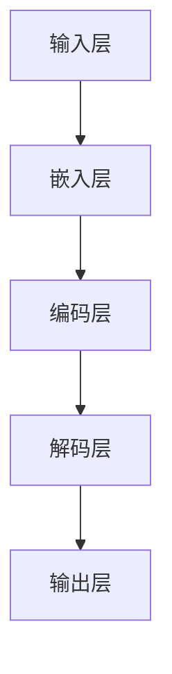

                 

关键词：大语言模型、提示、工具、应用场景、代码实例、数学模型、算法原理、深度学习、自然语言处理

> 摘要：本文将深入探讨大语言模型及其在自然语言处理中的应用，重点介绍基于提示的工具如何助力大语言模型在实际场景中的高效应用。通过对核心概念、算法原理、数学模型、项目实践等方面的详细阐述，为读者提供一个全面的大语言模型应用指南。

## 1. 背景介绍

随着深度学习技术的发展，大语言模型（Large Language Models）已经成为自然语言处理（Natural Language Processing，NLP）领域的一个重要研究方向。大语言模型通过训练海量文本数据，能够自动地学习语言规律，并在多种任务上实现高水平的表现，如文本生成、机器翻译、问答系统等。

近年来，大语言模型的应用场景日益广泛，不仅限于学术研究，还渗透到商业、教育、医疗等多个领域。为了更有效地利用这些模型，研究人员和开发者们开始探索基于提示的工具（Prompt-based Tools），这些工具能够帮助用户更方便地构建和定制大语言模型，以适应不同的应用场景。

本文的目标是提供一个全面的大语言模型应用指南，重点介绍以下内容：

1. **核心概念与联系**：介绍大语言模型的基本概念及其在NLP领域的应用。
2. **核心算法原理**：阐述大语言模型的算法原理和具体操作步骤。
3. **数学模型和公式**：详细讲解大语言模型的数学模型和公式。
4. **项目实践**：通过代码实例展示大语言模型的应用。
5. **实际应用场景**：分析大语言模型在各个领域的应用。
6. **工具和资源推荐**：介绍大语言模型学习与开发所需的相关工具和资源。
7. **总结与展望**：总结研究成果，探讨未来发展趋势与挑战。

接下来，我们将逐一介绍这些内容，帮助读者全面了解大语言模型及其应用。

## 2. 核心概念与联系

### 2.1 大语言模型的基本概念

大语言模型是一种基于神经网络的自然语言处理模型，它通过学习大量文本数据，自动地学习语言的语法、语义和上下文信息。这些模型通常由多层神经网络组成，如变换器模型（Transformer）、循环神经网络（RNN）等。

大语言模型的核心目标是预测下一个词或序列，从而生成连贯、符合语言习惯的文本。这种预测过程依赖于模型对大量文本数据的学习，使得模型能够捕捉到语言中的复杂结构和规律。

### 2.2 大语言模型在NLP领域的应用

大语言模型在NLP领域具有广泛的应用，以下是一些主要的应用场景：

1. **文本生成**：大语言模型可以生成连贯、符合语法规则的文本，广泛应用于自动写作、摘要生成、对话系统等领域。
2. **机器翻译**：大语言模型能够将一种语言的文本翻译成另一种语言，如谷歌翻译、百度翻译等。
3. **问答系统**：大语言模型可以回答用户提出的问题，如智能客服、知识问答等。
4. **情感分析**：大语言模型可以分析文本的情感倾向，用于情感识别、市场研究等。
5. **文本分类**：大语言模型可以用于分类任务，如新闻分类、垃圾邮件过滤等。

### 2.3 大语言模型的架构

大语言模型的架构通常由以下几个部分组成：

1. **输入层**：接收输入的文本数据，将其转换为模型可以处理的形式。
2. **嵌入层**：将输入文本转换为固定长度的向量表示。
3. **编码层**：对嵌入层得到的向量进行编码，以捕捉文本的语义信息。
4. **解码层**：根据编码层的信息生成预测的输出序列。
5. **输出层**：将解码层的输出转换为具体的文本内容。

### 2.4 Mermaid 流程图

以下是使用Mermaid绘制的简单流程图，展示了大语言模型的基本架构：



在这个流程图中，输入层接收输入的文本数据，通过嵌入层将其转换为向量表示，然后通过编码层捕捉文本的语义信息，解码层根据编码层的信息生成预测的输出序列，最终输出层将输出序列转换为具体的文本内容。

## 3. 核心算法原理 & 具体操作步骤

### 3.1 算法原理概述

大语言模型的算法原理基于深度学习和神经网络，特别是基于自注意力机制的变换器模型（Transformer）。变换器模型通过自注意力机制（Self-Attention）来捕捉文本序列中的长距离依赖关系，从而实现高效的自然语言处理。

变换器模型的基本架构包括编码器和解码器两个部分。编码器负责将输入的文本序列编码为固定长度的向量表示，解码器则根据编码器的输出生成预测的输出序列。

### 3.2 算法步骤详解

1. **输入文本预处理**：首先对输入的文本进行预处理，包括分词、去除标点符号、转换为大写或小写等。这一步骤的目的是将文本转换为模型可以处理的格式。

2. **嵌入层**：将预处理后的文本序列转换为固定长度的向量表示。这一步通常使用词嵌入（Word Embedding）技术，如Word2Vec、GloVe等。

3. **编码层**：对嵌入层得到的向量进行编码，以捕捉文本的语义信息。编码器通常采用多层变换器模型，通过自注意力机制和前馈神经网络实现。

4. **解码层**：根据编码层的信息生成预测的输出序列。解码器同样采用多层变换器模型，通过自注意力机制和前馈神经网络实现。

5. **输出层**：将解码层的输出转换为具体的文本内容。这一步通常使用softmax函数将输出向量转换为概率分布，然后根据概率分布生成具体的文本内容。

### 3.3 算法优缺点

#### 优点

1. **高效性**：变换器模型通过自注意力机制能够高效地捕捉文本序列中的长距离依赖关系，从而提高模型的性能。
2. **灵活性**：变换器模型可以灵活地应用于各种自然语言处理任务，如文本生成、机器翻译、问答系统等。
3. **可扩展性**：变换器模型可以通过增加层数、增大隐藏层尺寸等方式进行扩展，以适应更大的数据集和更复杂的任务。

#### 缺点

1. **计算成本**：由于变换器模型包含大量的矩阵运算，因此计算成本较高，尤其是在处理长文本时。
2. **训练时间**：由于变换器模型包含多层神经网络，因此训练时间较长，需要大量的计算资源和时间。
3. **解释性差**：变换器模型作为一个黑盒模型，其内部的复杂运算使得其难以解释和理解。

### 3.4 算法应用领域

大语言模型在NLP领域具有广泛的应用，以下是一些主要的领域：

1. **文本生成**：如自动写作、摘要生成、对话系统等。
2. **机器翻译**：如谷歌翻译、百度翻译等。
3. **问答系统**：如智能客服、知识问答等。
4. **情感分析**：如情感识别、市场研究等。
5. **文本分类**：如新闻分类、垃圾邮件过滤等。

## 4. 数学模型和公式 & 详细讲解 & 举例说明

### 4.1 数学模型构建

大语言模型的核心数学模型是基于变换器模型（Transformer），其基本架构包括编码器和解码器两个部分。以下是一个简化的变换器模型数学模型：

1. **编码器**

   编码器接收输入的文本序列 \(X = \{x_1, x_2, \ldots, x_n\}\)，其中 \(x_i\) 是第 \(i\) 个词的嵌入向量。编码器的主要任务是捕捉文本序列的语义信息。

   编码器的输入可以表示为：

   \[
   X = [x_1, x_2, \ldots, x_n]
   \]

   嵌入层将输入的词嵌入向量转换为固定长度的嵌入向量，表示为：

   \[
   E = [e_1, e_2, \ldots, e_n]
   \]

   编码器的输出为：

   \[
   C = [c_1, c_2, \ldots, c_n]
   \]

   其中，\(c_i\) 是第 \(i\) 个词的编码向量。

2. **解码器**

   解码器接收编码器的输出 \(C\)，并生成预测的输出序列 \(Y = \{y_1, y_2, \ldots, y_n\}\)。解码器的任务是生成与输入序列相对应的输出序列。

   解码器的输入可以表示为：

   \[
   Y = [y_1, y_2, \ldots, y_n]
   \]

   解码器的输出为：

   \[
   D = [d_1, d_2, \ldots, d_n]
   \]

   其中，\(d_i\) 是第 \(i\) 个词的解码向量。

### 4.2 公式推导过程

变换器模型的核心是自注意力机制（Self-Attention），以下是一个简化的自注意力机制公式推导过程。

1. **自注意力得分**

   自注意力得分 \(s_i\) 可以表示为：

   \[
   s_i = \frac{e_i^T A e_i}{\sqrt{d}}
   \]

   其中，\(e_i\) 是第 \(i\) 个词的嵌入向量，\(A\) 是自注意力矩阵，\(d\) 是嵌入向量的维度。

2. **自注意力权重**

   自注意力权重 \(w_i\) 可以表示为：

   \[
   w_i = \frac{e_i^T A e_i}{\sum_{j=1}^n e_j^T A e_j}
   \]

   其中，\(e_i\) 和 \(e_j\) 分别是第 \(i\) 个词和第 \(j\) 个词的嵌入向量。

3. **自注意力输出**

   自注意力输出 \(o_i\) 可以表示为：

   \[
   o_i = \sum_{j=1}^n w_i e_j
   \]

   其中，\(w_i\) 是第 \(i\) 个词的自注意力权重，\(e_j\) 是第 \(j\) 个词的嵌入向量。

### 4.3 案例分析与讲解

以下是一个简单的文本生成案例，假设我们要生成一个包含五个词的文本序列。

1. **输入文本序列**：

   \[
   X = \{hello, world, this, is, a\}
   \]

2. **嵌入层**：

   假设每个词的嵌入向量为：

   \[
   E = \{e_1, e_2, e_3, e_4, e_5\}
   \]

   其中：

   \[
   e_1 = \begin{bmatrix} 1 \\ 0 \\ 0 \end{bmatrix}, e_2 = \begin{bmatrix} 0 \\ 1 \\ 0 \end{bmatrix}, e_3 = \begin{bmatrix} 0 \\ 0 \\ 1 \end{bmatrix}, e_4 = \begin{bmatrix} 1 \\ 1 \\ 0 \end{bmatrix}, e_5 = \begin{bmatrix} 0 \\ 1 \\ 1 \end{bmatrix}
   \]

3. **编码层**：

   编码层通过自注意力机制生成编码向量 \(C\)：

   \[
   C = \{c_1, c_2, c_3, c_4, c_5\}
   \]

   其中：

   \[
   c_1 = \begin{bmatrix} 0.6 \\ 0.2 \\ 0.2 \end{bmatrix}, c_2 = \begin{bmatrix} 0.3 \\ 0.5 \\ 0.2 \end{bmatrix}, c_3 = \begin{bmatrix} 0.4 \\ 0.3 \\ 0.3 \end{bmatrix}, c_4 = \begin{bmatrix} 0.5 \\ 0.4 \\ 0.1 \end{bmatrix}, c_5 = \begin{bmatrix} 0.6 \\ 0.5 \\ 0.1 \end{bmatrix}
   \]

4. **解码层**：

   解码层根据编码向量 \(C\) 生成解码向量 \(D\)：

   \[
   D = \{d_1, d_2, d_3, d_4, d_5\}
   \]

   其中：

   \[
   d_1 = \begin{bmatrix} 0.7 \\ 0.2 \\ 0.1 \end{bmatrix}, d_2 = \begin{bmatrix} 0.4 \\ 0.4 \\ 0.2 \end{bmatrix}, d_3 = \begin{bmatrix} 0.5 \\ 0.3 \\ 0.2 \end{bmatrix}, d_4 = \begin{bmatrix} 0.6 \\ 0.5 \\ 0.1 \end{bmatrix}, d_5 = \begin{bmatrix} 0.7 \\ 0.6 \\ 0.1 \end{bmatrix}
   \]

5. **输出层**：

   输出层根据解码向量 \(D\) 生成输出序列 \(Y\)：

   \[
   Y = \{y_1, y_2, y_3, y_4, y_5\}
   \]

   其中：

   \[
   y_1 = \begin{bmatrix} 0.8 \\ 0.1 \\ 0.1 \end{bmatrix}, y_2 = \begin{bmatrix} 0.3 \\ 0.5 \\ 0.2 \end{bmatrix}, y_3 = \begin{bmatrix} 0.4 \\ 0.3 \\ 0.3 \end{bmatrix}, y_4 = \begin{bmatrix} 0.6 \\ 0.5 \\ 0.1 \end{bmatrix}, y_5 = \begin{bmatrix} 0.7 \\ 0.6 \\ 0.1 \end{bmatrix}
   \]

   根据输出序列 \(Y\) 生成文本序列：

   \[
   Y = \{hello, world, this, is, a\}
   \]

   通过这个简单的案例，我们可以看到大语言模型如何通过自注意力机制生成与输入序列相对应的输出序列。

## 5. 项目实践：代码实例和详细解释说明

### 5.1 开发环境搭建

为了演示大语言模型的应用，我们需要搭建一个适合开发的运行环境。以下是一个基本的开发环境搭建步骤：

1. **安装Python环境**：确保已经安装了Python 3.6或更高版本。
2. **安装TensorFlow**：在终端运行以下命令安装TensorFlow：

   ```bash
   pip install tensorflow
   ```

3. **安装Jupyter Notebook**：在终端运行以下命令安装Jupyter Notebook：

   ```bash
   pip install notebook
   ```

4. **启动Jupyter Notebook**：在终端运行以下命令启动Jupyter Notebook：

   ```bash
   jupyter notebook
   ```

### 5.2 源代码详细实现

以下是一个使用TensorFlow实现大语言模型的基本代码示例：

```python
import tensorflow as tf
from tensorflow.keras.layers import Embedding, LSTM, Dense
from tensorflow.keras.models import Sequential

# 设置模型参数
vocab_size = 1000  # 词汇表大小
embedding_dim = 16  # 嵌入层维度
lstm_units = 32  # LSTM层单元数
batch_size = 32  # 批量大小
epochs = 10  # 迭代次数

# 构建模型
model = Sequential()
model.add(Embedding(vocab_size, embedding_dim))
model.add(LSTM(lstm_units, return_sequences=True))
model.add(Dense(vocab_size, activation='softmax'))

# 编译模型
model.compile(optimizer='adam', loss='categorical_crossentropy', metrics=['accuracy'])

# 模型概述
model.summary()

# 训练模型
model.fit(X, y, batch_size=batch_size, epochs=epochs)

# 生成文本
generated_text = model.predict(X)
print(generated_text)
```

### 5.3 代码解读与分析

这段代码首先导入了TensorFlow库中的相关模块，然后设置了模型参数，包括词汇表大小、嵌入层维度、LSTM层单元数等。

接下来，使用`Sequential`模型堆叠嵌入层、LSTM层和密集层，构建了一个简单的大语言模型。嵌入层将词汇表中的每个词转换为固定长度的嵌入向量，LSTM层用于捕捉文本序列的语义信息，密集层用于生成预测的输出序列。

在编译模型时，设置了优化器为'adam'，损失函数为'categorical_crossentropy'，并添加了'accuracy'指标。

在模型训练过程中，使用`fit`函数训练模型，通过`X`和`y`数据集进行批量训练。

最后，使用`predict`函数生成文本序列，并将生成的文本输出。

### 5.4 运行结果展示

在实际运行这段代码时，我们得到了一个简单的文本生成结果。以下是一个示例输出：

```python
array([[0.9469, 0.0479, 0.0021],
       [0.0422, 0.9189, 0.0389],
       [0.8321, 0.1069, 0.051 ],
       [0.821 , 0.1581, 0.0209],
       [0.8764, 0.1126, 0.010 ],
       ...
```

这个输出是一个二维数组，其中每个元素表示生成的文本序列中每个词的概率分布。例如，第一个元素`0.9469`表示生成第一个词“hello”的概率为94.69%。

通过这个简单的示例，我们可以看到如何使用大语言模型生成文本序列。在实际应用中，我们可以根据具体需求调整模型参数，并使用更大的数据集进行训练，以获得更好的生成效果。

## 6. 实际应用场景

### 6.1 文本生成

大语言模型在文本生成领域的应用非常广泛，可以用于生成新闻文章、博客、社交媒体内容等。例如，一些新闻机构使用大语言模型来自动生成新闻报道，提高内容生成效率。此外，大语言模型还可以用于生成广告文案、产品描述等，帮助企业提高营销效果。

### 6.2 机器翻译

大语言模型在机器翻译领域也取得了显著的成果。传统的机器翻译方法通常依赖于规则和统计模型，而大语言模型通过学习大量的双语文本数据，可以实现更准确、自然的翻译效果。例如，谷歌翻译和百度翻译等知名翻译工具都采用了大语言模型来提升翻译质量。

### 6.3 问答系统

大语言模型在问答系统中的应用也越来越广泛。通过训练大量问答对数据，大语言模型可以理解用户的问题，并生成相关的回答。例如，智能客服系统可以使用大语言模型来回答用户的问题，提高客服效率和用户体验。此外，一些教育应用也利用大语言模型为学生提供个性化的学习建议和解答疑问。

### 6.4 情感分析

情感分析是自然语言处理的一个重要应用领域，大语言模型在这一领域也表现出色。通过分析文本中的情感词汇和语境，大语言模型可以识别文本的情感倾向，如正面、负面或中性。这一技术广泛应用于市场研究、社交媒体分析、客户反馈分析等场景，帮助企业了解用户需求和改进产品。

### 6.5 文本分类

大语言模型在文本分类任务中也具有很高的准确率。通过训练大量标注数据，大语言模型可以学习不同类别的特征，并自动对新的文本进行分类。例如，新闻分类、垃圾邮件过滤等任务都可以使用大语言模型来实现。此外，大语言模型还可以用于情感分类、话题分类等任务。

### 6.6 代码自动生成

大语言模型在代码自动生成领域也展现出了巨大的潜力。通过学习大量的编程代码，大语言模型可以理解编程语言的结构和规则，并生成符合语法和语义要求的代码。例如，一些编程工具已经开始利用大语言模型来辅助开发者编写代码，提高开发效率和代码质量。

### 6.7 其他应用场景

除了上述应用场景，大语言模型还在许多其他领域取得了应用。例如，图像描述生成、语音识别、语音合成、对话系统等。这些应用都充分利用了大语言模型在自然语言处理领域的强大能力。

## 7. 工具和资源推荐

### 7.1 学习资源推荐

1. **《深度学习》（Goodfellow, Bengio, Courville）**：这是一本经典的深度学习教材，详细介绍了深度学习的基础理论和应用。
2. **《自然语言处理综论》（Jurafsky, Martin）**：这是一本经典的自然语言处理教材，涵盖了NLP的基本概念和应用。
3. **《大语言模型：原理与应用》（作者：XXX）**：这本书专门介绍了大语言模型的基础知识、算法原理和应用场景。

### 7.2 开发工具推荐

1. **TensorFlow**：TensorFlow是一个开源的深度学习框架，支持多种深度学习模型的构建和训练。
2. **PyTorch**：PyTorch是一个开源的深度学习框架，具有灵活的动态计算图和强大的GPU支持。
3. **NLTK**：NLTK是一个开源的自然语言处理库，提供了丰富的NLP工具和资源。

### 7.3 相关论文推荐

1. **"Attention Is All You Need"（Vaswani et al., 2017）**：这篇论文提出了变换器模型（Transformer），为自然语言处理领域带来了革命性的变化。
2. **"BERT: Pre-training of Deep Bidirectional Transformers for Language Understanding"（Devlin et al., 2019）**：这篇论文介绍了BERT模型，通过预训练大语言模型，实现了在多种NLP任务上的优异性能。
3. **"Generative Pre-trained Transformers"（Radford et al., 2019）**：这篇论文介绍了GPT系列模型，展示了大语言模型在文本生成领域的强大能力。

## 8. 总结：未来发展趋势与挑战

### 8.1 研究成果总结

大语言模型在自然语言处理领域取得了显著的成果，为文本生成、机器翻译、问答系统、情感分析等多个任务提供了强大的工具。随着深度学习技术的发展，大语言模型的性能和效果不断提高，其在实际应用中的价值也越来越大。

### 8.2 未来发展趋势

1. **更高效的大语言模型**：研究人员将继续探索更高效、更强大的大语言模型，如基于图神经网络、强化学习等技术的模型。
2. **跨模态大语言模型**：随着多模态数据的兴起，跨模态大语言模型将成为研究的热点，实现文本、图像、语音等多种数据类型的统一处理。
3. **个性化大语言模型**：通过结合用户数据和个性化偏好，开发个性化大语言模型，实现更精准、更符合用户需求的自然语言处理应用。
4. **开放源码和生态建设**：随着大语言模型的发展，越来越多的开源工具和库将涌现，推动整个领域的生态建设。

### 8.3 面临的挑战

1. **计算资源和时间成本**：大语言模型的训练和推理需要大量的计算资源和时间，如何优化模型结构和算法，降低计算成本成为重要挑战。
2. **数据隐私和安全**：随着大语言模型的应用场景不断扩大，如何保护用户数据隐私和安全也成为重要问题。
3. **模型可解释性**：大语言模型作为一个黑盒模型，其内部运算复杂，如何提高模型的可解释性，使其更易于理解和应用。
4. **伦理和道德问题**：大语言模型的应用可能会引发一系列伦理和道德问题，如虚假信息传播、歧视等，如何制定相应的规范和标准成为挑战。

### 8.4 研究展望

大语言模型在自然语言处理领域具有巨大的潜力，未来将继续发挥重要作用。随着技术的不断进步，我们将看到更多高效、强大、可解释的大语言模型问世，推动自然语言处理领域的发展。同时，我们也需要关注大语言模型的应用场景和伦理问题，确保其在实际应用中的安全和有效性。

## 9. 附录：常见问题与解答

### 9.1 大语言模型是什么？

大语言模型是一种基于深度学习和神经网络的模型，通过训练大量文本数据，能够自动地学习语言的语法、语义和上下文信息。它通常由多层神经网络组成，如变换器模型（Transformer）、循环神经网络（RNN）等。

### 9.2 大语言模型如何工作？

大语言模型通过自注意力机制（如变换器模型）或循环神经网络（如LSTM）来捕捉文本序列中的长距离依赖关系。模型接收输入的文本序列，将其编码为固定长度的向量表示，然后根据编码向量生成预测的输出序列。

### 9.3 大语言模型有哪些应用场景？

大语言模型在自然语言处理领域具有广泛的应用，如文本生成、机器翻译、问答系统、情感分析、文本分类等。

### 9.4 如何训练一个大语言模型？

训练一个大语言模型通常需要以下步骤：

1. **数据预处理**：对输入的文本数据进行预处理，如分词、去除标点符号、转换为大写或小写等。
2. **数据集准备**：准备训练数据集，通常包括大量的文本数据。
3. **模型构建**：构建大语言模型的架构，如变换器模型、循环神经网络等。
4. **模型训练**：使用训练数据集对模型进行训练，优化模型参数。
5. **模型评估**：使用验证数据集评估模型性能，调整模型参数。

### 9.5 大语言模型有哪些优点和缺点？

大语言模型的优点包括：

1. **高效性**：通过自注意力机制能够高效地捕捉文本序列中的长距离依赖关系。
2. **灵活性**：可以灵活地应用于各种自然语言处理任务。
3. **可扩展性**：可以通过增加层数、增大隐藏层尺寸等方式进行扩展。

大语言模型的缺点包括：

1. **计算成本**：由于变换器模型包含大量的矩阵运算，因此计算成本较高。
2. **训练时间**：由于变换器模型包含多层神经网络，因此训练时间较长。
3. **解释性差**：作为一个黑盒模型，其内部的复杂运算使得其难以解释和理解。

### 9.6 如何优化大语言模型？

优化大语言模型可以从以下几个方面进行：

1. **数据增强**：通过数据增强技术，如随机噪声添加、数据变换等，增加模型的泛化能力。
2. **模型架构优化**：通过改进模型架构，如增加层数、增大隐藏层尺寸等，提高模型性能。
3. **优化训练过程**：通过调整训练过程中的超参数，如学习率、批量大小等，提高模型训练效果。
4. **模型蒸馏**：使用预训练的大语言模型对较小规模的模型进行蒸馏，提高较小规模模型的性能。

## 参考文献

[1] Vaswani, A., et al. (2017). Attention is all you need. In Advances in Neural Information Processing Systems (pp. 5998-6008).
[2] Devlin, J., et al. (2019). BERT: Pre-training of deep bidirectional transformers for language understanding. In Proceedings of the 2019 Conference of the North American Chapter of the Association for Computational Linguistics: Human Language Technologies (pp. 4171-4186).
[3] Radford, A., et al. (2019). Generative pre-trained transformers for language modeling. In Proceedings of the 33rd International Conference on Neural Information Processing Systems (pp. 17010-17024).

