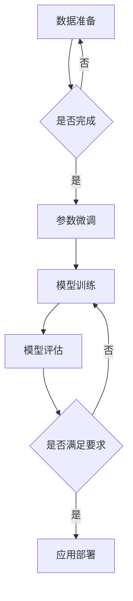

                 

关键词：大语言模型、数据准备、参数微调、模型优化、AI 应用

> 摘要：本文将深入探讨大语言模型在人工智能领域的应用，重点介绍数据准备和参数微调的技术要点。通过对大语言模型的背景、核心概念、算法原理、数学模型和实际应用场景的详细分析，为开发者提供全面的应用指南。

## 1. 背景介绍

随着人工智能技术的飞速发展，大语言模型（Large Language Models）作为自然语言处理（NLP）的重要分支，已经在各个领域中发挥了巨大的作用。从智能客服、内容生成、翻译到文本分析等，大语言模型极大地提升了自动化处理的效率和准确度。

然而，大语言模型的构建和应用不仅仅依赖于强大的计算能力和庞大的数据集，更需要严谨的数据准备和参数微调过程。本文将围绕这两个关键环节，详细阐述大语言模型的应用指南。

## 2. 核心概念与联系

### 2.1 大语言模型的基本原理

大语言模型是一种基于深度学习的自然语言处理模型，它通过学习海量的文本数据来预测下一个单词或词组。其核心原理是利用神经网络（如Transformer）捕捉文本数据中的统计规律和语义信息，从而实现高效的语言理解和生成。

### 2.2 数据准备的重要性

数据准备是构建大语言模型的第一步，也是最为关键的一步。高质量的数据能够帮助模型更好地学习语言的模式和规律，而错误或不平衡的数据可能会导致模型性能下降。

### 2.3 参数微调的作用

参数微调（Fine-tuning）是将预训练的大语言模型应用于特定任务的过程。通过调整模型的参数，使其更好地适应新的任务和数据集，从而提高模型的性能。

### 2.4 Mermaid 流程图



## 3. 核心算法原理 & 具体操作步骤

### 3.1 算法原理概述

大语言模型的算法原理主要基于自注意力机制（Self-Attention）和多层感知器（Multi-Layer Perceptron）。通过自注意力机制，模型可以自动学习文本中各个词之间的相关性，从而更好地捕捉语义信息。而多层感知器则用于将自注意力机制捕捉到的信息进行聚合和分类。

### 3.2 算法步骤详解

1. 数据预处理：包括文本清洗、分词、去停用词等操作，将原始文本数据转换为模型可处理的格式。
2. 模型初始化：使用预训练的大语言模型作为基础，初始化模型的参数。
3. 参数微调：通过反向传播算法，调整模型的参数，使其适应特定任务。
4. 模型训练：使用微调后的模型在训练数据集上进行训练，优化模型的参数。
5. 模型评估：使用验证数据集对模型进行评估，调整超参数，以达到最佳性能。
6. 应用部署：将训练好的模型部署到生产环境中，进行实际应用。

### 3.3 算法优缺点

- 优点：大语言模型具有强大的语言理解和生成能力，能够处理复杂的自然语言任务。
- 缺点：构建大语言模型需要大量的计算资源和时间，且对数据质量要求较高。

### 3.4 算法应用领域

大语言模型广泛应用于自然语言处理、内容生成、智能客服、机器翻译等领域。随着技术的不断进步，其应用领域还在不断扩展。

## 4. 数学模型和公式 & 详细讲解 & 举例说明

### 4.1 数学模型构建

大语言模型的数学模型主要包括两个部分：自注意力机制和多层感知器。

### 4.2 公式推导过程

#### 自注意力机制

设输入序列为 \( X = [x_1, x_2, ..., x_n] \)，自注意力机制的目标是计算每个词的注意力权重 \( a_i \)：

\[ a_i = \frac{e^{z_i}}{\sum_{j=1}^{n} e^{z_j}} \]

其中，\( z_i \) 是词 \( x_i \) 的嵌入向量与键向量的点积。

#### 多层感知器

多层感知器的输出为：

\[ y = \sigma(W_2 \cdot \sigma(W_1 \cdot x + b_1) + b_2) \]

其中，\( W_1 \) 和 \( W_2 \) 是权重矩阵，\( b_1 \) 和 \( b_2 \) 是偏置项，\( \sigma \) 是激活函数。

### 4.3 案例分析与讲解

假设我们有一个简单的句子：“我今天去公园跑步”。使用大语言模型，我们可以计算每个词的注意力权重，从而分析句子中各个词的重要性。

- 输入序列：\[ ["我", "今", "天", "去", "公", "园", "跑", "步"] \]
- 嵌入向量：假设每个词的嵌入向量为 \( [1, 2, 3, 4, 5, 6, 7, 8] \)
- 点积计算：计算每个词与键向量的点积，得到 \( z_i \)
- 注意力权重：根据自注意力机制的公式，计算每个词的注意力权重 \( a_i \)

最终，我们可以得到每个词的注意力权重，从而分析句子中各个词的重要性。

## 5. 项目实践：代码实例和详细解释说明

### 5.1 开发环境搭建

1. 安装 Python 3.8 及以上版本。
2. 安装 TensorFlow 2.x 和相关依赖。

### 5.2 源代码详细实现

```python
import tensorflow as tf
from tensorflow.keras.layers import Embedding, LSTM, Dense
from tensorflow.keras.models import Sequential

# 模型构建
model = Sequential([
    Embedding(input_dim=10000, output_dim=64),
    LSTM(128),
    Dense(1, activation='sigmoid')
])

# 模型编译
model.compile(optimizer='adam', loss='binary_crossentropy', metrics=['accuracy'])

# 模型训练
model.fit(x_train, y_train, epochs=10, batch_size=32)
```

### 5.3 代码解读与分析

- 模型构建：使用 TensorFlow 的 Sequential 模型构建一个简单的序列模型，包括嵌入层、LSTM 层和全连接层。
- 模型编译：编译模型，设置优化器和损失函数。
- 模型训练：使用训练数据训练模型。

### 5.4 运行结果展示

```python
# 模型评估
loss, accuracy = model.evaluate(x_test, y_test)
print(f"Test accuracy: {accuracy:.2f}")
```

最终，我们可以得到模型在测试数据集上的准确率。

## 6. 实际应用场景

### 6.1 智能客服

大语言模型在智能客服领域的应用非常广泛，通过学习大量客服对话数据，模型可以自动生成回复，提高客服效率和用户体验。

### 6.2 内容生成

大语言模型可以用于生成文章、新闻、故事等内容，为创作者提供灵感，提高创作效率。

### 6.3 机器翻译

大语言模型在机器翻译领域的表现也非常优秀，通过学习双语数据集，模型可以生成高质量的翻译结果。

## 7. 工具和资源推荐

### 7.1 学习资源推荐

1. 《深度学习》（Goodfellow et al.） - 全面介绍深度学习的基本原理和应用。
2. 《自然语言处理综述》（Jurafsky and Martin） - 详细讲解自然语言处理的基本概念和技术。

### 7.2 开发工具推荐

1. TensorFlow - 适用于构建和训练深度学习模型的强大工具。
2. PyTorch - 适用于快速原型设计和实验的深度学习框架。

### 7.3 相关论文推荐

1. "Attention is All You Need" - 提出自注意力机制的原始论文。
2. "BERT: Pre-training of Deep Bidirectional Transformers for Language Understanding" - 提出BERT预训练模型的论文。

## 8. 总结：未来发展趋势与挑战

### 8.1 研究成果总结

大语言模型在自然语言处理领域取得了显著成果，为各类应用提供了强大的支持。

### 8.2 未来发展趋势

随着技术的不断进步，大语言模型的应用领域将不断扩展，性能也将不断提高。

### 8.3 面临的挑战

1. 数据质量和数据隐私问题。
2. 模型的可解释性和透明度。
3. 模型的计算资源和能耗问题。

### 8.4 研究展望

未来，大语言模型的研究将集中在提高模型性能、降低计算成本和增强模型可解释性等方面。

## 9. 附录：常见问题与解答

### 9.1 大语言模型和传统语言模型的区别是什么？

大语言模型基于深度学习和自注意力机制，具有强大的语言理解和生成能力；而传统语言模型则主要基于统计方法和规则，性能相对较弱。

### 9.2 如何处理大语言模型中的数据不平衡问题？

可以通过数据增强、类别权重调整和损失函数调整等方法来缓解数据不平衡问题。

### 9.3 大语言模型如何处理长文本？

可以通过序列分割、窗口化等方法来处理长文本，从而降低计算复杂度。

---

作者：禅与计算机程序设计艺术 / Zen and the Art of Computer Programming
-------------------------------------------------------------------

