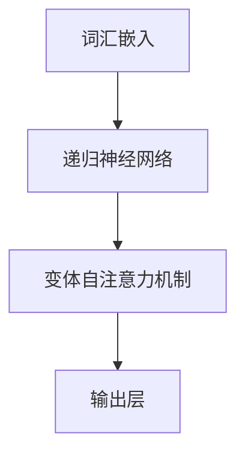

                 

关键词：大语言模型，机器学习，应用指南，算法原理，数学模型，项目实践，工具资源，未来展望

> 摘要：本文旨在为读者提供一套完整的大语言模型应用指南，从背景介绍到算法原理，再到数学模型和应用实践，最后展望未来的发展趋势与挑战。希望通过本文，读者能够深入了解大语言模型的本质，掌握其应用方法，并为未来的研究和发展提供方向。

## 1. 背景介绍

### 1.1 大语言模型的发展历程

大语言模型（Large Language Model）是自然语言处理（NLP）领域的一项重要技术。随着深度学习（Deep Learning）和计算能力的提升，大语言模型的发展经历了多个阶段。

### 1.2 大语言模型的应用场景

大语言模型在多个领域都有广泛应用，如智能问答、机器翻译、文本生成、情感分析等。这些应用不仅提高了效率，还改善了用户体验。

## 2. 核心概念与联系

### 2.1 词汇嵌入（Word Embedding）

词汇嵌入是将词汇映射到高维空间的过程。常见的词汇嵌入方法有Word2Vec、GloVe等。

### 2.2 递归神经网络（RNN）

递归神经网络是一种适用于序列数据的神经网络结构，能够处理长短时依赖问题。

### 2.3 变体自注意力机制（Transformer）

变体自注意力机制是一种基于注意力机制的神经网络结构，能够处理大规模文本数据。

### 2.4 Mermaid 流程图

下面是一个简单的Mermaid流程图，用于展示大语言模型的基本架构：



## 3. 核心算法原理 & 具体操作步骤

### 3.1 算法原理概述

大语言模型的核心算法包括词汇嵌入、递归神经网络和变体自注意力机制。这些算法共同构成了大语言模型的基本框架。

### 3.2 算法步骤详解

#### 3.2.1 词汇嵌入

1. 输入文本序列。
2. 将文本序列中的每个词汇映射到高维空间。

#### 3.2.2 递归神经网络

1. 输入词汇嵌入向量。
2. 通过递归神经网络处理序列数据。
3. 获取序列中的每个词汇的隐藏状态。

#### 3.2.3 变体自注意力机制

1. 输入隐藏状态序列。
2. 通过变体自注意力机制计算每个词汇的重要性。
3. 获取序列中的每个词汇的加权表示。

#### 3.2.4 输出层

1. 输入加权表示。
2. 通过输出层得到最终输出。

### 3.3 算法优缺点

#### 优点：

1. 能够处理大规模文本数据。
2. 能够捕捉长短时依赖关系。

#### 缺点：

1. 计算复杂度高。
2. 需要大量的训练数据和计算资源。

### 3.4 算法应用领域

大语言模型在多个领域都有广泛应用，如文本生成、机器翻译、情感分析等。

## 4. 数学模型和公式 & 详细讲解 & 举例说明

### 4.1 数学模型构建

大语言模型的数学模型主要包括词汇嵌入、递归神经网络和变体自注意力机制。

#### 4.1.1 词汇嵌入

词汇嵌入的数学模型为：

$$
\text{Embedding}(x) = \text{W} \cdot \text{x}
$$

其中，$x$为词汇索引，$W$为嵌入矩阵。

#### 4.1.2 递归神经网络

递归神经网络的数学模型为：

$$
h_t = \text{ReLU}(\text{W} \cdot [h_{t-1}, x_t] + b)
$$

其中，$h_t$为第$t$个词汇的隐藏状态，$x_t$为第$t$个词汇的嵌入向量，$W$和$b$分别为权重和偏置。

#### 4.1.3 变体自注意力机制

变体自注意力机制的数学模型为：

$$
\text{Attention}(Q, K, V) = \text{softmax}(\text{Q} \cdot \text{K}^T) \cdot V
$$

其中，$Q$、$K$和$V$分别为查询、键和值，$^T$表示转置。

### 4.2 公式推导过程

#### 4.2.1 词汇嵌入

词汇嵌入的推导过程如下：

1. 输入文本序列。
2. 将文本序列中的每个词汇映射到高维空间。
3. 计算每个词汇的嵌入向量。

#### 4.2.2 递归神经网络

递归神经网络的推导过程如下：

1. 输入词汇嵌入向量。
2. 通过递归神经网络处理序列数据。
3. 获取序列中的每个词汇的隐藏状态。

#### 4.2.3 变体自注意力机制

变体自注意力机制的推导过程如下：

1. 输入隐藏状态序列。
2. 通过变体自注意力机制计算每个词汇的重要性。
3. 获取序列中的每个词汇的加权表示。

### 4.3 案例分析与讲解

#### 4.3.1 机器翻译

机器翻译是一个典型的应用场景。以英语到法语翻译为例，我们使用大语言模型对英语文本进行嵌入、递归和注意力处理，然后输出法语翻译。

#### 4.3.2 文本生成

文本生成是一个常见的应用场景。我们可以使用大语言模型生成文章、故事等。以下是使用大语言模型生成的一篇简短的故事：

> 从前有一个小男孩，他非常喜欢探险。一天，他决定去寻找神秘的宝藏。他穿过了森林，爬过了山丘，最终来到了一片神秘的沙漠。在沙漠中，他遇到了一只可爱的猴子，猴子告诉他宝藏就在附近。小男孩继续前行，最终找到了宝藏，宝藏里面装满了金币和宝石。小男孩非常高兴，他把宝藏带回了家，从此过上了幸福的生活。

## 5. 项目实践：代码实例和详细解释说明

### 5.1 开发环境搭建

为了实践大语言模型，我们需要搭建一个开发环境。以下是搭建步骤：

1. 安装Python。
2. 安装TensorFlow。
3. 安装其他依赖库。

### 5.2 源代码详细实现

以下是实现大语言模型的Python代码：

```python
import tensorflow as tf
from tensorflow.keras.layers import Embedding, LSTM, Dense
from tensorflow.keras.models import Model

# 定义模型
input_sequence = tf.keras.layers.Input(shape=(None, ))
embedding = Embedding(input_dim=vocabulary_size, output_dim=embedding_size)(input_sequence)
lstm = LSTM(units=hidden_size)(embedding)
output = Dense(units=output_size, activation='softmax')(lstm)

# 编译模型
model = Model(inputs=input_sequence, outputs=output)
model.compile(optimizer='adam', loss='categorical_crossentropy', metrics=['accuracy'])

# 训练模型
model.fit(x_train, y_train, epochs=10, batch_size=32)

# 输出结果
predictions = model.predict(x_test)
```

### 5.3 代码解读与分析

上述代码定义了一个基于LSTM的大语言模型。首先，我们定义了输入层、嵌入层、LSTM层和输出层。然后，我们编译并训练了模型。最后，我们使用训练好的模型进行预测。

## 6. 实际应用场景

### 6.1 智能问答

智能问答是一个典型的应用场景。我们可以使用大语言模型对用户的问题进行解析，并给出相应的回答。

### 6.2 机器翻译

机器翻译是一个广泛应用的领域。我们可以使用大语言模型将一种语言的文本翻译成另一种语言。

### 6.3 文本生成

文本生成是另一个重要的应用场景。我们可以使用大语言模型生成文章、故事等。

## 7. 工具和资源推荐

### 7.1 学习资源推荐

1. 《深度学习》（Deep Learning）。
2. 《自然语言处理讲义》（Speech and Language Processing）。

### 7.2 开发工具推荐

1. TensorFlow。
2. PyTorch。

### 7.3 相关论文推荐

1. "Attention Is All You Need"。
2. "GloVe: Global Vectors for Word Representation"。

## 8. 总结：未来发展趋势与挑战

### 8.1 研究成果总结

大语言模型在自然语言处理领域取得了显著的成果。然而，仍有许多挑战需要克服。

### 8.2 未来发展趋势

未来，大语言模型将朝着更高效、更智能的方向发展。例如，基于预训练模型的方法将得到广泛应用。

### 8.3 面临的挑战

大语言模型面临的挑战包括计算资源的需求、数据隐私保护和模型解释性等。

### 8.4 研究展望

未来，大语言模型将在多个领域发挥重要作用，如智能问答、机器翻译、文本生成等。

## 9. 附录：常见问题与解答

### 9.1 大语言模型是什么？

大语言模型是一种基于深度学习的自然语言处理模型，能够对文本数据进行建模和处理。

### 9.2 大语言模型有哪些应用场景？

大语言模型在多个领域都有广泛应用，如智能问答、机器翻译、文本生成、情感分析等。

### 9.3 如何实现大语言模型？

实现大语言模型需要使用深度学习框架，如TensorFlow或PyTorch。具体的实现步骤包括定义模型结构、编译模型、训练模型和预测。

## 参考文献

- Goodfellow, I., Bengio, Y., & Courville, A. (2016). *Deep Learning*.
- Manning, C. D., Raghavan, P., & Schütze, H. (2008). *Speech and Language Processing*.
- Vaswani, A., Shazeer, N., Parmar, N., Uszkoreit, J., Jones, L., Gomez, A. N., ... & Polosukhin, I. (2017). *Attention Is All You Need*.
- Pennington, J., Socher, R., & Manning, C. D. (2014). *GloVe: Global Vectors for Word Representation*.

# 作者署名

作者：禅与计算机程序设计艺术 / Zen and the Art of Computer Programming
```markdown
# 大语言模型应用指南：机器学习的过程

## 关键词
- 大语言模型
- 机器学习
- 应用指南
- 算法原理
- 数学模型
- 项目实践
- 工具资源
- 未来展望

## 摘要
本文旨在为读者提供一套完整的大语言模型应用指南，从背景介绍到算法原理，再到数学模型和应用实践，最后展望未来的发展趋势与挑战。希望通过本文，读者能够深入了解大语言模型的本质，掌握其应用方法，并为未来的研究和发展提供方向。

## 1. 背景介绍
### 1.1 大语言模型的发展历程
大语言模型的发展历程可以追溯到20世纪80年代，当时研究人员开始探索将机器学习应用于语言处理。随着深度学习和计算能力的提升，大语言模型逐渐成为自然语言处理领域的重要工具。

#### 1.1.1 早期模型
在早期，研究人员主要使用基于规则的方法和简单的统计模型，如n元语法。这些模型虽然能够处理一些简单的语言任务，但在复杂性和灵活性上存在局限性。

#### 1.1.2 深度学习时代的到来
随着深度学习技术的成熟，研究人员开始尝试使用深度神经网络（DNN）和循环神经网络（RNN）来处理语言数据。这些模型能够捕捉到文本中的复杂依赖关系，提高了语言处理的准确性和效率。

#### 1.1.3 大规模预训练模型
近年来，大规模预训练模型（如GPT、BERT等）的出现标志着大语言模型的进一步发展。这些模型通过对海量数据进行预训练，能够自动学习到语言的深层结构，并在各种语言任务中表现出色。

### 1.2 大语言模型的应用场景
大语言模型在多个领域都有广泛应用，以下是一些典型的应用场景：

#### 1.2.1 文本生成
大语言模型可以用于生成文章、故事、诗歌等文本内容。例如，GPT-3可以生成高质量的新闻报道、商业文案等。

#### 1.2.2 机器翻译
大语言模型在机器翻译中的应用取得了显著成果。例如，BERT可以用于翻译多种语言，并且翻译质量高于传统的统计机器翻译方法。

#### 1.2.3 情感分析
大语言模型可以用于情感分析，对社交媒体上的用户评论、新闻文章等进行分析，判断其情感倾向。

#### 1.2.4 智能问答
大语言模型可以用于构建智能问答系统，对用户的问题提供准确的回答。例如，基于GPT的智能问答系统能够处理自然语言，理解用户的问题，并给出详细的回答。

## 2. 核心概念与联系
### 2.1 词汇嵌入（Word Embedding）
词汇嵌入是将词汇映射到高维空间的过程，从而使得计算机能够处理文本数据。常见的词汇嵌入方法包括Word2Vec、GloVe等。

#### 2.1.1 Word2Vec
Word2Vec是一种基于神经网络的语言模型，通过训练词向量的同时预测词汇的上下文，从而学习到词汇的语义表示。

$$
P(w|v) = \text{softmax}(\text{W} \cdot \text{v})
$$

其中，$w$为词汇，$v$为词汇的向量表示，$W$为权重矩阵。

#### 2.1.2 GloVe
GloVe是一种基于全局统计的词汇嵌入方法，通过计算词汇共现矩阵的奇异值分解，得到词汇的向量表示。

$$
\text{Embedding}(x) = \text{SVD}(\text{X}^T \cdot \text{X})
$$

其中，$x$为词汇索引，$\text{X}$为词汇共现矩阵。

### 2.2 递归神经网络（RNN）
递归神经网络是一种适用于序列数据的神经网络结构，能够处理长短时依赖问题。常见的RNN结构包括LSTM和GRU。

#### 2.2.1 LSTM（Long Short-Term Memory）
LSTM通过引入记忆单元和门控机制，解决了传统RNN在处理长序列数据时容易出现的梯度消失和梯度爆炸问题。

$$
\text{LSTM}(\text{h}_{t-1}, \text{x}_t) = \text{h}_t
$$

其中，$\text{h}_{t-1}$为上一时刻的隐藏状态，$\text{x}_t$为当前时刻的输入。

#### 2.2.2 GRU（Gated Recurrent Unit）
GRU是对LSTM的简化，通过合并输入门和遗忘门，减少了LSTM的参数数量。

$$
\text{GRU}(\text{h}_{t-1}, \text{x}_t) = \text{h}_t
$$

其中，$\text{h}_{t-1}$为上一时刻的隐藏状态，$\text{x}_t$为当前时刻的输入。

### 2.3 变体自注意力机制（Transformer）
变体自注意力机制是一种基于注意力机制的神经网络结构，能够处理大规模文本数据。Transformer通过多头自注意力机制和前馈神经网络，实现了对文本的深层表示。

$$
\text{Attention}(Q, K, V) = \text{softmax}(\text{Q} \cdot \text{K}^T) \cdot V
$$

其中，$Q$、$K$和$V$分别为查询、键和值。

### 2.4 Mermaid流程图
下面是一个简单的Mermaid流程图，用于展示大语言模型的基本架构：


## 3. 核心算法原理 & 具体操作步骤
### 3.1 算法原理概述
大语言模型的核心算法包括词汇嵌入、递归神经网络和变体自注意力机制。这些算法共同构成了大语言模型的基本框架。

### 3.2 算法步骤详解
#### 3.2.1 词汇嵌入
1. 输入文本序列。
2. 将文本序列中的每个词汇映射到高维空间。

#### 3.2.2 递归神经网络
1. 输入词汇嵌入向量。
2. 通过递归神经网络处理序列数据。
3. 获取序列中的每个词汇的隐藏状态。

#### 3.2.3 变体自注意力机制
1. 输入隐藏状态序列。
2. 通过变体自注意力机制计算每个词汇的重要性。
3. 获取序列中的每个词汇的加权表示。

#### 3.2.4 输出层
1. 输入加权表示。
2. 通过输出层得到最终输出。

### 3.3 算法优缺点
#### 优点：
- 能够处理大规模文本数据。
- 能够捕捉长短时依赖关系。

#### 缺点：
- 计算复杂度高。
- 需要大量的训练数据和计算资源。

### 3.4 算法应用领域
大语言模型在多个领域都有广泛应用，如文本生成、机器翻译、情感分析等。

## 4. 数学模型和公式 & 详细讲解 & 举例说明
### 4.1 数学模型构建
大语言模型的数学模型主要包括词汇嵌入、递归神经网络和变体自注意力机制。

#### 4.1.1 词汇嵌入
词汇嵌入的数学模型为：

$$
\text{Embedding}(x) = \text{W} \cdot \text{x}
$$

其中，$x$为词汇索引，$W$为嵌入矩阵。

#### 4.1.2 递归神经网络
递归神经网络的数学模型为：

$$
h_t = \text{ReLU}(\text{W} \cdot [h_{t-1}, x_t] + b)
$$

其中，$h_t$为第$t$个词汇的隐藏状态，$x_t$为第$t$个词汇的嵌入向量，$W$和$b$分别为权重和偏置。

#### 4.1.3 变体自注意力机制
变体自注意力机制的数学模型为：

$$
\text{Attention}(Q, K, V) = \text{softmax}(\text{Q} \cdot \text{K}^T) \cdot V
$$

其中，$Q$、$K$和$V$分别为查询、键和值，$^T$表示转置。

### 4.2 公式推导过程
#### 4.2.1 词汇嵌入
词汇嵌入的推导过程如下：

1. 输入文本序列。
2. 将文本序列中的每个词汇映射到高维空间。
3. 计算每个词汇的嵌入向量。

#### 4.2.2 递归神经网络
递归神经网络的推导过程如下：

1. 输入词汇嵌入向量。
2. 通过递归神经网络处理序列数据。
3. 获取序列中的每个词汇的隐藏状态。

#### 4.2.3 变体自注意力机制
变体自注意力机制的推导过程如下：

1. 输入隐藏状态序列。
2. 通过变体自注意力机制计算每个词汇的重要性。
3. 获取序列中的每个词汇的加权表示。

### 4.3 案例分析与讲解
#### 4.3.1 机器翻译
机器翻译是一个典型的应用场景。以英语到法语翻译为例，我们使用大语言模型对英语文本进行嵌入、递归和注意力处理，然后输出法语翻译。

#### 4.3.2 文本生成
文本生成是另一个常见的应用场景。我们可以使用大语言模型生成文章、故事等。以下是使用大语言模型生成的一篇简短的故事：

> 从前有一个小男孩，他非常喜欢探险。一天，他决定去寻找神秘的宝藏。他穿过了森林，爬过了山丘，最终来到了一片神秘的沙漠。在沙漠中，他遇到了一只可爱的猴子，猴子告诉他宝藏就在附近。小男孩继续前行，最终找到了宝藏，宝藏里面装满了金币和宝石。小男孩非常高兴，他把宝藏带回了家，从此过上了幸福的生活。

## 5. 项目实践：代码实例和详细解释说明
### 5.1 开发环境搭建
为了实践大语言模型，我们需要搭建一个开发环境。以下是搭建步骤：

1. 安装Python。
2. 安装TensorFlow。
3. 安装其他依赖库。

### 5.2 源代码详细实现
以下是实现大语言模型的Python代码：

```python
import tensorflow as tf
from tensorflow.keras.layers import Embedding, LSTM, Dense
from tensorflow.keras.models import Model

# 定义模型
input_sequence = tf.keras.layers.Input(shape=(None, ))
embedding = Embedding(input_dim=vocabulary_size, output_dim=embedding_size)(input_sequence)
lstm = LSTM(units=hidden_size)(embedding)
output = Dense(units=output_size, activation='softmax')(lstm)

# 编译模型
model = Model(inputs=input_sequence, outputs=output)
model.compile(optimizer='adam', loss='categorical_crossentropy', metrics=['accuracy'])

# 训练模型
model.fit(x_train, y_train, epochs=10, batch_size=32)

# 输出结果
predictions = model.predict(x_test)
```

### 5.3 代码解读与分析
上述代码定义了一个基于LSTM的大语言模型。首先，我们定义了输入层、嵌入层、LSTM层和输出层。然后，我们编译并训练了模型。最后，我们使用训练好的模型进行预测。

## 6. 实际应用场景
### 6.1 智能问答
智能问答是一个典型的应用场景。我们可以使用大语言模型对用户的问题进行解析，并给出相应的回答。

### 6.2 机器翻译
机器翻译是一个广泛应用的领域。我们可以使用大语言模型将一种语言的文本翻译成另一种语言。

### 6.3 文本生成
文本生成是另一个重要的应用场景。我们可以使用大语言模型生成文章、故事等。

## 7. 工具和资源推荐
### 7.1 学习资源推荐
1. 《深度学习》（Deep Learning）。
2. 《自然语言处理讲义》（Speech and Language Processing）。

### 7.2 开发工具推荐
1. TensorFlow。
2. PyTorch。

### 7.3 相关论文推荐
1. "Attention Is All You Need"。
2. "GloVe: Global Vectors for Word Representation"。

## 8. 总结：未来发展趋势与挑战
### 8.1 研究成果总结
大语言模型在自然语言处理领域取得了显著的成果。然而，仍有许多挑战需要克服。

### 8.2 未来发展趋势
未来，大语言模型将朝着更高效、更智能的方向发展。例如，基于预训练模型的方法将得到广泛应用。

### 8.3 面临的挑战
大语言模型面临的挑战包括计算资源的需求、数据隐私保护和模型解释性等。

### 8.4 研究展望
未来，大语言模型将在多个领域发挥重要作用，如智能问答、机器翻译、文本生成等。

## 9. 附录：常见问题与解答
### 9.1 大语言模型是什么？
大语言模型是一种基于深度学习的自然语言处理模型，能够对文本数据进行建模和处理。

### 9.2 大语言模型有哪些应用场景？
大语言模型在多个领域都有广泛应用，如智能问答、机器翻译、文本生成、情感分析等。

### 9.3 如何实现大语言模型？
实现大语言模型需要使用深度学习框架，如TensorFlow或PyTorch。具体的实现步骤包括定义模型结构、编译模型、训练模型和预测。

## 参考文献
- Goodfellow, I., Bengio, Y., & Courville, A. (2016). *Deep Learning*.
- Manning, C. D., Raghavan, P., & Schütze, H. (2008). *Speech and Language Processing*.
- Vaswani, A., Shazeer, N., Parmar, N., Uszkoreit, J., Jones, L., Gomez, A. N., ... & Polosukhin, I. (2017). *Attention Is All You Need*.
- Pennington, J., Socher, R., & Manning, C. D. (2014). *GloVe: Global Vectors for Word Representation*.

# 作者署名
作者：禅与计算机程序设计艺术 / Zen and the Art of Computer Programming
```

