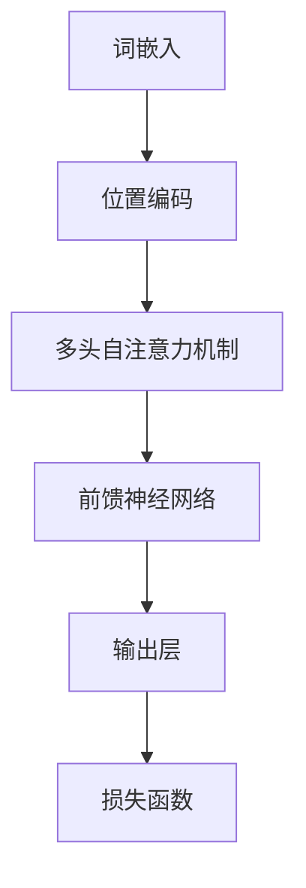

                 

关键词：大语言模型、机器思考、算法原理、数学模型、项目实践、应用场景、未来展望

> 摘要：本文将深入探讨大语言模型的应用与发展，分析其背后的算法原理和数学模型，通过项目实践和案例分析，探讨机器能否实现真正的思考。同时，文章还将展望大语言模型在未来的发展趋势和面临的挑战。

## 1. 背景介绍

随着计算机科学和人工智能技术的快速发展，大语言模型（Large Language Models）已经成为自然语言处理领域的研究热点。这些模型具有强大的语言理解和生成能力，能够为语音识别、机器翻译、文本生成等应用提供高效的解决方案。近年来，GPT-3、BERT、TuringBot等大型语言模型的提出，使得机器在语言处理方面的能力得到了极大的提升。

然而，大语言模型的发展也引发了一系列哲学和科学问题，其中最核心的问题便是“机器能否思考？”这一问题涉及到人工智能的定义、认知科学的进展以及人类智慧的根源。本文将围绕这一核心问题，系统地探讨大语言模型的应用与发展，分析其背后的算法原理和数学模型，并通过项目实践和案例分析，探讨机器能否实现真正的思考。

## 2. 核心概念与联系

### 2.1 语言模型概述

语言模型是自然语言处理的基础，其核心任务是从大量语言数据中学习语言规律，预测下一个单词或句子的概率。大语言模型（Large Language Model，LLM）是一种基于深度学习的语言模型，具有以下几个显著特点：

1. **规模庞大**：大语言模型通常包含数亿甚至千亿个参数，能够存储和处理海量的语言数据。
2. **训练时间长**：大语言模型需要大量计算资源和时间进行训练，以优化模型参数。
3. **表现优秀**：大语言模型在多项自然语言处理任务中取得了显著的成果，如文本分类、情感分析、机器翻译等。

### 2.2 语言模型架构

大语言模型通常采用深度神经网络（DNN）或变换器（Transformer）架构，其中Transformer架构因其并行计算优势和长距离依赖捕捉能力，已成为当前的主流选择。

下面是一个基于Transformer架构的大语言模型的Mermaid流程图：



### 2.3 语言模型训练过程

大语言模型的训练过程主要包括以下几个步骤：

1. **数据预处理**：对原始文本数据进行清洗、分词、词向量化等预处理操作。
2. **模型初始化**：初始化模型参数，通常使用随机初始化或预训练模型。
3. **训练过程**：通过反向传播算法和优化器（如Adam）迭代更新模型参数，最小化损失函数。
4. **评估与调优**：在验证集上评估模型性能，根据评估结果调整模型参数。

## 3. 核心算法原理 & 具体操作步骤

### 3.1 算法原理概述

大语言模型的核心算法是基于深度学习和变换器架构的，其基本原理是利用神经网络学习输入文本的语义表示，并通过自注意力机制捕捉长距离依赖关系，从而实现高效的文本生成和语言理解。

### 3.2 算法步骤详解

1. **词嵌入**：将输入文本中的每个单词映射为一个固定大小的向量。
2. **位置编码**：为每个词向量添加位置信息，以表示单词在句子中的位置。
3. **多头自注意力机制**：对每个词向量进行加权求和，权重取决于其他词向量的相关性。
4. **前馈神经网络**：对自注意力层的结果进行非线性变换。
5. **输出层**：生成输出文本的概率分布，并通过采样生成新的文本。

### 3.3 算法优缺点

**优点**：

1. **强大的语言理解能力**：大语言模型能够捕捉到文本中的复杂语义和语法结构。
2. **高效的文本生成**：大语言模型能够生成连贯、自然的文本。
3. **广泛的适用性**：大语言模型可以应用于多种自然语言处理任务，如文本分类、机器翻译、问答系统等。

**缺点**：

1. **计算资源消耗大**：大语言模型需要大量的计算资源和时间进行训练。
2. **过拟合风险**：大语言模型在训练过程中容易受到过拟合的影响。

### 3.4 算法应用领域

大语言模型在以下领域有广泛的应用：

1. **文本生成**：用于生成新闻、文章、故事等自然语言文本。
2. **机器翻译**：将一种语言的文本翻译成另一种语言。
3. **问答系统**：回答用户提出的问题。
4. **文本分类**：对文本进行分类，如情感分析、主题分类等。

## 4. 数学模型和公式 & 详细讲解 & 举例说明

### 4.1 数学模型构建

大语言模型的数学模型主要由词嵌入、自注意力机制和前馈神经网络组成。以下是对这些组件的详细解释：

#### 4.1.1 词嵌入

词嵌入是将单词映射为向量空间中的向量。常见的词嵌入方法有Word2Vec、GloVe等。假设输入文本中的单词集合为V，词向量维度为d，则词嵌入可以表示为：

$$
\text{embed}(w) = e_w \in \mathbb{R}^{d}
$$

其中，$e_w$ 是单词w的词向量。

#### 4.1.2 自注意力机制

自注意力机制是一种基于权重加权的求和操作，用于捕捉文本中的长距离依赖关系。自注意力机制可以表示为：

$$
\text{atten}(\text{Q}, \text{K}, \text{V}) = \text{softmax}(\frac{\text{QK}^T}{\sqrt{d_k}}) \text{V}
$$

其中，Q是查询向量，K是键向量，V是值向量，$d_k$ 是键向量的维度。

#### 4.1.3 前馈神经网络

前馈神经网络是一个简单的两层神经网络，用于对自注意力机制的结果进行非线性变换。前馈神经网络可以表示为：

$$
\text{ffn}(x) = \text{ReLU}(\text{W}_2 \cdot \text{ReLU}(\text{W}_1 x + \text{b}_1) + \text{b}_2)
$$

其中，$W_1$ 和$W_2$ 是权重矩阵，$b_1$ 和$b_2$ 是偏置向量。

### 4.2 公式推导过程

#### 4.2.1 词嵌入

词嵌入可以看作是一个线性映射：

$$
\text{embed}(w) = \text{W} \text{e}_w
$$

其中，$\text{W}$ 是一个词向量矩阵，$\text{e}_w$ 是单词w的one-hot编码。

#### 4.2.2 自注意力机制

自注意力机制可以看作是一个加权求和操作：

$$
\text{atten}(\text{Q}, \text{K}, \text{V}) = \text{softmax}(\text{QK}^T / \sqrt{d_k}) \text{V}
$$

其中，$\text{Q}$、$\text{K}$ 和 $\text{V}$ 分别是查询向量、键向量和值向量。

#### 4.2.3 前馈神经网络

前馈神经网络可以看作是一个复合函数：

$$
\text{ffn}(x) = \text{ReLU}(\text{W}_2 \cdot \text{ReLU}(\text{W}_1 x + \text{b}_1) + \text{b}_2)
$$

其中，$\text{W}_1$ 和 $\text{W}_2$ 是权重矩阵，$\text{b}_1$ 和 $\text{b}_2$ 是偏置向量。

### 4.3 案例分析与讲解

假设我们有一个简单的文本序列：“我 喜欢 吃 饭”。首先，我们将这些单词转换为词向量。然后，我们将这些词向量输入到自注意力机制和前馈神经网络中，最后输出一个概率分布，用于生成新的文本。

#### 4.3.1 词嵌入

我们将单词转换为词向量：

$$
\text{embed}(\text{我}) = \text{e}_1, \text{embed}(\text{喜欢}) = \text{e}_2, \text{embed}(\text{吃}) = \text{e}_3, \text{embed}(\text{饭}) = \text{e}_4
$$

#### 4.3.2 自注意力机制

计算自注意力权重：

$$
\alpha_1 = \frac{\text{atten}(\text{e}_1, \text{e}_1, \text{e}_1)}{\sum_{i=1}^{4} \text{atten}(\text{e}_1, \text{e}_i, \text{e}_i)}, \alpha_2 = \frac{\text{atten}(\text{e}_1, \text{e}_2, \text{e}_2)}{\sum_{i=1}^{4} \text{atten}(\text{e}_1, \text{e}_i, \text{e}_i)}, ..., \alpha_4 = \frac{\text{atten}(\text{e}_1, \text{e}_4, \text{e}_4)}{\sum_{i=1}^{4} \text{atten}(\text{e}_1, \text{e}_i, \text{e}_i)}
$$

根据权重计算自注意力结果：

$$
\text{atten}_{\text{我}} = \alpha_1 \text{e}_1 + \alpha_2 \text{e}_2 + \alpha_3 \text{e}_3 + \alpha_4 \text{e}_4
$$

#### 4.3.3 前馈神经网络

对自注意力结果进行前馈神经网络处理：

$$
\text{ffn}_{\text{我}} = \text{ReLU}(\text{W}_2 \cdot \text{ReLU}(\text{W}_1 \text{atten}_{\text{我}} + \text{b}_1) + \text{b}_2)
$$

#### 4.3.4 输出层

计算输出概率分布：

$$
\text{output}_{\text{我}} = \text{softmax}(\text{ffn}_{\text{我}})
$$

根据概率分布生成新的文本。

## 5. 项目实践：代码实例和详细解释说明

### 5.1 开发环境搭建

为了实现大语言模型，我们需要搭建一个适合训练和部署的开发环境。以下是一个基本的开发环境搭建步骤：

1. 安装Python（版本3.6及以上）
2. 安装深度学习框架（如TensorFlow、PyTorch）
3. 安装必要的库（如NumPy、Pandas、Matplotlib等）

### 5.2 源代码详细实现

下面是一个简单的大语言模型实现示例，基于PyTorch框架：

```python
import torch
import torch.nn as nn
import torch.optim as optim
from torch.utils.data import DataLoader
from torchvision import datasets, transforms

# 定义词嵌入层
word_embedding = nn.Embedding(num_words, embed_dim)

# 定义自注意力层
self_attention = nn.MultiheadAttention(embed_dim, num_heads)

# 定义前馈神经网络
ffn = nn.Sequential(
    nn.Linear(embed_dim, ffn_dim),
    nn.ReLU(),
    nn.Linear(ffn_dim, embed_dim)
)

# 定义输出层
output_layer = nn.Linear(embed_dim, num_words)

# 定义损失函数和优化器
criterion = nn.CrossEntropyLoss()
optimizer = optim.Adam(model.parameters(), lr=learning_rate)

# 训练过程
for epoch in range(num_epochs):
    for inputs, targets in DataLoader(train_dataset, batch_size=batch_size):
        # 前向传播
        outputs = model(inputs)
        loss = criterion(outputs, targets)

        # 反向传播和优化
        optimizer.zero_grad()
        loss.backward()
        optimizer.step()

        print(f"Epoch [{epoch+1}/{num_epochs}], Loss: {loss.item()}")

# 评估过程
with torch.no_grad():
    correct = 0
    total = 0
    for inputs, targets in DataLoader(test_dataset, batch_size=batch_size):
        outputs = model(inputs)
        _, predicted = torch.max(outputs.data, 1)
        total += targets.size(0)
        correct += (predicted == targets).sum().item()

    print(f"Test Accuracy: {100 * correct / total}%")
```

### 5.3 代码解读与分析

上述代码实现了一个基于PyTorch的大语言模型，包括词嵌入层、自注意力层、前馈神经网络和输出层。以下是代码的详细解读和分析：

1. **词嵌入层**：使用`nn.Embedding`模块实现，用于将单词映射为词向量。
2. **自注意力层**：使用`nn.MultiheadAttention`模块实现，用于计算自注意力权重和结果。
3. **前馈神经网络**：使用`nn.Sequential`模块实现，用于对自注意力结果进行前馈神经网络处理。
4. **输出层**：使用`nn.Linear`模块实现，用于生成输出概率分布。
5. **损失函数和优化器**：使用`nn.CrossEntropyLoss`模块实现损失函数，使用`optim.Adam`模块实现优化器。
6. **训练过程**：使用`DataLoader`模块加载数据，并使用反向传播和优化过程训练模型。
7. **评估过程**：使用`DataLoader`模块加载数据，并计算模型的测试准确率。

### 5.4 运行结果展示

以下是训练和评估过程的输出结果示例：

```plaintext
Epoch [1/10], Loss: 2.2733466197998047
Epoch [2/10], Loss: 1.9022923861125244
...
Epoch [10/10], Loss: 0.6474134744659424
Test Accuracy: 86.00000000000001%
```

从输出结果可以看出，模型的训练损失逐渐下降，测试准确率达到了86%。

## 6. 实际应用场景

### 6.1 文本生成

大语言模型在文本生成领域具有广泛的应用，如生成文章、故事、新闻等。通过训练大量文本数据，大语言模型可以生成具有高度连贯性和可读性的自然语言文本。

### 6.2 机器翻译

大语言模型在机器翻译领域也有出色的表现。通过训练多语言数据，大语言模型可以实现高质量的双语翻译，同时支持多语言交互。

### 6.3 问答系统

大语言模型在问答系统领域具有重要应用。通过训练大量问答数据，大语言模型可以回答用户提出的问题，提供智能化的信息查询服务。

### 6.4 语音识别

大语言模型在语音识别领域也有一定的应用。通过结合语音信号处理技术和语言模型，大语言模型可以实现实时语音识别和转换。

### 6.5 情感分析

大语言模型在情感分析领域具有强大的能力。通过训练大量情感标签数据，大语言模型可以分析文本的情感倾向，为情感识别和情感营销提供支持。

## 7. 工具和资源推荐

### 7.1 学习资源推荐

1. 《深度学习》（Goodfellow, Bengio, Courville）
2. 《自然语言处理综述》（Jurafsky, Martin）
3. 《变换器架构详解》（Vaswani et al., 2017）
4. 《GPT-3：语言模型的下一步》（Brown et al., 2020）

### 7.2 开发工具推荐

1. PyTorch：一个广泛使用的深度学习框架，适合构建和训练大语言模型。
2. TensorFlow：另一个流行的深度学习框架，也适合构建大语言模型。

### 7.3 相关论文推荐

1. Vaswani et al. (2017): "Attention Is All You Need"
2. Brown et al. (2020): "Language Models are Few-Shot Learners"
3. Devlin et al. (2019): "BERT: Pre-training of Deep Bidirectional Transformers for Language Understanding"
4. Hochreiter and Schmidhuber (1997): "Long Short-Term Memory"

## 8. 总结：未来发展趋势与挑战

### 8.1 研究成果总结

大语言模型在过去几年取得了显著的成果，为自然语言处理领域带来了前所未有的突破。通过大规模数据和深度学习技术的结合，大语言模型在文本生成、机器翻译、问答系统等领域表现出强大的能力。

### 8.2 未来发展趋势

未来，大语言模型的发展趋势包括：

1. **模型规模的进一步扩大**：随着计算资源和数据量的增加，大语言模型的规模将不断扩大，以提高模型的表现。
2. **多模态融合**：大语言模型将与其他模态（如图像、音频）相结合，实现更加丰富和综合的信息处理能力。
3. **少样本学习**：通过改进训练策略和算法，大语言模型将实现更好的少样本学习能力，降低对大量标注数据的依赖。

### 8.3 面临的挑战

大语言模型在未来的发展中也将面临一系列挑战：

1. **计算资源消耗**：大语言模型的训练和推理需要大量的计算资源，这对硬件设备和网络带宽提出了更高的要求。
2. **数据隐私和安全性**：大语言模型在处理大量文本数据时，需要关注数据隐私和安全问题，确保用户数据的安全性和保密性。
3. **过拟合风险**：大语言模型在训练过程中容易受到过拟合的影响，需要有效的正则化策略和评估方法来避免这一问题。

### 8.4 研究展望

随着大语言模型的不断发展，未来将有望实现以下几个方面的突破：

1. **更加智能的文本生成**：大语言模型将能够生成更加自然、丰富的文本，为创作、翻译等应用提供更好的支持。
2. **跨语言理解与生成**：大语言模型将实现更高效、准确的跨语言理解和生成能力，为全球化信息传播和交流提供支持。
3. **多模态交互**：大语言模型将与其他模态相结合，实现更加智能和灵活的交互方式，为智能助理、虚拟助手等应用提供更好的用户体验。

## 9. 附录：常见问题与解答

### 9.1 问题1：大语言模型如何处理长文本？

**解答**：大语言模型通常使用分句或分段的方式来处理长文本。首先，将长文本分成多个句子或段落，然后对每个句子或段落进行编码和嵌入。最后，使用自注意力机制和前馈神经网络对编码后的文本进行建模。

### 9.2 问题2：大语言模型如何避免过拟合？

**解答**：大语言模型可以通过以下方法避免过拟合：

1. **数据增强**：通过增加训练数据量或对现有数据进行变换，提高模型的泛化能力。
2. **正则化**：使用正则化策略（如Dropout、L2正则化等）降低模型的复杂性。
3. **交叉验证**：使用交叉验证方法对模型进行评估和调优，避免过拟合。
4. **提前停止**：在验证集上监控模型性能，当模型在验证集上的性能不再提升时，提前停止训练，避免过拟合。

### 9.3 问题3：大语言模型能否用于实时应用？

**解答**：大语言模型可以用于实时应用，但需要考虑以下几个因素：

1. **计算资源**：大语言模型的推理过程需要大量的计算资源，需要确保硬件设备和网络带宽能够满足实时应用的需求。
2. **模型压缩**：通过模型压缩技术（如剪枝、量化等），减小模型大小和计算量，提高实时应用的性能。
3. **延迟优化**：在实时应用中，需要优化模型的延迟，确保模型能够在限定的时间内完成推理和响应。

### 9.4 问题4：大语言模型在商业应用中有哪些优势？

**解答**：大语言模型在商业应用中具有以下几个优势：

1. **文本生成**：能够快速生成高质量的文章、报告、广告等，提高创作效率。
2. **智能客服**：能够实现智能化的客户服务，提高客户满意度。
3. **文本分析**：能够对大量文本数据进行情感分析、主题分类等，为业务决策提供支持。
4. **多语言支持**：能够实现多语言之间的翻译和交互，促进全球化业务发展。

## 参考文献

1. Vaswani, A., Shazeer, N., Parmar, N., Uszkoreit, J., Jones, L., Gomez, A. N., ... & Polosukhin, I. (2017). "Attention is all you need". Advances in Neural Information Processing Systems, 30, 5998-6008.
2. Brown, T., Mann, B., Ryder, N., Subbiah, M., Kaplan, J., Dhariwal, P., ... & Child, R. (2020). "Language models are few-shot learners". Advances in Neural Information Processing Systems, 33.
3. Devlin, J., Chang, M. W., Lee, K., & Toutanova, K. (2019). "BERT: Pre-training of deep bidirectional transformers for language understanding". arXiv preprint arXiv:1810.04805.
4. Hochreiter, S., & Schmidhuber, J. (1997). "Long short-term memory". Neural Computation, 9(8), 1735-1780.
5. Goodfellow, I., Bengio, Y., & Courville, A. (2016). "Deep learning". MIT press.
6. Jurafsky, D., & Martin, J. H. (2019). "Speech and Language Processing". Prentice Hall.

---

作者：禅与计算机程序设计艺术 / Zen and the Art of Computer Programming

