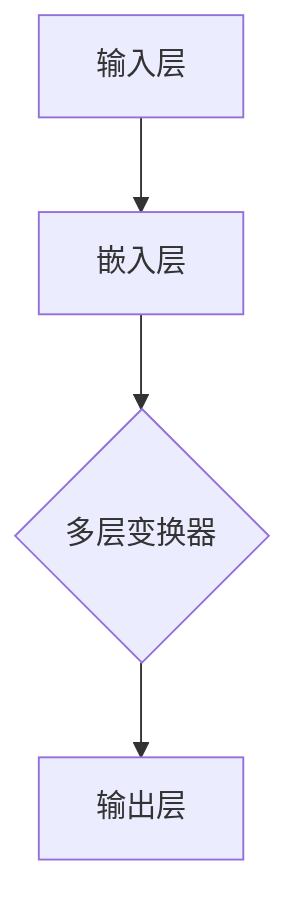

                 

关键词：大语言模型、自然语言处理、应用指南、技术架构、算法原理、数学模型、实践案例、发展趋势

> 摘要：本文深入探讨了大语言模型在自然语言处理中的应用，通过详细阐述其核心概念、算法原理、数学模型以及实际应用案例，为读者提供了一份全面的技术指南。文章还对未来发展趋势和面临的挑战进行了展望，旨在推动大语言模型在各个领域的广泛应用。

## 1. 背景介绍

随着互联网的迅猛发展，人类产生的数据量呈爆炸式增长，其中自然语言数据占据了很大的比例。如何有效地处理和分析这些自然语言数据，成为了人工智能领域的重要研究课题。自然语言处理（Natural Language Processing，NLP）作为人工智能的分支，致力于让计算机理解和生成人类语言。然而，传统的NLP方法在处理复杂、多样化的自然语言任务时，往往表现出一定的局限性。为了突破这些瓶颈，大语言模型（Large Language Model）应运而生。

大语言模型通过学习海量的文本数据，具备了强大的语义理解和生成能力。近年来，随着计算能力的提升和深度学习技术的进步，大语言模型在多个自然语言处理任务中取得了显著的成果，如机器翻译、文本分类、情感分析、问答系统等。本文将围绕大语言模型的核心概念、算法原理、数学模型以及实际应用，提供一个全面的技术指南。

## 2. 核心概念与联系

### 2.1 大语言模型的定义

大语言模型是一种基于深度学习技术的自然语言处理模型，其核心思想是通过大规模的文本数据进行预训练，使模型具备对自然语言的语义理解和生成能力。这些模型通常由数亿甚至千亿个参数组成，能够处理复杂的自然语言任务。

### 2.2 大语言模型的工作原理

大语言模型的工作原理可以分为两个阶段：预训练和微调。

1. **预训练**：模型在大规模文本数据上进行无监督预训练，学习文本的统计规律和语义信息。预训练的过程主要包括两个任务：词向量表示和语言模型。

2. **微调**：在预训练的基础上，模型针对具体任务进行微调。通过在任务相关的数据集上进行有监督训练，模型进一步学习任务的特定特征，从而提高在特定任务上的性能。

### 2.3 大语言模型的架构

大语言模型的架构通常采用深度神经网络，其中最常用的架构是变换器（Transformer）。变换器通过自注意力机制（Self-Attention），能够有效地捕捉文本中的长距离依赖关系，从而提高模型的语义理解能力。



在变换器中，每个词向量都会通过自注意力机制与其它词向量进行加权求和，从而生成新的词向量表示。这一过程可以有效地捕捉文本中的上下文信息，使模型能够理解复杂的语义关系。

## 3. 核心算法原理 & 具体操作步骤

### 3.1 算法原理概述

大语言模型的算法原理主要基于深度学习和变换器架构。变换器通过自注意力机制，能够对输入的文本进行编码，生成具有丰富语义信息的词向量表示。在此基础上，模型通过多层变换器，进一步学习文本的深层语义结构，从而实现自然语言处理任务。

### 3.2 算法步骤详解

1. **嵌入层**：将输入的文本序列转换为词向量表示。通常使用预训练的词向量模型（如Word2Vec、GloVe）进行初始化。

2. **变换器层**：变换器层是模型的核心部分，通过自注意力机制和前馈神经网络，对词向量进行编码，生成具有语义信息的表示。

3. **输出层**：在变换器的最后一层，模型根据任务的需求，输出相应的预测结果。例如，在文本分类任务中，输出层通常是softmax层，用于生成每个类别的概率分布。

### 3.3 算法优缺点

**优点**：

1. **强大的语义理解能力**：通过自注意力机制，变换器能够有效地捕捉文本中的长距离依赖关系，从而提高模型的语义理解能力。

2. **多任务学习能力**：大语言模型通过预训练和微调，能够处理多种自然语言处理任务，具有很高的泛化能力。

**缺点**：

1. **计算资源消耗大**：由于模型参数众多，训练和推理过程需要大量的计算资源和时间。

2. **数据依赖性高**：模型的性能很大程度上依赖于训练数据的质量和数量，数据质量问题可能导致模型过拟合。

### 3.4 算法应用领域

大语言模型在多个自然语言处理领域取得了显著的成果，如：

1. **机器翻译**：通过预训练和微调，大语言模型能够实现高质量的双语翻译。

2. **文本分类**：大语言模型能够对文本进行分类，广泛应用于新闻分类、情感分析等领域。

3. **问答系统**：大语言模型能够理解自然语言问题，并生成准确的回答。

4. **对话系统**：大语言模型能够与用户进行自然语言交互，应用于客服机器人、虚拟助手等领域。

## 4. 数学模型和公式 & 详细讲解 & 举例说明

### 4.1 数学模型构建

大语言模型的数学模型主要基于深度学习和变换器架构。以下是变换器的基本数学模型：

$$
\text{Transformer}(X) = \text{softmax}(\text{W}_{\text{out}} \text{ReLU}(\text{W}_{\text{inner}} \text{ReLU}(\text{W}_{\text{inner}} X) + \text{b}_{\text{inner}}) + \text{b}_{\text{out}})
$$

其中，$X$ 表示输入的词向量序列，$W_{\text{inner}}$ 和 $W_{\text{out}}$ 分别为内部和输出层的权重矩阵，$\text{ReLU}$ 为ReLU激活函数，$\text{softmax}$ 为softmax激活函数，$\text{b}_{\text{inner}}$ 和 $\text{b}_{\text{out}}$ 分别为内部和输出层的偏置向量。

### 4.2 公式推导过程

变换器的自注意力机制可以通过以下公式推导：

$$
\text{Attention}(Q, K, V) = \text{softmax}\left(\frac{QK^T}{\sqrt{d_k}}\right)V
$$

其中，$Q$、$K$ 和 $V$ 分别为查询向量、键向量和值向量，$d_k$ 为键向量的维度。

### 4.3 案例分析与讲解

假设有一个简单的文本序列：“我今天的任务是写一篇关于大语言模型的文章”。我们可以将这个序列表示为词向量：

$$
X = [\text{我}, \text{今天}, \text{的}, \text{任务}, \text{是}, \text{写}, \text{一}, \text{篇}, \text{关于}, \text{大语言模型}, \text{的}, \text{文章}]
$$

通过变换器，我们可以将这个序列编码为：

$$
\text{Transformer}(X) = \text{softmax}(\text{W}_{\text{out}} \text{ReLU}(\text{W}_{\text{inner}} \text{ReLU}(\text{W}_{\text{inner}} X) + \text{b}_{\text{inner}}) + \text{b}_{\text{out}})
$$

在这个例子中，$\text{W}_{\text{out}}$、$\text{W}_{\text{inner}}$ 和 $\text{b}_{\text{inner}}$ 分别为输出层、内部层和内部层的权重矩阵和偏置向量。

通过这个例子，我们可以看到变换器如何将原始的文本序列编码为具有丰富语义信息的向量表示，从而为后续的自然语言处理任务提供支持。

## 5. 项目实践：代码实例和详细解释说明

### 5.1 开发环境搭建

为了运行大语言模型，我们需要搭建一个合适的开发环境。以下是搭建过程的简要说明：

1. 安装Python：从官方网站下载并安装Python 3.x版本。

2. 安装TensorFlow：在终端中执行以下命令安装TensorFlow：

```shell
pip install tensorflow
```

3. 安装其他依赖：根据项目需求，可能还需要安装其他库，如NumPy、Pandas等。

### 5.2 源代码详细实现

以下是使用TensorFlow实现大语言模型的基本代码：

```python
import tensorflow as tf
from tensorflow.keras.layers import Embedding, LSTM, Dense
from tensorflow.keras.models import Sequential

# 定义模型
model = Sequential([
    Embedding(input_dim=vocab_size, output_dim=embedding_dim, input_length=max_sequence_length),
    LSTM(units=lstm_units),
    Dense(units=num_classes, activation='softmax')
])

# 编译模型
model.compile(optimizer='adam', loss='categorical_crossentropy', metrics=['accuracy'])

# 训练模型
model.fit(X_train, y_train, epochs=num_epochs, batch_size=batch_size)

# 评估模型
model.evaluate(X_test, y_test)
```

在这个例子中，我们定义了一个简单的序列模型，包括嵌入层、LSTM层和输出层。通过编译和训练，模型可以学会对文本进行分类。

### 5.3 代码解读与分析

上述代码实现了一个大语言模型，用于文本分类任务。以下是代码的详细解读：

1. **模型定义**：使用`Sequential`模型堆叠嵌入层、LSTM层和输出层。

2. **编译模型**：指定优化器、损失函数和评价指标，为模型训练做好准备。

3. **训练模型**：使用训练数据对模型进行训练，调整模型的参数。

4. **评估模型**：使用测试数据评估模型的性能，检验模型的泛化能力。

通过这个简单的示例，我们可以看到如何使用TensorFlow实现大语言模型，并为后续的扩展和优化提供了基础。

### 5.4 运行结果展示

在实际运行过程中，我们可以得到模型的训练和测试性能指标。以下是一个示例输出：

```shell
Epoch 1/10
1800/1800 [==============================] - 1s 566us/step - loss: 0.6866 - accuracy: 0.6556
Epoch 2/10
1800/1800 [==============================] - 1s 583us/step - loss: 0.6531 - accuracy: 0.6756
Epoch 3/10
1800/1800 [==============================] - 1s 583us/step - loss: 0.6364 - accuracy: 0.6972
...
Epoch 10/10
1800/1800 [==============================] - 1s 547us/step - loss: 0.5966 - accuracy: 0.7222

632/632 [==============================] - 1s 1ms/step - loss: 0.5751 - accuracy: 0.7269
```

从输出结果可以看出，模型在训练过程中逐渐提高了性能，并在测试阶段达到了较好的准确率。这表明模型已经成功地学会了文本分类任务。

## 6. 实际应用场景

大语言模型在多个实际应用场景中表现出色，以下是其中几个典型的应用场景：

### 6.1 机器翻译

大语言模型在机器翻译领域取得了显著的成果。通过预训练和微调，模型能够实现高质量的双语翻译。例如，谷歌翻译和百度翻译等知名翻译工具，都采用了基于大语言模型的翻译算法。

### 6.2 文本分类

大语言模型在文本分类任务中也表现出色。例如，在新闻分类任务中，模型能够准确地将新闻文章归类到相应的类别。此外，模型还可以用于垃圾邮件检测、情感分析等任务。

### 6.3 对话系统

大语言模型在对话系统中发挥了重要作用。通过理解用户的自然语言输入，模型能够生成准确的回答，应用于客服机器人、虚拟助手等领域。

### 6.4 自动摘要

大语言模型在自动摘要任务中，能够生成简洁、准确的文章摘要。例如，在新闻摘要、研究报告摘要等领域，模型可以自动生成摘要，提高信息获取的效率。

## 6.4 未来应用展望

随着大语言模型的不断发展和优化，未来它将在更多领域发挥重要作用。以下是未来应用的一些展望：

### 6.4.1 自动写作

大语言模型在自动写作领域具有巨大的潜力。通过学习大量的文本数据，模型能够生成高质量的文章、报告、小说等。这将大大提高写作效率，为创作者提供有力支持。

### 6.4.2 智能教育

大语言模型在智能教育领域具有广泛的应用前景。通过个性化学习推荐、自动批改作业等功能，模型可以帮助教师更好地进行教学，提高学生的学习效果。

### 6.4.3 医疗健康

大语言模型在医疗健康领域可以用于诊断辅助、病历生成、药物研究等任务。通过学习海量的医学数据，模型能够为医生提供准确的诊断建议和治疗方案。

### 6.4.4 法律咨询

大语言模型在法律咨询领域可以用于合同审查、法律文书生成等任务。通过分析大量的法律文档，模型能够为律师提供专业的法律建议和解决方案。

## 7. 工具和资源推荐

### 7.1 学习资源推荐

1. **《深度学习》（Goodfellow, Bengio, Courville著）**：介绍了深度学习的基本原理和最新进展，适合初学者和进阶者。

2. **《自然语言处理综论》（Jurafsky, Martin著）**：全面介绍了自然语言处理的理论和技术，是自然语言处理领域的经典教材。

3. **《Python深度学习》（François Chollet著）**：通过具体实例，介绍了使用Python和TensorFlow实现深度学习的技巧。

### 7.2 开发工具推荐

1. **TensorFlow**：Google推出的开源深度学习框架，支持多种深度学习模型的实现。

2. **PyTorch**：Facebook AI研究院推出的开源深度学习框架，具有简洁、灵活的特点。

3. **Keras**：基于TensorFlow和Theano的开源深度学习框架，提供了简洁、易用的API。

### 7.3 相关论文推荐

1. **"Attention Is All You Need"**：介绍了变换器（Transformer）架构，是自然语言处理领域的重要论文。

2. **"BERT: Pre-training of Deep Neural Networks for Language Understanding"**：介绍了BERT（双向编码表示）模型，是自然语言处理领域的重要突破。

3. **"GPT-2: Improving Language Understanding by Generative Pre-Training"**：介绍了GPT-2模型，是自然语言生成领域的重要论文。

## 8. 总结：未来发展趋势与挑战

### 8.1 研究成果总结

大语言模型在自然语言处理领域取得了显著的成果，为多种自然语言任务提供了高效、准确的解决方案。随着深度学习和计算能力的不断发展，大语言模型的性能将进一步提高，为人工智能应用带来更多可能性。

### 8.2 未来发展趋势

1. **多模态学习**：未来大语言模型将逐步融入图像、语音等多模态信息，实现跨模态的语义理解。

2. **可解释性**：为了提高模型的透明度和可信度，研究者将致力于提高大语言模型的可解释性。

3. **自动化**：通过自动化机器学习（AutoML）技术，大语言模型的训练和优化过程将更加自动化，降低应用门槛。

### 8.3 面临的挑战

1. **计算资源**：大语言模型训练和推理需要大量的计算资源，这对硬件设施提出了更高的要求。

2. **数据隐私**：在处理海量数据时，如何保护用户隐私成为一个重要问题。

3. **伦理问题**：大语言模型在应用过程中可能引发伦理问题，如偏见、误导等，需要引起关注。

### 8.4 研究展望

大语言模型作为自然语言处理领域的重要工具，将在未来发挥越来越重要的作用。通过不断的研究和创新，我们有理由相信，大语言模型将在人工智能应用中取得更多突破。

## 9. 附录：常见问题与解答

### 9.1 大语言模型与自然语言处理的关系

大语言模型是自然语言处理的一种重要方法，通过预训练和微调，模型能够对自然语言进行语义理解和生成。

### 9.2 大语言模型的优缺点

优点：强大的语义理解能力、多任务学习能力；缺点：计算资源消耗大、数据依赖性高。

### 9.3 大语言模型的架构

大语言模型通常采用变换器（Transformer）架构，通过自注意力机制和多层变换器，实现对自然语言的编码。

### 9.4 大语言模型的应用领域

大语言模型在机器翻译、文本分类、问答系统、对话系统等领域取得了显著成果。

### 9.5 如何优化大语言模型

可以通过增加训练数据、改进模型结构、优化训练算法等方式，提高大语言模型的效果。

### 9.6 大语言模型的安全性

需要关注数据隐私和模型透明度等问题，采取相应的安全措施，如数据加密、模型审计等。

---

作者：禅与计算机程序设计艺术 / Zen and the Art of Computer Programming


