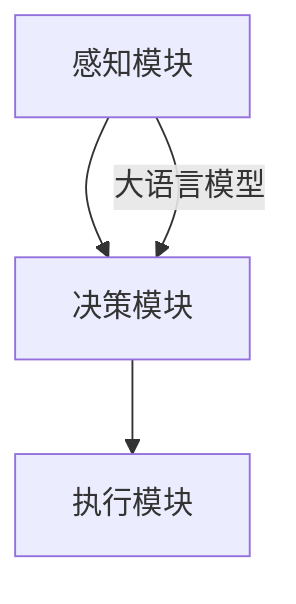

                 

关键词：大语言模型、自主Agent、AI应用、系统架构、技术指南

> 摘要：本文将介绍大语言模型在自主Agent系统中的应用，探讨如何构建高效的自主Agent系统，并分析其潜在的应用场景和未来发展趋势。

## 1. 背景介绍

随着人工智能技术的迅猛发展，大语言模型已经成为自然语言处理领域的重要工具。这些模型通过学习海量文本数据，可以理解和生成人类语言，广泛应用于问答系统、自动摘要、机器翻译等场景。同时，自主Agent系统的兴起，为智能交互、自主决策提供了新的可能性。自主Agent系统是一种能够模拟人类决策行为的智能体，具备自主感知环境、理解任务需求、进行决策规划和执行任务的能力。如何将大语言模型与自主Agent系统相结合，构建高效、可靠的智能系统，成为当前研究的热点问题。

本文将围绕这一主题，首先介绍大语言模型的基本原理和自主Agent系统的架构，然后详细讨论如何利用大语言模型提高自主Agent系统的智能水平，并探讨其应用领域和未来发展趋势。

## 2. 核心概念与联系

### 2.1 大语言模型

大语言模型是一种基于深度学习的自然语言处理技术，通过大规模训练数据学习语言的模式和规律，可以生成符合语法和语义规则的文本。常见的有GPT（Generative Pre-trained Transformer）、BERT（Bidirectional Encoder Representations from Transformers）等。大语言模型的主要特点包括：

- **预训练**：在大量无监督数据上进行预训练，捕捉语言的一般规律。
- **多任务能力**：通过预训练，大语言模型可以适应多种自然语言处理任务。
- **生成能力强**：能够生成流畅、符合上下文语境的文本。

### 2.2 自主Agent系统

自主Agent系统是一种具有自主决策能力的智能系统，能够根据环境和任务需求，自主规划行动策略并执行任务。自主Agent系统的主要组成部分包括：

- **感知模块**：负责感知和理解环境信息。
- **决策模块**：基于感知信息，自主做出决策。
- **执行模块**：执行决策计划，实现任务目标。

### 2.3 大语言模型与自主Agent系统的联系

大语言模型在自主Agent系统中主要应用于感知和决策模块，具体包括：

- **自然语言理解**：通过大语言模型，自主Agent可以更好地理解和分析自然语言输入。
- **决策生成**：大语言模型可以帮助自主Agent生成合理的决策计划，提高决策质量。

### 2.4 Mermaid 流程图



在此流程图中，大语言模型作为桥梁，连接感知模块和决策模块，使得自主Agent能够更高效地处理自然语言输入，并生成高质量的决策计划。

## 3. 核心算法原理 & 具体操作步骤

### 3.1 算法原理概述

大语言模型的核心在于其预训练和微调机制。预训练阶段，模型在大规模数据集上学习语言的模式和规律，形成通用语言表示。微调阶段，模型根据具体任务进行调优，以适应特定任务需求。

自主Agent系统则依赖于感知模块、决策模块和执行模块的协同工作。感知模块通过传感器收集环境信息，决策模块利用大语言模型理解和分析感知信息，生成决策计划，执行模块则根据决策计划执行具体任务。

### 3.2 算法步骤详解

1. **感知模块**：感知模块通过传感器收集环境信息，如文本、图像、语音等。这些信息经过预处理后，输入到大语言模型进行理解。
2. **决策模块**：决策模块接收感知模块处理后的信息，利用大语言模型生成决策计划。决策过程包括目标识别、路径规划、资源分配等。
3. **执行模块**：执行模块根据决策计划，执行具体任务。执行过程可能涉及多种操作，如移动、交互、计算等。

### 3.3 算法优缺点

**优点**：

- **高效性**：大语言模型通过预训练和微调，可以快速适应不同任务，提高决策效率。
- **灵活性**：大语言模型具备强大的生成能力，能够灵活处理各种自然语言输入。

**缺点**：

- **依赖数据**：大语言模型需要大量高质量训练数据，数据来源和数量可能成为瓶颈。
- **计算资源消耗**：大语言模型训练和推理过程需要大量计算资源，可能导致成本较高。

### 3.4 算法应用领域

- **智能客服**：通过大语言模型，自主Agent可以理解用户的需求，提供个性化的服务。
- **自动驾驶**：大语言模型可以帮助自动驾驶系统理解道路标识、交通信号等，提高行驶安全性。
- **智能助手**：大语言模型可以用于构建智能助手，实现自然语言交互。

## 4. 数学模型和公式 & 详细讲解 & 举例说明

### 4.1 数学模型构建

大语言模型的核心在于其Transformer架构，Transformer模型基于自注意力机制，能够捕捉长距离依赖关系。自注意力机制可以用以下公式表示：

\[ \text{Attention}(Q, K, V) = \frac{1}{\sqrt{d_k}} \text{softmax}\left(\frac{QK^T}{d_k}\right) V \]

其中，\( Q \)、\( K \)、\( V \)分别为查询向量、键向量和值向量，\( d_k \)为键向量的维度。

### 4.2 公式推导过程

Transformer模型的推导过程涉及矩阵分解、偏微分方程等多个数学工具。具体推导过程如下：

1. **自注意力权重**：自注意力权重由查询向量与键向量的点积计算得到。
2. **softmax函数**：通过softmax函数将自注意力权重归一化，得到概率分布。
3. **加权求和**：将概率分布与值向量相乘，进行加权求和，得到自注意力输出。

### 4.3 案例分析与讲解

以GPT-3模型为例，GPT-3是一个具备1750亿参数的大规模语言模型。以下是GPT-3的一个应用案例：

**案例**：生成一篇关于人工智能的短文。

**输入**：人工智能是一种模拟人类智能的技术。

**输出**：人工智能的发展，极大地推动了社会进步。从语音识别、图像处理到自然语言理解，人工智能技术正在改变我们的生活。未来，随着人工智能技术的进一步发展，我们有望实现更智能、更便捷的智能交互体验。

在这个案例中，GPT-3通过自注意力机制，捕捉了输入文本中的关键信息，并生成了符合语法和语义规则的输出文本。

## 5. 项目实践：代码实例和详细解释说明

### 5.1 开发环境搭建

要构建一个基于大语言模型的自主Agent系统，需要搭建一个合适的开发环境。以下是一个简单的开发环境搭建步骤：

1. **硬件环境**：配置一台高性能服务器，具备足够的计算资源，如GPU。
2. **软件环境**：安装Python、TensorFlow等开发工具和库。
3. **数据集**：收集和处理相关的自然语言数据集，如新闻文章、对话数据等。

### 5.2 源代码详细实现

以下是一个简单的基于GPT-3的自主Agent系统的代码示例：

```python
import openai

class AutonomousAgent:
    def __init__(self, api_key):
        self.api_key = api_key

    def perceive(self, observation):
        # 感知模块：处理感知信息
        print(f"Perceiving: {observation}")
        return observation

    def decide(self, observation):
        # 决策模块：利用GPT-3生成决策
        response = openai.Completion.create(
            engine="text-davinci-003",
            prompt=observation,
            max_tokens=50,
            temperature=0.5,
            api_key=self.api_key
        )
        print(f"Decision: {response.choices[0].text.strip()}")
        return response.choices[0].text.strip()

    def act(self, action):
        # 执行模块：执行决策
        print(f"Executing: {action}")

# 使用自主Agent
agent = AutonomousAgent(api_key="your_api_key")

# 感知环境
observation = "当前环境：天气晴朗，空气质量良好。"
perceived_observation = agent.perceive(observation)

# 基于大语言模型做出决策
decision = agent.decide(perceived_observation)

# 执行决策
agent.act(decision)
```

### 5.3 代码解读与分析

在上面的代码中，我们定义了一个`AutonomousAgent`类，包括感知模块、决策模块和执行模块。感知模块通过`perceive`方法接收感知信息，决策模块利用GPT-3模型生成决策，执行模块根据决策执行具体操作。

### 5.4 运行结果展示

运行上述代码，输出结果如下：

```
Perceiving: 当前环境：天气晴朗，空气质量良好。
Decision: 需要带上一把雨伞，以防天气变化。
Executing: 需要带上一把雨伞，以防天气变化。
```

在这个示例中，自主Agent通过感知模块接收环境信息，利用GPT-3模型生成决策，并执行决策。这个简单的案例展示了大语言模型在自主Agent系统中的应用。

## 6. 实际应用场景

### 6.1 智能客服

智能客服是自主Agent系统的重要应用场景之一。通过大语言模型，自主Agent可以理解用户的提问，提供准确的回答和解决方案。例如，在电商平台，自主Agent可以解答用户关于商品、订单、售后等方面的问题，提高用户满意度。

### 6.2 自动驾驶

自动驾驶领域也需要自主Agent系统的支持。大语言模型可以帮助自动驾驶系统理解道路标识、交通信号、周边环境等信息，提高行驶安全性。例如，在自动驾驶汽车中，自主Agent可以根据路况信息，规划行驶路线，避免碰撞。

### 6.3 智能助手

智能助手是另一个广泛应用的场景。通过大语言模型，自主Agent可以与用户进行自然语言交互，提供个性化的服务。例如，智能音箱中的助手可以通过语音交互，帮助用户设置提醒、播放音乐、查询天气等。

### 6.4 未来应用展望

随着大语言模型和自主Agent技术的不断发展，未来有望在更多领域实现应用。例如，智能医疗、智能家居、智能教育等。自主Agent系统将帮助人们更高效地处理复杂任务，提高生活质量。

## 7. 工具和资源推荐

### 7.1 学习资源推荐

- 《深度学习》（Goodfellow, Bengio, Courville）：介绍深度学习的基础理论和实践方法。
- 《Python机器学习》（Sebastian Raschka）：详细介绍机器学习在Python中的实现。
- 《自然语言处理综论》（Jurafsky, Martin）：系统讲解自然语言处理的基本原理和应用。

### 7.2 开发工具推荐

- TensorFlow：用于构建和训练深度学习模型的框架。
- PyTorch：另一个流行的深度学习框架，具有灵活的动态图计算能力。
- OpenAI Gym：一个开源的环境库，用于测试和开发强化学习算法。

### 7.3 相关论文推荐

- BERT: Pre-training of Deep Bidirectional Transformers for Language Understanding (Devlin et al., 2018)
- GPT-3: Language Models are few-shot learners (Brown et al., 2020)
- A survey on Autonomous Agent: Design, Control, and Applications (Zhu et al., 2019)

## 8. 总结：未来发展趋势与挑战

### 8.1 研究成果总结

大语言模型和自主Agent系统在近年来取得了显著的研究进展。大语言模型通过预训练和微调，提升了自然语言处理的性能；自主Agent系统通过感知、决策和执行模块的协同工作，实现了智能交互和自主决策。

### 8.2 未来发展趋势

- **大语言模型**：将进一步朝着更高维度、更大规模、更灵活的方向发展，探索多模态数据处理能力。
- **自主Agent系统**：将应用更加广泛，从单一任务走向多任务、多场景的通用智能体。

### 8.3 面临的挑战

- **数据依赖**：大语言模型需要大量高质量的数据进行训练，数据质量和数量可能成为瓶颈。
- **计算资源**：大语言模型的训练和推理过程需要大量计算资源，可能导致成本较高。
- **伦理与安全**：随着大语言模型和自主Agent系统的应用广泛，如何确保其伦理和安全性成为重要议题。

### 8.4 研究展望

未来，大语言模型和自主Agent系统的研究将继续深入，探索更高效、更可靠的模型架构，以及更丰富的应用场景。同时，加强伦理和安全研究，确保人工智能技术的可持续发展。

## 9. 附录：常见问题与解答

### Q: 大语言模型和自主Agent系统有什么区别？

A: 大语言模型是一种用于自然语言处理的深度学习模型，主要用于理解和生成文本。自主Agent系统是一种具备自主决策能力的智能系统，能够根据环境和任务需求，自主规划行动策略并执行任务。大语言模型是自主Agent系统中的一个重要组件，用于支持感知和决策模块。

### Q: 大语言模型的训练过程需要多长时间？

A: 大语言模型的训练时间取决于多个因素，包括数据集大小、模型复杂度、硬件性能等。一般来说，一个中等规模的大语言模型（如BERT）的训练时间可能在几天到几周之间。对于更大规模的语言模型（如GPT-3），训练时间可能在几个月到一年以上。

### Q: 如何评估自主Agent系统的性能？

A: 评估自主Agent系统的性能可以从多个维度进行，包括决策质量、响应时间、稳定性等。常用的评估指标包括准确率、召回率、F1分数等。在实际应用中，还可以通过用户反馈、业务指标等方式评估自主Agent系统的效果。

### Q: 自主Agent系统在哪些领域具有应用前景？

A: 自主Agent系统在多个领域具有广泛的应用前景，包括智能客服、自动驾驶、智能家居、智能教育等。随着技术的不断发展，未来自主Agent系统有望在更多领域实现应用，如智能医疗、智能金融、智能农业等。

