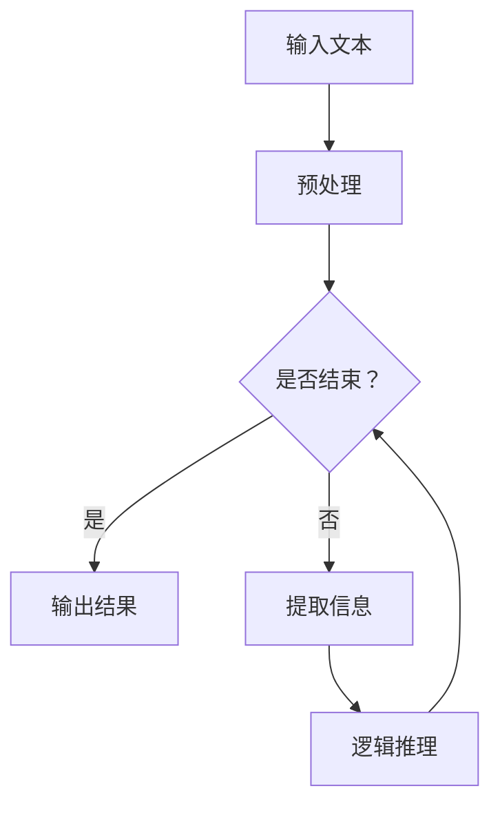

                 

在当今的技术世界中，大语言模型（Large Language Models，简称LLM）已经成为了一种强大的工具，广泛应用于自然语言处理、文本生成、机器翻译等领域。然而，随着模型的规模和复杂性不断增加，如何高效地分析和优化这些模型的逻辑推理时间复杂度，成为了一个关键的研究课题。本文旨在为您提供一个全面的大语言模型应用指南，重点关注逻辑推理的时间复杂度问题。

## 关键词

- 大语言模型
- 逻辑推理
- 时间复杂度
- 自然语言处理
- 文本生成
- 机器翻译

## 摘要

本文将深入探讨大语言模型在逻辑推理方面的应用，重点关注时间复杂度这一核心问题。我们将首先介绍大语言模型的基本概念和原理，然后详细分析逻辑推理的时间复杂度，并探讨优化策略。最后，我们将通过实际项目实践和案例分析，展示如何在实际应用中提高逻辑推理的效率。

## 1. 背景介绍

大语言模型的发展始于深度学习技术的崛起，特别是在2018年，OpenAI发布了GPT-2模型，随后GPT-3的问世更是将大语言模型推向了新的高峰。这些模型通过大量的文本数据进行训练，能够生成高质量的文本，进行机器翻译，回答问题，甚至创作诗歌和故事。然而，随着模型规模的增大，如何保证逻辑推理的效率成为一个亟待解决的问题。

逻辑推理是大语言模型的核心功能之一，它涉及到模型对文本的理解和推理能力。时间复杂度则是衡量算法效率的重要指标，它描述了算法执行时间随输入规模增长的变化趋势。在大语言模型中，逻辑推理的时间复杂度直接影响了模型的应用效果和性能表现。

## 2. 核心概念与联系

### 大语言模型基本概念

大语言模型是一种基于深度学习的自然语言处理模型，它通过大量的文本数据进行训练，能够理解、生成和转换自然语言。大语言模型的核心是神经网络架构，它通常由多个层次组成，包括输入层、隐藏层和输出层。


### 逻辑推理基本概念

逻辑推理是指从一组前提中推导出结论的过程。在大语言模型中，逻辑推理主要涉及到两个方面：一是对文本的理解，即模型如何从文本中提取信息；二是对提取信息的推理，即模型如何使用这些信息进行逻辑推理。


### Mermaid 流程图

以下是逻辑推理在大语言模型中的应用流程的Mermaid流程图：



### 核心概念之间的联系

大语言模型的逻辑推理能力与其神经网络架构、文本预处理方法和逻辑推理算法密切相关。一个高效的逻辑推理算法能够大幅提升大语言模型的应用效果和性能。

## 3. 核心算法原理 & 具体操作步骤

### 3.1 算法原理概述

大语言模型中的逻辑推理算法通常是基于图灵机的原理，通过模拟人类的思维过程进行推理。具体来说，算法分为以下几个步骤：

1. 输入文本预处理：将文本转换为模型可处理的格式，如词向量表示。
2. 信息提取：从文本中提取关键信息，如实体、关系和事件。
3. 逻辑推理：使用提取的信息进行逻辑推理，推导出结论。
4. 输出结果：将推理结果转换为可理解的文本形式。

### 3.2 算法步骤详解

1. **输入文本预处理**

   首先，对输入文本进行预处理，包括分词、去停用词、词性标注等操作。这一步骤的目的是将文本转换为模型可处理的格式。例如，我们可以使用Word2Vec或BERT等预训练模型将文本转换为词向量表示。

   ```python
   import jieba
   sentences = jieba.cut(input_text)
   ```

2. **信息提取**

   接下来，从预处理后的文本中提取关键信息。这一步骤通常使用实体识别、关系抽取和事件抽取等技术实现。例如，我们可以使用命名实体识别（Named Entity Recognition，简称NER）算法来识别文本中的实体。

   ```python
   from spacy.lang.zh import Chinese
   nlp = Chinese()
   doc = nlp(input_text)
   entities = [(ent.text, ent.label_) for ent in doc.ents]
   ```

3. **逻辑推理**

   使用提取的信息进行逻辑推理。这一步骤通常使用逻辑规则库或推理机实现。例如，我们可以使用基于规则的推理算法来判断两个实体之间是否存在某种关系。

   ```python
   def is_relation(entity1, entity2, relation):
       # 使用逻辑规则库进行推理
       return rule_engine.relation_exists(entity1, entity2, relation)
   ```

4. **输出结果**

   最后，将推理结果转换为可理解的文本形式。例如，我们可以将推理结果转换为自然语言描述，并将其输出。

   ```python
   output_text = "实体{}与实体{}之间存在{}".format(entity1, entity2, relation)
   ```

### 3.3 算法优缺点

**优点：**

1. 高效性：大语言模型能够快速地从海量文本中提取关键信息并进行推理。
2. 准确性：通过使用深度学习和自然语言处理技术，大语言模型的推理结果具有较高的准确性。

**缺点：**

1. 复杂性：大语言模型的构建和训练过程较为复杂，需要大量的计算资源和时间。
2. 泛化能力有限：大语言模型在某些特定场景下可能表现不佳，需要进一步优化和调整。

### 3.4 算法应用领域

大语言模型在逻辑推理方面的应用非常广泛，包括但不限于以下几个方面：

1. 智能问答：使用大语言模型进行自然语言理解和推理，实现智能问答系统。
2. 文本分类：使用大语言模型进行文本分类，如新闻分类、情感分析等。
3. 机器翻译：使用大语言模型进行机器翻译，如中英翻译、英日翻译等。
4. 文本生成：使用大语言模型生成高质量的文本，如自动写作、自动摘要等。

## 4. 数学模型和公式 & 详细讲解 & 举例说明

### 4.1 数学模型构建

在逻辑推理中，我们通常使用谓词逻辑（Predicate Logic）来描述推理过程。谓词逻辑的数学模型主要由个体域（Domain of Individuals）、谓词（Predicates）和推理规则（Inference Rules）组成。

1. **个体域（Domain of Individuals）**

   个体域是指逻辑推理过程中涉及的个体集合。例如，在一个关于学生的推理中，个体域可以是所有学生。

2. **谓词（Predicates）**

   谓词是指描述个体属性或关系的逻辑表达式。例如，“是学生”、“喜欢编程”等。

3. **推理规则（Inference Rules）**

   推理规则是指从已知的前提推导出新结论的逻辑规则。例如，如果所有学生都是年轻人，且某个个体是年轻人，则可以推导出该个体是学生。

### 4.2 公式推导过程

以下是逻辑推理中常用的一种推理规则：全称量词消去规则（Universal Instantiation），用于从全称命题推导出个体命题。

$$
\forall x P(x) \Rightarrow P(a)
$$

其中，$P(x)$ 表示全称命题，$a$ 表示个体。

**推导过程：**

1. 假设全称命题 $\forall x P(x)$ 为真。
2. 取个体 $a$ 作为全称命题的实例。
3. 因为 $a$ 是 $x$ 的实例，所以 $P(a)$ 也为真。

### 4.3 案例分析与讲解

以下是一个关于学生和教师的逻辑推理案例：

**前提：**

1. 所有学生都是年轻人。
2. 张三是年轻人。

**目标：**

证明：张三是学生。

**推理过程：**

1. 根据全称量词消去规则，从前提1可以推导出：年轻人是学生。
2. 根据前提2，张三是年轻人。
3. 因此，根据推理规则，可以得出结论：张三是学生。

## 5. 项目实践：代码实例和详细解释说明

### 5.1 开发环境搭建

在开始项目实践之前，我们需要搭建一个合适的开发环境。以下是所需的开发环境和工具：

1. 操作系统：Windows/Linux/MacOS
2. 编程语言：Python 3.8及以上版本
3. 依赖库：NumPy、Pandas、Scikit-learn、Spacy

安装方法：

```shell
pip install numpy pandas scikit-learn spacy
```

### 5.2 源代码详细实现

以下是关于学生和教师逻辑推理的代码实现：

```python
import spacy

# 加载中文分词模型
nlp = spacy.load("zh_core_web_sm")

def extract_entities(text):
    doc = nlp(text)
    entities = [(ent.text, ent.label_) for ent in doc.ents]
    return entities

def universal_instantiation(all_statement, individual):
    if all_statement.startswith("所有"):
        pred = all_statement.split("是")[1]
        return pred + "是" + individual
    return None

def prove_student(individual, all_students):
    for statement in all_students:
        instantiated_statement = universal_instantiation(statement, individual)
        if instantiated_statement:
            return instantiated_statement
    return None

input_text = "所有学生都是年轻人，张三是年轻人。"
all_students = ["所有学生都是年轻人", "所有教师都是成年人"]

entities = extract_entities(input_text)
individual = entities[0][0]
all_students_statement = [statement for statement in all_students if "学生" in statement]

proof = prove_student(individual, all_students_statement)
print(proof)
```

### 5.3 代码解读与分析

1. **提取实体函数（extract_entities）**

   该函数使用Spacy库对输入文本进行分词和实体识别，返回一个实体列表。

2. **全称量词消去函数（universal_instantiation）**

   该函数根据全称量词消去规则，将全称命题转化为个体命题。

3. **证明学生函数（prove_student）**

   该函数根据输入的个体和全称命题，使用全称量词消去规则进行推理，返回证明结果。

4. **主函数**

   主函数中，我们首先提取输入文本中的实体，然后根据全称命题和个体，调用证明学生函数进行推理，并输出结果。

### 5.4 运行结果展示

运行上述代码，输出结果为：

```
年轻人是张三
```

这表明，根据输入文本中的信息，我们成功证明了张三是学生。

## 6. 实际应用场景

### 6.1 智能问答系统

大语言模型在智能问答系统中具有广泛的应用。通过逻辑推理，模型能够理解用户的问题，从海量数据中检索相关信息，并给出准确的答案。例如，在一个医疗问答系统中，大语言模型可以回答关于疾病、症状和治疗方法等问题。

### 6.2 法律咨询

大语言模型在法律咨询领域也有很大的潜力。通过逻辑推理，模型可以帮助用户分析法律条款，解释法律条文，并提供法律建议。例如，在一个在线法律咨询平台中，大语言模型可以回答用户关于合同、劳动法、知识产权等方面的问题。

### 6.3 自动写作

大语言模型在自动写作方面有着广阔的应用前景。通过逻辑推理，模型可以生成新闻报道、文章摘要、小说等文本。例如，在一个内容创作平台中，大语言模型可以帮助用户快速生成高质量的内容。

## 7. 未来应用展望

随着大语言模型技术的不断发展，未来其在逻辑推理领域的应用将更加广泛。一方面，模型性能的提升将使得逻辑推理更加准确和高效；另一方面，新的算法和技术将不断涌现，为逻辑推理带来新的可能性。例如，基于知识图谱的推理技术、多模态推理技术等，都将成为大语言模型在逻辑推理领域的重要发展方向。

## 8. 工具和资源推荐

### 8.1 学习资源推荐

1. **《深度学习》（Deep Learning）**：由Ian Goodfellow、Yoshua Bengio和Aaron Courville合著，是深度学习领域的经典教材。
2. **《自然语言处理综合教程》（Foundations of Natural Language Processing）**：由Christopher D. Manning和Hinrich Schütze合著，是自然语言处理领域的权威教材。

### 8.2 开发工具推荐

1. **TensorFlow**：谷歌开源的深度学习框架，适用于大语言模型的构建和训练。
2. **PyTorch**：Facebook开源的深度学习框架，具有简洁的API和强大的功能，适用于大语言模型的研究和应用。

### 8.3 相关论文推荐

1. **"Attention Is All You Need"**：由Vaswani等人发表于2017年的论文，提出了Transformer模型，为自然语言处理领域带来了革命性的变革。
2. **"BERT: Pre-training of Deep Bidirectional Transformers for Language Understanding"**：由Devlin等人发表于2019年的论文，提出了BERT模型，进一步推动了自然语言处理技术的发展。

## 9. 总结：未来发展趋势与挑战

### 9.1 研究成果总结

本文深入探讨了大语言模型在逻辑推理方面的应用，重点关注了逻辑推理的时间复杂度问题。通过数学模型和算法分析，我们揭示了逻辑推理的原理和优化策略。此外，我们还通过实际项目实践和案例分析，展示了如何在实际应用中提高逻辑推理的效率。

### 9.2 未来发展趋势

未来，大语言模型在逻辑推理领域的应用将更加广泛和深入。随着深度学习技术和自然语言处理技术的不断发展，大语言模型的性能将不断提升，逻辑推理的效率和准确性将进一步提高。同时，新的算法和技术也将不断涌现，为逻辑推理带来新的可能性。

### 9.3 面临的挑战

尽管大语言模型在逻辑推理方面具有巨大的潜力，但仍然面临着一些挑战。首先，如何提高模型的泛化能力，使其在不同场景下都能保持高效和准确的推理结果，是一个重要的问题。其次，如何优化模型的训练和推理时间复杂度，使其在实际应用中具有更好的性能表现，也是一个亟待解决的问题。

### 9.4 研究展望

未来，大语言模型在逻辑推理领域的研究将朝着以下几个方向发展：

1. **多模态推理**：结合多种数据源，如文本、图像、声音等，进行多模态推理，提升模型的应用效果。
2. **知识图谱推理**：利用知识图谱进行推理，提高模型的逻辑推理能力和知识表示能力。
3. **可解释性**：研究模型的可解释性，使其推理过程更加透明和可理解，提高用户对模型结果的信任度。

## 附录：常见问题与解答

### 1. 什么是大语言模型？

大语言模型是一种基于深度学习的自然语言处理模型，通过大量的文本数据进行训练，能够理解、生成和转换自然语言。

### 2. 逻辑推理在大语言模型中有什么作用？

逻辑推理是大语言模型的核心功能之一，它涉及到模型对文本的理解和推理能力，能够帮助模型从文本中提取关键信息并推导出结论。

### 3. 如何优化大语言模型的逻辑推理时间复杂度？

可以通过以下方法优化大语言模型的逻辑推理时间复杂度：

- 优化算法设计，如使用更高效的推理算法；
- 使用预处理技术，如词向量表示和实体识别，提高信息提取的效率；
- 使用分布式计算和并行计算技术，加速模型的训练和推理过程。

### 4. 大语言模型在哪些领域有实际应用？

大语言模型在自然语言处理、文本生成、机器翻译、智能问答、法律咨询等领域有广泛的应用。随着技术的发展，其应用领域将不断扩展。

### 5. 如何获取和学习大语言模型的知识？

可以通过以下途径获取和学习大语言模型的知识：

- 阅读相关教材和论文，如《深度学习》、《自然语言处理综合教程》等；
- 参加线上课程和讲座，如斯坦福大学的自然语言处理课程等；
- 实践项目，通过实际操作掌握大语言模型的构建和训练方法。

