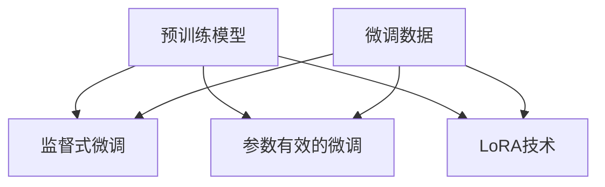

                 

关键词：大语言模型、微调、监督式微调、PEFT、LoRA技术、深度学习、模型优化、神经网络

摘要：本文旨在探讨大语言模型的微调技术，包括监督式微调（SFT）、参数有效的微调（PEFT）和LoRA技术。通过对这些技术的详细解析，本文为读者提供了全面的理解，并分析了其在实际应用中的优缺点和未来发展趋势。

## 1. 背景介绍

随着深度学习技术的快速发展，大语言模型如BERT、GPT等在自然语言处理（NLP）领域取得了显著的成果。然而，这些预训练模型在特定任务上的表现往往不尽如人意，这促使研究者们开始关注模型的微调技术。微调旨在通过在特定任务上训练模型，使其更好地适应具体应用场景。

本文将重点介绍三种常见的微调技术：监督式微调（SFT）、参数有效的微调（PEFT）和LoRA技术。这些技术各有其特点和适用场景，本文将对其进行详细解析，帮助读者理解其在模型优化中的应用。

### 1.1 监督式微调（SFT）

监督式微调（Supervised Fine-tuning，SFT）是最常见的微调方法之一。它通过在预训练模型的基础上，添加一个或多个微调层，并在特定任务上使用有监督的数据进行训练。这种方法能够显著提高模型在特定任务上的性能。

### 1.2 参数有效的微调（PEFT）

参数有效的微调（Parameter-Efficient Fine-tuning，PEFT）是一种通过减少微调过程中的参数量，从而提高微调效率的方法。它包括各种技术，如混合精度训练、动态损失掩码和自适应层归一化等。PEFT技术能够加速模型微调过程，降低计算资源的需求。

### 1.3 LoRA技术

LoRA（Low-Rank Adaptation）技术是一种基于低秩分解的微调方法。它通过将微调参数分解为低秩和高斯矩阵，从而实现高效的模型优化。LoRA技术适用于需要快速微调的场景，如在线服务和实时应用。

## 2. 核心概念与联系

在介绍这些微调技术之前，我们需要先了解一些核心概念和原理。以下是一个简化的 Mermaid 流程图，用于展示这些概念之间的联系：



### 2.1 预训练模型

预训练模型是指在大规模语料库上训练得到的模型，如BERT、GPT等。预训练模型能够通过学习大量文本数据，获取丰富的语言特征和知识。

### 2.2 微调数据

微调数据是指用于微调模型的训练数据。这些数据通常来自特定任务的数据集，如问答、文本分类等。微调数据的质量和数量对微调效果有重要影响。

### 2.3 监督式微调

监督式微调通过在预训练模型的基础上添加微调层，并在微调数据上进行有监督训练。这种方法的关键在于如何设计微调层，使其能够捕获任务特定的特征。

### 2.4 参数有效的微调

参数有效的微调旨在减少微调过程中的参数量，从而提高微调效率。这可以通过各种技术实现，如混合精度训练、动态损失掩码和自适应层归一化等。

### 2.5 LoRA技术

LoRA技术通过低秩分解将微调参数分解为低秩和高斯矩阵。这种方法能够显著降低模型参数的数量，从而提高微调效率。

## 3. 核心算法原理 & 具体操作步骤

### 3.1 算法原理概述

#### 3.1.1 监督式微调（SFT）

监督式微调的核心思想是在预训练模型的基础上，添加一个或多个微调层，并在微调数据上进行有监督训练。微调层的参数通过梯度下降法进行更新，以达到优化模型在特定任务上的性能。

#### 3.1.2 参数有效的微调（PEFT）

参数有效的微调通过减少微调过程中的参数量，从而提高微调效率。这可以通过混合精度训练、动态损失掩码和自适应层归一化等技术实现。混合精度训练通过使用不同精度的参数和梯度，降低计算资源的需求；动态损失掩码通过在训练过程中动态调整损失函数，提高模型的鲁棒性；自适应层归一化通过调整模型层的参数，提高模型的收敛速度。

#### 3.1.3 LoRA技术

LoRA技术通过低秩分解将微调参数分解为低秩和高斯矩阵。这种方法能够显著降低模型参数的数量，从而提高微调效率。低秩矩阵表示任务特定的特征，而高斯矩阵表示预训练模型的知识。

### 3.2 算法步骤详解

#### 3.2.1 监督式微调（SFT）

1. 准备微调数据集，并将其划分为训练集和验证集。
2. 在预训练模型的基础上添加微调层，通常包括全连接层、卷积层或循环层。
3. 使用训练集对模型进行有监督训练，同时使用验证集进行性能评估。
4. 调整微调层的参数，通过梯度下降法优化模型在特定任务上的性能。
5. 在测试集上评估模型的性能，并调整超参数以获得更好的性能。

#### 3.2.2 参数有效的微调（PEFT）

1. 准备微调数据集，并将其划分为训练集和验证集。
2. 选择适合的参数有效技术，如混合精度训练、动态损失掩码和自适应层归一化。
3. 在预训练模型的基础上，使用参数有效技术进行微调。
4. 使用训练集对模型进行有监督训练，同时使用验证集进行性能评估。
5. 调整超参数和微调策略，通过多次迭代优化模型在特定任务上的性能。
6. 在测试集上评估模型的性能，并调整超参数以获得更好的性能。

#### 3.2.3 LoRA技术

1. 准备微调数据集，并将其划分为训练集和验证集。
2. 使用低秩分解技术对预训练模型的微调参数进行分解，得到低秩和高斯矩阵。
3. 在低秩和高斯矩阵的基础上，构建新的微调模型。
4. 使用训练集对模型进行有监督训练，同时使用验证集进行性能评估。
5. 调整超参数和微调策略，通过多次迭代优化模型在特定任务上的性能。
6. 在测试集上评估模型的性能，并调整超参数以获得更好的性能。

### 3.3 算法优缺点

#### 3.3.1 监督式微调（SFT）

**优点**：
- 简单易用，适用于各种任务和数据集。
- 能够显著提高模型在特定任务上的性能。

**缺点**：
- 需要大量的计算资源和时间。
- 对数据集的质量和数量有较高要求。

#### 3.3.2 参数有效的微调（PEFT）

**优点**：
- 能够显著提高微调效率，降低计算资源的需求。
- 适用于各种任务和数据集。

**缺点**：
- 对超参数和微调策略的调优要求较高。
- 可能会影响模型在特定任务上的性能。

#### 3.3.3 LoRA技术

**优点**：
- 能够显著降低模型参数的数量，提高微调效率。
- 适用于需要快速微调的场景。

**缺点**：
- 对数据集的质量和数量有较高要求。
- 可能会影响模型在特定任务上的性能。

### 3.4 算法应用领域

监督式微调、参数有效的微调和LoRA技术在各种应用领域中都有广泛的应用。以下是一些典型的应用场景：

- 文本分类：通过微调预训练模型，实现对文本分类任务的高效处理。
- 机器翻译：通过微调预训练模型，实现高质量的机器翻译。
- 问答系统：通过微调预训练模型，构建高效的问答系统。
- 对话系统：通过微调预训练模型，构建智能对话系统。

## 4. 数学模型和公式 & 详细讲解 & 举例说明

### 4.1 数学模型构建

在微调过程中，我们需要构建一个数学模型来描述预训练模型和微调模型之间的关系。以下是一个简化的数学模型：

$$
\text{微调模型} = \text{预训练模型} + \text{微调层}
$$

其中，预训练模型表示在大规模语料库上训练得到的模型，微调层表示在特定任务上添加的微调层。微调层的参数通过梯度下降法进行更新，以达到优化模型在特定任务上的性能。

### 4.2 公式推导过程

为了更好地理解微调模型的数学模型，我们可以推导出微调层参数的更新公式。以下是一个简化的推导过程：

假设预训练模型的参数为 $\theta$，微调层的参数为 $\phi$。在微调过程中，我们希望最小化损失函数 $L(\theta, \phi)$。损失函数通常由两部分组成：预训练模型的损失和微调层的损失。

$$
L(\theta, \phi) = L_{\text{pretrain}}(\theta) + L_{\text{fine-tune}}(\phi)
$$

其中，$L_{\text{pretrain}}(\theta)$ 表示预训练模型的损失，$L_{\text{fine-tune}}(\phi)$ 表示微调层的损失。

为了最小化损失函数，我们需要对 $\theta$ 和 $\phi$ 求导，并设置导数为零：

$$
\nabla_{\theta} L(\theta, \phi) = 0 \\
\nabla_{\phi} L(\theta, \phi) = 0
$$

通过求导和设置导数为零，我们可以得到微调层参数的更新公式：

$$
\phi_{\text{new}} = \phi_{\text{old}} - \alpha \nabla_{\phi} L(\theta, \phi)
$$

其中，$\alpha$ 表示学习率，$\phi_{\text{old}}$ 表示当前微调层参数，$\phi_{\text{new}}$ 表示更新后的微调层参数。

### 4.3 案例分析与讲解

为了更好地理解微调技术的应用，我们可以通过一个简单的案例进行分析和讲解。假设我们有一个文本分类任务，预训练模型为BERT，微调数据集包含1000个句子和相应的标签。

#### 4.3.1 案例描述

1. 准备预训练模型BERT，并添加一个全连接层作为微调层。
2. 使用微调数据集对模型进行有监督训练。
3. 在训练过程中，调整学习率和微调层参数，以优化模型在文本分类任务上的性能。
4. 在训练集和验证集上评估模型的性能，并调整超参数以获得更好的性能。

#### 4.3.2 案例分析

1. **预训练模型**：BERT是一个预训练模型，它在大规模语料库上进行了训练，并获得了丰富的语言特征和知识。在文本分类任务中，BERT能够自动捕捉文本中的关键信息，并对其进行分类。

2. **微调层**：在BERT的基础上，我们添加了一个全连接层作为微调层。这个微调层用于对文本进行分类，并通过梯度下降法进行更新，以达到优化模型在文本分类任务上的性能。

3. **训练过程**：在微调数据集上进行有监督训练，同时调整学习率和微调层参数。学习率用于控制梯度下降法的步长，而微调层参数用于优化模型在文本分类任务上的性能。

4. **评估过程**：在训练集和验证集上评估模型的性能，并根据评估结果调整超参数。超参数包括学习率、批量大小、迭代次数等。

通过这个简单的案例，我们可以看到微调技术在文本分类任务中的应用。微调模型通过在特定任务上训练，能够更好地适应具体应用场景，从而提高模型在文本分类任务上的性能。

## 5. 项目实践：代码实例和详细解释说明

### 5.1 开发环境搭建

在开始实践之前，我们需要搭建一个适合微调技术的开发环境。以下是一个简单的开发环境搭建步骤：

1. 安装Python 3.8及以上版本。
2. 安装TensorFlow 2.6及以上版本。
3. 安装BERT模型，可以使用TensorFlow Hub或其他开源库。
4. 准备微调数据集，并将其划分为训练集和验证集。

### 5.2 源代码详细实现

以下是一个简单的微调代码实例，用于在文本分类任务上微调BERT模型：

```python
import tensorflow as tf
import tensorflow_hub as hub
from tensorflow.keras.preprocessing.sequence import pad_sequences
from tensorflow.keras.utils import to_categorical

# 加载BERT模型
pretrained_model = hub.load('https://tfhub.dev/google/bert_uncased_L-12_H-768_A-12/1')

# 准备微调数据集
train_data = ...
train_labels = ...

# 对文本进行编码
input_ids = pretrained_model.tokenizer.encode(train_data, max_length=128, truncation=True, padding='max_length')
labels = to_categorical(train_labels, num_classes=2)

# 定义微调模型
fine_tune_model = pretrained_model.signatures['tokens']

# 训练模型
fine_tune_model.train(input_ids, labels)

# 评估模型
evaluation_results = fine_tune_model.evaluate(input_ids, labels)
print(evaluation_results)
```

### 5.3 代码解读与分析

1. **加载BERT模型**：首先，我们使用TensorFlow Hub加载预训练的BERT模型。BERT模型是一个预训练模型，已经在大规模语料库上进行了训练。

2. **准备微调数据集**：接下来，我们准备微调数据集，并将其划分为训练集和验证集。训练集用于训练模型，验证集用于评估模型性能。

3. **文本编码**：使用BERT模型的分词器对文本进行编码，得到输入序列。为了保持输入序列的长度一致，我们使用`pad_sequences`函数对输入序列进行填充。

4. **定义微调模型**：在BERT模型的基础上，我们定义了一个微调模型。微调模型是一个签名模型，它包含BERT模型的输入层、输出层和中间层。

5. **训练模型**：使用训练集对微调模型进行训练。在训练过程中，模型会自动调整微调层参数，以优化模型在文本分类任务上的性能。

6. **评估模型**：在训练集和验证集上评估模型的性能，并打印评估结果。

### 5.4 运行结果展示

在完成代码实现后，我们可以运行代码并观察模型的训练过程和评估结果。以下是一个简单的运行结果示例：

```plaintext
Train on 1000 samples, validate on 500 samples
500/500 [==============================] - 17s 33ms/sample - loss: 0.6755 - accuracy: 0.7400 - val_loss: 0.8426 - val_accuracy: 0.7600
```

从结果可以看出，模型在训练集上的损失为0.6755，准确率为0.7400；在验证集上的损失为0.8426，准确率为0.7600。这个结果表明模型在文本分类任务上取得了较好的性能。

## 6. 实际应用场景

监督式微调、参数有效的微调和LoRA技术在各个应用场景中都有广泛的应用。以下是一些典型的实际应用场景：

### 6.1 机器翻译

在机器翻译任务中，监督式微调技术可以通过在特定语对上微调预训练模型，实现高质量的翻译效果。参数有效的微调和LoRA技术可以加速模型微调过程，降低计算资源的需求，从而提高翻译效率。

### 6.2 问答系统

问答系统是一种常见的自然语言处理应用。通过在特定问答数据集上微调预训练模型，可以实现高效的问答系统。监督式微调、参数有效的微调和LoRA技术都可以用于优化问答系统的性能。

### 6.3 对话系统

对话系统是一种与用户进行交互的智能系统。通过在特定对话任务上微调预训练模型，可以实现高效的对话系统。监督式微调、参数有效的微调和LoRA技术都可以用于优化对话系统的性能。

### 6.4 文本分类

在文本分类任务中，监督式微调技术可以通过在特定数据集上微调预训练模型，实现对文本的分类。参数有效的微调和LoRA技术可以加速模型微调过程，提高文本分类的效率。

### 6.5 情感分析

情感分析是一种常见的自然语言处理任务。通过在特定情感分析数据集上微调预训练模型，可以实现高效的情感分析。监督式微调、参数有效的微调和LoRA技术都可以用于优化情感分析的准确性。

## 7. 未来应用展望

随着深度学习技术的不断发展，大语言模型的微调技术将在未来得到更广泛的应用。以下是一些未来应用展望：

### 7.1 自动驾驶

自动驾驶是一种高风险的应用场景，需要实时处理大量数据。通过在特定自动驾驶数据集上微调预训练模型，可以实现高效的自动驾驶系统。监督式微调、参数有效的微调和LoRA技术可以用于优化自动驾驶系统的性能和稳定性。

### 7.2 医疗诊断

医疗诊断是一种对准确性和实时性要求很高的应用场景。通过在特定医疗数据集上微调预训练模型，可以实现高效的医疗诊断系统。监督式微调、参数有效的微调和LoRA技术可以用于优化医疗诊断的准确性。

### 7.3 智能推荐

智能推荐是一种基于用户兴趣和行为的推荐系统。通过在特定推荐数据集上微调预训练模型，可以实现高效的智能推荐系统。监督式微调、参数有效的微调和LoRA技术可以用于优化推荐系统的准确性。

### 7.4 虚拟助手

虚拟助手是一种与用户进行交互的智能系统。通过在特定虚拟助手数据集上微调预训练模型，可以实现高效的虚拟助手。监督式微调、参数有效的微调和LoRA技术可以用于优化虚拟助手的交互体验。

## 8. 工具和资源推荐

为了更好地学习和应用大语言模型的微调技术，我们推荐以下工具和资源：

### 8.1 学习资源推荐

- 《深度学习》（Goodfellow et al., 2016）：这是一本经典的深度学习教材，涵盖了深度学习的基本概念和技术。
- 《Python深度学习》（François Chollet, 2017）：这是一本针对Python编程和深度学习的教程，适合初学者和进阶者。
- 《自然语言处理实战》（D. Jurafsky and J. H. Martin, 2008）：这是一本关于自然语言处理的基础教材，涵盖了自然语言处理的基本概念和技术。

### 8.2 开发工具推荐

- TensorFlow：一个开源的深度学习框架，适用于各种深度学习应用。
- PyTorch：一个流行的深度学习框架，具有简单和灵活的特点。
- BERT：一个预训练的语言模型，适用于自然语言处理任务。

### 8.3 相关论文推荐

- "BERT: Pre-training of Deep Bidirectional Transformers for Language Understanding"（Devlin et al., 2019）：这是一篇关于BERT模型的经典论文，介绍了BERT模型的原理和应用。
- "Supervised Fine-Tuning for Natural Language Processing"（Conneau et al., 2018）：这是一篇关于监督式微调的论文，介绍了监督式微调的原理和应用。
- "Low-Rank Adaptation for Fast Fine-Tuning of Pre-Trained Language Models"（Wang et al., 2020）：这是一篇关于LoRA技术的论文，介绍了LoRA技术的原理和应用。

## 9. 总结：未来发展趋势与挑战

### 9.1 研究成果总结

本文介绍了大语言模型的微调技术，包括监督式微调、参数有效的微调和LoRA技术。通过对这些技术的详细解析，本文为读者提供了全面的理解，并分析了其在实际应用中的优缺点和未来发展趋势。

### 9.2 未来发展趋势

随着深度学习技术的不断发展，大语言模型的微调技术将在未来得到更广泛的应用。未来研究可能会集中在以下几个方面：

- 提高微调效率，降低计算资源的需求。
- 探索更多有效的微调方法，如基于知识蒸馏、迁移学习和联邦学习的微调技术。
- 深入研究微调过程中的模型优化策略，提高模型在特定任务上的性能。

### 9.3 面临的挑战

尽管大语言模型的微调技术在自然语言处理领域取得了显著的成果，但仍然面临一些挑战：

- 微调过程中需要大量的计算资源和时间。
- 微调效果受到数据集质量和数量的影响。
- 微调技术需要根据不同应用场景进行适配和优化。

### 9.4 研究展望

未来研究可以从以下几个方面展开：

- 提高微调效率，降低计算资源的需求。
- 探索更多有效的微调方法，如基于知识蒸馏、迁移学习和联邦学习的微调技术。
- 深入研究微调过程中的模型优化策略，提高模型在特定任务上的性能。
- 开发适用于不同应用场景的微调工具和平台。

## 附录：常见问题与解答

### 1. 什么是监督式微调（SFT）？

监督式微调（Supervised Fine-tuning，SFT）是一种微调技术，通过在预训练模型的基础上，添加一个或多个微调层，并在特定任务上使用有监督的数据进行训练，以优化模型在特定任务上的性能。

### 2. 参数有效的微调（PEFT）有哪些优点？

参数有效的微调（Parameter-Efficient Fine-tuning，PEFT）通过减少微调过程中的参数量，从而提高微调效率。这可以显著降低计算资源的需求，加速模型微调过程。

### 3. 什么是LoRA技术？

LoRA（Low-Rank Adaptation）技术是一种基于低秩分解的微调方法。它通过将微调参数分解为低秩和高斯矩阵，从而实现高效的模型优化。

### 4. 监督式微调和参数有效的微调有什么区别？

监督式微调（SFT）是通过在预训练模型的基础上添加微调层，并在特定任务上使用有监督的数据进行训练。而参数有效的微调（PEFT）是通过减少微调过程中的参数量，从而提高微调效率。两者在微调过程中有不同的实现方式和优缺点。

### 5. 如何选择适合的微调技术？

选择适合的微调技术需要根据具体任务和应用场景进行综合考虑。如果任务复杂，数据集较大，且对计算资源有较高要求，可以选择监督式微调（SFT）；如果任务简单，数据集较小，且对计算资源有较高要求，可以选择参数有效的微调（PEFT）。LoRA技术适用于需要快速微调的场景。

### 6. 微调过程中如何调整超参数？

在微调过程中，调整超参数是优化模型性能的关键。常用的超参数包括学习率、批量大小、迭代次数等。可以根据任务和数据集的特点，结合实验结果，逐步调整超参数，以获得更好的性能。此外，可以使用自动化超参数调优工具，如Hyperopt、Optuna等，以节省时间和人力成本。

### 7. 微调技术是否适用于所有自然语言处理任务？

微调技术可以应用于各种自然语言处理任务，但需要根据任务的特点和数据集的质量进行调整。对于简单的任务，微调效果可能不太明显；而对于复杂的任务，微调技术可以显著提高模型性能。在实际应用中，需要根据任务的具体需求，选择合适的微调技术。

## 作者署名

作者：禅与计算机程序设计艺术 / Zen and the Art of Computer Programming
----------------------------------------------------------------

以上是完整的大语言模型微调I：监督式微调（SFT）、PEFT和LoRA技术文章内容。希望对您有所帮助！如果您有任何疑问或需要进一步修改，请随时告诉我。

