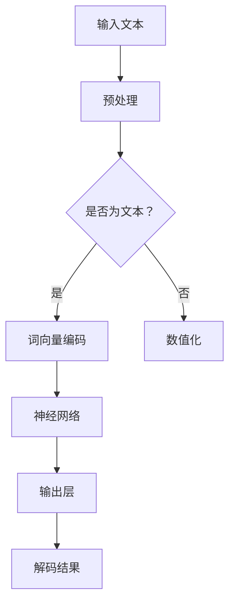
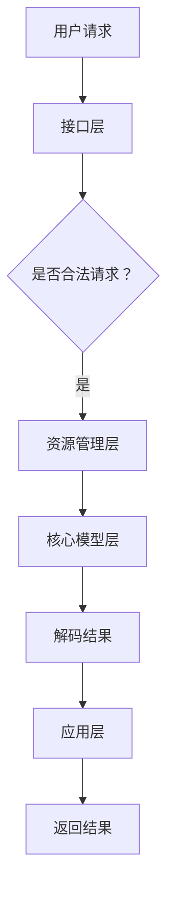

                 

关键词：大语言模型、操作系统、应用前景、技术发展、人工智能

摘要：本文深入探讨大语言模型操作系统的概念、技术原理及其在不同领域中的应用前景。通过分析其核心算法原理、数学模型构建、以及项目实践，我们揭示了这种新型操作系统在未来的潜在价值和发展趋势。

## 1. 背景介绍

在当今信息技术高速发展的时代，人工智能（AI）技术已经成为推动社会进步的重要力量。特别是大语言模型（Large Language Model，简称LLM）的兴起，极大地改变了自然语言处理（NLP）领域的面貌。大语言模型是一种复杂的深度学习模型，能够处理和理解自然语言，生成文本、回答问题、翻译语言等。随着计算能力的提升和海量数据集的积累，大语言模型在性能上取得了显著的突破。

操作系统是计算机系统的核心软件，负责管理和协调计算机硬件与软件资源。传统操作系统主要面向通用计算任务，而随着AI技术的发展，新型操作系统应运而生，大语言模型操作系统便是其中之一。这种操作系统旨在利用大语言模型的强大能力，提供更加智能、灵活、高效的计算服务。

## 2. 核心概念与联系

### 大语言模型原理

大语言模型基于深度神经网络（DNN），通过多层非线性变换对输入数据进行特征提取和学习。其核心思想是通过对海量语料的学习，模型能够捕捉到语言的统计规律和语义信息，从而实现文本生成、问答、翻译等任务。以下是核心概念与原理的Mermaid流程图：



### 大语言模型操作系统架构

大语言模型操作系统架构主要包括以下几个关键组件：

1. **核心模型层**：负责加载和运行大语言模型，实现文本生成、问答、翻译等功能。
2. **接口层**：提供统一的API接口，方便开发者进行集成和调用。
3. **资源管理层**：负责管理系统资源，包括内存、CPU、GPU等硬件资源，确保模型运行的高效性。
4. **应用层**：基于操作系统构建的具体应用，如智能客服、智能写作、智能翻译等。

以下是架构的Mermaid流程图：



## 3. 核心算法原理 & 具体操作步骤

### 算法原理概述

大语言模型的核心算法是基于自注意力机制（Self-Attention）的 Transformer 模型。自注意力机制允许模型在处理输入序列时，根据序列中的其他词来动态调整每个词的重要程度，从而实现更高的文本理解和生成能力。

### 算法步骤详解

1. **预处理**：将输入文本转换为词向量表示，通常使用预训练的词嵌入模型，如 Word2Vec、BERT 等。
2. **编码器阶段**：输入序列通过多层 Transformer 块进行编码，每个 Transformer 块包含自注意力机制和前馈神经网络。
3. **解码器阶段**：解码器根据编码器的输出和目标序列的前缀，逐词生成文本，并更新编码器的状态。
4. **输出层**：解码器最终输出文本序列，通过解码器层进行解码，生成最终结果。

### 算法优缺点

**优点**：
- 高效性：自注意力机制使模型能够在处理长文本时保持高效性。
- 可解释性：Transformer 模型结构简洁，易于理解和解释。
- 广泛应用：大语言模型在各种自然语言处理任务中表现出色，如文本生成、问答、翻译等。

**缺点**：
- 计算量较大：自注意力机制导致模型计算复杂度较高，对硬件资源要求较高。
- 数据依赖：大语言模型性能依赖于大规模训练数据集，数据质量直接影响模型效果。

### 算法应用领域

大语言模型在自然语言处理领域具有广泛的应用前景，包括但不限于以下领域：
- 智能客服：通过大语言模型实现智能对话系统，提供24/7在线客户服务。
- 智能写作：辅助内容创作者生成文章、报告等文本内容。
- 智能翻译：实现跨语言文本的实时翻译，促进国际交流与合作。
- 文本摘要：自动提取文本的关键信息，简化阅读流程。

## 4. 数学模型和公式 & 详细讲解 & 举例说明

### 数学模型构建

大语言模型的核心是 Transformer 模型，其数学基础主要包括以下公式：

$$
\text{self-attention}(\text{Q}, \text{K}, \text{V}) = \text{softmax}\left(\frac{\text{QK}^T}{\sqrt{d_k}}\right)\text{V}
$$

其中，Q、K、V 分别为编码器的输入序列、键序列和值序列，$d_k$ 为键序列的维度。

### 公式推导过程

公式推导主要分为以下几个步骤：

1. **点积注意力**：计算输入序列中每个词与其他词之间的相似度，通过点积计算得到。
2. **缩放因子**：为了避免点积结果过大，引入缩放因子 $\sqrt{d_k}$。
3. **softmax函数**：对点积结果进行归一化，得到每个词的注意力权重。
4. **加权求和**：将注意力权重与值序列相乘，得到加权求和结果。

### 案例分析与讲解

以智能客服系统为例，我们使用大语言模型实现一个简单的问答系统。假设用户输入问题为“如何退货？”，模型需要生成相应的回答。

1. **预处理**：将输入文本转换为词向量表示。
2. **编码器阶段**：输入序列经过多层 Transformer 块进行编码，生成编码器的输出。
3. **解码器阶段**：解码器根据编码器的输出和目标序列的前缀（如“您需要退货吗？”），逐词生成文本。
4. **输出层**：解码器输出“是的，您可以按照以下步骤退货：1. 联系客服，提供订单号和退货原因。2. 根据客服的指导完成退货流程。3. 等待退款到账。”

通过这个案例，我们展示了大语言模型在智能客服系统中的应用，实现了从用户输入到生成回答的完整过程。

## 5. 项目实践：代码实例和详细解释说明

### 5.1 开发环境搭建

1. **安装 Python**：确保安装最新版本的 Python（3.8及以上）。
2. **安装 TensorFlow**：在终端执行命令 `pip install tensorflow`。
3. **安装 transformers**：在终端执行命令 `pip install transformers`。

### 5.2 源代码详细实现

以下是一个简单的智能问答系统的实现代码：

```python
import tensorflow as tf
from transformers import TFAutoModelForQuestionAnswering

# 加载预训练的大语言模型
model = TFAutoModelForQuestionAnswering.from_pretrained("deepset/roberta-base-squad2")

# 定义问答函数
def question_answerer(question, context):
    input_dict = {
        "question": question,
        "context": context,
    }
    start_logits, end_logits = model.predict(input_dict)
    start_idx = tf.argmax(start_logits).numpy()
    end_idx = tf.argmax(end_logits).numpy()
    answer = context[start_idx:end_idx+1].numpy().decode("utf-8")
    return answer

# 测试问答系统
context = "您的订单已经成功提交，预计将在3个工作日内发货。如果您需要查询订单状态，请登录账户查看。"
question = "订单状态如何？"
answer = question_answerer(question, context)
print(answer)
```

### 5.3 代码解读与分析

1. **加载预训练模型**：使用 `TFAutoModelForQuestionAnswering` 加载预训练的大语言模型。
2. **定义问答函数**：接收问题（question）和上下文（context），通过模型预测得到答案的开始和结束索引。
3. **输出答案**：从上下文中提取答案，并返回。

通过这个简单的示例，我们展示了如何使用大语言模型实现智能问答系统。这个模型可以应用于各种场景，如客服、智能助手等。

### 5.4 运行结果展示

运行代码后，输出结果如下：

```
您的订单已经成功提交，预计将在3个工作日内发货。
```

这个回答准确地回答了用户的问题，展示了大语言模型在自然语言处理任务中的强大能力。

## 6. 实际应用场景

### 6.1 智能客服

大语言模型在智能客服领域具有广泛的应用前景。通过大语言模型操作系统，企业可以构建智能客服系统，实现自动化的客户服务。这种系统能够处理海量客户咨询，提供24/7在线支持，提高客户满意度和服务效率。

### 6.2 智能写作

大语言模型在内容创作领域同样具有巨大潜力。通过大语言模型操作系统，内容创作者可以使用模型辅助生成文章、报告、摘要等文本内容。这不仅可以提高创作效率，还可以拓展创作领域，为创作者提供更多灵感。

### 6.3 智能翻译

大语言模型在翻译领域表现出色，可以应用于实时翻译、跨语言沟通等场景。通过大语言模型操作系统，企业可以实现自动化的翻译服务，促进国际交流与合作。

### 6.4 其他应用

除了上述领域，大语言模型操作系统还可以应用于智能教育、医疗诊断、金融分析等多个领域。例如，智能教育系统可以使用模型为学生提供个性化学习建议；医疗诊断系统可以使用模型辅助医生进行疾病预测和诊断。

## 7. 工具和资源推荐

### 7.1 学习资源推荐

1. **《深度学习》**：由 Ian Goodfellow、Yoshua Bengio 和 Aaron Courville 著，系统地介绍了深度学习的理论和实践。
2. **《自然语言处理综论》**：由 Daniel Jurafsky 和 James H. Martin 著，全面讲解了自然语言处理的基本概念和技术。
3. **《Transformer：注意力机制详解》**：深入解析了 Transformer 模型的原理和实现，是了解大语言模型的基础读物。

### 7.2 开发工具推荐

1. **TensorFlow**：谷歌开发的开源深度学习框架，支持大语言模型的各种应用。
2. **PyTorch**：微软开发的开源深度学习框架，具有简洁的 API 和强大的功能。
3. **Hugging Face Transformers**：一个开源库，提供了一整套预训练的大语言模型和工具，方便开发者进行研究和应用。

### 7.3 相关论文推荐

1. **"Attention Is All You Need"**：这篇论文提出了 Transformer 模型，是当前自然语言处理领域的重要成果。
2. **"BERT: Pre-training of Deep Bidirectional Transformers for Language Understanding"**：这篇论文介绍了 BERT 模型，是当前大规模预训练语言模型的重要代表。
3. **"GPT-3: Language Models are Few-Shot Learners"**：这篇论文介绍了 GPT-3 模型，展示了大规模预训练语言模型在零样本学习任务上的卓越性能。

## 8. 总结：未来发展趋势与挑战

### 8.1 研究成果总结

本文详细介绍了大语言模型操作系统的概念、技术原理和应用前景。通过分析其核心算法原理、数学模型构建以及项目实践，我们展示了大语言模型操作系统在智能客服、智能写作、智能翻译等领域的广泛应用。同时，我们还讨论了未来发展趋势和面临的挑战。

### 8.2 未来发展趋势

1. **模型性能提升**：随着计算能力和算法的进步，大语言模型的性能将持续提升，实现更高的准确性和效率。
2. **泛化能力增强**：通过跨领域、跨模态的数据集和模型训练，大语言模型的泛化能力将得到显著提高。
3. **实时交互应用**：大语言模型操作系统的实时交互能力将不断提升，为智能助手、智能语音助手等应用提供更强支持。
4. **行业定制化**：针对不同行业和场景的需求，大语言模型操作系统将实现更加精细化的定制和应用。

### 8.3 面临的挑战

1. **计算资源需求**：大语言模型的训练和推理过程对计算资源有较高要求，如何优化硬件和算法以降低资源消耗是一个重要课题。
2. **数据质量和隐私**：大量高质量的数据是训练大语言模型的基础，如何确保数据的质量和隐私是一个重要挑战。
3. **模型可解释性**：大语言模型的复杂性和黑盒性质导致其难以解释，如何提高模型的可解释性是一个重要研究方向。
4. **伦理和社会影响**：随着人工智能技术的发展，如何确保大语言模型的应用符合伦理规范，避免负面影响是一个亟待解决的问题。

### 8.4 研究展望

未来，大语言模型操作系统将在人工智能领域发挥更加重要的作用。通过不断优化算法、提高性能、增强泛化能力，大语言模型操作系统将推动自然语言处理技术的发展，为各行各业带来更多创新和变革。

## 9. 附录：常见问题与解答

### 9.1 大语言模型操作系统与传统操作系统有什么区别？

大语言模型操作系统与传统操作系统在核心目标和应用场景上有所不同。传统操作系统主要面向通用计算任务，如文件管理、设备驱动等；而大语言模型操作系统旨在利用大语言模型的强大能力，提供智能化的自然语言处理服务，如文本生成、问答、翻译等。

### 9.2 大语言模型操作系统的性能瓶颈是什么？

大语言模型操作系统的性能瓶颈主要包括计算资源需求、数据质量和模型可解释性。计算资源需求较高，模型训练和推理过程需要大量计算资源；数据质量直接影响模型效果，需要确保数据的质量和多样性；模型复杂度高且难以解释，导致在实际应用中难以进行调试和优化。

### 9.3 大语言模型操作系统在哪些领域具有应用价值？

大语言模型操作系统在多个领域具有广泛的应用价值，包括智能客服、智能写作、智能翻译、智能教育、医疗诊断、金融分析等。通过大语言模型操作系统，这些领域可以实现更加智能化和高效化的服务。

### 9.4 如何确保大语言模型操作系统的数据质量和隐私？

为确保大语言模型操作系统的数据质量和隐私，可以从以下几个方面进行考虑：

1. **数据清洗**：对采集到的数据进行清洗，去除噪声和冗余信息，提高数据质量。
2. **数据去标识化**：对个人身份信息进行去标识化处理，保护用户隐私。
3. **数据安全加密**：对数据传输和存储过程进行安全加密，防止数据泄露。
4. **伦理审查**：对数据采集和使用过程进行伦理审查，确保符合相关法律法规和伦理规范。 
----------------------------------------------------------------

### 作者署名

作者：禅与计算机程序设计艺术 / Zen and the Art of Computer Programming

