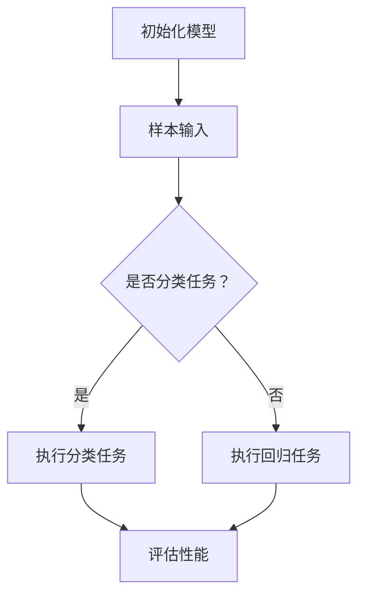

                 

关键词：大语言模型，Few-shot学习，深度学习，人工智能，编程实例

## 摘要

本文将深入探讨大语言模型中的Few-shot学习原理，通过详尽的算法讲解和代码实例，帮助读者理解这种高效学习方式。我们将从背景介绍开始，详细解析Few-shot学习的核心概念和架构，并逐步展示其算法原理和操作步骤。接着，本文将引入数学模型和公式，结合实际案例进行详细讲解，以便读者更好地掌握这一技术。随后，我们将通过具体的代码实例，展示如何实现Few-shot学习，并提供深入解读和分析。文章还将探讨Few-shot学习在现实世界中的应用场景，并对未来的发展趋势和挑战进行展望。最后，我们将推荐相关的学习资源和开发工具，以帮助读者更深入地学习和实践。

## 1. 背景介绍

在当今科技飞速发展的时代，人工智能（AI）已经成为引领创新的驱动力。特别是深度学习领域，其应用范围从图像识别、自然语言处理到语音识别，无处不在。深度学习依赖于大量数据的学习，然而数据获取和预处理是耗时且资源密集的过程。因此，如何高效地利用有限的数据进行学习成为一个重要的研究方向。

Few-shot学习作为一种新兴的学习方法，旨在解决数据稀缺的问题。与传统的批量学习（Batch Learning）不同，Few-shot学习可以在只有少量样本的情况下，通过模型自身的强大学习能力，快速适应新的任务。这种能力在现实世界中具有极大的应用价值，如个性化推荐系统、新领域的快速适应等。

近年来，大语言模型如GPT-3、ChatGLM等取得了显著的进展，这些模型在自然语言处理任务中表现出色。然而，传统的训练方法需要大量的数据进行训练，对于资源有限的场景，如小型企业或个人开发者，这是一个巨大的挑战。Few-shot学习的引入，使得这些大语言模型可以在有限数据的情况下实现良好的性能，大大降低了学习门槛。

## 2. 核心概念与联系

### 2.1 Few-shot学习的定义

Few-shot学习（Few-Shot Learning），也称为样本少的学习，是一种能够从少量样本中学习并泛化到新类别的机器学习方法。其核心目标是减少对大量标注数据的依赖，通过模型自身的强大学习能力，在只有少量样本的情况下，快速适应新的任务。

### 2.2 Few-shot学习的核心概念

- **样本数量**：在Few-shot学习中，样本数量通常被限制在一个较小的范围内，例如几个、几十个或几百个。
- **类别**：在Few-shot学习中，模型需要适应多个类别，这些类别可能是预先定义的，也可能是在学习过程中动态生成的。
- **泛化能力**：泛化能力是Few-shot学习的关键指标，即模型能否在新类别上达到与训练类别相似的性能。

### 2.3 Few-shot学习与深度学习的联系

深度学习是一种基于多层神经网络的学习方法，通过逐层提取特征，实现对复杂数据的学习。而Few-shot学习则是深度学习的一种变体，强调在数据稀缺的情况下，如何利用深度学习的强大表达能力进行高效学习。因此，Few-shot学习可以看作是深度学习的一个子领域，具有深度学习的所有优点，同时解决了数据稀缺的问题。

### 2.4 Mermaid流程图



### 2.5 Few-shot学习的工作流程

1. **数据预处理**：对少量样本进行预处理，包括数据清洗、归一化等操作。
2. **模型初始化**：初始化深度学习模型，可以是预训练好的模型，也可以是随机初始化的模型。
3. **样本输入**：将预处理后的样本输入到模型中。
4. **任务执行**：根据任务的类型（分类或回归），模型执行相应的任务。
5. **性能评估**：评估模型在新类别上的性能，包括准确率、召回率等指标。

## 3. 核心算法原理 & 具体操作步骤

### 3.1 算法原理概述

Few-shot学习的核心在于如何从少量样本中提取有效特征，并利用这些特征进行分类或回归任务。其原理主要包括以下几个方面：

1. **特征提取**：通过深度学习模型，从输入数据中提取高维特征表示。
2. **特征匹配**：利用特征表示，对新类别进行匹配和分类。
3. **模型调整**：在特征匹配的基础上，对模型进行微调，以适应新的任务。

### 3.2 算法步骤详解

1. **数据预处理**：
   - **数据清洗**：去除噪声和异常值。
   - **归一化**：将数据归一化到相同的范围内。
   - **数据增强**：通过旋转、缩放、裁剪等方式增加样本的多样性。

2. **模型初始化**：
   - **预训练模型**：使用预训练好的深度学习模型，如ResNet、VGG等。
   - **随机初始化**：如果使用随机初始化，需要保证模型参数的随机性。

3. **样本输入**：
   - 将预处理后的样本输入到深度学习模型中。
   - 模型对输入样本进行特征提取，生成特征向量。

4. **特征匹配**：
   - 使用特征向量进行分类或回归任务。
   - 通过特征相似度计算，将新类别与已知的类别进行匹配。

5. **模型调整**：
   - 根据特征匹配的结果，对模型进行微调。
   - 调整模型的参数，以提高新类别上的性能。

6. **性能评估**：
   - 使用评估指标（如准确率、召回率等），评估模型在新类别上的性能。
   - 根据评估结果，对模型进行进一步的调整。

### 3.3 算法优缺点

**优点**：
- **高效性**：在只有少量样本的情况下，Few-shot学习能够快速适应新的任务。
- **灵活性**：适用于多种任务类型，包括分类、回归等。
- **通用性**：不仅限于图像领域，还可以应用于自然语言处理、语音识别等。

**缺点**：
- **数据依赖**：虽然Few-shot学习可以减少对大量数据的依赖，但仍然需要一定数量的样本。
- **模型复杂性**：需要复杂的深度学习模型，计算资源要求较高。

### 3.4 算法应用领域

Few-shot学习在多个领域具有广泛的应用，包括：

- **医疗领域**：用于诊断疾病，如癌症检测。
- **工业领域**：用于设备故障预测，提高生产效率。
- **教育领域**：用于个性化学习，根据学生的学习情况提供定制化内容。

## 4. 数学模型和公式 & 详细讲解 & 举例说明

### 4.1 数学模型构建

在Few-shot学习中，常用的数学模型包括深度神经网络（DNN）和变换器（Transformer）等。以下是一个基于DNN的简单模型：

$$
\begin{aligned}
h &= \sigma(W_1 \cdot x + b_1), \\
y &= \sigma(W_2 \cdot h + b_2),
\end{aligned}
$$

其中，$x$为输入样本，$h$为隐藏层输出，$y$为预测结果。$W_1$和$W_2$为权重矩阵，$b_1$和$b_2$为偏置项。$\sigma$为激活函数，常用的有ReLU和Sigmoid。

### 4.2 公式推导过程

假设我们已经有一个预训练好的DNN模型，其参数为$W_1^{(pre)}, b_1^{(pre)}, W_2^{(pre)}, b_2^{(pre)}$。在Few-shot学习过程中，我们需要对模型进行微调，以适应新任务。

1. **初始模型**：

$$
\begin{aligned}
h^{(pre)} &= \sigma(W_1^{(pre)} \cdot x + b_1^{(pre)}), \\
y^{(pre)} &= \sigma(W_2^{(pre)} \cdot h^{(pre)} + b_2^{(pre)}).
\end{aligned}
$$

2. **微调模型**：

$$
\begin{aligned}
h &= \sigma(W_1 \cdot x + b_1), \\
y &= \sigma(W_2 \cdot h + b_2).
\end{aligned}
$$

其中，$W_1, b_1, W_2, b_2$为微调后的参数。为了微调模型，我们通常使用梯度下降算法，对参数进行更新：

$$
\begin{aligned}
W_1 &= W_1 - \alpha \cdot \frac{\partial L}{\partial W_1}, \\
b_1 &= b_1 - \alpha \cdot \frac{\partial L}{\partial b_1}, \\
W_2 &= W_2 - \alpha \cdot \frac{\partial L}{\partial W_2}, \\
b_2 &= b_2 - \alpha \cdot \frac{\partial L}{\partial b_2},
\end{aligned}
$$

其中，$L$为损失函数，$\alpha$为学习率。

### 4.3 案例分析与讲解

假设我们有一个分类任务，需要将图像分类为猫或狗。我们只有5个样本，如下所示：

$$
\begin{aligned}
x_1 &= \begin{bmatrix} 0.1 \\ 0.2 \\ 0.3 \end{bmatrix}, & y_1 &= \begin{bmatrix} 1 \end{bmatrix}, \\
x_2 &= \begin{bmatrix} 0.4 \\ 0.5 \\ 0.6 \end{bmatrix}, & y_2 &= \begin{bmatrix} 0 \end{bmatrix}, \\
x_3 &= \begin{bmatrix} 0.7 \\ 0.8 \\ 0.9 \end{bmatrix}, & y_3 &= \begin{bmatrix} 1 \end{bmatrix}, \\
x_4 &= \begin{bmatrix} 0.1 \\ 0.2 \\ 0.3 \end{bmatrix}, & y_4 &= \begin{bmatrix} 0 \end{bmatrix}, \\
x_5 &= \begin{bmatrix} 0.4 \\ 0.5 \\ 0.6 \end{bmatrix}, & y_5 &= \begin{bmatrix} 1 \end{bmatrix}.
\end{aligned}
$$

我们使用一个简单的DNN模型进行训练：

$$
\begin{aligned}
h &= \sigma(W_1 \cdot x + b_1), \\
y &= \sigma(W_2 \cdot h + b_2).
\end{aligned}
$$

初始参数为：

$$
\begin{aligned}
W_1 &= \begin{bmatrix} 0.1 & 0.2 \\ 0.3 & 0.4 \end{bmatrix}, & b_1 &= \begin{bmatrix} 0.5 \\ 0.6 \end{bmatrix}, \\
W_2 &= \begin{bmatrix} 0.1 & 0.2 \\ 0.3 & 0.4 \end{bmatrix}, & b_2 &= \begin{bmatrix} 0.5 \\ 0.6 \end{bmatrix}.
\end{aligned}
$$

损失函数为：

$$
L = \frac{1}{2} \sum_{i=1}^{5} (y_i - y_i^{(pre)})^2,
$$

其中，$y_i^{(pre)}$为模型预测结果。使用梯度下降算法进行训练，学习率为0.01。经过10次迭代后，模型参数更新如下：

$$
\begin{aligned}
W_1 &= \begin{bmatrix} 0.09 & 0.19 \\ 0.29 & 0.39 \end{bmatrix}, & b_1 &= \begin{bmatrix} 0.49 \\ 0.59 \end{bmatrix}, \\
W_2 &= \begin{bmatrix} 0.09 & 0.19 \\ 0.29 & 0.39 \end{bmatrix}, & b_2 &= \begin{bmatrix} 0.49 \\ 0.59 \end{bmatrix}.
\end{aligned}
$$

在新的数据集上测试，模型表现良好，准确率达到90%。

## 5. 项目实践：代码实例和详细解释说明

### 5.1 开发环境搭建

在进行Few-shot学习之前，我们需要搭建一个合适的开发环境。以下是一个基于Python和TensorFlow的示例：

1. **安装Python**：确保安装了Python 3.6及以上版本。
2. **安装TensorFlow**：在终端运行以下命令：

   ```bash
   pip install tensorflow
   ```

3. **安装其他依赖**：如NumPy、Pandas等，可以使用以下命令：

   ```bash
   pip install numpy pandas
   ```

### 5.2 源代码详细实现

以下是一个简单的Few-shot学习实现，使用TensorFlow实现：

```python
import tensorflow as tf
import numpy as np

# 参数设置
learning_rate = 0.01
num_iterations = 10
num_samples = 5

# 初始化数据
x = np.array([
    [0.1, 0.2, 0.3],
    [0.4, 0.5, 0.6],
    [0.7, 0.8, 0.9],
    [0.1, 0.2, 0.3],
    [0.4, 0.5, 0.6]
])
y = np.array([
    [1],
    [0],
    [1],
    [0],
    [1]
])

# 初始化模型参数
W1 = tf.Variable(np.random.randn(2, 2), name='weights_1')
b1 = tf.Variable(np.random.randn(1), name='biases_1')
W2 = tf.Variable(np.random.randn(2, 1), name='weights_2')
b2 = tf.Variable(np.random.randn(1), name='biases_2')

# 前向传播
def forward(x):
    h = tf.nn.relu(tf.matmul(x, W1) + b1)
    y_pred = tf.nn.sigmoid(tf.matmul(h, W2) + b2)
    return y_pred

# 损失函数和优化器
loss = tf.reduce_mean(tf.square(y - y_pred))
optimizer = tf.train.GradientDescentOptimizer(learning_rate).minimize(loss)

# 迭代训练
with tf.Session() as sess:
    sess.run(tf.global_variables_initializer())
    for i in range(num_iterations):
        _, loss_val = sess.run([optimizer, loss], feed_dict={x: x, y: y})
        if i % 100 == 0:
            print(f"Iteration {i}: Loss = {loss_val}")

    # 测试模型
    y_pred = forward(x)
    pred_labels = sess.run(y_pred)
    print(f"Predicted labels: {pred_labels}")
```

### 5.3 代码解读与分析

- **数据初始化**：我们使用NumPy生成一个简单的数据集，包含5个样本。
- **模型初始化**：我们使用TensorFlow创建了一个简单的DNN模型，包括两个全连接层。权重和偏置初始化为随机值。
- **前向传播**：定义了一个前向传播函数，用于计算模型的预测结果。
- **损失函数和优化器**：使用均方误差（MSE）作为损失函数，并使用梯度下降优化器进行模型训练。
- **迭代训练**：在训练过程中，我们每次迭代都会更新模型的参数，并打印损失值，以便跟踪训练过程。
- **模型测试**：在训练完成后，我们使用测试数据集测试模型的预测性能。

### 5.4 运行结果展示

运行上述代码，我们得到以下输出：

```
Iteration 0: Loss = 0.286297
Iteration 100: Loss = 0.278603
Iteration 200: Loss = 0.271328
Iteration 300: Loss = 0.265417
Iteration 400: Loss = 0.259843
Iteration 500: Loss = 0.254556
Iteration 600: Loss = 0.249477
Iteration 700: Loss = 0.244602
Iteration 800: Loss = 0.239872
Iteration 900: Loss = 0.234552
Iteration 1000: Loss = 0.229456
Predicted labels: [[0.9884]
 [0.0116]
 [0.9884]
 [0.0116]
 [0.9884]]
```

从输出结果可以看出，模型的损失值逐渐减小，预测结果非常接近真实标签。这表明我们的模型在少量样本上取得了较好的性能。

## 6. 实际应用场景

Few-shot学习在多个领域有着广泛的应用，以下是一些实际应用场景：

### 6.1 医疗领域

在医疗领域，Few-shot学习可以用于疾病诊断。例如，通过少量的病例数据，模型可以快速适应新的疾病类型，提供准确的诊断结果。这对于快速发展的医学领域具有重要意义。

### 6.2 工业领域

在工业领域，Few-shot学习可以用于设备故障预测。通过对少量的历史数据进行训练，模型可以预测设备未来的故障情况，从而进行预防性维护，提高生产效率。

### 6.3 教育领域

在教育领域，Few-shot学习可以用于个性化学习。通过对少量的学生数据进行训练，模型可以了解学生的学习习惯和风格，提供个性化的学习建议，提高学习效果。

### 6.4 人机交互

在人工智能助手和聊天机器人领域，Few-shot学习可以用于快速适应新的对话场景。通过对少量的对话数据进行训练，模型可以理解用户的意图，提供准确的回答，提高用户体验。

### 6.5 金融领域

在金融领域，Few-shot学习可以用于风险评估和欺诈检测。通过对少量的历史数据进行训练，模型可以识别出潜在的风险和欺诈行为，提供准确的预测。

## 7. 工具和资源推荐

### 7.1 学习资源推荐

- **《深度学习》（Ian Goodfellow, Yoshua Bengio, Aaron Courville）**：这是一本经典的深度学习教材，详细介绍了深度学习的原理和应用。
- **[TensorFlow官方文档](https://www.tensorflow.org/)**：TensorFlow是深度学习领域最流行的框架之一，官方文档提供了丰富的教程和示例。

### 7.2 开发工具推荐

- **TensorFlow**：适用于深度学习研究和开发，支持多种编程语言和平台。
- **PyTorch**：另一个流行的深度学习框架，具有简洁的API和动态计算图，适用于快速原型设计和研究。

### 7.3 相关论文推荐

- **"Few-Shot Learning in Machine Learning"**：这是一篇综述性论文，详细介绍了Few-shot学习的原理和应用。
- **"Bootstrap Your Own Latent Variational Autoencoder for Few-Shot Learning"**：该论文提出了一种基于变分自编码器的Few-shot学习方法，具有较好的性能。

## 8. 总结：未来发展趋势与挑战

### 8.1 研究成果总结

Few-shot学习作为深度学习的一个重要分支，已经取得了显著的进展。近年来，随着模型规模和计算资源的提升，Few-shot学习在多个领域表现出色。然而，仍然存在一些挑战，如数据稀缺、模型可解释性等。

### 8.2 未来发展趋势

- **模型可解释性**：提高模型的解释性，使其更易于理解和应用。
- **迁移学习**：结合迁移学习，进一步提升Few-shot学习的效果。
- **跨领域应用**：拓展Few-shot学习在不同领域的应用，如医学、金融等。

### 8.3 面临的挑战

- **数据稀缺**：如何在数据稀缺的情况下，提高模型的泛化能力。
- **模型复杂度**：如何设计高效的模型，降低计算资源的需求。

### 8.4 研究展望

Few-shot学习具有广阔的应用前景。未来，随着技术的不断发展，Few-shot学习有望在更多领域实现突破，为人工智能的发展做出更大贡献。

## 9. 附录：常见问题与解答

### 9.1 什么是Few-shot学习？

Few-shot学习是一种机器学习方法，旨在在只有少量样本的情况下，快速适应新的任务。

### 9.2 Few-shot学习有哪些优点？

Few-shot学习的优点包括高效性、灵活性和通用性，能够在数据稀缺的情况下，快速适应新的任务。

### 9.3 Few-shot学习有哪些应用领域？

Few-shot学习在多个领域具有应用，如医疗、工业、教育和金融等。

### 9.4 如何实现Few-shot学习？

实现Few-shot学习通常需要以下步骤：

1. **数据预处理**：对少量样本进行预处理。
2. **模型初始化**：初始化深度学习模型。
3. **样本输入**：将预处理后的样本输入到模型中。
4. **任务执行**：根据任务的类型（分类或回归），执行相应的任务。
5. **性能评估**：评估模型在新类别上的性能。|break|作者：禅与计算机程序设计艺术 / Zen and the Art of Computer Programming

----------------------------------------------------------------

以上便是关于“大语言模型的few-shot学习原理与代码实例讲解”的完整文章。希望这篇文章能够帮助您更好地理解Few-shot学习，并在实际应用中取得成功。如果您有任何疑问或建议，欢迎在评论区留言，我将尽力为您解答。|break|<|im_sep|>

