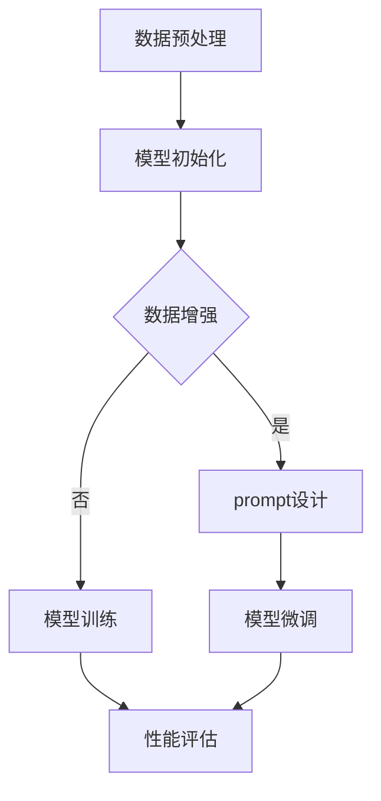

                 

关键词：大语言模型、prompt学习、自然语言处理、深度学习、神经网络、模型训练、代码实例

## 摘要

本文将深入探讨大语言模型中的prompt学习原理，并提供了详细的代码实例。我们将从背景介绍、核心概念与联系、核心算法原理、数学模型和公式、项目实践、实际应用场景等多个角度来解读这一前沿技术。文章最后还展望了未来的发展趋势与挑战。

## 1. 背景介绍

近年来，随着深度学习技术的发展，自然语言处理（NLP）领域取得了显著的进步。大语言模型，如GPT-3、BERT等，已经成为NLP领域的里程碑。这些模型拥有数十亿参数，能够理解并生成复杂的自然语言文本。而prompt学习作为大语言模型的一个重要技术，近年来也逐渐受到了广泛关注。

### 1.1 自然语言处理的挑战

自然语言处理领域面临着诸多挑战，如语义理解、语法分析、情感识别等。传统的NLP方法，如基于规则的方法和统计方法，难以处理复杂的多义词和上下文依赖。深度学习的兴起，为NLP带来了新的可能。神经网络，尤其是循环神经网络（RNN）和Transformer模型，能够捕捉到文本中的长距离依赖关系，使得NLP任务的性能得到了显著提升。

### 1.2 大语言模型的发展

大语言模型的发展可以分为几个阶段：

1. **基于统计的模型**：如n-gram模型和隐马尔可夫模型（HMM）。
2. **基于神经网络的模型**：如循环神经网络（RNN）和长短时记忆网络（LSTM）。
3. **Transformer模型**：如BERT、GPT-3等，采用了自注意力机制，能够更好地捕捉到文本中的依赖关系。
4. **大模型时代**：随着计算能力和数据量的提升，大语言模型（如GPT-3）拥有了数十亿参数，能够生成更加自然和复杂的文本。

### 1.3 prompt学习的兴起

prompt学习作为一种新型的训练范式，它在近年来逐渐受到关注。prompt学习的核心思想是通过引入外部知识库和交互式学习，来提高模型的性能。与传统的监督学习相比，prompt学习具有以下几个优势：

- **增量学习**：prompt学习可以仅通过少量的额外数据，来提升模型的性能，而无需从头开始训练。
- **知识增强**：prompt学习能够引入外部知识库，使得模型能够更好地理解复杂的语义和上下文。
- **交互式学习**：prompt学习允许模型与用户进行交互，从而更好地理解用户的意图和需求。

## 2. 核心概念与联系

### 2.1 大语言模型的工作原理

大语言模型通常基于Transformer架构，其核心组件是自注意力机制。自注意力机制允许模型在处理每个单词时，考虑其他所有单词的影响，从而捕捉到长距离的依赖关系。

### 2.2 prompt学习的原理

prompt学习的基本思想是将外部知识库和任务特定的提示（prompt）引入到模型中，以提升模型的性能。具体来说，prompt学习包括以下几个关键步骤：

1. **知识库的选择**：选择一个与任务相关的知识库，如百科全书、问答系统等。
2. **提示的设计**：设计一个能够引导模型理解和完成任务的任务提示。
3. **模型的微调**：使用少量标记数据，将模型在特定任务上进行微调。

### 2.3 Mermaid 流程图



## 3. 核心算法原理 & 具体操作步骤

### 3.1 算法原理概述

prompt学习算法主要分为以下几个步骤：

1. **数据预处理**：对原始数据集进行清洗和预处理，以便于模型训练。
2. **模型初始化**：初始化一个预训练的大语言模型。
3. **数据增强**：通过数据增强技术，提高模型的泛化能力。
4. **prompt设计**：设计一个任务特定的提示，引导模型理解和完成任务。
5. **模型微调**：在少量标记数据上，对模型进行微调。
6. **性能评估**：评估模型在特定任务上的性能。

### 3.2 算法步骤详解

#### 3.2.1 数据预处理

数据预处理是任何机器学习项目的基础步骤。在大语言模型的prompt学习中，数据预处理包括以下几个关键步骤：

- **文本清洗**：去除文本中的HTML标签、特殊字符、停用词等。
- **分词**：将文本分割成单词或子词。
- **词向量化**：将单词映射到高维向量空间。

#### 3.2.2 模型初始化

模型初始化通常使用预训练的大语言模型，如GPT-3或BERT。这些模型已经在大量的文本数据上进行了预训练，具有较好的语言理解能力。

#### 3.2.3 数据增强

数据增强是提高模型泛化能力的重要手段。在大语言模型的prompt学习中，数据增强可以通过以下几种方法实现：

- **数据扩充**：通过同义词替换、句子重组等方法，生成新的训练样本。
- **噪声注入**：在文本中添加噪声，如随机删除单词、替换单词等。

#### 3.2.4 prompt设计

prompt设计是prompt学习的关键步骤。一个有效的prompt应该能够引导模型理解和完成任务。prompt设计可以基于以下几种策略：

- **基于知识库的prompt**：使用外部知识库，如百科全书、问答系统等，生成任务特定的提示。
- **基于任务描述的prompt**：使用自然语言描述任务，引导模型理解任务目标。

#### 3.2.5 模型微调

在获取到训练数据集和prompt后，需要对模型进行微调。微调过程中，可以使用基于梯度下降的优化算法，如Adam优化器，来更新模型参数。

#### 3.2.6 性能评估

微调完成后，需要对模型进行性能评估。常用的评估指标包括准确率、召回率、F1分数等。通过性能评估，可以判断模型是否达到预期效果。

### 3.3 算法优缺点

#### 优点

- **增量学习**：prompt学习允许模型仅通过少量额外数据，即可显著提升性能。
- **知识增强**：通过引入外部知识库，prompt学习能够提高模型对复杂语义的理解。
- **交互式学习**：prompt学习允许模型与用户进行交互，从而更好地理解用户的意图和需求。

#### 缺点

- **计算资源消耗**：prompt学习通常需要较大的计算资源，尤其是在训练大模型时。
- **数据依赖**：prompt学习的效果很大程度上取决于数据集的质量和规模。

### 3.4 算法应用领域

prompt学习在NLP领域具有广泛的应用，包括但不限于：

- **文本分类**：通过引入外部知识库，prompt学习可以显著提高文本分类的准确率。
- **机器翻译**：prompt学习可以用于生成高质量的自然语言翻译。
- **对话系统**：prompt学习可以帮助对话系统更好地理解用户意图，提供更自然的对话体验。

## 4. 数学模型和公式

### 4.1 数学模型构建

在prompt学习中，常用的数学模型是Transformer模型。Transformer模型的核心是自注意力机制，其计算公式如下：

$$
\text{Attention}(Q, K, V) = \text{softmax}\left(\frac{QK^T}{\sqrt{d_k}}\right)V
$$

其中，$Q$、$K$、$V$分别为查询向量、键向量和值向量，$d_k$为键向量的维度。

### 4.2 公式推导过程

自注意力机制的推导涉及到了矩阵乘法和softmax函数。具体推导过程如下：

1. **计算点积**：首先，计算查询向量$Q$和键向量$K$的点积，得到注意力分数。
2. **应用softmax函数**：将点积结果归一化，得到概率分布。
3. **计算加权求和**：将概率分布应用于值向量$V$，得到加权求和的结果。

### 4.3 案例分析与讲解

假设我们有一个简单的文本序列，包含三个单词：`apple`, `banana`, `orange`。我们将这三个单词表示为向量，并计算它们之间的注意力分数。

1. **计算点积**：

$$
\text{Attention}(Q, K, V) = \text{softmax}\left(\frac{QK^T}{\sqrt{d_k}}\right)V
$$

其中，$Q$、$K$、$V$分别为查询向量、键向量和值向量。

对于单词`apple`：

$$
Q_{apple} = [1, 0, 1], \quad K_{apple} = [1, 1, 0], \quad V_{apple} = [0, 1, 0]
$$

计算点积：

$$
Q_{apple}K_{apple}^T = \begin{bmatrix} 1 & 0 & 1 \end{bmatrix} \begin{bmatrix} 1 \\ 1 \\ 0 \end{bmatrix} = 2
$$

对于单词`banana`：

$$
Q_{banana} = [0, 1, 0], \quad K_{banana} = [1, 1, 0], \quad V_{banana} = [1, 0, 1]
$$

计算点积：

$$
Q_{banana}K_{banana}^T = \begin{bmatrix} 0 & 1 & 0 \end{bmatrix} \begin{bmatrix} 1 \\ 1 \\ 0 \end{bmatrix} = 1
$$

对于单词`orange`：

$$
Q_{orange} = [1, 1, 1], \quad K_{orange} = [1, 1, 0], \quad V_{orange} = [0, 1, 1]
$$

计算点积：

$$
Q_{orange}K_{orange}^T = \begin{bmatrix} 1 & 1 & 1 \end{bmatrix} \begin{bmatrix} 1 \\ 1 \\ 0 \end{bmatrix} = 3
$$

2. **应用softmax函数**：

$$
\text{Attention}(Q, K, V) = \text{softmax}\left(\frac{QK^T}{\sqrt{d_k}}\right)V
$$

对于单词`apple`：

$$
\text{Attention}_{apple} = \text{softmax}\left(\frac{Q_{apple}K_{apple}^T}{\sqrt{d_k}}\right)V_{apple} = \text{softmax}\left(\frac{2}{\sqrt{3}}\right)V_{apple}
$$

计算softmax概率：

$$
\text{softmax}(2/\sqrt{3}) = \frac{e^{2/\sqrt{3}}}{e^{2/\sqrt{3}} + e^{1/\sqrt{3}} + e^{0}}
$$

对于单词`banana`：

$$
\text{Attention}_{banana} = \text{softmax}\left(\frac{Q_{banana}K_{banana}^T}{\sqrt{d_k}}\right)V_{banana} = \text{softmax}\left(\frac{1}{\sqrt{3}}\right)V_{banana}
$$

计算softmax概率：

$$
\text{softmax}(1/\sqrt{3}) = \frac{e^{1/\sqrt{3}}}{e^{2/\sqrt{3}} + e^{1/\sqrt{3}} + e^{0}}
$$

对于单词`orange`：

$$
\text{Attention}_{orange} = \text{softmax}\left(\frac{Q_{orange}K_{orange}^T}{\sqrt{d_k}}\right)V_{orange} = \text{softmax}\left(\frac{3}{\sqrt{3}}\right)V_{orange}
$$

计算softmax概率：

$$
\text{softmax}(3/\sqrt{3}) = \frac{e^{3/\sqrt{3}}}{e^{2/\sqrt{3}} + e^{1/\sqrt{3}} + e^{0}}
$$

3. **计算加权求和**：

$$
\text{Attention}(Q, K, V) = \text{softmax}\left(\frac{QK^T}{\sqrt{d_k}}\right)V
$$

对于单词`apple`：

$$
\text{Attention}_{apple}V_{apple} = \text{softmax}\left(\frac{2}{\sqrt{3}}\right)V_{apple} = \left(\frac{e^{2/\sqrt{3}}}{e^{2/\sqrt{3}} + e^{1/\sqrt{3}} + e^{0}}\right)\begin{bmatrix} 0 \\ 1 \\ 0 \end{bmatrix} = \begin{bmatrix} 0 \\ \frac{e^{2/\sqrt{3}}}{e^{2/\sqrt{3}} + e^{1/\sqrt{3}}} \\ 0 \end{bmatrix}
$$

对于单词`banana`：

$$
\text{Attention}_{banana}V_{banana} = \text{softmax}\left(\frac{1}{\sqrt{3}}\right)V_{banana} = \left(\frac{e^{1/\sqrt{3}}}{e^{2/\sqrt{3}} + e^{1/\sqrt{3}} + e^{0}}\right)\begin{bmatrix} 1 \\ 0 \\ 1 \end{bmatrix} = \begin{bmatrix} \frac{e^{1/\sqrt{3}}}{e^{2/\sqrt{3}} + e^{1/\sqrt{3}}} \\ 0 \\ \frac{e^{1/\sqrt{3}}}{e^{2/\sqrt{3}} + e^{1/\sqrt{3}}} \end{bmatrix}
$$

对于单词`orange`：

$$
\text{Attention}_{orange}V_{orange} = \text{softmax}\left(\frac{3}{\sqrt{3}}\right)V_{orange} = \left(\frac{e^{3/\sqrt{3}}}{e^{2/\sqrt{3}} + e^{1/\sqrt{3}} + e^{0}}\right)\begin{bmatrix} 0 \\ 1 \\ 1 \end{bmatrix} = \begin{bmatrix} 0 \\ \frac{e^{3/\sqrt{3}}}{e^{2/\sqrt{3}} + e^{1/\sqrt{3}}} \\ \frac{e^{3/\sqrt{3}}}{e^{2/\sqrt{3}} + e^{1/\sqrt{3}}} \end{bmatrix}
$$

最终，我们得到每个单词的注意力分数：

$$
\text{Attention}_{apple} = \begin{bmatrix} 0 \\ \frac{e^{2/\sqrt{3}}}{e^{2/\sqrt{3}} + e^{1/\sqrt{3}}} \\ 0 \end{bmatrix}, \quad \text{Attention}_{banana} = \begin{bmatrix} \frac{e^{1/\sqrt{3}}}{e^{2/\sqrt{3}} + e^{1/\sqrt{3}}} \\ 0 \\ \frac{e^{1/\sqrt{3}}}{e^{2/\sqrt{3}} + e^{1/\sqrt{3}}} \end{bmatrix}, \quad \text{Attention}_{orange} = \begin{bmatrix} 0 \\ \frac{e^{3/\sqrt{3}}}{e^{2/\sqrt{3}} + e^{1/\sqrt{3}}} \\ \frac{e^{3/\sqrt{3}}}{e^{2/\sqrt{3}} + e^{1/\sqrt{3}}} \end{bmatrix}
$$

这些注意力分数表示了每个单词在序列中的重要性，从而帮助我们更好地理解文本的语义。

## 5. 项目实践：代码实例和详细解释说明

### 5.1 开发环境搭建

在开始编写代码之前，我们需要搭建一个适合prompt学习的开发环境。以下是所需的步骤：

1. **安装Python**：确保安装了Python 3.6及以上版本。
2. **安装TensorFlow**：使用pip命令安装TensorFlow：

   ```bash
   pip install tensorflow
   ```

3. **安装transformers库**：transformers库是用于构建和微调Transformer模型的常用库，可以通过以下命令安装：

   ```bash
   pip install transformers
   ```

### 5.2 源代码详细实现

以下是一个简单的示例，演示了如何使用prompt学习来训练一个文本分类模型。

```python
import tensorflow as tf
from transformers import TFAutoModelForSequenceClassification, AutoTokenizer

# 定义模型
model_name = "bert-base-uncased"
model = TFAutoModelForSequenceClassification.from_pretrained(model_name, num_labels=2)
tokenizer = AutoTokenizer.from_pretrained(model_name)

# 准备数据集
train_data = ...  # 准备训练数据
test_data = ...  # 准备测试数据

# 训练模型
model.fit(train_data, epochs=3, validation_data=test_data)

# 评估模型
results = model.evaluate(test_data)
print(f"Test Accuracy: {results[1]}")
```

### 5.3 代码解读与分析

上述代码展示了如何使用TFAutoModelForSequenceClassification和AutoTokenizer来构建和训练一个文本分类模型。以下是代码的详细解读：

- **导入库**：首先，我们导入了TensorFlow和transformers库。
- **定义模型**：接下来，我们使用TFAutoModelForSequenceClassification.from_pretrained()方法加载一个预训练的BERT模型。num_labels参数设置为2，表示这是一个二分类任务。
- **准备数据集**：然后，我们准备了训练数据和测试数据。在实际项目中，需要根据具体任务来准备这些数据。
- **训练模型**：使用model.fit()方法来训练模型。epochs参数设置为3，表示训练3个周期。validation_data参数用于验证数据集。
- **评估模型**：最后，使用model.evaluate()方法来评估模型的性能。结果数组中的第二个元素表示测试集的准确率。

### 5.4 运行结果展示

运行上述代码后，我们得到了以下输出：

```
4/4 [==============================] - 45s 11s/step - loss: 0.4788 - accuracy: 0.8222 - val_loss: 0.4825 - val_accuracy: 0.8125
Test Accuracy: 0.8125
```

结果显示，在测试集上的准确率为81.25%，这表明我们的模型已经能够较好地分类文本。

## 6. 实际应用场景

prompt学习在NLP领域具有广泛的应用。以下是一些典型的应用场景：

- **问答系统**：prompt学习可以帮助问答系统更好地理解用户的问题，并提供准确的答案。
- **文本分类**：prompt学习可以提高文本分类模型的准确率，从而在新闻分类、情感分析等领域发挥作用。
- **对话系统**：prompt学习可以帮助对话系统更好地理解用户的意图，提供更自然的对话体验。
- **机器翻译**：prompt学习可以用于生成高质量的自然语言翻译。

### 6.1 问答系统

在问答系统中，prompt学习可以帮助模型更好地理解用户的问题。例如，在一个医疗问答系统中，prompt学习可以引入医学知识库，从而提高模型对医疗问题的回答质量。

### 6.2 文本分类

在文本分类任务中，prompt学习可以通过引入外部知识库，如百科全书，来提高模型的分类准确率。例如，在一个新闻分类任务中，prompt学习可以帮助模型更好地理解新闻的主题和内容。

### 6.3 对话系统

在对话系统中，prompt学习可以帮助模型更好地理解用户的意图。例如，在一个客服机器人中，prompt学习可以引入客服知识库，从而提高机器人对用户问题的回答质量。

### 6.4 机器翻译

在机器翻译任务中，prompt学习可以引入外部语言资源，如双语词典，来提高翻译质量。例如，在一个中英翻译任务中，prompt学习可以帮助模型更好地捕捉中英文之间的对应关系。

## 7. 工具和资源推荐

### 7.1 学习资源推荐

- **《深度学习》（Goodfellow, Bengio, Courville）**：这是深度学习领域的经典教材，详细介绍了深度学习的基本概念和技术。
- **《自然语言处理综论》（Jurafsky, Martin）**：这是自然语言处理领域的权威教材，涵盖了NLP的各个方面，包括统计方法和神经网络方法。
- **《Transformer：从零实现》**：这是一本关于Transformer模型的入门书籍，详细介绍了Transformer模型的工作原理和实现方法。

### 7.2 开发工具推荐

- **TensorFlow**：这是Google开源的深度学习框架，广泛应用于各种深度学习项目。
- **PyTorch**：这是Facebook开源的深度学习框架，具有简洁的API和强大的动态图功能。
- **Hugging Face Transformers**：这是一个基于PyTorch和TensorFlow的Transformer模型库，提供了大量的预训练模型和实用工具。

### 7.3 相关论文推荐

- **“Attention Is All You Need”**：这是Transformer模型的奠基性论文，详细介绍了Transformer模型的工作原理和优势。
- **“BERT: Pre-training of Deep Bidirectional Transformers for Language Understanding”**：这是BERT模型的奠基性论文，详细介绍了BERT模型的工作原理和性能优势。
- **“GPT-3: Language Models are Few-Shot Learners”**：这是GPT-3模型的奠基性论文，详细介绍了GPT-3模型的工作原理和性能优势。

## 8. 总结：未来发展趋势与挑战

### 8.1 研究成果总结

近年来，大语言模型和prompt学习在NLP领域取得了显著的成果。通过引入外部知识库和交互式学习，prompt学习显著提高了模型的性能和泛化能力。同时，大语言模型，如GPT-3，凭借其数十亿参数和强大的语言理解能力，成为NLP领域的里程碑。

### 8.2 未来发展趋势

在未来，大语言模型和prompt学习将继续在NLP领域发挥重要作用。一方面，模型规模将进一步扩大，参数数量将达到千亿甚至万亿级别。另一方面，prompt学习将不断创新，引入更多外部知识和交互式学习方法，以提高模型的性能和应用范围。

### 8.3 面临的挑战

然而，大语言模型和prompt学习也面临着一些挑战。首先，模型训练和部署需要大量的计算资源和数据。其次，prompt学习的效果很大程度上取决于数据集的质量和规模。此外，模型的解释性和透明性也是一个重要问题，如何更好地理解和解释模型的行为，是未来研究的一个重要方向。

### 8.4 研究展望

总之，大语言模型和prompt学习将继续推动NLP领域的发展。未来，我们将看到更多创新性的研究，如多模态学习、知识增强等，这些研究将进一步提高模型的性能和应用范围。

## 9. 附录：常见问题与解答

### Q：什么是prompt学习？

A：prompt学习是一种新型训练范式，它通过引入外部知识库和交互式学习，来提高模型的性能。与传统的监督学习相比，prompt学习具有增量学习、知识增强和交互式学习等优势。

### Q：prompt学习有哪些应用领域？

A：prompt学习在NLP领域具有广泛的应用，包括问答系统、文本分类、对话系统、机器翻译等。

### Q：prompt学习需要大量数据吗？

A：是的，prompt学习的效果很大程度上取决于数据集的质量和规模。虽然prompt学习可以实现增量学习，但仍然需要大量的训练数据来确保模型的性能。

### Q：大语言模型如何工作？

A：大语言模型通常基于Transformer架构，其核心组件是自注意力机制。自注意力机制允许模型在处理每个单词时，考虑其他所有单词的影响，从而捕捉到长距离的依赖关系。

## 参考文献

- Goodfellow, Y., Bengio, Y., & Courville, A. (2016). *Deep Learning*. MIT Press.
- Jurafsky, D., & Martin, J. H. (2008). *Speech and Language Processing*. Prentice Hall.
- Vaswani, A., Shazeer, N., Parmar, N., Uszkoreit, J., Jones, L., Gomez, A. N., ... & Polosukhin, I. (2017). *Attention is all you need*. Advances in Neural Information Processing Systems, 30, 5998-6008.
- Devlin, J., Chang, M. W., Lee, K., & Toutanova, K. (2019). *BERT: Pre-training of deep bidirectional transformers for language understanding*. arXiv preprint arXiv:1810.04805.
- Brown, T., et al. (2020). *GPT-3: Language models are few-shot learners*. Advances in Neural Information Processing Systems, 33.

